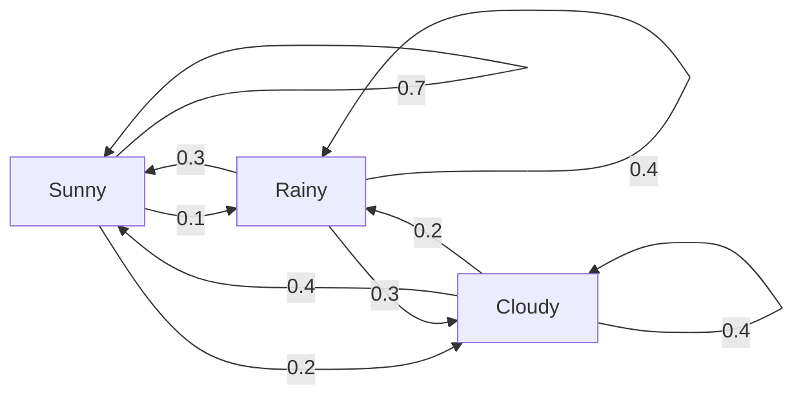
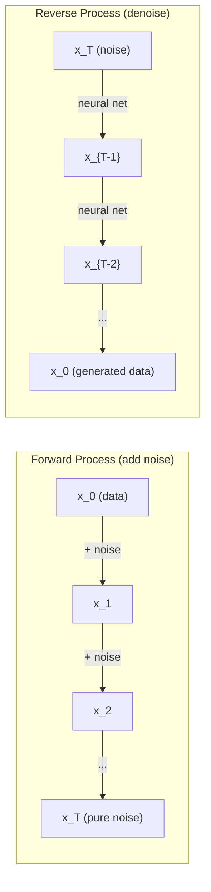

# 随机过程

> 具有结构的随机性：随机游走、Markov 链和扩散模型背后的数学。

**Type:** 学习
**Language:** Python
**Prerequisites:** 第 1 阶段，第 06–07 课（probability, Bayes）
**Time:** 约 75 分钟

## 学习目标

- 模拟一维和二维随机游走，并验证位移随 sqrt(n) 缩放
- 构建 Markov 链模拟器，并通过特征分解计算平稳分布
- 实现 Metropolis-Hastings MCMC 与 Langevin dynamics，从目标分布中采样
- 将前向扩散过程与 Brownian motion 联系起来，并解释反向过程如何生成数据

## 问题

许多 AI 系统都包含随时间演化的随机性。它不是静态随机性，而是具有结构和顺序的随机性，每一步都依赖此前发生的内容。

语言模型一次生成一个 token，每个 token 都依赖此前上下文。模型输出概率分布，从中采样，然后继续生成，这就是随机过程。

扩散模型逐步给图像添加噪声，直到它变成纯随机噪声；随后再反转这一过程，逐步去噪，最终生成新图像。前向过程是一条 Markov 链，反向过程则是一条学习得到、逆向运行的 Markov 链。

强化学习智能体会在环境中采取动作，每个动作以某种概率进入新状态。智能体在随机世界中遵循随机策略，整个系统就是 Markov 决策过程。

MCMC 采样是 Bayesian 推断的支柱，它会构造一条平稳分布恰好等于目标后验分布的 Markov 链。

这些方法都建立在四个基础思想上：
1. 随机游走——最简单的随机过程
2. Markov 链——由转移矩阵定义的结构化随机性
3. Langevin dynamics——带噪声的梯度下降
4. Metropolis-Hastings——从任意分布中采样

## 核心概念

### 随机游走

从位置 0 开始，每一步都抛一次公平硬币：正面向右移动（+1），反面向左移动（-1）。

n 步之后，位置等于 n 个随机 +/-1 值之和。期望位置为 0，因为游走没有偏向；但到原点的典型距离会按 sqrt(n) 增长。

这有些反直觉。游走是公平的，任一方向都不存在漂移，但随着时间推移，它仍会离起点越来越远。n 步后的标准差就是 sqrt(n)。

```
Step 0:  Position = 0
Step 1:  Position = +1 or -1
Step 2:  Position = +2, 0, or -2
...
Step 100: Expected distance from origin ~ 10 (sqrt(100))
Step 10000: Expected distance from origin ~ 100 (sqrt(10000))
```

**二维随机游走**每一步以相同概率向上、下、左、右移动，到原点的距离同样按 sqrt(n) 缩放，轨迹会形成类似分形的图案。

**为什么是 sqrt(n)？**每一步以相同概率取 +1 或 -1。n 步位置 S_n = X_1 + X_2 + ... + X_n，其中每个 X_i 都为 +/-1。单步方差为 1，各步相互独立，因此 Var(S_n) = n，标准差为 sqrt(n)。根据中心极限定理，S_n / sqrt(n) 会收敛到标准正态分布。

sqrt(n) 缩放在机器学习中随处可见：SGD 噪声按 1/sqrt(batch_size) 缩放，嵌入维度使用 sqrt(d) 缩放。平方根是独立随机增量相加时的标志。

**与 Brownian motion 的联系。**让随机游走每步大小为 1/sqrt(n)，每单位时间执行 n 步。当 n 趋于无穷时，随机游走会收敛到 Brownian motion B(t)：一个连续时间过程，其中 B(t) 服从均值 0、方差 t 的正态分布。

Brownian motion 是扩散的数学基础，用于模拟液体中粒子的随机抖动、股价波动，以及最重要的——扩散模型中的噪声过程。

**赌徒破产问题。**随机游走者从位置 k 出发，0 和 N 是吸收边界。先到达 N 而不是 0 的概率是多少？对于公平游走，P(reach N) = k/N。这个结果简单而优雅，并与 martingale 理论相关：公平随机游走是 martingale，未来期望值等于当前值。

### Markov 链

Markov 链根据固定概率在多个状态之间转移。其关键性质是：下一个状态只依赖当前状态，而不依赖历史。

```
P(X_{t+1} = j | X_t = i, X_{t-1} = ...) = P(X_{t+1} = j | X_t = i)
```

这就是 Markov 性质，它让我们可以用转移矩阵 P 描述整个动力学：

```
P[i][j] = probability of going from state i to state j
```

P 的每一行之和为 1，因为系统必须转移到某个状态。

**示例——天气：**

```
States: Sunny (0), Rainy (1), Cloudy (2)

P = [[0.7, 0.1, 0.2],    (if sunny: 70% sunny, 10% rainy, 20% cloudy)
     [0.3, 0.4, 0.3],    (if rainy: 30% sunny, 40% rainy, 30% cloudy)
     [0.4, 0.2, 0.4]]    (if cloudy: 40% sunny, 20% rainy, 40% cloudy)
```

从任意状态开始，经过许多次转移后，状态分布都会收敛到平稳分布 pi，其中 pi * P = pi。它是 P 对应特征值 1 的左特征向量。

天气链的平稳分布为 [0.55, 0.18, 0.27]。长期来看，无论初始天气如何，55% 的时间是晴天、18% 是雨天、27% 是阴天。



**计算平稳分布。**有两种方法：

1. **幂方法：**让任意初始分布反复乘以 P，足够多次后会收敛。
2. **特征值方法：**寻找 P 对应特征值 1 的左特征向量，也就是 P^T 对应特征值 1 的右特征向量。

两种方法都要求 Markov 链满足收敛条件。

**收敛条件。**如果 Markov 链满足以下性质，就会收敛到唯一平稳分布：
- **不可约：**每个状态都能到达其他任意状态
- **非周期：**链不会以固定周期循环

机器学习中遇到的大多数 Markov 链都满足这两个条件。

**吸收状态。**一旦进入后永远不会离开的状态称为吸收状态（P[i][i] = 1）。吸收 Markov 链用于建模含终止状态的过程，例如结束的游戏、流失客户、到达 end-of-text token 的 token 序列。

**混合时间。**需要多少步，链才会“接近”平稳分布？形式化定义是：与平稳分布的总变差距离下降到某个阈值以下所需的步数。快速混合表示只需少量步骤。P 的谱隙，即 1 减第二大特征值，控制混合时间；谱隙越大，混合越快。

### 与语言模型的联系

语言模型的 token 生成近似是一个 Markov 过程。给定当前上下文，模型输出下一个 token 的概率分布；温度控制分布尖锐程度：

```
P(token_i) = exp(logit_i / temperature) / sum(exp(logit_j / temperature))
```

- Temperature = 1.0：标准分布
- Temperature < 1.0：更尖锐、更确定
- Temperature > 1.0：更平坦、更随机
- Temperature -> 0：argmax，也就是贪心选择

Top-k 采样只保留概率最高的 k 个 token；top-p（nucleus）采样则保留累计概率超过 p 的最小 token 集合。二者都会修改 Markov 转移概率。

### 布朗运动（Brownian Motion）

Brownian motion 是随机游走的连续时间极限。位置 B(t) 具有三项性质：
1. B(0) = 0
2. 当 t > s 时，B(t) - B(s) 服从均值 0、方差 t - s 的正态分布
3. 不重叠时间区间上的增量相互独立

Brownian motion 的路径连续，却处处不可微，在每个尺度上都会抖动；平面中的路径具有分形维数 2。

离散模拟可以写成：

```
B(t + dt) = B(t) + sqrt(dt) * z,    where z ~ N(0, 1)
```

sqrt(dt) 缩放非常重要，它来自对随机游走应用中心极限定理。

### 朗之万动力学（Langevin Dynamics）

梯度下降寻找函数最小值，Langevin dynamics 则寻找与 exp(-U(x)/T) 成正比的概率分布，其中 U 是能量函数，T 是温度。

```
x_{t+1} = x_t - dt * gradient(U(x_t)) + sqrt(2 * T * dt) * z_t
```

粒子受到两种力：
1. **梯度力**（-dt * gradient(U)）：把粒子推向低能量区域，类似梯度下降
2. **随机力**（sqrt(2*T*dt) * z）：把粒子推向随机方向，用于探索

当 T = 0 时，它就是纯梯度下降；温度很高时，则几乎等同随机游走。温度适中时，粒子会探索能量曲面，并在低能量区域停留更长时间。

**与扩散模型的联系。**扩散模型的前向过程为：

```
x_t = sqrt(alpha_t) * x_{t-1} + sqrt(1 - alpha_t) * noise
```

这是一条逐渐把数据与噪声混合的 Markov 链。经过足够多步后，x_T 会成为纯 Gaussian 噪声。

从噪声返回数据的反向过程同样是 Markov 链，但其转移概率由神经网络学习。网络会预测每一步添加的噪声，再将其减去。



### MCMC：Markov Chain Monte Carlo

有时需要从一个可计算却无法直接采样的分布 p(x) 中采样，即使只知道它差一个常数的形式。Bayesian 后验是典型例子：似然乘先验可以计算，归一化常数却无法求出。

**Metropolis-Hastings** 会构造平稳分布为 p(x) 的 Markov 链：

1. 从某个位置 x 开始
2. 从提议分布 Q(x'|x) 提出新位置 x'
3. 计算接受率：a = p(x') * Q(x|x') / (p(x) * Q(x'|x))
4. 以 min(1, a) 的概率接受 x'，否则停留在 x
5. 重复

如果 Q 对称，例如 Q(x'|x) = Q(x|x') = N(x, sigma^2)，比率会简化为 a = p(x') / p(x)。只需要概率比值，归一化常数会抵消。

在温和条件下，该链保证收敛到 p(x)。但提议太小时会变成缓慢随机游走，提议太大时拒绝率又会很高，因此调节提议分布是 MCMC 的核心技巧。

**为什么它有效。**接受率保证详细平衡：处于 x 并转移到 x' 的概率，等于处于 x' 并转移到 x 的概率。详细平衡意味着 p(x) 是链的平稳分布，足够多步后，样本便来自 p(x)。

**实践注意事项：**
- **Burn-in：**丢弃最初 N 个样本，链从起点到达平稳分布需要时间
- **Thinning：**每隔 k 个样本保留一个，降低自相关
- **多链：**从不同起点运行多条链；如果都收敛到相同分布，就有收敛证据
- **接受率：**对于 d 维 Gaussian 提议，最佳接受率约为 23%（Roberts 与 Rosenthal，2001）；太高说明链几乎不移动，太低说明几乎所有提议都被拒绝

### AI 中的随机过程

| 过程 | AI 应用 |
|---------|---------------|
| 随机游走 | 强化学习探索、Node2Vec 图嵌入 |
| Markov 链 | LLM token 生成、MCMC 采样 |
| Brownian motion | 扩散模型前向过程 |
| Langevin dynamics | 基于 score 的生成模型、SGLD |
| Markov 决策过程 | 强化学习 |
| Metropolis-Hastings | Bayesian 推断、后验采样 |

```figure
random-walk-diffusion
```

## 动手构建

### 第 1 步：随机游走模拟器

```python
import numpy as np

def random_walk_1d(n_steps, seed=None):
    rng = np.random.RandomState(seed)
    steps = rng.choice([-1, 1], size=n_steps)
    positions = np.concatenate([[0], np.cumsum(steps)])
    return positions


def random_walk_2d(n_steps, seed=None):
    rng = np.random.RandomState(seed)
    directions = rng.choice(4, size=n_steps)
    dx = np.zeros(n_steps)
    dy = np.zeros(n_steps)
    dx[directions == 0] = 1   # right
    dx[directions == 1] = -1  # left
    dy[directions == 2] = 1   # up
    dy[directions == 3] = -1  # down
    x = np.concatenate([[0], np.cumsum(dx)])
    y = np.concatenate([[0], np.cumsum(dy)])
    return x, y
```

一维游走保存累积和，每步为 +1 或 -1，n 步后的位置就是它们之和。方差随 n 线性增长，因此标准差按 sqrt(n) 增长。

### 第 2 步：Markov 链

```python
class MarkovChain:
    def __init__(self, transition_matrix, state_names=None):
        self.P = np.array(transition_matrix, dtype=float)
        self.n_states = len(self.P)
        self.state_names = state_names or [str(i) for i in range(self.n_states)]

    def step(self, current_state, rng=None):
        if rng is None:
            rng = np.random.RandomState()
        probs = self.P[current_state]
        return rng.choice(self.n_states, p=probs)

    def simulate(self, start_state, n_steps, seed=None):
        rng = np.random.RandomState(seed)
        states = [start_state]
        current = start_state
        for _ in range(n_steps):
            current = self.step(current, rng)
            states.append(current)
        return states

    def stationary_distribution(self):
        eigenvalues, eigenvectors = np.linalg.eig(self.P.T)
        idx = np.argmin(np.abs(eigenvalues - 1.0))
        stationary = np.real(eigenvectors[:, idx])
        stationary = stationary / stationary.sum()
        return np.abs(stationary)
```

平稳分布是 P 对应特征值 1 的左特征向量。计算 P^T 的特征向量，可以把左特征向量转换为右特征向量后求解。

### 第 3 步：Langevin dynamics

```python
def langevin_dynamics(grad_U, x0, dt, temperature, n_steps, seed=None):
    rng = np.random.RandomState(seed)
    x = np.array(x0, dtype=float)
    trajectory = [x.copy()]
    for _ in range(n_steps):
        noise = rng.randn(*x.shape)
        x = x - dt * grad_U(x) + np.sqrt(2 * temperature * dt) * noise
        trajectory.append(x.copy())
    return np.array(trajectory)
```

梯度会把 x 推向低能量区域，噪声则防止它被困住。平衡状态下，样本分布与 exp(-U(x)/temperature) 成正比。

### 第 4 步：Metropolis-Hastings

```python
def metropolis_hastings(target_log_prob, proposal_std, x0, n_samples, seed=None):
    rng = np.random.RandomState(seed)
    x = np.array(x0, dtype=float)
    samples = [x.copy()]
    accepted = 0
    for _ in range(n_samples - 1):
        x_proposed = x + rng.randn(*x.shape) * proposal_std
        log_ratio = target_log_prob(x_proposed) - target_log_prob(x)
        if np.log(rng.rand()) < log_ratio:
            x = x_proposed
            accepted += 1
        samples.append(x.copy())
    acceptance_rate = accepted / (n_samples - 1)
    return np.array(samples), acceptance_rate
```

算法提出新点，如果新点概率更高就接受；否则仍按概率比接受，然后继续重复。良好混合时，接受率通常应位于 23%–50%。

## 实际使用

实践中应使用成熟库执行这些算法，但理解机制对调试和调参很重要。

```python
import numpy as np

rng = np.random.RandomState(42)
walk = np.cumsum(rng.choice([-1, 1], size=10000))
print(f"Final position: {walk[-1]}")
print(f"Expected distance: {np.sqrt(10000):.1f}")
print(f"Actual distance: {abs(walk[-1])}")
```

### 使用 NumPy 处理转移矩阵

```python
import numpy as np

P = np.array([[0.7, 0.1, 0.2],
              [0.3, 0.4, 0.3],
              [0.4, 0.2, 0.4]])

distribution = np.array([1.0, 0.0, 0.0])
for _ in range(100):
    distribution = distribution @ P

print(f"Stationary distribution: {np.round(distribution, 4)}")
```

让初始分布反复乘以 P，足够多次后，无论从哪里开始，都会收敛到平稳分布。这就是寻找主导左特征向量的幂方法。

### 与真实框架的联系

- **PyTorch diffusion：**`DDPMScheduler` 位于 Hugging Face `diffusers` 中，用于实现前向和反向 Markov 链
- **NumPyro / PyMC：**使用 MCMC（NUTS 采样器，是 Metropolis-Hastings 的改进）执行 Bayesian 推断
- **Gymnasium（强化学习）：**环境 step 函数定义 Markov 决策过程

### 验证 Markov 链收敛

```python
import numpy as np

P = np.array([[0.9, 0.1], [0.3, 0.7]])

eigenvalues = np.linalg.eigvals(P)
spectral_gap = 1 - sorted(np.abs(eigenvalues))[-2]
print(f"Eigenvalues: {eigenvalues}")
print(f"Spectral gap: {spectral_gap:.4f}")
print(f"Approximate mixing time: {1/spectral_gap:.1f} steps")
```

谱隙表示链忘记初始状态的速度。谱隙 0.2 意味着大约 5 步完成混合，谱隙 0.01 则约需 100 步。运行长模拟前应始终检查它；混合缓慢的链会浪费算力。

## 交付成果

本课会产出：
- `outputs/prompt-stochastic-process-advisor.md`——帮助判断某个问题适用哪类随机过程框架的提示词

## 知识关联

| 概念 | 出现位置 |
|---------|------------------|
| 随机游走 | Node2Vec 图嵌入、强化学习探索 |
| Markov 链 | LLM token 生成、MCMC 采样 |
| Brownian motion | DDPM 前向扩散过程、SDE 模型 |
| Langevin dynamics | 基于 score 的生成模型、随机梯度 Langevin dynamics（SGLD） |
| 平稳分布 | MCMC 收敛目标、PageRank |
| Metropolis-Hastings | Bayesian 后验采样、模拟退火 |
| 温度 | LLM 采样、强化学习 Boltzmann 探索、模拟退火 |
| 混合时间 | MCMC 收敛速度、谱隙分析 |
| 吸收状态 | 序列结束 token、强化学习终止状态 |
| 详细平衡 | MCMC 采样器正确性的保证 |

扩散模型值得特别关注。DDPM（Ho 等，2020）定义了一条前向 Markov 链：

```
q(x_t | x_{t-1}) = N(x_t; sqrt(1-beta_t) * x_{t-1}, beta_t * I)
```

其中 beta_t 是噪声调度。经过 T 步后，x_T 近似服从 N(0, I)。反向过程由预测噪声的神经网络参数化：

```
p_theta(x_{t-1} | x_t) = N(x_{t-1}; mu_theta(x_t, t), sigma_t^2 * I)
```

生成过程中的每一步都是学习到的 Markov 链的一步。理解 Markov 链，就能理解扩散模型如何以及为何生成数据。

SGLD（Stochastic Gradient Langevin Dynamics）把 mini-batch 梯度下降与 Langevin 噪声结合起来。它使用随机梯度估计代替完整梯度，并加入经过校准的噪声。随着学习率衰减，SGLD 会从优化逐渐过渡到采样，从而免费获得近似 Bayesian 后验样本。这是从神经网络获取不确定性估计最简单的方法之一。

这些联系背后的核心洞见是：随机过程并不只是理论工具，而是现代 AI 系统内部的计算机制。调整 LLM 温度时，你正在调整一条 Markov 链；训练扩散模型时，你正在学习反转类似 Brownian motion 的过程；运行 Bayesian 推断时，你正在构造一条收敛到后验分布的链。

## 练习

1. **模拟 1,000 条、每条 10,000 步的随机游走。**绘制最终位置的分布，验证它近似 Gaussian，均值为 0，标准差为 sqrt(10000) = 100。

2. **使用 Markov 链构建文本生成器。**在小型语料上训练：对每个词统计下一个词的转移次数，构建转移矩阵，再通过从链中采样生成新句子。

3. **使用 Metropolis-Hastings 实现模拟退火。**从高温开始，几乎接受所有提议，再逐渐降温，只接受改进。用它寻找一个包含许多局部最小值的函数的最小值。

4. **比较不同温度下的 Langevin dynamics。**从双井势 U(x) = (x^2 - 1)^2 中采样。低温时样本集中在一个井，高温时则分布在两个井。找出链能够在两井间混合的临界温度。

5. **实现前向扩散过程。**从一维信号（如正弦波）开始，使用线性噪声调度，在 100 步中逐渐添加噪声，展示信号如何退化为纯噪声；再实现一个简单去噪器反转过程，即使只是减去估计噪声的朴素方法也可以。

## 关键术语

| 术语 | 人们常说 | 准确含义 |
|------|----------------|----------------------|
| Random walk | “抛硬币移动” | 每一步位置都按随机增量变化的过程 |
| Markov property | “无记忆” | 未来只依赖当前状态，而不依赖历史 |
| Transition matrix | “概率表” | P[i][j] 表示从状态 i 转移到状态 j 的概率 |
| Stationary distribution | “长期平均” | 满足 pi*P = pi 的分布 pi，也就是链的平衡状态 |
| Brownian motion | “随机抖动” | 随机游走的连续时间极限，B(t) ~ N(0, t) |
| Langevin dynamics | “带噪声的梯度下降” | 结合确定性梯度与随机扰动的更新规则 |
| MCMC | “走向目标分布” | 构造平稳分布等于目标分布的 Markov 链 |
| Metropolis-Hastings | “提出并接受/拒绝” | 使用接受率保证收敛的 MCMC 算法 |
| Temperature | “随机性旋钮” | 控制探索与利用之间取舍的参数 |
| Diffusion process | “加入噪声，再移除噪声” | 前向过程逐渐加噪，反向过程逐渐去噪，从而生成数据 |

## 延伸阅读

- **Ho、Jain、Abbeel（2020）**——《Denoising Diffusion Probabilistic Models》。开启扩散模型浪潮的 DDPM 论文，清晰推导前向与反向 Markov 链。
- **Song 与 Ermon（2019）**——《Generative Modeling by Estimating Gradients of the Data Distribution》。使用 Langevin dynamics 采样的 score-based 方法。
- **Roberts 与 Rosenthal（2004）**——《General state space Markov chains and MCMC algorithms》。解释 MCMC 何时及为何有效的理论。
- **Norris（1997）**——《Markov Chains》。涵盖收敛、平稳分布和 hitting time 的标准教材。
- **Welling 与 Teh（2011）**——《Bayesian Learning via Stochastic Gradient Langevin Dynamics》。把 SGD 与 Langevin dynamics 结合，用于可扩展 Bayesian 推断。
