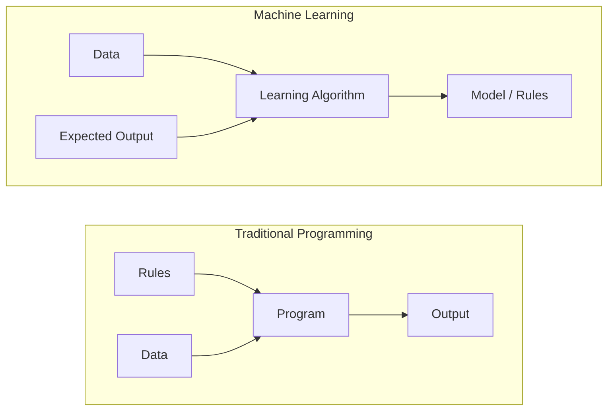
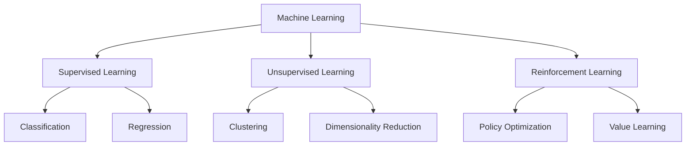
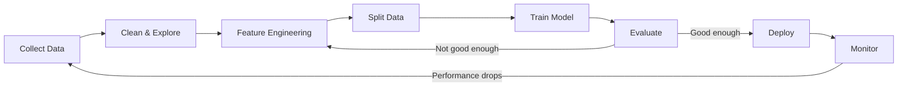
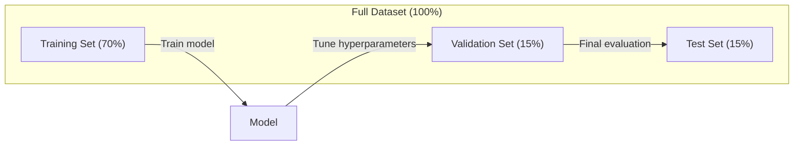
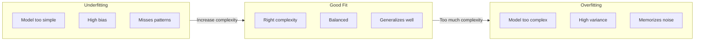
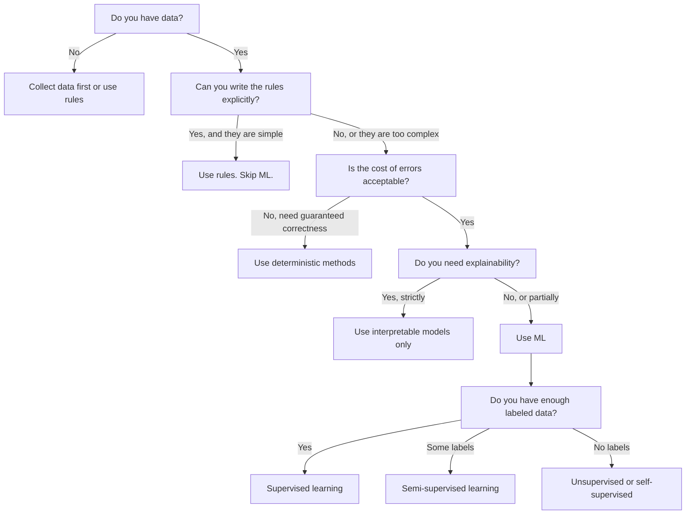

# 什么是机器学习

> 机器学习不是手工编写规则，而是教计算机从数据中发现模式。

**Type:** 学习
**Languages:** Python
**Prerequisites:** 阶段 1（数学基础）
**Time:** 约 45 分钟

## 学习目标

- 解释监督学习、无监督学习和强化学习之间的区别，并判断给定问题属于哪一种
- 从零实现最近质心分类器，并将其表现与随机基线比较
- 区分分类任务与回归任务，并为二者选择合适的损失函数
- 判断一个业务问题是否适合使用机器学习，还是更适合用确定性规则解决

## 问题

假设你想构建垃圾邮件过滤器。传统做法是坐下来编写数百条规则：“如果邮件包含 ‘FREE MONEY’，标记为垃圾邮件；如果感叹号超过 3 个，标记为垃圾邮件。”你花了数周编写规则，垃圾邮件发送者却改变了措辞，规则随即失效。你再添加更多规则，如此循环永无止境。

机器学习会把这个过程反过来。你不再手工编写规则，而是给计算机数千封带有“垃圾邮件”或“非垃圾邮件”标签的邮件，让它自己发现规则。计算机能找到许多你从未想到的模式；当垃圾邮件发送者改变策略时，只需使用新数据重新训练，而不必改写代码。

从“编写规则”转向“从数据中学习”，正是机器学习的核心。推荐引擎、语音助手、自动驾驶汽车和语言模型都以这种方式工作。

## 核心概念

### 从数据中学习，而不是编写规则

传统编程与机器学习以相反方向解决问题。



传统编程：由你编写规则，程序把规则应用到数据上，产生输出。

机器学习：由你提供数据和期望输出，算法负责发现规则。

训练得到的“模型”本身就是规则，只不过它以权重、参数等数字形式编码。模型从见过的样本中总结规律，再对从未见过的数据作出预测。

### 机器学习的三种类型



**监督学习：**你拥有输入—输出样本对，模型学习从输入映射到输出。
- “这里有 10,000 张标注为猫或狗的照片，请学会区分它们。”
- “这里有房屋特征和售价，请学会预测价格。”

**无监督学习：**你只有输入，没有标签，模型自行寻找结构。
- “这里有 10,000 名客户的购买历史，请寻找自然分组。”
- “这里有 1,000 维数据点，请在保留结构的同时降到二维。”

**强化学习：**智能体在环境中采取动作，获得奖励或惩罚，并学习使累计奖励最大的策略。
- “玩这个游戏，获胜奖励 +1，失败奖励 -1，请自行找出策略。”
- “控制机械臂，抓到物体奖励 +1，每浪费一秒惩罚 -0.01。”

实践中构建的大多数系统使用监督学习。无监督学习常用于预处理和探索，强化学习则驱动游戏 AI、机器人和语言模型的 RLHF。

### 不止三大类型

上述三类划分很清楚，但真实世界的机器学习往往会模糊边界。

**半监督学习**使用少量带标签数据和大量无标签数据。例如，你可能拥有 100 张带标签医学图像和 100,000 张无标签图像。常见技术包括：

- **标签传播：**构建连接相似数据点的图，让标签从已标注节点沿图传播到无标签邻居。
- **伪标签：**先在带标签数据上训练模型，再用它预测无标签数据的标签，最后使用全部数据重新训练。模型会自行扩充训练集。
- **一致性正则化：**模型应对原始输入及其轻微扰动版本给出相同预测，即使没有标签也能应用。

**自监督学习**会从数据本身创建监督信号，完全不需要人工标签。模型根据数据结构为自己构造预测任务。

- **掩码语言建模（BERT）：**隐藏句子中 15% 的词，让模型预测缺失词；“标签”来自原始文本。
- **对比学习（SimCLR）：**对一张图像生成两个增强版本，训练模型识别二者来自同一图像，同时把它们与其他图像的增强版本区分开。
- **下一个 token 预测（GPT）：**给定此前所有词，预测下一个词；每篇文本文档都能变成训练样本。

这些并不是脱离三大类型的新类别，而是结合监督与无监督思想的策略。自监督学习在技术上仍是监督学习，因为模型在预测某个目标，只是标签由数据自动生成，而非人工提供。

### 分类与回归

这是两种主要监督学习任务。

| 方面 | 分类 | 回归 |
|--------|---------------|------------|
| 输出 | 离散类别 | 连续数值 |
| 示例 | “这封邮件是垃圾邮件吗？” | “这栋房子的价格是多少？” |
| 输出空间 | {cat, dog, bird} | 任意实数 |
| 损失函数 | 交叉熵、准确率 | 均方误差、MAE |
| 决策形式 | 类别之间的边界 | 拟合数据的曲线 |

分类回答“属于哪个类别？”，回归回答“数量是多少？”

有些问题可以用两种方式表述。预测股票上涨还是下跌是分类，预测确切价格则是回归。

### 机器学习工作流

无论使用哪种算法，每个机器学习项目都遵循同一条流水线。



**收集数据：**获取原始数据。更多数据通常有帮助，但质量比数量更重要。

**清洗与探索：**处理缺失值、删除重复项、可视化分布并发现异常。这一步通常占项目总时间的 60%–80%。

**特征工程：**把原始数据转换成模型能够使用的特征。例如把日期转换为星期几、归一化数值列、编码类别变量。好的特征通常比复杂算法更重要。

**划分数据：**拆分为训练集、验证集和测试集。模型使用训练集学习；你在验证集上调整超参数；最终性能只在测试集上报告。

**训练模型：**把训练数据交给算法，算法调整内部参数，使损失函数最小。

**评估：**在验证集或测试集上衡量表现。如果结果不达标，就回到前面，尝试不同特征、算法或超参数。

**部署：**把模型放入生产环境，让它对新数据作出预测。

**监控：**持续跟踪性能。数据分布会变化，也就是 data drift，模型会随之退化。性能下降时，应重新训练。

### 训练集、验证集与测试集

这是初学者最容易理解错误、也最重要的概念。必须使用训练期间从未见过的数据评估模型，否则衡量的是记忆能力，而不是学习能力。



| 划分 | 用途 | 使用时机 | 典型比例 |
|-------|---------|-----------|-------------|
| 训练集 | 模型从中学习 | 训练期间 | 60%–80% |
| 验证集 | 调整超参数、比较模型 | 每次训练后 | 10%–20% |
| 测试集 | 最终无偏性能估计 | 只在最后使用一次 | 10%–20% |

测试集必须严格留到最后，只应查看一次。如果不断根据测试性能调整模型，就等于在测试集上训练，最终报告的数字将毫无意义。

小型数据集可以使用 k-fold 交叉验证：把数据分成 k 份，每次在 k-1 份上训练、在剩余一份上验证，轮换后对结果求平均。

### 过拟合与欠拟合



**欠拟合：**模型过于简单，无法捕获数据模式，例如用直线拟合曲线关系。训练误差高，测试误差也高。

**过拟合：**模型过于复杂，不仅记住训练数据，还记住了其中的噪声。例如一条穿过每个训练点的曲折曲线，却无法处理新数据。训练误差低，测试误差高。

**良好拟合：**模型捕获真实模式，而没有记忆噪声；训练误差与测试误差都处于合理的较低水平。

过拟合的迹象：
- 训练准确率远高于验证准确率
- 模型在训练数据上表现很好，在新数据上表现很差
- 添加更多训练数据能改善表现，说明模型此前在记忆数据而不是学习模式

修复过拟合的方法：
- 获取更多训练数据
- 降低模型复杂度，例如减少参数或使用更简单架构
- 使用正则化，对大权重添加惩罚
- 使用 Dropout，在训练期间随机把神经元置零
- 使用 early stopping，在验证误差开始上升时停止训练

修复欠拟合的方法：
- 使用更复杂的模型
- 添加更多特征
- 减少正则化
- 延长训练时间

### Bias-Variance 取舍

这是解释过拟合与欠拟合的数学框架。

**Bias（偏差）：**来自模型错误假设的误差。如果真实关系非线性，线性模型就具有高偏差；高偏差会导致欠拟合。

**Variance（方差）：**模型对训练数据微小变化的敏感性。高方差模型在不同数据子集上训练后会给出非常不同的预测；高方差会导致过拟合。

| 模型复杂度 | Bias | Variance | 结果 |
|-----------------|------|----------|--------|
| 过低（用线性模型拟合曲线数据） | 高 | 低 | 欠拟合 |
| 恰当 | 中 | 中 | 泛化良好 |
| 过高（用 20 次多项式拟合 10 个点） | 低 | 高 | 过拟合 |

总误差 = Bias^2 + Variance + 不可约噪声

不可约噪声无法降低，因为它来自数据自身的随机性。目标是找到让 Bias^2 + Variance 最小的平衡点。

### No Free Lunch 定理

不存在对所有问题都最好的算法。在某类问题上表现良好的算法，必然会在另一类问题上表现较差。这就是数据科学家会尝试多种算法并比较结果的原因。

实践中的选择取决于：
- 数据量
- 特征数量
- 关系是线性还是非线性
- 是否需要可解释性
- 可以投入多少计算资源

### 何时不应使用机器学习

机器学习很强大，却并非始终是正确工具。在使用模型前，先问自己是否真的需要它。

**以下情况不应使用机器学习：**

- **规则简单且定义明确。**税费计算、排序算法、单位换算。如果几条 if 语句就能写清逻辑，模型只会增加复杂度，不会带来收益。
- **没有数据或数据极少。**机器学习需要样本来学习。只有 10 个数据点时，无法训练出有意义的模型，应先收集数据。
- **错误代价灾难性，而且必须保证正确。**医学剂量计算、核反应堆控制、密码学验证。机器学习模型具有概率性，偶尔一定会出错。如果不能接受“偶尔出错”，就应使用确定性方法。
- **查找表或启发式规则已经能解决问题。**如果简单阈值或表格能覆盖 99% 的情况，加入机器学习只会提高维护成本，而不会显著改善结果。
- **必须解释每个决策，却无法做到。**贷款、保险、刑事司法等受监管行业有时要求每次决策完全可解释。一些模型可以解释，例如线性回归和小型决策树，但多数模型不能。
- **问题变化速度快于重新训练速度。**如果规则每天变化，而重新训练需要一周，模型永远都会过时。

可以使用下面的决策流程：



```figure
f3-learning-boundary
```

## 动手构建

`code/ml_intro.py` 中的代码会从零实现最近质心分类器，这是最简单的机器学习算法。它演示了核心思想：从数据中学习，再对新数据作出预测。

### 第 1 步：从零实现最近质心分类器

最近质心分类器会计算训练数据中每个类别的中心（均值）。预测时，它把新点分配给中心距离最近的类别。

```python
class NearestCentroid:
    def fit(self, X, y):
        self.classes = np.unique(y)
        self.centroids = np.array([
            X[y == c].mean(axis=0) for c in self.classes
        ])

    def predict(self, X):
        distances = np.array([
            np.sqrt(((X - c) ** 2).sum(axis=1))
            for c in self.centroids
        ])
        return self.classes[distances.argmin(axis=0)]
```

这就是整个算法。Fit 计算两个均值，predict 计算距离；没有梯度下降、没有迭代，也没有超参数。

### 第 2 步：使用合成数据训练

我们生成一个包含两个类别的二维分类数据集，类别之间有少量重叠。质心分类器会在两个类别中心之间画出线性决策边界。

```python
rng = np.random.RandomState(42)
X_class0 = rng.randn(100, 2) + np.array([1.0, 1.0])
X_class1 = rng.randn(100, 2) + np.array([-1.0, -1.0])
X = np.vstack([X_class0, X_class1])
y = np.array([0] * 100 + [1] * 100)
```

### 第 3 步：与基线比较

每个机器学习模型都应该与一个简单基线比较。这里的基线会随机预测类别。如果模型无法胜过随机猜测，说明存在问题。

```python
baseline_preds = rng.choice([0, 1], size=len(y_test))
baseline_acc = np.mean(baseline_preds == y_test)
```

在这个干净数据集上，质心分类器的准确率应达到约 90% 以上，随机基线则约为 50%。

### 为什么这很重要

最近质心分类器极其简单，没有超参数、迭代或梯度下降，却已经包含机器学习的基本模式：

1. 从训练数据中**学习**一种表示，也就是类别质心
2. 使用该表示对新数据作出**预测**，也就是寻找最近距离
3. 与基线进行**评估**，这里是随机猜测

从逻辑回归到 Transformer，每种机器学习算法都遵循相同的三步模式。表示会更加复杂，但工作流始终不变。

### 第 4 步：质心分类器无法处理什么

最近质心分类器假设每个类别都形成一个单一团块，并使用线性决策边界。以下情况会让它失败：

- 类别包含多个簇，例如数字“1”有多种写法
- 决策边界非线性，例如一个类别环绕另一个类别
- 特征尺度差异很大，距离被尺度最大的特征主导

这些局限会引出后续所有算法。K-nearest neighbors 可以处理多个簇，决策树可以处理非线性边界，特征缩放可以修复尺度问题。每节课都会建立在前一方法的局限之上。

## 实际使用

sklearn 提供 `NearestCentroid` 和合成数据生成器：

```python
from sklearn.neighbors import NearestCentroid
from sklearn.datasets import make_classification
from sklearn.model_selection import train_test_split

X, y = make_classification(
    n_samples=500, n_features=2, n_redundant=0,
    n_clusters_per_class=1, random_state=42
)
X_train, X_test, y_train, y_test = train_test_split(X, y, test_size=0.3)

clf = NearestCentroid()
clf.fit(X_train, y_train)
print(f"Accuracy: {clf.score(X_test, y_test):.3f}")
```

## 交付成果

本课会产出 `outputs/prompt-ml-problem-framer.md`——一份把模糊业务问题转化为具体机器学习任务的提示词。输入问题描述，例如“我们希望降低流失率”或“预测下一季度需求”，它会识别学习类型、定义预测目标、列出候选特征、选择成功指标、建立基线，并标记数据泄漏和类别不平衡等风险。任何机器学习项目都应先使用它，避免构建错误的解决方案。

## 关键术语

| 术语 | 人们常说 | 准确含义 |
|------|----------------|----------------------|
| Model | “那个 AI” | 带可学习参数、把输入映射为输出的数学函数 |
| Training | “教 AI” | 运行优化算法调整模型参数，使预测匹配已知输出 |
| Feature | “输入列” | 模型用于作出预测的数据可测量属性 |
| Label | “答案” | 训练样本的已知输出，用于计算误差信号 |
| Hyperparameter | “需要调整的设置” | 训练前设定、用于控制学习过程的参数，例如学习率和层数 |
| Loss function | “模型错得有多严重” | 衡量预测输出与真实输出差距的函数，训练会尝试将其最小化 |
| Overfitting | “把测试内容背下来了” | 模型学到了训练数据特有的噪声，而非通用模式，因而在新数据上失败 |
| Underfitting | “什么也没学到” | 模型过于简单，无法捕获数据中的真实模式 |
| Generalization | “能处理新数据” | 模型对训练期间未见数据作出准确预测的能力 |
| Cross-validation | “在不同数据块上测试” | 反复把数据拆成训练/测试 fold 并对结果求平均，以得到更稳健的性能估计 |
| Regularization | “让权重保持较小” | 向损失函数添加惩罚项，抑制过度复杂的模型 |
| Data drift | “世界发生了变化” | 输入数据的统计分布随时间变化，造成模型性能下降 |

## 练习

1. 选择任意数据集，例如 Iris 或 Titanic，按 70/15/15 拆分为训练集、验证集和测试集。解释为什么不应在测试集上调整超参数。
2. 列出三个真实世界问题，分别判断它们属于分类、回归还是聚类，以及属于监督学习还是无监督学习。
3. 某模型在训练数据上的准确率为 99%，在测试数据上却只有 60%。诊断问题，并列出三种修复方法。

## 延伸阅读

- [An Introduction to Statistical Learning](https://www.statlearning.com/)——免费教材，以实践示例覆盖经典机器学习方法
- [Google Machine Learning Crash Course](https://developers.google.com/machine-learning/crash-course)——简洁、可视化的机器学习概念入门
- [Scikit-learn 用户指南](https://scikit-learn.org/stable/user_guide.html)——使用 Python 实现机器学习的实践参考
