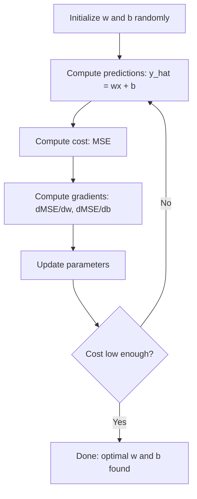

# 线性回归

> 线性回归会在数据中画出最佳直线，是机器学习的“Hello, world”。

**Type:** 构建
**Languages:** Python
**Prerequisites:** 阶段 1（线性代数、微积分、优化）、阶段 2 第 1 课
**Time:** 约 90 分钟

## 学习目标

- 推导均方误差的梯度下降更新规则，并从零实现线性回归
- 比较梯度下降与正规方程的计算复杂度，并判断各自适用的场景
- 构建带特征标准化的多元线性回归模型，并解释学习到的权重
- 解释 Ridge 回归（L2 正则化）如何通过惩罚大权重防止过拟合

## 问题

你有一组房屋面积与成交价格数据，希望根据新房面积预测价格。可以在散点图上凭眼观察，但你真正需要的是一个公式：一条最符合数据的直线，让任意面积都能得到价格预测。

线性回归会给出这条直线。更重要的是，它会介绍完整的机器学习训练循环：定义模型、定义代价函数、优化参数。所有机器学习算法都遵循同一模式。先在最简单的情况中掌握它，之后你会在各处认出这一结构。

线性回归并不只适用于简单问题。生产系统会用它预测需求、分析 A/B 测试、构建金融模型，也会把它作为所有回归任务的基线。

## 核心概念

### 模型

线性回归假设输入 x 与输出 y 之间存在线性关系：

```
y = wx + b
```

- `w`（权重/斜率）：x 增加 1 时，y 会变化多少
- `b`（偏置/截距）：x = 0 时 y 的值

对于多个输入（特征），模型扩展为：

```
y = w1*x1 + w2*x2 + ... + wn*xn + b
```

向量形式为：`y = w^T * x + b`

目标是找到 w 与 b，使所有训练样本上的预测 y 尽可能接近真实 y。

### 代价函数（均方误差）

怎样衡量“尽可能接近”？需要一个数字概括预测错得有多严重。最常见的选择是均方误差（MSE）：

```
MSE = (1/n) * sum((y_predicted - y_actual)^2)
```

为什么要平方？有两个原因。第一，它让大误差比小误差受到更强惩罚：误差 10 的代价是误差 1 的 100 倍，而不是 10 倍。第二，平方函数处处光滑且可微，优化非常方便。

代价函数会形成一个曲面。只有一个权重 w 和偏置 b 时，MSE 曲面像一个碗，也就是凸抛物面；碗底就是 MSE 最小的位置，训练就是寻找这个最低点。

### 梯度下降

梯度下降通过沿下坡移动寻找碗底。



梯度告诉你两件事：每个参数应该朝哪个方向移动，以及应该移动多少。

当 y_hat = wx + b、代价为 MSE 时：

```
dMSE/dw = (2/n) * sum((y_hat - y) * x)
dMSE/db = (2/n) * sum(y_hat - y)
```

更新规则为：

```
w = w - learning_rate * dMSE/dw
b = b - learning_rate * dMSE/db
```

学习率控制步长。太大时会越过最小值并发散；太小时训练耗时过长。常见起点是 0.01、0.001 或 0.0001。

### 正规方程（闭式解）

线性回归有一个无需迭代、可直接得到最优权重的公式：

```
w = (X^T * X)^(-1) * X^T * y
```

它通过矩阵求逆一步求出 w，适合小型数据集。对于包含数百万行或数千特征的大型数据，特征数上的矩阵求逆复杂度为 O(n^3)，因此更适合使用梯度下降。

### 多元线性回归

存在多个特征时，模型变为：

```
y = w1*x1 + w2*x2 + ... + wn*xn + b
```

其余部分完全相同：代价函数仍是 MSE，梯度下降同时更新所有权重。唯一差别是你拟合的不再是一条直线，而是一个超平面。

此时特征缩放很重要。如果一个特征范围为 0–1，另一个范围为 0–1,000,000，代价曲面会变得狭长，梯度下降很难前进。训练前应标准化特征，即减去均值，再除以标准差。

### 多项式回归

如果关系不是线性的，仍然可以通过构造多项式特征使用线性回归：

```
y = w1*x + w2*x^2 + w3*x^3 + b
```

它仍称为“线性”回归，因为模型对权重 w1、w2、w3 是线性的，只是使用了 x 的非线性特征。

次数更高的多项式能够拟合更复杂的曲线，却也更容易过拟合。一个 10 次多项式可以穿过仅含 10 个点的数据集中的每个点，却会在新数据上预测很差。

### R-squared 分数

MSE 衡量误差，但其数值取决于 y 的尺度。R-squared（R^2）提供不依赖尺度的指标：

```
R^2 = 1 - (sum of squared residuals) / (sum of squared deviations from mean)
    = 1 - SS_res / SS_tot
```

- R^2 = 1.0：预测完美
- R^2 = 0.0：模型与始终预测均值一样好
- R^2 < 0.0：模型比始终预测均值还差

### 正则化预览（Ridge 回归）

特征很多时，模型可能通过分配较大权重过拟合。Ridge 回归，也就是 L2 正则化，会添加惩罚项：

```
Cost = MSE + lambda * sum(w_i^2)
```

惩罚项会抑制较大权重。超参数 lambda 控制两者取舍：lambda 越高，权重越小，正则化越强。后续课程会深入介绍；这里先理解它存在以及为何有效。

```figure
linear-regression-fit
```

## 动手构建

### 第 1 步：生成样本数据

```python
import random
import math

random.seed(42)

TRUE_W = 3.0
TRUE_B = 7.0
N_SAMPLES = 100

X = [random.uniform(0, 10) for _ in range(N_SAMPLES)]
y = [TRUE_W * x + TRUE_B + random.gauss(0, 2.0) for x in X]

print(f"Generated {N_SAMPLES} samples")
print(f"True relationship: y = {TRUE_W}x + {TRUE_B} (+ noise)")
print(f"First 5 points: {[(round(X[i], 2), round(y[i], 2)) for i in range(5)]}")
```

### 第 2 步：使用梯度下降从零实现线性回归

```python
class LinearRegression:
    def __init__(self, learning_rate=0.01):
        self.w = 0.0
        self.b = 0.0
        self.lr = learning_rate
        self.cost_history = []

    def predict(self, X):
        return [self.w * x + self.b for x in X]

    def compute_cost(self, X, y):
        predictions = self.predict(X)
        n = len(y)
        cost = sum((pred - actual) ** 2 for pred, actual in zip(predictions, y)) / n
        return cost

    def compute_gradients(self, X, y):
        predictions = self.predict(X)
        n = len(y)
        dw = (2 / n) * sum((pred - actual) * x for pred, actual, x in zip(predictions, y, X))
        db = (2 / n) * sum(pred - actual for pred, actual in zip(predictions, y))
        return dw, db

    def fit(self, X, y, epochs=1000, print_every=200):
        for epoch in range(epochs):
            dw, db = self.compute_gradients(X, y)
            self.w -= self.lr * dw
            self.b -= self.lr * db
            cost = self.compute_cost(X, y)
            self.cost_history.append(cost)
            if epoch % print_every == 0:
                print(f"  Epoch {epoch:4d} | Cost: {cost:.4f} | w: {self.w:.4f} | b: {self.b:.4f}")
        return self

    def r_squared(self, X, y):
        predictions = self.predict(X)
        y_mean = sum(y) / len(y)
        ss_res = sum((actual - pred) ** 2 for actual, pred in zip(y, predictions))
        ss_tot = sum((actual - y_mean) ** 2 for actual in y)
        return 1 - (ss_res / ss_tot)


print("=== Training Linear Regression (Gradient Descent) ===")
model = LinearRegression(learning_rate=0.005)
model.fit(X, y, epochs=1000, print_every=200)
print(f"\nLearned: y = {model.w:.4f}x + {model.b:.4f}")
print(f"True:    y = {TRUE_W}x + {TRUE_B}")
print(f"R-squared: {model.r_squared(X, y):.4f}")
```

### 第 3 步：正规方程（闭式解）

```python
class LinearRegressionNormal:
    def __init__(self):
        self.w = 0.0
        self.b = 0.0

    def fit(self, X, y):
        n = len(X)
        x_mean = sum(X) / n
        y_mean = sum(y) / n
        numerator = sum((X[i] - x_mean) * (y[i] - y_mean) for i in range(n))
        denominator = sum((X[i] - x_mean) ** 2 for i in range(n))
        self.w = numerator / denominator
        self.b = y_mean - self.w * x_mean
        return self

    def predict(self, X):
        return [self.w * x + self.b for x in X]

    def r_squared(self, X, y):
        predictions = self.predict(X)
        y_mean = sum(y) / len(y)
        ss_res = sum((actual - pred) ** 2 for actual, pred in zip(y, predictions))
        ss_tot = sum((actual - y_mean) ** 2 for actual in y)
        return 1 - (ss_res / ss_tot)


print("\n=== Normal Equation (Closed-Form) ===")
model_normal = LinearRegressionNormal()
model_normal.fit(X, y)
print(f"Learned: y = {model_normal.w:.4f}x + {model_normal.b:.4f}")
print(f"R-squared: {model_normal.r_squared(X, y):.4f}")
```

### 第 4 步：多元线性回归

```python
class MultipleLinearRegression:
    def __init__(self, n_features, learning_rate=0.01):
        self.weights = [0.0] * n_features
        self.bias = 0.0
        self.lr = learning_rate
        self.cost_history = []

    def predict_single(self, x):
        return sum(w * xi for w, xi in zip(self.weights, x)) + self.bias

    def predict(self, X):
        return [self.predict_single(x) for x in X]

    def compute_cost(self, X, y):
        predictions = self.predict(X)
        n = len(y)
        return sum((pred - actual) ** 2 for pred, actual in zip(predictions, y)) / n

    def fit(self, X, y, epochs=1000, print_every=200):
        n = len(y)
        n_features = len(X[0])
        for epoch in range(epochs):
            predictions = self.predict(X)
            errors = [pred - actual for pred, actual in zip(predictions, y)]
            for j in range(n_features):
                grad = (2 / n) * sum(errors[i] * X[i][j] for i in range(n))
                self.weights[j] -= self.lr * grad
            grad_b = (2 / n) * sum(errors)
            self.bias -= self.lr * grad_b
            cost = self.compute_cost(X, y)
            self.cost_history.append(cost)
            if epoch % print_every == 0:
                print(f"  Epoch {epoch:4d} | Cost: {cost:.4f}")
        return self

    def r_squared(self, X, y):
        predictions = self.predict(X)
        y_mean = sum(y) / len(y)
        ss_res = sum((actual - pred) ** 2 for actual, pred in zip(y, predictions))
        ss_tot = sum((actual - y_mean) ** 2 for actual in y)
        return 1 - (ss_res / ss_tot)


random.seed(42)
N = 100
X_multi = []
y_multi = []
for _ in range(N):
    size = random.uniform(500, 3000)
    bedrooms = random.randint(1, 5)
    age = random.uniform(0, 50)
    price = 50 * size + 10000 * bedrooms - 1000 * age + 50000 + random.gauss(0, 20000)
    X_multi.append([size, bedrooms, age])
    y_multi.append(price)


def standardize(X):
    n_features = len(X[0])
    means = [sum(X[i][j] for i in range(len(X))) / len(X) for j in range(n_features)]
    stds = []
    for j in range(n_features):
        variance = sum((X[i][j] - means[j]) ** 2 for i in range(len(X))) / len(X)
        stds.append(variance ** 0.5)
    X_scaled = []
    for i in range(len(X)):
        row = [(X[i][j] - means[j]) / stds[j] if stds[j] > 0 else 0 for j in range(n_features)]
        X_scaled.append(row)
    return X_scaled, means, stds


y_mean_val = sum(y_multi) / len(y_multi)
y_std_val = (sum((yi - y_mean_val) ** 2 for yi in y_multi) / len(y_multi)) ** 0.5
y_scaled = [(yi - y_mean_val) / y_std_val for yi in y_multi]

X_scaled, x_means, x_stds = standardize(X_multi)

print("\n=== Multiple Linear Regression (3 features) ===")
print("Features: house size, bedrooms, age")
multi_model = MultipleLinearRegression(n_features=3, learning_rate=0.01)
multi_model.fit(X_scaled, y_scaled, epochs=1000, print_every=200)

print(f"\nWeights (standardized): {[round(w, 4) for w in multi_model.weights]}")
print(f"Bias (standardized): {multi_model.bias:.4f}")
print(f"R-squared: {multi_model.r_squared(X_scaled, y_scaled):.4f}")
```

### 第 5 步：多项式回归

```python
class PolynomialRegression:
    def __init__(self, degree, learning_rate=0.01):
        self.degree = degree
        self.weights = [0.0] * degree
        self.bias = 0.0
        self.lr = learning_rate

    def make_features(self, X):
        return [[x ** (d + 1) for d in range(self.degree)] for x in X]

    def predict(self, X):
        features = self.make_features(X)
        return [sum(w * f for w, f in zip(self.weights, row)) + self.bias for row in features]

    def fit(self, X, y, epochs=1000, print_every=200):
        features = self.make_features(X)
        n = len(y)
        for epoch in range(epochs):
            predictions = [sum(w * f for w, f in zip(self.weights, row)) + self.bias for row in features]
            errors = [pred - actual for pred, actual in zip(predictions, y)]
            for j in range(self.degree):
                grad = (2 / n) * sum(errors[i] * features[i][j] for i in range(n))
                self.weights[j] -= self.lr * grad
            grad_b = (2 / n) * sum(errors)
            self.bias -= self.lr * grad_b
            if epoch % print_every == 0:
                cost = sum(e ** 2 for e in errors) / n
                print(f"  Epoch {epoch:4d} | Cost: {cost:.6f}")
        return self

    def r_squared(self, X, y):
        predictions = self.predict(X)
        y_mean = sum(y) / len(y)
        ss_res = sum((actual - pred) ** 2 for actual, pred in zip(y, predictions))
        ss_tot = sum((actual - y_mean) ** 2 for actual in y)
        return 1 - (ss_res / ss_tot)


random.seed(42)
X_poly = [x / 10.0 for x in range(0, 50)]
y_poly = [0.5 * x ** 2 - 2 * x + 3 + random.gauss(0, 1.0) for x in X_poly]

x_max = max(abs(x) for x in X_poly)
X_poly_norm = [x / x_max for x in X_poly]
y_poly_mean = sum(y_poly) / len(y_poly)
y_poly_std = (sum((yi - y_poly_mean) ** 2 for yi in y_poly) / len(y_poly)) ** 0.5
y_poly_norm = [(yi - y_poly_mean) / y_poly_std for yi in y_poly]

print("\n=== Polynomial Regression (degree 2 vs degree 5) ===")
print("True relationship: y = 0.5x^2 - 2x + 3")

print("\nDegree 2:")
poly2 = PolynomialRegression(degree=2, learning_rate=0.1)
poly2.fit(X_poly_norm, y_poly_norm, epochs=2000, print_every=500)
print(f"  R-squared: {poly2.r_squared(X_poly_norm, y_poly_norm):.4f}")

print("\nDegree 5:")
poly5 = PolynomialRegression(degree=5, learning_rate=0.1)
poly5.fit(X_poly_norm, y_poly_norm, epochs=2000, print_every=500)
print(f"  R-squared: {poly5.r_squared(X_poly_norm, y_poly_norm):.4f}")

print("\nDegree 2 fits the true curve well. Degree 5 fits training data slightly better")
print("but risks overfitting on new data.")
```

### 第 6 步：Ridge 回归（L2 正则化）

```python
class RidgeRegression:
    def __init__(self, n_features, learning_rate=0.01, alpha=1.0):
        self.weights = [0.0] * n_features
        self.bias = 0.0
        self.lr = learning_rate
        self.alpha = alpha

    def predict_single(self, x):
        return sum(w * xi for w, xi in zip(self.weights, x)) + self.bias

    def predict(self, X):
        return [self.predict_single(x) for x in X]

    def fit(self, X, y, epochs=1000, print_every=200):
        n = len(y)
        n_features = len(X[0])
        for epoch in range(epochs):
            predictions = self.predict(X)
            errors = [pred - actual for pred, actual in zip(predictions, y)]
            mse = sum(e ** 2 for e in errors) / n
            reg_term = self.alpha * sum(w ** 2 for w in self.weights)
            cost = mse + reg_term
            for j in range(n_features):
                grad = (2 / n) * sum(errors[i] * X[i][j] for i in range(n))
                grad += 2 * self.alpha * self.weights[j]
                self.weights[j] -= self.lr * grad
            grad_b = (2 / n) * sum(errors)
            self.bias -= self.lr * grad_b
            if epoch % print_every == 0:
                print(f"  Epoch {epoch:4d} | Cost: {cost:.4f} | L2 penalty: {reg_term:.4f}")
        return self


print("\n=== Ridge Regression (L2 Regularization) ===")
print("Same data as multiple regression, with alpha=0.1")
ridge = RidgeRegression(n_features=3, learning_rate=0.01, alpha=0.1)
ridge.fit(X_scaled, y_scaled, epochs=1000, print_every=200)
print(f"\nRidge weights: {[round(w, 4) for w in ridge.weights]}")
print(f"Plain weights: {[round(w, 4) for w in multi_model.weights]}")
print("Ridge weights are smaller (shrunk toward zero) due to the L2 penalty.")
```

## 实际使用

下面使用 scikit-learn 完成相同工作，这才是生产环境中的实际选择。

```python
from sklearn.linear_model import LinearRegression as SklearnLR
from sklearn.linear_model import Ridge
from sklearn.preprocessing import PolynomialFeatures, StandardScaler
from sklearn.model_selection import train_test_split
from sklearn.metrics import mean_squared_error, r2_score
import numpy as np

np.random.seed(42)
X_sk = np.random.uniform(0, 10, (100, 1))
y_sk = 3.0 * X_sk.squeeze() + 7.0 + np.random.normal(0, 2.0, 100)

X_train, X_test, y_train, y_test = train_test_split(X_sk, y_sk, test_size=0.2, random_state=42)

lr = SklearnLR()
lr.fit(X_train, y_train)
y_pred = lr.predict(X_test)

print("=== Scikit-learn Linear Regression ===")
print(f"Coefficient (w): {lr.coef_[0]:.4f}")
print(f"Intercept (b): {lr.intercept_:.4f}")
print(f"R-squared (test): {r2_score(y_test, y_pred):.4f}")
print(f"MSE (test): {mean_squared_error(y_test, y_pred):.4f}")

poly = PolynomialFeatures(degree=2, include_bias=False)
X_poly_sk = poly.fit_transform(X_train)
X_poly_test = poly.transform(X_test)

lr_poly = SklearnLR()
lr_poly.fit(X_poly_sk, y_train)
print(f"\nPolynomial degree 2 R-squared: {r2_score(y_test, lr_poly.predict(X_poly_test)):.4f}")

scaler = StandardScaler()
X_train_scaled = scaler.fit_transform(X_train)
X_test_scaled = scaler.transform(X_test)

ridge = Ridge(alpha=1.0)
ridge.fit(X_train_scaled, y_train)
print(f"Ridge R-squared: {r2_score(y_test, ridge.predict(X_test_scaled)):.4f}")
print(f"Ridge coefficient: {ridge.coef_[0]:.4f}")
```

从零实现与 scikit-learn 会得到相同结果。区别在于 scikit-learn 已处理边界情况、数值稳定性和性能优化。生产环境应使用库，从零实现则用于理解底层过程。

## 交付成果

本课会产出：
- `outputs/skill-regression.md`——根据问题选择合适回归方法的技能

## 练习

1. 实现 batch gradient descent、stochastic gradient descent（SGD）和 mini-batch gradient descent，在同一数据集上比较收敛速度。哪一种收敛最快？哪一种代价曲线最平滑？
2. 根据三次函数 y = ax^3 + bx^2 + cx + d + noise 生成数据，分别拟合 1 次、3 次和 10 次多项式，比较训练 R^2 与测试 R^2。到哪个次数时，过拟合开始明显？
3. 实现 Lasso 回归（L1 正则化：penalty = alpha * sum(|w_i|)），在多特征房屋数据上训练，与 Ridge 比较哪些权重变为零。为什么 L1 会产生稀疏解，而 L2 不会？

## 关键术语

| 术语 | 人们常说 | 准确含义 |
|------|----------------|----------------------|
| Linear regression | “在数据中画直线” | 寻找权重 w 和偏置 b，使 wx+b 与真实 y 之间的平方差之和最小 |
| Cost function | “模型有多差” | 把模型参数映射到单一预测误差数值的函数，优化过程会将其最小化 |
| Mean squared error | “平方误差的平均值” | (1/n) * sum((predicted - actual)^2)，会对大误差施加更强惩罚 |
| Gradient descent | “沿下坡走” | 使用偏导数，反复沿降低代价函数的方向调整参数 |
| Learning rate | “步长” | 控制每次梯度下降更新中参数变化幅度的标量 |
| Normal equation | “直接求解” | 闭式解 w = (X^T X)^-1 X^T y，无需迭代即可得到最优权重 |
| R-squared | “拟合有多好” | 模型解释的 y 方差比例，范围从负无穷到 1.0 |
| Feature scaling | “让特征可比较” | 把特征转换到相似范围，例如零均值、单位方差，使梯度下降更快收敛 |
| Regularization | “惩罚复杂度” | 向代价函数加入使权重缩小的项，防止过拟合 |
| Ridge regression | “L2 正则化” | 在线性回归的 MSE 上加入 lambda * sum(w_i^2) 惩罚 |
| Polynomial regression | “用线性数学拟合曲线” | 对多项式特征（x、x^2、x^3……）执行线性回归，模型对权重仍然是线性的 |
| Overfitting | “记住训练数据” | 模型过于复杂，以至于拟合了训练噪声，却无法处理新数据 |

## 延伸阅读

- [An Introduction to Statistical Learning（ISLR）](https://www.statlearning.com/)——免费 PDF，第 3 章和第 6 章通过实践 R 示例介绍线性回归与正则化
- [The Elements of Statistical Learning（ESL）](https://hastie.su.domains/ElemStatLearn/)——免费 PDF，是 ISLR 更偏数学的配套教材，对 Ridge 与 Lasso 讲解更深入
- [Stanford CS229 线性回归讲义](https://cs229.stanford.edu/main_notes.pdf)——Andrew Ng 从第一性原理推导正规方程与梯度下降
- [scikit-learn LinearRegression 文档](https://scikit-learn.org/stable/modules/linear_model.html)——LinearRegression、Ridge、Lasso 和 ElasticNet 的实践参考及代码示例
