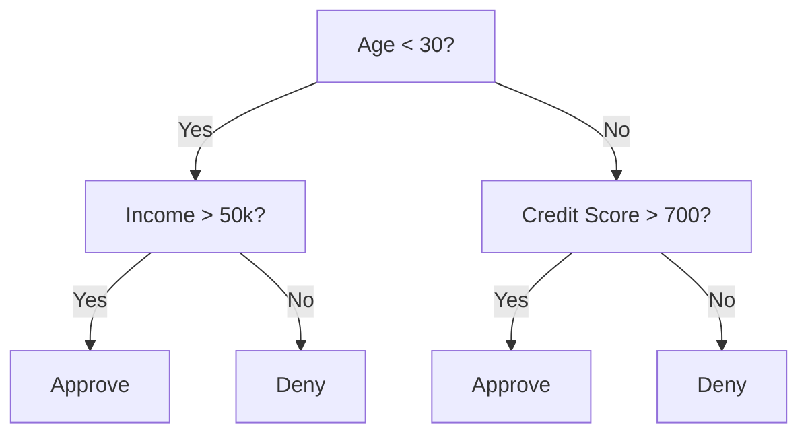
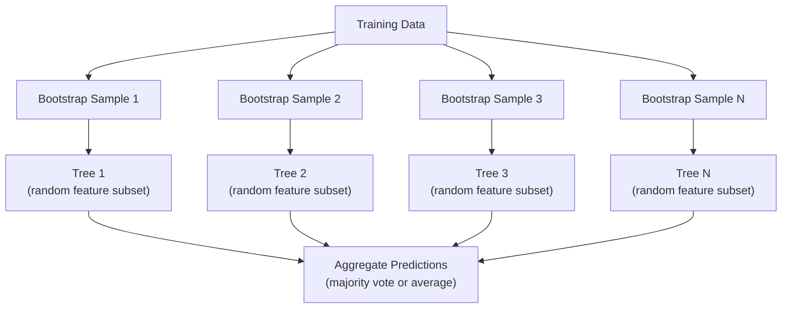

# 决策树与随机森林

> 决策树不过是一张流程图，但由许多树组成的森林，却是机器学习中最强大的工具之一。

**Type:** 构建
**Language:** Python
**Prerequisites:** 阶段 1（第 09 课信息论、第 06 课概率论）
**Time:** 约 90 分钟

## 学习目标

- 实现 Gini impurity、entropy 和 information gain 计算，以寻找最优决策树分裂
- 从零构建带预剪枝控制（最大深度、最小样本数）的决策树分类器
- 使用 bootstrap sampling 与特征随机化构建随机森林，并解释它为何能降低方差
- 比较 MDI 特征重要性与 permutation importance，并识别 MDI 何时存在偏差

## 问题

你有一份表格数据：每行是一个样本，每列是一个特征，还有一列需要预测的目标。你当然可以把神经网络用在它上面，但对表格数据而言，树模型——决策树、随机森林、梯度提升树——持续优于深度学习。结构化数据的 Kaggle 竞赛由 XGBoost 和 LightGBM 主导，而不是 Transformer。

为什么？树无需预处理就能处理数值与类别等混合特征类型，无需特征工程就能处理非线性关系，而且具有可解释性：查看树结构，就能准确知道预测依据。随机森林会对许多树取平均，因此在中等规模数据集上具有很强的抗过拟合能力。

本课会先通过递归分裂从零构建决策树，再在其上构建随机森林。你将实现分裂准则背后的数学，包括 Gini impurity、entropy 和 information gain，并理解弱学习器组成的 ensemble 为何会成为强学习器。

## 核心概念

### 决策树做什么

决策树通过一连串“是/否”问题，把特征空间划分为矩形区域。



每个内部节点都会用阈值检验某个特征，每个叶节点则给出预测。对新数据分类时，从根节点开始沿分支向下，直到到达叶节点。

树会自顶向下构建：在每个节点选择最能分隔数据的特征和阈值。“最好”由分裂准则定义。

### 分裂准则：衡量不纯度

每个节点都包含一组样本。我们希望分裂后，子节点尽可能“纯”，也就是每个子节点主要包含一个类别。

**Gini impurity** 衡量：如果按照该节点的类别分布随机给样本贴标签，随机选中的样本被错误分类的概率。

```
Gini(S) = 1 - sum(p_k^2)

where p_k is the proportion of class k in set S.
```

纯节点中所有样本属于一个类别，Gini = 0；二分类各占一半时，Gini = 0.5。越低越好。

```
Example: 6 cats, 4 dogs

Gini = 1 - (0.6^2 + 0.4^2) = 1 - (0.36 + 0.16) = 0.48
```

**Entropy** 衡量节点中的信息量，也就是混乱程度，第 1 阶段第 09 课已经介绍。

```
Entropy(S) = -sum(p_k * log2(p_k))
```

纯节点 entropy = 0；二分类各占一半时 entropy = 1.0。越低越好。

```
Example: 6 cats, 4 dogs

Entropy = -(0.6 * log2(0.6) + 0.4 * log2(0.4))
        = -(0.6 * -0.737 + 0.4 * -1.322)
        = 0.442 + 0.529
        = 0.971 bits
```

**Information gain** 是分裂后不纯度（entropy 或 Gini）的下降量。

```
IG(S, feature, threshold) = Impurity(S) - weighted_avg(Impurity(S_left), Impurity(S_right))

where the weights are the proportions of samples in each child.
```

每个节点上的贪心算法会尝试每个特征和每个可能阈值，选择使 information gain 最大的（特征，阈值）组合。

### 分裂如何进行

当前节点含 m 个样本、n 个特征时：

1. 对每个特征 j（j = 1 到 n）：
   - 按特征 j 对样本排序
   - 依次尝试相邻不同数值的中点作为阈值
   - 计算每个阈值的 information gain
2. 选择 information gain 最高的特征和阈值
3. 把数据分成左侧（feature <= threshold）与右侧（feature > threshold）
4. 对两个子节点递归执行

这种贪心方法无法保证得到全局最优树，因为寻找最优树是 NP-hard 问题，但贪心分裂在实践中效果很好。

### 停止条件

没有停止条件时，树会一直生长到每个叶节点都纯净，甚至每个叶节点只有一个样本。这样会完美记住训练数据，却无法泛化。

**预剪枝**会在树完全长成前停止：
- 最大深度：达到设定深度后停止分裂
- 每个叶节点最少样本数：节点样本少于 k 时停止
- 最小 information gain：最佳分裂带来的不纯度改善低于阈值时停止
- 最大叶节点数量：限制叶节点总数

**后剪枝**会先让树完整生长，再向回修剪：
- 代价复杂度剪枝（scikit-learn 使用）：加入与叶节点数量成正比的惩罚；惩罚越大，树越小
- 降低误差剪枝：如果删除一个子树不会提高验证误差，就将其删除

预剪枝更简单、更快；后剪枝往往能得到更好的树，因为它不会过早阻止那些继续分裂后才显现价值的节点。

### 回归决策树

用于回归时，叶节点预测该叶内目标值的均值，分裂准则也随之改变。

**Variance reduction** 取代 information gain：

```
VR(S, feature, threshold) = Var(S) - weighted_avg(Var(S_left), Var(S_right))
```

选择使方差下降最多的分裂。树会把输入空间划分成多个区域，并在每个区域内预测一个常数，也就是均值。

### 随机森林：ensemble 的力量

单棵决策树方差很高，数据中的微小变化就可能产生完全不同的树。随机森林通过对许多树取平均解决这一问题。



两类随机性让不同树保持多样：

**Bagging（bootstrap aggregating）：**每棵树都使用 bootstrap 样本训练，也就是从训练数据中有放回地随机抽样。每份 bootstrap 样本大约包含原始样本的 63%，其余 out-of-bag 样本可以用于验证。

**特征随机化：**每次分裂只考虑随机选取的一部分特征。分类任务默认选 sqrt(n_features)，回归默认选 n_features/3。这能避免所有树都使用同一个主导特征进行分裂。

关键洞见是：对许多低相关树取平均，可以降低方差而不增加偏差。单棵树可能表现一般，ensemble 却很强。

### 特征重要性

随机森林天然会给出特征重要性分数。最常见的方法是：

**Mean Decrease in Impurity（MDI）：**对每个特征，把所有树中使用该特征的节点带来的不纯度下降量求和。越早分裂、带来越大不纯度下降的特征越重要。

```
importance(feature_j) = sum over all nodes where feature_j is used:
    (n_samples_at_node / n_total_samples) * impurity_decrease
```

MDI 计算很快，因为训练期间就会得到；但它偏向基数高的特征，以及可选分裂点很多的特征。

**Permutation importance** 是另一种方法：随机打乱某个特征的值，测量模型准确率下降多少。它更可靠，但速度更慢。

### 树何时优于神经网络

在表格数据上，树和森林通常优于神经网络，原因包括：

| 因素 | 树模型 | 神经网络 |
|--------|-------|----------------|
| 混合类型（数值 + 类别） | 原生支持 | 需要编码 |
| 小型数据集（< 10k 行） | 表现良好 | 容易过拟合 |
| 特征交互 | 通过分裂自动发现 | 需要架构设计 |
| 可解释性 | 完全透明 | 黑盒 |
| 训练时间 | 分钟级 | 小时级 |
| 超参数敏感度 | 低 | 高 |

当数据具有空间或序列结构，例如图像、文本和音频时，神经网络更有优势；对于扁平特征表格，树模型是默认选择。

```figure
decision-tree-depth
```

## 动手构建

### 第 1 步：Gini impurity 与 entropy

从零构建两种分裂准则，并验证它们对优质分裂的判断一致。

```python
import math

def gini_impurity(labels):
    n = len(labels)
    if n == 0:
        return 0.0
    counts = {}
    for label in labels:
        counts[label] = counts.get(label, 0) + 1
    return 1.0 - sum((c / n) ** 2 for c in counts.values())

def entropy(labels):
    n = len(labels)
    if n == 0:
        return 0.0
    counts = {}
    for label in labels:
        counts[label] = counts.get(label, 0) + 1
    return -sum(
        (c / n) * math.log2(c / n) for c in counts.values() if c > 0
    )
```

### 第 2 步：寻找最佳分裂

尝试每个特征和阈值，返回 information gain 最高的组合。

```python
def information_gain(parent_labels, left_labels, right_labels, criterion="gini"):
    measure = gini_impurity if criterion == "gini" else entropy
    n = len(parent_labels)
    n_left = len(left_labels)
    n_right = len(right_labels)
    if n_left == 0 or n_right == 0:
        return 0.0
    parent_impurity = measure(parent_labels)
    child_impurity = (
        (n_left / n) * measure(left_labels) +
        (n_right / n) * measure(right_labels)
    )
    return parent_impurity - child_impurity
```

### 第 3 步：构建 DecisionTree 类

实现递归分裂、预测和特征重要性跟踪。`_build` 是树的核心：节点纯净或达到预剪枝限制时停止，否则采用最佳分裂，再递归构建两个子节点。

```python
import random

class DecisionTree:
    def __init__(self, max_depth=None, min_samples_split=2,
                 min_samples_leaf=1, criterion="gini",
                 max_features=None):
        self.max_depth = max_depth
        self.min_samples_split = min_samples_split
        self.min_samples_leaf = min_samples_leaf
        self.criterion = criterion
        self.max_features = max_features
        self.tree = None
        self.feature_importances_ = None

    def fit(self, X, y):
        self.n_features = len(X[0])
        self.feature_importances_ = [0.0] * self.n_features
        self.n_samples = len(X)
        self.tree = self._build(X, y, depth=0)
        total = sum(self.feature_importances_)
        if total > 0:
            self.feature_importances_ = [
                fi / total for fi in self.feature_importances_
            ]

    def predict(self, X):
        return [self._predict_one(x, self.tree) for x in X]

    def _build(self, X, y, depth):
        if len(set(y)) == 1:
            return {"leaf": True, "value": y[0]}

        if self.max_depth is not None and depth >= self.max_depth:
            return self._make_leaf(y)

        if len(y) < self.min_samples_split:
            return self._make_leaf(y)

        best_feature, best_threshold, best_gain = self._best_split(X, y)

        if best_feature is None or best_gain <= 0:
            return self._make_leaf(y)

        left_X, left_y, right_X, right_y = self._split_data(
            X, y, best_feature, best_threshold
        )

        if len(left_y) < self.min_samples_leaf or len(right_y) < self.min_samples_leaf:
            return self._make_leaf(y)

        weight = len(y) / self.n_samples
        self.feature_importances_[best_feature] += weight * best_gain

        return {
            "leaf": False,
            "feature": best_feature,
            "threshold": best_threshold,
            "left": self._build(left_X, left_y, depth + 1),
            "right": self._build(right_X, right_y, depth + 1),
        }

    def _make_leaf(self, y):
        counts = {}
        for label in y:
            counts[label] = counts.get(label, 0) + 1
        return {"leaf": True, "value": max(counts, key=counts.get)}

    def _best_split(self, X, y):
        best_feature = None
        best_threshold = None
        best_gain = -1.0

        if self.max_features == "sqrt":
            k = max(1, int(math.sqrt(self.n_features)))
            feature_indices = random.sample(range(self.n_features), k)
        elif isinstance(self.max_features, int):
            if self.max_features < 1:
                raise ValueError("max_features must be at least 1 when given as an integer")
            k = min(self.max_features, self.n_features)
            feature_indices = random.sample(range(self.n_features), k)
        else:
            feature_indices = list(range(self.n_features))

        for feature_idx in feature_indices:
            values = sorted(set(X[i][feature_idx] for i in range(len(X))))
            if len(values) <= 1:
                continue

            for i in range(len(values) - 1):
                threshold = (values[i] + values[i + 1]) / 2.0
                left_y = [y[j] for j in range(len(X)) if X[j][feature_idx] <= threshold]
                right_y = [y[j] for j in range(len(X)) if X[j][feature_idx] > threshold]

                if len(left_y) < self.min_samples_leaf or len(right_y) < self.min_samples_leaf:
                    continue

                gain = information_gain(y, left_y, right_y, self.criterion)
                if gain > best_gain:
                    best_gain = gain
                    best_feature = feature_idx
                    best_threshold = threshold

        return best_feature, best_threshold, best_gain

    def _split_data(self, X, y, feature, threshold):
        left_X, left_y, right_X, right_y = [], [], [], []
        for i in range(len(X)):
            if X[i][feature] <= threshold:
                left_X.append(X[i])
                left_y.append(y[i])
            else:
                right_X.append(X[i])
                right_y.append(y[i])
        return left_X, left_y, right_X, right_y

    def _predict_one(self, x, node):
        if node["leaf"]:
            return node["value"]
        if x[node["feature"]] <= node["threshold"]:
            return self._predict_one(x, node["left"])
        return self._predict_one(x, node["right"])
```

### 第 4 步：构建 RandomForest 类

结合 bootstrap 采样、特征随机化和多数投票。

```python
class RandomForest:
    def __init__(self, n_trees=100, max_depth=None,
                 min_samples_split=2, max_features="sqrt",
                 criterion="gini"):
        self.n_trees = n_trees
        self.max_depth = max_depth
        self.min_samples_split = min_samples_split
        self.max_features = max_features
        self.criterion = criterion
        self.trees = []

    def fit(self, X, y):
        n = len(X)
        for _ in range(self.n_trees):
            indices = [random.randint(0, n - 1) for _ in range(n)]
            X_boot = [X[i] for i in indices]
            y_boot = [y[i] for i in indices]
            tree = DecisionTree(
                max_depth=self.max_depth,
                min_samples_split=self.min_samples_split,
                max_features=self.max_features,
                criterion=self.criterion,
            )
            tree.fit(X_boot, y_boot)
            self.trees.append(tree)

    def predict(self, X):
        all_preds = [tree.predict(X) for tree in self.trees]
        predictions = []
        for i in range(len(X)):
            votes = {}
            for preds in all_preds:
                v = preds[i]
                votes[v] = votes.get(v, 0) + 1
            predictions.append(max(votes, key=votes.get))
        return predictions
```

完整实现及辅助方法见 `code/trees.py`。

## 实际使用

使用 scikit-learn，只需三行就能训练随机森林：

```python
from sklearn.ensemble import RandomForestClassifier
from sklearn.datasets import load_iris
from sklearn.model_selection import train_test_split

X, y = load_iris(return_X_y=True)
X_train, X_test, y_train, y_test = train_test_split(X, y, random_state=42)

rf = RandomForestClassifier(n_estimators=100, random_state=42)
rf.fit(X_train, y_train)
print(f"Accuracy: {rf.score(X_test, y_test):.4f}")
print(f"Feature importances: {rf.feature_importances_}")
```

实践中，梯度提升树（XGBoost、LightGBM、CatBoost）通常比随机森林更强，因为它们顺序构建树，让每棵树修正前一棵树的错误。但随机森林更不容易配置错误，而且几乎不需要调整超参数。

## 交付成果

本课会产出 `outputs/prompt-tree-interpreter.md`——用于向业务人员解释决策树分裂的提示词。输入训练后树的结构（深度、特征、分裂阈值、准确率），它会把模型翻译成自然语言规则，排列特征重要性，标记过拟合或数据泄漏，并建议后续步骤。需要向不阅读代码的人解释树模型时，可以使用它。

## 练习

1. 在一个包含 3 类的二维数据集上训练单棵决策树，手工追踪分裂并画出矩形决策边界。比较 max_depth=2 与 max_depth=10 时的边界。

2. 为回归树实现 variance reduction 分裂。生成 200 个 y = sin(x) + noise 数据点并拟合回归树，把树的分段常数预测与真实曲线画在一起。

3. 分别用 1、5、10、50 和 200 棵树构建随机森林，绘制训练准确率和测试准确率随树数量变化的曲线。观察测试准确率会进入平台期，却不会下降，因为森林抗过拟合。

4. 在 5 个不同数据集上比较 Gini impurity 和 entropy 分裂准则，测量准确率与树深度。多数情况下二者会得到近乎相同的结果，解释原因。

5. 实现 permutation importance。在一个随机噪声特征基数很高的数据集上，与 MDI importance 比较。MDI 会把噪声特征排得很高，permutation importance 则不会。

## 关键术语

| 术语 | 人们常说 | 准确含义 |
|------|----------------|----------------------|
| Decision tree | “用于预测的流程图” | 通过学习一连串 if/else 分裂，把特征空间划分成矩形区域的模型 |
| Gini impurity | “节点有多混杂” | 在节点中随机选择样本并按类别分布贴标签时的误分类概率；0 表示纯净，二分类 0.5 表示最大不纯度 |
| Entropy | “节点中的混乱程度” | 节点的信息量；0 表示纯净，二分类 1.0 表示最大不确定性，来源于信息论 |
| Information gain | “分裂有多好” | 分裂后不纯度的下降量，是贪心选择分裂的准则 |
| Pre-pruning | “提前停止树” | 通过最大深度、最小样本数或最小增益阈值提前停止树生长 |
| Post-pruning | “树长成后再修剪” | 先让树完整生长，再移除无法改善验证性能的子树 |
| Bagging | “在随机子集上训练” | Bootstrap aggregating；让每个模型在一份有放回抽取的随机样本上训练 |
| Random forest | “许多树” | 决策树 ensemble，每棵树使用 bootstrap 样本训练，并在每次分裂时使用随机特征子集 |
| Feature importance (MDI) | “哪些特征重要” | 每个特征在所有树与节点中贡献的不纯度下降总量 |
| Permutation importance | “打乱后观察” | 随机打乱某个特征后模型准确率下降多少；对噪声特征而言比 MDI 更可靠 |
| Variance reduction | “回归版 information gain” | 回归树中与 information gain 对应的准则，选择使目标方差下降最多的分裂 |
| Bootstrap sample | “包含重复项的随机样本” | 从原始数据中有放回抽取的随机样本，大小相同但包含重复项 |

## 延伸阅读

- [Breiman：Random Forests（2001）](https://link.springer.com/article/10.1023/A:1010933404324)——随机森林原始论文
- [Grinsztajn 等：为什么树模型在表格数据上仍然优于深度学习？（2022）](https://arxiv.org/abs/2207.08815)——严谨比较树模型与神经网络在表格任务上的表现
- [scikit-learn 决策树文档](https://scikit-learn.org/stable/modules/tree.html)——包含可视化工具的实践指南
- [XGBoost：可扩展树提升系统（Chen 与 Guestrin，2016）](https://arxiv.org/abs/1603.02754)——主导 Kaggle 的梯度提升论文
