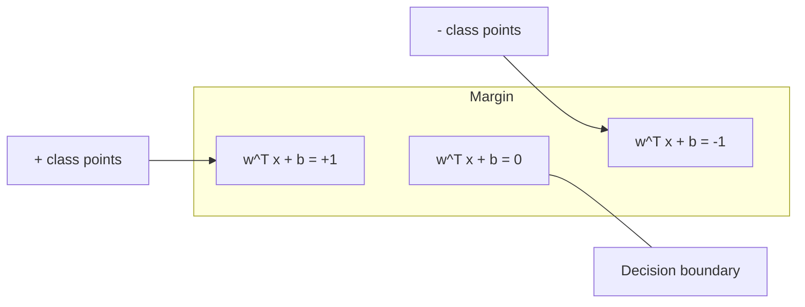
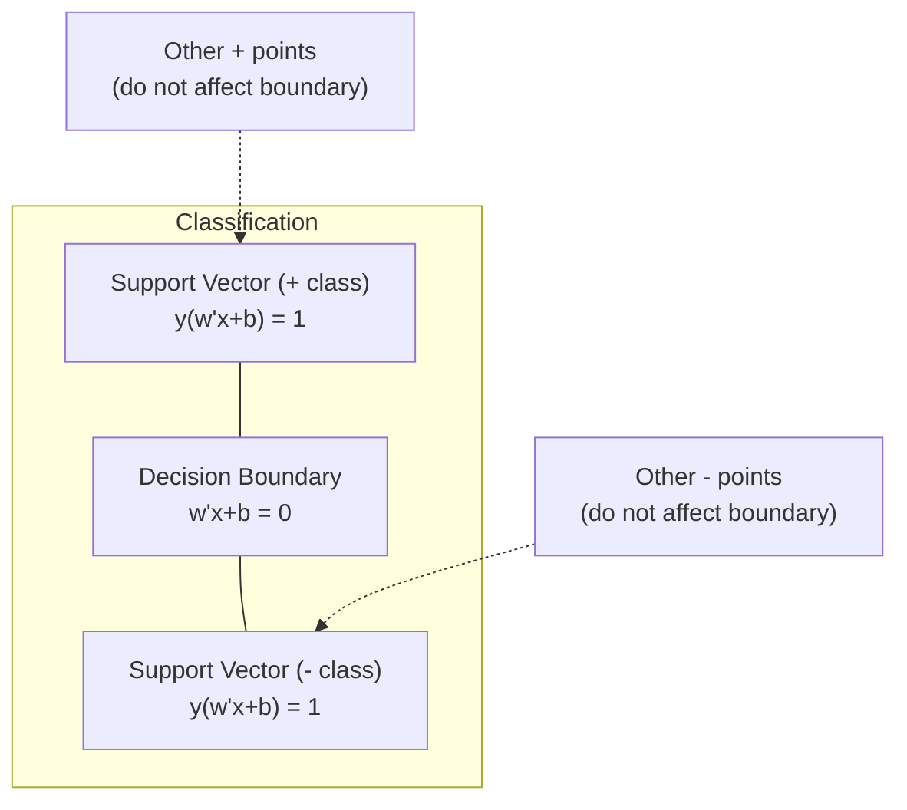
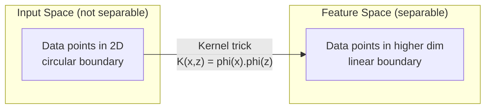

# 支持向量机

> 在两个类别之间找出最宽间隔，这就是支持向量机的核心思想。

**Type:** 构建
**Language:** Python
**Prerequisites:** 阶段 1（第 08 课优化、第 14 课范数与距离、第 18 课凸优化）
**Time:** 约 90 分钟

## 学习目标

- 在 primal formulation 上使用 hinge loss 和梯度下降，从零实现线性 SVM
- 解释最大间隔原则，并从训练后的模型中识别 support vectors
- 比较 linear、polynomial 与 RBF kernel，并解释 kernel trick 如何避免显式映射到高维空间
- 评估 C 参数在间隔宽度与分类错误之间控制的取舍

## 问题

你有两类数据点，需要画一条直线（或超平面）将它们分开。能够完成分隔的直线有无穷多条，应该选择哪一条？

选择间隔最大的那条。间隔是决策边界与两侧最近数据点之间的距离。间隔越宽，分类器越有把握，对未见数据的泛化也越好。

这个直觉引出了支持向量机，它是机器学习中数学形式最优雅的算法之一。深度学习兴起之前，SVM 是主导分类方法；对于小型数据集、高维数据，以及需要理论保证、原理清晰的模型时，它至今仍是最佳选择。

SVM 与第 1 阶段直接相连：优化问题是凸的（第 18 课），间隔使用范数度量（第 14 课），kernel trick 则利用点积处理非线性边界，而无需真正进入高维空间。

## 核心概念

### 最大间隔分类器

给定标签 y_i in {-1, +1}、特征向量 x_i 的线性可分数据，希望找到超平面 w^T x + b = 0 分隔两个类别。

点 x_i 到超平面的距离为：

```
distance = |w^T x_i + b| / ||w||
```

正确分类的点满足 y_i * (w^T x_i + b) > 0。间隔宽度等于超平面到两侧最近点距离的两倍。



优化问题为：

```
maximize    2 / ||w||     (the margin width)
subject to  y_i * (w^T x_i + b) >= 1  for all i
```

等价地，可以最小化 ||w||^2，这更容易优化：

```
minimize    (1/2) ||w||^2
subject to  y_i * (w^T x_i + b) >= 1  for all i
```

这是凸二次规划，拥有唯一全局解。恰好位于间隔边界上，也就是满足 y_i * (w^T x_i + b) = 1 的点称为 support vectors。只有它们决定决策边界；移动或删除任意非 support-vector 点，边界都不会变化。

### Support vectors：关键的少数点



大多数训练点都无关紧要，只有 support vectors 会影响模型。因此 SVM 在预测时很节省内存：只需保存支持向量，而不是完整训练集。

支持向量数量还可以为泛化误差提供上界。相对于数据集规模，支持向量越少，泛化通常越好。

### 软间隔：使用 C 参数处理噪声

真实数据很少完全线性可分。有些点可能位于边界错误一侧，或落在间隔内部。软间隔形式会引入松弛变量，允许这些违例。

```
minimize    (1/2) ||w||^2 + C * sum(xi_i)
subject to  y_i * (w^T x_i + b) >= 1 - xi_i
            xi_i >= 0  for all i
```

松弛变量 xi_i 衡量第 i 个点违反间隔的程度，C 控制取舍：

| C 值 | 行为 |
|---------|----------|
| 较大 C | 重罚违例，间隔窄、误分类少，容易过拟合 |
| 较小 C | 允许更多违例，间隔宽、误分类多，容易欠拟合 |

C 是反向表达的正则化强度：C 越大，正则化越弱；C 越小，正则化越强。

### Hinge loss：SVM 损失函数

软间隔 SVM 可以改写成无约束优化：

```
minimize    (1/2) ||w||^2 + C * sum(max(0, 1 - y_i * (w^T x_i + b)))
```

max(0, 1 - y_i * f(x_i)) 就是 hinge loss。点被正确分类且位于间隔之外时，损失为零；点处于间隔内或被错误分类时，损失线性增长。

```
Hinge loss for a single point:

loss
  |
  | \
  |  \
  |   \
  |    \
  |     \_______________
  |
  +-----|-----|-------->  y * f(x)
       0     1

Zero loss when y*f(x) >= 1 (correctly classified, outside margin).
Linear penalty when y*f(x) < 1.
```

与逻辑回归的 logistic loss 比较：

```
Hinge:     max(0, 1 - y*f(x))          Hard cutoff at margin
Logistic:  log(1 + exp(-y*f(x)))        Smooth, never exactly zero
```

Hinge loss 会产生稀疏解，只有 support vectors 贡献非零损失；logistic loss 则使用所有数据点，因此 SVM 在预测时更节省内存。

### 使用梯度下降训练线性 SVM

不求解约束 QP，也可以通过对 hinge loss 加 L2 正则化执行梯度下降来训练线性 SVM：

```
L(w, b) = (lambda/2) * ||w||^2 + (1/n) * sum(max(0, 1 - y_i * (w^T x_i + b)))

Gradient with respect to w:
  If y_i * (w^T x_i + b) >= 1:  dL/dw = lambda * w
  If y_i * (w^T x_i + b) < 1:   dL/dw = lambda * w - y_i * x_i

Gradient with respect to b:
  If y_i * (w^T x_i + b) >= 1:  dL/db = 0
  If y_i * (w^T x_i + b) < 1:   dL/db = -y_i
```

这称为 primal formulation，每个 epoch 的复杂度为 O(n * d)，其中 n 为样本数、d 为特征数。它非常适合文本分类等大型稀疏高维数据。

### 对偶形式与 kernel trick

SVM 问题的 Lagrangian 对偶形式（来自第 1 阶段第 18 课的 KKT 条件）为：

```
maximize    sum(alpha_i) - (1/2) * sum_ij(alpha_i * alpha_j * y_i * y_j * (x_i . x_j))
subject to  0 <= alpha_i <= C
            sum(alpha_i * y_i) = 0
```

对偶问题只包含数据点之间的点积 x_i . x_j，这就是关键。把每个点积替换成核函数 K(x_i, x_j)，SVM 就能学习非线性边界，而无需显式计算高维变换。

```
Linear kernel:      K(x, z) = x . z
Polynomial kernel:  K(x, z) = (x . z + c)^d
RBF (Gaussian):     K(x, z) = exp(-gamma * ||x - z||^2)
```

RBF kernel 把数据映射到无限维空间。输入空间中接近的点，核值接近 1；相距很远的点，核值接近 0。它能够学习任意平滑决策边界。



Kernel trick 会直接计算高维空间中的点积，却从不真正进入该空间。对于 D 维输入、次数为 d 的 polynomial kernel，显式特征空间有 O(D^d) 维，但 K(x, z) 只需 O(D) 时间计算。

### 用于回归的 SVM（SVR）

Support Vector Regression 会在数据周围拟合一个宽度为 epsilon 的管道。管道内的点损失为零，管道外的点受到线性惩罚。

```
minimize    (1/2) ||w||^2 + C * sum(xi_i + xi_i*)
subject to  y_i - (w^T x_i + b) <= epsilon + xi_i
            (w^T x_i + b) - y_i <= epsilon + xi_i*
            xi_i, xi_i* >= 0
```

epsilon 参数控制管道宽度。管道越宽，支持向量越少、拟合越平滑；管道越窄，支持向量越多、拟合越紧密。

### SVM 为何输给深度学习，以及它仍何时胜出

20 世纪 90 年代末到 2010 年代初，SVM 曾主导机器学习。深度学习超过它，主要有以下原因：

| 因素 | SVM | 深度学习 |
|--------|------|---------------|
| 特征工程 | 需要 | 自动学习特征 |
| 可扩展性 | Kernel 方法 O(n^2) 到 O(n^3) | 使用 SGD 每 epoch 为 O(n) |
| 图像/文本/音频 | 需要手工特征 | 直接从原始数据学习 |
| 大型数据集（>100k） | 慢 | 扩展性好 |
| GPU 加速 | 收益有限 | 大幅加速 |

SVM 在以下场景仍然有优势：
- 小型数据集，样本数从数百到几千
- 高维稀疏数据，例如 TF-IDF 文本特征
- 需要数学保证，例如 margin bound
- 训练时间必须很短，linear SVM 速度非常快
- 间隔结构清晰的二分类
- 异常检测（one-class SVM）

```figure
svm-margin
```

## 动手构建

### 第 1 步：Hinge loss 与梯度

这是基础。计算一个 batch 的 hinge loss 及其梯度。

```python
def hinge_loss(X, y, w, b):
    n = len(X)
    total_loss = 0.0
    for i in range(n):
        margin = y[i] * (dot(w, X[i]) + b)
        total_loss += max(0.0, 1.0 - margin)
    return total_loss / n
```

### 第 2 步：使用梯度下降实现线性 SVM

通过最小化带正则化的 hinge loss 训练，无需 QP 求解器。

```python
class LinearSVM:
    def __init__(self, lr=0.001, lambda_param=0.01, n_epochs=1000):
        self.lr = lr
        self.lambda_param = lambda_param
        self.n_epochs = n_epochs
        self.w = None
        self.b = 0.0

    def fit(self, X, y):
        n_features = len(X[0])
        self.w = [0.0] * n_features
        self.b = 0.0

        for epoch in range(self.n_epochs):
            for i in range(len(X)):
                margin = y[i] * (dot(self.w, X[i]) + self.b)
                if margin >= 1:
                    self.w = [wj - self.lr * self.lambda_param * wj
                              for wj in self.w]
                else:
                    self.w = [wj - self.lr * (self.lambda_param * wj - y[i] * X[i][j])
                              for j, wj in enumerate(self.w)]
                    self.b -= self.lr * (-y[i])

    def predict(self, X):
        return [1 if dot(self.w, x) + self.b >= 0 else -1 for x in X]
```

### 第 3 步：核函数

实现 linear、polynomial 和 RBF kernel。

```python
def linear_kernel(x, z):
    return dot(x, z)

def polynomial_kernel(x, z, degree=3, c=1.0):
    return (dot(x, z) + c) ** degree

def rbf_kernel(x, z, gamma=0.5):
    diff = [xi - zi for xi, zi in zip(x, z)]
    return math.exp(-gamma * dot(diff, diff))
```

### 第 4 步：计算间隔并识别 support vectors

训练后，识别 support vectors 并计算间隔宽度。

```python
def find_support_vectors(X, y, w, b, tol=1e-3):
    support_vectors = []
    for i in range(len(X)):
        margin = y[i] * (dot(w, X[i]) + b)
        if abs(margin - 1.0) < tol:
            support_vectors.append(i)
    return support_vectors
```

包含全部演示的完整实现见 `code/svm.py`。

## 实际使用

使用 scikit-learn：

```python
from sklearn.svm import SVC, LinearSVC, SVR
from sklearn.preprocessing import StandardScaler
from sklearn.pipeline import Pipeline

clf = Pipeline([
    ("scaler", StandardScaler()),
    ("svm", SVC(kernel="rbf", C=1.0, gamma="scale")),
])
clf.fit(X_train, y_train)
print(f"Accuracy: {clf.score(X_test, y_test):.4f}")
print(f"Support vectors: {clf['svm'].n_support_}")
```

重要提醒：训练 SVM 前始终应缩放特征。SVM 对特征尺度非常敏感，因为间隔依赖 ||w||，未缩放特征会扭曲几何结构。

对于大型数据集，应使用 `LinearSVC`（primal formulation，每 epoch O(n)），而不是 `SVC`（dual formulation，O(n^2) 到 O(n^3)）：

```python
from sklearn.svm import LinearSVC

clf = Pipeline([
    ("scaler", StandardScaler()),
    ("svm", LinearSVC(C=1.0, max_iter=10000)),
])
```

## 练习

1. 生成二维线性可分数据集，训练 LinearSVM 并识别 support vectors，验证它们就是距离决策边界最近的点。

2. 在含噪数据集上把 C 从 0.001 改到 1000，分别绘制决策边界，观察模型如何从宽间隔（欠拟合）过渡到窄间隔（过拟合）。

3. 创建类别边界为圆形的非线性数据集，展示 linear SVM 会失败；再计算 RBF kernel 矩阵，展示类别在核函数诱导的特征空间中变得可分。

4. 在同一数据集上比较 hinge loss 与 logistic loss，分别训练 linear SVM 和逻辑回归，统计有多少训练点会影响各自的决策边界，也就是 support vectors 与所有数据点的差异。

5. 实现 SVR（epsilon-insensitive loss），拟合 y = sin(x) + noise；画出预测周围的 epsilon 管道，并突出 support vectors，也就是管道外的点。

## 关键术语

| 术语 | 准确含义 |
|------|----------------------|
| Support vectors | 距离决策边界最近的训练点，也是唯一决定超平面的点 |
| Margin | 决策边界与最近支持向量之间的距离；SVM 会将其最大化 |
| Hinge loss | max(0, 1 - y*f(x))；正确分类且位于间隔外时为零，否则线性惩罚 |
| C parameter | 间隔宽度与分类错误之间的取舍；大 C 对应窄间隔，小 C 对应宽间隔 |
| Soft margin | 通过松弛变量允许违反间隔的 SVM 形式，可处理不可分数据 |
| Kernel trick | 无需显式映射，就能计算高维特征空间中的点积 |
| Linear kernel | K(x, z) = x . z，等价于普通点积，适用于线性可分数据 |
| RBF kernel | K(x, z) = exp(-gamma * \|\|x-z\|\|^2)，映射到无限维，能学习任意平滑边界 |
| Polynomial kernel | K(x, z) = (x . z + c)^d，映射到多项式组合组成的特征空间 |
| Dual formulation | 只依赖数据点之间点积的 SVM 重写形式，使核函数成为可能 |
| SVR | Support Vector Regression，在数据周围拟合 epsilon 管道，管道内点损失为零 |
| Slack variables | xi_i，衡量点违反间隔多少；正确分类且位于间隔外的点取零 |
| Maximum margin | 选择使决策边界到两类最近点距离最大的超平面 |

## 延伸阅读

- [Vapnik：《The Nature of Statistical Learning Theory》（1995）](https://link.springer.com/book/10.1007/978-1-4757-3264-1)——SVM 与统计学习的奠基著作
- [Cortes 与 Vapnik：Support-vector networks（1995）](https://link.springer.com/article/10.1007/BF00994018)——SVM 原始论文
- [Platt：Sequential Minimal Optimization（1998）](https://www.microsoft.com/en-us/research/publication/sequential-minimal-optimization-a-fast-algorithm-for-training-support-vector-machines/)——让 SVM 训练变得实用的 SMO 算法
- [scikit-learn SVM 文档](https://scikit-learn.org/stable/modules/svm.html)——包含实现细节的实践指南
- [LIBSVM：支持向量机库](https://www.csie.ntu.edu.tw/~cjlin/libsvm/)——多数 SVM 实现背后的 C++ 库
