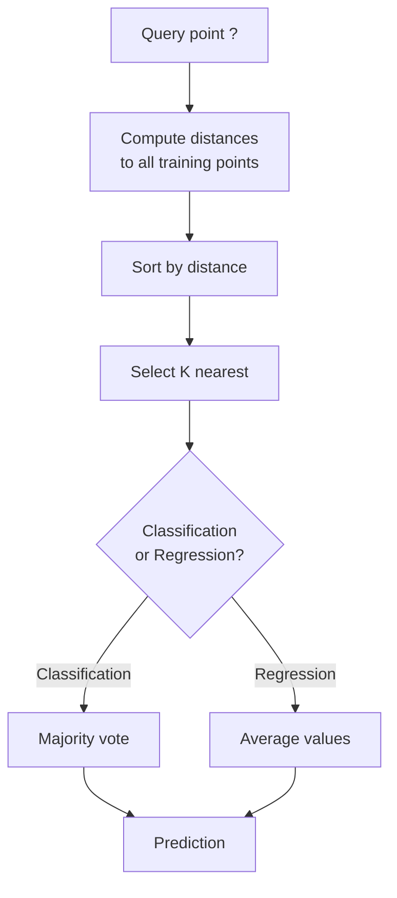
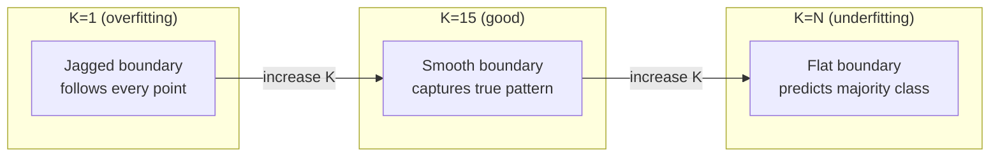
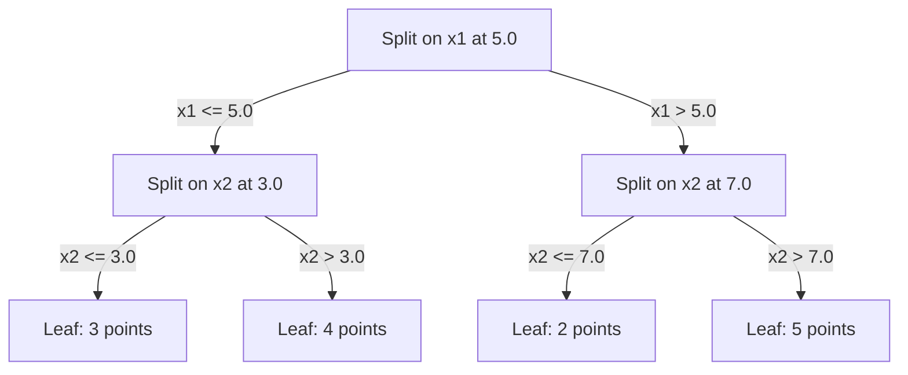

# K 近邻与距离

> 保存所有数据，通过观察邻居进行预测。这是最简单、却真正有效的算法。

**Type:** 构建
**Language:** Python
**Prerequisites:** 阶段 1（第 14 课范数与距离）
**Time:** 约 90 分钟

## 学习目标

- 从零实现 KNN 分类与回归，并支持配置 K 和按距离加权投票
- 比较 L1、L2、余弦与 Minkowski 距离，并针对给定数据类型选择合适度量
- 解释维度灾难，并演示 KNN 为何会在高维空间中退化
- 构建 KD-tree 以高效执行最近邻搜索，并分析它何时比暴力搜索更快

## 问题

你有一份数据集，现在来了一个新数据点，需要为它分类或预测数值。与线性回归或 SVM 不同，你不必从数据中学习参数，只需找到距离新点最近的 K 个训练点，再让它们投票。

这就是 K-nearest neighbors。它没有训练阶段，不需要学习参数，也没有要最小化的损失函数。你只需保存整个训练集，在预测时计算距离。

这个方法简单得似乎不可能有效，但 KNN 在许多问题上都具有出人意料的竞争力，尤其适合中小型数据集。深入理解它，还会揭示几个基础概念：距离度量的选择（与第 1 阶段第 14 课相连）、维度灾难，以及 lazy learning 与 eager learning 的差异。

KNN 也遍布现代 AI，只是换了不同名称。向量数据库会在嵌入上执行 KNN 搜索；检索增强生成（RAG）会寻找 K 个最近的文档分块；推荐系统会寻找相似用户或物品。算法完全相同，变化的只是规模和数据结构。

## 核心概念

### KNN 如何工作

给定一组带标签数据点和一个新查询点：

1. 计算查询点与数据集中每个点的距离
2. 按距离排序
3. 取距离最近的 K 个点
4. 分类任务：让 K 个邻居多数投票
5. 回归任务：对 K 个邻居的数值求平均，或加权平均



这就是整个算法：无需拟合，没有梯度下降，也没有 epoch。

### 选择 K

K 是唯一的超参数，它控制 bias-variance 取舍：

| K | 行为 |
|---|----------|
| K = 1 | 决策边界跟随每个点，训练误差为零，方差很高，容易过拟合 |
| 较小 K（3–5） | 对局部结构敏感，能够捕获复杂边界 |
| 较大 K | 边界更平滑、对噪声更稳健，但可能欠拟合 |
| K = N | 对每个点都预测多数类别，偏差最大 |

对于包含 N 个点的数据集，常见起点是 K = sqrt(N)。二分类应使用奇数 K，以避免平票。



### 距离度量

距离函数定义了“近”的含义。不同度量会产生不同邻居和不同预测。

**L2（Euclidean）距离**是默认选择，也就是直线距离。

```
d(a, b) = sqrt(sum((a_i - b_i)^2))
```

它对特征尺度非常敏感。KNN 使用 L2 时，必须先标准化特征。

**L1（Manhattan）距离**对绝对差求和。它不会把差值平方，因此比 L2 更能抵抗异常值。

```
d(a, b) = sum(|a_i - b_i|)
```

**余弦距离**衡量向量夹角而忽略长度，是文本和嵌入数据的关键度量。

```
d(a, b) = 1 - (a . b) / (||a|| * ||b||)
```

**Minkowski 距离**使用参数 p 推广 L1 与 L2。

```
d(a, b) = (sum(|a_i - b_i|^p))^(1/p)

p=1: Manhattan
p=2: Euclidean
p->inf: Chebyshev (max absolute difference)
```

应根据数据选择度量：

| 数据类型 | 最佳度量 | 原因 |
|-----------|------------|-----|
| 尺度相近的数值特征 | L2（Euclidean） | 默认选择，适合空间数据 |
| 包含异常值的数值特征 | L1（Manhattan） | 稳健，不会放大较大差异 |
| 文本嵌入 | 余弦距离 | 长度是噪声，方向表示含义 |
| 高维稀疏数据 | 余弦或 L1 | L2 会受到维度灾难影响 |
| 混合类型 | 自定义距离 | 针对每种特征类型组合不同度量 |

### 加权 KNN

标准 KNN 为所有 K 个邻居分配相同权重，但距离 0.1 的邻居显然应该比距离 5.0 的邻居影响更大。

**距离加权 KNN**让邻居权重与距离成反比：

```
weight_i = 1 / (distance_i + epsilon)

For classification: weighted vote
For regression:     weighted average = sum(w_i * y_i) / sum(w_i)
```

epsilon 可以防止查询点恰好与训练点重合时除以零。

加权 KNN 对 K 的选择不那么敏感，因为较远邻居无论是否被包含，贡献都很小。

### 维度灾难

KNN 在高维空间中的性能会下降，这不是模糊担忧，而是数学事实。

**问题 1：距离趋同。**维度增加时，最大距离与最小距离之比会趋近 1，所有点对查询点来说都差不多“远”。

```
In d dimensions, for random uniform points:

d=2:    max_dist / min_dist = varies widely
d=100:  max_dist / min_dist ~ 1.01
d=1000: max_dist / min_dist ~ 1.001

When all distances are nearly equal, "nearest" is meaningless.
```

**问题 2：体积爆炸。**为了在高维空间中覆盖固定比例的数据并找到 K 个邻居，搜索半径必须扩展到涵盖特征空间的大部分区域。“邻域”最终几乎等于整个空间。

**问题 3：角落占主导。**d 维单位超立方体的大部分体积集中在角落，而非中心；维度增大时，内切球占超立方体总体积的比例会趋近零。

实践后果是：KNN 通常在约 20–50 个特征以内表现良好。维度更高时，应先用 PCA、UMAP 或 t-SNE 降维，或者使用能够利用数据内在低维结构的树搜索结构。

### KD-tree：快速最近邻搜索

暴力 KNN 会计算查询与每个训练点之间的距离，每次查询复杂度为 O(n * d)，大型数据集无法承受。

KD-tree 会沿特征轴递归划分空间，每一层都在一个维度的中位数处切分。



寻找最近邻时，先沿树进入包含查询点的叶节点，再回溯；只有当相邻分区可能包含更近点时，才检查它们。

低维空间中的平均查询时间为 O(log n)。但在高维空间（d > 20）中，回溯时能够排除的分支越来越少，KD-tree 会退化到 O(n)。

### Ball tree：更适合中等维度

Ball tree 不使用沿坐标轴对齐的矩形，而是把数据划分为嵌套超球。每个节点都定义一个包含该子树所有点的球，也就是中心与半径。

相较 KD-tree，它的优势是：
- 在中等维度中表现更好，可达到约 50 维
- 能处理不沿坐标轴排列的结构
- 包围体积更紧，因此搜索时可以剪掉更多分支

KD-tree 和 ball tree 都是精确算法。面对数百万点、数百维的真正大规模搜索，应使用 approximate nearest neighbor 方法，例如 HNSW、IVF 和 product quantization；第 1 阶段第 14 课已经介绍这些方法。

### Lazy learning 与 eager learning

KNN 是 lazy learner：训练时不做计算，把全部工作留到预测阶段。大多数其他算法——线性回归、SVM、神经网络——是 eager learner：训练时进行大量计算，构建紧凑模型，预测则很快。

| 方面 | Lazy（KNN） | Eager（SVM、神经网络） |
|--------|------------|------------------------|
| 训练时间 | O(1)，只保存数据 | O(n * epochs) |
| 预测时间 | 每次查询 O(n * d) | O(d) 或 O(parameters) |
| 预测时内存 | 保存整个训练集 | 只保存模型参数 |
| 适应新数据 | 立即添加数据点 | 需要重新训练模型 |
| 决策边界 | 隐式，在预测时动态计算 | 显式，训练后固定 |

Lazy learning 适合：
- 数据集频繁变化，需要无需重训就增删数据点
- 只需要少量查询预测
- 希望训练时间为零
- 数据集足够小，暴力搜索也很快

### 用于回归的 KNN

KNN 回归不做多数投票，而是对 K 个邻居的目标值求平均。

```
prediction = (1/K) * sum(y_i for i in K nearest neighbors)

Or with distance weighting:
prediction = sum(w_i * y_i) / sum(w_i)
where w_i = 1 / distance_i
```

KNN 回归会产生分段常数预测；加权后则是分段平滑预测。它无法外推到训练目标范围之外。如果训练目标都在 0–100 之间，KNN 永远不会预测 200。

```figure
knn-smoothness
```

## 动手构建

### 第 1 步：距离函数

实现 L1、L2、余弦和 Minkowski 距离，它们与第 1 阶段第 14 课直接相连。

```python
import math

def l2_distance(a, b):
    return math.sqrt(sum((ai - bi) ** 2 for ai, bi in zip(a, b)))

def l1_distance(a, b):
    return sum(abs(ai - bi) for ai, bi in zip(a, b))

def cosine_distance(a, b):
    dot_val = sum(ai * bi for ai, bi in zip(a, b))
    norm_a = math.sqrt(sum(ai ** 2 for ai in a))
    norm_b = math.sqrt(sum(bi ** 2 for bi in b))
    if norm_a == 0 or norm_b == 0:
        return 1.0
    return 1.0 - dot_val / (norm_a * norm_b)

def minkowski_distance(a, b, p=2):
    if p == float('inf'):
        return max(abs(ai - bi) for ai, bi in zip(a, b))
    return sum(abs(ai - bi) ** p for ai, bi in zip(a, b)) ** (1 / p)
```

### 第 2 步：KNN 分类器与回归器

构建支持配置 K、距离度量和可选距离加权的完整 KNN。

```python
class KNN:
    def __init__(self, k=5, distance_fn=l2_distance, weighted=False,
                 task="classification"):
        self.k = k
        self.distance_fn = distance_fn
        self.weighted = weighted
        self.task = task
        self.X_train = None
        self.y_train = None

    def fit(self, X, y):
        self.X_train = X
        self.y_train = y

    def predict(self, X):
        return [self._predict_one(x) for x in X]
```

### 第 3 步：用于高效搜索的 KD-tree

从零构建 KD-tree，沿每个维度的中位数递归划分数据。

```python
class KDTree:
    def __init__(self, X, indices=None, depth=0):
        # Recursively partition the data
        self.axis = depth % len(X[0])
        # Split on median of the current axis
        ...

    def query(self, point, k=1):
        # Traverse to leaf, then backtrack
        ...
```

包含全部辅助方法与演示的完整实现见 `code/knn.py`。

### 第 4 步：特征缩放

KNN 必须进行特征缩放，因为距离对特征数值大小非常敏感。范围 0–1000 的特征会主导范围 0–1 的特征。

```python
def standardize(X):
    n = len(X)
    d = len(X[0])
    means = [sum(X[i][j] for i in range(n)) / n for j in range(d)]
    stds = [
        max(1e-10, (sum((X[i][j] - means[j]) ** 2 for i in range(n)) / n) ** 0.5)
        for j in range(d)
    ]
    return [[((X[i][j] - means[j]) / stds[j]) for j in range(d)] for i in range(n)], means, stds
```

## 实际使用

使用 scikit-learn：

```python
from sklearn.neighbors import KNeighborsClassifier
from sklearn.preprocessing import StandardScaler
from sklearn.pipeline import Pipeline

clf = Pipeline([
    ("scaler", StandardScaler()),
    ("knn", KNeighborsClassifier(n_neighbors=5, metric="euclidean")),
])
clf.fit(X_train, y_train)
print(f"Accuracy: {clf.score(X_test, y_test):.4f}")
```

当数据集足够大、维度足够低时，scikit-learn 会自动使用 KD-tree 或 ball tree；对于高维数据则退回暴力搜索。可以使用 `algorithm` 参数控制这一行为。

面对数百万向量的大规模最近邻搜索，应使用 FAISS、Annoy 或向量数据库：

```python
import faiss

index = faiss.IndexFlatL2(dimension)
index.add(embeddings)
distances, indices = index.search(query_vectors, k=5)
```

## 练习

1. 在包含 3 类的二维数据集上实现 KNN 分类，并分别绘制 K=1、K=5、K=15 和 K=N 时的决策边界，观察从过拟合到欠拟合的变化。

2. 分别在 2、5、10、50、100 和 500 维空间中生成 1,000 个随机点。对每种维度，计算最大两两距离与最小两两距离之比，绘制比值随维度变化的曲线，直观看到维度灾难。

3. 在文本分类问题上使用 TF-IDF 向量，比较 KNN 的 L1、L2 和余弦距离。哪一种准确率最高？为什么余弦距离通常在文本上胜出？

4. 实现 KD-tree，分别在二维、十维和五十维的 1k、10k、100k 点数据集上，比较查询时间与暴力搜索。达到哪个维度后，KD-tree 不再比暴力搜索快？

5. 为 y = sin(x) + noise 构建加权 KNN 回归器，分别在 K=3、10、30 时与无权 KNN 比较。展示加权会产生更平滑的预测，尤其是在 K 较大时。

## 关键术语

| 术语 | 准确含义 |
|------|----------------------|
| K-nearest neighbors | 根据距离查询点最近的 K 个训练点作出预测的非参数算法 |
| Lazy learning | 训练时不做计算，所有工作都在预测时完成；KNN 是典型例子 |
| Eager learning | 训练时进行大量计算以构建紧凑模型；多数机器学习算法属于此类 |
| 维度灾难 | 高维空间中距离趋同，邻域扩张到覆盖大部分空间，使 KNN 失效 |
| KD-tree | 沿特征轴递归划分空间的二叉树，低维空间查询复杂度平均为 O(log n) |
| Ball tree | 嵌套超球组成的树，在约 50 维以内的中等维度中比 KD-tree 更有效 |
| Weighted KNN | 按距离倒数为邻居加权，越近的邻居对预测影响越大 |
| Feature scaling | 把特征归一化到可比较范围，是 KNN 等基于距离方法的必要步骤 |
| Majority vote | 统计 K 个邻居中最常见类别进行分类 |
| 暴力搜索 | 计算查询点到每个训练点的距离，每次查询 O(n*d)，精确但在大 n 下很慢 |
| 近似最近邻 | HNSW、LSH、IVF 等算法，以少量准确率损失换取远快于精确搜索的速度 |
| Voronoi diagram | 对空间进行划分，每个区域包含比其他训练点更接近某个训练点的全部位置；K=1 的 KNN 会产生 Voronoi 边界 |

## 延伸阅读

- [Cover 与 Hart：Nearest Neighbor Pattern Classification（1967）](https://ieeexplore.ieee.org/document/1053964)——KNN 奠基论文，证明其错误率最多是 Bayes 最优错误率的两倍
- [Friedman、Bentley、Finkel：在对数期望时间内寻找最佳匹配的算法（1977）](https://dl.acm.org/doi/10.1145/355744.355745)——KD-tree 原始论文
- [Beyer 等：最近邻何时有意义？（1999）](https://link.springer.com/chapter/10.1007/3-540-49257-7_15)——最近邻维度灾难的形式化分析
- [scikit-learn Nearest Neighbors 文档](https://scikit-learn.org/stable/modules/neighbors.html)——算法选择的实践指南
- [FAISS：高效相似度搜索库](https://github.com/facebookresearch/faiss)——Meta 面向十亿规模近似最近邻搜索的库
