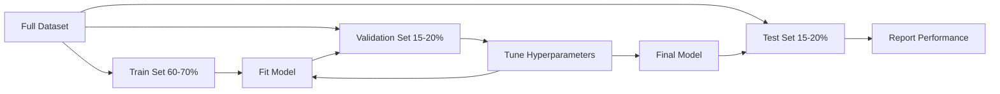

# 模型评估

> 模型好不好，取决于你如何衡量它。

**Type:** 构建
**Languages:** Python
**Prerequisites:** 阶段 1（概率与分布、机器学习统计学）、阶段 2 第 1–8 课
**Time:** 约 90 分钟

## 学习目标

- 从零实现 K-fold 与 stratified K-fold 交叉验证，并解释分层为何对不平衡数据重要
- 从零计算 precision、recall、F1、AUC-ROC，以及回归指标 MSE、RMSE、MAE、R-squared
- 解读学习曲线，诊断模型存在高偏差还是高方差
- 识别常见评估错误，包括数据泄漏、指标选择错误和测试集污染

## 问题

你训练了一个模型，它在数据上达到 95% 准确率。这个模型好吗？

可能好，也可能不好。如果 95% 的数据都属于同一类别，一个始终预测该类别的模型也能获得 95% 准确率，却完全没有用。如果在训练数据上评估，95% 毫无意义，因为模型可能只是记住了答案。如果数据带有时间顺序，而你在划分前随机打乱，模型可能正在用未来数据预测过去。

模型评估是多数机器学习项目最容易出错的环节。错误指标会让坏模型看起来很好，错误划分会让模型作弊，错误比较会让你选中更差的模型。正确评估不是可选项，它决定模型能否在生产中工作，还是一接触真实数据就失败。

## 核心概念

### 训练集、验证集与测试集



三种划分，三种用途：

- **训练集：**模型从这些数据中学习，训练期间会看到这些样本。
- **验证集：**用于调整超参数和选择模型。模型不会直接在这些数据上训练，但你的决策受到它影响。
- **测试集：**只在最后使用一次，用于报告最终性能。如果查看测试表现后又回去修改模型，它就不再是测试集，而变成第二个验证集。

测试集是你的留出保证：报告的性能应反映模型面对真正未见数据时的表现。

### K-Fold 交叉验证

对于小型数据集，单次训练/验证划分会浪费数据，也会产生噪声很大的估计。K-fold 交叉验证让所有数据都既用于训练，也用于验证：

```mermaid
flowchart TB
    subgraph Fold1["Fold 1"]
        direction LR
        V1["Val"] --- T1a["Train"] --- T1b["Train"] --- T1c["Train"] --- T1d["Train"]
    end
    subgraph Fold2["Fold 2"]
        direction LR
        T2a["Train"] --- V2["Val"] --- T2b["Train"] --- T2c["Train"] --- T2d["Train"]
    end
    subgraph Fold3["Fold 3"]
        direction LR
        T3a["Train"] --- T3b["Train"] --- V3["Val"] --- T3c["Train"] --- T3d["Train"]
    end
    subgraph Fold4["Fold 4"]
        direction LR
        T4a["Train"] --- T4b["Train"] --- T4c["Train"] --- V4["Val"] --- T4d["Train"]
    end
    subgraph Fold5["Fold 5"]
        direction LR
        T5a["Train"] --- T5b["Train"] --- T5c["Train"] --- T5d["Train"] --- V5["Val"]
    end
    Fold1 --> R["Average scores"]
    Fold2 --> R
    Fold3 --> R
    Fold4 --> R
    Fold5 --> R
```



1. 把数据拆成 K 个大小相近的 fold
2. 每次在 K-1 个 fold 上训练，在剩余 fold 上验证
3. 对 K 个验证分数求平均

K=5 或 K=10 是常见选择。每个数据点都会恰好作为验证样本一次，平均分数比任意单次划分更稳定。

**Stratified K-fold：**每个 fold 都保持类别分布。如果数据集 70% 属于类别 A、30% 属于类别 B，每个 fold 也大致保持这一比例。对于不平衡数据，这很重要，因为随机划分可能把少数类样本几乎全部放进一个 fold。

### 分类指标

**Confusion matrix：**这是所有指标的基础。对于二分类：

|  | 预测为正 | 预测为负 |
|--|---|---|
| 实际为正 | True Positive (TP) | False Negative (FN) |
| 实际为负 | False Positive (FP) | True Negative (TN) |

所有其他指标都由该矩阵计算：

- **Accuracy** = (TP + TN) / (TP + TN + FP + FN)。正确预测比例；类别不平衡时会产生误导。
- **Precision** = TP / (TP + FP)。所有预测为正的样本中，多少实际为正？假阳性代价高时使用，例如垃圾邮件过滤器不能把正常邮件标为垃圾邮件。
- **Recall（sensitivity）** = TP / (TP + FN)。所有实际正类中，模型捕获了多少？假阴性代价高时使用，例如癌症筛查不能漏掉肿瘤。
- **F1 score** = 2 * precision * recall / (precision + recall)。Precision 与 recall 的调和平均，在二者没有明确主次时取得平衡。
- **AUC-ROC：**Receiver Operating Characteristic 曲线下面积。在不同分类阈值下绘制 true positive rate 与 false positive rate。AUC = 0.5 表示随机猜测，AUC = 1.0 表示完美分离。它与具体阈值无关，衡量模型把正类排在负类之前的能力。

### 回归指标

- **MSE（Mean Squared Error）** = mean((y_true - y_pred)^2)。对大误差进行平方惩罚，对异常值敏感。
- **RMSE（Root Mean Squared Error）** = sqrt(MSE)。与目标变量单位相同，比 MSE 更容易解释。
- **MAE（Mean Absolute Error）** = mean(|y_true - y_pred|)。对所有误差线性惩罚，比 MSE 更能抵抗异常值。
- **R-squared** = 1 - SS_res / SS_tot，其中 SS_res = sum((y_true - y_pred)^2)，SS_tot = sum((y_true - y_mean)^2)。表示模型解释了多少目标方差。R^2 = 1.0 表示完美，R^2 = 0.0 表示与始终预测均值一样好；模型比均值更差时，R^2 可以为负。

### 学习曲线

绘制训练分数和验证分数随训练集大小变化的曲线：

- **高偏差（欠拟合）：**两条曲线收敛到较低分数。添加更多数据不会有帮助，需要更复杂的模型。
- **高方差（过拟合）：**训练分数很高，验证分数明显更低，二者差距很大。增加数据通常有帮助。

### 验证曲线

绘制训练分数和验证分数随某个超参数变化的曲线：

- 复杂度低时：两项分数都低，模型欠拟合
- 复杂度适中时：两项分数都高且接近
- 复杂度高时：训练分数仍高，验证分数下降，模型过拟合

最佳超参数位于验证分数最高的位置。

### 常见评估错误

**数据泄漏：**测试集信息进入训练过程。例如划分前就在完整数据集上拟合 scaler、时间序列中使用未来数据、使用从目标变量推导出的特征。必须先划分，再做预处理。

**类别不平衡：**99% 的交易合法、1% 是欺诈。始终预测“合法”的模型也能达到 99% 准确率。应使用 precision、recall、F1 或 AUC-ROC。

**指标错误：**医学诊断应优化 recall，却优化了 accuracy；数据含重尾异常值时，仍优化 RMSE，而不是更稳健的 MAE。

**没有使用分层划分：**不平衡数据随机划分时，验证 fold 可能只有极少少数类样本，估计会非常不稳定。

**过于频繁地测试：**每次查看测试性能并调整模型，都会过拟合测试集。测试集只能使用一次。

```figure
precision-recall-threshold
```

## 动手构建

### 第 1 步：训练/验证/测试划分

```python
import random
import math


def train_val_test_split(X, y, train_ratio=0.6, val_ratio=0.2, seed=42):
    random.seed(seed)
    n = len(X)
    indices = list(range(n))
    random.shuffle(indices)

    train_end = int(n * train_ratio)
    val_end = int(n * (train_ratio + val_ratio))

    train_idx = indices[:train_end]
    val_idx = indices[train_end:val_end]
    test_idx = indices[val_end:]

    X_train = [X[i] for i in train_idx]
    y_train = [y[i] for i in train_idx]
    X_val = [X[i] for i in val_idx]
    y_val = [y[i] for i in val_idx]
    X_test = [X[i] for i in test_idx]
    y_test = [y[i] for i in test_idx]

    return X_train, y_train, X_val, y_val, X_test, y_test
```

### 第 2 步：K-fold 与 stratified K-fold 交叉验证

```python
def kfold_split(n, k=5, seed=42):
    random.seed(seed)
    indices = list(range(n))
    random.shuffle(indices)

    fold_size = n // k
    folds = []

    for i in range(k):
        start = i * fold_size
        end = start + fold_size if i < k - 1 else n
        val_idx = indices[start:end]
        train_idx = indices[:start] + indices[end:]
        folds.append((train_idx, val_idx))

    return folds


def stratified_kfold_split(y, k=5, seed=42):
    random.seed(seed)

    class_indices = {}
    for i, label in enumerate(y):
        class_indices.setdefault(label, []).append(i)

    for label in class_indices:
        random.shuffle(class_indices[label])

    folds = [{"train": [], "val": []} for _ in range(k)]

    for label, indices in class_indices.items():
        fold_size = len(indices) // k
        for i in range(k):
            start = i * fold_size
            end = start + fold_size if i < k - 1 else len(indices)
            val_part = indices[start:end]
            train_part = indices[:start] + indices[end:]
            folds[i]["val"].extend(val_part)
            folds[i]["train"].extend(train_part)

    return [(f["train"], f["val"]) for f in folds]


def cross_validate(X, y, model_fn, k=5, metric_fn=None, stratified=False):
    n = len(X)

    if stratified:
        folds = stratified_kfold_split(y, k)
    else:
        folds = kfold_split(n, k)

    scores = []
    for train_idx, val_idx in folds:
        X_train = [X[i] for i in train_idx]
        y_train = [y[i] for i in train_idx]
        X_val = [X[i] for i in val_idx]
        y_val = [y[i] for i in val_idx]

        model = model_fn()
        model.fit(X_train, y_train)
        predictions = [model.predict(x) for x in X_val]

        if metric_fn:
            score = metric_fn(y_val, predictions)
        else:
            score = sum(1 for yt, yp in zip(y_val, predictions) if yt == yp) / len(y_val)
        scores.append(score)

    return scores
```

### 第 3 步：Confusion matrix 与分类指标

```python
def confusion_matrix(y_true, y_pred):
    tp = sum(1 for yt, yp in zip(y_true, y_pred) if yt == 1 and yp == 1)
    tn = sum(1 for yt, yp in zip(y_true, y_pred) if yt == 0 and yp == 0)
    fp = sum(1 for yt, yp in zip(y_true, y_pred) if yt == 0 and yp == 1)
    fn = sum(1 for yt, yp in zip(y_true, y_pred) if yt == 1 and yp == 0)
    return tp, tn, fp, fn


def accuracy(y_true, y_pred):
    tp, tn, fp, fn = confusion_matrix(y_true, y_pred)
    total = tp + tn + fp + fn
    return (tp + tn) / total if total > 0 else 0.0


def precision(y_true, y_pred):
    tp, tn, fp, fn = confusion_matrix(y_true, y_pred)
    return tp / (tp + fp) if (tp + fp) > 0 else 0.0


def recall(y_true, y_pred):
    tp, tn, fp, fn = confusion_matrix(y_true, y_pred)
    return tp / (tp + fn) if (tp + fn) > 0 else 0.0


def f1_score(y_true, y_pred):
    p = precision(y_true, y_pred)
    r = recall(y_true, y_pred)
    return 2 * p * r / (p + r) if (p + r) > 0 else 0.0


def roc_curve(y_true, y_scores):
    thresholds = sorted(set(y_scores), reverse=True)
    tpr_list = []
    fpr_list = []

    total_positives = sum(y_true)
    total_negatives = len(y_true) - total_positives

    for threshold in thresholds:
        y_pred = [1 if s >= threshold else 0 for s in y_scores]
        tp = sum(1 for yt, yp in zip(y_true, y_pred) if yt == 1 and yp == 1)
        fp = sum(1 for yt, yp in zip(y_true, y_pred) if yt == 0 and yp == 1)

        tpr = tp / total_positives if total_positives > 0 else 0.0
        fpr = fp / total_negatives if total_negatives > 0 else 0.0

        tpr_list.append(tpr)
        fpr_list.append(fpr)

    return fpr_list, tpr_list, thresholds


def auc_roc(y_true, y_scores):
    fpr_list, tpr_list, _ = roc_curve(y_true, y_scores)

    pairs = sorted(zip(fpr_list, tpr_list))
    fpr_sorted = [p[0] for p in pairs]
    tpr_sorted = [p[1] for p in pairs]

    area = 0.0
    for i in range(1, len(fpr_sorted)):
        width = fpr_sorted[i] - fpr_sorted[i - 1]
        height = (tpr_sorted[i] + tpr_sorted[i - 1]) / 2
        area += width * height

    return area
```

### 第 4 步：回归指标

```python
def mse(y_true, y_pred):
    n = len(y_true)
    return sum((yt - yp) ** 2 for yt, yp in zip(y_true, y_pred)) / n


def rmse(y_true, y_pred):
    return math.sqrt(mse(y_true, y_pred))


def mae(y_true, y_pred):
    n = len(y_true)
    return sum(abs(yt - yp) for yt, yp in zip(y_true, y_pred)) / n


def r_squared(y_true, y_pred):
    mean_y = sum(y_true) / len(y_true)
    ss_res = sum((yt - yp) ** 2 for yt, yp in zip(y_true, y_pred))
    ss_tot = sum((yt - mean_y) ** 2 for yt in y_true)
    if ss_tot == 0:
        return 0.0
    return 1.0 - ss_res / ss_tot
```

### 第 5 步：学习曲线

```python
def learning_curve(X, y, model_fn, metric_fn, train_sizes=None, val_ratio=0.2, seed=42):
    random.seed(seed)
    n = len(X)
    indices = list(range(n))
    random.shuffle(indices)

    val_size = int(n * val_ratio)
    val_idx = indices[:val_size]
    pool_idx = indices[val_size:]

    X_val = [X[i] for i in val_idx]
    y_val = [y[i] for i in val_idx]

    if train_sizes is None:
        train_sizes = [int(len(pool_idx) * r) for r in [0.1, 0.2, 0.4, 0.6, 0.8, 1.0]]

    train_scores = []
    val_scores = []

    for size in train_sizes:
        subset = pool_idx[:size]
        X_train = [X[i] for i in subset]
        y_train = [y[i] for i in subset]

        model = model_fn()
        model.fit(X_train, y_train)

        train_pred = [model.predict(x) for x in X_train]
        val_pred = [model.predict(x) for x in X_val]

        train_scores.append(metric_fn(y_train, train_pred))
        val_scores.append(metric_fn(y_val, val_pred))

    return train_sizes, train_scores, val_scores
```

### 第 6 步：用于测试的简单分类器与完整演示

```python
class SimpleLogistic:
    def __init__(self, lr=0.1, epochs=100):
        self.lr = lr
        self.epochs = epochs
        self.weights = None
        self.bias = 0.0

    def sigmoid(self, z):
        z = max(-500, min(500, z))
        return 1.0 / (1.0 + math.exp(-z))

    def fit(self, X, y):
        n_features = len(X[0])
        self.weights = [0.0] * n_features
        self.bias = 0.0

        for _ in range(self.epochs):
            for xi, yi in zip(X, y):
                z = sum(w * x for w, x in zip(self.weights, xi)) + self.bias
                pred = self.sigmoid(z)
                error = yi - pred
                for j in range(n_features):
                    self.weights[j] += self.lr * error * xi[j]
                self.bias += self.lr * error

    def predict_proba(self, x):
        z = sum(w * xi for w, xi in zip(self.weights, x)) + self.bias
        return self.sigmoid(z)

    def predict(self, x):
        return 1 if self.predict_proba(x) >= 0.5 else 0


class SimpleLinearRegression:
    def __init__(self, lr=0.001, epochs=200):
        self.lr = lr
        self.epochs = epochs
        self.weights = None
        self.bias = 0.0

    def fit(self, X, y):
        n_features = len(X[0])
        self.weights = [0.0] * n_features
        self.bias = 0.0
        n = len(X)

        for _ in range(self.epochs):
            for xi, yi in zip(X, y):
                pred = sum(w * x for w, x in zip(self.weights, xi)) + self.bias
                error = yi - pred
                for j in range(n_features):
                    self.weights[j] += self.lr * error * xi[j] / n
                self.bias += self.lr * error / n

    def predict(self, x):
        return sum(w * xi for w, xi in zip(self.weights, x)) + self.bias


def standardize(values):
    n = len(values)
    mean = sum(values) / n
    var = sum((v - mean) ** 2 for v in values) / n
    std = math.sqrt(var) if var > 0 else 1.0
    return [(v - mean) / std for v in values], mean, std


def make_classification_data(n=300, seed=42):
    random.seed(seed)
    X = []
    y = []
    for _ in range(n):
        x1 = random.gauss(0, 1)
        x2 = random.gauss(0, 1)
        label = 1 if (x1 + x2 + random.gauss(0, 0.5)) > 0 else 0
        X.append([x1, x2])
        y.append(label)
    return X, y


def make_regression_data(n=200, seed=42):
    random.seed(seed)
    X = []
    y = []
    for _ in range(n):
        x1 = random.uniform(0, 10)
        x2 = random.uniform(0, 5)
        target = 3 * x1 + 2 * x2 + random.gauss(0, 2)
        X.append([x1, x2])
        y.append(target)
    return X, y


def make_imbalanced_data(n=300, minority_ratio=0.05, seed=42):
    random.seed(seed)
    X = []
    y = []
    for _ in range(n):
        if random.random() < minority_ratio:
            x1 = random.gauss(3, 0.5)
            x2 = random.gauss(3, 0.5)
            label = 1
        else:
            x1 = random.gauss(0, 1)
            x2 = random.gauss(0, 1)
            label = 0
        X.append([x1, x2])
        y.append(label)
    return X, y


if __name__ == "__main__":
    X_clf, y_clf = make_classification_data(300)

    print("=== Train/Validation/Test Split ===")
    X_train, y_train, X_val, y_val, X_test, y_test = train_val_test_split(X_clf, y_clf)
    print(f"  Train: {len(X_train)}, Val: {len(X_val)}, Test: {len(X_test)}")
    print(f"  Train class distribution: {sum(y_train)}/{len(y_train)} positive")
    print(f"  Val class distribution: {sum(y_val)}/{len(y_val)} positive")

    model = SimpleLogistic(lr=0.1, epochs=200)
    model.fit(X_train, y_train)

    print("\n=== Classification Metrics ===")
    y_pred = [model.predict(x) for x in X_test]
    tp, tn, fp, fn = confusion_matrix(y_test, y_pred)
    print(f"  Confusion matrix: TP={tp}, TN={tn}, FP={fp}, FN={fn}")
    print(f"  Accuracy:  {accuracy(y_test, y_pred):.4f}")
    print(f"  Precision: {precision(y_test, y_pred):.4f}")
    print(f"  Recall:    {recall(y_test, y_pred):.4f}")
    print(f"  F1 Score:  {f1_score(y_test, y_pred):.4f}")

    y_scores = [model.predict_proba(x) for x in X_test]
    auc = auc_roc(y_test, y_scores)
    print(f"  AUC-ROC:   {auc:.4f}")

    print("\n=== K-Fold Cross-Validation (K=5) ===")
    cv_scores = cross_validate(
        X_clf, y_clf,
        model_fn=lambda: SimpleLogistic(lr=0.1, epochs=200),
        k=5,
        metric_fn=accuracy,
    )
    mean_cv = sum(cv_scores) / len(cv_scores)
    std_cv = math.sqrt(sum((s - mean_cv) ** 2 for s in cv_scores) / len(cv_scores))
    print(f"  Fold scores: {[round(s, 4) for s in cv_scores]}")
    print(f"  Mean: {mean_cv:.4f} (+/- {std_cv:.4f})")

    print("\n=== Stratified K-Fold Cross-Validation (K=5) ===")
    strat_scores = cross_validate(
        X_clf, y_clf,
        model_fn=lambda: SimpleLogistic(lr=0.1, epochs=200),
        k=5,
        metric_fn=accuracy,
        stratified=True,
    )
    strat_mean = sum(strat_scores) / len(strat_scores)
    strat_std = math.sqrt(sum((s - strat_mean) ** 2 for s in strat_scores) / len(strat_scores))
    print(f"  Fold scores: {[round(s, 4) for s in strat_scores]}")
    print(f"  Mean: {strat_mean:.4f} (+/- {strat_std:.4f})")

    print("\n=== Imbalanced Data: Why Accuracy Lies ===")
    X_imb, y_imb = make_imbalanced_data(300, minority_ratio=0.05)
    positives = sum(y_imb)
    print(f"  Class distribution: {positives} positive, {len(y_imb) - positives} negative ({positives/len(y_imb)*100:.1f}% positive)")

    always_negative = [0] * len(y_imb)
    print(f"  Always-negative baseline:")
    print(f"    Accuracy:  {accuracy(y_imb, always_negative):.4f}")
    print(f"    Precision: {precision(y_imb, always_negative):.4f}")
    print(f"    Recall:    {recall(y_imb, always_negative):.4f}")
    print(f"    F1 Score:  {f1_score(y_imb, always_negative):.4f}")

    X_tr_i, y_tr_i, X_v_i, y_v_i, X_te_i, y_te_i = train_val_test_split(X_imb, y_imb)
    model_imb = SimpleLogistic(lr=0.5, epochs=500)
    model_imb.fit(X_tr_i, y_tr_i)
    y_pred_imb = [model_imb.predict(x) for x in X_te_i]
    print(f"\n  Trained model on imbalanced data:")
    print(f"    Accuracy:  {accuracy(y_te_i, y_pred_imb):.4f}")
    print(f"    Precision: {precision(y_te_i, y_pred_imb):.4f}")
    print(f"    Recall:    {recall(y_te_i, y_pred_imb):.4f}")
    print(f"    F1 Score:  {f1_score(y_te_i, y_pred_imb):.4f}")

    print("\n=== Regression Metrics ===")
    X_reg, y_reg = make_regression_data(200)

    col0 = [x[0] for x in X_reg]
    col1 = [x[1] for x in X_reg]
    col0_s, m0, s0 = standardize(col0)
    col1_s, m1, s1 = standardize(col1)
    X_reg_scaled = [[col0_s[i], col1_s[i]] for i in range(len(X_reg))]

    X_tr_r, y_tr_r, X_v_r, y_v_r, X_te_r, y_te_r = train_val_test_split(X_reg_scaled, y_reg)
    reg_model = SimpleLinearRegression(lr=0.01, epochs=500)
    reg_model.fit(X_tr_r, y_tr_r)
    y_pred_r = [reg_model.predict(x) for x in X_te_r]

    print(f"  MSE:       {mse(y_te_r, y_pred_r):.4f}")
    print(f"  RMSE:      {rmse(y_te_r, y_pred_r):.4f}")
    print(f"  MAE:       {mae(y_te_r, y_pred_r):.4f}")
    print(f"  R-squared: {r_squared(y_te_r, y_pred_r):.4f}")

    mean_baseline = [sum(y_tr_r) / len(y_tr_r)] * len(y_te_r)
    print(f"\n  Mean baseline:")
    print(f"    MSE:       {mse(y_te_r, mean_baseline):.4f}")
    print(f"    R-squared: {r_squared(y_te_r, mean_baseline):.4f}")

    print("\n=== Learning Curve ===")
    sizes, train_sc, val_sc = learning_curve(
        X_clf, y_clf,
        model_fn=lambda: SimpleLogistic(lr=0.1, epochs=200),
        metric_fn=accuracy,
    )
    print(f"  {'Size':>6} {'Train':>8} {'Val':>8}")
    for s, tr, va in zip(sizes, train_sc, val_sc):
        print(f"  {s:>6} {tr:>8.4f} {va:>8.4f}")

    print("\n=== Statistical Model Comparison ===")
    model_a_scores = cross_validate(
        X_clf, y_clf,
        model_fn=lambda: SimpleLogistic(lr=0.1, epochs=100),
        k=5, metric_fn=accuracy,
    )
    model_b_scores = cross_validate(
        X_clf, y_clf,
        model_fn=lambda: SimpleLogistic(lr=0.1, epochs=500),
        k=5, metric_fn=accuracy,
    )
    diffs = [a - b for a, b in zip(model_a_scores, model_b_scores)]
    mean_diff = sum(diffs) / len(diffs)
    std_diff = math.sqrt(sum((d - mean_diff) ** 2 for d in diffs) / len(diffs))
    t_stat = mean_diff / (std_diff / math.sqrt(len(diffs))) if std_diff > 0 else 0.0
    print(f"  Model A (100 epochs) mean: {sum(model_a_scores)/len(model_a_scores):.4f}")
    print(f"  Model B (500 epochs) mean: {sum(model_b_scores)/len(model_b_scores):.4f}")
    print(f"  Mean difference: {mean_diff:.4f}")
    print(f"  Paired t-statistic: {t_stat:.4f}")
    print(f"  (|t| > 2.78 for significance at p<0.05 with df=4)")
```

## 实际使用

scikit-learn 已把评估集成进工作流：

```python
from sklearn.model_selection import cross_val_score, StratifiedKFold, learning_curve
from sklearn.metrics import (
    accuracy_score, precision_score, recall_score, f1_score,
    roc_auc_score, confusion_matrix, mean_squared_error, r2_score,
)
from sklearn.linear_model import LogisticRegression

model = LogisticRegression()
scores = cross_val_score(model, X, y, cv=StratifiedKFold(5), scoring="f1")
```

从零实现会展示交叉验证到底做了什么：只是循环与索引追踪；每项指标如何计算：只是统计 TP/FP/TN/FN；分层为何重要：每个 fold 保持类别比例。库版本还提供并行执行、更多评分选项和流水线集成。

## 交付成果

本课会产出：
- `outputs/skill-evaluation.md`——覆盖分类与回归模型评估策略的技能

## 练习

1. 实现 precision-recall 曲线：在不同阈值下绘制 precision 与 recall，计算 average precision，也就是 PR 曲线下面积。在不平衡数据上与 ROC 曲线比较，并解释各自何时更有信息量。
2. 构建嵌套交叉验证循环：外层评估模型性能，内层调整超参数。使用它公平比较两个模型，同时避免把验证数据泄漏到评估中。
3. 实现用于模型比较的 permutation test：打乱标签、重新训练并测量表现，重复 100 次构建零分布，再计算观测模型表现相对于该分布的 p 值。

## 关键术语

| 术语 | 人们常说 | 准确含义 |
|------|----------------|----------------------|
| Overfitting | “记住训练数据” | 模型捕获训练数据中的噪声，在训练集上表现良好，在未见数据上表现差 |
| Cross-validation | “在不同子集上测试” | 系统轮换用作验证的数据部分，并对所有轮次结果求平均 |
| Precision | “预测为正的样本中有多少正确” | TP / (TP + FP)，正类预测中真正为正的比例 |
| Recall | “找到多少实际正类” | TP / (TP + FN)，真实正类中被正确识别的比例 |
| AUC-ROC | “模型区分类别的能力” | 所有阈值下 true positive rate 对 false positive rate 曲线的面积，从 0.5（随机）到 1.0（完美） |
| R-squared | “解释了多少方差” | 1 -（平方残差和 / 总平方和），表示模型捕获的目标方差比例 |
| Data leakage | “模型作弊” | 训练时使用预测阶段无法获得的信息，造成乐观评估 |
| Learning curve | “更多数据如何改变表现” | 训练与验证分数随训练集大小变化的曲线，可揭示欠拟合或过拟合 |
| Stratified split | “保持类别比例平衡” | 划分数据时，让每个子集中的类别比例与完整数据集一致 |

## 延伸阅读

- [scikit-learn 模型选择指南](https://scikit-learn.org/stable/model_selection.html)——交叉验证、指标和超参数调节的全面参考
- [Beyond Accuracy：Precision 与 Recall（Google ML Crash Course）](https://developers.google.com/machine-learning/crash-course/classification/precision-and-recall)——带交互示例的清晰讲解
- [交叉验证流程综述（Arlot 与 Celisse，2010）](https://projecteuclid.org/journals/statistics-surveys/volume-4/issue-none/A-survey-of-cross-validation-procedures-for-model-selection/10.1214/09-SS054.full)——严谨分析各种 CV 策略何时及为何有效
