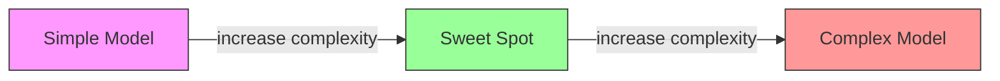
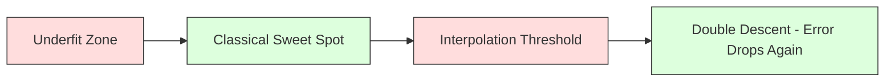
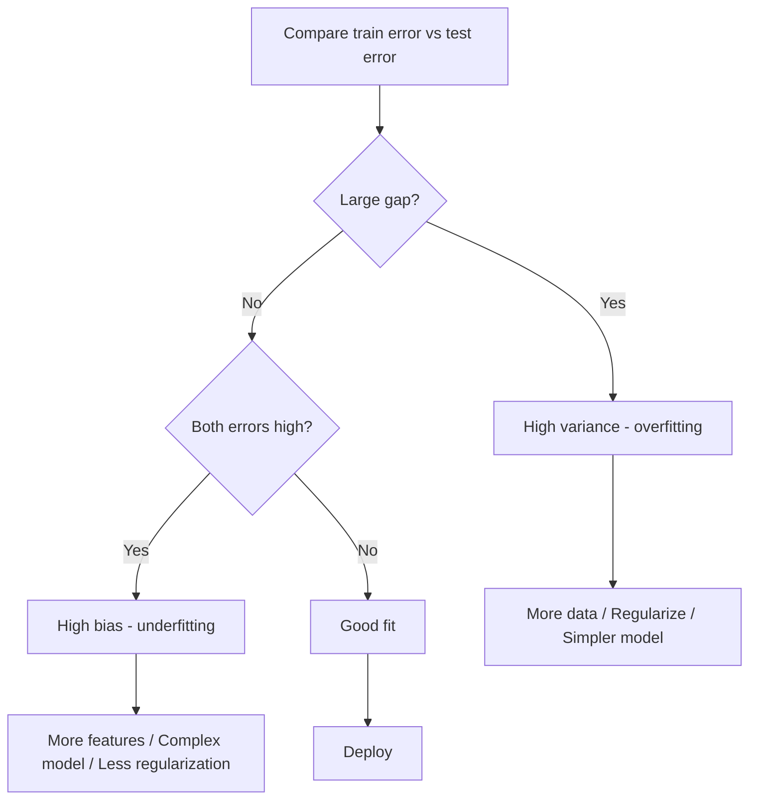
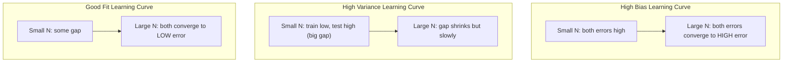
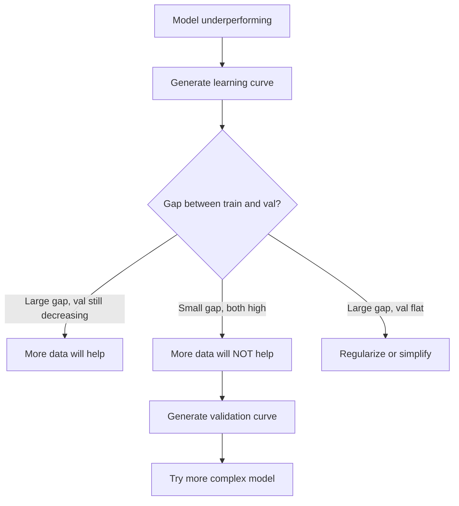

# 偏差—方差权衡

> 模型误差只来自三个来源：偏差、方差或噪声，而你只能控制前两者。

**Type:** 学习
**Language:** Python
**Prerequisites:** 阶段 2 第 01–09 课（机器学习基础、回归、分类、评估）
**Time:** 约 75 分钟

## 学习目标

- 推导期望预测误差的 bias-variance 分解，并解释不可约噪声的作用
- 根据训练误差与测试误差模式，诊断模型存在高偏差还是高方差
- 解释 L1、L2、dropout、early stopping 等正则化如何用偏差换取方差降低
- 实现实验，可视化模型复杂度增加时的 bias-variance 取舍

## 问题

你训练了一个模型，它在测试数据上有一定误差。误差来自哪里？

如果模型过于简单，例如用线性回归拟合曲线数据，它会系统性错过真实模式，这就是偏差。如果模型过于复杂，例如用 20 次多项式拟合 15 个数据点，它会完美拟合训练数据，却在新数据上给出大幅波动的预测，这就是方差。

对于固定模型容量，偏差与方差无法同时降到最低。压低偏差，方差会上升；压低方差，偏差会上升。理解这一取舍，是机器学习中最有用的诊断技能之一。它会告诉你应该增加还是降低模型复杂度、获取更多数据还是设计更好特征、加强还是减弱正则化。

## 核心概念

### Bias：系统性误差

Bias 衡量模型平均预测与真实值之间的偏离。想象从同一分布抽取许多不同训练集，分别训练同一个模型，再对预测取平均；这个平均值与真实值之间的差距就是 bias。

高 bias 表示模型过于僵硬，无法捕获真实模式。用直线拟合抛物线时，无论数据有多少，直线都会错过曲线，这就是欠拟合。

```
High bias (underfitting):
  Model always predicts roughly the same wrong thing.
  Training error: HIGH
  Test error: HIGH
  Gap between them: SMALL
```

### Variance：对训练数据的敏感性

Variance 衡量使用不同数据子集训练时，模型预测变化有多大。如果训练集发生很小变化，模型却产生很大变化，方差就很高。

高 variance 表示模型在拟合训练数据中的噪声，而非底层信号。20 次多项式会穿过每个训练点，却在点之间剧烈振荡，这就是过拟合。

```
High variance (overfitting):
  Model fits training data perfectly but fails on new data.
  Training error: LOW
  Test error: HIGH
  Gap between them: LARGE
```

### 误差分解

对于任意点 x，平方损失下的期望预测误差可以精确分解为：

```
Expected Error = Bias^2 + Variance + Irreducible Noise

where:
  Bias^2   = (E[f_hat(x)] - f(x))^2
  Variance = E[(f_hat(x) - E[f_hat(x)])^2]
  Noise    = E[(y - f(x))^2]             (sigma^2)
```

- `f(x)` 是真实函数
- `f_hat(x)` 是模型预测
- `E[...]` 是对不同训练集求期望
- `y` 是观测标签，也就是真实函数加噪声

噪声项不可约，任何模型都无法在含噪数据上优于 sigma^2。你的任务是在 bias^2 与 variance 之间找到正确平衡。

### 模型复杂度与误差



经典 U 形曲线如下：

| 复杂度 | Bias | Variance | 总误差 |
|-----------|------|----------|-------------|
| 过低 | 高 | 低 | 高（欠拟合） |
| 恰当 | 中等 | 中等 | 最低 |
| 过高 | 低 | 高 | 高（过拟合） |

### 用正则化控制 Bias-Variance

正则化会有意提高 bias，以换取 variance 降低。它限制模型，使其无法追逐噪声。

- **L2（Ridge）：**让所有权重趋近零，保留全部特征，但降低影响力。
- **L1（Lasso）：**把部分权重推到恰好为零，实现特征选择。
- **Dropout：**训练时随机停用神经元，迫使网络学习冗余表示。
- **Early stopping：**在模型完全拟合训练数据前停止训练。

正则化强度（lambda、dropout rate、epoch 数量）直接控制你在 bias-variance 曲线上的位置。正则化越强，bias 越高，variance 越低。

### Double Descent：现代视角

经典理论认为：越过最佳复杂度后，继续增加复杂度只会让结果变差。但 2019 年以来的研究发现了意外现象：如果模型容量继续增加，远远超过插值阈值——也就是参数足够多，可以完美拟合训练数据——测试误差可能再次下降。



这种 double descent 现象解释了为什么参数远多于训练样本的大型神经网络仍能很好泛化。经典 bias-variance 取舍并没有错，只是无法完整描述现代过参数化区域。

Double descent 的关键观察：
- 线性模型、决策树和神经网络中都会出现
- 在插值区域，增加数据甚至可能让表现变差，这称为 sample-wise double descent
- 增加训练 epoch 也可能产生这一现象，称为 epoch-wise double descent
- 正则化会平滑峰值，但不会完全消除它

为什么会这样？在插值阈值处，模型刚好有足够容量拟合所有训练点，被迫选择一条精确穿过每个点的特定解；数据中的微小扰动会造成拟合结果大幅变化，因此 variance 在这里达到峰值。超过阈值后，模型拥有许多能够完美拟合数据的解，学习算法（例如带隐式正则化的梯度下降）倾向于从中选择最简单的解。正是这种偏向简单解的隐式 bias，让过参数化模型能够泛化。

| 区域 | 参数数与样本数 | 行为 |
|--------|----------------------|----------|
| 欠参数化 | p << n | 适用经典取舍 |
| 插值阈值 | p ~ n | Variance 达到峰值，测试误差突增 |
| 过参数化 | p >> n | 隐式正则化开始发挥作用，测试误差再次下降 |

实践建议：使用神经网络或大型树 ensemble 时，不要停在插值阈值。要么保持远低于阈值并使用显式正则化，要么远远超过阈值；最差的位置恰好是阈值附近。

### 诊断模型



| 症状 | 诊断 | 修复 |
|---------|-----------|-----|
| 训练误差高、测试误差高 | Bias | 添加特征、使用复杂模型、减弱正则化 |
| 训练误差低、测试误差高 | Variance | 增加数据、正则化、简化模型、dropout |
| 训练误差低、测试误差低 | 拟合良好 | 发布 |
| 训练误差下降、测试误差上升 | 正在过拟合 | Early stopping |

### 实践策略

**Bias 是问题时：**
- 添加多项式或交互特征
- 使用更灵活的模型，例如用树 ensemble 替代线性模型
- 降低正则化强度
- 如果还未收敛，延长训练

**Variance 是问题时：**
- 获取更多训练数据
- 使用 bagging（随机森林）
- 加强正则化，例如提高 lambda 或 dropout
- 使用特征选择移除噪声特征
- 使用交叉验证尽早发现

### Ensemble 方法与方差降低

Ensemble 是对抗 variance 最实用的工具。

**Bagging（Bootstrap Aggregating）**会在训练数据的不同 bootstrap 样本上训练多个模型，再平均预测。每个模型方差都很高，但平均值的方差低得多。随机森林就是把 bagging 应用于决策树。

数学上，它之所以有效，是因为对 N 个相互独立、方差均为 sigma^2 的预测求平均后，平均值方差为 sigma^2 / N。实际模型并不完全独立，因为它们看到相似数据，因此降低幅度不足 1/N，但仍然十分显著。

**Boosting**会顺序构建模型，让每个新模型聚焦当前 ensemble 的错误，从而降低 bias。主要例子是 Gradient Boosting 与 AdaBoost。模型数量过多时，boosting 也会过拟合，因此需要 early stopping 或正则化。

| 方法 | 主要作用 | Bias 变化 | Variance 变化 |
|--------|---------------|-------------|-----------------|
| Bagging | 降低方差 | 不变 | 下降 |
| Boosting | 降低偏差 | 下降 | 可能上升 |
| Stacking | 同时降低二者 | 取决于 meta-learner | 取决于 base models |
| Dropout | 隐式 bagging | 略微上升 | 下降 |

**实践规则：**base model 方差高时，例如深树和高次多项式，使用 bagging；base model 偏差高时，例如浅层 stump 或简单线性模型，使用 boosting。

### 学习曲线

学习曲线会绘制训练误差和验证误差随训练集大小变化的趋势，是最实用的诊断工具。与单次训练/测试比较不同，它会展示模型的轨迹，并告诉你更多数据是否有帮助。



读取方式：

| 场景 | 训练误差 | 验证误差 | 差距 | 含义 | 应对方式 |
|----------|---------------|-----------------|-----|---------------|------------|
| 高 bias | 高 | 高 | 小 | 模型无法捕获模式 | 更多特征、更复杂模型、更弱正则化 |
| 高 variance | 低 | 高 | 大 | 模型记住训练数据 | 更多数据、正则化、更简单模型 |
| 拟合良好 | 中等 | 中等 | 小 | 模型泛化良好 | 发布 |
| 高 variance，正在改善 | 低 | 随数据增加而下降 | 正在缩小 | 数据可以修复的方差问题 | 收集更多数据 |
| 高 bias，曲线平坦 | 高 | 高且平坦 | 小且平坦 | 更多数据不会有帮助 | 修改模型架构 |

核心洞见是：如果两条曲线都进入平台期、差距很小，却都保持高误差，那么更多数据没有用，需要更好的模型；如果差距仍然很大并持续缩小，更多数据会有帮助。

### 如何生成学习曲线

有两种方式：

**方式 1：固定模型，改变训练集大小。**保持模型与超参数不变，在越来越大的训练子集上训练，分别测量训练误差和验证误差。这是标准学习曲线。

**方式 2：固定数据，改变模型复杂度。**保持数据不变，扫描多项式次数、树深度、层数等复杂度参数，在每个复杂度上测量训练误差与验证误差。这称为验证曲线，可以直接展示 bias-variance 取舍。

二者互为补充：第一种告诉你更多数据是否有帮助，第二种告诉你换模型是否有帮助。决定下一步前，应同时运行二者。



```figure
bias-variance
```

## 动手构建

`code/bias_variance.py` 中的代码会运行完整 bias-variance 分解实验。下面按步骤说明。

### 第 1 步：根据已知函数生成合成数据

使用 `f(x) = sin(1.5x) + 0.5x`，并加入 Gaussian 噪声。因为知道真实函数，可以精确计算 bias 和 variance。

```python
def true_function(x):
    return np.sin(1.5 * x) + 0.5 * x

def generate_data(n_samples=30, noise_std=0.5, x_range=(-3, 3), seed=None):
    rng = np.random.RandomState(seed)
    x = rng.uniform(x_range[0], x_range[1], n_samples)
    y = true_function(x) + rng.normal(0, noise_std, n_samples)
    return x, y
```

### 第 2 步：Bootstrap 采样与多项式拟合

对于每个多项式次数，抽取许多 bootstrap 训练集，拟合多项式，并在固定测试网格上记录预测，从而得到每个测试点上的预测分布。

```python
def fit_polynomial(x_train, y_train, degree, lam=0.0):
    X = np.column_stack([x_train ** d for d in range(degree + 1)])
    if lam > 0:
        penalty = lam * np.eye(X.shape[1])
        penalty[0, 0] = 0
        w = np.linalg.solve(X.T @ X + penalty, X.T @ y_train)
    else:
        w = np.linalg.lstsq(X, y_train, rcond=None)[0]
    return w
```

我们会在 200 个不同 bootstrap 样本上拟合。每个样本来自同一个底层分布，却包含不同的数据点。

### 第 3 步：计算 Bias^2 与 Variance 分解

获得每个测试点的 200 组预测后，可以直接按定义计算分解：

```python
mean_pred = predictions.mean(axis=0)
bias_sq = np.mean((mean_pred - y_true) ** 2)
variance = np.mean(predictions.var(axis=0))
total_error = np.mean(np.mean((predictions - y_true) ** 2, axis=1))
```

- `mean_pred` 是由 bootstrap 样本估计的 E[f_hat(x)]
- `bias_sq` 是平均预测与真实函数之差的平方
- `variance` 是不同 bootstrap 样本预测分散程度的平均值
- `total_error` 应近似等于 bias^2 + variance + noise

### 第 4 步：学习曲线

学习曲线会在固定模型复杂度下扫描训练集大小，展示模型受数据限制还是容量限制。

```python
def demo_learning_curves():
    sizes = [10, 15, 20, 30, 50, 75, 100, 150, 200, 300]
    degree = 5

    for n in sizes:
        train_errors = []
        test_errors = []
        for seed in range(50):
            x_train, y_train = generate_data(n_samples=n, seed=seed * 100)
            w = fit_polynomial(x_train, y_train, degree)
            train_pred = predict_polynomial(x_train, w)
            train_mse = np.mean((train_pred - y_train) ** 2)
            test_pred = predict_polynomial(x_test, w)
            test_mse = np.mean((test_pred - y_test) ** 2)
            train_errors.append(train_mse)
            test_errors.append(test_mse)
        # Average over runs gives the learning curve point
```

对于高 variance 模型，例如小数据上的 5 次多项式，会看到：
- 训练误差起初很低，随着数据增加、记忆变难而上升
- 测试误差起初很高，随着模型获得更多信号而下降
- 更多数据会缩小二者差距

对于高 bias 模型，例如 1 次多项式，两种误差会迅速收敛到相同的较高数值，更多数据没有帮助。

### 第 5 步：正则化扫描

代码还包含 `demo_regularization_sweep()`：固定一个高次多项式（degree 15），让 Ridge 正则化强度从 0.001 扫描到 100。它从另一个角度展示 bias-variance 取舍：改变的不是模型复杂度，而是约束强度。

```python
def demo_regularization_sweep():
    alphas = [0.001, 0.005, 0.01, 0.05, 0.1, 0.5, 1.0, 5.0, 10.0, 50.0, 100.0]
    for alpha in alphas:
        results = bias_variance_decomposition([15], lam=alpha)
        r = results[15]
        print(f"alpha={alpha:.3f}  bias={r['bias_sq']:.4f}  var={r['variance']:.4f}")
```

alpha 很小时，15 次多项式几乎没有约束，会在每个 bootstrap 样本中追逐噪声，因此 variance 主导；alpha 很大时，惩罚强到让模型几乎变成常数函数，此时 bias 主导。最佳 alpha 位于两个极端之间。

这与改变多项式次数得到的是同一条 U 形曲线，只是使用连续旋钮控制，而非离散调整复杂度。实践中，正则化是更常用的控制方法，因为无需修改特征集，就能精细调整取舍。

## 实际使用

sklearn 提供 `learning_curve` 和 `validation_curve`，无需手写 bootstrap 循环就能自动完成诊断。

### 验证曲线：扫描模型复杂度

```python
from sklearn.model_selection import validation_curve
from sklearn.pipeline import make_pipeline
from sklearn.preprocessing import PolynomialFeatures
from sklearn.linear_model import Ridge

degrees = list(range(1, 16))
train_scores_all = []
val_scores_all = []

for d in degrees:
    pipe = make_pipeline(PolynomialFeatures(d), Ridge(alpha=0.01))
    train_scores, val_scores = validation_curve(
        pipe, X, y, param_name="polynomialfeatures__degree",
        param_range=[d], cv=5, scoring="neg_mean_squared_error"
    )
    train_scores_all.append(-train_scores.mean())
    val_scores_all.append(-val_scores.mean())
```

这会直接给出 bias-variance 取舍曲线。验证分数相对训练分数最差的位置由 variance 主导；两者都差的位置则由 bias 主导。

### 学习曲线：扫描训练集大小

```python
from sklearn.model_selection import learning_curve

pipe = make_pipeline(PolynomialFeatures(5), Ridge(alpha=0.01))
train_sizes, train_scores, val_scores = learning_curve(
    pipe, X, y, train_sizes=np.linspace(0.1, 1.0, 10),
    cv=5, scoring="neg_mean_squared_error"
)
train_mse = -train_scores.mean(axis=1)
val_mse = -val_scores.mean(axis=1)
```

把 `train_mse` 与 `val_mse` 相对于 `train_sizes` 作图，曲线形状会揭示模型的全部问题。

### 使用交叉验证扫描正则化

```python
from sklearn.model_selection import cross_val_score

alphas = [0.001, 0.01, 0.1, 1.0, 10.0, 100.0]
for alpha in alphas:
    pipe = make_pipeline(PolynomialFeatures(10), Ridge(alpha=alpha))
    scores = cross_val_score(pipe, X, y, cv=5, scoring="neg_mean_squared_error")
    print(f"alpha={alpha:>7.3f}  MSE={-scores.mean():.4f} +/- {scores.std():.4f}")
```

这会在固定模型复杂度下扫描正则化强度。你会再次看到相同取舍：alpha 小意味着高 variance，alpha 大意味着高 bias。

### 汇总：完整诊断工作流

实践中按以下顺序运行诊断：

1. 训练模型，计算训练误差和测试误差。
2. 如果二者都高，说明是 bias 问题，跳到第 4 步。
3. 如果训练误差低、测试误差高，说明是 variance 问题。生成学习曲线，判断更多数据是否有帮助；没有帮助就加强正则化。
4. 生成验证曲线，扫描主要复杂度参数，找到最佳位置。
5. 在最佳位置生成学习曲线。如果差距仍很大，需要更多数据或正则化。
6. 使用 `cross_val_score` 尝试不同 alpha 的 Ridge/Lasso，选择交叉验证误差最低的 alpha。

对于多数表格数据，这些诊断只需 10–15 分钟计算时间，却能节省数小时盲目猜测。

## 交付成果

本课会产出：`outputs/prompt-model-diagnostics.md`

## 练习

1. 在 `noise_std=0`（无噪声）时运行分解。不可约误差会发生什么？最佳复杂度是否改变？

2. 把训练集大小从 30 增加到 300。Variance 分量如何变化？最佳多项式次数是否移动？

3. 向实验中加入 L2 正则化（Ridge 回归）。固定一个高次多项式（degree 15），让 lambda 从 0 扫描到 100，绘制 bias^2 和 variance 随 lambda 变化的曲线。

4. 把真实函数从多项式改为 `sin(x)`。Bias-variance 分解会怎样变化？是否仍存在明确的最佳次数？

5. 实现简单 bootstrap aggregating（bagging）包装器：在 bootstrap 样本上训练 10 个模型，并平均预测。展示它如何在几乎不增加 bias 的情况下降低 variance。

## 关键术语

| 术语 | 人们常说 | 准确含义 |
|------|----------------|----------------------|
| Bias | “模型太简单” | 来自错误假设的系统性误差，也就是模型平均预测与真实值之间的差距 |
| Variance | “模型过拟合” | 来自对训练数据敏感性的误差，表示不同训练集上的预测变化有多大 |
| Irreducible error | “数据中的噪声” | 真实数据生成过程的随机性造成的误差，任何模型都无法消除 |
| Underfitting | “没有学够” | 模型具有高 bias，即使在训练数据上也无法捕获真实模式 |
| Overfitting | “记住数据” | 模型具有高 variance，拟合了训练噪声，却无法泛化 |
| Regularization | “约束模型” | 添加惩罚以降低模型复杂度，用更高 bias 换取更低 variance |
| Double descent | “更多参数也可能有帮助” | 模型容量远超插值阈值后，测试误差会再次下降的现象 |
| Model complexity | “模型有多灵活” | 模型拟合任意模式的能力，由架构、特征或正则化控制 |

## 延伸阅读

- [Hastie、Tibshirani、Friedman：《Elements of Statistical Learning》第 7 章](https://hastie.su.domains/ElemStatLearn/)——bias-variance 分解的权威讲解
- [Belkin 等：协调现代机器学习实践与 bias-variance 取舍（2019）](https://arxiv.org/abs/1812.11118)——double descent 论文
- [Nakkiran 等：Deep Double Descent（2019）](https://arxiv.org/abs/1912.02292)——epoch-wise 与 sample-wise double descent
- [Scott Fortmann-Roe：理解 Bias-Variance 取舍](http://scott.fortmann-roe.com/docs/BiasVariance.html)——清晰的可视化解释
