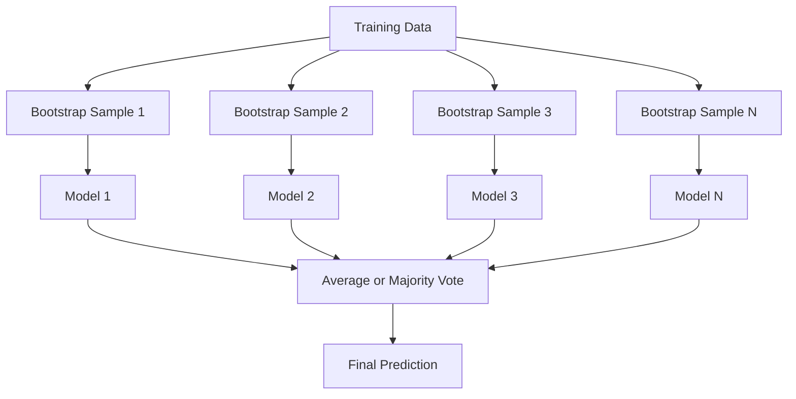
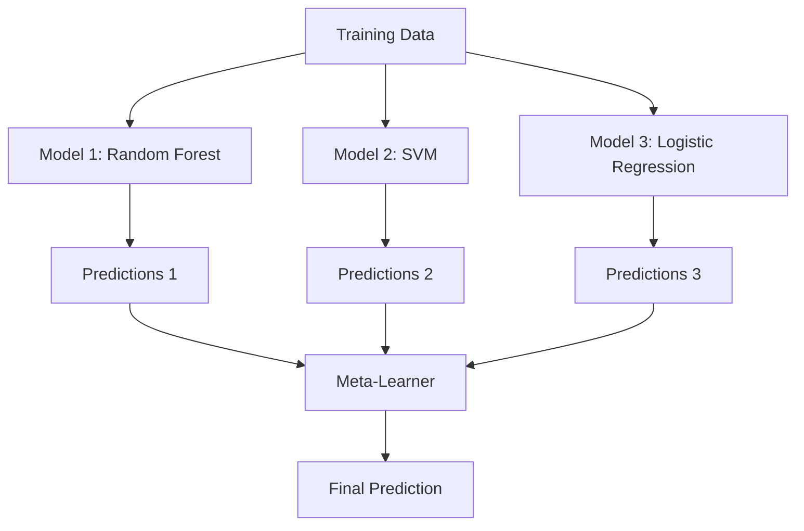

# 集成方法

> 一组弱学习器只要组合得当，就能成为强学习器。这并非比喻，而是一个定理。

**Type:** 构建
**Language:** Python
**Prerequisites:** 阶段 2，第 10 课（偏差—方差权衡）
**Time:** 约 120 分钟

## 学习目标

- 从零实现 AdaBoost 和梯度提升，并解释提升法如何按顺序降低偏差
- 构建 Bagging 集成，并演示对去相关模型取平均为何能在不增加偏差的情况下降低方差
- 比较 Bagging、Boosting 与 Stacking，理解每种方法分别针对哪一种误差成分
- 评估集成的多样性，并解释为何加入更多相互独立的弱学习器能提高多数投票的准确率

## 问题

单棵决策树训练速度快、容易解释，但也容易过拟合。单个线性模型面对复杂决策边界时又会欠拟合。你可以花上好几天精心设计一个完美的模型架构，也可以把一批并不完美的模型组合起来，得到一个优于其中任何单个模型的结果。

集成方法做的正是后者。它们是 Kaggle 表格数据竞赛中最可靠的制胜技术，也支撑着大量生产环境中的机器学习系统，并且生动展示了偏差—方差权衡如何落到实践中：Bagging 降低方差，Boosting 降低偏差，Stacking 则学习在不同输入上应该信任哪些模型。

## 核心概念

### 集成为何有效

假设有 N 个相互独立的分类器，每个分类器的准确率都满足 p > 0.5。多数投票的准确率为：

```
P(majority correct) = sum over k > N/2 of C(N,k) * p^k * (1-p)^(N-k)
```

若有 21 个准确率均为 60% 的分类器，多数投票的准确率约为 74%；若增加到 101 个分类器，则会上升到 84%。只要各模型犯的是不同错误，这些错误就会彼此抵消。

其中的关键条件是**多样性**。如果所有模型都会犯相同的错误，把它们组合起来也不会有任何帮助。集成方法通过以下方式产生多样化模型：

- 使用不同的训练子集（Bagging）
- 使用不同的特征子集（随机森林）
- 按顺序纠正错误（Boosting）
- 使用不同的模型家族（Stacking）

### Bagging（Bootstrap Aggregating，自助聚合）

Bagging 从训练数据中抽取不同的 Bootstrap 样本，并分别训练模型，以此创造多样性。



Bootstrap 样本是从原始数据中进行有放回抽样得到的，其大小与原始数据集相同。每个 Bootstrap 样本平均会包含约 63.2% 的不同原始样本；余下的 36.8% 称为袋外样本（out-of-bag samples），可以直接充当一份免费的验证集。

Bagging 能显著降低方差，而不会明显增加偏差。每棵树都会对自己的 Bootstrap 样本产生过拟合，但不同树过拟合的噪声并不相同，因此对预测取平均时，这些噪声会相互抵消。

**随机森林**是在 Bagging 基础上再增加一层随机性：每次分裂时只考察随机抽取的一部分特征，迫使各棵树之间形成更强的多样性。分类任务中，候选特征数通常取 `sqrt(n_features)`；回归任务中通常取 `n_features / 3`。

### Boosting（顺序纠错）

Boosting 按顺序训练模型。每一个新模型都会重点处理此前模型预测错误的样本。


Boosting 主要降低偏差。每个新模型都会修正当前集成仍然存在的系统性错误。最终预测是所有模型输出的加权和，其中表现越好的模型拥有越高的权重。

代价在于：如果迭代轮数过多，Boosting 可能过拟合。因为它会持续拟合越来越难的样本，而其中一部分所谓的“难样本”可能只是噪声。

### AdaBoost

AdaBoost（Adaptive Boosting，自适应提升）是第一个得到广泛应用的实用提升算法。它可以搭配任意基学习器，最常见的是决策树桩，也就是深度为 1 的决策树。

算法如下：

```
1. Initialize sample weights: w_i = 1/N for all i

2. For t = 1 to T:
   a. Train weak learner h_t on weighted data
   b. Compute weighted error:
      err_t = sum(w_i * I(h_t(x_i) != y_i)) / sum(w_i)
   c. Compute model weight:
      alpha_t = 0.5 * ln((1 - err_t) / err_t)
   d. Update sample weights:
      w_i = w_i * exp(-alpha_t * y_i * h_t(x_i))
   e. Normalize weights to sum to 1

3. Final prediction: H(x) = sign(sum(alpha_t * h_t(x)))
```

误差越低的模型会得到越高的 alpha。被错误分类的样本权重会增大，使下一个模型把更多注意力放在这些样本上。

### 梯度提升

梯度提升把 Boosting 推广到了任意损失函数。它不再调整样本权重，而是让每个新模型拟合当前集成在各样本上的残差，也就是损失函数的负梯度。

```
1. Initialize: F_0(x) = argmin_c sum(L(y_i, c))

2. For t = 1 to T:
   a. Compute pseudo-residuals:
      r_i = -dL(y_i, F_{t-1}(x_i)) / dF_{t-1}(x_i)
   b. Fit a tree h_t to the residuals r_i
   c. Find optimal step size:
      gamma_t = argmin_gamma sum(L(y_i, F_{t-1}(x_i) + gamma * h_t(x_i)))
   d. Update:
      F_t(x) = F_{t-1}(x) + learning_rate * gamma_t * h_t(x)

3. Final prediction: F_T(x)
```

对于平方误差损失，伪残差就是通常所说的实际残差：`r_i = y_i - F_{t-1}(x_i)`。也就是说，每棵新树都在直接拟合此前集成留下的误差。

学习率（也称收缩率）控制每棵树对集成结果的贡献程度。较小的学习率需要更多树，但通常具有更好的泛化能力。常用取值范围是 0.01 到 0.3。

### XGBoost：为何它主导表格数据任务

XGBoost（eXtreme Gradient Boosting，极端梯度提升）是在梯度提升基础上加入一系列工程优化，使其更快、更准确，也更不易过拟合：

- **正则化目标：** 对叶节点权重施加 L1 和 L2 惩罚，避免单棵树给出过度自信的预测
- **二阶近似：** 同时使用损失函数的一阶导数与二阶导数，从而作出更好的分裂决策
- **稀疏感知分裂：** 原生处理缺失值，在每次分裂时学习缺失数据应该进入的最佳方向
- **列子采样：** 与随机森林类似，每次分裂时对特征采样，以增加多样性
- **加权分位数草图：** 在分布式数据上高效寻找连续特征的分裂点
- **缓存感知块结构：** 针对 CPU 缓存行优化内存布局

在表格数据上，XGBoost（以及后继者 LightGBM）的表现通常优于神经网络，而且短期内不会改变。如果你的数据能够自然地表示为行列组成的表格，应当优先从梯度提升开始尝试。

### Stacking（元学习）

Stacking 把多个基模型的预测结果作为特征，再交给一个元学习器训练。



元学习器会学习在什么输入上应该信任哪个基模型。如果随机森林在某些区域表现更好，而 SVM 在另一些区域更好，元学习器就会学会据此分配信任。

为避免数据泄漏，训练集上的基模型预测必须通过交叉验证生成。绝不能先用一批数据训练基模型，再用同一批数据生成供元学习器使用的元特征。

### Voting（投票）

这是最简单的集成方法：直接组合各模型的预测。

- **硬投票：** 对类别标签进行多数投票。
- **软投票：** 对预测概率取平均，再选择平均概率最高的类别。它通常效果更好，因为利用了模型的置信度信息。

```figure
f3-ensemble-average
```

## 动手构建

### 第 1 步：决策树桩（基学习器）

`code/ensembles.py` 中的代码从零实现了全部组件。我们从决策树桩开始：它是一棵只有一次分裂的树。

```python
class DecisionStump:
    def __init__(self):
        self.feature_idx = None
        self.threshold = None
        self.polarity = 1
        self.alpha = None

    def fit(self, X, y, weights):
        n_samples, n_features = X.shape
        best_error = float("inf")

        for f in range(n_features):
            thresholds = np.unique(X[:, f])
            for thresh in thresholds:
                for polarity in [1, -1]:
                    pred = np.ones(n_samples)
                    pred[polarity * X[:, f] < polarity * thresh] = -1
                    error = np.sum(weights[pred != y])
                    if error < best_error:
                        best_error = error
                        self.feature_idx = f
                        self.threshold = thresh
                        self.polarity = polarity

    def predict(self, X):
        n = X.shape[0]
        pred = np.ones(n)
        idx = self.polarity * X[:, self.feature_idx] < self.polarity * self.threshold
        pred[idx] = -1
        return pred
```

### 第 2 步：从零实现 AdaBoost

```python
class AdaBoostScratch:
    def __init__(self, n_estimators=50):
        self.n_estimators = n_estimators
        self.stumps = []
        self.alphas = []

    def fit(self, X, y):
        n = X.shape[0]
        weights = np.full(n, 1 / n)

        for _ in range(self.n_estimators):
            stump = DecisionStump()
            stump.fit(X, y, weights)
            pred = stump.predict(X)

            err = np.sum(weights[pred != y])
            err = np.clip(err, 1e-10, 1 - 1e-10)

            alpha = 0.5 * np.log((1 - err) / err)
            weights *= np.exp(-alpha * y * pred)
            weights /= weights.sum()

            stump.alpha = alpha
            self.stumps.append(stump)
            self.alphas.append(alpha)

    def predict(self, X):
        total = sum(a * s.predict(X) for a, s in zip(self.alphas, self.stumps))
        return np.sign(total)
```

### 第 3 步：从零实现梯度提升

```python
class GradientBoostingScratch:
    def __init__(self, n_estimators=100, learning_rate=0.1, max_depth=3):
        self.n_estimators = n_estimators
        self.lr = learning_rate
        self.max_depth = max_depth
        self.trees = []
        self.initial_pred = None

    def fit(self, X, y):
        self.initial_pred = np.mean(y)
        current_pred = np.full(len(y), self.initial_pred)

        for _ in range(self.n_estimators):
            residuals = y - current_pred
            tree = SimpleRegressionTree(max_depth=self.max_depth)
            tree.fit(X, residuals)
            update = tree.predict(X)
            current_pred += self.lr * update
            self.trees.append(tree)

    def predict(self, X):
        pred = np.full(X.shape[0], self.initial_pred)
        for tree in self.trees:
            pred += self.lr * tree.predict(X)
        return pred
```

### 第 4 步：与 sklearn 对比

代码会验证从零实现的版本能否取得与 sklearn 的 `AdaBoostClassifier` 和 `GradientBoostingClassifier` 相近的准确率，并把所有方法放在一起进行对比。

## 实际应用

### 各种方法分别适用于何时

| 方法 | 降低的误差 | 最适合 | 需要注意 |
|--------|---------|----------|---------------|
| Bagging / 随机森林 | 方差 | 噪声较多、特征较多的数据 | 无法改善偏差问题 |
| AdaBoost | 偏差 | 干净数据、简单基学习器 | 对离群点和噪声敏感 |
| 梯度提升 | 偏差 | 表格数据、竞赛任务 | 训练较慢，若不调参很容易过拟合 |
| XGBoost / LightGBM | 两者 | 生产环境的表格机器学习 | 超参数很多 |
| Stacking | 两者 | 争取最后 1%–2% 的准确率 | 结构复杂，元学习器存在过拟合风险 |
| Voting | 方差 | 快速组合多个多样化模型 | 只有模型足够多样时才有帮助 |

### 表格数据的生产级技术栈

对于大多数表格预测问题，建议按以下顺序尝试：

1. 使用默认参数的 **LightGBM 或 XGBoost**
2. 调整 n_estimators、learning_rate、max_depth、min_child_weight
3. 如果还要争取最后 0.5% 的性能，使用 3–5 个多样化模型构建 Stacking 集成
4. 全程使用交叉验证

尽管研究人员仍在不断尝试，但神经网络在表格数据上的表现几乎总是不如梯度提升。TabNet、NODE 等架构偶尔可以追平，却很少能击败经过良好调优的 XGBoost。

## 交付成果

本课会产出 `outputs/prompt-ensemble-selector.md`：一个帮助你针对给定数据集选择合适集成方法的提示词。你只需描述数据情况（规模、特征类型、噪声水平、类别均衡程度）以及要解决的问题，它就会带你完成一套决策检查清单，推荐合适的方法和起始超参数，并提示该方法常见的错误。课程还会产出 `outputs/skill-ensemble-builder.md`，其中包含完整的选择指南。

## 练习

1. 修改 AdaBoost 实现，在每轮迭代后记录训练准确率。绘制准确率随估计器数量变化的曲线。它在什么时候收敛？

2. 为回归树加入随机特征子采样，从零实现随机森林。用 `max_features=sqrt(n_features)` 训练 100 棵树，并对预测取平均。将它的方差降幅与单棵树进行比较。

3. 为梯度提升实现加入提前停止：每轮结束后记录验证损失，如果连续 10 轮没有改善就停止。实际需要多少棵树？

4. 使用三个基模型（逻辑回归、决策树、k 近邻）和一个逻辑回归元学习器构建 Stacking 集成。用 5 折交叉验证生成元特征，并将结果与每个单独的基模型比较。

5. 使用默认参数在同一数据集上运行 XGBoost，将其准确率与从零实现的梯度提升进行比较。分别计时，两者的速度差距有多大？

## 关键术语

| 术语 | 人们常说 | 实际含义 |
|------|----------------|----------------------|
| Bagging | “在随机子集上训练” | Bootstrap aggregating：在 Bootstrap 样本上训练多个模型，再对预测取平均以降低方差 |
| Boosting | “关注困难样本” | 按顺序训练模型，每个模型都修正当前集成的错误，从而降低偏差 |
| AdaBoost | “重新加权数据” | 通过更新样本权重实现 Boosting；分类错误的样本会在下一个学习器中得到更高权重 |
| 梯度提升 | “拟合残差” | 让每个新模型拟合损失函数的负梯度，以此实现 Boosting |
| XGBoost | “Kaggle 神器” | 结合正则化、二阶优化和系统级加速技巧的梯度提升 |
| Stacking | “模型上面再叠模型” | 将基模型的预测作为元学习器的输入特征 |
| 随机森林 | “很多棵随机化的树” | 使用决策树的 Bagging，并在每次分裂时加入随机特征子采样以增加多样性 |
| 集成多样性 | “犯不同的错误” | 只有各模型的错误互不相关，集成才可能优于单个模型 |
| 袋外误差 | “免费的验证” | 未被某次 Bootstrap 抽样选中的样本（约 36.8%）可充当验证集，无需另留保留集 |

## 延伸阅读

- [Schapire 与 Freund：《Boosting: Foundations and Algorithms》](https://mitpress.mit.edu/9780262526036/)——AdaBoost 创始人撰写的著作
- [Friedman：《Greedy Function Approximation: A Gradient Boosting Machine》（2001）](https://statweb.stanford.edu/~jhf/ftp/trebst.pdf)——梯度提升的原始论文
- [Chen 与 Guestrin：《XGBoost》（2016）](https://arxiv.org/abs/1603.02754)——XGBoost 论文
- [Wolpert：《Stacked Generalization》（1992）](https://www.sciencedirect.com/science/article/abs/pii/S0893608005800231)——Stacking 的原始论文
- [scikit-learn 集成方法](https://scikit-learn.org/stable/modules/ensemble.html)——实用参考资料
