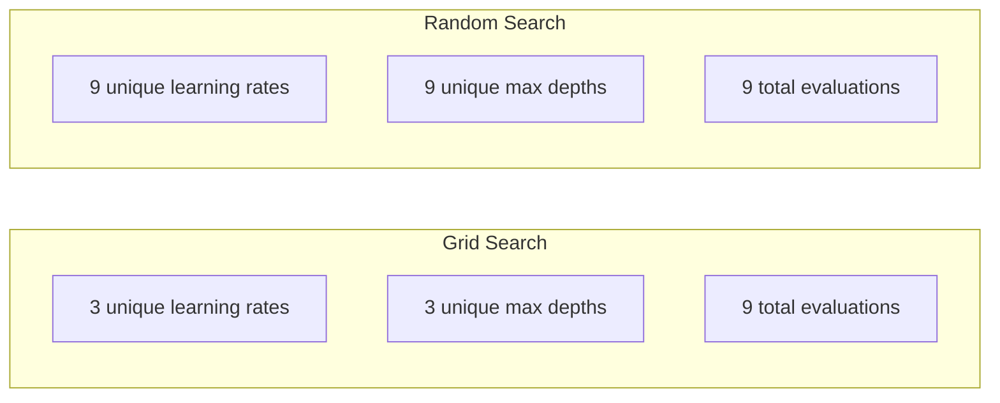
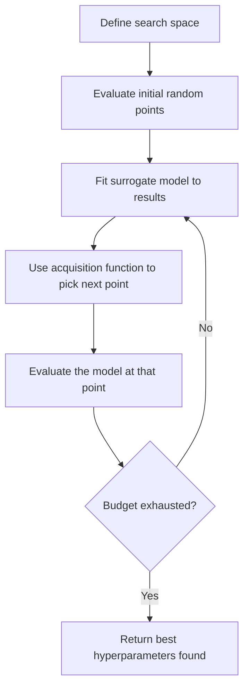
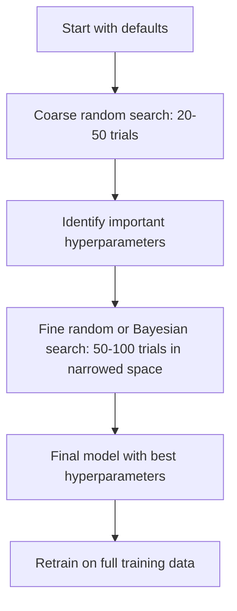
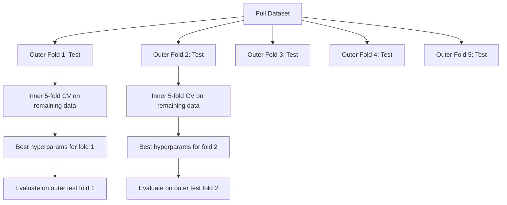

# 超参数调优

> 超参数是在训练开始前由你调节的旋钮。能否把它们调好，决定了最终得到的是一个平庸模型，还是一个优秀模型。

**Type:** 构建
**Language:** Python
**Prerequisites:** 阶段 2，第 11 课（集成方法）
**Time:** 约 90 分钟

## 学习目标

- 从零实现网格搜索、随机搜索和贝叶斯优化，并比较它们的样本效率
- 解释当多数超参数的有效维度很低时，随机搜索为何优于网格搜索
- 使用代理模型和采集函数构建贝叶斯优化循环，引导搜索方向
- 设计合理使用交叉验证的超参数调优策略，避免对验证集过拟合

## 问题

你的梯度提升模型包含学习率、树的数量、最大深度、每个叶节点的最少样本数、样本子采样比例以及列采样比例，一共有六个超参数。如果每个超参数都有 5 个合理取值，网格中就会有 5^6 = 15,625 种组合。每次训练耗时 10 秒，尝试全部组合需要 43 小时的计算时间。

网格搜索是最容易想到的做法，却也是规模扩大后表现最糟糕的做法。随机搜索能用更少的计算量取得更好的结果；贝叶斯优化还会从过去的评估结果中学习，因此效率更高。知道应该选择哪种策略、哪些超参数真正重要，可以避免浪费数天的 GPU 时间。

## 核心概念

### 参数与超参数

参数是在训练过程中学习得到的，例如权重、偏置和分裂阈值。超参数则在训练开始前设定，用来控制学习过程如何进行。

| 超参数 | 控制内容 | 典型范围 |
|---------------|-----------------|---------------|
| 学习率 | 每次更新的步长 | 0.001 到 1.0 |
| 树的数量/训练轮数 | 训练持续多久 | 10 到 10,000 |
| 最大深度 | 模型复杂度 | 1 到 30 |
| 正则化（lambda） | 防止过拟合 | 0.0001 到 100 |
| 批大小 | 梯度估计中的噪声 | 16 到 512 |
| Dropout 比例 | 被丢弃的神经元占比 | 0.0 到 0.5 |

### 网格搜索

网格搜索会评估指定取值的每一种组合。它穷尽所有组合，容易理解，但计算量会随着超参数数量呈指数增长。

```
Grid for 2 hyperparameters:

  learning_rate: [0.01, 0.1, 1.0]
  max_depth:     [3, 5, 7]

  Evaluations: 3 x 3 = 9 combinations

  (0.01, 3)  (0.01, 5)  (0.01, 7)
  (0.1,  3)  (0.1,  5)  (0.1,  7)
  (1.0,  3)  (1.0,  5)  (1.0,  7)
```

网格搜索存在一个根本缺陷：如果只有一个超参数真正重要，而另一个几乎没有影响，大多数评估都会被浪费。进行了 9 次评估，重要参数却只探索了 3 个不同取值。

### 随机搜索

随机搜索不使用固定网格，而是从概率分布中抽取超参数。在同样只有 9 次评估的预算下，每个超参数都可以探索到 9 个不同取值。



随机搜索优于网格搜索的原因（Bergstra 与 Bengio，2012）：

- 大多数问题的超参数有效维度很低。对于 6 个超参数，通常只有 1–2 个会对给定问题产生重要影响。
- 网格搜索把大量评估浪费在不重要的维度上。
- 在相同预算下，随机搜索能以更高密度覆盖重要维度。
- 随机尝试 60 次时，如果搜索空间中确实存在最优点，就有 95% 的概率找到一个距最优值不超过 5% 的点。

### 贝叶斯优化

随机搜索会忽略已经得到的结果。即使此前的评估已经表明高学习率会导致发散，或者深度 3 始终优于深度 10，它也不会利用这些信息。贝叶斯优化则会根据过去的评估结果，决定下一步应该搜索哪里。



它包含两个关键组件：

**代理模型：** 一种评估成本很低的模型，通常是高斯过程，用来近似计算昂贵的目标函数。对于搜索空间中的任意一点，它既能给出预测，也能给出不确定性估计。

**采集函数：** 通过平衡利用与探索来决定下一次在哪里评估。利用是指在已知表现良好的点附近搜索；探索则是前往不确定性较高的区域。常见选择包括：

- **期望改进（EI）：** 在这个点上，相比当前最佳结果，预期能够改善多少？
- **置信上界（UCB）：** 预测值加上若干倍的不确定性。UCB 越高，表示该点要么很有希望，要么尚未得到充分探索。
- **改进概率（PI）：** 这个点超过当前最佳结果的概率是多少？

与随机搜索相比，贝叶斯优化通常只需 1/2 到 1/5 的评估次数，就能找到更好的超参数。与训练实际模型的成本相比，拟合代理模型产生的开销几乎可以忽略。

### 提前停止

并非每次训练都必须运行到结束。如果某组配置在 10 个 epoch 后已经明显表现不佳，就应停止它并尝试下一组。这就是超参数搜索场景下的提前停止。

常见策略：
- **基于耐心值：** 如果验证损失连续 N 个 epoch 没有改善，就停止训练
- **中位数剪枝：** 如果某次试验的中间结果比其他已完成试验在相同步骤上的中位数更差，就停止该试验
- **Hyperband：** 先给许多配置分配很少的预算，再逐步增加表现最好配置的预算

Hyperband 尤其有效。它可以先让 81 组配置各训练 1 个 epoch，只保留其中表现最好的三分之一；再给保留下来的配置各训练 3 个 epoch，继续保留表现最好的三分之一，如此反复。与让所有配置跑满预算相比，这种方法找到良好配置的速度可以提高 10–50 倍。

### 学习率调度器

学习率几乎总是最重要的超参数。调度器不会让它在训练期间保持不变，而是会动态调整学习率。

| 调度器 | 公式 | 适用场景 |
|-----------|---------|-------------|
| 阶梯衰减 | 每 N 个 epoch 乘以 0.1 | 经典 CNN 训练 |
| 余弦退火 | lr * 0.5 * (1 + cos(pi * t / T)) | 现代模型的默认选择 |
| 预热 + 衰减 | 先线性增大，再按余弦衰减 | Transformer |
| 单周期 | 在一个周期内先增大再减小 | 快速收敛 |
| 平台期衰减 | 指标停滞时按一定因子缩小 | 稳妥的默认选择 |

### 超参数重要性

并非所有超参数都同等重要。针对随机森林（Probst 等，2019）和梯度提升的研究呈现出一致规律：

**高重要性：**
- 学习率（始终优先调节）
- 估计器数量/训练轮数（使用提前停止，而不是把它当作待调参数）
- 正则化强度

**中等重要性：**
- 最大深度/网络层数
- 每个叶节点的最少样本数/权重衰减
- 子采样比例

**低重要性：**
- 最大特征数（对于随机森林）
- 具体激活函数的选择
- 批大小（处于合理范围内时）

应当先调节重要参数，其余参数先保留默认值。

### 实用策略



具体工作流程如下：

1. **从库的默认值开始。** 这些默认值由经验丰富的实践者选定，通常已经能达到理想效果的 80%。
2. **进行粗粒度随机搜索。** 使用较宽的取值范围，尝试 20–50 次，并通过提前停止快速淘汰表现差的训练。
3. **分析结果。** 判断哪些超参数与性能相关，再缩小搜索空间。
4. **进行精细搜索。** 在缩小后的空间中采用贝叶斯优化或聚焦的随机搜索，尝试 50–100 次。
5. **使用全部训练数据重新训练**，并采用搜索得到的最佳超参数。

### 与交叉验证结合

只在一个验证集划分上调节超参数风险很高。所谓最佳超参数可能只是对某个特定验证折过拟合。嵌套交叉验证通过内外两层循环解决这个问题：

- **外层循环**（评估）：把数据划分为训练+验证部分和测试部分，用于报告无偏的性能结果。
- **内层循环**（调优）：再把训练+验证部分划分为训练集和验证集，用于寻找最佳超参数。



每个外层折都独立寻找自己的最佳超参数。最终得到的各个外层分数，可以无偏估计模型的泛化性能。

使用 sklearn 时，可以这样实现：

```python
from sklearn.model_selection import cross_val_score, GridSearchCV
from sklearn.ensemble import GradientBoostingRegressor

inner_cv = GridSearchCV(
    GradientBoostingRegressor(),
    param_grid={
        "learning_rate": [0.01, 0.05, 0.1],
        "max_depth": [2, 3, 5],
        "n_estimators": [50, 100, 200],
    },
    cv=5,
    scoring="neg_mean_squared_error",
)

outer_scores = cross_val_score(
    inner_cv, X, y, cv=5, scoring="neg_mean_squared_error"
)

print(f"Nested CV MSE: {-outer_scores.mean():.4f} +/- {outer_scores.std():.4f}")
```

这种方法成本很高（5 个外层折 x 5 个内层折 x 27 个网格点 = 675 次模型拟合），但它能提供可信的性能估计。在论文中报告最终结果，或者决策风险较高时，应该使用这种方法。

### 实用建议

**从学习率开始。** 对基于梯度的方法而言，学习率始终是最重要的超参数。糟糕的学习率会让其他所有参数都失去意义。先将其他超参数固定为默认值，只扫描学习率。

**对学习率和正则化强度使用对数均匀分布。** 从 0.001 到 0.01 的差异，与从 0.1 到 1.0 的差异同样重要。在线性尺度上搜索会把预算浪费在数值较大的一端。

**使用提前停止，而不是调节 n_estimators。** 对于 Boosting 和神经网络，可以把 n_estimators 或 epoch 数设置得较高，再由提前停止决定何时结束。这样可以直接从搜索空间中移除一个超参数。

**预算分配。** 把 60% 的调优预算用于最重要的两个超参数，剩余 40% 再分给其他参数。性能变化大多由最重要的两个参数决定。

**尺度很重要。** 批大小不应按对数尺度搜索（16、32、64 这样的取值就很合适），学习率则始终应该按对数尺度搜索。搜索分布必须符合超参数影响模型的方式。

| 模型类型 | 最重要的超参数 | 推荐搜索方式 | 预算 |
|-----------|--------------------|--------------------|--------|
| 随机森林 | n_estimators、max_depth、min_samples_leaf | 随机搜索，50 次试验 | 低（训练速度快） |
| 梯度提升 | learning_rate、n_estimators、max_depth | 贝叶斯搜索，100 次试验 + 提前停止 | 中等 |
| 神经网络 | learning_rate、weight_decay、batch_size | 贝叶斯或随机搜索，100 次以上试验 | 高（训练速度慢） |
| SVM | C、gamma（RBF 核） | 在对数尺度上进行网格搜索，25–50 次试验 | 低（只有 2 个参数） |
| Lasso/Ridge | alpha | 在对数尺度上进行一维搜索，20 次试验 | 极低 |
| XGBoost | learning_rate、max_depth、subsample、colsample | 贝叶斯搜索，100–200 次试验 + 提前停止 | 中等 |

**不确定时：** 使用随机搜索，试验次数至少为超参数数量的两倍（例如 6 个超参数至少尝试 12 次）。你会惊讶地发现，随机搜索 50 次经常能够击败精心设计的网格搜索。

```figure
k-fold-cv
```

## 动手构建

### 第 1 步：从零实现网格搜索

`code/tuning.py` 中的代码从零实现了网格搜索、随机搜索以及一个简单的贝叶斯优化器。

```python
def grid_search(model_fn, param_grid, X_train, y_train, X_val, y_val):
    keys = list(param_grid.keys())
    values = list(param_grid.values())
    best_score = -float("inf")
    best_params = None
    n_evals = 0

    for combo in itertools.product(*values):
        params = dict(zip(keys, combo))
        model = model_fn(**params)
        model.fit(X_train, y_train)
        score = evaluate(model, X_val, y_val)
        n_evals += 1

        if score > best_score:
            best_score = score
            best_params = params

    return best_params, best_score, n_evals
```

### 第 2 步：从零实现随机搜索

```python
def random_search(model_fn, param_distributions, X_train, y_train,
                  X_val, y_val, n_iter=50, seed=42):
    rng = np.random.RandomState(seed)
    best_score = -float("inf")
    best_params = None

    for _ in range(n_iter):
        params = {k: sample(v, rng) for k, v in param_distributions.items()}
        model = model_fn(**params)
        model.fit(X_train, y_train)
        score = evaluate(model, X_val, y_val)

        if score > best_score:
            best_score = score
            best_params = params

    return best_params, best_score, n_iter
```

### 第 3 步：贝叶斯优化（简化版）

核心思想是：用已观察到的（超参数，分数）数据对拟合一个高斯过程，再通过采集函数决定接下来应当查看哪个位置。

```python
class SimpleBayesianOptimizer:
    def __init__(self, search_space, n_initial=5):
        self.search_space = search_space
        self.n_initial = n_initial
        self.X_observed = []
        self.y_observed = []

    def _kernel(self, x1, x2, length_scale=1.0):
        dists = np.sum((x1[:, None, :] - x2[None, :, :]) ** 2, axis=2)
        return np.exp(-0.5 * dists / length_scale ** 2)

    def _fit_gp(self, X_new):
        X_obs = np.array(self.X_observed)
        y_obs = np.array(self.y_observed)
        y_mean = y_obs.mean()
        y_centered = y_obs - y_mean

        K = self._kernel(X_obs, X_obs) + 1e-4 * np.eye(len(X_obs))
        K_star = self._kernel(X_new, X_obs)

        L = np.linalg.cholesky(K)
        alpha = np.linalg.solve(L.T, np.linalg.solve(L, y_centered))
        mu = K_star @ alpha + y_mean

        v = np.linalg.solve(L, K_star.T)
        var = 1.0 - np.sum(v ** 2, axis=0)
        var = np.maximum(var, 1e-6)

        return mu, var

    def _expected_improvement(self, mu, var, best_y):
        sigma = np.sqrt(var)
        z = (mu - best_y) / (sigma + 1e-10)
        ei = sigma * (z * norm_cdf(z) + norm_pdf(z))
        return ei

    def suggest(self):
        if len(self.X_observed) < self.n_initial:
            return sample_random(self.search_space)

        candidates = [sample_random(self.search_space) for _ in range(500)]
        X_cand = np.array([to_vector(c) for c in candidates])
        mu, var = self._fit_gp(X_cand)
        ei = self._expected_improvement(mu, var, max(self.y_observed))
        return candidates[np.argmax(ei)]

    def observe(self, params, score):
        self.X_observed.append(to_vector(params))
        self.y_observed.append(score)
```

GP 代理模型会为每个候选点给出两项信息：预测分数（mu）和不确定性（var）。期望改进会在两者之间取得平衡：它既偏好模型预测分数较高的点，也偏好不确定性较高的点。在初期，大多数点的不确定性都很高，因此优化器会广泛探索；到后期，它会集中搜索最有希望的区域。

### 第 4 步：比较所有方法

在同一个合成目标函数上运行三种方法并进行比较。这里使用了一个简化包装器，直接把目标函数交给各个优化器调用，不进行模型训练，所以它的 API 与前面基于模型的实现有所不同：

```python
def synthetic_objective(params):
    lr = params["learning_rate"]
    depth = params["max_depth"]
    return -(np.log10(lr) + 2) ** 2 - (depth - 4) ** 2 + 10

param_grid = {
    "learning_rate": [0.001, 0.01, 0.1, 1.0],
    "max_depth": [2, 3, 4, 5, 6, 7, 8],
}

grid_best = None
grid_score = -float("inf")
grid_history = []
for combo in itertools.product(*param_grid.values()):
    params = dict(zip(param_grid.keys(), combo))
    score = synthetic_objective(params)
    grid_history.append((params, score))
    if score > grid_score:
        grid_score = score
        grid_best = params

param_dist = {
    "learning_rate": ("log_float", 0.001, 1.0),
    "max_depth": ("int", 2, 8),
}

rand_best = None
rand_score = -float("inf")
rand_history = []
rng = np.random.RandomState(42)
for _ in range(28):
    params = {k: sample(v, rng) for k, v in param_dist.items()}
    score = synthetic_objective(params)
    rand_history.append((params, score))
    if score > rand_score:
        rand_score = score
        rand_best = params

optimizer = SimpleBayesianOptimizer(param_dist, n_initial=5)
bayes_history = []
for _ in range(28):
    params = optimizer.suggest()
    score = synthetic_objective(params)
    optimizer.observe(params, score)
    bayes_history.append((params, score))
bayes_score = max(s for _, s in bayes_history)

print(f"{'Method':<20} {'Best Score':>12} {'Evaluations':>12}")
print("-" * 50)
print(f"{'Grid Search':<20} {grid_score:>12.4f} {len(grid_history):>12}")
print(f"{'Random Search':<20} {rand_score:>12.4f} {len(rand_history):>12}")
print(f"{'Bayesian Opt':<20} {bayes_score:>12.4f} {len(bayes_history):>12}")
```

在预算相同的情况下，贝叶斯优化通常最先找到最佳分数，因为它不会把评估机会浪费在明显表现不佳的区域。随机搜索覆盖的范围比网格搜索更广。只有当超参数数量很少，并且你能够负担穷尽搜索的成本时，网格搜索才更可能胜出。

## 实际应用

### 在实践中使用 Optuna

对于严肃的超参数调优任务，推荐使用 Optuna。它开箱即用地支持剪枝、分布式搜索和可视化。

```python
import optuna

def objective(trial):
    lr = trial.suggest_float("learning_rate", 1e-4, 1e-1, log=True)
    n_est = trial.suggest_int("n_estimators", 50, 500)
    max_depth = trial.suggest_int("max_depth", 2, 10)

    model = GradientBoostingRegressor(
        learning_rate=lr,
        n_estimators=n_est,
        max_depth=max_depth,
    )
    model.fit(X_train, y_train)
    return mean_squared_error(y_val, model.predict(X_val))

study = optuna.create_study(direction="minimize")
study.optimize(objective, n_trials=100)

print(f"Best params: {study.best_params}")
print(f"Best MSE: {study.best_value:.4f}")
```

Optuna 的关键功能包括：
- `suggest_float(..., log=True)`：适用于最好在对数尺度上搜索的参数，例如学习率和正则化强度
- `suggest_int`：适用于整数参数
- `suggest_categorical`：适用于离散选项
- 内置 MedianPruner，可以提前停止表现不佳的试验
- `study.trials_dataframe()`：用于分析试验结果

### 使用 Optuna 剪枝

剪枝会提前停止没有希望的试验，从而节省大量计算资源。基本模式如下：

```python
import optuna
from sklearn.model_selection import cross_val_score

def objective(trial):
    params = {
        "learning_rate": trial.suggest_float("lr", 1e-4, 0.5, log=True),
        "max_depth": trial.suggest_int("max_depth", 2, 10),
        "n_estimators": trial.suggest_int("n_estimators", 50, 500),
        "subsample": trial.suggest_float("subsample", 0.5, 1.0),
    }

    model = GradientBoostingRegressor(**params)
    scores = cross_val_score(model, X_train, y_train, cv=3,
                             scoring="neg_mean_squared_error")
    mean_score = -scores.mean()

    trial.report(mean_score, step=0)
    if trial.should_prune():
        raise optuna.TrialPruned()

    return mean_score

pruner = optuna.pruners.MedianPruner(n_startup_trials=10, n_warmup_steps=5)
study = optuna.create_study(direction="minimize", pruner=pruner)
study.optimize(objective, n_trials=200)
```

如果某次试验的中间值比所有已完成试验在相同步骤上的中位数更差，`MedianPruner` 就会停止它。要使用剪枝，必须调用 `trial.report()` 上报中间指标，并调用 `trial.should_prune()` 检查是否应该停止当前试验。`n_startup_trials=10` 确保至少有 10 次试验完整运行后才开始剪枝。这通常可以节省总计算量的 40%–60%。

### sklearn 内置的调优器

对于快速实验，sklearn 提供了 `GridSearchCV`、`RandomizedSearchCV` 和 `HalvingRandomSearchCV`：

```python
from sklearn.model_selection import RandomizedSearchCV
from scipy.stats import loguniform, randint

param_dist = {
    "learning_rate": loguniform(1e-4, 0.5),
    "max_depth": randint(2, 10),
    "n_estimators": randint(50, 500),
}

search = RandomizedSearchCV(
    GradientBoostingRegressor(),
    param_dist,
    n_iter=100,
    cv=5,
    scoring="neg_mean_squared_error",
    random_state=42,
    n_jobs=-1,
)
search.fit(X_train, y_train)
print(f"Best params: {search.best_params_}")
print(f"Best CV MSE: {-search.best_score_:.4f}")
```

学习率和正则化强度应使用 scipy 的 `loguniform`；整数超参数使用 `randint`。`n_jobs=-1` 会利用所有 CPU 核心进行并行计算。

### 超参数调优中的常见错误

**预处理导致的数据泄漏。** 如果在交叉验证前先用完整数据集拟合缩放器，验证折的信息就会泄漏到训练过程中。务必把预处理步骤放进 `Pipeline`，确保它只在训练折上拟合。

**对验证集过拟合。** 运行数千次试验，实际上相当于在验证集上训练。应使用嵌套交叉验证估计最终性能，或者单独保留一份在调优期间绝不接触的测试集。

**搜索范围过窄。** 如果最佳取值落在搜索空间边界上，说明搜索范围还不够宽，真正的最优值可能位于范围之外。一定要检查最佳参数是否处于边缘。

**忽略交互效应。** 在 Boosting 中，学习率与估计器数量存在很强的相互作用。较低的学习率需要更多估计器。分别独立调节它们，通常不如把两者放在一起调节。

**没有为迭代模型使用提前停止。** 对于梯度提升和神经网络，应把 n_estimators 或 epoch 数设为较大的值，再使用提前停止。这严格优于把迭代次数本身当作一个超参数来调节。

## 练习

1. 在相同总预算下运行网格搜索和随机搜索，例如都评估 50 次，并比较各自找到的最佳分数。使用不同随机种子重复实验 10 次。随机搜索胜出了多少次？

2. 从零实现 Hyperband。从 81 组配置开始，每组先训练 1 个 epoch。每轮保留表现最好的三分之一，并把它们的预算增加到三倍。把总计算量（所有配置所用 epoch 数之和）与让 81 组配置都跑满预算进行比较。

3. 为第 11 课的梯度提升实现加入学习率调度器（余弦退火）。与固定学习率相比，它是否带来了改善？

4. 使用 Optuna 在真实数据集（例如 sklearn 的乳腺癌数据集）上调优 RandomForestClassifier。调用 `optuna.visualization.plot_param_importances(study)` 查看哪些超参数最重要。结果是否符合本课给出的重要性排序？

5. 实现一个简单的采集函数（期望改进），并演示探索与利用之间的区别。绘制代理模型的均值和不确定性，展示 EI 会选择下一次评估的位置。

## 关键术语

| 术语 | 人们常说 | 实际含义 |
|------|----------------|----------------------|
| 超参数 | “由你选择的设置” | 在训练前设定、用于控制学习过程且不从数据中学习的值 |
| 网格搜索 | “尝试每一种组合” | 在指定参数网格上进行穷尽搜索，成本随维度呈指数增长 |
| 随机搜索 | “随机抽样就行” | 从分布中抽取超参数，比网格搜索更充分地覆盖重要维度 |
| 贝叶斯优化 | “聪明的搜索” | 使用目标函数的代理模型决定下一次评估的位置，同时平衡探索与利用 |
| 代理模型 | “低成本近似” | 根据已观察评估结果近似昂贵目标函数的模型，通常采用高斯过程 |
| 采集函数 | “下一步去哪里找” | 通过平衡预期改进与不确定性为候选点打分；EI 和 UCB 是常见选择 |
| 提前停止 | “别再浪费时间” | 当验证性能停止改善时提前终止训练 |
| Hyperband | “配置之间的淘汰赛” | 自适应资源分配：让许多配置从小预算开始，保留最佳配置并逐步增加预算 |
| 学习率调度器 | “训练期间改变 lr” | 在训练过程中动态调整学习率，以获得更好的收敛效果 |

## 延伸阅读

- [Bergstra 与 Bengio：《Random Search for Hyper-Parameter Optimization》（2012）](https://jmlr.org/papers/v13/bergstra12a.html)——证明随机搜索优于网格搜索的论文
- [Snoek 等：《Practical Bayesian Optimization of Machine Learning Algorithms》（2012）](https://arxiv.org/abs/1206.2944)——用于机器学习的贝叶斯优化
- [Li 等：《Hyperband: A Novel Bandit-Based Approach》（2018）](https://jmlr.org/papers/v18/16-558.html)——Hyperband 论文
- [《Optuna: A Next-generation Hyperparameter Optimization Framework》](https://arxiv.org/abs/1907.10902)——Optuna 论文
- [Probst 等：《Tunability: Importance of Hyperparameters》（2019）](https://jmlr.org/papers/v20/18-444.html)——哪些超参数真正重要
