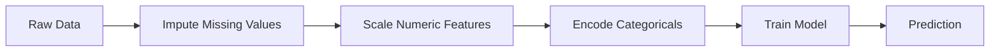
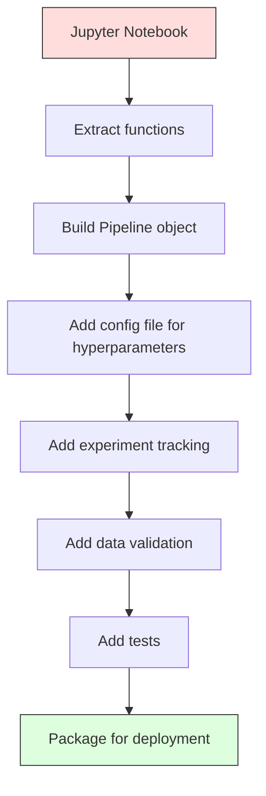

# 机器学习流水线

> 模型本身不是产品，流水线才是。流水线涵盖从原始数据到部署后预测的全部过程，而且每个步骤都必须可复现。

**Type:** 构建
**Language:** Python
**Prerequisites:** 阶段 2，第 12 课（超参数调优）
**Time:** 约 120 分钟

## 学习目标

- 从零构建一条机器学习流水线，把缺失值填补、缩放、编码和模型训练串联为一个可复现对象
- 识别数据泄漏场景，并解释流水线如何仅在训练数据上拟合转换器，从而防止泄漏
- 构建 ColumnTransformer，对数值特征和类别特征应用不同的预处理流程
- 实现流水线序列化，并证明同一条已拟合流水线在训练环境和生产环境中会产生完全相同的结果

## 问题

你有一个 Notebook：它加载数据，用中位数填补缺失值，缩放特征，训练模型，最后打印准确率。程序运行正常，于是你把它部署了。

一个月后，其他人重新训练模型，却得到了不同结果。中位数是用包含测试数据在内的完整数据集计算的，造成了数据泄漏。缩放参数没有保存，导致推理阶段使用了不同的统计量。特征工程代码分别复制到了训练和服务程序中，两个副本逐渐出现差异。生产环境中的某个类别列还出现了编码器从未见过的新取值。

这些并不是假想问题，而是机器学习系统在生产环境中失败最常见的原因。流水线把每一个转换步骤打包为一个有序、可复现的对象，从根本上解决这些问题。

## 核心概念

### 什么是流水线

流水线是一系列按顺序执行的数据转换，最后连接一个模型。每个步骤都把上一步的输出作为自己的输入。整条流水线只在训练数据上拟合一次；推理时，同一个已经拟合的流水线负责转换新数据并生成预测。



流水线可以保证：
- 转换步骤只在训练数据上拟合，不会发生泄漏
- 推理时应用的转换与训练时完全相同
- 整个对象可以序列化，并作为一个工件整体部署
- 交叉验证会在每个折中分别应用流水线，防止隐蔽的数据泄漏

### 数据泄漏：悄无声息的杀手

当测试集或未来数据中的信息混入训练过程时，就发生了数据泄漏。流水线可以防止最常见的几种泄漏。

**存在泄漏（错误）：**
```python
X = df.drop("target", axis=1)
y = df["target"]

scaler = StandardScaler()
X_scaled = scaler.fit_transform(X)

X_train, X_test = X_scaled[:800], X_scaled[800:]
y_train, y_test = y[:800], y[800:]
```

缩放器已经见过测试数据，因此均值和标准差中包含了测试样本的信息，会让准确率估计虚高。

**正确做法：**
```python
X_train, X_test = X[:800], X[800:]

scaler = StandardScaler()
X_train_scaled = scaler.fit_transform(X_train)
X_test_scaled = scaler.transform(X_test)
```

使用流水线后，你不必每次都亲自考虑这些细节，流水线会自动正确处理。

### sklearn Pipeline

sklearn 的 `Pipeline` 会把多个转换器和一个估计器串联起来。它对外提供 `.fit()`、`.predict()` 和 `.score()`，并按顺序执行全部步骤。

```python
from sklearn.pipeline import Pipeline
from sklearn.preprocessing import StandardScaler
from sklearn.linear_model import LogisticRegression

pipe = Pipeline([
    ("scaler", StandardScaler()),
    ("model", LogisticRegression()),
])

pipe.fit(X_train, y_train)
predictions = pipe.predict(X_test)
```

调用 `pipe.fit(X_train, y_train)` 时：
1. 缩放器对 X_train 调用 `fit_transform`
2. 模型对缩放后的 X_train 调用 `fit`

调用 `pipe.predict(X_test)` 时：
1. 缩放器对 X_test 调用 `transform`，而不是 fit_transform
2. 模型对缩放后的 X_test 调用 `predict`

缩放器在拟合期间从未见过测试数据，这正是流水线最核心的价值。

### ColumnTransformer：为不同列配置不同流水线

真实数据集通常同时包含数值列和类别列，而它们需要不同的预处理。`ColumnTransformer` 专门解决这个问题。

```python
from sklearn.compose import ColumnTransformer
from sklearn.preprocessing import StandardScaler, OneHotEncoder
from sklearn.impute import SimpleImputer

numeric_pipe = Pipeline([
    ("impute", SimpleImputer(strategy="median")),
    ("scale", StandardScaler()),
])

categorical_pipe = Pipeline([
    ("impute", SimpleImputer(strategy="most_frequent")),
    ("encode", OneHotEncoder(handle_unknown="ignore")),
])

preprocessor = ColumnTransformer([
    ("num", numeric_pipe, ["age", "income", "score"]),
    ("cat", categorical_pipe, ["city", "gender", "plan"]),
])

full_pipeline = Pipeline([
    ("preprocess", preprocessor),
    ("model", GradientBoostingClassifier()),
])
```

OneHotEncoder 中的 `handle_unknown="ignore"` 对生产环境至关重要。当出现一个模型从未见过的新类别，例如一座新城市时，编码器会输出全零向量，而不是直接崩溃。

### 实验追踪

流水线让一次训练过程可以复现，但你还需要记录不同实验中究竟发生了什么：使用了哪些超参数、哪个数据集版本、得到了哪些指标，以及运行的是哪一版代码。

**MLflow** 是最常用的开源解决方案：

```python
import mlflow

with mlflow.start_run():
    mlflow.log_param("max_depth", 5)
    mlflow.log_param("n_estimators", 100)
    mlflow.log_param("learning_rate", 0.1)

    pipe.fit(X_train, y_train)
    accuracy = pipe.score(X_test, y_test)

    mlflow.log_metric("accuracy", accuracy)
    mlflow.sklearn.log_model(pipe, "model")
```

每次运行都会连同参数、指标、工件和完整模型一起记录下来。你可以比较各次运行、复现任意实验，并部署任意一个模型版本。

**Weights & Biases（wandb）** 通过托管式控制面板提供同类功能：

```python
import wandb

wandb.init(project="my-pipeline")
wandb.config.update({"max_depth": 5, "n_estimators": 100})

pipe.fit(X_train, y_train)
accuracy = pipe.score(X_test, y_test)

wandb.log({"accuracy": accuracy})
```

### 模型版本管理

具备实验追踪之后，还需要管理模型版本：当前生产环境运行的是哪个模型？预发布环境是哪个？上周使用的是哪个？

MLflow 的 Model Registry 提供：
- **版本追踪：** 每个保存的模型都会得到一个版本号
- **阶段流转：** “Staging”“Production”“Archived”
- **审批流程：** 模型必须经过明确操作才能晋升到生产环境
- **回滚：** 可以立即切换回此前版本

### 使用 DVC 管理数据版本

代码使用 git 管理版本，数据也应该进行版本管理，但 git 无法妥善处理大文件。DVC（Data Version Control）正是为此而生。

```
dvc init
dvc add data/training.csv
git add data/training.csv.dvc data/.gitignore
git commit -m "Track training data"
dvc push
```

DVC 把实际数据保存在远程存储中，例如 S3、GCS 或 Azure；git 中只保留一个很小的 `.dvc` 文件，用来记录数据哈希。检出某个 git 提交后，运行 `dvc checkout` 就能恢复当时使用的确切数据。

这意味着每个 git 提交都同时固定了代码版本和数据版本，从而实现完整的可复现性。

### 可复现实验

一个可复现的实验需要满足四项条件：

1. **固定随机种子：** 为 numpy、random 和所用框架（torch、sklearn）设置种子
2. **锁定依赖版本：** 使用 requirements.txt 或 poetry.lock 记录确切版本
3. **数据版本化：** 使用 DVC 或类似工具
4. **配置文件：** 把所有超参数放入配置中，而不是硬编码在程序里

```python
import numpy as np
import random

def set_seed(seed=42):
    random.seed(seed)
    np.random.seed(seed)
    try:
        import torch
        torch.manual_seed(seed)
        torch.cuda.manual_seed_all(seed)
        torch.backends.cudnn.deterministic = True
    except ImportError:
        pass
```

### 从 Notebook 走向生产流水线



典型的演进过程如下：

1. **在 Notebook 中探索：** 快速实验、可视化并尝试特征想法
2. **提取函数：** 把预处理、特征工程和评估逻辑移入独立模块
3. **构建 Pipeline：** 把转换串联成 sklearn Pipeline 或自定义类
4. **配置管理：** 把所有超参数移入 YAML/JSON 配置文件
5. **实验追踪：** 加入 MLflow 或 wandb 日志
6. **数据验证：** 训练前检查模式、分布和缺失值规律
7. **测试：** 为转换器编写单元测试，为完整流水线编写集成测试
8. **部署：** 序列化流水线，用 API（FastAPI、Flask）封装，再放入容器

### 常见的流水线错误

| 错误 | 危害 | 修复方法 |
|---------|-------------|-----|
| 划分数据前先在完整数据上拟合 | 数据泄漏 | 将 Pipeline 与 cross_val_score 配合使用 |
| 在流水线之外进行特征工程 | 训练和服务阶段使用不同转换 | 把所有转换都放入 Pipeline |
| 不处理未知类别 | 生产环境遇到新值时崩溃 | OneHotEncoder(handle_unknown="ignore") |
| 硬编码列名 | 模式变化时程序失效 | 从配置中读取列名列表 |
| 没有数据验证 | 输入异常时悄悄生成错误预测 | 预测前加入模式检查 |
| 训练/服务偏差 | 模型在生产环境看到不同特征 | 训练和服务共用一个 Pipeline 对象 |

```figure
f3-pipeline-flow
```

## 动手构建

`code/pipeline.py` 中的代码会从零构建一条完整的机器学习流水线：

### 第 1 步：自定义转换器

```python
class CustomTransformer:
    def __init__(self):
        self.means = None
        self.stds = None

    def fit(self, X):
        self.means = np.mean(X, axis=0)
        self.stds = np.std(X, axis=0)
        self.stds[self.stds == 0] = 1.0
        return self

    def transform(self, X):
        return (X - self.means) / self.stds

    def fit_transform(self, X):
        return self.fit(X).transform(X)
```

### 第 2 步：从零实现 Pipeline

```python
class PipelineFromScratch:
    def __init__(self, steps):
        self.steps = steps

    def fit(self, X, y=None):
        X_current = X.copy()
        for name, step in self.steps[:-1]:
            X_current = step.fit_transform(X_current)
        name, model = self.steps[-1]
        model.fit(X_current, y)
        return self

    def predict(self, X):
        X_current = X.copy()
        for name, step in self.steps[:-1]:
            X_current = step.transform(X_current)
        name, model = self.steps[-1]
        return model.predict(X_current)
```

### 第 3 步：在流水线中进行交叉验证

代码会演示流水线与交叉验证结合后如何防止数据泄漏：缩放器会分别在每个折的训练数据上拟合。

### 第 4 步：使用 sklearn 构建完整生产流水线

构建一条完整流水线，其中包含 `ColumnTransformer`、多条预处理路径和一个模型，并使用正确的交叉验证与实验日志方式进行训练。

## 交付成果

本课会产出：
- `outputs/prompt-ml-pipeline.md`——用于构建和调试机器学习流水线的技能
- `code/pipeline.py`——从零实现并逐步过渡到 sklearn 的完整流水线

## 练习

1. 构建一条流水线，处理包含 3 个数值列和 2 个类别列的数据集。使用 `ColumnTransformer`，对数值列应用中位数填补和缩放，对类别列应用众数填补和独热编码，再使用 5 折交叉验证训练。

2. 故意制造数据泄漏：在划分数据前先用完整数据集拟合缩放器。比较存在泄漏的交叉验证分数与流水线产生的干净交叉验证分数。两者相差多大？

3. 使用 `joblib.dump` 序列化流水线。在另一个脚本中加载它并执行预测，验证预测结果完全相同。

4. 向流水线中加入一个自定义转换器，为最重要的两个数值列创建二次多项式特征。它应该放在流水线的哪个位置？

5. 为流水线配置 MLflow 追踪。使用不同超参数运行 5 次实验，通过 MLflow UI（`mlflow ui`）比较结果并选出最佳模型。

## 关键术语

| 术语 | 人们常说 | 实际含义 |
|------|----------------|----------------------|
| Pipeline | “转换链 + 模型” | 由多个已拟合转换器和一个模型组成的有序序列，作为整体应用以防止泄漏 |
| 数据泄漏 | “测试信息泄漏进了训练” | 使用训练集以外的信息构建模型，导致性能估计虚高 |
| ColumnTransformer | “每一类列使用不同预处理” | 对不同列子集应用不同流水线，再把结果组合起来 |
| 实验追踪 | “记录每次运行” | 记录每次训练使用的参数、指标、工件和代码版本 |
| MLflow | “追踪并部署模型” | 用于实验追踪、模型注册和部署的开源平台 |
| DVC | “数据版的 Git” | 大文件数据版本控制系统，在 git 中保存哈希，在远程存储中保存数据 |
| 模型注册表 | “模型版本目录” | 使用阶段标签（预发布、生产、归档）追踪模型版本的系统 |
| 训练/服务偏差 | “Notebook 里明明能运行” | 训练和推理阶段的数据处理方式不一致，从而造成隐蔽错误 |
| 可复现性 | “相同代码，相同结果” | 使用相同代码、数据和配置时，能够得到完全一致的结果 |

## 延伸阅读

- [scikit-learn Pipeline 文档](https://scikit-learn.org/stable/modules/compose.html)——官方流水线参考
- [MLflow 文档](https://mlflow.org/docs/latest/index.html)——实验追踪和模型注册表
- [DVC 文档](https://dvc.org/doc)——数据版本管理
- [Sculley 等：《Hidden Technical Debt in Machine Learning Systems》（2015）](https://papers.nips.cc/paper/2015/hash/86df7dcfd896fcaf2674f757a2463eba-Abstract.html)——关于机器学习系统复杂性的奠基论文
- [Google 机器学习最佳实践：Rules of ML](https://developers.google.com/machine-learning/guides/rules-of-ml)——面向生产环境的实用机器学习建议
