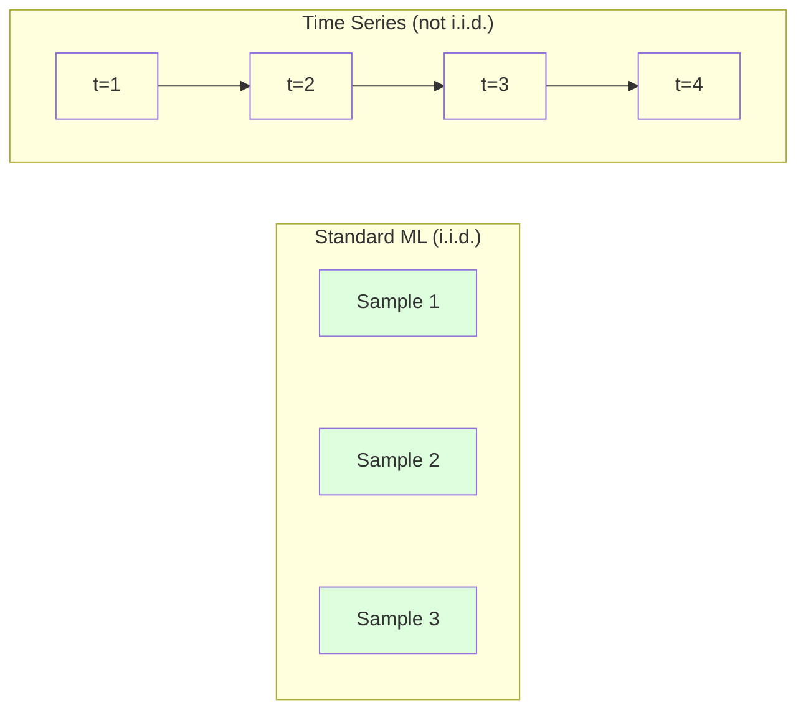
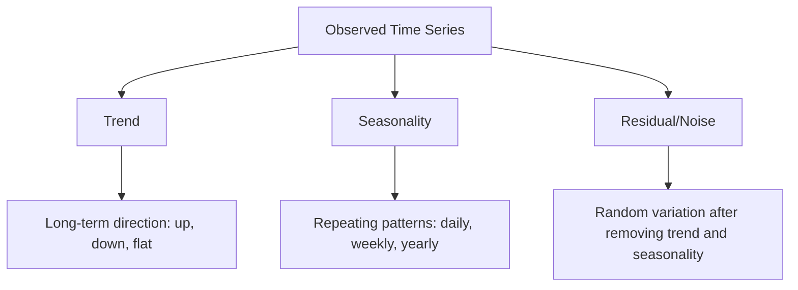
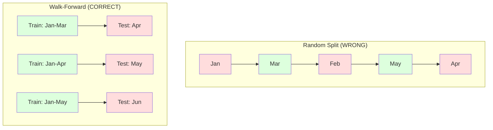

# 时间序列基础

> 过去的表现的确可以预测未来的结果——前提是你先检查平稳性。

**Type:** 构建
**Language:** Python
**Prerequisites:** 第 2 阶段，第 01–09 课
**Time:** 约 90 分钟

## 学习目标

- 把时间序列分解为趋势、季节性和残差分量，并检验其平稳性
- 实现滞后特征和滚动统计量，把时间序列转换成监督学习问题
- 构建前向验证框架，防止未来数据泄漏到训练过程
- 解释随机划分训练集与测试集为何不适用于时间序列，并演示它与正确时间划分之间的性能差距

## 问题

你拥有一组按时间排列的数据，例如每日销量、每小时气温、每分钟 CPU 使用率或每周股票价格。你希望预测下一个值、下一周，甚至下一个季度。

于是你拿出标准机器学习工具箱：随机划分训练集和测试集，执行交叉验证，输入特征矩阵，再输出预测。然而这里的每一步都是错的。

时间序列违背了标准机器学习所依赖的假设。样本之间并不独立——今天的气温取决于昨天的气温。随机划分会把未来信息泄漏到过去。某些特征在回测中看起来表现出色，部署到生产环境后却会失效，因为它们依赖的模式会随时间变化。

一个在随机交叉验证中达到 95% 准确率的模型，采用正确的时间评估后可能只剩 55%。这种差异绝非技术细节，而是纸面有效的模型与生产环境中真正有效的模型之间的差别。

本课介绍时间序列的基础：时间数据为何与众不同、如何诚实地评估模型，以及如何把时间序列转化成标准机器学习模型可以使用的特征。

## 核心概念

### 时间序列有何不同

标准机器学习假设数据满足 i.i.d.，即独立同分布。每个样本都从同一个分布中抽取，并且与其他样本相互独立。时间序列同时违背了这两点：

- **并不独立。** 今天的股价取决于昨天的股价，本周销量与上周销量相关。
- **并非同分布。** 数据分布会随时间变化，十二月的销量与三月不同。

这些并非无关紧要的小偏差。它们会改变特征构建方式、模型评估方式，以及适合采用的算法。



在标准机器学习中，样本可以互换，打乱顺序不会改变任何东西。对于时间序列，顺序就是一切，打乱顺序会直接破坏信号。

### 时间序列的组成部分

每条时间序列都是以下分量的组合：



- **趋势：** 长期变化方向，例如收入每年增长 10%，或者全球气温持续上升。
- **季节性：** 以固定间隔重复出现的模式，例如零售额在十二月激增，空调使用量在七月达到峰值。
- **残差：** 移除趋势和季节性之后剩余的部分。如果残差看起来像白噪声，说明分解已经捕捉到了信号。

### 平稳性

如果一条时间序列的统计性质，也就是均值、方差和自相关性，不随时间变化，就称它是平稳的。大多数预测方法都假设序列具有平稳性。

**为何重要：** 非平稳序列的均值会漂移。用一月数据训练的模型学到的均值，与二月出现的均值不同，因此预测会产生系统性误差。

**如何检查：** 在滑动窗口中计算滚动均值和滚动标准差。如果它们不断漂移，序列就是非平稳的。

**如何修复：** 使用差分。不要直接建模原始数值，而要建模相邻时刻数值之间的变化：

```
diff[t] = value[t] - value[t-1]
```

如果一次差分仍无法使序列平稳，就再做一次，也就是二阶差分。现实中的大多数序列最多只需要两次差分。

**示例：**

原始序列：[100, 102, 106, 112, 120]
一阶差分： [2, 4, 6, 8]（仍然呈上升趋势）
二阶差分： [2, 2, 2]（保持常数——已经平稳）

原始序列具有二次趋势。一阶差分把它变成了线性趋势，二阶差分则使它变得平坦。实践中，几乎不需要进行两次以上的差分。

**正式检验：** 增广 Dickey-Fuller（ADF）检验是检验平稳性的标准统计方法。它的原假设是“序列非平稳”。p 值低于 0.05，意味着可以拒绝原假设并认为序列平稳。本课不会从零实现 ADF，因为它需要渐近分布表；不过，示例代码中的滚动统计方法可以提供实用的可视化检查。

### 自相关

自相关衡量时刻 t 的值与时刻 t-k 的值，也就是过去 k 步的值之间有多强的相关性。自相关函数（ACF）会绘制每个滞后阶数 k 对应的相关性。

**ACF 可以告诉你：**
- 序列能够“记住”多远的历史。如果 ACF 在滞后 5 之后降为零，5 步以前的值就不再相关。
- 序列是否存在季节性。如果月度数据的 ACF 在滞后 12 处出现峰值，就说明存在年度季节性。
- 应创建多少个滞后特征。可以一直使用到 ACF 变得可以忽略的滞后阶数。

**PACF（偏自相关函数）**会去除间接相关性。如果今天与三天前相关，只是因为两者都与昨天相关，那么滞后 3 处的 PACF 会是零，而 ACF 不会是零。

### 滞后特征：把时间序列变成监督学习

标准机器学习模型需要特征矩阵 X 和目标 y，而时间序列只提供一列数值。连接两者的桥梁就是滞后特征。

取序列 [10, 12, 14, 13, 15]，创建滞后 1 和滞后 2 特征：

| lag_2 | lag_1 | target |
|-------|-------|--------|
| 10    | 12    | 14     |
| 12    | 14    | 13     |
| 14    | 13    | 15     |

现在它已经变成标准回归问题。任何机器学习模型，例如线性回归、随机森林或梯度提升，都可以根据这些滞后值预测目标。

还可以构造以下附加特征：
- **滚动统计量：** 最近 k 个值的均值、标准差、最小值和最大值
- **日历特征：** 星期几、月份、是否为节假日、是否为周末
- **差分值：** 与前一步相比的变化量
- **扩展统计量：** 累积均值、累积和
- **比率特征：** 当前值 / 滚动均值，用来表示当前值偏离近期平均值的程度
- **交互特征：** lag_1 * day_of_week，用来表示星期几对变化趋势的影响

**应该使用多少个滞后？** 可根据自相关函数决定。如果 ACF 在滞后 10 以内都显著，就至少使用 10 个滞后。如果存在周季节性，应加入滞后 7，也可能加入滞后 14。更多滞后能让模型看到更多历史，但也会增加待拟合特征的数量，从而提高过拟合风险。

**目标对齐陷阱。** 创建滞后特征时，目标必须是时刻 t 的值，所有特征则只能使用时刻 t-1 或更早的值。如果不小心把时刻 t 的值本身放进特征，就会得到一个完美的预测器——同时也是一个完全没有用的模型。这是时间序列特征工程中最常见的错误。

### 前向验证

这是本课最重要的概念。标准 k 折交叉验证会把样本随机分配到训练集和测试集；对时间序列而言，这会导致未来信息泄漏。



前向验证按以下步骤进行：
1. 使用截至时刻 t 的数据训练
2. 预测时刻 t+1，如果是多步预测，则预测 t+1 到 t+k
3. 把窗口向前移动
4. 重复上述过程

每个测试折都只包含晚于全部训练数据的数据，不存在未来信息泄漏。这样得到的结果，才能诚实估计模型部署后的实际表现。

**扩展窗口**使用所有历史数据训练，窗口会不断增长。**滑动窗口**只保留固定长度的训练数据，整个窗口向前滑动。如果你认为旧数据仍然相关，就使用扩展窗口；如果现实持续变化，旧数据反而有害，就使用滑动窗口。

### ARIMA 的直观理解

ARIMA 是经典时间序列模型，包含三个组成部分：

- **AR（自回归）：** 根据过去的值进行预测。AR(p) 使用最近 p 个值。
- **I（差分整合）：** 通过差分实现平稳性。I(d) 执行 d 轮差分。
- **MA（移动平均）：** 根据过去的预测误差进行预测。MA(q) 使用最近 q 个误差。

ARIMA(p, d, q) 把三者组合起来。可以通过 ACF/PACF 分析或自动搜索（auto-ARIMA）选择 p、d、q。

本课不会从零实现 ARIMA，因为它需要超出本课范围的数值优化。关键在于理解各个组成部分的作用，从而能够解释 ARIMA 的结果，并知道何时应该使用它。

### 各种方法适用于何时

| 方法 | 最适合 | 能否处理季节性 | 能否处理外部特征 |
|----------|---------|-------------------|------------------------|
| 滞后特征 + 机器学习 | 包含许多外部特征的表格数据 | 可以，通过日历特征 | 可以 |
| ARIMA | 单条单变量序列、短期预测 | 可以，使用 SARIMA 变体 | 不可以（ARIMAX 有限支持） |
| 指数平滑 | 简单趋势 + 季节性 | 可以，使用 Holt-Winters | 不可以 |
| Prophet | 业务预测、节假日 | 可以，使用傅里叶项 | 有限支持 |
| 神经网络（LSTM、Transformer） | 长序列、大量序列 | 通过学习获得 | 可以 |

对于大多数实际问题，滞后特征 + 梯度提升是最有力的起点。它可以自然地处理外部特征，不要求数据平稳，而且容易调试。

### 预测跨度与策略

单步预测只预测下一个时间步，多步预测则要预测多个时间步。多步预测有三种策略：

**递归式（迭代式）：** 先预测下一步，再把这个预测作为下一轮的输入。它很简单，但误差会累积——每次预测都使用上一次预测，所以错误会不断叠加。

**直接式：** 为每个预测跨度分别训练一个模型。模型 1 预测 t+1，模型 5 预测 t+5。它不会累积误差，但每个模型拥有的训练样本更少，而且各模型之间无法共享信息。

**多输出式：** 训练一个同时输出所有预测跨度的模型。它可以在不同跨度之间共享信息，但要求模型支持多输出，或者使用自定义损失函数。

对大多数实际问题，短跨度预测（1–5 步）可以先尝试递归式，跨度较长时则先尝试直接式。

### 时间序列中的常见错误

| 错误 | 产生原因 | 修复方法 |
|---------|---------------|-----------|
| 随机划分训练集/测试集 | 沿用标准机器学习习惯 | 使用前向划分或按时间划分 |
| 使用未来特征 | 误把时刻 t 的特征包含进来 | 检查每项特征的时间对齐关系 |
| 对季节性过拟合 | 模型记住了日历模式 | 在测试集中至少留出一个完整季节周期 |
| 忽略尺度变化 | 收入翻倍，但模式不变 | 建模百分比变化，而非绝对值 |
| 使用过多滞后特征 | 误以为“历史越多越好” | 使用 ACF 判断相关滞后 |
| 不做差分 | 认为“模型自己会学会” | 树模型能处理趋势；线性模型需要平稳性 |

```figure
f3-series-decompose
```

## 动手构建

`code/time_series.py` 中的代码从零实现了核心构建模块。

### 滞后特征生成器

```python
def make_lag_features(series, n_lags):
    n = len(series)
    X = np.full((n, n_lags), np.nan)
    for lag in range(1, n_lags + 1):
        X[lag:, lag - 1] = series[:-lag]
    valid = ~np.isnan(X).any(axis=1)
    return X[valid], series[valid]
```

它把一维序列转换成特征矩阵：每一行都以最近的 `n_lags` 个值作为特征，以当前值作为目标。

### 前向交叉验证

```python
def walk_forward_split(n_samples, n_splits=5, min_train=50):
    assert min_train < n_samples, "min_train must be less than n_samples"
    step = max(1, (n_samples - min_train) // n_splits)
    for i in range(n_splits):
        train_end = min_train + i * step
        test_end = min(train_end + step, n_samples)
        if train_end >= n_samples:
            break
        yield slice(0, train_end), slice(train_end, test_end)
```

每次划分都保证训练数据严格早于测试数据。训练窗口会随着每个折不断扩展。

### 简单自回归模型

纯 AR 模型本质上就是在滞后特征上进行线性回归：

```python
class SimpleAR:
    def __init__(self, n_lags=5):
        self.n_lags = n_lags
        self.weights = None
        self.bias = None

    def fit(self, series):
        X, y = make_lag_features(series, self.n_lags)
        # Solve via normal equations
        X_b = np.column_stack([np.ones(len(X)), X])
        theta = np.linalg.lstsq(X_b, y, rcond=None)[0]
        self.bias = theta[0]
        self.weights = theta[1:]
        return self
```

从概念上看，它与第 02 课的线性回归完全相同，只不过应用对象变成了同一个变量的时间滞后版本。

### 平稳性检查

代码会计算滚动统计量，从视觉和数值两个角度评估平稳性：

```python
def check_stationarity(series, window=50):
    rolling_mean = np.array([
        series[max(0, i - window):i].mean()
        for i in range(1, len(series) + 1)
    ])
    rolling_std = np.array([
        series[max(0, i - window):i].std()
        for i in range(1, len(series) + 1)
    ])
    return rolling_mean, rolling_std
```

如果滚动均值发生漂移，或者滚动标准差不断变化，序列就是非平稳的。此时应进行差分，然后再次检查。

代码还会比较序列前半部分和后半部分，以检查平稳性。如果两部分的均值差超过半个标准差，或者方差比超过 2 倍，就会把序列标记为非平稳。

### 自相关

```python
def autocorrelation(series, max_lag=20):
    n = len(series)
    mean = series.mean()
    var = series.var()
    acf = np.zeros(max_lag + 1)
    for k in range(max_lag + 1):
        cov = np.mean((series[:n-k] - mean) * (series[k:] - mean))
        acf[k] = cov / var if var > 0 else 0
    return acf
```

## 实际应用

使用 sklearn 时，可以直接把滞后特征交给任意回归器：

```python
from sklearn.linear_model import Ridge
from sklearn.ensemble import GradientBoostingRegressor

X, y = make_lag_features(series, n_lags=10)

for train_idx, test_idx in walk_forward_split(len(X)):
    model = Ridge(alpha=1.0)
    model.fit(X[train_idx], y[train_idx])
    predictions = model.predict(X[test_idx])
```

使用 ARIMA 时，可以采用 statsmodels：

```python
from statsmodels.tsa.arima.model import ARIMA

model = ARIMA(train_series, order=(5, 1, 2))
fitted = model.fit()
forecast = fitted.forecast(steps=30)
```

`time_series.py` 中的代码会演示两种方法，并通过前向验证比较它们。

### sklearn TimeSeriesSplit

sklearn 提供了用于实现前向验证的 `TimeSeriesSplit`：

```python
from sklearn.model_selection import TimeSeriesSplit

tscv = TimeSeriesSplit(n_splits=5)
for train_index, test_index in tscv.split(X):
    X_train, X_test = X[train_index], X[test_index]
    y_train, y_test = y[train_index], y[test_index]
    model.fit(X_train, y_train)
    score = model.score(X_test, y_test)
```

它等价于我们从零实现的 `walk_forward_split`，但已经集成到 sklearn 的交叉验证框架中。还可以把它与 `cross_val_score` 配合使用：

```python
from sklearn.model_selection import cross_val_score

scores = cross_val_score(model, X, y, cv=TimeSeriesSplit(n_splits=5))
print(f"Mean score: {scores.mean():.4f} +/- {scores.std():.4f}")
```

### 评估指标

时间序列预测使用回归指标，但需要结合时间语境理解：

- **MAE（平均绝对误差）：** |y_true - y_pred| 的平均值。它使用原始单位，容易解释，例如“预测平均偏差 3.2 度”。
- **RMSE（均方根误差）：** 均方误差的平方根。相比 MAE，它会更严厉地惩罚大误差。如果少数大误差比许多小误差危害更大，应使用这一指标。
- **MAPE（平均绝对百分比误差）：** |error / true_value| * 100 的平均值。它不受尺度影响，适合比较不同序列，但真实值为零时没有定义。
- **与朴素基线比较：** 始终与简单基线进行比较。季节性朴素基线直接采用上一个周期的值，例如昨天或上周的值。如果模型无法击败朴素基线，一定存在问题。

### 滚动特征

代码会演示如何在滞后特征之外加入滚动统计量，包括 7 天和 14 天窗口内的均值、标准差、最小值与最大值。这些特征能为模型提供近期趋势和波动性信息，而单纯的滞后特征无法直接表达这些信息。

例如，滚动均值持续上升表示可能存在上升趋势；滚动标准差变大则表示波动性正在增强。树模型能够从这些模式中学习，而线性模型无法直接学到。

## 交付成果

本课会产出：
- `outputs/prompt-time-series-advisor.md`——用于界定时间序列问题的提示词
- `code/time_series.py`——滞后特征、前向验证、AR 模型和平稳性检查

### 必须击败的基线

构建任何模型之前，都应先建立以下基线：

1. **上一时刻值（持续性基线）。** 预测明天与今天相同。对许多序列来说，这个看似简单的基线出乎意料地难以击败。
2. **季节性朴素基线。** 预测今天与上周同一天，或去年同一天相同。如果模型无法击败它，说明模型没有学到季节性之外的任何有用模式。
3. **移动平均。** 使用最近 k 个值的平均值作为预测。它能平滑噪声，却无法捕捉突然变化。

如果精心构建的机器学习模型输给季节性朴素基线，通常说明程序存在错误。最常见的原因是特征包含未来信息、评估方法错误，或者序列本身确实随机且不可预测。

### 实用建议

1. **从绘图开始。** 在进行任何建模之前，先绘制原始序列。检查趋势、季节性、离群点和结构突变，也就是行为模式突然发生变化的位置。30 秒的视觉检查往往比一小时的自动分析提供更多信息。

2. **先做差分，再建模。** 如果序列存在明显趋势，应先差分，再创建滞后特征。树模型能够处理趋势，但线性模型不能，而且差分通常不会带来负面影响。

3. **至少留出一个完整季节周期。** 如果序列具有周季节性，测试集至少要覆盖完整一周；如果具有月季节性，就至少覆盖完整一个月。否则无法评估模型是否捕捉到了季节模式。

4. **在生产环境中持续监控。** 随着现实世界变化，时间序列模型的效果会逐渐下降。应滚动追踪预测误差；一旦误差开始增大，就使用近期数据重新训练模型。

5. **警惕状态突变。** 使用疫情前数据训练的模型，无法预测疫情后的行为。可以把已知状态变化的指示变量加入特征，或者采用会遗忘旧数据的滑动窗口。

6. **对偏斜序列进行对数变换。** 收入、价格和计数往往右偏。取对数可以稳定方差，并把乘法模式变成线性模型可以处理的加法模式。先在对数空间中预测，再取指数还原到原始单位。

## 练习

1. **平稳性实验。** 生成一条带线性趋势的序列，通过滚动统计检查平稳性。应用一阶差分，再次检查。对于二次趋势，需要多少轮差分？

2. **选择滞后阶数。** 对周期为 7 的季节性序列计算 ACF。哪些滞后具有最高自相关性？只使用这些滞后，而不是连续使用滞后 1 到 7，来创建滞后特征。准确率是否有所提升？

3. **前向验证与随机划分。** 在滞后特征上训练 Ridge 回归。分别使用随机 80/20 划分和前向验证进行评估。随机划分把性能高估了多少？

4. **特征工程。** 在滞后特征中加入滚动均值（window=7）、滚动标准差（window=7）和星期几特征。使用前向验证，比较加入这些特征前后的准确率。

5. **多步预测。** 修改 AR 模型，使其预测未来 5 步，而不是 1 步。比较两种策略：(a) 预测一步，再把预测作为下一步的输入，也就是递归式；(b) 为每个预测跨度分别训练模型，也就是直接式。哪一种更准确？

## 关键术语

| 术语 | 人们常说 | 实际含义 |
|------|----------------|----------------------|
| 平稳性 | “统计量不随时间变化” | 均值、方差和自相关结构随时间保持不变的序列 |
| 差分 | “相邻值相减” | 计算 y[t] - y[t-1]，以移除趋势并获得平稳性 |
| 自相关（ACF） | “序列与自身的相关程度” | 时间序列与其滞后副本之间的相关性，是滞后阶数的函数 |
| 偏自相关（PACF） | “只看直接相关” | 去除所有更短滞后的影响后，滞后 k 处的自相关性 |
| 滞后特征 | “把过去值作为输入” | 使用 y[t-1]、y[t-2]、...、y[t-k] 作为特征来预测 y[t] |
| 前向验证 | “遵守时间顺序的交叉验证” | 训练数据在时间上始终早于测试数据的评估方法 |
| ARIMA | “经典时间序列模型” | 自回归整合移动平均：组合过去值（AR）、差分（I）和过去误差（MA） |
| 季节性 | “重复出现的日历模式” | 与日、周、年等日历周期相关的规律且可预测的时间序列循环 |
| 趋势 | “长期方向” | 序列水平随时间持续上升或下降 |
| 扩展窗口 | “使用全部历史” | 训练集随每个折不断增长的前向验证方式 |
| 滑动窗口 | “固定长度的历史” | 训练集保持固定长度并不断向前移动的前向验证方式 |

## 延伸阅读

- [Hyndman 与 Athanasopoulos：《Forecasting: Principles and Practice》（第 3 版）](https://otexts.com/fpp3/)——最好的免费时间序列预测教材
- [scikit-learn Time Series Split](https://scikit-learn.org/stable/modules/generated/sklearn.model_selection.TimeSeriesSplit.html)——sklearn 的前向划分器
- [statsmodels ARIMA 文档](https://www.statsmodels.org/stable/generated/statsmodels.tsa.arima.model.ARIMA.html)——带诊断功能的 ARIMA 实现
- [Makridakis 等：《The M5 Competition》（2022）](https://www.sciencedirect.com/science/article/pii/S0169207021001874)——比较机器学习方法与统计方法的大规模预测竞赛
