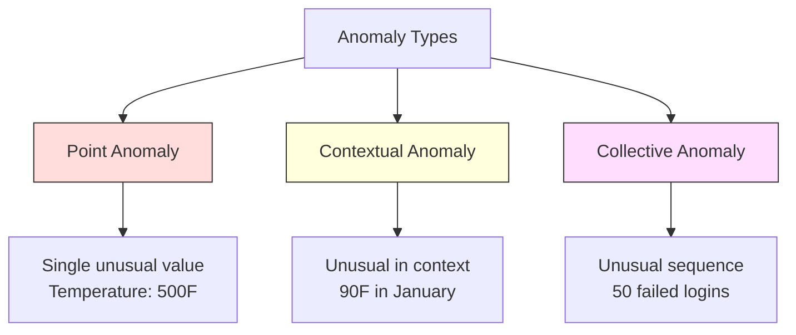
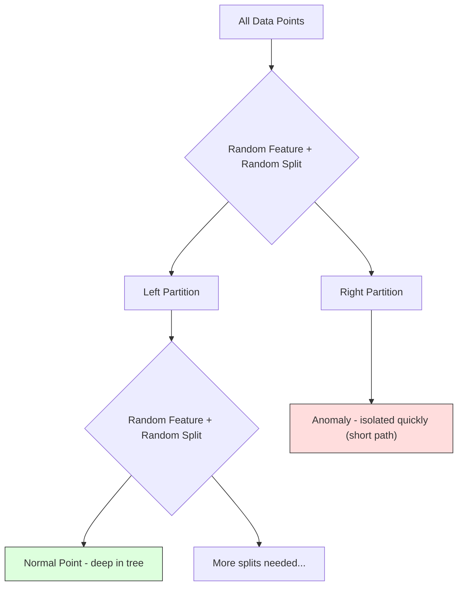
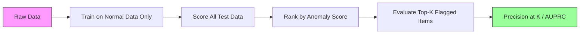

# 异常检测

> 正常很容易定义，不符合正常模式的就是异常。

**Type:** 构建
**Language:** Python
**Prerequisites:** 第 2 阶段，第 01–09 课
**Time:** 约 75 分钟

## 学习目标

- 从零实现 Z-score、IQR 和 Isolation Forest 异常检测方法
- 区分点异常、上下文异常和群体异常，并为每种异常选择合适的检测方法
- 解释异常检测为何被表述为对正常数据建模，而不是对异常进行分类
- 比较无监督异常检测与监督分类，并评估新型异常覆盖率与精确率之间的权衡

## 问题

一张信用卡下午 2 点在纽约使用，下午 2:05 又在东京使用。工厂传感器在正常范围为 80–120 度时读出 150 度。某台服务器在日均每秒 200 个请求的情况下，突然每秒发出 50,000 个请求。

这些都是异常，而找出它们至关重要。欺诈会造成数十亿美元的损失，设备故障会导致停机，网络入侵则会造成数据损失。

难点在于，你很少拥有带标签的异常样本。欺诈交易可能只占全部交易的 0.1%，设备故障每年只发生几次。由于“异常”类别中几乎没有可供学习的数据，你无法训练标准分类器。即使拥有少量标签，曾经见过的异常也不代表未来会遇到的全部类型；明天的欺诈手段可能与今天截然不同。

异常检测把问题反转过来：不去学习什么是异常，而是学习什么是正常。任何偏离正常模式的现象都值得怀疑。这种方法不需要标签，能够适应新型异常，也可以扩展到海量数据集。

## 核心概念

### 异常的类型

异常并非全都一样：

- **点异常。** 单个数据点无论处于什么上下文都很反常，例如 500 度的温度读数，或者一个通常只消费 50 美元的账户突然发生 50,000 美元的交易。
- **上下文异常。** 某个数据点在特定上下文中显得异常。90 度的气温在夏季很正常，在冬季却很反常；数值相同，上下文不同。
- **群体异常。** 一组数据点作为整体形成异常序列，即使其中每个点单独看都可能正常。连续 5 次登录失败很常见，连续 50 次则可能是暴力破解攻击。

大多数方法检测的是点异常。上下文异常需要引入时间或位置特征，群体异常则需要能够感知序列的方法。



### 无监督问题设定

在标准分类中，两个类别都有标签。异常检测通常面对以下三种情况之一：

1. **完全无监督。** 没有任何标签。检测器在全部数据上拟合，只能寄希望于异常足够稀少，不至于污染“正常”模型。
2. **半监督。** 只有一份确定为正常的干净数据集。先在这份数据上拟合，再为其余所有数据评分。条件允许时，这是最理想的设定。
3. **弱监督。** 只有少量带标签的异常。将它们用于评估，而不是训练：先以无监督方式训练，再在带标签子集上衡量精确率和召回率。

关键在于：异常检测与分类有着根本区别。你建模的是正常数据的分布，而不是两个类别之间的决策边界。

### 监督与无监督之间的权衡

如果确实拥有带标签的异常，应该把它们用于训练，也就是监督分类，还是只用于评估，也就是无监督检测？

**监督方法（视为分类问题）：**
- 能捕捉此前见过的确切异常类型
- 对已知异常类型具有更高精确率
- 会完全漏掉新型异常
- 新异常类型出现后需要重新训练
- 需要足够多的异常样本，而现实中往往数量不足

**无监督方法（建模正常模式，标记偏离项）：**
- 能捕捉任何偏离正常的情况，包括新型异常
- 不需要带标签的异常
- 假阳性率更高，因为异常现象并不一定都是坏事
- 面对分布漂移时更稳健

实践中，最好的系统会结合两者：使用无监督检测获得广泛覆盖，使用监督模型识别已知的高优先级异常类型，再由人工复核模棱两可的情况。

### Z-Score 方法

这是最简单的方法。计算每个特征的均值和标准差，把距离均值超过 k 个标准差的点标记出来。

```text
z_score = (x - mean) / std
anomaly if |z_score| > threshold
```

默认阈值为 3.0。对于高斯分布，99.7% 的正常数据都位于均值上下 3 个标准差之内。

**优点：** 简单、快速、易于解释，例如“这个值比正常水平高 4.5 个标准差”。

**缺点：** 假设数据服从正态分布；对训练数据中的离群点很敏感，因为离群点会移动均值并增大标准差，反而让自身更难被发现；无法处理多峰分布。

**适合的场景：** 单特征监控，而且数据大致呈钟形分布，例如服务器响应时间、制造公差，以及基线稳定的传感器读数。

**不适合的场景：** 多簇数据，例如基线温度不同的两个办公地点；偏斜数据，例如 1000 美元的交易虽然少见却不一定异常；训练集中已经混入离群点的数据。

### IQR 方法

IQR 比 Z-score 更稳健。它使用四分位距，而不是均值和标准差。

```
Q1 = 25th percentile
Q3 = 75th percentile
IQR = Q3 - Q1
lower_bound = Q1 - factor * IQR
upper_bound = Q3 + factor * IQR
anomaly if x < lower_bound or x > upper_bound
```

默认因子为 1.5。

**优点：** 对离群点稳健，因为极端值不会影响百分位数；能够处理偏斜分布；不要求数据服从正态分布。

**缺点：** 只能单变量使用，也就是逐个特征独立应用。它无法检测只有把多个特征放在一起时才显得异常的点：某个点在每个单独特征上都可能正常，却在联合空间中异常。

**实践提示：** IQR 中的 1.5 因子对应箱线图的须，落在须以外的点都是潜在离群点。把 1.5 改为 3.0 会让检测器更加保守，标记更少，假阳性也更少。合适的因子取决于你能容忍多少误报。

### Isolation Forest

它的核心洞见是：异常既稀少又与众不同。在随机划分数据时，异常更容易被孤立出来，也就是只需较少的随机分裂便能与其余数据分开。



**工作方式：**
1. 构建许多随机树，形成孤立森林
2. 在每个节点随机选择一个特征，再从该特征的最小值和最大值之间随机选择一个分裂值
3. 持续分裂，直到每个点都被孤立在自己的叶节点中
4. 异常点在所有树上的平均路径长度更短

**为何有效：** 正常点位于稠密区域，需要经过许多次随机分裂，才能把某个点与邻居分离。异常点位于稀疏区域，只需一两次随机分裂便能孤立。

异常分数由所有树上的平均路径长度计算得出，并使用随机二叉搜索树对 n 个样本的期望路径长度进行归一化：

```
score(x) = 2^(-average_path_length(x) / c(n))
```

其中 `c(n)` 是 n 个样本的期望路径长度。分数接近 1 表示异常，接近 0.5 表示正常，接近 0 则表示非常正常，也就是深埋在稠密簇内部。

**优点：** 不作分布假设；适用于高维数据；扩展性好，因为每棵树只使用一个子样本，计算量随样本规模呈次线性增长；可以处理混合特征类型。

**缺点：** 不善于发现稠密区域内的异常，也就是遮蔽效应；如果包含许多无关特征，随机分裂的效果会下降。

**关键超参数：**
- `n_estimators`：树的数量。通常 100 棵已经足够。增加树的数量可以让分数更稳定，但计算速度会变慢。
- `max_samples`：每棵树使用的样本数。原始论文的默认值为 256。较小的值会降低单棵树的准确性，却能提高多样性。正是这种子采样让 Isolation Forest 速度很快，因为每棵树只看到一小部分数据。
- `contamination`：预期的异常比例。它只用于设置阈值，不会影响异常分数本身。

### 局部离群因子（LOF）

LOF 会比较某个点附近的局部密度与其邻居附近的密度。如果一个点处在稀疏区域，而周围都是稠密区域，它就是异常。

**工作方式：**
1. 为每个点找出 k 个最近邻居
2. 计算局部可达密度，也就是该邻域有多稠密
3. 比较每个点的密度与其邻居的密度
4. 如果某个点的密度远低于邻居，就把它视为离群点

**LOF 分数：**
- LOF 接近 1.0，表示密度与邻居相似，属于正常点
- LOF 大于 1.0，表示密度低于邻居，可能是异常
- LOF 远大于 1.0，例如达到 2.0 以上，表示密度显著较低，很可能是异常

“局部”二字至关重要。设想一个包含两个簇的数据集：一个稠密簇有 1000 个点，一个稀疏簇有 50 个点。稀疏簇边缘的点从全局看并不罕见，因为它仍有 50 个邻居；但如果它的直接邻居比它更稠密，它在局部就很异常。LOF 能捕捉到全局方法会遗漏的这种细微差别。

**优点：** 能检测局部异常，也就是在邻域中显得反常、但在全局未必反常的点；适用于密度不同的多个簇。

**缺点：** 在大型数据集上速度较慢，朴素实现的复杂度为 O(n^2)；对 k 的选择敏感；在维度非常高时效果不佳，因为维数灾难会影响距离计算。

### 方法比较

| 方法 | 假设 | 速度 | 处理高维数据 | 检测局部异常 |
|--------|------------|-------|-------------------|------------------------|
| Z-score | 正态分布 | 非常快 | 可以（逐特征） | 不可以 |
| IQR | 无（逐特征） | 非常快 | 可以（逐特征） | 不可以 |
| Isolation Forest | 无 | 快 | 可以 | 部分可以 |
| LOF | 距离具有意义 | 慢 | 较差 | 可以 |

### 评估难题

评估异常检测器比评估分类器更困难：

- **类别极度不均衡。** 如果异常只占 0.1%，始终预测“正常”也能获得 99.9% 的准确率，因此准确率毫无用处。
- **AUROC 会产生误导。** 在严重不均衡的数据上，即使模型在实际阈值处漏掉大多数异常，AUROC 仍可能看起来很好。
- **更合适的指标：** Precision@k，也就是最可疑的 k 个项目中有多少是真异常；AUPRC，即精确率—召回率曲线下面积；以及固定假阳性率下的召回率。



### 异常检测流水线

实践中的异常检测通常遵循以下工作流：

1. **收集基线数据。** 最理想的是选择一段确定没有异常，或异常极少的时期。
2. **特征工程。** 同时使用原始特征和派生特征，例如滚动统计量、时间特征和比率。
3. **训练检测器。** 在基线数据上拟合，让模型学习“正常”是什么样子。
4. **为新数据评分。** 每条新观测都会得到一个异常分数。
5. **选择阈值。** 确定分数截断点。这是一项业务决策：阈值越高，误报越少，但漏掉的异常越多。
6. **告警并调查。** 把标记出的数据交给人工复核或自动响应系统。
7. **收集反馈。** 记录每个标记项是真异常还是误报，用这些数据评估检测器，并随时间调整阈值。

这条流水线永远不会真正“完成”。数据分布会变化，新型异常会出现，阈值也需要调整。应把异常检测视为一个持续演进的系统，而不是一次性模型。

```figure
f3-anomaly-fence
```

## 动手构建

`code/anomaly_detection.py` 中的代码会从零实现 Z-score、IQR 和 Isolation Forest。

### Z-Score 检测器

```python
def zscore_detect(X, threshold=3.0):
    mean = X.mean(axis=0)
    std = X.std(axis=0)
    std[std == 0] = 1.0
    z = np.abs((X - mean) / std)
    return z.max(axis=1) > threshold
```

这个实现简单而且完全向量化。只要任意一个特征超过阈值，就会把该点标记出来。

### IQR 检测器

```python
def iqr_detect(X, factor=1.5):
    q1 = np.percentile(X, 25, axis=0)
    q3 = np.percentile(X, 75, axis=0)
    iqr = q3 - q1
    iqr[iqr == 0] = 1.0
    lower = q1 - factor * iqr
    upper = q3 + factor * iqr
    outside = (X < lower) | (X > upper)
    return outside.any(axis=1)
```

### 从零实现 Isolation Forest

从零实现的版本会构建多棵孤立树，随机划分特征空间：

```python
class IsolationTree:
    def __init__(self, max_depth):
        self.max_depth = max_depth

    def fit(self, X, depth=0):
        n, p = X.shape
        if depth >= self.max_depth or n <= 1:
            self.is_leaf = True
            self.size = n
            return self
        self.is_leaf = False
        self.feature = np.random.randint(p)
        x_min = X[:, self.feature].min()
        x_max = X[:, self.feature].max()
        if x_min == x_max:
            self.is_leaf = True
            self.size = n
            return self
        self.threshold = np.random.uniform(x_min, x_max)
        left_mask = X[:, self.feature] < self.threshold
        self.left = IsolationTree(self.max_depth).fit(X[left_mask], depth + 1)
        self.right = IsolationTree(self.max_depth).fit(X[~left_mask], depth + 1)
        return self
```

一个点被孤立时所需的路径长度决定其异常分数。路径越短，异常程度越高。

`IsolationForest` 类把多棵树封装在一起：

```python
class IsolationForest:
    def __init__(self, n_estimators=100, max_samples=256, seed=42):
        self.n_estimators = n_estimators
        self.max_samples = max_samples

    def fit(self, X):
        sample_size = min(self.max_samples, X.shape[0])
        max_depth = int(np.ceil(np.log2(sample_size)))
        for _ in range(self.n_estimators):
            idx = rng.choice(X.shape[0], size=sample_size, replace=False)
            tree = IsolationTree(max_depth=max_depth)
            tree.fit(X[idx])
            self.trees.append(tree)

    def anomaly_score(self, X):
        avg_path = average path length across all trees
        scores = 2.0 ** (-avg_path / c(max_samples))
        return scores
```

归一化因子 `c(n)` 是在包含 n 个元素的二叉搜索树中，一次不成功搜索的期望路径长度。它等于 `2 * H(n-1) - 2*(n-1)/n`，其中 `H` 表示调和数。归一化后，不同规模数据集产生的分数可以相互比较。

### 演示场景

代码会生成多种测试场景：

1. **包含离群点的单个簇。** 一个二维高斯簇，并在远离中心的位置注入异常。所有方法都应该在这里奏效。
2. **多峰数据。** 三个大小和密度不同的簇，簇间点属于异常。Z-score 在这里表现不佳，因为各个特征的取值范围很宽。
3. **高维数据。** 一共有 50 个特征，但异常只在其中 5 个特征上有所不同。这个场景检验各方法能否在特征子集中发现异常。

每个演示都会使用精确率、召回率、F1 和 Precision@k 比较所有方法。

## 实际应用

使用 sklearn 时，可以直接调用库实现，而不是从零实现：

```python
from sklearn.ensemble import IsolationForest
from sklearn.neighbors import LocalOutlierFactor

iso = IsolationForest(n_estimators=100, contamination=0.05, random_state=42)
iso.fit(X_train)
predictions = iso.predict(X_test)

lof = LocalOutlierFactor(n_neighbors=20, contamination=0.05, novelty=True)
lof.fit(X_train)
predictions = lof.predict(X_test)
```

注意，`contamination` 用来设置预期异常比例。能否正确设置这个值很重要：设置得太低会漏掉异常，设置得太高则会产生误报。

`anomaly_detection.py` 中的代码会在同一份数据上比较从零实现与 sklearn 实现。

### sklearn 的 Contamination 参数

sklearn 中的 `contamination` 参数决定如何设置阈值，从而把连续异常分数转换成二元预测。它不会改变底层异常分数。

```python
iso_5 = IsolationForest(contamination=0.05)
iso_10 = IsolationForest(contamination=0.10)
```

两者会产生完全相同的异常分数，但 `iso_5` 标记分数最高的 5%，`iso_10` 则标记最高的 10%。如果不知道真实异常率，而现实中通常确实不知道，就把 contamination 设为 "auto"，并直接使用原始分数。再根据假阳性与假阴性的成本权衡，自行设置阈值。

### 单类 SVM

另一种值得了解的无监督异常检测器是单类 SVM。它使用核技巧，在高维特征空间中围绕正常数据拟合一条边界。

```python
from sklearn.svm import OneClassSVM

oc_svm = OneClassSVM(kernel="rbf", gamma="auto", nu=0.05)
oc_svm.fit(X_train)
predictions = oc_svm.predict(X_test)
```

`nu` 参数用于近似异常比例。单类 SVM 适合中小型数据集，却无法扩展到非常大的数据，因为核矩阵会以平方速度增长。

### 自编码器方法（预览）

自编码器是一种学习压缩和重建数据的神经网络。先在正常数据上训练；测试时，由于网络只学会了重建正常模式，异常数据会产生较高的重建误差。

第 3 阶段的深度学习课程会进一步介绍这种方法，但背后的原则完全相同：建模正常模式，标记偏离项。

### 集成异常检测

正如集成方法能改善分类结果（第 11 课），组合多个异常检测器也能提升检测效果。最简单的方法如下：

1. 运行多个检测器，例如 Z-score、IQR、Isolation Forest 和 LOF
2. 把每个检测器的分数归一化到 [0, 1]
3. 对归一化后的分数取平均
4. 把平均分数高于阈值的点标记出来

这种方法可以减少假阳性，因为不同检测器有不同的失败模式。如果四种方法都标记了同一个点，它几乎肯定是异常；如果只有一种方法标记，则可能只是该方法本身的特性所致。

更复杂的集成方法会根据每个检测器的估计可靠性分配权重。如果拥有包含已知异常的验证集，就可以在这份数据上评估可靠性。

### 生产环境注意事项

1. **阈值漂移。** 随着数据分布变化，固定阈值会逐渐过时。应监控异常分数的分布，并定期调整阈值。
2. **告警疲劳。** 误报过多后，操作人员就会停止关注。开始时应采用较高阈值，只生成数量较少但更可靠的告警；随着信任建立，再逐步降低阈值。
3. **集成方法。** 生产环境中应组合多个检测器，只有多种方法一致认为某个点异常时才标记，可以显著减少假阳性。
4. **特征工程。** 原始特征通常远远不够。应加入滚动统计量、比率、距上次事件的时间和领域特定特征。良好的特征集比选择哪种检测器更加重要。
5. **反馈循环。** 操作人员调查标记项并确认或否定后，应把结论反馈给系统。随着时间积累带标签数据，用它们评估和改善检测器。

## 交付成果

本课会产出：
- `outputs/skill-anomaly-detector.md`——用于选择合适检测器的决策技能
- `code/anomaly_detection.py`——从零实现的 Z-score、IQR 和 Isolation Forest，以及与 sklearn 的比较

### 如何选择阈值

异常分数是连续值，需要设置阈值才能作出二元决策。这是业务决策，而不是纯技术决策。

考虑两个场景：
- **欺诈检测。** 漏掉欺诈的代价很高，会造成退款损失并破坏客户信任；一次误报只需分析人员花 5 分钟调查。此时应把阈值设低，尽量捕捉更多欺诈，同时接受更多误报。
- **设备维护。** 一次误报会导致不必要的停机，损失 50,000 美元；漏掉一次故障则会带来 500,000 美元的维修费用。阈值需要在两种成本之间取得平衡。

两种情况下，最佳阈值都取决于假阳性与假阴性的成本比。可以绘制不同阈值下的精确率和召回率，再叠加成本函数，选择总成本最低的点。

### 扩展到生产环境

在生产环境中进行实时异常检测时：

1. **批量训练，在线评分。** 定期使用近期正常数据训练模型，例如每天或每周一次；每条新观测到来时立即评分。
2. **特征计算必须一致。** 如果训练时使用了 30 天滚动统计量，为新观测计算特征时同样需要 30 天历史数据，因此必须缓冲所需历史。
3. **监控分数分布。** 持续追踪异常分数随时间变化的分布。如果中位数不断升高，要么数据发生了变化，要么模型已经过时。
4. **可解释性。** 标记异常时应说明原因。Z-score 可以解释为“特征 X 比正常水平高 4.2 个标准差”；Isolation Forest 可以解释为“这个点平均经过 3.1 次分裂就被孤立，而正常点需要 8.5 次”。

## 练习

1. **调节阈值。** 让 Z-score 检测器使用从 1.0 到 5.0、步长为 0.5 的阈值。绘制每个阈值对应的精确率和召回率。哪个位置最适合你的数据？

2. **多变量异常。** 创建二维数据，使每个特征单独看都正常，但特征组合却异常，例如远离主簇对角线的点。演示逐特征 Z-score 会漏掉这些点，而 Isolation Forest 能够发现它们。

3. **从零实现 LOF。** 使用 k 近邻实现局部离群因子，并在同一份数据上与 sklearn 的 LocalOutlierFactor 比较。分别采用 k=10 和 k=50，k 的选择会如何影响结果？

4. **流式异常检测。** 修改 Z-score 检测器，使其适用于流式场景：新数据点到来时，使用 Welford 在线算法更新运行均值和方差。在同一份数据上与批量 Z-score 比较。

5. **真实数据评估。** 选取一份包含已知异常的数据集，例如 Kaggle 信用卡欺诈数据。使用 precision@100、precision@500 和 AUPRC 评估全部四种方法。哪种方法效果最好？为什么？

## 关键术语

| 术语 | 人们常说 | 实际含义 |
|------|----------------|----------------------|
| 异常 | “离群点、不寻常的点” | 显著偏离正常数据预期模式的数据点 |
| 点异常 | “单个奇怪的值” | 无论上下文如何都显得异常的单条观测 |
| 上下文异常 | “数值正常，场景不对” | 在给定时间、位置等上下文中异常，但换一个上下文可能正常的观测 |
| Isolation Forest | “随机分裂找离群点” | 由多棵随机树组成的集成；异常点比正常点经过更少分裂就会被孤立 |
| 局部离群因子 | “与邻居比较密度” | 标记局部密度远低于邻居密度的点 |
| Z-score | “距均值几个标准差” | (x - mean) / std，以标准差为单位衡量一个点与中心的距离 |
| IQR | “四分位距” | Q3 - Q1，衡量中间 50% 数据的分散程度，用于稳健地检测离群点 |
| Contamination | “预期异常比例” | 告诉检测器应把多大比例数据标记为异常的超参数 |
| Precision@k | “最可疑的 k 个中有多少是真的” | 只在最可疑的 k 个点上计算精确率，适用于不均衡的异常检测 |
| AUPRC | “精确率—召回率曲线下面积” | 汇总所有阈值下精确率—召回率表现的指标，在不均衡数据上优于 AUROC |

## 延伸阅读

- [Liu 等：《Isolation Forest》（2008）](https://cs.nju.edu.cn/zhouzh/zhouzh.files/publication/icdm08b.pdf)——Isolation Forest 原始论文
- [Breunig 等：《LOF: Identifying Density-Based Local Outliers》（2000）](https://dl.acm.org/doi/10.1145/342009.335388)——LOF 原始论文
- [scikit-learn 离群点检测文档](https://scikit-learn.org/stable/modules/outlier_detection.html)——sklearn 全部异常检测器概览
- [Chandola 等：《Anomaly Detection: A Survey》（2009）](https://dl.acm.org/doi/10.1145/1541880.1541882)——异常检测方法的全面综述
- [Goldstein 与 Uchida：《A Comparative Evaluation of Unsupervised Anomaly Detection Algorithms》（2016）](https://journals.plos.org/plosone/article?id=10.1371/journal.pone.0152173)——在真实数据集上对 10 种方法进行的实证比较
