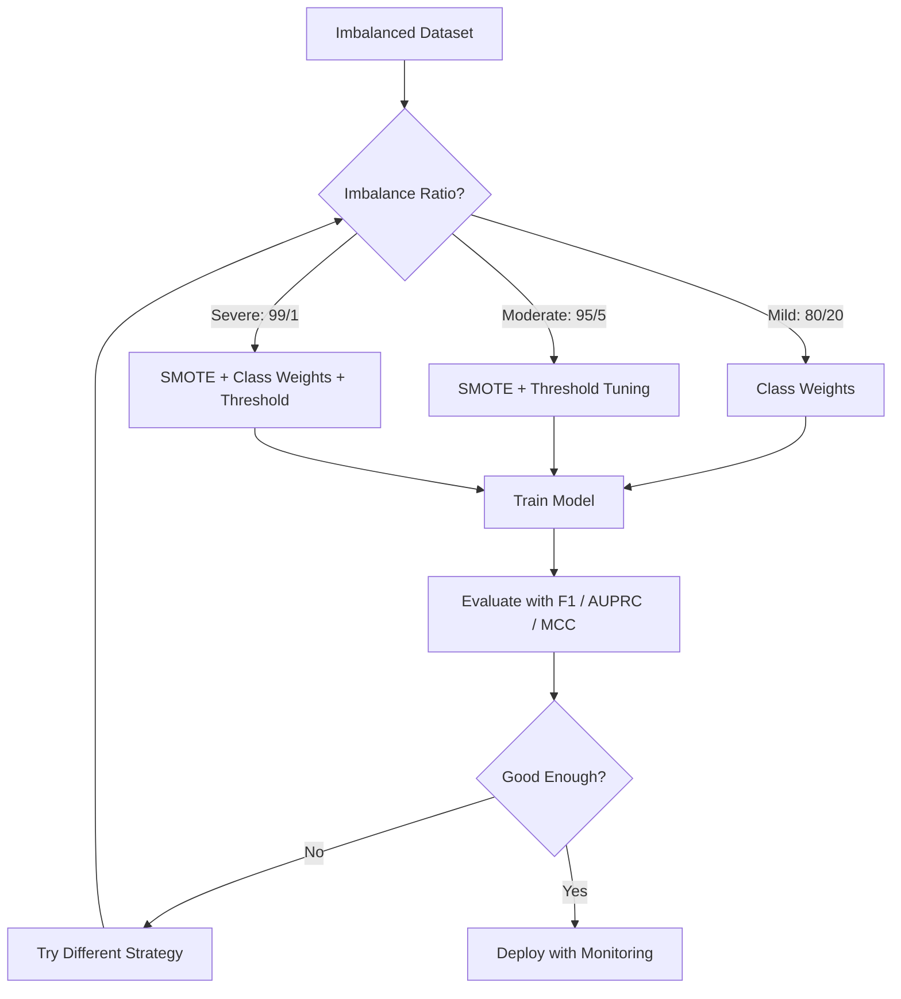
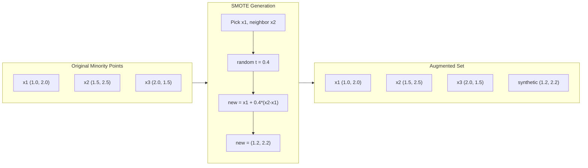
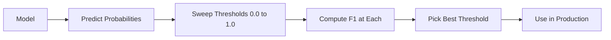
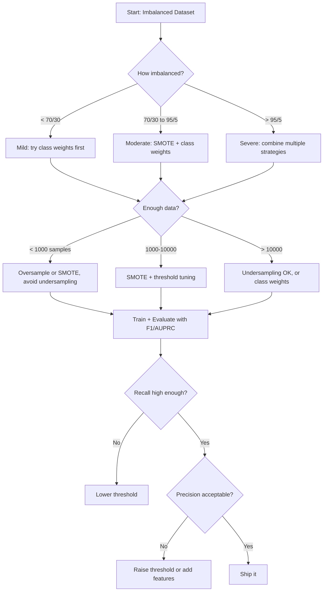

# 处理不平衡数据

> 当 99% 的数据都属于“正常”类别时，准确率就是一个谎言。

**Type:** 构建
**Language:** Python
**Prerequisites:** 第 2 阶段，第 01–09 课（尤其是评估指标）
**Time:** 约 90 分钟

## 学习目标

- 从零实现 SMOTE，并解释合成过采样与随机复制样本之间的区别
- 使用 F1、AUPRC 和 Matthews 相关系数，而不是准确率，来评估不平衡分类器
- 比较类别权重、阈值调优和重采样策略，并根据给定的不平衡比例选择合适方法
- 构建完整的不平衡数据流水线，把 SMOTE、类别权重和阈值优化结合起来

## 问题

你构建了一个欺诈检测模型，准确率达到 99.9%，于是开始庆祝。随后却发现，它把每一笔交易都预测成了“非欺诈”。

这并不是程序错误。当欺诈交易只占 0.1% 时，始终猜测多数类正是最符合整体错误最小化目标的做法。模型在技术上是正确的，在实际中却毫无用处。

只要分类问题真正关系到现实结果，这种情况就随处可见。疾病诊断的阳性率可能是 1%，网络入侵中攻击只占 0.01%，制造缺陷率为 0.5%，垃圾邮件占 20%，流失客户占 5%。少数类越重要，它往往就越稀少。

准确率之所以失效，是因为它平等对待每一次正确预测。正确识别一笔正常交易和正确抓住一次欺诈，在准确率中都只算一分。但抓住欺诈才是模型存在的全部意义。我们需要采用合适的指标、技术和训练策略，迫使模型关注稀少但重要的类别。

## 核心概念

### 准确率为何失效

考虑一个包含 1000 个样本的数据集，其中 990 个为负类，10 个为正类。某模型始终预测负类：

|  | 预测为正 | 预测为负 |
|--|---|---|
| 实际为正 | 0（TP） | 10（FN） |
| 实际为负 | 0（FP） | 990（TN） |

准确率 = (0 + 990) / 1000 = 99.0%

这个模型没有抓住任何欺诈、疾病或缺陷，准确率却显示为 99%。这正是不平衡问题中准确率十分危险的原因。

### 更合适的指标

**精确率** = TP / (TP + FP)。所有被标记为正类的样本中，有多少确实是正类？高精确率意味着误报很少。

**召回率** = TP / (TP + FN)。所有实际正类中，我们找到了多少？高召回率意味着漏掉的正类很少。

**F1 分数** = 2 * precision * recall / (precision + recall)。这是精确率与召回率的调和平均数；与算术平均数相比，它会更严厉地惩罚两者之间的极端失衡。

**F-beta 分数** = (1 + beta^2) * precision * recall / (beta^2 * precision + recall)。beta > 1 时，更重视召回率；beta < 1 时，更重视精确率。欺诈检测经常使用 F2，因为漏掉欺诈比产生误报更糟糕。

**AUPRC**（精确率—召回率曲线下面积）。它类似 AUC-ROC，但对不平衡数据更有信息量。随机分类器的 AUPRC 等于正类比例，并非 ROC 中的 0.5，因此模型取得的改进更容易看出来。

**Matthews 相关系数** = (TP * TN - FP * FN) / sqrt((TP+FP)(TP+FN)(TN+FP)(TN+FN))。取值范围为 -1 到 +1。只有当模型在两个类别上都表现良好时，它才会给出高分；即使两个类别规模相差很大，它依然保持平衡。

对于前面那个“始终预测负类”的模型：精确率 = 0/0，未定义，通常记为 0；召回率 = 0/10 = 0；F1 = 0；MCC = 0。这些指标正确揭示了该模型毫无价值。

### 不平衡数据流水线



### SMOTE：合成少数类过采样技术

随机过采样通过复制已有少数类样本来增加其数量。这种方法可以奏效，但模型会反复看到完全相同的数据点，因此存在过拟合风险。

SMOTE 会生成合理但并非简单副本的少数类合成样本。算法步骤如下：

1. 对每个少数类样本 x，在其他少数类样本中找出它的 k 个最近邻
2. 随机选择一个邻居
3. 在 x 与该邻居之间的线段上生成一个新样本

公式为：`new_sample = x + random(0, 1) * (neighbor - x)`

这种方法在真实少数类数据点之间进行插值，既能在特征空间的同一区域生成新样本，又不只是复制现有数据。



### 采样策略比较

**随机过采样：** 复制少数类样本，直到其数量与多数类相同。
- 优点：简单，不会丢失信息
- 缺点：完全相同的副本会造成过拟合，并增加训练时间

**随机欠采样：** 删除多数类样本，直到其数量与少数类相同。
- 优点：训练速度快，实现简单
- 缺点：会丢弃可能有用的多数类数据，导致更高方差

**SMOTE：** 通过插值生成少数类合成样本。
- 优点：生成新的数据点，与随机过采样相比更不易过拟合
- 缺点：可能在决策边界附近生成噪声样本，而且没有考虑多数类的分布

| 策略 | 数据变化 | 风险 | 适用场景 |
|----------|-------------|------|-------------|
| 过采样 | 复制少数类 | 过拟合 | 小型数据集、中度不平衡 |
| 欠采样 | 删除多数类 | 信息损失 | 大型数据集、希望快速训练 |
| SMOTE | 添加少数类合成样本 | 边界噪声 | 中度不平衡、少数类样本足够进行 k-NN |

### 类别权重

除了改变数据，还可以改变模型对错误的处理方式：误分类少数类时赋予更高权重。

对于包含 950 个负类样本和 50 个正类样本的二分类问题：
- 负类权重 = n_samples / (2 * n_negative) = 1000 / (2 * 950) = 0.526
- 正类权重 = n_samples / (2 * n_positive) = 1000 / (2 * 50) = 10.0

正类得到的权重是负类的 19 倍。误分类一个正类样本，与误分类 19 个负类样本的代价相同，模型因而不得不关注少数类。

在逻辑回归中，这会修改损失函数：

```
weighted_loss = -sum(w_i * [y_i * log(p_i) + (1-y_i) * log(1-p_i)])
```

其中，w_i 取决于样本 i 所属的类别。

从期望意义上说，类别权重在数学上等价于过采样，却不必创建新的数据点。因此，它速度更快，也避免了复制样本造成的过拟合风险。

### 阈值调优

大多数分类器都会输出概率。默认阈值为 0.5：如果 P(positive) >= 0.5，就预测为正类。但 0.5 只是一个任意选择。类别不平衡时，最佳阈值通常远低于 0.5。

具体过程如下：
1. 训练模型
2. 获取模型在验证集上的预测概率
3. 从 0.0 到 1.0 扫描阈值
4. 在每个阈值上计算 F1 或你选择的其他指标
5. 选取使该指标最大化的阈值



模型可能为一笔欺诈交易输出 P(fraud) = 0.15。使用 0.5 阈值时，它会被分类为非欺诈；改用 0.10 阈值后，就能正确捕捉。概率校准本身不如排序重要：只要欺诈交易得到的概率高于正常交易，就存在一个能够区分两者的阈值。

### 成本敏感学习

这是类别权重的推广。它不再使用统一成本，而是为不同误分类指定具体代价：

| | 预测为正 | 预测为负 |
|--|---|---|
| 实际为正 | 0（正确） | C_FN = 100 |
| 实际为负 | C_FP = 1 | 0（正确） |

漏掉一笔欺诈交易（FN）的成本是一次误报（FP）的 100 倍。模型优化的是总成本，而不是错误总数。

如果能够估算现实成本，这是理论上最严谨的方法。漏诊癌症与误报后多做一次活检的成本截然不同。明确表示这些成本，可以迫使模型作出正确的权衡。

### 决策流程图



```figure
class-imbalance
```

## 动手构建

### 第 1 步：生成不平衡数据集

```python
import numpy as np


def make_imbalanced_data(n_majority=950, n_minority=50, seed=42):
    rng = np.random.RandomState(seed)

    X_maj = rng.randn(n_majority, 2) * 1.0 + np.array([0.0, 0.0])
    X_min = rng.randn(n_minority, 2) * 0.8 + np.array([2.5, 2.5])

    X = np.vstack([X_maj, X_min])
    y = np.concatenate([np.zeros(n_majority), np.ones(n_minority)])

    shuffle_idx = rng.permutation(len(y))
    return X[shuffle_idx], y[shuffle_idx]
```

### 第 2 步：从零实现 SMOTE

```python
def euclidean_distance(a, b):
    return np.sqrt(np.sum((a - b) ** 2))


def find_k_neighbors(X, idx, k):
    distances = []
    for i in range(len(X)):
        if i == idx:
            continue
        d = euclidean_distance(X[idx], X[i])
        distances.append((i, d))
    distances.sort(key=lambda x: x[1])
    return [d[0] for d in distances[:k]]


def smote(X_minority, k=5, n_synthetic=100, seed=42):
    rng = np.random.RandomState(seed)
    n_samples = len(X_minority)
    k = min(k, n_samples - 1)
    synthetic = []

    for _ in range(n_synthetic):
        idx = rng.randint(0, n_samples)
        neighbors = find_k_neighbors(X_minority, idx, k)
        neighbor_idx = neighbors[rng.randint(0, len(neighbors))]
        t = rng.random()
        new_point = X_minority[idx] + t * (X_minority[neighbor_idx] - X_minority[idx])
        synthetic.append(new_point)

    return np.array(synthetic)
```

### 第 3 步：随机过采样与欠采样

```python
def random_oversample(X, y, seed=42):
    rng = np.random.RandomState(seed)
    classes, counts = np.unique(y, return_counts=True)
    max_count = counts.max()

    X_resampled = list(X)
    y_resampled = list(y)

    for cls, count in zip(classes, counts):
        if count < max_count:
            cls_indices = np.where(y == cls)[0]
            n_needed = max_count - count
            chosen = rng.choice(cls_indices, size=n_needed, replace=True)
            X_resampled.extend(X[chosen])
            y_resampled.extend(y[chosen])

    X_out = np.array(X_resampled)
    y_out = np.array(y_resampled)
    shuffle = rng.permutation(len(y_out))
    return X_out[shuffle], y_out[shuffle]


def random_undersample(X, y, seed=42):
    rng = np.random.RandomState(seed)
    classes, counts = np.unique(y, return_counts=True)
    min_count = counts.min()

    X_resampled = []
    y_resampled = []

    for cls in classes:
        cls_indices = np.where(y == cls)[0]
        chosen = rng.choice(cls_indices, size=min_count, replace=False)
        X_resampled.extend(X[chosen])
        y_resampled.extend(y[chosen])

    X_out = np.array(X_resampled)
    y_out = np.array(y_resampled)
    shuffle = rng.permutation(len(y_out))
    return X_out[shuffle], y_out[shuffle]
```

### 第 4 步：带类别权重的逻辑回归

```python
def sigmoid(z):
    return 1.0 / (1.0 + np.exp(-np.clip(z, -500, 500)))


def logistic_regression_weighted(X, y, weights, lr=0.01, epochs=200):
    n_samples, n_features = X.shape
    w = np.zeros(n_features)
    b = 0.0

    for _ in range(epochs):
        z = X @ w + b
        pred = sigmoid(z)
        error = pred - y
        weighted_error = error * weights

        gradient_w = (X.T @ weighted_error) / n_samples
        gradient_b = np.mean(weighted_error)

        w -= lr * gradient_w
        b -= lr * gradient_b

    return w, b


def compute_class_weights(y):
    classes, counts = np.unique(y, return_counts=True)
    n_samples = len(y)
    n_classes = len(classes)
    weight_map = {}
    for cls, count in zip(classes, counts):
        weight_map[cls] = n_samples / (n_classes * count)
    return np.array([weight_map[yi] for yi in y])
```

### 第 5 步：阈值调优

```python
def find_optimal_threshold(y_true, y_probs, metric="f1"):
    best_threshold = 0.5
    best_score = -1.0

    for threshold in np.arange(0.05, 0.96, 0.01):
        y_pred = (y_probs >= threshold).astype(int)
        tp = np.sum((y_pred == 1) & (y_true == 1))
        fp = np.sum((y_pred == 1) & (y_true == 0))
        fn = np.sum((y_pred == 0) & (y_true == 1))

        if metric == "f1":
            precision = tp / (tp + fp) if (tp + fp) > 0 else 0.0
            recall = tp / (tp + fn) if (tp + fn) > 0 else 0.0
            score = 2 * precision * recall / (precision + recall) if (precision + recall) > 0 else 0.0
        elif metric == "recall":
            score = tp / (tp + fn) if (tp + fn) > 0 else 0.0
        elif metric == "precision":
            score = tp / (tp + fp) if (tp + fp) > 0 else 0.0

        if score > best_score:
            best_score = score
            best_threshold = threshold

    return best_threshold, best_score
```

### 第 6 步：评估函数

```python
def confusion_matrix_values(y_true, y_pred):
    tp = np.sum((y_pred == 1) & (y_true == 1))
    tn = np.sum((y_pred == 0) & (y_true == 0))
    fp = np.sum((y_pred == 1) & (y_true == 0))
    fn = np.sum((y_pred == 0) & (y_true == 1))
    return tp, tn, fp, fn


def compute_metrics(y_true, y_pred):
    tp, tn, fp, fn = confusion_matrix_values(y_true, y_pred)
    accuracy = (tp + tn) / (tp + tn + fp + fn)
    precision = tp / (tp + fp) if (tp + fp) > 0 else 0.0
    recall = tp / (tp + fn) if (tp + fn) > 0 else 0.0
    f1 = 2 * precision * recall / (precision + recall) if (precision + recall) > 0 else 0.0

    denom = np.sqrt(float((tp + fp) * (tp + fn) * (tn + fp) * (tn + fn)))
    mcc = (tp * tn - fp * fn) / denom if denom > 0 else 0.0

    return {
        "accuracy": accuracy,
        "precision": precision,
        "recall": recall,
        "f1": f1,
        "mcc": mcc,
    }
```

### 第 7 步：比较所有方法

```python
X, y = make_imbalanced_data(950, 50, seed=42)
split = int(0.8 * len(y))
X_train, X_test = X[:split], X[split:]
y_train, y_test = y[:split], y[split:]

# Baseline: no treatment
w_base, b_base = logistic_regression_weighted(
    X_train, y_train, np.ones(len(y_train)), lr=0.1, epochs=300
)
probs_base = sigmoid(X_test @ w_base + b_base)
preds_base = (probs_base >= 0.5).astype(int)

# Oversampled
X_over, y_over = random_oversample(X_train, y_train)
w_over, b_over = logistic_regression_weighted(
    X_over, y_over, np.ones(len(y_over)), lr=0.1, epochs=300
)
preds_over = (sigmoid(X_test @ w_over + b_over) >= 0.5).astype(int)

# SMOTE
minority_mask = y_train == 1
X_minority = X_train[minority_mask]
synthetic = smote(X_minority, k=5, n_synthetic=len(y_train) - 2 * int(minority_mask.sum()))
X_smote = np.vstack([X_train, synthetic])
y_smote = np.concatenate([y_train, np.ones(len(synthetic))])
w_sm, b_sm = logistic_regression_weighted(
    X_smote, y_smote, np.ones(len(y_smote)), lr=0.1, epochs=300
)
preds_smote = (sigmoid(X_test @ w_sm + b_sm) >= 0.5).astype(int)

# Class weights
sample_weights = compute_class_weights(y_train)
w_cw, b_cw = logistic_regression_weighted(
    X_train, y_train, sample_weights, lr=0.1, epochs=300
)
probs_cw = sigmoid(X_test @ w_cw + b_cw)
preds_cw = (probs_cw >= 0.5).astype(int)

# Threshold tuning (tune on held-out validation set, not test set)
probs_val = sigmoid(X_val @ w_cw + b_cw)
best_thresh, best_f1 = find_optimal_threshold(y_val, probs_val, metric="f1")
preds_thresh = (probs_cw >= best_thresh).astype(int)
```

代码文件会在一个脚本中完成上述全部步骤并打印结果。

## 实际应用

使用 scikit-learn 和 imbalanced-learn 时，每种技术都只需一行代码：

```python
from sklearn.linear_model import LogisticRegression
from sklearn.metrics import classification_report, f1_score
from sklearn.model_selection import train_test_split
from imblearn.over_sampling import SMOTE
from imblearn.under_sampling import RandomUnderSampler
from imblearn.pipeline import Pipeline

X_train, X_test, y_train, y_test = train_test_split(X, y, stratify=y)

model_weighted = LogisticRegression(class_weight="balanced")
model_weighted.fit(X_train, y_train)
print(classification_report(y_test, model_weighted.predict(X_test)))

smote = SMOTE(random_state=42)
X_resampled, y_resampled = smote.fit_resample(X_train, y_train)
model_smote = LogisticRegression()
model_smote.fit(X_resampled, y_resampled)
print(classification_report(y_test, model_smote.predict(X_test)))

pipeline = Pipeline([
    ("smote", SMOTE()),
    ("model", LogisticRegression(class_weight="balanced")),
])
pipeline.fit(X_train, y_train)
print(classification_report(y_test, pipeline.predict(X_test)))
```

从零实现展示了每种技术究竟做了什么。SMOTE 只是在少数类上进行 k-NN 插值，类别权重就是把损失乘以相应系数，阈值调优则是用一个循环尝试不同截断点，并没有任何魔法。

## 交付成果

本课会产出：
- `outputs/skill-imbalanced-data.md`——处理不平衡分类问题的决策清单

## 练习

1. **Borderline-SMOTE：** 修改 SMOTE 实现，只为靠近决策边界的少数类点，也就是 k 个最近邻中包含多数类样本的点，生成合成样本。在类别存在重叠的数据集上，与标准 SMOTE 比较结果。

2. **成本矩阵优化：** 实现成本敏感学习，把成本矩阵作为参数。创建一个接收成本矩阵并返回最优预测的函数，使期望成本最小。使用不同成本比（1:10、1:100、1:1000）进行测试，并绘制精确率—召回率权衡如何变化。

3. **阈值校准：** 实现 Platt scaling，在模型的原始输出上拟合逻辑回归，以产生经过校准的概率。比较校准前后的精确率—召回率曲线。证明校准不会改变排序，因此 AUC 保持不变，但会让概率更有意义。

4. **平衡 Bagging 集成：** 训练多个模型，每个模型都使用一份平衡的 Bootstrap 样本，也就是全部少数类样本加上随机抽取的多数类子集。对它们的预测取平均，并与使用 SMOTE 的单个模型比较。衡量性能以及多次运行间的方差。

5. **不平衡比例实验：** 取一个平衡数据集，逐步增大不平衡比例（50/50、70/30、90/10、95/5、99/1）。对每种比例分别训练使用 SMOTE 和不使用 SMOTE 的模型，绘制两者的 F1 随不平衡比例变化的曲线。从哪个比例开始，SMOTE 带来了明显改善？

## 关键术语

| 术语 | 人们常说 | 实际含义 |
|------|----------------|----------------------|
| 类别不平衡 | “一个类别的样本多得多” | 数据集中的类别分布显著偏斜，导致模型偏向多数类 |
| SMOTE | “合成过采样” | 在已有少数类样本与其 k 个最近少数类邻居之间插值，生成新的少数类样本 |
| 类别权重 | “让稀有类别上的错误代价更高” | 用类别特定权重乘以损失函数，使模型对少数类误分类施加更重惩罚 |
| 阈值调优 | “移动决策边界” | 把分类概率截断点从默认 0.5 改为能够优化目标指标的值 |
| 精确率—召回率权衡 | “两者不可兼得” | 降低阈值会捕捉更多正类，提高召回率，但也会标记更多假阳性，降低精确率；反之亦然 |
| AUPRC | “PR 曲线下面积” | 把精确率—召回率曲线汇总为单个数值；类别严重不平衡时，它比 AUC-ROC 更有信息量 |
| Matthews 相关系数 | “平衡指标” | 预测标签与实际标签之间的相关系数，只有模型在两个类别上都表现良好时才会给出高分 |
| 成本敏感学习 | “不同错误具有不同代价” | 把现实中的误分类成本纳入训练目标，使模型优化总成本，而不是错误数量 |
| 随机过采样 | “复制少数类” | 重复少数类样本以平衡类别数量；实现简单，但存在对重复数据点过拟合的风险 |

## 延伸阅读

- [《SMOTE: Synthetic Minority Over-sampling Technique》（Chawla 等，2002）](https://arxiv.org/abs/1106.1813)——SMOTE 原始论文，至今仍是不平衡学习领域引用最多的工作
- [《Learning from Imbalanced Data》（He 与 Garcia，2009）](https://ieeexplore.ieee.org/document/5128907)——涵盖采样、成本敏感和算法方法的综合综述
- [imbalanced-learn 文档](https://imbalanced-learn.org/stable/)——提供 SMOTE 变体、欠采样策略和流水线集成的 Python 库
- [《The Precision-Recall Plot Is More Informative than the ROC Plot》（Saito 与 Rehmsmeier，2015）](https://journals.plos.org/plosone/article?id=10.1371/journal.pone.0118432)——解释在不平衡问题中何时以及为何应优先使用 PR 曲线，而不是 ROC 曲线
