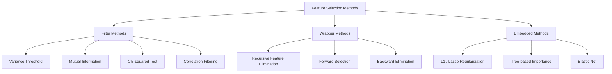
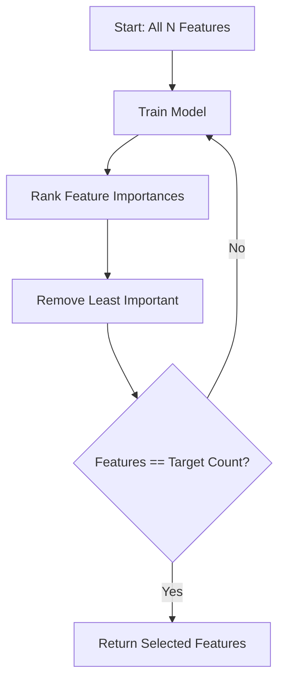
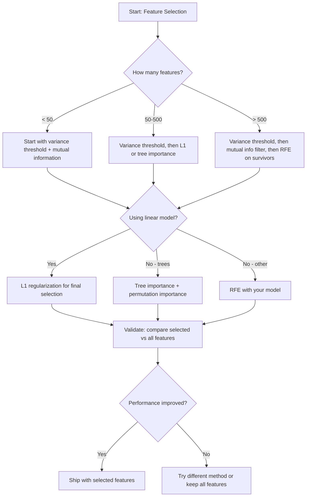

# 特征选择

> 特征并非越多越好，选对特征才更好。

**Type:** 构建
**Language:** Python
**Prerequisites:** 第 2 阶段，第 01–09 课、第 08 课（特征工程）
**Time:** 约 75 分钟

## 学习目标

- 从零实现过滤式方法（方差阈值、互信息、卡方检验）和包装式方法（RFE、前向选择）
- 解释互信息为何能捕捉相关系数无法发现的特征—目标非线性关系
- 比较 L1 正则化（嵌入式选择）与 RFE（包装式选择），并评估两者的计算成本权衡
- 构建组合多种方法的特征选择流水线，并证明它能改善模型在留出数据上的泛化能力

## 问题

你有 500 个特征。模型训练缓慢，不断过拟合，而且没有人能够解释它究竟学到了什么。你希望通过增加更多特征来改善性能，结果却变得更糟。

这正是维数灾难的表现。特征数量增长时，特征空间的体积会急剧膨胀，数据点变得稀疏，不同点之间的距离逐渐趋同。模型需要指数级增加的数据，才能发现真正的模式。噪声特征会淹没信号特征，过拟合反而成了默认结果。

特征选择就是解药：剥离噪声，移除冗余，只保留真正携带目标信息的特征。这样可以加快训练、改善泛化，并得到真正能够解释的模型。

目标并不是使用所有可用信息，而是使用正确的信息。

## 核心概念

### 特征选择的三大类别

所有特征选择方法都属于以下三类之一：



**过滤式方法**使用统计指标独立地为每个特征打分，不使用任何模型。速度快，但会遗漏特征之间的交互。

**包装式方法**通过训练模型来评估不同特征子集，以模型性能作为评分依据。通常效果更好，但需要反复训练模型，所以成本很高。

**嵌入式方法**在模型训练过程中完成特征选择。L1 正则化会把权重压到零，决策树会选择最有用的特征进行分裂。选择发生在拟合期间，而不是作为一个独立步骤。

### 方差阈值

这是最简单的过滤方法。如果某个特征在不同样本间几乎没有变化，它也就几乎不携带信息。

考虑一个在 1000 个样本中有 999 个取值都为 0.0 的特征，它的方差接近零。任何模型都无法用它区分类别，因此应该移除。

```
variance(x) = mean((x - mean(x))^2)
```

设置一个阈值，例如 0.01，删除方差低于阈值的所有特征。这个过程完全不查看目标变量，就能移除常量或近似常量特征。

适用场景：在其他方法之前作为预处理步骤。它几乎不增加成本，就能捕捉到明显无用的特征。

局限性：特征即使方差很高，也可能只是纯噪声。方差阈值很有必要，但仅靠它并不充分。

### 互信息

互信息衡量：知道特征 X 的取值后，目标 Y 的不确定性减少了多少。

```
I(X; Y) = sum_x sum_y p(x, y) * log(p(x, y) / (p(x) * p(y)))
```

如果 X 与 Y 相互独立，就有 p(x, y) = p(x) * p(y)，因此对数项为零，I(X; Y) = 0。X 能提供的 Y 信息越多，互信息就越高。

它相对于相关系数的关键优势是能够捕捉非线性关系。某个特征与目标的相关系数可能为零，但如果二者存在二次或周期关系，互信息仍然会很高。

对于连续特征，需要先离散化到多个分箱中，也就是基于直方图估计。分箱数量会影响估计结果：太少会丢失信息，太多则会引入噪声。常见选择是 sqrt(n) 个分箱，或者使用 Sturges 公式 1 + log2(n)。


### 递归特征消除（RFE）

RFE 是一种包装式方法，使用模型自身的特征重要性反复进行剪枝：

1. 使用全部特征训练模型
2. 根据重要性对特征排序，线性模型使用系数，树模型使用不纯度下降
3. 移除最不重要的一个或多个特征
4. 重复执行，直到只剩目标数量的特征



RFE 会考虑特征交互，因为模型会同时看到所有剩余特征。移除一个特征后，其他特征的重要性也会变化，因此它比过滤式方法更全面。

代价在于，需要把模型训练 N - target 次。如果一共有 500 个特征，目标是保留 10 个，就要训练 490 次。对于昂贵模型，这会非常缓慢。可以在每轮移除多个特征，例如删除排名最低的 10%，以提高速度。

### L1（Lasso）正则化

L1 正则化会把权重绝对值之和加入损失函数：

```
loss = prediction_error + alpha * sum(|w_i|)
```

alpha 参数控制特征剪枝的激进程度。alpha 越大，越多权重会被压到严格的零。

为什么会恰好为零？L1 惩罚会在权重空间中形成菱形约束区域。最优解往往落在这个菱形的角上，而角点意味着一个或多个权重为零。L2 正则化（Ridge）则形成圆形约束，权重会缩小，却很少真正变成零。

这就是嵌入式特征选择：模型在训练过程中学会应该忽略哪些特征。权重为零的特征实际上已经被移除。

优点：只需训练一次；能处理相关特征，通常会选择其中一个并把其余特征归零；大多数线性模型实现都内置支持。

局限性：只适用于线性模型，无法捕捉非线性的特征重要性。

### 基于树的特征重要性

决策树及其集成模型，例如随机森林和梯度提升，天然可以为特征排序。每次分裂都会降低不纯度：分类使用 Gini 或熵，回归使用方差。产生更大不纯度下降的特征更加重要。

对于包含 T 棵树的随机森林：

```
importance(feature_j) = (1/T) * sum over all trees of
    sum over all nodes splitting on feature_j of
        (n_samples * impurity_decrease)
```

这样可以得到每个特征归一化后的重要性分数，并且自动处理非线性关系和特征交互。

需要注意：基于树的重要性会偏向拥有较多不同取值，也就是高基数的特征。随机 ID 列可能显得很重要，因为它可以完美切分每个样本。应使用排列重要性进行合理性检查。

### 排列重要性

这是一种不依赖具体模型的方法：

1. 训练模型并记录其在验证数据上的基线性能
2. 逐个特征随机打乱其取值，再衡量性能下降幅度
3. 性能下降越大，该特征就越重要

如果打乱某个特征没有损害性能，说明模型不依赖它；如果性能崩溃，该特征就是关键特征。

排列重要性避免了基于树的重要性对基数的偏好。但它速度较慢：每个特征都需要进行一次完整评估，而且通常要重复多次，结果才足够稳定。

### 方法比较

| 方法 | 类型 | 速度 | 非线性 | 特征交互 |
|--------|------|-------|-----------|---------------------|
| 方差阈值 | 过滤式 | 非常快 | 不支持 | 不支持 |
| 互信息 | 过滤式 | 快 | 支持 | 不支持 |
| 相关性过滤 | 过滤式 | 快 | 不支持 | 不支持 |
| RFE | 包装式 | 慢 | 取决于模型 | 支持 |
| L1 / Lasso | 嵌入式 | 快 | 不支持（线性） | 不支持 |
| 树重要性 | 嵌入式 | 中等 | 支持 | 支持 |
| 排列重要性 | 模型无关 | 慢 | 支持 | 支持 |

### 决策流程图



```figure
f3-feature-prune
```

## 动手构建

### 第 1 步：生成具有已知特征结构的合成数据

```python
import numpy as np


def make_feature_selection_data(n_samples=500, seed=42):
    rng = np.random.RandomState(seed)

    x1 = rng.randn(n_samples)
    x2 = rng.randn(n_samples)
    x3 = rng.randn(n_samples)
    x4 = x1 + 0.1 * rng.randn(n_samples)
    x5 = x2 + 0.1 * rng.randn(n_samples)

    informative = np.column_stack([x1, x2, x3, x4, x5])

    correlated = np.column_stack([
        x1 * 0.9 + 0.1 * rng.randn(n_samples),
        x2 * 0.8 + 0.2 * rng.randn(n_samples),
        x3 * 0.7 + 0.3 * rng.randn(n_samples),
        x1 * 0.5 + x2 * 0.5 + 0.1 * rng.randn(n_samples),
        x2 * 0.6 + x3 * 0.4 + 0.1 * rng.randn(n_samples),
    ])

    noise = rng.randn(n_samples, 10) * 0.5

    X = np.hstack([informative, correlated, noise])
    y = (2 * x1 - 1.5 * x2 + x3 + 0.5 * rng.randn(n_samples) > 0).astype(int)

    feature_names = (
        [f"info_{i}" for i in range(5)]
        + [f"corr_{i}" for i in range(5)]
        + [f"noise_{i}" for i in range(10)]
    )

    return X, y, feature_names
```

我们知道这里的真实情况：特征 0–4 含有信息，其中 3 和 4 分别是 0 和 1 的相关副本；特征 5–9 与信息特征相关；特征 10–19 是纯噪声。良好的选择方法应该把 0–4 排在最前，把 10–19 排在最后。

### 第 2 步：方差阈值

```python
def variance_threshold(X, threshold=0.01):
    variances = np.var(X, axis=0)
    mask = variances > threshold
    return mask, variances
```

### 第 3 步：互信息（离散型）

```python
def discretize(x, n_bins=10):
    min_val, max_val = x.min(), x.max()
    if max_val == min_val:
        return np.zeros_like(x, dtype=int)
    bin_edges = np.linspace(min_val, max_val, n_bins + 1)
    binned = np.digitize(x, bin_edges[1:-1])
    return binned


def mutual_information(X, y, n_bins=10):
    n_samples, n_features = X.shape
    mi_scores = np.zeros(n_features)

    y_vals, y_counts = np.unique(y, return_counts=True)
    p_y = y_counts / n_samples

    for f in range(n_features):
        x_binned = discretize(X[:, f], n_bins)
        x_vals, x_counts = np.unique(x_binned, return_counts=True)
        p_x = dict(zip(x_vals, x_counts / n_samples))

        mi = 0.0
        for xv in x_vals:
            for yi, yv in enumerate(y_vals):
                joint_mask = (x_binned == xv) & (y == yv)
                p_xy = np.sum(joint_mask) / n_samples
                if p_xy > 0:
                    mi += p_xy * np.log(p_xy / (p_x[xv] * p_y[yi]))
        mi_scores[f] = mi

    return mi_scores
```

### 第 4 步：递归特征消除

```python
def simple_logistic_importance(X, y, lr=0.1, epochs=100):
    n_samples, n_features = X.shape
    w = np.zeros(n_features)
    b = 0.0

    for _ in range(epochs):
        z = X @ w + b
        pred = 1.0 / (1.0 + np.exp(-np.clip(z, -500, 500)))
        error = pred - y
        w -= lr * (X.T @ error) / n_samples
        b -= lr * np.mean(error)

    return w, b


def rfe(X, y, n_features_to_select=5, lr=0.1, epochs=100):
    n_total = X.shape[1]
    remaining = list(range(n_total))
    rankings = np.ones(n_total, dtype=int)
    rank = n_total

    while len(remaining) > n_features_to_select:
        X_subset = X[:, remaining]
        w, _ = simple_logistic_importance(X_subset, y, lr, epochs)
        importances = np.abs(w)

        least_idx = np.argmin(importances)
        original_idx = remaining[least_idx]
        rankings[original_idx] = rank
        rank -= 1
        remaining.pop(least_idx)

    for idx in remaining:
        rankings[idx] = 1

    selected_mask = rankings == 1
    return selected_mask, rankings
```

### 第 5 步：L1 特征选择

```python
def soft_threshold(w, alpha):
    return np.sign(w) * np.maximum(np.abs(w) - alpha, 0)


def l1_feature_selection(X, y, alpha=0.1, lr=0.01, epochs=500):
    n_samples, n_features = X.shape
    w = np.zeros(n_features)
    b = 0.0

    for _ in range(epochs):
        z = X @ w + b
        pred = 1.0 / (1.0 + np.exp(-np.clip(z, -500, 500)))
        error = pred - y

        gradient_w = (X.T @ error) / n_samples
        gradient_b = np.mean(error)

        w -= lr * gradient_w
        w = soft_threshold(w, lr * alpha)
        b -= lr * gradient_b

    selected_mask = np.abs(w) > 1e-6
    return selected_mask, w
```

### 第 6 步：基于树的重要性（简单决策树）

```python
def gini_impurity(y):
    if len(y) == 0:
        return 0.0
    classes, counts = np.unique(y, return_counts=True)
    probs = counts / len(y)
    return 1.0 - np.sum(probs ** 2)


def best_split(X, y, feature_idx):
    values = np.unique(X[:, feature_idx])
    if len(values) <= 1:
        return None, -1.0

    best_threshold = None
    best_gain = -1.0
    parent_gini = gini_impurity(y)
    n = len(y)

    for i in range(len(values) - 1):
        threshold = (values[i] + values[i + 1]) / 2.0
        left_mask = X[:, feature_idx] <= threshold
        right_mask = ~left_mask

        n_left = np.sum(left_mask)
        n_right = np.sum(right_mask)

        if n_left == 0 or n_right == 0:
            continue

        gain = parent_gini - (n_left / n) * gini_impurity(y[left_mask]) - (n_right / n) * gini_impurity(y[right_mask])

        if gain > best_gain:
            best_gain = gain
            best_threshold = threshold

    return best_threshold, best_gain


def tree_importance(X, y, n_trees=50, max_depth=5, seed=42):
    rng = np.random.RandomState(seed)
    n_samples, n_features = X.shape
    importances = np.zeros(n_features)

    for _ in range(n_trees):
        sample_idx = rng.choice(n_samples, size=n_samples, replace=True)
        feature_subset = rng.choice(n_features, size=max(1, int(np.sqrt(n_features))), replace=False)

        X_boot = X[sample_idx]
        y_boot = y[sample_idx]

        tree_imp = _build_tree_importance(X_boot, y_boot, feature_subset, max_depth)
        importances += tree_imp

    total = importances.sum()
    if total > 0:
        importances /= total

    return importances


def _build_tree_importance(X, y, feature_subset, max_depth, depth=0):
    n_features = X.shape[1]
    importances = np.zeros(n_features)

    if depth >= max_depth or len(np.unique(y)) <= 1 or len(y) < 4:
        return importances

    best_feature = None
    best_threshold = None
    best_gain = -1.0

    for f in feature_subset:
        threshold, gain = best_split(X, y, f)
        if gain > best_gain:
            best_gain = gain
            best_feature = f
            best_threshold = threshold

    if best_feature is None or best_gain <= 0:
        return importances

    importances[best_feature] += best_gain * len(y)

    left_mask = X[:, best_feature] <= best_threshold
    right_mask = ~left_mask

    importances += _build_tree_importance(X[left_mask], y[left_mask], feature_subset, max_depth, depth + 1)
    importances += _build_tree_importance(X[right_mask], y[right_mask], feature_subset, max_depth, depth + 1)

    return importances
```

### 第 7 步：运行并比较全部方法

代码文件会在同一个合成数据集上运行全部五种方法，并打印比较表，展示每种方法选择了哪些特征。

## 实际应用

使用 scikit-learn 时，可以把特征选择直接集成进流水线：

```python
from sklearn.feature_selection import (
    VarianceThreshold,
    mutual_info_classif,
    RFE,
    SelectFromModel,
)
from sklearn.linear_model import Lasso, LogisticRegression
from sklearn.ensemble import RandomForestClassifier

vt = VarianceThreshold(threshold=0.01)
X_filtered = vt.fit_transform(X)

mi_scores = mutual_info_classif(X, y)
top_k = np.argsort(mi_scores)[-10:]

rfe_selector = RFE(LogisticRegression(), n_features_to_select=10)
rfe_selector.fit(X, y)
X_rfe = rfe_selector.transform(X)

lasso_selector = SelectFromModel(Lasso(alpha=0.01))
lasso_selector.fit(X, y)
X_lasso = lasso_selector.transform(X)

rf = RandomForestClassifier(n_estimators=100)
rf.fit(X, y)
importances = rf.feature_importances_
```

从零实现展示了每种方法内部究竟发生了什么。方差阈值只是在计算 `var(X, axis=0)` 后应用掩码；互信息是在列联表中统计联合频率和边缘频率；RFE 是不断训练、排序和剪枝的循环；L1 是加入软阈值步骤的梯度下降；树重要性则是在各次分裂中累加不纯度下降。它们没有任何魔法，只有统计计算和循环。

sklearn 版本则进一步提供了稳健性，例如 mutual_info_classif 使用 k-NN 密度估计，而不是分箱；还通过 C 实现提高速度，并支持流水线集成。

## 交付成果

本课会产出：
- `outputs/skill-feature-selector.md`——用于选择合适特征选择方法的快速决策树

## 练习

1. **前向选择：** 实现与 RFE 相反的方法。从零个特征开始，每一步加入最能改善模型性能的特征；当继续加入特征不再有帮助时停止。把选出的特征与 RFE 结果比较。哪种方法更快？哪种效果更好？

2. **稳定性选择：** 运行 L1 特征选择 50 次，每次随机抽取 80% 的数据，并略微改变 alpha。统计每个特征被选中的次数。超过 80% 运行都选中的特征可视为“稳定”特征。将它们与单次 L1 选择结果比较，哪一种更可靠？

3. **检测多重共线性：** 计算全部特征的相关矩阵。实现一个函数，接收相关性阈值，例如 0.9，并从每一对高度相关特征中移除一个，保留与目标互信息更高的那个。在合成数据集上测试，验证它能移除冗余的相关特征。

4. **特征选择流水线：** 把方差阈值、互信息过滤和 RFE 串联为一条流水线。先移除方差接近零的特征，再按互信息保留前 50%，最后对剩余特征运行 RFE。把这条流水线与直接在全部特征上运行 RFE 比较。流水线是否更快？准确率是否相当？

5. **从零实现排列重要性：** 对每个特征分别随机打乱 10 次，测量 F1 分数的平均下降幅度。把得到的排序与基于树的重要性比较，找出两者意见不一致的情况并解释原因。提示：考虑相关特征。

## 关键术语

| 术语 | 人们常说 | 实际含义 |
|------|----------------|----------------------|
| 过滤式方法 | “独立为特征打分” | 不训练模型，而是通过统计指标对每个特征单独评分并排序的特征选择方法 |
| 包装式方法 | “用模型选择特征” | 通过训练模型并以其性能为选择标准，评估不同特征子集的特征选择方法 |
| 嵌入式方法 | “模型在训练时选择特征” | 在模型拟合过程中完成的特征选择，例如 L1 正则化把权重压到零 |
| 互信息 | “一个变量能告诉你多少另一个变量的信息” | 已知 X 后 Y 的不确定性减少程度，既能捕捉线性依赖，也能捕捉非线性依赖 |
| 递归特征消除 | “训练、排序、剪枝、重复” | 反复训练模型并移除最不重要特征，直到达到目标数量的迭代式包装方法 |
| L1 / Lasso 正则化 | “消灭特征的惩罚” | 把权重绝对值之和加入损失函数，使不重要特征的权重严格归零 |
| 方差阈值 | “移除常量特征” | 删除样本间方差低于指定阈值的特征，过滤不携带信息的特征 |
| 特征重要性 | “哪些特征最重要” | 衡量每个特征对模型预测贡献大小的分数；树模型依据分裂增益，线性模型依据系数绝对值计算 |
| 排列重要性 | “打乱后看看损害多大” | 随机打乱每个特征的取值，再根据模型性能下降幅度评估该特征的重要性 |
| 维数灾难 | “特征太多，数据不够” | 特征增加时，特征空间体积呈指数增长，导致数据稀疏、距离失去意义的现象 |

## 延伸阅读

- [《An Introduction to Variable and Feature Selection》（Guyon 与 Elisseeff，2003）](https://jmlr.org/papers/v3/guyon03a.html)——特征选择方法的奠基综述，至今仍被广泛引用
- [scikit-learn 特征选择指南](https://scikit-learn.org/stable/modules/feature_selection.html)——包含过滤式、包装式和嵌入式方法及代码示例的实用参考
- [《Stability Selection》（Meinshausen 与 Buhlmann，2010）](https://arxiv.org/abs/0809.2932)——把子采样与特征选择结合起来，以获得稳健、可复现的结果
- [《Beware Default Random Forest Importances》（Strobl 等，2007）](https://bmcbioinformatics.biomedcentral.com/articles/10.1186/1471-2105-8-25)——展示基于树的重要性对基数的偏好，并提出条件重要性作为替代方案
