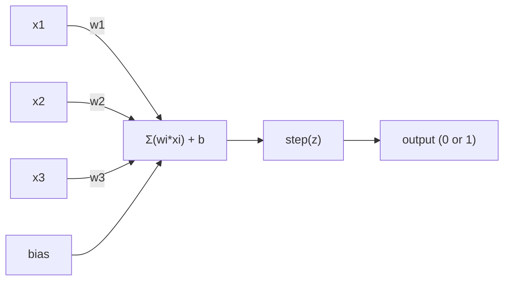
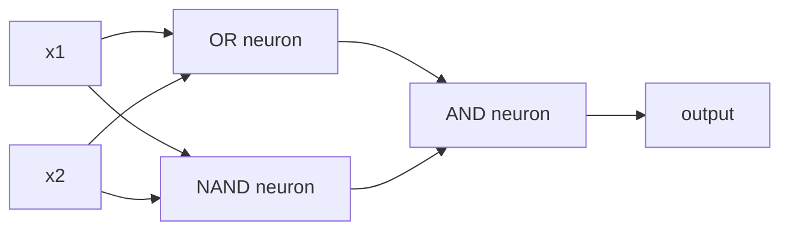

# 感知机

> 感知机是神经网络的原子。把它拆开来看，里面只有权重、偏置和一次决策。

**Type:** 构建
**Languages:** Python
**Prerequisites:** 第 1 阶段（线性代数直觉）
**Time:** 约 60 分钟

## 学习目标

- 使用 Python 从零实现感知机，包括权重更新规则和阶跃激活函数
- 解释单个感知机为何只能解决线性可分问题，并演示它在 XOR 问题上的失败
- 组合 OR、NAND 和 AND 门，构建能够解决 XOR 的多层感知机
- 使用 Sigmoid 激活和反向传播训练双层网络，使其自动学会 XOR

## 问题

你已经理解向量与点积，也知道矩阵可以把输入转换成输出。但机器究竟如何*学会*应该使用哪种变换？

感知机回答了这个问题。它是最简单的学习机器：接收若干输入，分别乘以权重，加上偏置，再作出一个二元决策，然后调整参数。仅此而已。所有神经网络，都是把这一思想逐层堆叠起来的结果。

理解感知机，也就理解了“学习”在代码中的实际含义：不断调整数值，直到输出与现实相符。

## 核心概念

### 一个神经元，一次决策

感知机接收 n 个输入，将每个输入乘以对应权重，再把结果相加并加上偏置，最后交给激活函数。



阶跃函数的规则非常直接：如果加权和与偏置之和 >= 0，就输出 1；否则输出 0。

```
step(z) = 1  if z >= 0
           0  if z < 0
```

这就是一个线性分类器。权重与偏置共同定义一条直线，在更高维空间中则是一个超平面，把输入空间分成两个区域。

### 决策边界

当输入只有两个时，感知机会在二维空间中画出一条直线：

```
  x2
  ┤
  │  Class 1        /
  │    (0)          /
  │                /
  │               / w1·x1 + w2·x2 + b = 0
  │              /
  │             /     Class 2
  │            /        (1)
  ┼───────────/──────────── x1
```

直线一侧的所有输入都输出 0，另一侧则输出 1。训练过程会不断移动这条直线，直到它能够正确分开两个类别。

### 学习规则

感知机的学习规则很简单：

```
For each training example (x, y_true):
    y_pred = predict(x)
    error = y_true - y_pred

    For each weight:
        w_i = w_i + learning_rate * error * x_i
    bias = bias + learning_rate * error
```

如果预测正确，error = 0，任何参数都不会变化。如果模型预测为 0、实际却应为 1，权重就会增大；如果预测为 1、实际却应为 0，权重就会减小。学习率控制每次调整的幅度。

### XOR 问题

感知机的局限会在这里显现。观察以下逻辑门：

```
AND gate:           OR gate:            XOR gate:
x1  x2  out         x1  x2  out         x1  x2  out
0   0   0           0   0   0           0   0   0
0   1   0           0   1   1           0   1   1
1   0   0           1   0   1           1   0   1
1   1   1           1   1   1           1   1   0
```

AND 和 OR 都是线性可分的：只需画一条直线，就能把输出为 0 和输出为 1 的点分开。XOR 并非线性可分，因为没有任何一条直线能够把 [0,1]、[1,0] 与 [0,0]、[1,1] 分开。

```
AND (separable):        XOR (not separable):

  x2                      x2
  1 ┤  0     1            1 ┤  1     0
    │     /                 │
  0 ┤  0 / 0              0 ┤  0     1
    ┼──/──────── x1         ┼──────────── x1
       line works!          no single line works!
```

这是一个根本限制：单个感知机只能解决线性可分问题。Minsky 与 Papert 在 1969 年证明了这一点，也使神经网络研究一度沉寂了近十年。

解决方法是把感知机堆叠成多层。多层感知机可以把两个线性决策组合成一个非线性决策，从而解决 XOR。

```figure
perceptron-boundary
```

## 动手构建

### 第 1 步：Perceptron 类

```python
class Perceptron:
    def __init__(self, n_inputs, learning_rate=0.1):
        self.weights = [0.0] * n_inputs
        self.bias = 0.0
        self.lr = learning_rate

    def predict(self, inputs):
        total = sum(w * x for w, x in zip(self.weights, inputs))
        total += self.bias
        return 1 if total >= 0 else 0

    def train(self, training_data, epochs=100):
        for epoch in range(epochs):
            errors = 0
            for inputs, target in training_data:
                prediction = self.predict(inputs)
                error = target - prediction
                if error != 0:
                    errors += 1
                    for i in range(len(self.weights)):
                        self.weights[i] += self.lr * error * inputs[i]
                    self.bias += self.lr * error
            if errors == 0:
                print(f"Converged at epoch {epoch + 1}")
                return
        print(f"Did not converge after {epochs} epochs")
```

### 第 2 步：在逻辑门上训练

```python
and_data = [
    ([0, 0], 0),
    ([0, 1], 0),
    ([1, 0], 0),
    ([1, 1], 1),
]

or_data = [
    ([0, 0], 0),
    ([0, 1], 1),
    ([1, 0], 1),
    ([1, 1], 1),
]

not_data = [
    ([0], 1),
    ([1], 0),
]

print("=== AND Gate ===")
p_and = Perceptron(2)
p_and.train(and_data)
for inputs, _ in and_data:
    print(f"  {inputs} -> {p_and.predict(inputs)}")

print("\n=== OR Gate ===")
p_or = Perceptron(2)
p_or.train(or_data)
for inputs, _ in or_data:
    print(f"  {inputs} -> {p_or.predict(inputs)}")

print("\n=== NOT Gate ===")
p_not = Perceptron(1)
p_not.train(not_data)
for inputs, _ in not_data:
    print(f"  {inputs} -> {p_not.predict(inputs)}")
```

### 第 3 步：观察 XOR 失败

```python
xor_data = [
    ([0, 0], 0),
    ([0, 1], 1),
    ([1, 0], 1),
    ([1, 1], 0),
]

print("\n=== XOR Gate (single perceptron) ===")
p_xor = Perceptron(2)
p_xor.train(xor_data, epochs=1000)
for inputs, expected in xor_data:
    result = p_xor.predict(inputs)
    status = "OK" if result == expected else "WRONG"
    print(f"  {inputs} -> {result} (expected {expected}) {status}")
```

它永远不会收敛。这就是单个感知机无法学习 XOR 的直接证明。

### 第 4 步：使用双层结构解决 XOR

诀窍在于：XOR = (x1 OR x2) AND NOT (x1 AND x2)。把三个感知机组合起来：



```python
def xor_network(x1, x2):
    or_neuron = Perceptron(2)
    or_neuron.weights = [1.0, 1.0]
    or_neuron.bias = -0.5

    nand_neuron = Perceptron(2)
    nand_neuron.weights = [-1.0, -1.0]
    nand_neuron.bias = 1.5

    and_neuron = Perceptron(2)
    and_neuron.weights = [1.0, 1.0]
    and_neuron.bias = -1.5

    hidden1 = or_neuron.predict([x1, x2])
    hidden2 = nand_neuron.predict([x1, x2])
    output = and_neuron.predict([hidden1, hidden2])
    return output


print("\n=== XOR Gate (multi-layer network) ===")
for inputs, expected in xor_data:
    result = xor_network(inputs[0], inputs[1])
    print(f"  {inputs} -> {result} (expected {expected})")
```

四种情况全部正确。把感知机堆叠成多层后，就能构造单个感知机无法产生的决策边界。

### 第 5 步：训练双层网络

第 4 步由我们手动设置了权重。这对 XOR 有效，但现实问题中，我们并不预先知道正确权重。解决方法是用 Sigmoid 取代阶跃函数，并通过反向传播自动学习权重。

```python
class TwoLayerNetwork:
    def __init__(self, learning_rate=0.5):
        import random
        random.seed(0)
        self.w_hidden = [[random.uniform(-1, 1), random.uniform(-1, 1)] for _ in range(2)]
        self.b_hidden = [random.uniform(-1, 1), random.uniform(-1, 1)]
        self.w_output = [random.uniform(-1, 1), random.uniform(-1, 1)]
        self.b_output = random.uniform(-1, 1)
        self.lr = learning_rate

    def sigmoid(self, x):
        import math
        x = max(-500, min(500, x))
        return 1.0 / (1.0 + math.exp(-x))

    def forward(self, inputs):
        self.inputs = inputs
        self.hidden_outputs = []
        for i in range(2):
            z = sum(w * x for w, x in zip(self.w_hidden[i], inputs)) + self.b_hidden[i]
            self.hidden_outputs.append(self.sigmoid(z))
        z_out = sum(w * h for w, h in zip(self.w_output, self.hidden_outputs)) + self.b_output
        self.output = self.sigmoid(z_out)
        return self.output

    def train(self, training_data, epochs=10000):
        for epoch in range(epochs):
            total_error = 0
            for inputs, target in training_data:
                output = self.forward(inputs)
                error = target - output
                total_error += error ** 2

                d_output = error * output * (1 - output)

                saved_w_output = self.w_output[:]
                hidden_deltas = []
                for i in range(2):
                    h = self.hidden_outputs[i]
                    hd = d_output * saved_w_output[i] * h * (1 - h)
                    hidden_deltas.append(hd)

                for i in range(2):
                    self.w_output[i] += self.lr * d_output * self.hidden_outputs[i]
                self.b_output += self.lr * d_output

                for i in range(2):
                    for j in range(len(inputs)):
                        self.w_hidden[i][j] += self.lr * hidden_deltas[i] * inputs[j]
                    self.b_hidden[i] += self.lr * hidden_deltas[i]
```

```python
net = TwoLayerNetwork(learning_rate=2.0)
net.train(xor_data, epochs=10000)
for inputs, expected in xor_data:
    result = net.forward(inputs)
    predicted = 1 if result >= 0.5 else 0
    print(f"  {inputs} -> {result:.4f} (rounded: {predicted}, expected {expected})")
```

与第 4 步相比，这里有两个关键区别。第一，Sigmoid 取代了阶跃函数；它是平滑函数，因此存在梯度。第二，`train` 方法会把误差从输出层反向传到隐藏层，并根据每个权重对误差的贡献程度调整它。这就是用 20 行代码实现的反向传播。

这也搭起了通往第 03 课的桥梁。`d_output` 和 `hidden_deltas` 背后的数学原理，就是把链式法则应用到网络计算图。第 03 课会对它进行完整推导。

## 实际应用

刚才从零构建的全部内容，在库中只需一次导入：

```python
from sklearn.linear_model import Perceptron as SkPerceptron
import numpy as np

X = np.array([[0,0],[0,1],[1,0],[1,1]])
y = np.array([0, 0, 0, 1])

clf = SkPerceptron(max_iter=100, tol=1e-3)
clf.fit(X, y)
print([clf.predict([x])[0] for x in X])
```

只需要五行。你编写的 30 行 `Perceptron` 类完成的是同一件事。sklearn 版本额外提供收敛检查、多种损失函数和稀疏输入支持，但核心循环完全相同：计算加权和，应用阶跃函数，再根据误差更新权重。

真正的差距会在网络规模扩大后显现。生产级网络发生的变化包括：

- 阶跃函数被 Sigmoid、ReLU 或其他平滑激活函数取代
- 权重通过反向传播自动学习（第 03 课）
- 网络不断加深：3 层、10 层，甚至 100 多层
- 基本原则保持不变：每一层都根据上一层的输出创建新特征

单个感知机只能画直线；把它们堆叠起来，就可以画出任意形状。

## 交付成果

本课会产出：
- `outputs/skill-perceptron.md`——说明何时需要单层架构、何时需要多层架构的技能

## 练习

1. 在 NAND 门（通用门，任何逻辑电路都可以只用 NAND 构建）上训练感知机。验证它的权重和偏置能够形成有效的决策边界。
2. 修改 Perceptron 类，在每个 epoch 记录决策边界 w1*x1 + w2*x2 + b = 0。打印它在 AND 门训练期间如何移动。
3. 构建一个三输入感知机：只有当三个输入中至少两个为 1 时才输出 1，也就是多数投票函数。这个问题线性可分吗？为什么？

## 关键术语

| 术语 | 人们常说 | 实际含义 |
|------|----------------|----------------------|
| 感知机 | “人造神经元” | 一种线性分类器：输入与权重的点积加上偏置，再经过阶跃函数 |
| 权重 | “一个输入有多重要” | 缩放每个输入对决策贡献大小的乘数 |
| 偏置 | “阈值” | 移动决策边界的常数，使感知机即使在输入全为零时也能激活 |
| 激活函数 | “压缩数值的东西” | 应用于加权和之后的函数；感知机使用阶跃函数，现代网络使用 Sigmoid 或 ReLU |
| 线性可分 | “可以在中间画一条线” | 能够使用单个超平面完美分开不同类别的数据集 |
| XOR 问题 | “感知机做不到的问题” | 单层网络无法学习非线性可分函数的证明 |
| 决策边界 | “分类器切换类别的位置” | 把输入空间分成两个类别的超平面 w*x + b = 0 |
| 多层感知机 | “真正的神经网络” | 多个感知机逐层堆叠，每一层的输出作为下一层的输入 |

## 延伸阅读

- Frank Rosenblatt，《The Perceptron: A Probabilistic Model for Information Storage and Organization in the Brain》（1958）——开启这一领域的原始论文
- Minsky 与 Papert，《Perceptrons》（1969）——证明单层网络无法解决 XOR，并令感知机研究沉寂近十年的著作
- Michael Nielsen，《Neural Networks and Deep Learning》第 1 章（http://neuralnetworksanddeeplearning.com/）——免费在线资料，对感知机如何组合成网络提供了极佳的可视化解释
