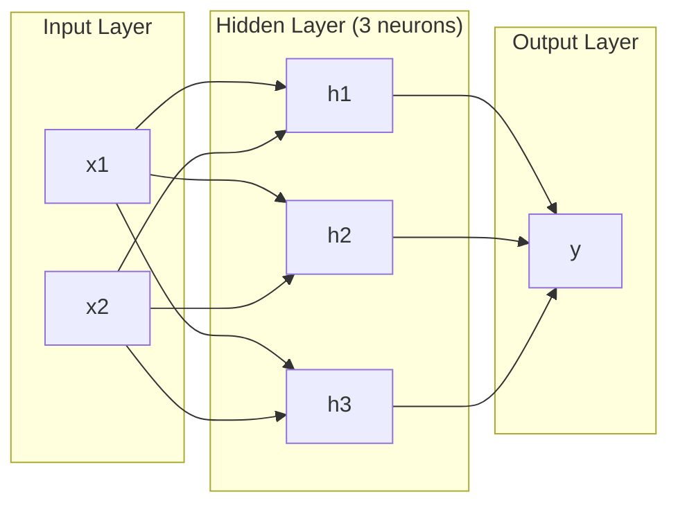
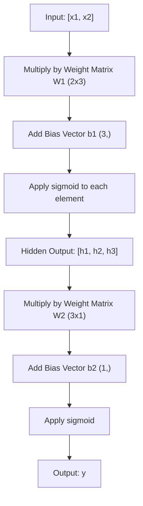
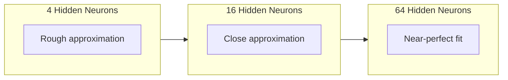

# 多层网络与前向传播

> 一个神经元只能画出一条直线。把它们堆叠起来，就能画出任何形状。

**Type:** 构建
**Languages:** Python
**Prerequisites:** 第 01 阶段（数学基础）、第 03.01 课（感知机）
**Time:** 约 90 分钟

## 学习目标

- 使用 Layer 和 Network 类从零构建多层网络，完成完整的前向传播
- 追踪数据经过网络各层时的矩阵维度，并识别形状不匹配问题
- 解释堆叠非线性激活函数如何让网络学会弯曲的决策边界
- 使用手工设置的 Sigmoid 权重和 2-2-1 架构解决 XOR 问题

## 问题

单个神经元只能画直线，仅此而已：一条穿过数据的直线。而图像识别、语言理解、围棋等每一个真实 AI 问题都需要曲线。把神经元堆叠成多层，正是获得曲线的方法。

1969 年，Minsky 与 Papert 证明了单层网络存在致命限制：它无法学习 XOR。不是“很难学会”，而是数学上根本不可能。XOR 真值表把 [0,1] 和 [1,0] 放在一侧，把 [0,0] 和 [1,1] 放在另一侧，没有任何一条直线能够把它们分开。

这使神经网络研究的资助沉寂了十多年。事后看来，解决方法显而易见：不要只使用一层，而要把神经元堆叠起来。让第一层把输入空间刻画成新的特征，再让第二层组合这些特征，作出任何单条直线都无法完成的决策。

这个堆叠结构就是多层网络，是今天所有生产级深度学习模型的基础。在其他一切开始工作之前，首先必须构建前向传播，也就是让数据从输入出发，经过隐藏层，最终到达输出。

## 核心概念

### 输入层、隐藏层与输出层

多层网络包含三种类型的层：

**输入层**——严格来说不算一个层。它只保存原始数据。两个特征意味着两个输入节点，这里不发生任何计算。

**隐藏层**——真正完成计算的地方。每个神经元都会接收上一层的全部输出，应用权重和偏置，再把结果传入激活函数。之所以称为“隐藏”，是因为训练数据中无法直接观察到这些值。

**输出层**——给出最终答案。二分类通常使用一个带 Sigmoid 的神经元；多分类通常每个类别使用一个神经元。



这是一个 2-3-1 网络：两个输入、三个隐藏神经元、一个输出。每条连接都携带一个权重，每个神经元（输入节点除外）都拥有一个偏置。

每一层都会生成一个称为隐藏状态的数值向量。对于文本，隐藏状态会提高维度，例如用 768 个数编码一个单词，以捕捉其语义；对于图像，隐藏状态会降低维度，把数百万像素压缩成易于处理的表示。模型参数学到的模式，会针对当前输入体现为隐藏状态。

### 神经元与激活函数

每个神经元执行三项操作：

1. 将每个输入乘以对应权重
2. 把所有乘积相加，再加上偏置
3. 把总和传入激活函数

目前使用的激活函数是 Sigmoid：

```
sigmoid(z) = 1 / (1 + e^(-z))
```

Sigmoid 会把任意数压缩到 (0, 1) 范围内。很大的正数会趋近 1，很大的负数会趋近 0，零则映射到 0.5。这条平滑曲线让学习成为可能：与感知机的硬阶跃函数不同，Sigmoid 在每个位置都有梯度。

### 前向传播：数据如何流动

前向传播会逐层推动输入数据穿过网络，直到抵达输出。这一过程中不会发生学习，只进行纯计算：乘法、加法、激活，然后不断重复。



每一层都会依次执行三项操作：

```
z = W * input + b       (linear transformation)
a = sigmoid(z)           (activation)
```

一层的输出会成为下一层的输入，这就是完整的前向传播。

### 矩阵维度

追踪维度是深度学习中最重要的调试技能。以下是 2-3-1 网络的维度变化：

| 步骤 | 操作 | 维度 | 结果形状 |
|------|-----------|------------|-------------|
| 输入 | x | -- | (2,) |
| 隐藏层线性变换 | W1 * x + b1 | W1: (3, 2), b1: (3,) | (3,) |
| 隐藏层激活 | sigmoid(z1) | -- | (3,) |
| 输出层线性变换 | W2 * h + b2 | W2: (1, 3), b2: (1,) | (1,) |
| 输出层激活 | sigmoid(z2) | -- | (1,) |

规则是：第 k 层的权重矩阵 W 形状为（第 k 层神经元数，第 k-1 层神经元数）。行数对应当前层，列数对应上一层。如果形状无法对齐，代码中就存在错误。

### 通用逼近定理

1989 年，George Cybenko 证明了一个惊人的结论：只要神经元足够多，仅有一个隐藏层的神经网络就可以用任意期望精度逼近任意连续函数。

这并不意味着一个隐藏层始终是最佳选择，而是说明这种架构在理论上具备相应能力。实践中，更深的网络，也就是使用更多层但每层神经元更少，能够用远少于浅而宽网络的总参数量学习相同函数。这正是深度学习有效的原因。

直观来看，隐藏层中的每个神经元都会学习一个“隆起”或一种特征。只要在正确位置放置足够多的隆起，就可以逼近任意平滑曲线。神经元越多，隆起越多，逼近效果也越好。



### 可组合性

神经网络具有可组合性：可以堆叠、串联，也可以并行运行。Whisper 模型使用编码器网络处理音频，再由独立的解码器网络生成文本。现代 LLM 通常只使用解码器，BERT 只使用编码器，T5 则采用编码器—解码器结构。架构选择决定了模型能够做什么。

```figure
mlp-forward
```

## 动手构建

使用纯 Python，不使用 numpy。每一个矩阵操作都从零编写。

### 第 1 步：Sigmoid 激活

```python
import math

def sigmoid(x):
    x = max(-500.0, min(500.0, x))
    return 1.0 / (1.0 + math.exp(-x))
```

把输入限制到 [-500, 500] 可以防止溢出。`math.exp(500)` 很大，但仍然是有限值；`math.exp(1000)` 则会变成无穷大。

### 第 2 步：Layer 类

所有深度学习中最重要的操作就是矩阵乘法。每一层、每一个注意力头、每一次前向传播，归根结底都是矩阵乘法。线性层接收输入向量，把它乘以权重矩阵，再加上偏置向量：y = Wx + b。神经网络 90% 的计算都来自这一条方程。

一个层包含权重矩阵和偏置向量。它的 forward 方法接收输入向量并返回经过激活的输出。

```python
class Layer:
    def __init__(self, n_inputs, n_neurons, weights=None, biases=None):
        if weights is not None:
            self.weights = weights
        else:
            import random
            self.weights = [
                [random.uniform(-1, 1) for _ in range(n_inputs)]
                for _ in range(n_neurons)
            ]
        if biases is not None:
            self.biases = biases
        else:
            self.biases = [0.0] * n_neurons

    def forward(self, inputs):
        self.last_input = inputs
        self.last_output = []
        for neuron_idx in range(len(self.weights)):
            z = sum(
                w * x for w, x in zip(self.weights[neuron_idx], inputs)
            )
            z += self.biases[neuron_idx]
            self.last_output.append(sigmoid(z))
        return self.last_output
```

权重矩阵的形状是 (n_neurons, n_inputs)。每一行都表示一个神经元连接到全部输入的权重。forward 方法遍历所有神经元，计算加权和并加上偏置，应用 Sigmoid，再收集所有结果。

### 第 3 步：Network 类

网络就是由多个层组成的列表。前向传播把它们串联起来：第 k 层的输出会送入第 k+1 层。

```python
class Network:
    def __init__(self, layers):
        self.layers = layers

    def forward(self, inputs):
        current = inputs
        for layer in self.layers:
            current = layer.forward(current)
        return current
```

这就是完整的前向传播，逻辑只有四行。数据进入网络，流过每一层，再从另一端输出。

### 第 4 步：使用手工权重解决 XOR

第 01 课通过组合 OR、NAND 和 AND 感知机解决了 XOR。现在使用 Layer 和 Network 类重复这个过程。采用 2-2-1 架构：两个输入、两个隐藏神经元、一个输出。

```python
hidden = Layer(
    n_inputs=2,
    n_neurons=2,
    weights=[[20.0, 20.0], [-20.0, -20.0]],
    biases=[-10.0, 30.0],
)

output = Layer(
    n_inputs=2,
    n_neurons=1,
    weights=[[20.0, 20.0]],
    biases=[-30.0],
)

xor_net = Network([hidden, output])

xor_data = [
    ([0, 0], 0),
    ([0, 1], 1),
    ([1, 0], 1),
    ([1, 1], 0),
]

for inputs, expected in xor_data:
    result = xor_net.forward(inputs)
    predicted = 1 if result[0] >= 0.5 else 0
    print(f"  {inputs} -> {result[0]:.6f} (rounded: {predicted}, expected: {expected})")
```

较大的权重 20 和 -20 会让 Sigmoid 的行为接近阶跃函数。第一个隐藏神经元近似 OR，第二个近似 NAND，输出神经元再把两者组合成 AND，最终得到 XOR。

### 第 5 步：圆形分类

下面是一个更难的问题：判断二维点位于以原点为圆心、半径 0.5 的圆内还是圆外。这需要一条弯曲的决策边界，单个感知机无法完成。

```python
import random
import math

random.seed(42)

data = []
for _ in range(200):
    x = random.uniform(-1, 1)
    y = random.uniform(-1, 1)
    label = 1 if (x * x + y * y) < 0.25 else 0
    data.append(([x, y], label))

circle_net = Network([
    Layer(n_inputs=2, n_neurons=8),
    Layer(n_inputs=8, n_neurons=1),
])
```

使用随机权重时，网络无法正确分类，但前向传播依然能够运行。这正是本节要说明的重点：前向传播只是计算。如何学习正确权重属于反向传播，将在第 03 课介绍。

```python
correct = 0
for inputs, expected in data:
    result = circle_net.forward(inputs)
    predicted = 1 if result[0] >= 0.5 else 0
    if predicted == expected:
        correct += 1

print(f"Accuracy with random weights: {correct}/{len(data)} ({100*correct/len(data):.1f}%)")
```

随机权重得到的准确率很低，甚至经常不如始终猜测多数类。经过训练，也就是第 03 课的内容后，同一个包含 8 个隐藏神经元的架构就能画出一条弯曲边界，把圆内与圆外分开。

## 实际应用

PyTorch 只用四行就能完成上面的全部工作：

```python
import torch
import torch.nn as nn

model = nn.Sequential(
    nn.Linear(2, 8),
    nn.Sigmoid(),
    nn.Linear(8, 1),
    nn.Sigmoid(),
)

x = torch.tensor([[0.0, 0.0], [0.0, 1.0], [1.0, 0.0], [1.0, 1.0]])
output = model(x)
print(output)
```

`nn.Linear(2, 8)` 就是你实现的 Layer 类：权重矩阵形状为 (8, 2)，偏置向量形状为 (8,)。`nn.Sigmoid()` 是逐元素应用的 Sigmoid 函数。`nn.Sequential` 就是 Network 类，用来按顺序串联各层。

差别在于速度和规模。PyTorch 可以在 GPU 上运行，处理包含数百万样本的批次，还能自动为反向传播计算梯度。但前向传播逻辑与你刚才从零构建的完全相同。

## 交付成果

本课会产出一个可复用的网络架构设计提示词：

- `outputs/prompt-network-architect.md`

当你需要针对某个问题决定使用多少层、每层包含多少神经元，以及选择哪些激活函数时，可以使用它。

## 练习

1. 构建一个 2-4-2-1 网络，也就是包含两个隐藏层，并使用随机权重在 XOR 数据上执行前向传播。打印中间隐藏层的输出，观察表示如何在每层发生变化。

2. 把圆形分类器的隐藏层大小从 8 改为 2，再改为 32。每次都使用随机权重执行前向传播。隐藏神经元数量是否会改变输出范围或分布？为什么？

3. 在 Network 类中实现一个 `count_parameters` 方法，返回所有可训练权重和偏置的总数。在经典 MNIST 架构 784-256-128-10 上进行测试。它一共有多少个参数？

4. 为 3-4-4-2 网络构建前向传播。输入归一化到 0–1 的 RGB 颜色值，观察两个输出。这就是一个包含两个类别的简单颜色分类器架构。

5. 用“带泄漏的阶跃”函数替换 Sigmoid：z < 0 时返回 0.01 * z，否则返回 1.0。使用第 4 步中相同的手工权重，在 XOR 上执行前向传播。它还能正确工作吗？为什么平滑的 Sigmoid 比硬截断更合适？

## 关键术语

| 术语 | 人们常说 | 实际含义 |
|------|----------------|----------------------|
| 前向传播 | “运行模型” | 让输入流过每一层，通过乘权重、加偏置、激活，最终得到输出 |
| 隐藏层 | “中间部分” | 位于输入与输出之间、其数值无法在数据中直接观察到的任意层 |
| 多层网络 | “深度神经网络” | 神经元层按顺序堆叠，每层输出作为下一层输入的网络 |
| 激活函数 | “非线性” | 在线性变换后应用的函数，用来为决策边界引入曲线 |
| Sigmoid | “S 形曲线” | sigma(z) = 1/(1+e^(-z))，把任意实数压缩到 (0,1)，处处平滑且可微 |
| 权重矩阵 | “参数” | 形状为（当前层神经元数，上一层神经元数）的矩阵 W，保存可学习的连接强度 |
| 偏置向量 | “偏移量” | 矩阵乘法后加入的向量，使全部输入为零时神经元仍然能够激活 |
| 通用逼近 | “神经网络什么都能学” | 只要神经元足够多，单个隐藏层就能逼近任意连续函数——但“足够多”可能意味着数十亿个 |
| 线性变换 | “矩阵乘法步骤” | z = W * x + b，激活之前的计算，把输入映射到新的空间 |
| 决策边界 | “分类器切换类别的位置” | 网络输出跨过分类阈值时，在输入空间中对应的曲面 |

## 延伸阅读

- Michael Nielsen，《Neural Networks and Deep Learning》第 1–2 章（http://neuralnetworksanddeeplearning.com/）——对前向传播和网络结构最清晰的免费讲解，并配有交互式可视化
- Cybenko，《Approximation by Superpositions of a Sigmoidal Function》（1989）——通用逼近定理的原始论文，出人意料地易读
- 3Blue1Brown，《But what is a neural network?》（https://www.youtube.com/watch?v=aircAruvnKk）——用 20 分钟可视化讲解网络层、权重和前向传播，帮助建立正确直觉
- Goodfellow、Bengio、Courville，《Deep Learning》第 6 章（https://www.deeplearningbook.org/）——多层网络的标准参考资料，可免费在线阅读
