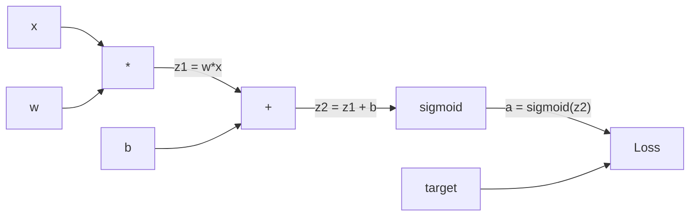
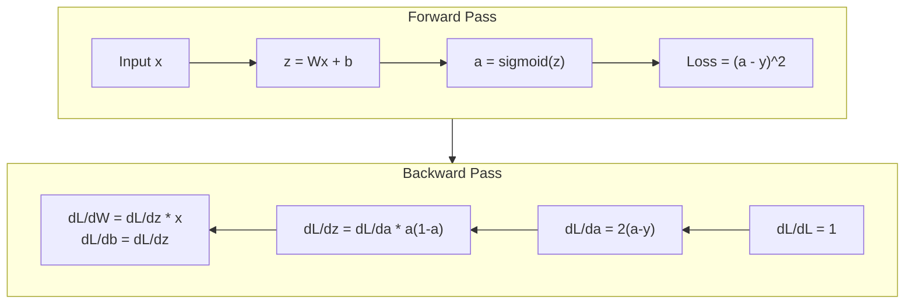
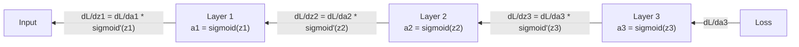

# 从零实现反向传播

> 反向传播是让学习成为可能的算法。没有它，神经网络只是一台昂贵的随机数生成器。

**Type:** 构建
**Languages:** Python
**Prerequisites:** 第 03.02 课（多层网络）
**Time:** 约 120 分钟

## 学习目标

- 实现基于 Value 的自动微分引擎：构建计算图，并通过拓扑排序计算梯度
- 使用链式法则推导加法、乘法和 Sigmoid 的反向传播
- 只使用从零实现的反向传播引擎，训练多层网络解决 XOR 与圆形分类
- 识别深层 Sigmoid 网络中的梯度消失问题，并解释梯度为何呈指数衰减

## 问题

你的网络包含一个隐藏层，有 768 个输入和 3072 个输出，也就是 2,359,296 个权重。它作出了一次错误预测。究竟是哪些权重导致了错误？逐个测试每个权重意味着要执行约 230 万次前向传播。反向传播只需一次反向传播，就能计算全部约 230 万个梯度。这不是一次普通优化，而是“能够训练”与“根本不可能训练”之间的区别。

朴素做法是：取一个权重，把它轻微改变，再次执行前向传播，观察损失上升还是下降。这样可以得到该权重的梯度。然后对网络中的每一个权重重复这一过程，再乘以数千个训练步骤和数百万个数据点。要用这种方式训练出任何有用模型，耗时恐怕要以地质年代计。

反向传播解决了这个问题：一次前向传播、一次反向传播，就能计算所有梯度。诀窍是把微积分中的链式法则系统地应用到计算图。正是这个算法让深度学习成为现实；没有它，我们至今仍会困在玩具问题中。

## 核心概念

### 把链式法则应用到网络

第 01 阶段第 05 课已经介绍过链式法则。快速回顾：如果 y = f(g(x))，那么 dy/dx = f'(g(x)) * g'(x)，也就是沿着计算链把导数相乘。

在神经网络中，这条“链”就是从输入到损失的一系列操作。每一层应用权重、加入偏置，再通过激活函数；损失函数比较最终输出与目标。反向传播沿着这条链逆向追踪，计算每个操作对误差作出了多少贡献。

### 计算图

每次前向传播都会构建一张图。每个节点表示一种操作，例如乘法、加法或 Sigmoid；每条边向前传递数值，向后传递梯度。



前向传播中，数值从左向右流动。x 与 w 产生 z1 = w*x，加上 b 得到 z2，Sigmoid 生成激活值 a，最后由损失函数比较 a 与目标 y。

反向传播中，梯度从右向左流动。从 dL/da，也就是损失随激活值变化的速率开始，乘以 da/dz2，也就是 Sigmoid 的导数，得到 dL/dz2。接着分成 dL/db 和 dL/dz1；由于 z2 = z1 + b，dL/db 就等于 dL/dz2。最后得到 dL/dw = dL/dz1 * x，以及 dL/dx = dL/dz1 * w。

反向传播期间，图中每个节点都只承担一项任务：接收后续节点传回的梯度，乘以自己的局部导数，再把结果传给前序节点。

### 前向传播与反向传播



前向传播会保存每个中间值：z、a，以及每一层的输入。反向传播需要这些已保存的值来计算梯度。这就是反向传播核心的内存与计算之间的权衡：用内存保存激活值，换取只执行一次反向传播，而不是数百万次计算。

### 梯度如何流经网络

在三层网络中，梯度会逐层连乘：



每经过一层，梯度都会乘以 Sigmoid 的导数。Sigmoid 的导数是 a * (1 - a)，最大值只有 0.25，此时 a = 0.5。经过三层后，梯度最多已经乘以 0.25^3 = 0.0156；经过十层后，则会乘以 0.25^10 = 0.000001。

### 梯度消失

这就是梯度消失问题。Sigmoid 会把输出压缩在 0 到 1 之间，它的导数始终小于 0.25。堆叠足够多的 Sigmoid 层后，梯度会衰减到几乎为零。靠近输入的层只能收到接近零的梯度，因此几乎无法学习。

```
sigmoid(z):     Output range [0, 1]
sigmoid'(z):    Max value 0.25 (at z = 0)

After 5 layers:   gradient * 0.25^5 = 0.001x original
After 10 layers:  gradient * 0.25^10 = 0.000001x original
```

这正是深层 Sigmoid 网络几乎无法训练的原因。解决方法是 ReLU 及其变体，也是第 04 课的主题。目前需要理解的是：反向传播算法本身工作完全正确，问题出在梯度所穿过的函数上。

### 推导双层网络的梯度

下面对一个具体网络进行数学推导：输入为 x，隐藏层和输出层都使用 Sigmoid，损失函数使用 MSE。

前向传播：
```
z1 = W1 * x + b1
a1 = sigmoid(z1)
z2 = W2 * a1 + b2
a2 = sigmoid(z2)
L = (a2 - y)^2
```

反向传播，逐步应用链式法则：
```
dL/da2 = 2(a2 - y)
da2/dz2 = a2 * (1 - a2)
dL/dz2 = dL/da2 * da2/dz2 = 2(a2 - y) * a2 * (1 - a2)

dL/dW2 = dL/dz2 * a1
dL/db2 = dL/dz2

dL/da1 = dL/dz2 * W2
da1/dz1 = a1 * (1 - a1)
dL/dz1 = dL/da1 * da1/dz1

dL/dW1 = dL/dz1 * x
dL/db1 = dL/dz1
```

每个梯度都是从损失出发向后追踪时，沿途各个局部导数的乘积。反向传播的本质仅此而已。

```figure
backprop-vanishing
```

## 动手构建

### 第 1 步：Value 节点

计算中的每个数都会成为一个 Value。它保存自己的数值、梯度以及产生自己的方式，因此知道如何向后计算梯度。

```python
class Value:
    def __init__(self, data, children=(), op=''):
        self.data = data
        self.grad = 0.0
        self._backward = lambda: None
        self._children = set(children)
        self._op = op

    def __repr__(self):
        return f"Value(data={self.data:.4f}, grad={self.grad:.4f})"
```

初始时还没有梯度，所以是 0.0；也没有反向函数，所以使用空操作。`_children` 会记录由哪些 Value 产生了当前节点，稍后可以据此对图进行拓扑排序。

### 第 2 步：带反向函数的操作

每种操作都会创建新的 Value，并定义梯度如何反向流过这个操作。

```python
def __add__(self, other):
    other = other if isinstance(other, Value) else Value(other)
    out = Value(self.data + other.data, (self, other), '+')

    def _backward():
        self.grad += out.grad
        other.grad += out.grad

    out._backward = _backward
    return out

def __mul__(self, other):
    other = other if isinstance(other, Value) else Value(other)
    out = Value(self.data * other.data, (self, other), '*')

    def _backward():
        self.grad += other.data * out.grad
        other.grad += self.data * out.grad

    out._backward = _backward
    return out
```

对于加法：d(a+b)/da = 1，d(a+b)/db = 1，因此两个输入都会直接得到输出节点的梯度。

对于乘法：d(a*b)/da = b，d(a*b)/db = a，因此每个输入都会得到另一个输入的值与输出梯度的乘积。

`+=` 至关重要。一个 Value 可能参与多项操作，它的梯度是所有路径传回梯度的总和。

### 第 3 步：Sigmoid 与损失

```python
import math

def sigmoid(self):
    x = self.data
    x = max(-500, min(500, x))
    s = 1.0 / (1.0 + math.exp(-x))
    out = Value(s, (self,), 'sigmoid')

    def _backward():
        self.grad += (s * (1 - s)) * out.grad

    out._backward = _backward
    return out
```

Sigmoid 的导数为 sigmoid(x) * (1 - sigmoid(x))。前向传播期间已经计算出 sigmoid(x) = s，因此直接复用即可，无需额外工作。

```python
def mse_loss(predicted, target):
    diff = predicted + Value(-target)
    return diff * diff
```

单个输出的 MSE 为 (predicted - target)^2。这里把减法表示成与负 Value 相加。

### 第 4 步：反向传播

拓扑排序确保节点按正确顺序处理：某个节点的梯度必须完全累加后，才能通过它继续向后传播。

```python
def backward(self):
    topo = []
    visited = set()

    def build_topo(v):
        if v not in visited:
            visited.add(v)
            for child in v._children:
                build_topo(child)
            topo.append(v)

    build_topo(self)
    self.grad = 1.0
    for v in reversed(topo):
        v._backward()
```

从损失节点开始，它的梯度设为 1.0，因为 dL/dL = 1。然后逆向遍历排序后的图，每个节点的 `_backward` 都会把梯度传递给其子节点。

### 第 5 步：Layer 与 Network

```python
import random

class Neuron:
    def __init__(self, n_inputs):
        scale = (2.0 / n_inputs) ** 0.5
        self.weights = [Value(random.uniform(-scale, scale)) for _ in range(n_inputs)]
        self.bias = Value(0.0)

    def __call__(self, x):
        act = sum((wi * xi for wi, xi in zip(self.weights, x)), self.bias)
        return act.sigmoid()

    def parameters(self):
        return self.weights + [self.bias]


class Layer:
    def __init__(self, n_inputs, n_outputs):
        self.neurons = [Neuron(n_inputs) for _ in range(n_outputs)]

    def __call__(self, x):
        out = [n(x) for n in self.neurons]
        return out[0] if len(out) == 1 else out

    def parameters(self):
        params = []
        for n in self.neurons:
            params.extend(n.parameters())
        return params


class Network:
    def __init__(self, sizes):
        self.layers = []
        for i in range(len(sizes) - 1):
            self.layers.append(Layer(sizes[i], sizes[i + 1]))

    def __call__(self, x):
        for layer in self.layers:
            x = layer(x)
            if not isinstance(x, list):
                x = [x]
        return x[0] if len(x) == 1 else x

    def parameters(self):
        params = []
        for layer in self.layers:
            params.extend(layer.parameters())
        return params

    def zero_grad(self):
        for p in self.parameters():
            p.grad = 0.0
```

Neuron 接收输入，计算加权和与偏置，再应用 Sigmoid。权重初始化按 sqrt(2/n_inputs) 缩放，防止 Sigmoid 在更深网络中过早饱和。Layer 是 Neuron 的列表，Network 是 Layer 的列表。`parameters()` 方法收集全部可学习 Value，以便统一更新。

### 第 6 步：在 XOR 上训练

```python
random.seed(42)
net = Network([2, 4, 1])

xor_data = [
    ([0.0, 0.0], 0.0),
    ([0.0, 1.0], 1.0),
    ([1.0, 0.0], 1.0),
    ([1.0, 1.0], 0.0),
]

learning_rate = 1.0

for epoch in range(1000):
    total_loss = Value(0.0)
    for inputs, target in xor_data:
        x = [Value(i) for i in inputs]
        pred = net(x)
        loss = mse_loss(pred, target)
        total_loss = total_loss + loss

    net.zero_grad()
    total_loss.backward()

    for p in net.parameters():
        p.data -= learning_rate * p.grad

    if epoch % 100 == 0:
        print(f"Epoch {epoch:4d} | Loss: {total_loss.data:.6f}")

print("\nXOR Results:")
for inputs, target in xor_data:
    x = [Value(i) for i in inputs]
    pred = net(x)
    print(f"  {inputs} -> {pred.data:.4f} (expected {target})")
```

观察损失如何下降。模型会从随机预测逐步得到正确的 XOR 输出，整个过程完全由反向传播计算梯度并把权重向正确方向轻轻推动。

### 第 7 步：圆形分类

第 02 课为圆形分类手工设置了权重。现在让网络自己学习这些权重。

```python
random.seed(7)

def generate_circle_data(n=100):
    data = []
    for _ in range(n):
        x1 = random.uniform(-1.5, 1.5)
        x2 = random.uniform(-1.5, 1.5)
        label = 1.0 if x1 * x1 + x2 * x2 < 1.0 else 0.0
        data.append(([x1, x2], label))
    return data

circle_data = generate_circle_data(80)

circle_net = Network([2, 8, 1])
learning_rate = 0.5

for epoch in range(2000):
    random.shuffle(circle_data)
    total_loss_val = 0.0
    for inputs, target in circle_data:
        x = [Value(i) for i in inputs]
        pred = circle_net(x)
        loss = mse_loss(pred, target)
        circle_net.zero_grad()
        loss.backward()
        for p in circle_net.parameters():
            p.data -= learning_rate * p.grad
        total_loss_val += loss.data

    if epoch % 200 == 0:
        correct = 0
        for inputs, target in circle_data:
            x = [Value(i) for i in inputs]
            pred = circle_net(x)
            predicted_class = 1.0 if pred.data > 0.5 else 0.0
            if predicted_class == target:
                correct += 1
        accuracy = correct / len(circle_data) * 100
        print(f"Epoch {epoch:4d} | Loss: {total_loss_val:.4f} | Accuracy: {accuracy:.1f}%")
```

这里使用在线 SGD，也就是每处理一个样本就更新权重，而不是累积整个批次的梯度。这样能更快打破对称性，并避免 Sigmoid 在完整损失曲面上过早饱和。每个 epoch 都打乱数据，可防止网络记住样本顺序。

无需手工调节，网络会自行找到圆形决策边界。这就是反向传播的力量：你只需定义架构、损失函数和数据，算法会自己找出权重。

## 实际应用

PyTorch 只需几行代码就能完成上面的全部工作。核心思想完全相同：自动微分在前向传播期间构建计算图，再反向追踪计算梯度。

```python
import torch
import torch.nn as nn

model = nn.Sequential(
    nn.Linear(2, 4),
    nn.Sigmoid(),
    nn.Linear(4, 1),
    nn.Sigmoid(),
)
optimizer = torch.optim.SGD(model.parameters(), lr=1.0)
criterion = nn.MSELoss()

X = torch.tensor([[0,0],[0,1],[1,0],[1,1]], dtype=torch.float32)
y = torch.tensor([[0],[1],[1],[0]], dtype=torch.float32)

for epoch in range(1000):
    pred = model(X)
    loss = criterion(pred, y)
    optimizer.zero_grad()
    loss.backward()
    optimizer.step()

print("PyTorch XOR Results:")
with torch.no_grad():
    for i in range(4):
        pred = model(X[i])
        print(f"  {X[i].tolist()} -> {pred.item():.4f} (expected {y[i].item()})")
```

`loss.backward()` 对应你实现的 `total_loss.backward()`，`optimizer.step()` 对应手工执行的 `p.data -= lr * p.grad`，`optimizer.zero_grad()` 则对应 `net.zero_grad()`。算法完全相同，只是实现达到了工业级。PyTorch 还会处理 GPU 加速、混合精度、梯度检查点和数百种层类型，但反向传播仍然是把同一条链式法则应用到同一张计算图。

训练过程依次运行前向传播、反向传播，再更新权重；推理只运行前向传播，不计算梯度，也不更新参数。这个区别非常重要，因为生产环境中实际发生的正是推理。当你调用 Claude 或 GPT 等 API 时，提示词会向前流过网络，另一端输出 token，而任何权重都不会改变。理解反向传播很重要，因为网络中的每个权重都曾由它塑造。

## 交付成果

本课会产出：
- `outputs/prompt-gradient-debugger.md`——可复用的提示词，用于诊断任意神经网络中的梯度消失、梯度爆炸和 NaN 问题

## 练习

1. 为 Value 类添加 `__sub__` 方法，其中 a - b = a + (-1 * b)，然后实现 `__neg__` 方法。针对 (a - b)^2 之类的简单表达式，将结果与手工计算比较，验证梯度是否正确。

2. 为 Value 添加 `relu` 方法，输出为 max(0, x)，x > 0 时导数为 1，否则为 0。把隐藏层中的 Sigmoid 换成 ReLU，再次在 XOR 上训练。比较收敛速度；你应该会观察到训练更快，这也为第 04 课作了预告。

3. 为 Value 实现支持整数次幂的 `__pow__` 方法，用它把 `mse_loss` 改写为真正的 `(predicted - target) ** 2` 表达式，并验证梯度与原实现一致。

4. 在训练循环中加入梯度裁剪：调用 `backward()` 后，把所有梯度限制在 [-1, 1]。训练一个包含 4 层以上且使用 Sigmoid 的深层网络，比较采用与不采用梯度裁剪时的损失曲线。这是抵御梯度爆炸的第一道防线。

5. 构建可视化：在 XOR 训练完成后，打印网络中每个参数的梯度，找出梯度最小的层。这样可以直观展示概念部分介绍的梯度消失问题。

## 关键术语

| 术语 | 人们常说 | 实际含义 |
|------|----------------|----------------------|
| 反向传播 | “网络在学习” | 在计算图上逆向应用链式法则，为每个权重计算 dL/dw 的算法 |
| 计算图 | “网络结构” | 节点表示操作、边向前传递数值并向后传递梯度的有向无环图 |
| 链式法则 | “把导数相乘” | 如果 y = f(g(x))，则 dy/dx = f'(g(x)) * g'(x)，它是反向传播的数学基础 |
| 梯度 | “最陡上升方向” | 损失对某个参数的偏导数，用于指出应如何改变该参数来降低损失 |
| 梯度消失 | “深层网络学不会” | 梯度穿过 Sigmoid 等饱和激活函数时呈指数衰减的现象 |
| 前向传播 | “运行网络” | 依次执行各层操作并保存中间值，根据输入计算输出 |
| 反向传播过程 | “计算梯度” | 逆向遍历计算图，使用链式法则在每个节点累积梯度 |
| 学习率 | “学习有多快” | 更新权重时控制步长的标量：w_new = w_old - lr * gradient |
| 拓扑排序 | “正确的顺序” | 每个节点都位于其依赖节点之后的图节点顺序，确保梯度完全累加后再继续传播 |
| 自动微分 | “自动求导” | 在前向计算时构建计算图并自动计算梯度的系统，也就是 PyTorch 引擎所做的工作 |

## 延伸阅读

- Rumelhart、Hinton 与 Williams，《Learning representations by back-propagating errors》（1986）——让反向传播成为主流并开启多层网络训练的论文
- 3Blue1Brown“Neural Networks”系列（https://www.youtube.com/playlist?list=PLZHQObOWTQDNU6R1_67000Dx_ZCJB-3pi）——对反向传播和梯度如何流经网络的最佳可视化讲解
