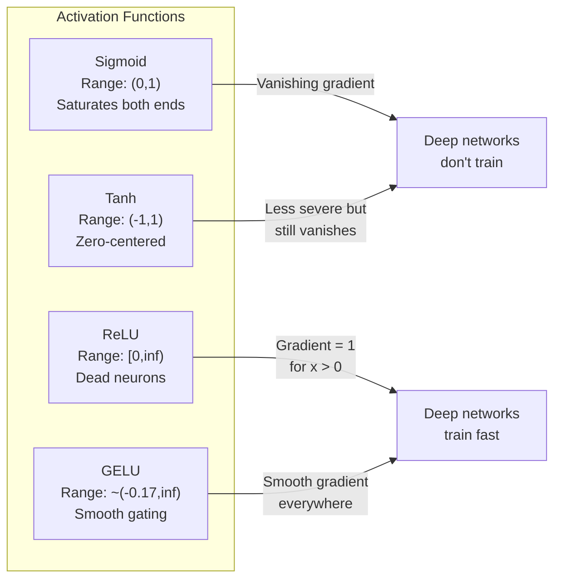
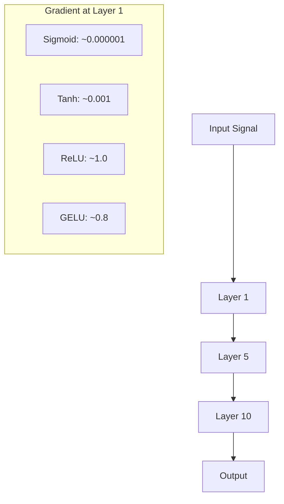
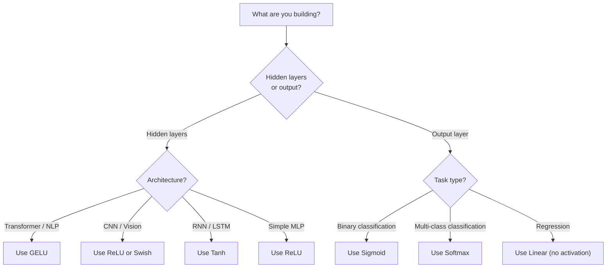

# 激活函数

> 没有非线性，100 层网络也不过是一次华丽的矩阵乘法。激活函数打开了一扇门，让神经网络得以用曲线思考。

**Type:** 构建
**Languages:** Python
**Prerequisites:** 第 03.03 课（反向传播）
**Time:** 约 75 分钟

## 学习目标

- 从零实现 Sigmoid、Tanh、ReLU、Leaky ReLU、GELU、Swish 和 Softmax 及其导数
- 通过测量不同激活函数在 10 层以上网络中的激活幅度，诊断梯度消失问题
- 检测 ReLU 网络中的死亡神经元，并解释 GELU 为何能避免这种失败模式
- 针对给定架构（Transformer、CNN、RNN、输出层）选择正确的激活函数

## 问题

把两个线性变换堆叠起来：y = W2(W1x + b1) + b2。展开后得到 y = W2W1x + W2b1 + b2，也就是 y = Ax + c——仍然只是单个线性变换。无论堆叠多少个线性层，最终结果都能折叠成一次矩阵乘法。你的 100 层网络与单层网络拥有完全相同的表示能力。

这并非只有理论意义。它意味着深层线性网络真的无法学习 XOR、无法分类螺旋数据集，也无法识别人脸。没有激活函数，所谓深度只是假象。

激活函数打破了线性关系。它们使用非线性函数扭曲每一层的输出，使网络能够弯曲决策边界、逼近任意函数并真正进行学习。但如果选错激活函数，梯度可能消失到零，例如深层网络中的 Sigmoid；可能爆炸到无穷大，例如未经谨慎初始化的无界激活；也可能让神经元永久死亡，例如带有较大负偏置的 ReLU。激活函数的选择会直接决定网络究竟能否学会。

## 核心概念

### 为什么必须有非线性

矩阵乘法可以组合。先用矩阵 A 乘向量，再用矩阵 B 相乘，等价于直接乘以 AB。这意味着堆叠十个线性层，在数学上仍然等价于使用一个大矩阵的单个线性层。所有参数、所有深度都被浪费了。必须引入某种东西打断这条链，而激活函数正是为此存在。

证明如下。线性层计算 f(x) = Wx + b。将两层堆叠：

```
Layer 1: h = W1 * x + b1
Layer 2: y = W2 * h + b2
```

代入后得到：

```
y = W2 * (W1 * x + b1) + b2
y = (W2 * W1) * x + (W2 * b1 + b2)
y = A * x + c
```

只有一层。在两层之间插入非线性激活 g()：

```
h = g(W1 * x + b1)
y = W2 * h + b2
```

此时代入关系被打破了。W2 * g(W1 * x + b1) + b2 无法化简成单个线性变换，网络因此能够表示非线性函数。每增加一个带激活函数的层，网络的表示能力就会提高。

### Sigmoid

这是神经网络最早使用的激活函数。

```
sigmoid(x) = 1 / (1 + e^(-x))
```

输出范围为 (0, 1)。它平滑、可微，可以把任意实数映射成类似概率的值。

它的导数为：

```
sigmoid'(x) = sigmoid(x) * (1 - sigmoid(x))
```

这个导数的最大值为 0.25，出现在 x = 0。反向传播时，梯度会沿网络各层相乘。十层 Sigmoid 意味着梯度最多会连续乘以十次 0.25：

```
0.25^10 = 0.000000953674
```

结果不到原始信号的百万分之一。这就是梯度消失问题。前面几层的梯度变得极小，权重几乎不再更新。网络表面上仍在学习，因为后面的层损失还在下降，但最前面的层已经冻结。深层 Sigmoid 网络根本无法有效训练。

另一个问题是，Sigmoid 输出始终为正，范围在 0 到 1 之间，因此权重梯度总是具有相同符号。这会导致梯度下降以之字形轨迹前进。

### Tanh

Tanh 可以看作以零为中心的 Sigmoid。

```
tanh(x) = (e^x - e^(-x)) / (e^x + e^(-x))
```

输出范围为 (-1, 1)。因为以零为中心，它消除了之字形问题。

导数为：

```
tanh'(x) = 1 - tanh(x)^2
```

当 x = 0 时，导数最大值为 1.0，是 Sigmoid 的四倍。但梯度消失问题仍然存在：输入为很大的正数或负数时，导数都会趋近零。十层网络依然会严重压缩梯度，只是程度没有 Sigmoid 那么激烈。

### ReLU：关键突破

ReLU 即修正线性单元。Nair 与 Hinton 在 2010 年推动它在深度学习中普及，而这个函数本身可以追溯到 Fukushima 1969 年的工作。它改变了一切。

```
relu(x) = max(0, x)
```

输出范围为 [0, infinity)，导数非常简单：

```
relu'(x) = 1  if x > 0
            0  if x <= 0
```

正输入不会产生梯度消失，因为梯度恰好等于 1，可以原样向后传递。ReLU 正是通过跨层保留梯度幅度，让深层网络变得可训练。

但它也有一种失败模式：死亡神经元。如果某个神经元的加权输入始终为负，例如因为偏置很大且为负，或权重初始化不理想，它的输出永远是零，梯度也永远是零，因此再也不会更新。这个神经元永久“死亡”。实践中，ReLU 网络训练期间可能有 10%–40% 的神经元死亡。

### Leaky ReLU

这是解决死亡神经元最简单的方法。

```
leaky_relu(x) = x        if x > 0
                alpha * x if x <= 0
```

其中 alpha 是一个很小的常数，通常取 0.01。负半轴不再完全平坦，而是保留一个很小的斜率，因此死亡神经元仍能收到梯度信号并恢复。

### GELU：现代默认选择

GELU 即高斯误差线性单元，由 Hendrycks 与 Gimpel 于 2016 年提出。它是 BERT、GPT 及大多数现代 Transformer 的默认激活函数。

```
gelu(x) = x * Phi(x)
```

其中 Phi(x) 是标准正态分布的累积分布函数。实践中通常使用以下近似：

```
gelu(x) ~= 0.5 * x * (1 + tanh(sqrt(2/pi) * (x + 0.044715 * x^3)))
```

GELU 处处平滑，允许少量负值通过，不像 ReLU 那样硬截断为零。它还有一种概率解释：根据输入在高斯分布下取正值的可能性，对每个输入进行加权。这种平滑门控能在 Transformer 架构中胜过 ReLU，因为它提供更好的梯度流，并完全避免死亡神经元问题。

### Swish / SiLU

这是一种自门控激活函数，由 Ramachandran 等人在 2017 年通过自动搜索发现。

```
swish(x) = x * sigmoid(x)
```

Swish 的严格定义就是 x * sigmoid(x)。Google 通过自动搜索激活函数空间发现了它，等于让一个神经网络设计另一个神经网络的组成部分。

与 GELU 一样，Swish 平滑、非单调，并允许少量负值通过。两者差别很细微：Swish 使用 Sigmoid 进行门控，GELU 使用高斯累积分布函数。实践中，性能几乎相同。Swish 用于 EfficientNet 和一些视觉模型，GELU 则主导语言模型。

### Softmax：输出层激活函数

Softmax 不用于隐藏层。它把一组原始分数，也就是 logits，转换成概率分布。

```
softmax(x_i) = e^(x_i) / sum(e^(x_j) for all j)
```

每个输出都位于 0 和 1 之间，全部输出之和为 1，因此它是多分类任务的标准最终激活函数。最大的 logit 会得到最高概率，但与 argmax 不同，Softmax 可微，而且保留了不同类别相对置信度的信息。

### 形状比较



### 梯度流比较



### 如何选择激活函数



```figure
softmax-temperature
```

## 动手构建

### 第 1 步：实现所有激活函数及其导数

每个函数接收一个浮点数并返回一个浮点数，每个导数函数接收相同输入并返回梯度。

```python
import math

def sigmoid(x):
    x = max(-500, min(500, x))
    return 1.0 / (1.0 + math.exp(-x))

def sigmoid_derivative(x):
    s = sigmoid(x)
    return s * (1 - s)

def tanh_act(x):
    return math.tanh(x)

def tanh_derivative(x):
    t = math.tanh(x)
    return 1 - t * t

def relu(x):
    return max(0.0, x)

def relu_derivative(x):
    return 1.0 if x > 0 else 0.0

def leaky_relu(x, alpha=0.01):
    return x if x > 0 else alpha * x

def leaky_relu_derivative(x, alpha=0.01):
    return 1.0 if x > 0 else alpha

def gelu(x):
    return 0.5 * x * (1 + math.tanh(math.sqrt(2 / math.pi) * (x + 0.044715 * x ** 3)))

def gelu_derivative(x):
    phi = 0.5 * (1 + math.erf(x / math.sqrt(2)))
    pdf = math.exp(-0.5 * x * x) / math.sqrt(2 * math.pi)
    return phi + x * pdf

def swish(x):
    return x * sigmoid(x)

def swish_derivative(x):
    s = sigmoid(x)
    return s + x * s * (1 - s)

def softmax(xs):
    max_x = max(xs)
    exps = [math.exp(x - max_x) for x in xs]
    total = sum(exps)
    return [e / total for e in exps]
```

### 第 2 步：查看梯度在哪里消失

在 -5 到 5 之间均匀选取 100 个点并计算梯度，再打印文本直方图，展示每种激活函数的梯度在哪些位置接近零。

```python
def gradient_scan(name, derivative_fn, start=-5, end=5, n=100):
    step = (end - start) / n
    near_zero = 0
    healthy = 0
    for i in range(n):
        x = start + i * step
        g = derivative_fn(x)
        if abs(g) < 0.01:
            near_zero += 1
        else:
            healthy += 1
    pct_dead = near_zero / n * 100
    print(f"{name:15s}: {healthy:3d} healthy, {near_zero:3d} near-zero ({pct_dead:.0f}% dead zone)")

gradient_scan("Sigmoid", sigmoid_derivative)
gradient_scan("Tanh", tanh_derivative)
gradient_scan("ReLU", relu_derivative)
gradient_scan("Leaky ReLU", leaky_relu_derivative)
gradient_scan("GELU", gelu_derivative)
gradient_scan("Swish", swish_derivative)
```

### 第 3 步：梯度消失实验

使用 Sigmoid 和 ReLU 分别让一个信号前向传播 N 层，测量激活幅度如何变化。

```python
import random

def vanishing_gradient_experiment(activation_fn, name, n_layers=10, n_inputs=5):
    random.seed(42)
    values = [random.gauss(0, 1) for _ in range(n_inputs)]

    print(f"\n{name} through {n_layers} layers:")
    for layer in range(n_layers):
        weights = [random.gauss(0, 1) for _ in range(n_inputs)]
        z = sum(w * v for w, v in zip(weights, values))
        activated = activation_fn(z)
        magnitude = abs(activated)
        bar = "#" * int(magnitude * 20)
        print(f"  Layer {layer+1:2d}: magnitude = {magnitude:.6f} {bar}")
        values = [activated] * n_inputs

vanishing_gradient_experiment(sigmoid, "Sigmoid")
vanishing_gradient_experiment(relu, "ReLU")
vanishing_gradient_experiment(gelu, "GELU")
```

### 第 4 步：死亡神经元检测器

创建 ReLU 网络，让随机输入通过它，并统计有多少神经元从不激活。

```python
def dead_neuron_detector(n_inputs=5, hidden_size=20, n_samples=1000):
    random.seed(0)
    weights = [[random.gauss(0, 1) for _ in range(n_inputs)] for _ in range(hidden_size)]
    biases = [random.gauss(0, 1) for _ in range(hidden_size)]

    fire_counts = [0] * hidden_size

    for _ in range(n_samples):
        inputs = [random.gauss(0, 1) for _ in range(n_inputs)]
        for neuron_idx in range(hidden_size):
            z = sum(w * x for w, x in zip(weights[neuron_idx], inputs)) + biases[neuron_idx]
            if relu(z) > 0:
                fire_counts[neuron_idx] += 1

    dead = sum(1 for c in fire_counts if c == 0)
    rarely_fire = sum(1 for c in fire_counts if 0 < c < n_samples * 0.05)
    healthy = hidden_size - dead - rarely_fire

    print(f"\nDead Neuron Report ({hidden_size} neurons, {n_samples} samples):")
    print(f"  Dead (never fired):     {dead}")
    print(f"  Barely alive (<5%):     {rarely_fire}")
    print(f"  Healthy:                {healthy}")
    print(f"  Dead neuron rate:       {dead/hidden_size*100:.1f}%")

    for i, c in enumerate(fire_counts):
        status = "DEAD" if c == 0 else "WEAK" if c < n_samples * 0.05 else "OK"
        bar = "#" * (c * 40 // n_samples)
        print(f"  Neuron {i:2d}: {c:4d}/{n_samples} fires [{status:4s}] {bar}")

dead_neuron_detector()
```

### 第 5 步：训练对比——Sigmoid、ReLU 与 GELU

在圆形数据集上使用三种不同激活函数训练相同的双层网络，比较收敛速度。圆内点属于类别 1，圆外点属于类别 0。

```python
def make_circle_data(n=200, seed=42):
    random.seed(seed)
    data = []
    for _ in range(n):
        x = random.uniform(-2, 2)
        y = random.uniform(-2, 2)
        label = 1.0 if x * x + y * y < 1.5 else 0.0
        data.append(([x, y], label))
    return data


class ActivationNetwork:
    def __init__(self, activation_fn, activation_deriv, hidden_size=8, lr=0.1):
        random.seed(0)
        self.act = activation_fn
        self.act_d = activation_deriv
        self.lr = lr
        self.hidden_size = hidden_size

        self.w1 = [[random.gauss(0, 0.5) for _ in range(2)] for _ in range(hidden_size)]
        self.b1 = [0.0] * hidden_size
        self.w2 = [random.gauss(0, 0.5) for _ in range(hidden_size)]
        self.b2 = 0.0

    def forward(self, x):
        self.x = x
        self.z1 = []
        self.h = []
        for i in range(self.hidden_size):
            z = self.w1[i][0] * x[0] + self.w1[i][1] * x[1] + self.b1[i]
            self.z1.append(z)
            self.h.append(self.act(z))

        self.z2 = sum(self.w2[i] * self.h[i] for i in range(self.hidden_size)) + self.b2
        self.out = sigmoid(self.z2)
        return self.out

    def backward(self, target):
        error = self.out - target
        d_out = error * self.out * (1 - self.out)

        for i in range(self.hidden_size):
            d_h = d_out * self.w2[i] * self.act_d(self.z1[i])
            self.w2[i] -= self.lr * d_out * self.h[i]
            for j in range(2):
                self.w1[i][j] -= self.lr * d_h * self.x[j]
            self.b1[i] -= self.lr * d_h
        self.b2 -= self.lr * d_out

    def train(self, data, epochs=200):
        losses = []
        for epoch in range(epochs):
            total_loss = 0
            correct = 0
            for x, y in data:
                pred = self.forward(x)
                self.backward(y)
                total_loss += (pred - y) ** 2
                if (pred >= 0.5) == (y >= 0.5):
                    correct += 1
            avg_loss = total_loss / len(data)
            accuracy = correct / len(data) * 100
            losses.append(avg_loss)
            if epoch % 50 == 0 or epoch == epochs - 1:
                print(f"    Epoch {epoch:3d}: loss={avg_loss:.4f}, accuracy={accuracy:.1f}%")
        return losses


data = make_circle_data()

configs = [
    ("Sigmoid", sigmoid, sigmoid_derivative),
    ("ReLU", relu, relu_derivative),
    ("GELU", gelu, gelu_derivative),
]

results = {}
for name, act_fn, act_d_fn in configs:
    print(f"\n=== Training with {name} ===")
    net = ActivationNetwork(act_fn, act_d_fn, hidden_size=8, lr=0.1)
    losses = net.train(data, epochs=200)
    results[name] = losses

print("\n=== Final Loss Comparison ===")
for name, losses in results.items():
    print(f"  {name:10s}: start={losses[0]:.4f} -> end={losses[-1]:.4f} (improvement: {(1 - losses[-1]/losses[0])*100:.1f}%)")
```

## 实际应用

PyTorch 以函数和模块两种形式提供了所有这些激活函数：

```python
import torch
import torch.nn as nn
import torch.nn.functional as F

x = torch.randn(4, 10)

relu_out = F.relu(x)
gelu_out = F.gelu(x)
sigmoid_out = torch.sigmoid(x)
swish_out = F.silu(x)

logits = torch.randn(4, 5)
probs = F.softmax(logits, dim=1)

model = nn.Sequential(
    nn.Linear(10, 64),
    nn.GELU(),
    nn.Linear(64, 32),
    nn.GELU(),
    nn.Linear(32, 5),
)
```

Transformer 的隐藏层使用 GELU，CNN 的隐藏层使用 ReLU，分类输出层使用 Softmax，回归输出层不使用激活，也就是线性输出，输出概率时使用 Sigmoid。就这么简单。可以先采用这些默认选择，只有在证据表明有必要时再作改变。

RNN 与 LSTM 的隐藏状态使用 Tanh，门使用 Sigmoid；不过，如果今天从零构建模型，你很可能不会选择 RNN。如果 ReLU 网络中出现神经元死亡，可以切换到 GELU。除非有明确理由，否则不必优先选择 Leaky ReLU：GELU 同样解决死亡神经元问题，并提供更好的梯度流。

## 交付成果

本课会产出：
- `outputs/prompt-activation-selector.md`——帮助你为任意架构选择合适激活函数的可复用提示词

## 练习

1. 实现参数化 ReLU（PReLU），其中负半轴斜率 alpha 是可学习参数。在圆形数据集上训练，并与固定斜率的 Leaky ReLU 比较。

2. 把梯度消失实验从 10 层扩展到 50 层。绘制 Sigmoid、Tanh、ReLU 和 GELU 在每一层的幅度。每种激活函数到第几层时，信号实际上衰减为零？

3. 实现 ELU（指数线性单元）：x > 0 时 elu(x) = x，否则为 alpha * (e^x - 1)。在同一网络上比较它与 ReLU 的死亡神经元比例。

4. 构建“梯度健康监控器”，在训练期间每个 epoch 都计算各层的平均梯度幅度。当任一层梯度低于 0.001 或超过 100 时打印警告。

5. 修改训练对比，使用第 01 课的 XOR 数据集替代圆形数据集。哪种激活函数在 XOR 上收敛最快？为什么结果与圆形数据不同？

## 关键术语

| 术语 | 人们常说 | 实际含义 |
|------|----------------|----------------------|
| 激活函数 | “网络里的非线性部分” | 应用于每个神经元输出的函数，用来打破线性，使网络能够学习非线性映射 |
| 梯度消失 | “深层网络中的梯度不见了” | 当激活函数的导数小于 1 时，梯度穿过多层会呈指数衰减，使前面的层无法训练 |
| 梯度爆炸 | “梯度炸了” | 有效乘数超过 1 时，梯度穿过多层呈指数增长，导致训练不稳定 |
| 死亡神经元 | “停止学习的神经元” | 输入永久为负、因而始终输出零且梯度为零的 ReLU 神经元 |
| Sigmoid | “把数值压到 0 到 1 之间” | 逻辑函数 1/(1+e^-x)，具有重要历史意义，但会在深层网络中造成梯度消失 |
| ReLU | “把负数截断为零” | max(0, x)，通过保留梯度幅度，让深度学习成为现实的激活函数 |
| GELU | “Transformer 默认使用的激活函数” | 高斯误差线性单元，一种平滑激活函数，会按输入取正的概率对其加权 |
| Swish/SiLU | “自门控的 ReLU 变体” | x * sigmoid(x)，通过自动搜索发现，用于 EfficientNet |
| Softmax | “把分数转换成概率” | 把 logits 向量归一化成概率分布，其中所有值位于 (0,1)，总和为 1 |
| Leaky ReLU | “不会死亡的 ReLU” | max(alpha*x, x)，其中 alpha 很小，通常为 0.01；它允许微小负梯度通过，从而防止神经元死亡 |
| 饱和 | “Sigmoid 的平坦区域” | 激活函数导数趋近零、阻断梯度流的区域 |
| Logit | “Softmax 之前的原始分数” | 应用 Softmax 或 Sigmoid 前，最终一层尚未归一化的输出 |

## 延伸阅读

- Nair 与 Hinton，《Rectified Linear Units Improve Restricted Boltzmann Machines》（2010）——介绍 ReLU 并促成深层网络训练的论文
- Hendrycks 与 Gimpel，《Gaussian Error Linear Units (GELUs)》（2016）——提出后来成为 Transformer 默认选择的激活函数
- Ramachandran 等，《Searching for Activation Functions》（2017）——使用自动搜索发现 Swish，证明激活函数设计也可以自动化
- Glorot 与 Bengio，《Understanding the difficulty of training deep feedforward neural networks》（2010）——诊断梯度消失/爆炸问题并提出 Xavier 初始化的论文
- Goodfellow、Bengio、Courville，《Deep Learning》第 6.3 节（https://www.deeplearningbook.org/）——关于隐藏单元与激活函数的严谨论述
