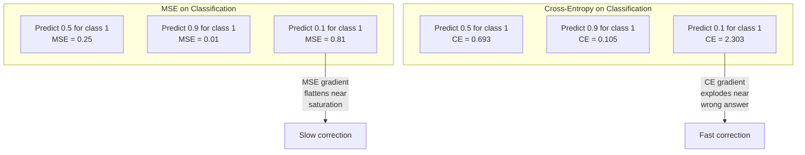
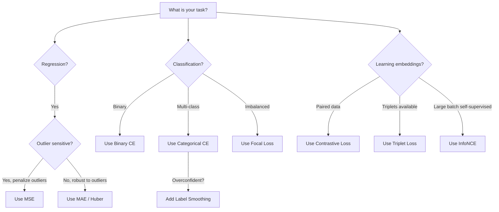
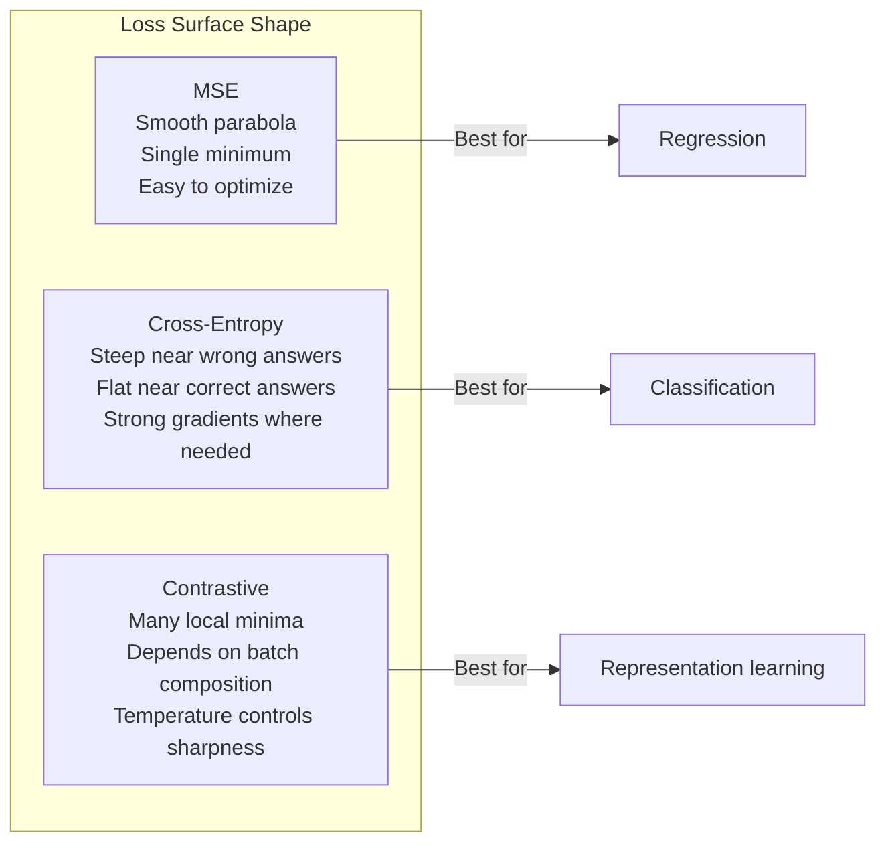

# 损失函数

> 网络给出一个预测，真实答案却并非如此。它错得有多离谱？这个数值就是损失。选错损失函数，模型就会优化一个完全错误的目标。

**Type:** 构建
**Languages:** Python
**Prerequisites:** 第 03.04 课（激活函数）
**Time:** 约 75 分钟

## 学习目标

- 从零实现 MSE、二元交叉熵、类别交叉熵和对比损失（InfoNCE）及其梯度
- 通过展示“对所有输入都预测 0.5”的失败模式，解释 MSE 为何不适用于分类
- 在交叉熵中应用标签平滑，并说明它如何防止预测过度自信
- 为回归、二分类、多分类和嵌入学习任务选择正确的损失函数

## 问题

在分类问题上最小化 MSE 的模型，可能会自信地把所有样本都预测为 0.5。它的确在最小化损失，却也完全没有用。

损失函数是模型真正优化的唯一对象。不是准确率，不是 F1 分数，也不是你向经理汇报的任何指标。优化器会求损失函数的梯度，再调整权重，使这个数值变小。如果损失函数没有表达你真正关心的目标，模型就会找到数学上成本最低的方式来满足它，而那几乎从来不是你想要的结果。

来看一个具体例子。你有一个二分类任务，两个类别各占 50%，使用 MSE 作为损失。模型对每个输入都预测 0.5，平均 MSE 是 0.25；在没有真正学习任何东西的情况下，这已经是可能达到的最小值。模型完全没有判别能力，却在技术上最小化了你的损失函数。切换到交叉熵后，同一个模型会被迫把预测推向 0 或 1，因为 -log(0.5) = 0.693 是很糟糕的损失，而 -log(0.99) = 0.01 会奖励自信且正确的预测。损失函数的选择，决定了模型究竟是在学习，还是只是在钻指标的空子。

自监督学习中的情况更加严峻，因为连标签都不存在。对比损失完全定义了学习信号：什么算相似、什么算不同，以及模型应该多用力地把它们分开。如果对比损失设计错误，嵌入可能坍缩到同一个点——每个输入都映射到完全相同的向量。技术上损失为零，实际上一文不值。

## 核心概念

### 均方误差（MSE）

这是回归任务的默认选择。计算预测值与目标值之差的平方，再对所有样本取平均。

```
MSE = (1/n) * sum((y_pred - y_true)^2)
```

平方很重要，因为它会以二次方式惩罚大误差。误差为 2 的代价是误差为 1 的 4 倍，误差为 10 的代价则是 100 倍。因此 MSE 对离群点很敏感：一次严重错误的预测就可能主导整个损失。

用真实数值举例：如果模型预测房价时，对大多数房屋都偏差 10,000 美元，却对一栋豪宅偏差 200,000 美元，MSE 会非常激进地试图修正这栋豪宅，甚至可能损害其余 99 栋房屋的预测表现。

MSE 对预测值的梯度为：

```
dMSE/dy_pred = (2/n) * (y_pred - y_true)
```

梯度与误差呈线性关系。误差越大，梯度越大。这对回归是优点，因为大误差需要大幅修正；对分类却是缺点，因为你希望自信但错误的答案受到指数级惩罚，而不是线性惩罚。

### 交叉熵损失

这是分类任务使用的损失函数。它源自信息论，用来衡量预测概率分布与真实分布之间的差异。

**二元交叉熵（BCE）：**

```
BCE = -(y * log(p) + (1 - y) * log(1 - p))
```

其中 y 是真实标签，取 0 或 1；p 是预测概率。

为什么 -log(p) 有效？当真实标签为 1，而你预测 p = 0.99 时，损失为 -log(0.99) = 0.01；当预测 p = 0.01 时，损失为 -log(0.01) = 4.6。两者相差 460 倍，这正是交叉熵有效的原因。它会严厉惩罚自信但错误的预测，同时几乎不惩罚自信且正确的预测。

梯度传达了同样的信息：

```
dBCE/dp = -(y/p) + (1-y)/(1-p)
```

当 y = 1 且 p 接近零时，梯度是 -1/p，会趋向负无穷，模型因此收到一个巨大的修正信号。当 p 接近 1 时，梯度很小：已经预测正确，无需修正。

**类别交叉熵：**

适用于目标采用独热编码的多分类任务。

```
CCE = -sum(y_i * log(p_i))
```

只有真实类别会对损失作出贡献，因为其他 y_i 都为零。如果一共有 10 个类别，正确类别得到 0.1 的概率，相当于随机猜测，损失为 -log(0.1) = 2.3；如果正确类别得到 0.9 的概率，损失则是 -log(0.9) = 0.105。模型会学着把概率质量集中到正确答案上。

### MSE 为何不适用于分类



当预测接近 0 或 1 时，由于 Sigmoid 已经饱和，MSE 梯度会变平。交叉熵梯度能够补偿这一点：-log 会抵消 Sigmoid 的平坦区域，在最需要修正的地方提供强梯度。

### 标签平滑

标准独热标签断言：“这个样本 100% 属于类别 3，属于其他所有类别的概率都是 0%。”这是一个很强的主张。标签平滑会软化它：

```
smooth_label = (1 - alpha) * one_hot + alpha / num_classes
```

当 alpha = 0.1 且有 10 个类别时，目标不再是 [0, 0, 1, 0, ...]，而会变成 [0.01, 0.01, 0.91, 0.01, ...]。模型的目标是 0.91，而不是 1.0。

它为何有效？模型若想通过 Softmax 精确输出 1.0，就必须把 logits 推向无穷大。这会造成过度自信、损害泛化能力，并使模型面对分布偏移时非常脆弱。标签平滑把目标限制在 0.9 左右（alpha=0.1 时），让 logits 保持在合理范围内。GPT 和大多数现代模型都会使用标签平滑或等价技术。

### 对比损失

没有标签，也没有类别，只有成对输入和一个问题：它们相似还是不同？

**SimCLR 风格的对比损失（NT-Xent / InfoNCE）：**

取一张图像，生成两个增强视图，例如裁剪、旋转、颜色抖动。它们构成“正样本对”，嵌入应该相似；批次中的其他所有图像都会构成“负样本对”，嵌入应该不同。

```
L = -log(exp(sim(z_i, z_j) / tau) / sum(exp(sim(z_i, z_k) / tau)))
```

其中 sim() 是余弦相似度，z_i 与 z_j 构成正样本对，求和涵盖全部负样本，tau（温度）控制分布的尖锐程度。温度越低，负样本越“难”，分离也越激进。

代入真实数值：批大小为 256，意味着每个正样本对对应 255 个负样本；温度 tau = 0.07，这是 SimCLR 的默认值。这个损失就像在相似度上执行 Softmax：它希望正样本对的相似度在全部 256 个候选项中最高。

**三元组损失：**

它接收三个输入：锚点、正样本（同一类别）和负样本（不同类别）。

```
L = max(0, d(anchor, positive) - d(anchor, negative) + margin)
```

margin 通常取 0.2–1.0，用来强制正负距离之间至少存在一定间隔。如果负样本已经足够远，损失就为零，不产生梯度，也不更新参数。这样可以提高训练效率，但需要谨慎进行三元组挖掘，也就是选择靠近锚点的困难负样本。

### Focal Loss

它适用于不平衡数据集。标准交叉熵平等对待所有已正确分类的样本，而 Focal Loss 会降低简单样本的权重：

```
FL = -alpha * (1 - p_t)^gamma * log(p_t)
```

其中 p_t 是真实类别的预测概率，gamma 控制聚焦程度。当 gamma = 0 时，它就是标准交叉熵；当 gamma = 2，也就是默认值时：

- 简单样本（p_t = 0.9）：权重 = (0.1)^2 = 0.01，几乎被忽略。
- 困难样本（p_t = 0.1）：权重 = (0.9)^2 = 0.81，保留完整的梯度信号。

Lin 等人为目标检测提出了 Focal Loss。在该任务中，99% 的候选区域都是背景，也就是简单负样本。没有 Focal Loss 时，模型会淹没在简单背景样本中，无法学会检测物体；采用它之后，模型便能把能力集中到真正重要的困难、模糊样本上。

### 损失函数决策树



### 损失曲面



```figure
cross-entropy-loss
```

## 动手构建

### 第 1 步：MSE 及其梯度

```python
def mse(predictions, targets):
    n = len(predictions)
    total = 0.0
    for p, t in zip(predictions, targets):
        total += (p - t) ** 2
    return total / n

def mse_gradient(predictions, targets):
    n = len(predictions)
    grads = []
    for p, t in zip(predictions, targets):
        grads.append(2.0 * (p - t) / n)
    return grads
```

### 第 2 步：二元交叉熵

log(0) 问题确实存在。如果模型为正样本预测严格的 0，log(0) 就是负无穷。裁剪可以防止这种情况。

```python
import math

def binary_cross_entropy(predictions, targets, eps=1e-15):
    n = len(predictions)
    total = 0.0
    for p, t in zip(predictions, targets):
        p_clipped = max(eps, min(1 - eps, p))
        total += -(t * math.log(p_clipped) + (1 - t) * math.log(1 - p_clipped))
    return total / n

def bce_gradient(predictions, targets, eps=1e-15):
    grads = []
    for p, t in zip(predictions, targets):
        p_clipped = max(eps, min(1 - eps, p))
        grads.append(-(t / p_clipped) + (1 - t) / (1 - p_clipped))
    return grads
```

### 第 3 步：结合 Softmax 的类别交叉熵

Softmax 把原始 logits 转换成概率，然后计算它们与独热目标之间的交叉熵。

```python
def softmax(logits):
    max_val = max(logits)
    exps = [math.exp(x - max_val) for x in logits]
    total = sum(exps)
    return [e / total for e in exps]

def categorical_cross_entropy(logits, target_index, eps=1e-15):
    probs = softmax(logits)
    p = max(eps, probs[target_index])
    return -math.log(p)

def cce_gradient(logits, target_index):
    probs = softmax(logits)
    grads = list(probs)
    grads[target_index] -= 1.0
    return grads
```

Softmax + 交叉熵的梯度可以漂亮地化简：真实类别上就是（预测概率 - 1），其他所有类别上则是预测概率。这个优雅的化简绝非巧合，也正是 Softmax 总与交叉熵配合使用的原因。

### 第 4 步：标签平滑

```python
def label_smoothed_cce(logits, target_index, num_classes, alpha=0.1, eps=1e-15):
    probs = softmax(logits)
    loss = 0.0
    for i in range(num_classes):
        if i == target_index:
            smooth_target = 1.0 - alpha + alpha / num_classes
        else:
            smooth_target = alpha / num_classes
        p = max(eps, probs[i])
        loss += -smooth_target * math.log(p)
    return loss
```

### 第 5 步：对比损失（简化版 InfoNCE）

```python
def cosine_similarity(a, b):
    dot = sum(x * y for x, y in zip(a, b))
    norm_a = math.sqrt(sum(x * x for x in a))
    norm_b = math.sqrt(sum(x * x for x in b))
    if norm_a < 1e-10 or norm_b < 1e-10:
        return 0.0
    return dot / (norm_a * norm_b)

def contrastive_loss(anchor, positive, negatives, temperature=0.07):
    sim_pos = cosine_similarity(anchor, positive) / temperature
    sim_negs = [cosine_similarity(anchor, neg) / temperature for neg in negatives]

    max_sim = max(sim_pos, max(sim_negs)) if sim_negs else sim_pos
    exp_pos = math.exp(sim_pos - max_sim)
    exp_negs = [math.exp(s - max_sim) for s in sim_negs]
    total_exp = exp_pos + sum(exp_negs)

    return -math.log(max(1e-15, exp_pos / total_exp))
```

### 第 6 步：分类任务中的 MSE 与交叉熵

使用两种损失函数训练第 04 课中的同一个网络，也就是圆形数据集，观察交叉熵如何更快收敛。

```python
import random

def sigmoid(x):
    x = max(-500, min(500, x))
    return 1.0 / (1.0 + math.exp(-x))

def make_circle_data(n=200, seed=42):
    random.seed(seed)
    data = []
    for _ in range(n):
        x = random.uniform(-2, 2)
        y = random.uniform(-2, 2)
        label = 1.0 if x * x + y * y < 1.5 else 0.0
        data.append(([x, y], label))
    return data


class LossComparisonNetwork:
    def __init__(self, loss_type="bce", hidden_size=8, lr=0.1):
        random.seed(0)
        self.loss_type = loss_type
        self.lr = lr
        self.hidden_size = hidden_size

        self.w1 = [[random.gauss(0, 0.5) for _ in range(2)] for _ in range(hidden_size)]
        self.b1 = [0.0] * hidden_size
        self.w2 = [random.gauss(0, 0.5) for _ in range(hidden_size)]
        self.b2 = 0.0

    def forward(self, x):
        self.x = x
        self.z1 = []
        self.h = []
        for i in range(self.hidden_size):
            z = self.w1[i][0] * x[0] + self.w1[i][1] * x[1] + self.b1[i]
            self.z1.append(z)
            self.h.append(max(0.0, z))

        self.z2 = sum(self.w2[i] * self.h[i] for i in range(self.hidden_size)) + self.b2
        self.out = sigmoid(self.z2)
        return self.out

    def backward(self, target):
        if self.loss_type == "mse":
            d_loss = 2.0 * (self.out - target)
        else:
            eps = 1e-15
            p = max(eps, min(1 - eps, self.out))
            d_loss = -(target / p) + (1 - target) / (1 - p)

        d_sigmoid = self.out * (1 - self.out)
        d_out = d_loss * d_sigmoid

        for i in range(self.hidden_size):
            d_relu = 1.0 if self.z1[i] > 0 else 0.0
            d_h = d_out * self.w2[i] * d_relu
            self.w2[i] -= self.lr * d_out * self.h[i]
            for j in range(2):
                self.w1[i][j] -= self.lr * d_h * self.x[j]
            self.b1[i] -= self.lr * d_h
        self.b2 -= self.lr * d_out

    def compute_loss(self, pred, target):
        if self.loss_type == "mse":
            return (pred - target) ** 2
        else:
            eps = 1e-15
            p = max(eps, min(1 - eps, pred))
            return -(target * math.log(p) + (1 - target) * math.log(1 - p))

    def train(self, data, epochs=200):
        losses = []
        for epoch in range(epochs):
            total_loss = 0.0
            correct = 0
            for x, y in data:
                pred = self.forward(x)
                self.backward(y)
                total_loss += self.compute_loss(pred, y)
                if (pred >= 0.5) == (y >= 0.5):
                    correct += 1
            avg_loss = total_loss / len(data)
            accuracy = correct / len(data) * 100
            losses.append((avg_loss, accuracy))
            if epoch % 50 == 0 or epoch == epochs - 1:
                print(f"    Epoch {epoch:3d}: loss={avg_loss:.4f}, accuracy={accuracy:.1f}%")
        return losses
```

## 实际应用

PyTorch 提供了全部标准损失函数，并内置数值稳定性处理：

```python
import torch
import torch.nn as nn
import torch.nn.functional as F

predictions = torch.tensor([0.9, 0.1, 0.7], requires_grad=True)
targets = torch.tensor([1.0, 0.0, 1.0])

mse_loss = F.mse_loss(predictions, targets)
bce_loss = F.binary_cross_entropy(predictions, targets)

logits = torch.randn(4, 10)
labels = torch.tensor([3, 7, 1, 9])
ce_loss = F.cross_entropy(logits, labels)
ce_smooth = F.cross_entropy(logits, labels, label_smoothing=0.1)
```

应使用 `F.cross_entropy`，不要把 `F.nll_loss` 与手工 Softmax 组合。前者把 log-softmax 与负对数似然合并成一个数值稳定的操作。如果先单独应用 Softmax 再取对数，大指数相减时会损失精度，稳定性更差。

对比学习中，大多数团队会使用自定义实现，或采用 `lightly`、`pytorch-metric-learning` 等库。核心循环始终相同：计算两两相似度，对正负样本的相似度应用 Softmax，再执行反向传播。

## 交付成果

本课会产出：
- `outputs/prompt-loss-function-selector.md`——用于选择正确损失函数的可复用提示词
- `outputs/prompt-loss-debugger.md`——损失曲线异常时使用的诊断提示词

## 练习

1. 实现 Huber Loss（平滑 L1 损失）：误差较小时使用 MSE，误差较大时使用 MAE。训练一个回归网络预测 y = sin(x)，并在 5% 的训练目标中加入随机噪声，也就是离群点。比较使用 MSE 与 Huber 时的最终测试误差。

2. 在二分类训练循环中加入 Focal Loss。创建一个不平衡数据集，其中 90% 为类别 0、10% 为类别 1。训练 200 个 epoch 后，比较标准 BCE 与 Focal Loss（gamma=2）在少数类上的召回率。

3. 实现带半困难负样本挖掘的三元组损失。为 5 个类别生成二维嵌入数据。对每个锚点，找出仍比正样本更远、但距离最小的负样本，也就是半困难负样本。与随机选择三元组比较收敛速度。

4. 重新运行 MSE 与交叉熵的比较，同时追踪训练期间各层的梯度幅度。绘制每个 epoch 的平均梯度范数，验证模型最不确定的训练初期，交叉熵会产生更大的梯度。

5. 实现 KL 散度损失，并验证当真实分布是独热分布时，最小化 KL(true || predicted) 与交叉熵产生相同梯度。然后尝试软目标，例如知识蒸馏中由教师模型 Softmax 输出提供的“真实”分布。

## 关键术语

| 术语 | 人们常说 | 实际含义 |
|------|----------------|----------------------|
| 损失函数 | “模型错得有多离谱” | 把预测与目标映射成标量，并由优化器最小化的可微函数 |
| MSE | “平均平方误差” | 预测与目标之间平方差的平均值，以二次方式惩罚大误差 |
| 交叉熵 | “分类损失” | 使用 -log(p) 衡量预测概率分布与真实分布之间的差异 |
| 二元交叉熵 | “BCE” | 两个类别使用的交叉熵：-(y*log(p) + (1-y)*log(1-p)) |
| 标签平滑 | “软化目标” | 用软数值（例如 0.1/0.9）取代硬 0/1 目标，防止过度自信并改善泛化 |
| 对比损失 | “拉近相似项，推远不同项” | 通过让相似样本对在嵌入空间中靠近、不同样本对远离来学习表示的损失 |
| InfoNCE | “CLIP/SimCLR 损失” | 在相似度分数上应用归一化且带温度缩放的交叉熵，把对比学习视为分类问题 |
| Focal Loss | “解决不平衡数据” | 使用 (1-p_t)^gamma 为交叉熵加权，降低简单样本权重并聚焦困难样本 |
| 三元组损失 | “锚点—正样本—负样本” | 要求嵌入空间中锚点与正样本的距离，比锚点与负样本至少小一个 margin |
| 温度 | “控制尖锐程度的旋钮” | 作为除数应用于 logits 或相似度的标量，用于控制最终分布有多尖锐；越低越尖锐 |

## 延伸阅读

- Lin 等，《Focal Loss for Dense Object Detection》（2017）——为处理目标检测（RetinaNet）中的极端类别不平衡而提出 Focal Loss
- Chen 等，《A Simple Framework for Contrastive Learning of Visual Representations》（SimCLR，2020）——使用 NT-Xent 损失定义现代对比学习流程
- Szegedy 等，《Rethinking the Inception Architecture》（2016）——提出标签平滑这一正则化技术，如今已成为多数大型模型的标准做法
- Hinton 等，《Distilling the Knowledge in a Neural Network》（2015）——使用软目标与 KL 散度进行知识蒸馏，是模型压缩的奠基工作
