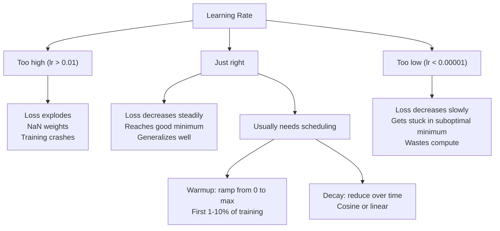
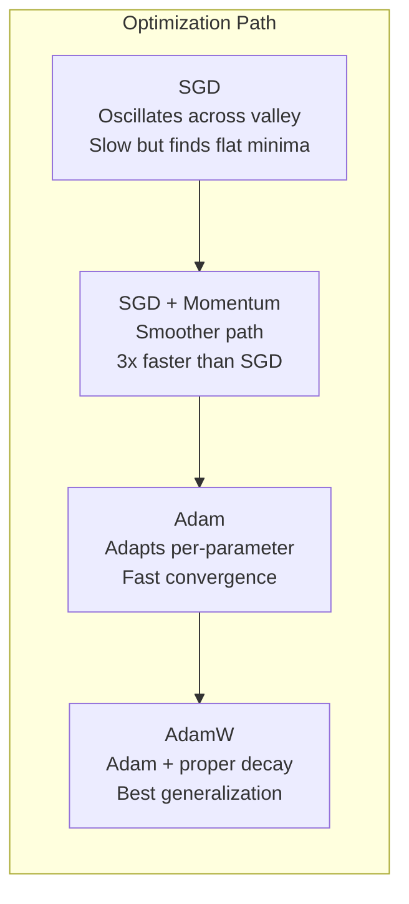
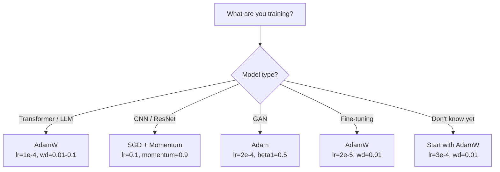

# 优化器

> 梯度下降告诉你应该朝哪个方向移动，却没有说明应该走多远、走多快。SGD 像指南针，Adam 则像掌握实时路况的 GPS。

**Type:** 构建
**Languages:** Python
**Prerequisites:** 第 03.05 课（损失函数）
**Time:** 约 75 分钟

## 学习目标

- 使用 Python 从零实现 SGD、带动量的 SGD、Adam 和 AdamW 优化器
- 解释 Adam 的偏差修正如何补偿训练初期从零初始化的矩估计
- 在同一任务上演示 AdamW 为何比采用 L2 正则化的 Adam 具有更好的泛化能力
- 为 Transformer、CNN、GAN 和微调任务选择合适的优化器与默认超参数

## 问题

你已经计算出梯度，也知道要降低损失，编号 4,721 的权重应该减小 0.003。但 0.003 使用什么单位？应乘以什么缩放因子？第 1 步与第 1,000 步应该移动相同距离吗？

最基础的梯度下降会在每一步对每个参数采用同一个学习率：w = w - lr * gradient。这会带来三个问题，使神经网络训练在实践中十分痛苦。

首先是振荡。损失曲面很少像一个平滑的碗，更像一条狭长的山谷。梯度指向横穿山谷的陡峭方向，而不是沿山谷前进的平缓方向。梯度下降会在狭窄维度上来回弹跳，却只能沿真正有用的方向缓慢前进。你可能见过这种现象：损失先快速下降，随后进入平台期；不是因为模型已经收敛，而是因为它正在振荡。

其次，对所有参数使用同一个学习率并不合理。有些权重需要较大更新，因为它们还处于训练早期、拟合不足；另一些权重已经接近最优值，只需要很小的更新。适合前者的学习率会破坏后者，反之亦然。

第三是鞍点。在高维空间中，损失曲面存在大片梯度接近零的平坦区域。普通 SGD 只能按照梯度的速度穿过它们，也就是几乎不动。模型看起来像是卡住了，其实只是处在一个平坦区域，而另一侧仍有可用的下降方向；但 SGD 没有推动自己穿过去的机制。

Adam 同时解决了这三个问题。它为每个参数维护两个移动平均：梯度均值，也就是动量，用于缓解振荡；以及梯度平方的均值，也就是自适应速率，用于处理不同尺度。再结合训练最初几步的偏差修正，就得到一个使用默认超参数便能解决 80% 问题的优化器。本课会从零实现它，让你准确理解它在剩余 20% 的问题中为何以及何时失效。

## 核心概念

### 随机梯度下降（SGD）

这是最简单的优化器。先在一个小批次上计算梯度，再向梯度的相反方向迈出一步。

```
w = w - lr * gradient
```

“随机”意味着使用随机数据子集，也就是小批次，来估计梯度，而不是使用完整数据集。这种噪声其实很有用，可以帮助模型逃离尖锐的局部极小值，但也会导致振荡。

学习率是唯一可调旋钮。过高时损失会发散；过低时训练会耗费极长时间。最佳取值取决于架构、数据、批大小以及当前训练阶段。现代网络采用普通 SGD 时，典型学习率在 0.01 到 0.1 之间。但即使在同一次训练中，理想学习率也会不断变化。

### 动量

“小球滚下山坡”的比喻虽然被用得太多，却确实准确。更新时不再只使用当前梯度，而是维护一个累积历史梯度的速度。

```
m_t = beta * m_{t-1} + gradient
w = w - lr * m_t
```

Beta 通常取 0.9，用来控制保留多少历史信息。当 beta = 0.9 时，动量大致相当于最近 10 个梯度的平均值，因为 1 / (1 - 0.9) = 10。

它能缓解振荡，是因为指向同一方向的梯度会不断累积，而反复改变方向的梯度会彼此抵消。在狭长山谷中，“横向”分量每一步都会变号，因此被抑制；“纵向”分量始终一致，因此得到增强。最终，优化器会沿有用方向平滑加速。

来看具体数字：在条件很差的损失曲面上，普通 SGD 可能需要 10,000 步；带动量的 SGD（beta=0.9）在同一问题上通常只需 3,000–5,000 步。这不是微不足道的加速。

### RMSProp

这是第一个真正有效的逐参数自适应学习率方法。Hinton 在 Coursera 课程中提出了它，但从未正式发表论文。

```
s_t = beta * s_{t-1} + (1 - beta) * gradient^2
w = w - lr * gradient / (sqrt(s_t) + epsilon)
```

s_t 追踪梯度平方的移动平均。梯度持续较大的参数会除以较大的数，因此有效学习率更小；梯度较小的参数会除以较小的数，因此有效学习率更大。

这解决了“所有参数共用一个学习率”的问题。一个持续进行大幅更新的权重可能已经接近目标，因此应让它慢下来；一个只能获得微小更新的权重可能训练不足，因此应让它加速。

Epsilon 通常取 1e-8，用于防止尚未更新的参数发生除零错误。

### Adam：动量 + RMSProp

Adam 结合了上述两种思想，为每个参数维护两个指数移动平均：

```
m_t = beta1 * m_{t-1} + (1 - beta1) * gradient        (first moment: mean)
v_t = beta2 * v_{t-1} + (1 - beta2) * gradient^2       (second moment: variance)
```

**偏差修正**是许多讲解会略过的关键细节。在第 1 步，m_1 = (1 - beta1) * gradient。当 beta1 = 0.9 时，它只有 0.1 * gradient，比应有值小了十倍，因为移动平均还没有完成预热。偏差修正会补偿这一点：

```
m_hat = m_t / (1 - beta1^t)
v_hat = v_t / (1 - beta2^t)
```

第 1 步且 beta1 = 0.9 时，m_hat = m_1 / (1 - 0.9) = m_1 / 0.1，正好等于实际梯度。到第 100 步时，(1 - 0.9^100) 已经约等于 1.0，修正项也就自然消失。偏差修正对最初约 10 步很重要，50 步之后基本可以忽略。

最终更新为：

```
w = w - lr * m_hat / (sqrt(v_hat) + epsilon)
```

Adam 的默认值为：lr = 0.001、beta1 = 0.9、beta2 = 0.999、epsilon = 1e-8。这组默认值适用于 80% 的问题。如果效果不好，先调整 lr，其次调整 beta2，几乎永远不需要改 beta1 或 epsilon。

### AdamW：正确实现权重衰减

L2 正则化会把 lambda * w^2 加入损失。在普通 SGD 中，它等价于权重衰减，也就是每一步从权重中减去 lambda * w；但在 Adam 中，这种等价关系不再成立。

Loshchilov 与 Hutter 的关键洞见是：如果把 L2 加入损失，再由 Adam 处理梯度，自适应学习率也会缩放正则项。梯度方差较大的参数受到的正则化更弱，方差较小的参数受到的正则化更强。这并不是我们想要的结果，因为无论梯度统计如何，正则化都应该保持一致。

AdamW 在 Adam 更新完成后，直接对权重施加衰减，从而修复这个问题：

```
w = w - lr * m_hat / (sqrt(v_hat) + epsilon) - lr * lambda * w
```

权重衰减项 lr * lambda * w 不会被 Adam 的自适应因子缩放，每个参数都会按相同比例收缩。

这看似只是一个小细节，实际上并非如此。在几乎所有任务上，AdamW 都能收敛到比 Adam + L2 正则化更好的解。它是 PyTorch 训练 Transformer、扩散模型及大多数现代架构时的默认优化器。BERT、GPT、LLaMA、Stable Diffusion 都使用 AdamW 训练。

### 学习率：最重要的超参数



如果只调一个超参数，就调学习率。学习率变化 10 倍带来的影响，比你作出的任何架构选择都大。常见默认值如下：

- SGD：lr = 0.01 到 0.1
- Adam/AdamW：lr = 1e-4 到 3e-4
- 微调预训练模型：lr = 1e-5 到 5e-5
- 学习率预热：在最初 1%–10% 的步骤中线性提升

### 优化器比较



### 每种优化器适用于何时



```figure
optimizer-trajectory
```

## 动手构建

### 第 1 步：普通 SGD

```python
class SGD:
    def __init__(self, lr=0.01):
        self.lr = lr

    def step(self, params, grads):
        for i in range(len(params)):
            params[i] -= self.lr * grads[i]
```

### 第 2 步：带动量的 SGD

```python
class SGDMomentum:
    def __init__(self, lr=0.01, beta=0.9):
        self.lr = lr
        self.beta = beta
        self.velocities = None

    def step(self, params, grads):
        if self.velocities is None:
            self.velocities = [0.0] * len(params)
        for i in range(len(params)):
            self.velocities[i] = self.beta * self.velocities[i] + grads[i]
            params[i] -= self.lr * self.velocities[i]
```

### 第 3 步：Adam

```python
import math

class Adam:
    def __init__(self, lr=0.001, beta1=0.9, beta2=0.999, epsilon=1e-8):
        self.lr = lr
        self.beta1 = beta1
        self.beta2 = beta2
        self.epsilon = epsilon
        self.m = None
        self.v = None
        self.t = 0

    def step(self, params, grads):
        if self.m is None:
            self.m = [0.0] * len(params)
            self.v = [0.0] * len(params)

        self.t += 1

        for i in range(len(params)):
            self.m[i] = self.beta1 * self.m[i] + (1 - self.beta1) * grads[i]
            self.v[i] = self.beta2 * self.v[i] + (1 - self.beta2) * grads[i] ** 2

            m_hat = self.m[i] / (1 - self.beta1 ** self.t)
            v_hat = self.v[i] / (1 - self.beta2 ** self.t)

            params[i] -= self.lr * m_hat / (math.sqrt(v_hat) + self.epsilon)
```

### 第 4 步：AdamW

```python
class AdamW:
    def __init__(self, lr=0.001, beta1=0.9, beta2=0.999, epsilon=1e-8, weight_decay=0.01):
        self.lr = lr
        self.beta1 = beta1
        self.beta2 = beta2
        self.epsilon = epsilon
        self.weight_decay = weight_decay
        self.m = None
        self.v = None
        self.t = 0

    def step(self, params, grads):
        if self.m is None:
            self.m = [0.0] * len(params)
            self.v = [0.0] * len(params)

        self.t += 1

        for i in range(len(params)):
            self.m[i] = self.beta1 * self.m[i] + (1 - self.beta1) * grads[i]
            self.v[i] = self.beta2 * self.v[i] + (1 - self.beta2) * grads[i] ** 2

            m_hat = self.m[i] / (1 - self.beta1 ** self.t)
            v_hat = self.v[i] / (1 - self.beta2 ** self.t)

            params[i] -= self.lr * m_hat / (math.sqrt(v_hat) + self.epsilon)
            params[i] -= self.lr * self.weight_decay * params[i]
```

### 第 5 步：训练对比

使用全部四种优化器，在第 05 课的圆形数据集上训练同一个双层网络，并比较收敛速度。

```python
import random

def sigmoid(x):
    x = max(-500, min(500, x))
    return 1.0 / (1.0 + math.exp(-x))

def make_circle_data(n=200, seed=42):
    random.seed(seed)
    data = []
    for _ in range(n):
        x = random.uniform(-2, 2)
        y = random.uniform(-2, 2)
        label = 1.0 if x * x + y * y < 1.5 else 0.0
        data.append(([x, y], label))
    return data


class OptimizerTestNetwork:
    def __init__(self, optimizer, hidden_size=8):
        random.seed(0)
        self.hidden_size = hidden_size
        self.optimizer = optimizer

        self.w1 = [[random.gauss(0, 0.5) for _ in range(2)] for _ in range(hidden_size)]
        self.b1 = [0.0] * hidden_size
        self.w2 = [random.gauss(0, 0.5) for _ in range(hidden_size)]
        self.b2 = 0.0

    def get_params(self):
        params = []
        for row in self.w1:
            params.extend(row)
        params.extend(self.b1)
        params.extend(self.w2)
        params.append(self.b2)
        return params

    def set_params(self, params):
        idx = 0
        for i in range(self.hidden_size):
            for j in range(2):
                self.w1[i][j] = params[idx]
                idx += 1
        for i in range(self.hidden_size):
            self.b1[i] = params[idx]
            idx += 1
        for i in range(self.hidden_size):
            self.w2[i] = params[idx]
            idx += 1
        self.b2 = params[idx]

    def forward(self, x):
        self.x = x
        self.z1 = []
        self.h = []
        for i in range(self.hidden_size):
            z = self.w1[i][0] * x[0] + self.w1[i][1] * x[1] + self.b1[i]
            self.z1.append(z)
            self.h.append(max(0.0, z))

        self.z2 = sum(self.w2[i] * self.h[i] for i in range(self.hidden_size)) + self.b2
        self.out = sigmoid(self.z2)
        return self.out

    def compute_grads(self, target):
        eps = 1e-15
        p = max(eps, min(1 - eps, self.out))
        d_loss = -(target / p) + (1 - target) / (1 - p)
        d_sigmoid = self.out * (1 - self.out)
        d_out = d_loss * d_sigmoid

        grads = [0.0] * (self.hidden_size * 2 + self.hidden_size + self.hidden_size + 1)
        idx = 0
        for i in range(self.hidden_size):
            d_relu = 1.0 if self.z1[i] > 0 else 0.0
            d_h = d_out * self.w2[i] * d_relu
            grads[idx] = d_h * self.x[0]
            grads[idx + 1] = d_h * self.x[1]
            idx += 2

        for i in range(self.hidden_size):
            d_relu = 1.0 if self.z1[i] > 0 else 0.0
            grads[idx] = d_out * self.w2[i] * d_relu
            idx += 1

        for i in range(self.hidden_size):
            grads[idx] = d_out * self.h[i]
            idx += 1

        grads[idx] = d_out
        return grads

    def train(self, data, epochs=300):
        losses = []
        for epoch in range(epochs):
            total_loss = 0.0
            correct = 0
            for x, y in data:
                pred = self.forward(x)
                grads = self.compute_grads(y)
                params = self.get_params()
                self.optimizer.step(params, grads)
                self.set_params(params)

                eps = 1e-15
                p = max(eps, min(1 - eps, pred))
                total_loss += -(y * math.log(p) + (1 - y) * math.log(1 - p))
                if (pred >= 0.5) == (y >= 0.5):
                    correct += 1
            avg_loss = total_loss / len(data)
            accuracy = correct / len(data) * 100
            losses.append((avg_loss, accuracy))
            if epoch % 75 == 0 or epoch == epochs - 1:
                print(f"    Epoch {epoch:3d}: loss={avg_loss:.4f}, accuracy={accuracy:.1f}%")
        return losses
```

## 实际应用

PyTorch 优化器可以处理参数组、梯度裁剪和学习率调度：

```python
import torch
import torch.optim as optim

model = torch.nn.Sequential(
    torch.nn.Linear(784, 256),
    torch.nn.ReLU(),
    torch.nn.Linear(256, 10),
)

optimizer = optim.AdamW(model.parameters(), lr=3e-4, weight_decay=0.01)

scheduler = optim.lr_scheduler.CosineAnnealingLR(optimizer, T_max=100)

for epoch in range(100):
    optimizer.zero_grad()
    output = model(torch.randn(32, 784))
    loss = torch.nn.functional.cross_entropy(output, torch.randint(0, 10, (32,)))
    loss.backward()
    torch.nn.utils.clip_grad_norm_(model.parameters(), max_norm=1.0)
    optimizer.step()
    scheduler.step()
```

执行顺序始终是：zero_grad、forward、loss、backward、可选的 clip、step、可选的 schedule。请记住这个顺序。顺序错误，例如在 optimizer.step() 之前调用 scheduler.step()，是许多隐蔽缺陷的常见来源。

训练 CNN 时，许多实践者仍然偏爱带动量的 SGD（lr=0.1、momentum=0.9、weight_decay=1e-4），并配合阶梯式或余弦调度。SGD 会找到更平坦的极小值，往往具有更好的泛化能力。对于 Transformer 和 LLM，带预热与余弦衰减的 AdamW 是通用默认选择。除非有可衡量的理由，否则不必挑战这一共识。

## 交付成果

本课会产出：
- `outputs/prompt-optimizer-selector.md`——帮助你为任意架构选择正确优化器和学习率的决策提示词

## 练习

1. 实现 Nesterov 动量：不在当前位置，而是在“前瞻”位置（w - lr * beta * v）计算梯度。在圆形数据集上比较它与标准动量的收敛速度。

2. 实现学习率预热调度：在训练最初 10% 的步骤中，从 0 线性提升到 max_lr，随后按余弦衰减到 0。比较带预热的 Adam 与不带预热的 Adam，测量在圆形数据集上达到 90% 准确率各需多少个 epoch。

3. 追踪 Adam 训练期间每个参数的有效学习率。有效更新量是 lr * m_hat / (sqrt(v_hat) + eps)。绘制第 10、50 和 200 步后有效更新量的分布。所有参数都以相同速度更新吗？

4. 实现按全局范数裁剪梯度，把最大梯度范数设为 1.0。使用较高学习率，也就是 Adam 的 lr=0.01，分别采用和不采用裁剪进行训练。在 10 个随机种子上统计有多少次运行会发散，也就是损失变为 NaN。

5. 在具有较大权重的网络上比较 Adam 与 AdamW。把所有权重初始化为 [-5, 5] 中的随机值，这比正常值大得多。使用 weight_decay=0.1 训练 200 个 epoch，绘制两种优化器训练期间的权重 L2 范数。AdamW 应该表现出更快的权重收缩。

## 关键术语

| 术语 | 人们常说 | 实际含义 |
|------|----------------|----------------------|
| 学习率 | “更新步长” | 梯度更新中的标量乘数，是训练过程中影响最大的单个超参数 |
| SGD | “最基础的梯度下降” | 随机梯度下降：减去 lr * gradient 来更新权重，梯度由一个小批次计算 |
| 动量 | “像小球滚下坡那样累积速度” | 历史梯度的指数移动平均，可以抑制振荡并加速一致方向上的移动 |
| RMSProp | “按参数自适应调整学习率” | 用近期梯度的均方根移动平均除每个参数的梯度，使不同参数的学习率趋于均衡 |
| Adam | “常用默认优化器” | 把动量（一阶矩）与 RMSProp（二阶矩）结合起来，并对初始步骤进行偏差修正 |
| AdamW | “加入正确权重衰减的 Adam” | 使用解耦权重衰减的 Adam；直接对权重应用正则化，而不是通过梯度应用 |
| 偏差修正 | “给移动平均做预热补偿” | 除以 (1 - beta^t)，补偿 Adam 矩估计从零初始化造成的偏差 |
| 权重衰减 | “缩小权重” | 每一步都减去权重值的一定比例；用于惩罚过大权重的正则化方法 |
| 学习率调度 | “随时间改变 lr” | 训练期间调整学习率的函数；预热 + 余弦衰减是现代默认方案 |
| 梯度裁剪 | “限制梯度范数” | 当梯度向量范数超过阈值时按比例缩小，防止梯度爆炸式更新 |

## 延伸阅读

- Kingma 与 Ba，《Adam: A Method for Stochastic Optimization》（2014）——包含收敛分析和偏差修正推导的 Adam 原始论文
- Loshchilov 与 Hutter，《Decoupled Weight Decay Regularization》（2017）——证明 L2 正则化与权重衰减在 Adam 中并不等价，并提出 AdamW
- Smith，《Cyclical Learning Rates for Training Neural Networks》（2017）——提出学习率范围测试和周期调度，无需再调节固定学习率
- Ruder，《An Overview of Gradient Descent Optimization Algorithms》（2016）——对各种优化器变体最出色的综合综述，比较清晰、直觉易懂
