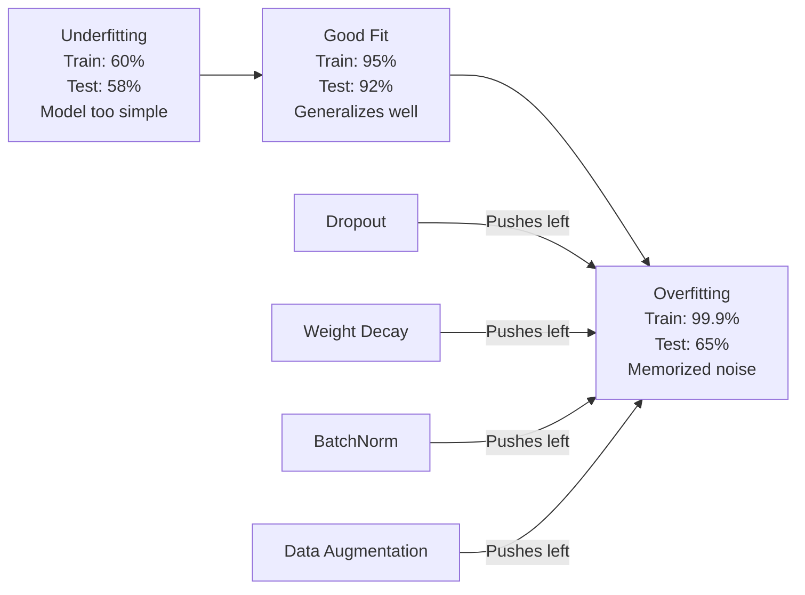
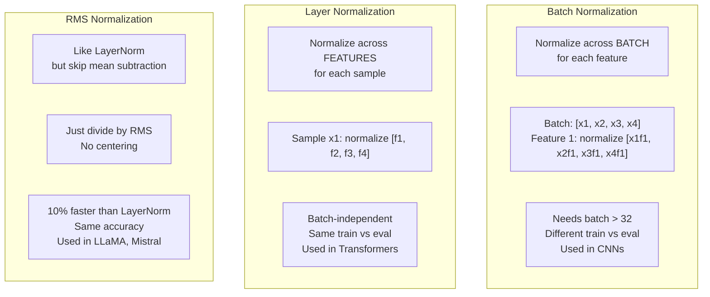
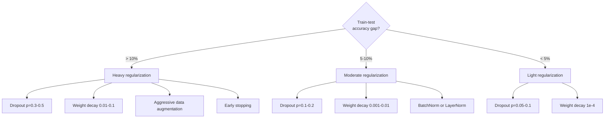

# 正则化

> 模型在训练数据上达到 99%，在测试数据上却只有 60%。它记住了数据，而非学会了规律。正则化就是向复杂度征税，迫使模型具备泛化能力。

**Type:** 构建
**Languages:** Python
**Prerequisites:** 第 03.06 课（优化器）
**Time:** 约 75 分钟

## 学习目标

- 从零实现带反向缩放的 Dropout、L2 权重衰减、批归一化、层归一化和 RMSNorm
- 测量训练—测试准确率差距，并通过正则化实验诊断过拟合
- 解释 Transformer 为何使用 LayerNorm 而非 BatchNorm，以及现代 LLM 为何偏爱 RMSNorm
- 根据过拟合的严重程度，应用正确的正则化技术组合

## 问题

只要参数足够多，神经网络就能记住任何数据集。这不是假设：Zhang 等人（2017）使用随机标签训练标准网络，证明了这一点。面对完全随机分配的 ImageNet 标签，网络仍然把训练损失降到了接近零。它记住了一百万对毫无规律可学的随机输入—输出。训练损失完美，测试准确率却为零。

这就是过拟合问题，而且模型越大，问题越严重。GPT-3 拥有 1750 亿个参数，训练集约有 5000 亿个 token。如此多的参数足以让模型逐字记住训练数据中的大量片段。如果没有正则化，它只会复述训练样本，而不是学习能够泛化的模式。

训练性能与测试性能之间的差距称为泛化差距，也就是过拟合差距。本课中的每一种技术都会从不同角度缩小这一差距。Dropout 迫使网络不能依赖任何单个神经元；权重衰减防止单个权重增长得过大；批归一化平滑损失曲面，使优化器找到更平坦、泛化更好的极小值；层归一化实现类似效果，却能在批归一化失效的场景中工作，例如小批次和变长序列；RMSNorm 省去均值计算，速度再快约 10%。每项技术都很简单，但组合起来，就构成了只会记忆的模型与真正能够泛化的模型之间的差别。

## 核心概念

### 过拟合光谱

每个模型都位于一条光谱上的某处：一端是欠拟合，模型过于简单，无法捕捉模式；另一端是过拟合，模型复杂到把噪声也纳入其中。最佳位置位于两者之间，正则化则会把模型从过拟合一侧推向这个位置。



### Dropout

这是最简单、同时也具有最优雅解释的正则化技术。训练期间，以概率 p 随机把每个神经元的输出设为零。

```
output = activation(z) * mask    where mask[i] ~ Bernoulli(1 - p)
```

当 p = 0.5 时，每次前向传播都会把一半神经元置零。因为网络无法预知哪些神经元可用，只能学习冗余表示。这可以防止共适应，也就是某些神经元学会依赖另一些特定神经元始终存在。

从集成角度理解：包含 N 个神经元并使用 Dropout 的网络，会产生 2^N 个可能的子网络，也就是神经元开关状态的每种组合。使用 Dropout 训练，近似于同时训练全部 2^N 个子网络，每个子网络处理不同的小批次。测试时使用全部神经元，不再 Dropout，并把输出乘以 (1 - p)，使其与训练期间的期望值一致。这相当于对 2^N 个子网络的预测取平均，也就是用一个模型构建了庞大的集成。

实践中，缩放通常放在训练时执行，而不是测试时，这称为反向 Dropout：

```
During training:  output = activation(z) * mask / (1 - p)
During testing:   output = activation(z)   (no change needed)
```

这样更简洁，因为测试代码完全不需要知道 Dropout 的存在。

默认概率通常为：Transformer 使用 p = 0.1，MLP 使用 p = 0.5，CNN 使用 p = 0.2–0.3。Dropout 越高，正则化越强，欠拟合风险也越高。

### 权重衰减（L2 正则化）

把所有权重的平方和加入损失：

```
total_loss = task_loss + (lambda / 2) * sum(w_i^2)
```

正则项的梯度是 lambda * w。这意味着每一步都会按与当前幅度成正比的程度，把每个权重向零收缩；大权重受到的惩罚更强。模型会被推向没有任何单个权重占据支配地位的解。

它能改善泛化，是因为过拟合模型往往拥有较大的权重，会放大训练数据中的噪声。权重衰减让权重保持较小，限制模型的有效容量，迫使模型依赖稳健、可泛化的特征，而不是记住偶然细节。

lambda 超参数控制正则化强度，典型值包括：

- Transformer 使用 AdamW 时取 0.01
- CNN 使用 SGD 时取 1e-4
- 严重过拟合的模型取 0.1

正如第 06 课所述，权重衰减与 L2 正则化在 SGD 中等价，在 Adam 中却不等价。使用 Adam 训练时，应始终选择带解耦权重衰减的 AdamW。

### 批归一化

在把某一层的输出传给下一层之前，跨小批次进行归一化。

对于某层的一批激活值：

```
mu = (1/B) * sum(x_i)           (batch mean)
sigma^2 = (1/B) * sum((x_i - mu)^2)   (batch variance)
x_hat = (x_i - mu) / sqrt(sigma^2 + eps)   (normalize)
y = gamma * x_hat + beta        (scale and shift)
```

Gamma 与 beta 是可学习参数，允许网络在最优情况下撤销归一化。如果没有它们，就等于强迫每层输出都保持零均值、单位方差，而这未必是网络想要的结果。

**训练与推理的差异：** 训练期间，mu 和 sigma 来自当前小批次；推理时，则使用训练期间累计的移动平均。这里使用 momentum = 0.1 的指数移动平均，也就是 90% 的旧值加 10% 的新值。

BatchNorm 为何有效至今仍有争议。原始论文认为它减少了“内部协变量偏移”，也就是前面层更新后，当前层输入分布随之变化。Santurkar 等人（2018）证明这种解释并不正确。真正的原因是 BatchNorm 会让损失曲面更平滑，使梯度更具预测性，Lipschitz 常数更小，优化器因而能安全地迈出更大步伐。这也是 BatchNorm 允许使用更高学习率并加快收敛的原因。

BatchNorm 有一个根本限制：它依赖批次统计量。批大小为 1 时，均值和方差毫无意义；批次较小（小于 32）时，统计量噪声很大，会损害性能。这对目标检测等受内存限制、批大小较小的任务，以及序列长度变化的语言建模任务尤其重要。

### 层归一化

层归一化不是跨批次，而是跨特征进行归一化。对于单个样本：

```
mu = (1/D) * sum(x_j)           (feature mean)
sigma^2 = (1/D) * sum((x_j - mu)^2)   (feature variance)
x_hat = (x_j - mu) / sqrt(sigma^2 + eps)
y = gamma * x_hat + beta
```

D 是特征维度。每个样本都独立归一化，不依赖批大小。这就是 Transformer 使用 LayerNorm 而不是 BatchNorm 的原因。序列长度可变，批大小通常很小，生成期间甚至只有 1，而且训练与推理时的计算完全相同。

Transformer 中的 LayerNorm 会应用于每个自注意力块和前馈块之后，也就是 Post-LN；或者应用在它们之前，也就是 Pre-LN，后者训练更稳定。

### RMSNorm

RMSNorm 是不减均值的 LayerNorm，由 Zhang 与 Sennrich 于 2019 年提出。

```
rms = sqrt((1/D) * sum(x_j^2))
y = gamma * x / rms
```

就这么简单：不计算均值，也没有 beta 参数。它依据的观察是，LayerNorm 中重新居中，也就是减去均值，对模型性能贡献很小，却需要额外计算。移除这一步后，准确率相当，开销却降低约 10%。

LLaMA、LLaMA 2、LLaMA 3、Mistral 和大多数现代 LLM 都使用 RMSNorm，而非 LayerNorm。在数十亿参数和数万亿 token 的规模下，节省 10% 具有重大意义。

### 归一化方法比较



### 数据增强也是正则化

它不是修改模型，而是修改数据。在保持标签不变的前提下变换训练输入：

- 图像：随机裁剪、翻转、旋转、颜色抖动、随机遮挡
- 文本：同义词替换、回译、随机删除
- 音频：时间拉伸、音高偏移、添加噪声

它的效果与正则化相同：增大训练集的有效规模，让模型更难记住具体样本。只见过每张图像原始版本一次的模型，可以把它记住；如果模型看到每张图像的 50 种增强版本，就只能学习其中保持不变的结构。

### 提前停止

这是最简单的正则化方法：当验证损失开始上升时停止训练，因为此时模型还没有进一步过拟合。实践中，每个 epoch 都要追踪验证损失，保存表现最佳的模型，并继续训练一个“耐心”窗口，通常是 5–20 个 epoch。如果验证损失在这个窗口内没有改善，就停止训练并加载此前保存的最佳模型。

### 应该使用哪些方法



```figure
l2-regularization
```

## 动手构建

### 第 1 步：Dropout（训练与评估模式）

```python
import random
import math


class Dropout:
    def __init__(self, p=0.5):
        self.p = p
        self.training = True
        self.mask = None

    def forward(self, x):
        if not self.training:
            return list(x)
        self.mask = []
        output = []
        for val in x:
            if random.random() < self.p:
                self.mask.append(0)
                output.append(0.0)
            else:
                self.mask.append(1)
                output.append(val / (1 - self.p))
        return output

    def backward(self, grad_output):
        grads = []
        for g, m in zip(grad_output, self.mask):
            if m == 0:
                grads.append(0.0)
            else:
                grads.append(g / (1 - self.p))
        return grads
```

### 第 2 步：L2 权重衰减

```python
def l2_regularization(weights, lambda_reg):
    penalty = 0.0
    for w in weights:
        penalty += w * w
    return lambda_reg * 0.5 * penalty

def l2_gradient(weights, lambda_reg):
    return [lambda_reg * w for w in weights]
```

### 第 3 步：批归一化

```python
class BatchNorm:
    def __init__(self, num_features, momentum=0.1, eps=1e-5):
        self.gamma = [1.0] * num_features
        self.beta = [0.0] * num_features
        self.eps = eps
        self.momentum = momentum
        self.running_mean = [0.0] * num_features
        self.running_var = [1.0] * num_features
        self.training = True
        self.num_features = num_features

    def forward(self, batch):
        batch_size = len(batch)
        if self.training:
            mean = [0.0] * self.num_features
            for sample in batch:
                for j in range(self.num_features):
                    mean[j] += sample[j]
            mean = [m / batch_size for m in mean]

            var = [0.0] * self.num_features
            for sample in batch:
                for j in range(self.num_features):
                    var[j] += (sample[j] - mean[j]) ** 2
            var = [v / batch_size for v in var]

            for j in range(self.num_features):
                self.running_mean[j] = (1 - self.momentum) * self.running_mean[j] + self.momentum * mean[j]
                self.running_var[j] = (1 - self.momentum) * self.running_var[j] + self.momentum * var[j]
        else:
            mean = list(self.running_mean)
            var = list(self.running_var)

        self.x_hat = []
        output = []
        for sample in batch:
            normalized = []
            out_sample = []
            for j in range(self.num_features):
                x_h = (sample[j] - mean[j]) / math.sqrt(var[j] + self.eps)
                normalized.append(x_h)
                out_sample.append(self.gamma[j] * x_h + self.beta[j])
            self.x_hat.append(normalized)
            output.append(out_sample)
        return output
```

### 第 4 步：层归一化

```python
class LayerNorm:
    def __init__(self, num_features, eps=1e-5):
        self.gamma = [1.0] * num_features
        self.beta = [0.0] * num_features
        self.eps = eps
        self.num_features = num_features

    def forward(self, x):
        mean = sum(x) / len(x)
        var = sum((xi - mean) ** 2 for xi in x) / len(x)

        self.x_hat = []
        output = []
        for j in range(self.num_features):
            x_h = (x[j] - mean) / math.sqrt(var + self.eps)
            self.x_hat.append(x_h)
            output.append(self.gamma[j] * x_h + self.beta[j])
        return output
```

### 第 5 步：RMSNorm

```python
class RMSNorm:
    def __init__(self, num_features, eps=1e-6):
        self.gamma = [1.0] * num_features
        self.eps = eps
        self.num_features = num_features

    def forward(self, x):
        rms = math.sqrt(sum(xi * xi for xi in x) / len(x) + self.eps)
        output = []
        for j in range(self.num_features):
            output.append(self.gamma[j] * x[j] / rms)
        return output
```

### 第 6 步：采用与不采用正则化进行训练

```python
def sigmoid(x):
    x = max(-500, min(500, x))
    return 1.0 / (1.0 + math.exp(-x))


def make_circle_data(n=200, seed=42):
    random.seed(seed)
    data = []
    for _ in range(n):
        x = random.uniform(-2, 2)
        y = random.uniform(-2, 2)
        label = 1.0 if x * x + y * y < 1.5 else 0.0
        data.append(([x, y], label))
    return data


class RegularizedNetwork:
    def __init__(self, hidden_size=16, lr=0.05, dropout_p=0.0, weight_decay=0.0):
        random.seed(0)
        self.hidden_size = hidden_size
        self.lr = lr
        self.dropout_p = dropout_p
        self.weight_decay = weight_decay
        self.dropout = Dropout(p=dropout_p) if dropout_p > 0 else None

        self.w1 = [[random.gauss(0, 0.5) for _ in range(2)] for _ in range(hidden_size)]
        self.b1 = [0.0] * hidden_size
        self.w2 = [random.gauss(0, 0.5) for _ in range(hidden_size)]
        self.b2 = 0.0

    def forward(self, x, training=True):
        self.x = x
        self.z1 = []
        self.h = []
        for i in range(self.hidden_size):
            z = self.w1[i][0] * x[0] + self.w1[i][1] * x[1] + self.b1[i]
            self.z1.append(z)
            self.h.append(max(0.0, z))

        if self.dropout and training:
            self.dropout.training = True
            self.h = self.dropout.forward(self.h)
        elif self.dropout:
            self.dropout.training = False
            self.h = self.dropout.forward(self.h)

        self.z2 = sum(self.w2[i] * self.h[i] for i in range(self.hidden_size)) + self.b2
        self.out = sigmoid(self.z2)
        return self.out

    def backward(self, target):
        eps = 1e-15
        p = max(eps, min(1 - eps, self.out))
        d_loss = -(target / p) + (1 - target) / (1 - p)
        d_sigmoid = self.out * (1 - self.out)
        d_out = d_loss * d_sigmoid

        for i in range(self.hidden_size):
            d_relu = 1.0 if self.z1[i] > 0 else 0.0
            d_h = d_out * self.w2[i] * d_relu
            self.w2[i] -= self.lr * (d_out * self.h[i] + self.weight_decay * self.w2[i])
            for j in range(2):
                self.w1[i][j] -= self.lr * (d_h * self.x[j] + self.weight_decay * self.w1[i][j])
            self.b1[i] -= self.lr * d_h
        self.b2 -= self.lr * d_out

    def evaluate(self, data):
        correct = 0
        total_loss = 0.0
        for x, y in data:
            pred = self.forward(x, training=False)
            eps = 1e-15
            p = max(eps, min(1 - eps, pred))
            total_loss += -(y * math.log(p) + (1 - y) * math.log(1 - p))
            if (pred >= 0.5) == (y >= 0.5):
                correct += 1
        return total_loss / len(data), correct / len(data) * 100

    def train_model(self, train_data, test_data, epochs=300):
        history = []
        for epoch in range(epochs):
            total_loss = 0.0
            correct = 0
            for x, y in train_data:
                pred = self.forward(x, training=True)
                self.backward(y)
                eps = 1e-15
                p = max(eps, min(1 - eps, pred))
                total_loss += -(y * math.log(p) + (1 - y) * math.log(1 - p))
                if (pred >= 0.5) == (y >= 0.5):
                    correct += 1
            train_loss = total_loss / len(train_data)
            train_acc = correct / len(train_data) * 100
            test_loss, test_acc = self.evaluate(test_data)
            history.append((train_loss, train_acc, test_loss, test_acc))
            if epoch % 75 == 0 or epoch == epochs - 1:
                gap = train_acc - test_acc
                print(f"    Epoch {epoch:3d}: train_acc={train_acc:.1f}%, test_acc={test_acc:.1f}%, gap={gap:.1f}%")
        return history
```

## 实际应用

PyTorch 把所有归一化和正则化方法都作为模块提供：

```python
import torch
import torch.nn as nn

model = nn.Sequential(
    nn.Linear(784, 256),
    nn.BatchNorm1d(256),
    nn.ReLU(),
    nn.Dropout(0.3),
    nn.Linear(256, 128),
    nn.BatchNorm1d(128),
    nn.ReLU(),
    nn.Dropout(0.3),
    nn.Linear(128, 10),
)

model.train()
out_train = model(torch.randn(32, 784))

model.eval()
out_test = model(torch.randn(1, 784))
```

`model.train()` / `model.eval()` 切换至关重要。它负责开关 Dropout，并告诉 BatchNorm 应使用批次统计量还是移动统计量。推理前忘记调用 `model.eval()` 是深度学习中最常见的错误之一。因为 Dropout 仍然启用，而且 BatchNorm 仍在使用小批次统计量，测试准确率会随机波动。

Transformer 使用的模式有所不同：

```python
class TransformerBlock(nn.Module):
    def __init__(self, d_model=512, nhead=8, dropout=0.1):
        super().__init__()
        self.attention = nn.MultiheadAttention(d_model, nhead, dropout=dropout)
        self.norm1 = nn.LayerNorm(d_model)
        self.ff = nn.Sequential(
            nn.Linear(d_model, d_model * 4),
            nn.GELU(),
            nn.Linear(d_model * 4, d_model),
            nn.Dropout(dropout),
        )
        self.norm2 = nn.LayerNorm(d_model)
        self.dropout = nn.Dropout(dropout)

    def forward(self, x):
        attended, _ = self.attention(x, x, x)
        x = self.norm1(x + self.dropout(attended))
        x = self.norm2(x + self.ff(x))
        return x
```

使用 LayerNorm，而不是 BatchNorm；Dropout 取 p=0.1，而不是 p=0.5。这些是 Transformer 的默认选择。

## 交付成果

本课会产出：
- `outputs/prompt-regularization-advisor.md`——诊断过拟合并推荐合适正则化策略的提示词

## 练习

1. 为二维数据实现空间 Dropout：不再丢弃单个神经元，而是丢弃完整特征通道。可以把连续特征组视为通道并整组丢弃，以此模拟。在 hidden_size=32 的圆形数据集上，将训练—测试差距与标准 Dropout 比较。

2. 把第 05 课的标签平滑与本课的 Dropout 结合起来。训练四种配置：两者都不用、只用 Dropout、只用标签平滑、两者都用。测量每种配置最终的训练—测试准确率差距。哪种组合的差距最小？

3. 在圆形数据集网络的隐藏层和激活函数之间加入 BatchNorm。分别使用 0.01、0.05、0.1 的学习率，比较采用与不采用 BatchNorm 的训练。BatchNorm 应能让网络在普通网络会发散的较高学习率下保持稳定训练。

4. 实现提前停止：每个 epoch 追踪测试损失，保存最佳权重；如果测试损失连续 20 个 epoch 没有改善，就停止训练。让正则化网络最多运行 1000 个 epoch。报告测试准确率最高的是哪个 epoch，以及节省了多少个 epoch 的计算。

5. 在四层网络，而不只是双层网络上比较 LayerNorm 与 RMSNorm。用相同权重初始化两者，训练 200 个 epoch，并比较最终准确率、每个 epoch 的训练时间，以及第一层的梯度幅度。验证 RMSNorm 能在准确率相同的情况下运行得更快。

## 关键术语

| 术语 | 人们常说 | 实际含义 |
|------|----------------|----------------------|
| 过拟合 | “模型记住了数据” | 训练性能显著高于测试性能，表明模型学到了噪声，而不是真实信号 |
| 正则化 | “防止过拟合” | 通过约束模型复杂度来改善泛化的任何技术，例如 Dropout、权重衰减、归一化和数据增强 |
| Dropout | “随机删除神经元” | 训练时以概率 p 随机把神经元置零，迫使模型学习冗余表示；等价于训练一个集成 |
| 权重衰减 | “L2 惩罚” | 每一步减去 lambda * w，把所有权重向零收缩；通过限制权重幅度惩罚复杂度 |
| 批归一化 | “按批次归一化” | 训练时使用批次统计量、推理时使用移动平均，跨批次维度归一化层输出 |
| 层归一化 | “按样本归一化” | 在单个样本内部跨特征归一化；不依赖批次，适合批大小变化的 Transformer |
| RMSNorm | “不减均值的 LayerNorm” | 均方根归一化；去除 LayerNorm 中的均值减法，在准确率相当时提速约 10% |
| 提前停止 | “在过拟合前停下” | 验证损失停止改善时终止训练；最简单的正则化方法，通常与其他方法配合使用 |
| 数据增强 | “用少量数据得到更多数据” | 对训练输入进行翻转、裁剪、加噪等变换，增大有效数据集并迫使模型学习不变性 |
| 泛化差距 | “训练—测试差距” | 训练性能与测试性能之差；正则化的目标是缩小这一差距 |

## 延伸阅读

- Srivastava 等，《Dropout: A Simple Way to Prevent Neural Networks from Overfitting》（2014）——提出 Dropout、给出集成解释并开展大量实验的原始论文
- Ioffe 与 Szegedy，《Batch Normalization: Accelerating Deep Network Training by Reducing Internal Covariate Shift》（2015）——提出 BatchNorm 及其训练过程，是引用最多的深度学习论文之一
- Zhang 与 Sennrich，《Root Mean Square Layer Normalization》（2019）——证明 RMSNorm 以更少计算达到与 LayerNorm 相当的准确率，后来被 LLaMA 和 Mistral 采用
- Zhang 等，《Understanding Deep Learning Requires Rethinking Generalization》（2017）——证明神经网络可以记住随机标签、挑战传统泛化观念的里程碑论文
