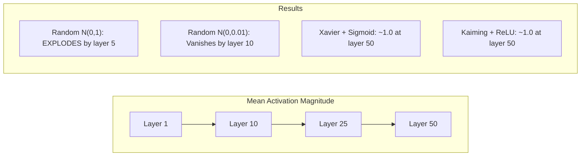
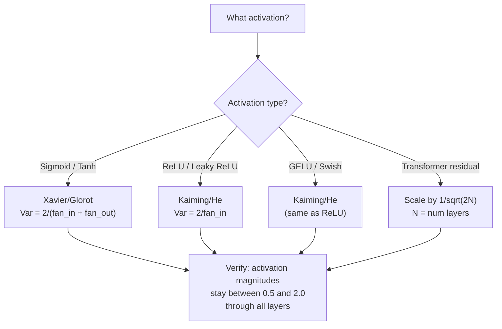

# 权重初始化与训练稳定性

> 初始化错误，训练根本不会开始；初始化正确，50 层网络也能像 3 层网络一样平稳训练。

**Type:** 构建
**Languages:** Python
**Prerequisites:** 第 03.04 课（激活函数）、第 03.07 课（正则化）
**Time:** 约 90 分钟

## 学习目标

- 实现零初始化、随机初始化、Xavier/Glorot 和 Kaiming/He 初始化策略，并测量它们对信号经过 50 层时激活幅度的影响
- 推导 Xavier 初始化为何使用 Var(w) = 2/(fan_in + fan_out)，Kaiming 初始化为何使用 Var(w) = 2/fan_in
- 演示零初始化造成的对称性问题，并解释为何仅仅随机初始化仍然不够
- 为激活函数匹配正确初始化策略：Sigmoid/Tanh 使用 Xavier，ReLU/GELU 使用 Kaiming

## 问题

把所有权重初始化为零，网络什么都学不到。每个神经元计算相同函数，接收相同梯度，并以相同方式更新。训练 10,000 个 epoch 后，包含 512 个神经元的隐藏层仍然只是同一个神经元的 512 份副本。你用了 512 个参数，却只发挥出 1 个参数的作用。

如果初始化值过大，激活值会在网络中不断爆炸。到第 10 层，数值达到 1e15；到第 20 层，溢出为无穷大。梯度沿相反方向传播时，也会走上同样的轨迹。

如果从标准正态分布中随机初始化，三层网络可以工作；到了 50 层，信号会坍缩为零或爆炸到无穷大，具体取决于随机尺度是略小还是略大。能用与彻底失效之间的界线薄如刀锋。

权重初始化是深度学习中最被低估的决策。架构会成为论文主题，优化器会得到大量博客讨论，初始化却常常只占一个脚注。但如果初始化错误，其他一切都没有意义——网络在训练开始前就已经死亡。

## 核心概念

### 对称性问题

同一层中的每个神经元都拥有相同结构：输入乘权重，加上偏置，再应用激活函数。如果所有权重从相同数值开始，零是最极端的情况，每个神经元都会计算相同输出。反向传播时，它们收到相同梯度；更新时，它们也改变相同幅度。

网络因此陷入僵局。虽然拥有数百个参数，它们却完全同步移动。这种情况称为对称性，而随机初始化是打破对称性的直接方法。每个神经元从权重空间中的不同位置出发，因而能够学习不同特征。

但只有“随机”还不够。随机数的*尺度*决定网络究竟能否训练。

### 方差如何逐层传播

考虑一个有 fan_in 个输入的层：

```
z = w1*x1 + w2*x2 + ... + w_n*x_n
```

如果每个权重 wi 都从方差为 Var(w) 的分布中抽取，每个输入 xi 的方差为 Var(x)，那么输出方差为：

```
Var(z) = fan_in * Var(w) * Var(x)
```

如果 Var(w) = 1 且 fan_in = 512，输出方差就是输入方差的 512 倍。经过 10 层后：512^10 = 1.2e27，信号已经爆炸。

如果 Var(w) = 0.001，每层输出方差会缩小为输入的 0.001 * 512 = 0.512。经过 10 层后：0.512^10 = 0.00013，信号已经消失。

目标是选择合适的 Var(w)，使 Var(z) = Var(x)，让信号幅度在各层之间保持稳定。

### Xavier/Glorot 初始化

Glorot 与 Bengio（2010）为 Sigmoid 和 Tanh 激活推导出了解法。为了让前向与反向传播中的方差都保持不变：

```
Var(w) = 2 / (fan_in + fan_out)
```

实践中，权重可以从以下分布抽取：

```
w ~ Uniform(-limit, limit)  where limit = sqrt(6 / (fan_in + fan_out))
```

或者：

```
w ~ Normal(0, sqrt(2 / (fan_in + fan_out)))
```

它之所以有效，是因为正确初始化后，激活值会位于接近零的区域，而 Sigmoid 与 Tanh 在这里近似线性。即使信号穿过数十层，方差也能保持稳定。

### Kaiming/He 初始化

ReLU 会把一半输出清零，也就是所有负值。有效 fan_in 因而减半，因为平均有一半输入被置零。Xavier 初始化没有考虑这一点，会低估所需方差。

He 等人（2015）对公式作了调整：

```
Var(w) = 2 / fan_in
```

权重从以下分布抽取：

```
w ~ Normal(0, sqrt(2 / fan_in))
```

因子 2 用来补偿 ReLU 把一半激活值清零的影响。没有这个因子，信号每层都会缩小约 0.5 倍；经过 50 层后，0.5^50 = 8.8e-16。Kaiming 初始化可以防止这种情况。

### Transformer 初始化

GPT-2 引入了另一种模式。残差连接会把每个子层输出加回输入：

```
x = x + sublayer(x)
```

每次相加都会增大方差。经过 N 个残差层后，方差会与 N 成正比增长。GPT-2 将残差层权重按 1/sqrt(2N) 缩放，其中 N 是层数，从而让累积信号幅度保持稳定。

Llama 3 拥有 4050 亿参数和 126 层，也采用类似方案。如果没有这种缩放，残差流穿过 126 层注意力块和前馈块后会无限增长。

```mermaid
flowchart TD
    subgraph "Zero Init"
        Z1["Layer 1<br/>All weights = 0"] --> Z2["Layer 2<br/>All neurons identical"]
        Z2 --> Z3["Layer 3<br/>Still identical"]
        Z3 --> ZR["Result: 1 effective neuron<br/>regardless of width"]
    end

    subgraph "Xavier Init"
        X1["Layer 1<br/>Var = 2/(fan_in+fan_out)"] --> X2["Layer 2<br/>Signal stable"]
        X2 --> X3["Layer 50<br/>Signal stable"]
        X3 --> XR["Result: Trains with<br/>sigmoid/tanh"]
    end

    subgraph "Kaiming Init"
        K1["Layer 1<br/>Var = 2/fan_in"] --> K2["Layer 2<br/>Signal stable"]
        K2 --> K3["Layer 50<br/>Signal stable"]
        K3 --> KR["Result: Trains with<br/>ReLU/GELU"]
    end
```



### 信号经过 50 层后的激活幅度



### 选择正确的初始化



```figure
weight-init-variance
```

## 动手构建

### 第 1 步：初始化策略

下面用四种方式初始化权重矩阵。每个函数都返回一个二维列表，其中有 fan_in 列、fan_out 行。

```python
import math
import random


def zero_init(fan_in, fan_out):
    return [[0.0 for _ in range(fan_in)] for _ in range(fan_out)]


def random_init(fan_in, fan_out, scale=1.0):
    return [[random.gauss(0, scale) for _ in range(fan_in)] for _ in range(fan_out)]


def xavier_init(fan_in, fan_out):
    std = math.sqrt(2.0 / (fan_in + fan_out))
    return [[random.gauss(0, std) for _ in range(fan_in)] for _ in range(fan_out)]


def kaiming_init(fan_in, fan_out):
    std = math.sqrt(2.0 / fan_in)
    return [[random.gauss(0, std) for _ in range(fan_in)] for _ in range(fan_out)]
```

### 第 2 步：激活函数

需要使用 Sigmoid、Tanh 和 ReLU，分别测试每种初始化与其目标激活函数的组合。

```python
def sigmoid(x):
    x = max(-500, min(500, x))
    return 1.0 / (1.0 + math.exp(-x))


def tanh_act(x):
    return math.tanh(x)


def relu(x):
    return max(0.0, x)
```

### 第 3 步：前向传播 50 层

让随机数据穿过深层网络，并测量每一层的平均激活幅度。

```python
def forward_deep(init_fn, activation_fn, n_layers=50, width=64, n_samples=100):
    random.seed(42)
    layer_magnitudes = []

    inputs = [[random.gauss(0, 1) for _ in range(width)] for _ in range(n_samples)]

    for layer_idx in range(n_layers):
        weights = init_fn(width, width)
        biases = [0.0] * width

        new_inputs = []
        for sample in inputs:
            output = []
            for neuron_idx in range(width):
                z = sum(weights[neuron_idx][j] * sample[j] for j in range(width)) + biases[neuron_idx]
                output.append(activation_fn(z))
            new_inputs.append(output)
        inputs = new_inputs

        magnitudes = []
        for sample in inputs:
            magnitudes.append(sum(abs(v) for v in sample) / width)
        mean_mag = sum(magnitudes) / len(magnitudes)
        layer_magnitudes.append(mean_mag)

    return layer_magnitudes
```

### 第 4 步：实验

运行所有组合：零初始化、随机 N(0,1)、随机 N(0,0.01)、Xavier + Sigmoid、Xavier + Tanh、Kaiming + ReLU。打印若干关键层的幅度。

```python
def run_experiment():
    configs = [
        ("Zero init + Sigmoid", lambda fi, fo: zero_init(fi, fo), sigmoid),
        ("Random N(0,1) + ReLU", lambda fi, fo: random_init(fi, fo, 1.0), relu),
        ("Random N(0,0.01) + ReLU", lambda fi, fo: random_init(fi, fo, 0.01), relu),
        ("Xavier + Sigmoid", xavier_init, sigmoid),
        ("Xavier + Tanh", xavier_init, tanh_act),
        ("Kaiming + ReLU", kaiming_init, relu),
    ]

    print(f"{'Strategy':<30} {'L1':>10} {'L5':>10} {'L10':>10} {'L25':>10} {'L50':>10}")
    print("-" * 80)

    for name, init_fn, act_fn in configs:
        mags = forward_deep(init_fn, act_fn)
        row = f"{name:<30}"
        for idx in [0, 4, 9, 24, 49]:
            val = mags[idx]
            if val > 1e6:
                row += f" {'EXPLODED':>10}"
            elif val < 1e-6:
                row += f" {'VANISHED':>10}"
            else:
                row += f" {val:>10.4f}"
        print(row)
```

### 第 5 步：对称性演示

展示零初始化如何产生完全相同的神经元。

```python
def symmetry_demo():
    random.seed(42)
    weights = zero_init(2, 4)
    biases = [0.0] * 4

    inputs = [0.5, -0.3]
    outputs = []
    for neuron_idx in range(4):
        z = sum(weights[neuron_idx][j] * inputs[j] for j in range(2)) + biases[neuron_idx]
        outputs.append(sigmoid(z))

    print("\nSymmetry Demo (4 neurons, zero init):")
    for i, out in enumerate(outputs):
        print(f"  Neuron {i}: output = {out:.6f}")
    all_same = all(abs(outputs[i] - outputs[0]) < 1e-10 for i in range(len(outputs)))
    print(f"  All identical: {all_same}")
    print(f"  Effective parameters: 1 (not {len(weights) * len(weights[0])})")
```

### 第 6 步：逐层幅度报告

打印一张文本条形图，展示激活幅度经过 50 层时的变化。

```python
def magnitude_report(name, magnitudes):
    print(f"\n{name}:")
    for i, mag in enumerate(magnitudes):
        if i % 5 == 0 or i == len(magnitudes) - 1:
            if mag > 1e6:
                bar = "X" * 50 + " EXPLODED"
            elif mag < 1e-6:
                bar = "." + " VANISHED"
            else:
                bar_len = min(50, max(1, int(mag * 10)))
                bar = "#" * bar_len
            print(f"  Layer {i+1:3d}: {bar} ({mag:.6f})")
```

## 实际应用

PyTorch 以内置函数提供这些初始化方法：

```python
import torch
import torch.nn as nn

layer = nn.Linear(512, 256)

nn.init.xavier_uniform_(layer.weight)
nn.init.xavier_normal_(layer.weight)

nn.init.kaiming_uniform_(layer.weight, nonlinearity='relu')
nn.init.kaiming_normal_(layer.weight, nonlinearity='relu')

nn.init.zeros_(layer.bias)
```

调用 `nn.Linear(512, 256)` 时，PyTorch 默认使用 Kaiming 均匀初始化。这正是大多数简单网络“开箱即用”的原因——PyTorch 已经替你作出了正确选择。但如果构建自定义架构或网络深度超过 20 层，就需要理解内部发生了什么，并且可能需要覆盖默认设置。

对于 Transformer，HuggingFace 模型通常会在 `_init_weights` 方法中处理初始化。GPT-2 的实现会按 1/sqrt(N) 缩放残差投影。如果从零构建 Transformer，就必须自己加入这一处理。

## 交付成果

本课会产出：
- `outputs/prompt-init-strategy.md`——诊断权重初始化问题并推荐正确策略的提示词

## 练习

1. 加入 LeCun 初始化（Var = 1/fan_in，专为 SELU 激活设计）。运行 50 层实验，将 LeCun + Tanh 与 Xavier + Tanh 比较。

2. 实现 GPT-2 残差缩放：在把每层输出加入残差流之前，先乘以 1/sqrt(2*N)。分别采用与不采用缩放运行 50 层，测量残差幅度增长得有多快。

3. 创建“初始化健康检查”函数，输入网络各层维度和激活函数类型，推荐正确初始化，并在当前初始化会造成问题时发出警告。

4. 分别以 fan_in = 16 和 fan_in = 1024 运行实验。Xavier 与 Kaiming 会适应 fan_in，而随机初始化不会。展示层越宽时，“能够工作”和“彻底失效”之间的差距如何扩大。

5. 实现正交初始化：生成随机矩阵，计算其 SVD，再使用正交矩阵 U。对于 50 层 ReLU 网络，将结果与 Kaiming 比较。

## 关键术语

| 术语 | 人们常说 | 实际含义 |
|------|----------------|----------------------|
| 权重初始化 | “随机设置初始权重” | 选择初始权重数值的策略，它决定网络能否开始训练 |
| 打破对称性 | “让神经元有所不同” | 使用随机初始化，确保不同神经元学习不同特征，而不是计算相同函数 |
| Fan-in | “神经元的输入数量” | 传入连接的数量，决定输入方差如何在加权和中累积 |
| Fan-out | “神经元的输出数量” | 传出连接的数量，与反向传播期间维持梯度方差有关 |
| Xavier/Glorot 初始化 | “Sigmoid 初始化” | Var(w) = 2/(fan_in + fan_out)，用于让方差穿过 Sigmoid 与 Tanh 激活时保持稳定 |
| Kaiming/He 初始化 | “ReLU 初始化” | Var(w) = 2/fan_in，补偿 ReLU 把一半激活清零的影响 |
| 方差传播 | “信号如何逐层放大或缩小” | 根据权重尺度，分析激活方差如何随层变化的数学方法 |
| 残差缩放 | “GPT-2 的初始化技巧” | 按 1/sqrt(2N) 缩放残差连接权重，防止方差穿过 N 个 Transformer 层时增长 |
| 死亡网络 | “什么都学不到” | 初始化不当导致所有梯度为零或所有激活饱和的网络 |
| 激活爆炸 | “数值变成无穷大” | 权重方差过高，导致激活幅度随层数呈指数增长 |

## 延伸阅读

- Glorot 与 Bengio，《Understanding the difficulty of training deep feedforward neural networks》（2010）——包含方差分析的 Xavier 初始化原始论文
- He 等，《Delving Deep into Rectifiers》（2015）——为 ReLU 网络提出 Kaiming 初始化
- Radford 等，《Language Models are Unsupervised Multitask Learners》（2019）——包含残差缩放初始化的 GPT-2 论文
- Mishkin 与 Matas，《All You Need is a Good Init》（2016）——逐层单位方差初始化，是解析公式之外的一种实证替代方案
