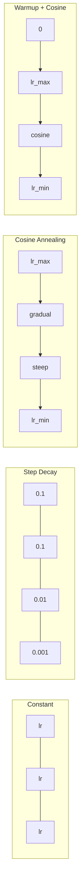
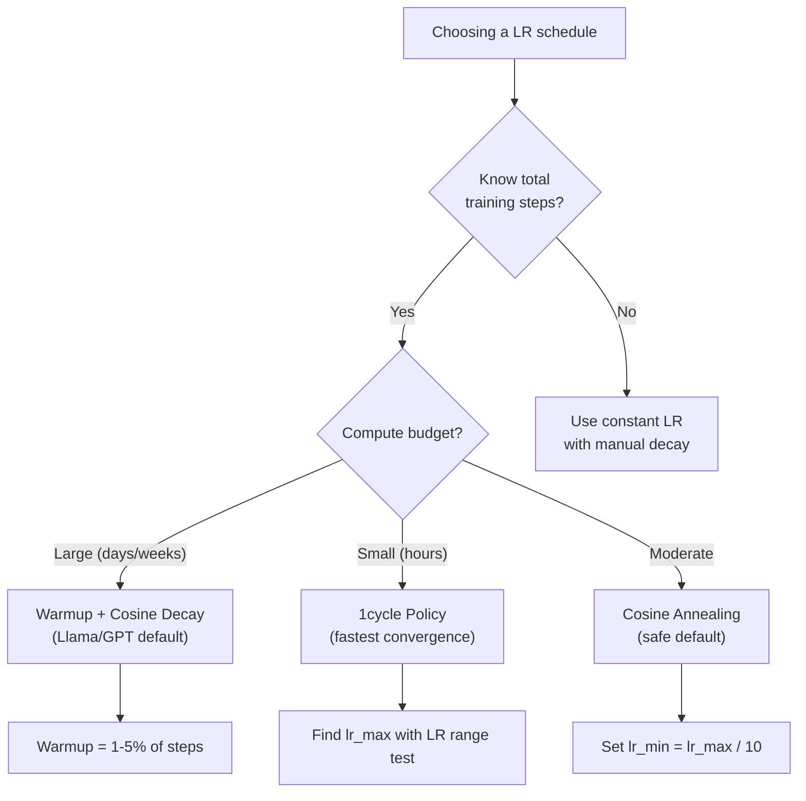
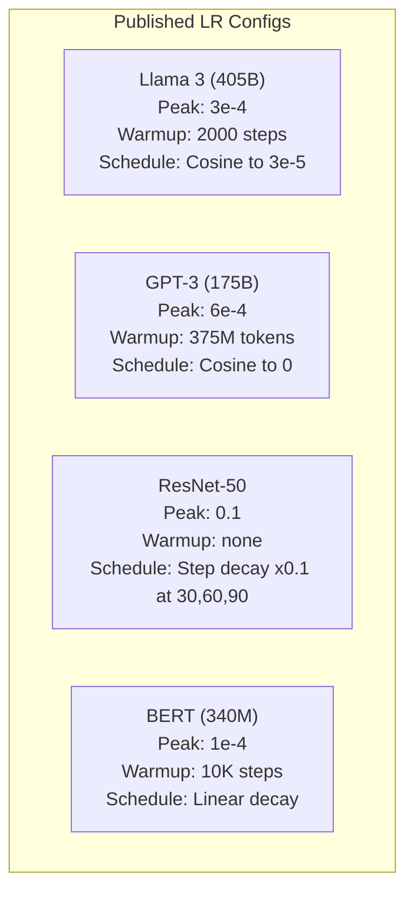

# 学习率调度与预热

> 学习率是最重要的单个超参数。不是架构，不是数据集大小，也不是激活函数，而是学习率。如果只调一个参数，就调它。

**Type:** 构建
**Languages:** Python
**Prerequisites:** 第 03.06 课（优化器）、第 03.08 课（权重初始化）
**Time:** 约 90 分钟

## 学习目标

- 从零实现常数、阶梯衰减、余弦退火、预热 + 余弦以及 1cycle 学习率调度
- 演示学习率选择的三种失败模式：过高导致发散、过低导致停滞、不衰减导致振荡
- 解释基于 Adam 的优化器为何需要预热，以及预热如何稳定训练初期
- 在同一任务上比较五种调度的收敛速度，并针对给定训练预算选择合适方案

## 问题

把学习率设为 0.1，训练发散，损失在 3 步内跃升到无穷大。设为 0.0001，训练缓慢爬行，100 个 epoch 后模型仍几乎没有摆脱随机状态。设为 0.01，前 50 个 epoch 一切正常，随后损失却在一个永远无法到达的极小值周围振荡，因为步子仍然太大。

最佳学习率不是常数，而会在训练期间变化。训练初期需要较大的步长，以便快速前进；训练后期则需要很小的步长，以便稳定落入一个尖锐极小值。准确率 90% 与 95% 的模型之间，差别往往只是调度方式。

过去三年发布的每一个主要模型都使用了学习率调度。Llama 3 的峰值 lr=3e-4，预热 2000 步，再通过余弦衰减到 3e-5。GPT-3 使用 lr=6e-4，并在前 3.75 亿个 token 上预热。这些选择并不随意，而是来自成本高达数百万美元的大量超参数扫描。

你需要理解调度，因为默认设置未必适合自己的问题。微调预训练模型时，正确调度不同于从零训练；增大批大小时，预热周期也要变化；训练在第 10,000 步崩溃时，还要判断究竟是调度问题还是其他原因。

## 核心概念

### 恒定学习率

最简单的方法：选定一个数，并在每一步都使用它。

```
lr(t) = lr_0
```

它很少是最佳选择。对于训练后期，它通常过高，导致在极小值附近振荡；对于训练初期，它又可能过低，让计算资源浪费在微小步伐上。小型模型和调试任务使用它没有问题，但只要训练超过一小时，它通常就是一个糟糕选择。

### 阶梯衰减

这是 ResNet 时代的经典方法：在固定 epoch 将学习率按一定倍数降低，通常每次缩小 10 倍。

```
lr(t) = lr_0 * gamma^(floor(epoch / step_size))
```

如果 gamma = 0.1、step_size = 30，就表示每 30 个 epoch 将 lr 缩小 10 倍。ResNet-50 就采用这种方法：lr=0.1，并在第 30、60、90 个 epoch 各缩小 10 倍。

问题在于，最佳衰减时点取决于数据集和架构。换一个问题，就必须重新调节何时下降；而且切换十分突然，学习率骤变时损失可能出现尖峰。

### 余弦退火

按照余弦曲线，从最大学习率平滑衰减到最小值：

```
lr(t) = lr_min + 0.5 * (lr_max - lr_min) * (1 + cos(pi * t / T))
```

其中 t 是当前步骤，T 是总步骤数。

在 t=0 时，余弦项为 1，因此 lr = lr_max；在 t=T 时，余弦项为 -1，因此 lr = lr_min。衰减初期较缓，中段加速，接近结束时再次放缓。

这是大多数现代训练任务的默认选择。除了 lr_max 和 lr_min，几乎没有其他超参数需要调节。余弦形状符合一个经验观察：大多数学习都发生在训练中期，所以应在这个关键时期保留合理的步长。

### 预热：为什么要从小步开始

Adam 和其他自适应优化器会维护梯度均值和方差的移动估计。第 0 步时，这些估计全部初始化为零，最初几次梯度更新依据的是很不可靠的统计量。如果这时学习率很大，模型就会迈出幅度巨大、方向不佳的步子。

预热可以解决这个问题。先使用很小的学习率，通常是 lr_max / warmup_steps，甚至直接从零开始，再在最初 N 步中线性增加到 lr_max。达到完整学习率时，Adam 的统计量已经稳定。

```
lr(t) = lr_max * (t / warmup_steps)     for t < warmup_steps
```

典型预热长度为总训练步数的 1%–5%。Llama 3 训练了约 1.8 万亿个 token，并预热 2000 步；GPT-3 则在前 3.75 亿个 token 上预热。

### 线性预热 + 余弦衰减

这是现代模型的默认方案：先线性增大，再按余弦曲线衰减。

```
if t < warmup_steps:
    lr(t) = lr_max * (t / warmup_steps)
else:
    progress = (t - warmup_steps) / (total_steps - warmup_steps)
    lr(t) = lr_min + 0.5 * (lr_max - lr_min) * (1 + cos(pi * progress))
```

Llama、GPT、PaLM 及大多数现代 Transformer 都采用这种方法。预热防止早期训练不稳定，余弦衰减则帮助模型稳定落入一个良好的极小值。

### 1cycle 策略

Leslie Smith 在 2018 年发现了一种策略：训练前半程把学习率从低值逐步提升到高值，后半程再降回低值。这看似违反直觉——为什么要在训练中途*提高*学习率？

理论解释是，高学习率会为优化轨迹引入噪声，从而起到正则化作用。模型在学习率上升阶段会探索损失曲面的更多区域，找到更好的盆地；随后在下降阶段于最佳盆地中进行精细优化。

```
Phase 1 (0 to T/2):    lr ramps from lr_max/25 to lr_max
Phase 2 (T/2 to T):    lr ramps from lr_max to lr_max/10000
```

在计算预算固定时，1cycle 往往比余弦退火收敛更快。代价是必须预先知道总训练步数。

### 调度曲线形状



### 决策流程图



### 已发布模型中的真实配置



```figure
lr-schedule
```

## 动手构建

### 第 1 步：调度函数

每个函数接收当前步骤，并返回该步骤应采用的学习率。

```python
import math


def constant_schedule(step, lr=0.01, **kwargs):
    return lr


def step_decay_schedule(step, lr=0.1, step_size=100, gamma=0.1, **kwargs):
    return lr * (gamma ** (step // step_size))


def cosine_schedule(step, lr=0.01, total_steps=1000, lr_min=1e-5, **kwargs):
    if step >= total_steps:
        return lr_min
    return lr_min + 0.5 * (lr - lr_min) * (1 + math.cos(math.pi * step / total_steps))


def warmup_cosine_schedule(step, lr=0.01, total_steps=1000, warmup_steps=100, lr_min=1e-5, **kwargs):
    if total_steps <= warmup_steps:
        return lr * (step / max(warmup_steps, 1))
    if step < warmup_steps:
        return lr * step / warmup_steps
    progress = (step - warmup_steps) / (total_steps - warmup_steps)
    return lr_min + 0.5 * (lr - lr_min) * (1 + math.cos(math.pi * progress))


def one_cycle_schedule(step, lr=0.01, total_steps=1000, **kwargs):
    mid = max(total_steps // 2, 1)
    if step < mid:
        return (lr / 25) + (lr - lr / 25) * step / mid
    else:
        progress = (step - mid) / max(total_steps - mid, 1)
        return lr * (1 - progress) + (lr / 10000) * progress
```

### 第 2 步：可视化所有调度

打印文本图，展示每种调度在训练过程中如何变化。

```python
def visualize_schedule(name, schedule_fn, total_steps=500, **kwargs):
    steps = list(range(0, total_steps, total_steps // 20))
    if total_steps - 1 not in steps:
        steps.append(total_steps - 1)

    lrs = [schedule_fn(s, total_steps=total_steps, **kwargs) for s in steps]
    max_lr = max(lrs) if max(lrs) > 0 else 1.0

    print(f"\n{name}:")
    for s, lr_val in zip(steps, lrs):
        bar_len = int(lr_val / max_lr * 40)
        bar = "#" * bar_len
        print(f"  Step {s:4d}: lr={lr_val:.6f} {bar}")
```

### 第 3 步：训练网络

继续使用前几课中的圆形数据集和简单双层网络，但这一次改变学习率调度。

```python
import random


def sigmoid(x):
    x = max(-500, min(500, x))
    return 1.0 / (1.0 + math.exp(-x))


def relu(x):
    return max(0.0, x)


def relu_deriv(x):
    return 1.0 if x > 0 else 0.0


def make_circle_data(n=200, seed=42):
    random.seed(seed)
    data = []
    for _ in range(n):
        x = random.uniform(-2, 2)
        y = random.uniform(-2, 2)
        label = 1.0 if x * x + y * y < 1.5 else 0.0
        data.append(([x, y], label))
    return data


def train_with_schedule(schedule_fn, schedule_name, data, epochs=300, base_lr=0.05, **kwargs):
    random.seed(0)
    hidden_size = 8
    total_steps = epochs * len(data)

    std = math.sqrt(2.0 / 2)
    w1 = [[random.gauss(0, std) for _ in range(2)] for _ in range(hidden_size)]
    b1 = [0.0] * hidden_size
    w2 = [random.gauss(0, std) for _ in range(hidden_size)]
    b2 = 0.0

    step = 0
    epoch_losses = []

    for epoch in range(epochs):
        total_loss = 0
        correct = 0

        for x, target in data:
            lr = schedule_fn(step, lr=base_lr, total_steps=total_steps, **kwargs)

            z1 = []
            h = []
            for i in range(hidden_size):
                z = w1[i][0] * x[0] + w1[i][1] * x[1] + b1[i]
                z1.append(z)
                h.append(relu(z))

            z2 = sum(w2[i] * h[i] for i in range(hidden_size)) + b2
            out = sigmoid(z2)

            error = out - target
            d_out = error * out * (1 - out)

            for i in range(hidden_size):
                d_h = d_out * w2[i] * relu_deriv(z1[i])
                w2[i] -= lr * d_out * h[i]
                for j in range(2):
                    w1[i][j] -= lr * d_h * x[j]
                b1[i] -= lr * d_h
            b2 -= lr * d_out

            total_loss += (out - target) ** 2
            if (out >= 0.5) == (target >= 0.5):
                correct += 1
            step += 1

        avg_loss = total_loss / len(data)
        accuracy = correct / len(data) * 100
        epoch_losses.append(avg_loss)

    return epoch_losses
```

### 第 4 步：比较所有调度

使用每种调度训练同一个网络，再比较最终损失和收敛行为。

```python
def compare_schedules(data):
    configs = [
        ("Constant", constant_schedule, {}),
        ("Step Decay", step_decay_schedule, {"step_size": 15000, "gamma": 0.1}),
        ("Cosine", cosine_schedule, {"lr_min": 1e-5}),
        ("Warmup+Cosine", warmup_cosine_schedule, {"warmup_steps": 3000, "lr_min": 1e-5}),
        ("1cycle", one_cycle_schedule, {}),
    ]

    print(f"\n{'Schedule':<20} {'Start Loss':>12} {'Mid Loss':>12} {'End Loss':>12} {'Best Loss':>12}")
    print("-" * 70)

    for name, schedule_fn, extra_kwargs in configs:
        losses = train_with_schedule(schedule_fn, name, data, epochs=300, base_lr=0.05, **extra_kwargs)
        mid_idx = len(losses) // 2
        best = min(losses)
        print(f"{name:<20} {losses[0]:>12.6f} {losses[mid_idx]:>12.6f} {losses[-1]:>12.6f} {best:>12.6f}")
```

### 第 5 步：学习率过高与过低

演示三种失败模式：学习率过高导致发散、过低导致爬行，以及设置合适时正常学习。

```python
def lr_sensitivity(data):
    learning_rates = [1.0, 0.1, 0.01, 0.001, 0.0001]

    print("\nLR Sensitivity (constant schedule, 100 epochs):")
    print(f"  {'LR':>10} {'Start Loss':>12} {'End Loss':>12} {'Status':>15}")
    print("  " + "-" * 52)

    for lr in learning_rates:
        losses = train_with_schedule(constant_schedule, f"lr={lr}", data, epochs=100, base_lr=lr)
        start = losses[0]
        end = losses[-1]

        if end > start or math.isnan(end) or end > 1.0:
            status = "DIVERGED"
        elif end > start * 0.9:
            status = "BARELY MOVED"
        elif end < 0.15:
            status = "CONVERGED"
        else:
            status = "LEARNING"

        end_str = f"{end:.6f}" if not math.isnan(end) else "NaN"
        print(f"  {lr:>10.4f} {start:>12.6f} {end_str:>12} {status:>15}")
```

## 实际应用

PyTorch 在 `torch.optim.lr_scheduler` 中提供了各种调度器：

```python
import torch
import torch.optim as optim
from torch.optim.lr_scheduler import CosineAnnealingLR, OneCycleLR, StepLR

model = nn.Sequential(nn.Linear(10, 64), nn.ReLU(), nn.Linear(64, 1))
optimizer = optim.Adam(model.parameters(), lr=3e-4)

scheduler = CosineAnnealingLR(optimizer, T_max=1000, eta_min=1e-5)

for step in range(1000):
    loss = train_step(model, optimizer)
    scheduler.step()
```

若要实现预热 + 余弦，可以使用 Lambda 调度器，或者 HuggingFace 的 `get_cosine_schedule_with_warmup`：

```python
from transformers import get_cosine_schedule_with_warmup

scheduler = get_cosine_schedule_with_warmup(
    optimizer,
    num_warmup_steps=2000,
    num_training_steps=100000,
)
```

大多数 Llama 和 GPT 微调脚本都会使用这个 HuggingFace 函数。如果不确定如何选择，就采用预热 + 余弦，并把预热设为总步骤的 3%–5%。它几乎适用于所有任务。

## 交付成果

本课会产出：
- `outputs/prompt-lr-schedule-advisor.md`——针对你的训练设置推荐合适学习率调度与超参数的提示词

## 练习

1. 实现指数衰减：lr(t) = lr_0 * gamma^t，其中 gamma = 0.999。在圆形数据集上与余弦退火比较。

2. 实现学习率范围测试（Leslie Smith）：训练数百步，同时让 LR 从 1e-7 指数增长到 1。绘制损失随 LR 变化的曲线。最佳最大 LR 位于损失开始上升之前。

3. 使用预热 + 余弦训练，但把预热长度分别设为总步骤的 0%、1%、5%、10% 和 20%，找出训练最稳定的最佳位置。

4. 实现带热重启的余弦退火（SGDR）：每隔 T 步把学习率重置到 lr_max，再次衰减。在较长训练中与标准余弦调度比较。

5. 构建“调度外科医生”：监控训练损失，在损失稳定时自动从预热切换到余弦；如果损失平台期过长，就降低 lr。

## 关键术语

| 术语 | 人们常说 | 实际含义 |
|------|----------------|----------------------|
| 学习率 | “模型学习有多快” | 乘在梯度上、用于决定参数更新幅度的标量 |
| 调度 | “随时间改变 LR” | 把训练步骤映射为学习率、用于优化收敛过程的函数 |
| 预热 | “从较小 LR 开始” | 在最初 N 步中把 LR 从接近零线性提升到目标值，以稳定优化器统计量 |
| 余弦退火 | “平滑衰减 LR” | 在训练过程中沿余弦曲线把 LR 从 lr_max 降低到 lr_min |
| 阶梯衰减 | “在里程碑处降低 LR” | 每隔固定 epoch，把 LR 乘以一个因子，通常为 0.1 |
| 1cycle 策略 | “先升再降” | Leslie Smith 提出的方法，在一个周期内先提高再降低 LR，以加快收敛 |
| LR 范围测试 | “找到最佳学习率” | 在短暂训练期间不断提高 LR，找到损失开始发散时的取值 |
| 带热重启的余弦 | “重置后再次衰减” | 定期把 LR 重置到 lr_max，再重新衰减，也称 SGDR |
| Eta min | “LR 的下限” | 调度最终衰减到的最小学习率 |
| 峰值学习率 | “最大 LR” | 训练期间达到的最高学习率，通常出现在预热结束后 |

## 延伸阅读

- Loshchilov 与 Hutter，《SGDR: Stochastic Gradient Descent with Warm Restarts》（2017）——提出余弦退火和热重启
- Smith，《Super-Convergence: Very Fast Training of Neural Networks Using Large Learning Rates》（2018）——1cycle 策略论文
- Touvron 等，《Llama 2: Open Foundation and Fine-Tuned Chat Models》（2023）——记录大规模训练采用的预热 + 余弦调度
- Goyal 等，《Accurate, Large Minibatch SGD: Training ImageNet in 1 Hour》（2017）——大批次训练的线性缩放规则与预热
