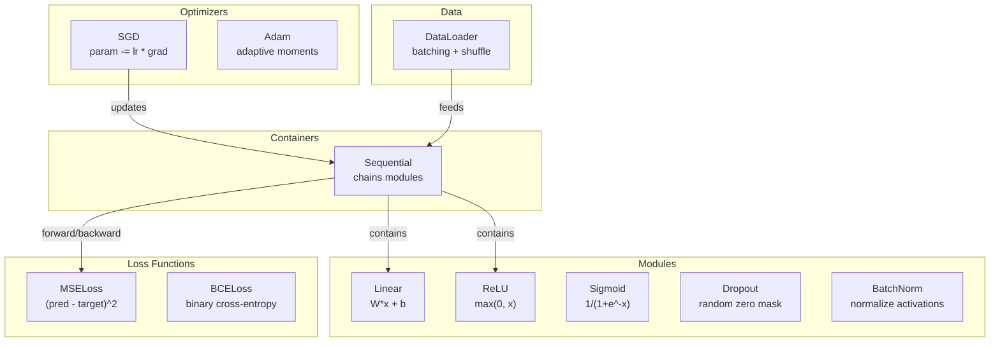
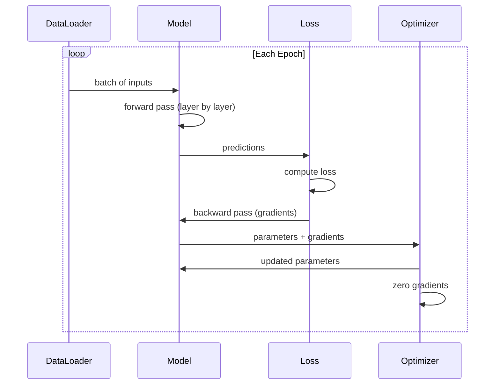
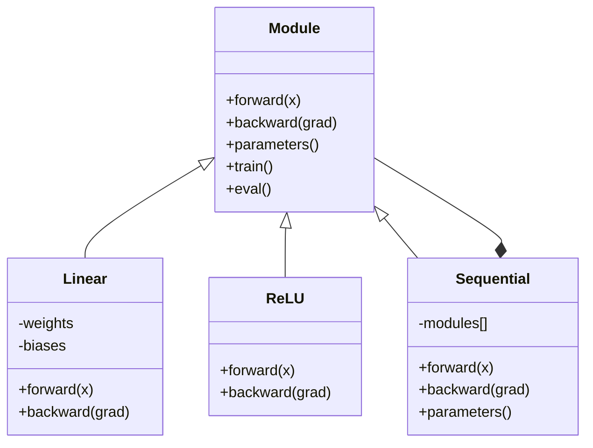

# 构建自己的迷你框架

> 你已经分别构建了神经元、层、网络、反向传播、激活函数、损失函数、优化器、正则化、初始化和学习率调度。现在把它们连接成一个框架。不是 PyTorch，也不是 TensorFlow，而是属于你自己的框架。

**Type:** 构建
**Languages:** Python
**Prerequisites:** 第 03 阶段全部内容（第 01–09 课）
**Time:** 约 120 分钟

## 学习目标

- 构建一个完整的深度学习框架（约 500 行），包含 Module、Linear、ReLU、Sigmoid、Dropout、BatchNorm、Sequential、损失函数、优化器和 DataLoader
- 解释 Module 抽象（forward、backward、parameters），以及为何必须切换 train/eval 模式
- 把所有组件连接成可运行的训练循环，在圆形分类任务上训练一个四层网络
- 把自建框架中的每个组件映射到对应的 PyTorch 组件（nn.Module、nn.Sequential、optim.Adam、DataLoader）

## 问题

你已经用十课时间构建了散落在不同文件中的基础组件：这里有一个 `Value` 类，那里有一个训练循环，权重初始化在另一个文件，学习率调度又在其他地方。每次训练网络，都要从五篇不同课程中复制粘贴代码，再手工把它们连接起来。

框架正是为了解决这个问题。PyTorch 提供 `nn.Module`、`nn.Sequential`、`optim.Adam`、`DataLoader`，还有一套把它们连接起来的训练循环模式。TensorFlow 提供 `keras.Layer`、`keras.Sequential` 和 `keras.optimizers.Adam`。这些都不是魔法，而是一些组织模式，让你无需每次重新发明底层管线，就能定义、训练和评估网络。

接下来，你将使用约 500 行 Python 构建同样的东西。不使用 numpy，也不依赖任何外部包。这个框架可以定义任意前馈网络，使用 SGD 或 Adam 训练，把数据分成批次，应用 Dropout 和批归一化，使用任意激活函数，并调度学习率。

完成后，你会准确理解在 PyTorch 中编写 `model = nn.Sequential(...)` 时究竟发生了什么，理解 `model.train()` 和 `model.eval()` 为何存在，也会理解 `optimizer.zero_grad()` 为什么是一个独立调用。你会理解这一切，因为它们都是你亲手构建的。

## 核心概念

### Module 抽象

PyTorch 中的每一层都继承自 `nn.Module`。Module 承担三项职责：

1. **forward()**——给定输入，计算输出
2. **parameters()**——返回全部可训练权重
3. **backward()**——计算梯度（PyTorch 由自动微分负责，我们的框架则显式实现）

Linear 层是 Module，ReLU 激活是 Module，Dropout 层是 Module，批归一化层也是 Module。它们都遵循同一个接口。

### Sequential 容器

`nn.Sequential` 把多个 Module 串联起来。前向传播时，数据依次经过 Module 1、Module 2、Module 3；反向传播时，则按相反顺序穿过这条链。容器本身也是一个 Module，同样拥有 forward()、parameters() 和 backward()。这就是组合模式：由多个 Module 组成的序列，本身仍然是一个 Module。

### 训练模式与评估模式

Dropout 在训练期间随机把神经元置零，评估期间则让所有值通过。批归一化在训练期间使用批次统计量，评估期间则使用移动平均。`train()` 和 `eval()` 方法负责切换这些行为，每个 Module 都拥有一个 `training` 标志。

### 优化器

优化器使用梯度更新参数。SGD 执行 `param -= lr * grad`；Adam 维护动量和方差估计，再进行更新。优化器不需要了解网络架构，只会看到一个扁平的参数列表以及对应梯度。

### DataLoader

分批有两个重要原因。第一，大型问题无法把整个数据集一次装入内存；第二，小批次梯度下降会引入噪声，帮助模型逃离局部极小值。DataLoader 把数据划分成批次，并可以选择在每个 epoch 之间打乱顺序。

### 框架架构



### 训练循环



### Module 层次结构



```figure
gradient-clipping
```

## 动手构建

### 第 1 步：Module 基类

这是每一层都要实现的抽象接口。

```python
class Module:
    def __init__(self):
        self.training = True

    def forward(self, x):
        raise NotImplementedError

    def backward(self, grad):
        raise NotImplementedError

    def parameters(self):
        return []

    def train(self):
        self.training = True

    def eval(self):
        self.training = False
```

### 第 2 步：Linear 层

这是最基本的构建模块。它保存权重和偏置，在前向传播中计算 Wx + b，在反向传播中计算权重梯度与输入梯度。

```python
import math
import random


class Linear(Module):
    def __init__(self, fan_in, fan_out):
        super().__init__()
        std = math.sqrt(2.0 / fan_in)
        self.weights = [[random.gauss(0, std) for _ in range(fan_in)] for _ in range(fan_out)]
        self.biases = [0.0] * fan_out
        self.weight_grads = [[0.0] * fan_in for _ in range(fan_out)]
        self.bias_grads = [0.0] * fan_out
        self.fan_in = fan_in
        self.fan_out = fan_out
        self.input = None

    def forward(self, x):
        self.input = x
        output = []
        for i in range(self.fan_out):
            val = self.biases[i]
            for j in range(self.fan_in):
                val += self.weights[i][j] * x[j]
            output.append(val)
        return output

    def backward(self, grad):
        input_grad = [0.0] * self.fan_in
        for i in range(self.fan_out):
            self.bias_grads[i] += grad[i]
            for j in range(self.fan_in):
                self.weight_grads[i][j] += grad[i] * self.input[j]
                input_grad[j] += grad[i] * self.weights[i][j]
        return input_grad

    def parameters(self):
        params = []
        for i in range(self.fan_out):
            for j in range(self.fan_in):
                params.append((self.weights, i, j, self.weight_grads))
            params.append((self.biases, i, None, self.bias_grads))
        return params
```

### 第 3 步：激活模块

把 ReLU、Sigmoid 和 Tanh 实现为 Module。每个模块都会缓存反向传播所需的数据。

```python
class ReLU(Module):
    def __init__(self):
        super().__init__()
        self.mask = None

    def forward(self, x):
        self.mask = [1.0 if v > 0 else 0.0 for v in x]
        return [max(0.0, v) for v in x]

    def backward(self, grad):
        return [g * m for g, m in zip(grad, self.mask)]


class Sigmoid(Module):
    def __init__(self):
        super().__init__()
        self.output = None

    def forward(self, x):
        self.output = []
        for v in x:
            v = max(-500, min(500, v))
            self.output.append(1.0 / (1.0 + math.exp(-v)))
        return self.output

    def backward(self, grad):
        return [g * o * (1 - o) for g, o in zip(grad, self.output)]


class Tanh(Module):
    def __init__(self):
        super().__init__()
        self.output = None

    def forward(self, x):
        self.output = [math.tanh(v) for v in x]
        return self.output

    def backward(self, grad):
        return [g * (1 - o * o) for g, o in zip(grad, self.output)]
```

### 第 4 步：Dropout 模块

训练时随机把元素置零，并将其余元素按 1/(1-p) 缩放，使期望值保持不变；评估时不执行任何操作。

```python
class Dropout(Module):
    def __init__(self, p=0.5):
        super().__init__()
        self.p = p
        self.mask = None

    def forward(self, x):
        if not self.training:
            return x
        self.mask = [0.0 if random.random() < self.p else 1.0 / (1 - self.p) for _ in x]
        return [v * m for v, m in zip(x, self.mask)]

    def backward(self, grad):
        if self.mask is None:
            return grad
        return [g * m for g, m in zip(grad, self.mask)]
```

### 第 5 步：BatchNorm 模块

针对每项特征，在批次范围内把激活值归一化为零均值、单位方差，并维护供评估模式使用的移动统计量。

```python
class BatchNorm(Module):
    def __init__(self, size, momentum=0.1, eps=1e-5):
        super().__init__()
        self.size = size
        self.gamma = [1.0] * size
        self.beta = [0.0] * size
        self.gamma_grads = [0.0] * size
        self.beta_grads = [0.0] * size
        self.running_mean = [0.0] * size
        self.running_var = [1.0] * size
        self.momentum = momentum
        self.eps = eps
        self.x_norm = None
        self.std_inv = None
        self.batch_input = None

    def forward_batch(self, batch):
        batch_size = len(batch)
        output_batch = []

        if self.training:
            mean = [0.0] * self.size
            for sample in batch:
                for j in range(self.size):
                    mean[j] += sample[j]
            mean = [m / batch_size for m in mean]

            var = [0.0] * self.size
            for sample in batch:
                for j in range(self.size):
                    var[j] += (sample[j] - mean[j]) ** 2
            var = [v / batch_size for v in var]

            self.std_inv = [1.0 / math.sqrt(v + self.eps) for v in var]

            self.x_norm = []
            self.batch_input = batch
            for sample in batch:
                normed = [(sample[j] - mean[j]) * self.std_inv[j] for j in range(self.size)]
                self.x_norm.append(normed)
                output = [self.gamma[j] * normed[j] + self.beta[j] for j in range(self.size)]
                output_batch.append(output)

            for j in range(self.size):
                self.running_mean[j] = (1 - self.momentum) * self.running_mean[j] + self.momentum * mean[j]
                self.running_var[j] = (1 - self.momentum) * self.running_var[j] + self.momentum * var[j]
        else:
            std_inv = [1.0 / math.sqrt(v + self.eps) for v in self.running_var]
            for sample in batch:
                normed = [(sample[j] - self.running_mean[j]) * std_inv[j] for j in range(self.size)]
                output = [self.gamma[j] * normed[j] + self.beta[j] for j in range(self.size)]
                output_batch.append(output)

        return output_batch

    def forward(self, x):
        result = self.forward_batch([x])
        return result[0]

    def backward(self, grad):
        if self.x_norm is None:
            return grad
        for j in range(self.size):
            self.gamma_grads[j] += self.x_norm[0][j] * grad[j]
            self.beta_grads[j] += grad[j]
        return [grad[j] * self.gamma[j] * self.std_inv[j] for j in range(self.size)]

    def parameters(self):
        params = []
        for j in range(self.size):
            params.append((self.gamma, j, None, self.gamma_grads))
            params.append((self.beta, j, None, self.beta_grads))
        return params
```

### 第 6 步：Sequential 容器

Sequential 会串联多个模块。前向传播从左向右，反向传播从右向左。

```python
class Sequential(Module):
    def __init__(self, *modules):
        super().__init__()
        self.modules = list(modules)

    def forward(self, x):
        for module in self.modules:
            x = module.forward(x)
        return x

    def backward(self, grad):
        for module in reversed(self.modules):
            grad = module.backward(grad)
        return grad

    def parameters(self):
        params = []
        for module in self.modules:
            params.extend(module.parameters())
        return params

    def train(self):
        self.training = True
        for module in self.modules:
            module.train()

    def eval(self):
        self.training = False
        for module in self.modules:
            module.eval()
```

### 第 7 步：损失函数

实现 MSE 和二元交叉熵。每个对象都会返回损失值，并提供一个 backward() 方法来返回梯度。

```python
class MSELoss:
    def __call__(self, predicted, target):
        self.predicted = predicted
        self.target = target
        n = len(predicted)
        self.loss = sum((p - t) ** 2 for p, t in zip(predicted, target)) / n
        return self.loss

    def backward(self):
        n = len(self.predicted)
        return [2 * (p - t) / n for p, t in zip(self.predicted, self.target)]


class BCELoss:
    def __call__(self, predicted, target):
        self.predicted = predicted
        self.target = target
        eps = 1e-7
        n = len(predicted)
        self.loss = 0
        for p, t in zip(predicted, target):
            p = max(eps, min(1 - eps, p))
            self.loss += -(t * math.log(p) + (1 - t) * math.log(1 - p))
        self.loss /= n
        return self.loss

    def backward(self):
        eps = 1e-7
        n = len(self.predicted)
        grads = []
        for p, t in zip(self.predicted, self.target):
            p = max(eps, min(1 - eps, p))
            grads.append((-t / p + (1 - t) / (1 - p)) / n)
        return grads
```

### 第 8 步：SGD 与 Adam 优化器

两者都接收参数列表，并使用梯度更新权重。

```python
class SGD:
    def __init__(self, parameters, lr=0.01):
        self.params = parameters
        self.lr = lr

    def step(self):
        for container, i, j, grad_container in self.params:
            if j is not None:
                container[i][j] -= self.lr * grad_container[i][j]
            else:
                container[i] -= self.lr * grad_container[i]

    def zero_grad(self):
        for container, i, j, grad_container in self.params:
            if j is not None:
                grad_container[i][j] = 0.0
            else:
                grad_container[i] = 0.0


class Adam:
    def __init__(self, parameters, lr=0.001, beta1=0.9, beta2=0.999, eps=1e-8):
        self.params = parameters
        self.lr = lr
        self.beta1 = beta1
        self.beta2 = beta2
        self.eps = eps
        self.t = 0
        self.m = [0.0] * len(parameters)
        self.v = [0.0] * len(parameters)

    def step(self):
        self.t += 1
        for idx, (container, i, j, grad_container) in enumerate(self.params):
            if j is not None:
                g = grad_container[i][j]
            else:
                g = grad_container[i]

            self.m[idx] = self.beta1 * self.m[idx] + (1 - self.beta1) * g
            self.v[idx] = self.beta2 * self.v[idx] + (1 - self.beta2) * g * g

            m_hat = self.m[idx] / (1 - self.beta1 ** self.t)
            v_hat = self.v[idx] / (1 - self.beta2 ** self.t)

            update = self.lr * m_hat / (math.sqrt(v_hat) + self.eps)

            if j is not None:
                container[i][j] -= update
            else:
                container[i] -= update

    def zero_grad(self):
        for container, i, j, grad_container in self.params:
            if j is not None:
                grad_container[i][j] = 0.0
            else:
                grad_container[i] = 0.0
```

### 第 9 步：DataLoader

把数据拆分成多个批次，并可选择在每个 epoch 打乱顺序。

```python
class DataLoader:
    def __init__(self, data, batch_size=32, shuffle=True):
        self.data = data
        self.batch_size = batch_size
        self.shuffle = shuffle

    def __iter__(self):
        indices = list(range(len(self.data)))
        if self.shuffle:
            random.shuffle(indices)
        for start in range(0, len(indices), self.batch_size):
            batch_indices = indices[start:start + self.batch_size]
            batch = [self.data[i] for i in batch_indices]
            inputs = [item[0] for item in batch]
            targets = [item[1] for item in batch]
            yield inputs, targets

    def __len__(self):
        return (len(self.data) + self.batch_size - 1) // self.batch_size
```

### 第 10 步：在圆形分类任务上训练四层网络

把一切连接起来：定义模型，选择损失函数和优化器，再运行训练循环。

```python
def make_circle_data(n=500, seed=42):
    random.seed(seed)
    data = []
    for _ in range(n):
        x = random.uniform(-2, 2)
        y = random.uniform(-2, 2)
        label = 1.0 if x * x + y * y < 1.5 else 0.0
        data.append(([x, y], [label]))
    return data


def train():
    random.seed(42)

    model = Sequential(
        Linear(2, 16),
        ReLU(),
        Linear(16, 16),
        ReLU(),
        Linear(16, 8),
        ReLU(),
        Linear(8, 1),
        Sigmoid(),
    )

    criterion = BCELoss()
    optimizer = Adam(model.parameters(), lr=0.01)

    data = make_circle_data(500)
    split = int(len(data) * 0.8)
    train_data = data[:split]
    test_data = data[split:]

    loader = DataLoader(train_data, batch_size=16, shuffle=True)

    model.train()

    for epoch in range(100):
        total_loss = 0
        total_correct = 0
        total_samples = 0

        for batch_inputs, batch_targets in loader:
            batch_loss = 0
            for x, t in zip(batch_inputs, batch_targets):
                pred = model.forward(x)
                loss = criterion(pred, t)
                batch_loss += loss

                optimizer.zero_grad()
                grad = criterion.backward()
                model.backward(grad)
                optimizer.step()

                predicted_class = 1.0 if pred[0] >= 0.5 else 0.0
                if predicted_class == t[0]:
                    total_correct += 1
                total_samples += 1

            total_loss += batch_loss

        avg_loss = total_loss / total_samples
        accuracy = total_correct / total_samples * 100

        if epoch % 10 == 0 or epoch == 99:
            print(f"Epoch {epoch:3d} | Loss: {avg_loss:.6f} | Train Accuracy: {accuracy:.1f}%")

    model.eval()
    correct = 0
    for x, t in test_data:
        pred = model.forward(x)
        predicted_class = 1.0 if pred[0] >= 0.5 else 0.0
        if predicted_class == t[0]:
            correct += 1
    test_accuracy = correct / len(test_data) * 100
    print(f"\nTest Accuracy: {test_accuracy:.1f}% ({correct}/{len(test_data)})")

    return model, test_accuracy
```

## 实际应用

下面是刚才所构建框架的 PyTorch 等价实现：

```python
import torch
import torch.nn as nn
from torch.utils.data import DataLoader, TensorDataset

model = nn.Sequential(
    nn.Linear(2, 16),
    nn.ReLU(),
    nn.Linear(16, 16),
    nn.ReLU(),
    nn.Linear(16, 8),
    nn.ReLU(),
    nn.Linear(8, 1),
    nn.Sigmoid(),
)

criterion = nn.BCELoss()
optimizer = torch.optim.Adam(model.parameters(), lr=0.01)

for epoch in range(100):
    model.train()
    for inputs, targets in dataloader:
        optimizer.zero_grad()
        predictions = model(inputs)
        loss = criterion(predictions, targets)
        loss.backward()
        optimizer.step()

    model.eval()
    with torch.no_grad():
        test_predictions = model(test_inputs)
```

两者结构完全相同：`Sequential`、`Linear`、`ReLU`、`Sigmoid`、`BCELoss`、`Adam`、`zero_grad`、`backward`、`step`、`train`、`eval`，每个概念都一一对应。区别在于，PyTorch 会自动处理自动微分，不必在每个模块中手工实现 backward()；它还可以在 GPU 上运行，并经过多年性能优化。但骨架完全相同。

现在，当你再看到 PyTorch 代码时，便会准确理解每一行背后发生了什么。这种理解正是本课的全部意义。

## 交付成果

本课会产出：
- `outputs/prompt-framework-architect.md`——使用框架抽象来设计神经网络架构的提示词

## 练习

1. 添加一个 `SoftmaxCrossEntropyLoss` 类，用于多分类。先对预测应用 Softmax，再计算交叉熵损失，并处理组合后的反向传播。在三分类螺旋数据集上测试。

2. 在优化器中实现学习率调度：添加 `set_lr()` 方法，并接入第 09 课的余弦调度。在圆形分类器上使用预热 + 余弦进行训练，再与恒定 LR 比较。

3. 为 Sequential 添加 `save()` 和 `load()` 方法，把全部权重序列化到 JSON 文件，再加载回来。验证加载后的模型与原模型产生相同预测。

4. 在 Adam 优化器中实现权重衰减，也就是 L2 正则化。添加 `weight_decay` 参数，每一步把权重向零收缩。比较 decay=0 与 decay=0.01 的训练结果。

5. 用真正的小批次梯度累积替换逐样本训练循环：先累积批次中所有样本的梯度，再除以批大小，只执行一次优化器更新。测量它是否改变了收敛速度。

## 关键术语

| 术语 | 人们常说 | 实际含义 |
|------|----------------|----------------------|
| Module | “一个层” | 框架中的基础抽象——任何具有 forward()、backward() 和 parameters() 的对象 |
| Sequential | “按顺序堆叠层” | 串联多个模块的容器；前向传播时顺序应用，反向传播时逆序应用 |
| 前向传播 | “运行网络” | 让输入依次经过每个模块，从而计算输出 |
| 反向传播 | “计算梯度” | 让损失梯度逆序穿过各个模块，从而计算参数梯度 |
| 参数 | “可训练权重” | 优化器能够更新的网络中全部数值，也就是权重与偏置 |
| 优化器 | “更新权重的东西” | 使用梯度更新参数的算法，实现 SGD、Adam 或其他规则 |
| DataLoader | “喂数据的东西” | 把数据集拆分成批次、并可选择在 epoch 之间打乱顺序的迭代器 |
| 训练模式 | “model.train()” | 启用 Dropout 等随机行为，并让批归一化使用批次统计量的标志 |
| 评估模式 | “model.eval()” | 禁用 Dropout，并让批归一化使用移动统计量的标志 |
| 梯度清零 | “清空梯度” | 在计算下一批次的梯度前，把所有参数梯度重置为零 |

## 延伸阅读

- Paszke 等，《PyTorch: An Imperative Style, High-Performance Deep Learning Library》（2019）——介绍 PyTorch 设计决策的论文
- Chollet，《Deep Learning with Python》第二版（2021）——第 3 章使用相同的模块/层抽象介绍 Keras 内部机制
- Johnson，“Tiny-DNN”（https://github.com/tiny-dnn/tiny-dnn）——用于理解框架内部机制的纯头文件 C++ 深度学习框架
