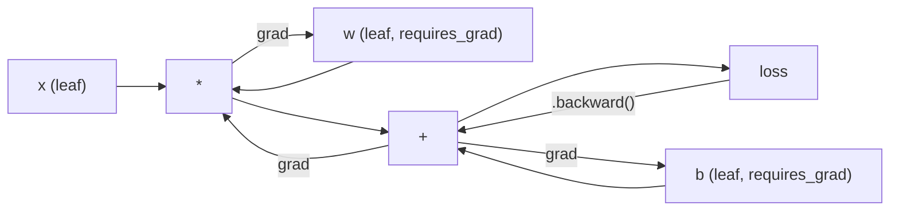
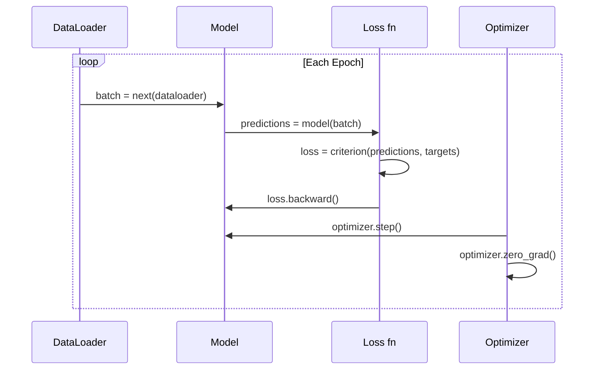

# PyTorch 入门

> 你已经从活塞和曲轴开始造出了引擎。现在来学习所有人真正使用的那一款。

**Type:** 构建
**Languages:** Python
**Prerequisites:** 第 03.10 课（构建自己的迷你框架）
**Time:** 约 75 分钟

## 学习目标

- 使用 PyTorch 的 nn.Module、nn.Sequential 和自动微分构建并训练神经网络
- 使用 PyTorch 张量、GPU 加速和标准训练循环（zero_grad、forward、loss、backward、step）
- 把从零实现的迷你框架组件转换成对应的 PyTorch 组件
- 对纯 Python 框架和 PyTorch 在同一任务上的训练过程做性能分析，并比较二者的速度

## 问题

你已经拥有一个可以运行的迷你框架：Linear 层、ReLU、Dropout、BatchNorm、Adam、DataLoader 和训练循环。它能用纯 Python 在圆形分类问题上训练一个四层网络。

但在同一个问题上，它也比 PyTorch 慢 500 倍。

你的迷你框架使用嵌套的 Python 循环，每次处理一个样本。PyTorch 则把相同操作分派给经过优化的 C++/CUDA 内核，并在 GPU 上运行。在单张 NVIDIA A100 上，PyTorch 训练一个 ResNet-50（2560 万参数）处理 ImageNet（128 万张图像）大约需要 6 小时。你的框架完成同一任务大约需要 3000 小时——前提是它没有先耗尽内存。

速度并不是唯一差距。你的框架不支持 GPU，也没有自动微分——每个模块的 backward() 都由你亲手编写。它不支持序列化、分布式训练或混合精度；如果不用打印语句，也无法调试梯度流。

PyTorch 补上了所有这些缺口，同时保留了你已经构建的完全相同的思维模型：Module、forward()、parameters()、backward()、optimizer.step()。概念可以一一映射，语法也几乎相同。区别在于，PyTorch 把十年的系统工程成果封装在你从零设计出来的同一套接口背后。

## 核心概念

### PyTorch 为何胜出

2015 年，TensorFlow 要求你在执行任何计算前先定义静态计算图。你先构建图、编译图，然后才把数据送入其中。调试意味着盯着计算图可视化寻找问题，修改架构则意味着从头重建计算图。

PyTorch 在 2017 年以不同理念推出：即时执行。你编写 Python，代码立即运行。`y = model(x)` 会当场计算 y，而不是“向图中添加一个稍后才计算 y 的节点”。因此，标准 Python 调试工具都能正常工作：print() 可用，pdb 可用，前向传播中的 if/else 也可用。

到 2020 年，市场已经作出选择。PyTorch 在机器学习研究论文中的占比从 2017 年的 7% 上升到 2022 年的 75% 以上。Meta、Google DeepMind、OpenAI、Anthropic 和 Hugging Face 都以 PyTorch 为主要框架。TensorFlow 2.x 随后也采用即时执行，等于含蓄地承认 PyTorch 的设计方向是正确的。

这里的经验是：良好开发体验的优势会不断累积。一个运行速度慢 10%、但调试起来快 50% 的框架，每次都会胜出。

### 张量

张量是具有三个关键属性的多维数组：形状、数据类型和设备。

```python
import torch

x = torch.zeros(3, 4)           # shape: (3, 4), dtype: float32, device: cpu
x = torch.randn(2, 3, 224, 224) # batch of 2 RGB images, 224x224
x = torch.tensor([1, 2, 3])     # from a Python list
```

**形状**表示维度。标量的形状是 ()，向量是 (n,)，矩阵是 (m, n)，一批图像则是 (batch, channels, height, width)。

**数据类型**控制精度与内存占用。

| dtype | 位数 | 范围 | 使用场景 |
|-------|------|-------|----------|
| float32 | 32 | 约 7 位十进制有效数字 | 默认训练 |
| float16 | 16 | 约 3.3 位十进制有效数字 | 混合精度 |
| bfloat16 | 16 | 与 float32 范围相同，但精度更低 | LLM 训练 |
| int8 | 8 | -128 到 127 | 量化推理 |

**设备**决定计算在哪里发生。

```python
device = torch.device("cuda" if torch.cuda.is_available() else "cpu")
x = torch.randn(3, 4, device=device)
x = x.to("cuda")
x = x.cpu()
```

每次操作都要求所有张量位于同一设备。这是初学者最常遇到的 PyTorch 错误：`RuntimeError: Expected all tensors to be on the same device`。解决方法是在计算前把所有张量移动到同一设备。

**重塑形状**是常数时间操作——它只改变元数据，不会移动数据。

```python
x = torch.randn(2, 3, 4)
x.view(2, 12)      # reshape to (2, 12) -- must be contiguous
x.reshape(6, 4)    # reshape to (6, 4) -- works always
x.permute(2, 0, 1) # reorder dimensions
x.unsqueeze(0)     # add dimension: (1, 2, 3, 4)
x.squeeze()        # remove size-1 dimensions
```

### 自动微分

你的迷你框架要求每个模块都实现 backward()，PyTorch 则不需要。它会把对张量执行的每项操作记录在一张有向无环图（即计算图）中，然后反向遍历这张图，自动计算梯度。



它与自建框架的关键区别在于：PyTorch 使用基于记录带的自动微分。前向传播期间，每项操作的记录都会追加到一条“记录带”上；调用 `.backward()` 时，再反向重放这条记录带。

```python
x = torch.randn(3, requires_grad=True)
y = x ** 2 + 3 * x
z = y.sum()
z.backward()
print(x.grad)  # dz/dx = 2x + 3
```

自动微分有三条规则：

1. 只有设置 `requires_grad=True` 的叶张量会累积梯度
2. 梯度默认会累积——每次反向传播前都要调用 `optimizer.zero_grad()`
3. `torch.no_grad()` 会禁用梯度追踪，评估时应使用它

### nn.Module

`nn.Module` 是 PyTorch 中每个神经网络组件的基类。第 10 课已经构建过这一抽象。PyTorch 版本进一步提供参数自动注册、递归发现子模块、设备管理和状态字典序列化。

```python
import torch.nn as nn

class MLP(nn.Module):
    def __init__(self, input_dim, hidden_dim, output_dim):
        super().__init__()
        self.layer1 = nn.Linear(input_dim, hidden_dim)
        self.relu = nn.ReLU()
        self.layer2 = nn.Linear(hidden_dim, output_dim)

    def forward(self, x):
        x = self.layer1(x)
        x = self.relu(x)
        x = self.layer2(x)
        return x
```

把 `nn.Module` 或 `nn.Parameter` 赋给 `__init__` 中的某个属性时，PyTorch 会自动注册它。`model.parameters()` 会递归收集每个已注册参数。因此，你不必像在迷你框架中那样手工汇总权重。

关键构建模块如下：

| 模块 | 作用 | 参数数量 |
|--------|-------------|------------|
| nn.Linear(in, out) | Wx + b | in*out + out |
| nn.Conv2d(in_ch, out_ch, k) | 二维卷积 | in_ch*out_ch*k*k + out_ch |
| nn.BatchNorm1d(features) | 对激活值做归一化 | 2 * features |
| nn.Dropout(p) | 随机置零 | 0 |
| nn.ReLU() | max(0, x) | 0 |
| nn.GELU() | 高斯误差线性单元 | 0 |
| nn.Embedding(vocab, dim) | 查找表 | vocab * dim |
| nn.LayerNorm(dim) | 按样本归一化 | 2 * dim |

### 损失函数与优化器

PyTorch 提供了你此前构建的所有组件的生产级实现。

**损失函数**（来自 `torch.nn`）：

| 损失 | 任务 | 输入 |
|------|------|-------|
| nn.MSELoss() | 回归 | 任意形状 |
| nn.CrossEntropyLoss() | 多类别分类 | Logits（不是 Softmax） |
| nn.BCEWithLogitsLoss() | 二分类 | Logits（不是 Sigmoid） |
| nn.L1Loss() | 回归（稳健） | 任意形状 |
| nn.CTCLoss() | 序列对齐 | 对数概率 |

注意：`CrossEntropyLoss` 内部组合了 `LogSoftmax` 与 `NLLLoss`。应传入原始 logits，而不是 Softmax 输出。把 Softmax 输出传进去是一个常见错误，会悄无声息地产生错误梯度。

**优化器**（来自 `torch.optim`）：

| 优化器 | 适用场景 | 典型学习率 |
|-----------|-------------|-----------|
| SGD(params, lr, momentum) | CNN、经过充分调优的流水线 | 0.01--0.1 |
| Adam(params, lr) | 默认起点 | 1e-3 |
| AdamW(params, lr, weight_decay) | Transformer、微调 | 1e-4--1e-3 |
| LBFGS(params) | 小规模、二阶优化 | 1.0 |

### 训练循环

每个 PyTorch 训练循环都遵循相同的五步模式。第 10 课已经介绍过它。



标准写法如下：

```python
for epoch in range(num_epochs):
    model.train()
    for inputs, targets in train_loader:
        inputs, targets = inputs.to(device), targets.to(device)
        optimizer.zero_grad()
        outputs = model(inputs)
        loss = criterion(outputs, targets)
        loss.backward()
        optimizer.step()
```

批次循环内部只有五行。训练 GPT-4、Stable Diffusion 和 LLaMA 的也是这五行。架构会变，数据会变，这五行不会变。

### Dataset 与 DataLoader

PyTorch 的 `Dataset` 是一个包含 `__len__` 和 `__getitem__` 两个方法的抽象类。`DataLoader` 在它外面封装了分批、打乱顺序和多进程数据加载。

```python
from torch.utils.data import Dataset, DataLoader

class MNISTDataset(Dataset):
    def __init__(self, images, labels):
        self.images = images
        self.labels = labels

    def __len__(self):
        return len(self.labels)

    def __getitem__(self, idx):
        return self.images[idx], self.labels[idx]

loader = DataLoader(dataset, batch_size=64, shuffle=True, num_workers=4)
```

`num_workers=4` 会启动 4 个进程并行加载数据，同时 GPU 训练当前批次。对于受磁盘读取限制的工作负载，例如大型图像和音频，仅这一项就可能使训练速度翻倍。

### GPU 训练

把模型移动到 GPU：

```python
device = torch.device("cuda" if torch.cuda.is_available() else "cpu")
model = model.to(device)
```

这会递归地把所有参数和缓冲区移动到 GPU。随后，在训练期间移动每个批次：

```python
inputs, targets = inputs.to(device), targets.to(device)
```

**混合精度**会使用 float16 执行前向和反向传播，同时保留 float32 主权重。在现代 GPU（A100、H100、RTX 4090）上，它能把内存占用减半、吞吐量翻倍：

```python
from torch.amp import autocast, GradScaler

scaler = GradScaler()
for inputs, targets in loader:
    with autocast(device_type="cuda"):
        outputs = model(inputs)
        loss = criterion(outputs, targets)
    scaler.scale(loss).backward()
    scaler.step(optimizer)
    scaler.update()
    optimizer.zero_grad()
```

### 比较：迷你框架、PyTorch 与 JAX

| 特性 | 迷你框架（第 10 课） | PyTorch | JAX |
|---------|---------------------|---------|-----|
| 自动微分 | 手工 backward() | 基于记录带的自动微分 | 函数式变换 |
| 执行方式 | 即时执行（Python 循环） | 即时执行（C++ 内核） | 追踪 + JIT 编译 |
| GPU 支持 | 不支持 | 支持（CUDA、ROCm、MPS） | 支持（CUDA、TPU） |
| 速度（MNIST MLP） | 每轮约 300 秒 | 每轮约 0.5 秒 | 每轮约 0.3 秒 |
| 模块系统 | 自定义 Module 类 | nn.Module | 无状态函数（Flax/Equinox） |
| 调试 | print() | print()、pdb、breakpoint() | 更难（JIT 追踪会使 print 失效） |
| 生态系统 | 无 | Hugging Face、Lightning、timm | Flax、Optax、Orbax |
| 学习曲线 | 由你亲手构建 | 中等 | 陡峭（函数式范式） |
| 生产用途 | 玩具问题 | Meta、OpenAI、Anthropic、HF | Google DeepMind、Midjourney |

```figure
dropout-mask
```

## 动手构建

下面只使用 PyTorch 原语，在 MNIST 上训练一个三层 MLP。不使用高层封装，也不使用 `torchvision.datasets`，而是自行下载并解析原始数据。

### 第 1 步：从原始文件加载 MNIST

MNIST 由四个 gzip 压缩文件组成：训练图像（60,000 x 28 x 28）、训练标签、测试图像（10,000 x 28 x 28）和测试标签。我们会下载这些文件并解析其二进制格式。

```python
import torch
import torch.nn as nn
import struct
import gzip
import urllib.request
import os

def download_mnist(path="./mnist_data"):
    base_url = "https://storage.googleapis.com/cvdf-datasets/mnist/"
    files = [
        "train-images-idx3-ubyte.gz",
        "train-labels-idx1-ubyte.gz",
        "t10k-images-idx3-ubyte.gz",
        "t10k-labels-idx1-ubyte.gz",
    ]
    os.makedirs(path, exist_ok=True)
    for f in files:
        filepath = os.path.join(path, f)
        if not os.path.exists(filepath):
            urllib.request.urlretrieve(base_url + f, filepath)

def load_images(filepath):
    with gzip.open(filepath, "rb") as f:
        magic, num, rows, cols = struct.unpack(">IIII", f.read(16))
        data = f.read()
        images = torch.frombuffer(bytearray(data), dtype=torch.uint8)
        images = images.reshape(num, rows * cols).float() / 255.0
    return images

def load_labels(filepath):
    with gzip.open(filepath, "rb") as f:
        magic, num = struct.unpack(">II", f.read(8))
        data = f.read()
        labels = torch.frombuffer(bytearray(data), dtype=torch.uint8).long()
    return labels
```

### 第 2 步：定义模型

这是一个三层 MLP：784 -> 256 -> 128 -> 10。隐藏层使用 ReLU，并通过 Dropout 正则化。为保持简单，不使用批归一化。

```python
class MNISTModel(nn.Module):
    def __init__(self):
        super().__init__()
        self.net = nn.Sequential(
            nn.Linear(784, 256),
            nn.ReLU(),
            nn.Dropout(0.2),
            nn.Linear(256, 128),
            nn.ReLU(),
            nn.Dropout(0.2),
            nn.Linear(128, 10),
        )

    def forward(self, x):
        return self.net(x)
```

输出层会产生 10 个原始 logits，每个数字对应一个。这里不使用 Softmax，因为 `CrossEntropyLoss` 会在内部处理。

参数总数为 784*256 + 256 + 256*128 + 128 + 128*10 + 10 = 235,146。按现代标准看非常小；GPT-2 small 拥有 1.24 亿参数。这个模型只需几秒即可训练完成。

### 第 3 步：训练循环

这是标准的前向—损失—反向—更新模式。

```python
def train_one_epoch(model, loader, criterion, optimizer, device):
    model.train()
    total_loss = 0
    correct = 0
    total = 0
    for images, labels in loader:
        images, labels = images.to(device), labels.to(device)
        optimizer.zero_grad()
        outputs = model(images)
        loss = criterion(outputs, labels)
        loss.backward()
        optimizer.step()
        total_loss += loss.item() * images.size(0)
        _, predicted = outputs.max(1)
        correct += predicted.eq(labels).sum().item()
        total += labels.size(0)
    return total_loss / total, correct / total


def evaluate(model, loader, criterion, device):
    model.eval()
    total_loss = 0
    correct = 0
    total = 0
    with torch.no_grad():
        for images, labels in loader:
            images, labels = images.to(device), labels.to(device)
            outputs = model(images)
            loss = criterion(outputs, labels)
            total_loss += loss.item() * images.size(0)
            _, predicted = outputs.max(1)
            correct += predicted.eq(labels).sum().item()
            total += labels.size(0)
    return total_loss / total, correct / total
```

注意评估时使用了 `torch.no_grad()`。它会禁用自动微分，降低内存占用并加快推理。如果不使用它，PyTorch 会构建一张永远不会用到的计算图。

### 第 4 步：连接所有组件

```python
def main():
    device = torch.device("cuda" if torch.cuda.is_available() else "cpu")

    download_mnist()
    train_images = load_images("./mnist_data/train-images-idx3-ubyte.gz")
    train_labels = load_labels("./mnist_data/train-labels-idx1-ubyte.gz")
    test_images = load_images("./mnist_data/t10k-images-idx3-ubyte.gz")
    test_labels = load_labels("./mnist_data/t10k-labels-idx1-ubyte.gz")

    train_dataset = torch.utils.data.TensorDataset(train_images, train_labels)
    test_dataset = torch.utils.data.TensorDataset(test_images, test_labels)
    train_loader = torch.utils.data.DataLoader(
        train_dataset, batch_size=64, shuffle=True
    )
    test_loader = torch.utils.data.DataLoader(
        test_dataset, batch_size=256, shuffle=False
    )

    model = MNISTModel().to(device)
    criterion = nn.CrossEntropyLoss()
    optimizer = torch.optim.Adam(model.parameters(), lr=1e-3)

    num_params = sum(p.numel() for p in model.parameters())
    print(f"Device: {device}")
    print(f"Parameters: {num_params:,}")
    print(f"Train samples: {len(train_dataset):,}")
    print(f"Test samples: {len(test_dataset):,}")
    print()

    for epoch in range(10):
        train_loss, train_acc = train_one_epoch(
            model, train_loader, criterion, optimizer, device
        )
        test_loss, test_acc = evaluate(
            model, test_loader, criterion, device
        )
        print(
            f"Epoch {epoch+1:2d} | "
            f"Train Loss: {train_loss:.4f} | Train Acc: {train_acc:.4f} | "
            f"Test Loss: {test_loss:.4f} | Test Acc: {test_acc:.4f}"
        )

    torch.save(model.state_dict(), "mnist_mlp.pt")
    print(f"\nModel saved to mnist_mlp.pt")
    print(f"Final test accuracy: {test_acc:.4f}")
```

训练 10 轮后，预期测试准确率约为 97.8%。CPU 训练约需 30 秒，GPU 约需 5 秒；使用相同架构的迷你框架则约需 45 分钟。

## 实际应用

### 快速比较：迷你框架与 PyTorch

| 迷你框架（第 10 课） | PyTorch |
|---------------------------|---------|
| `model = Sequential(Linear(784, 256), ReLU(), ...)` | `model = nn.Sequential(nn.Linear(784, 256), nn.ReLU(), ...)` |
| `pred = model.forward(x)` | `pred = model(x)` |
| `optimizer.zero_grad()` | `optimizer.zero_grad()` |
| `grad = criterion.backward()`，再执行 `model.backward(grad)` | `loss.backward()` |
| `optimizer.step()` | `optimizer.step()` |
| 不支持 GPU | `model.to("cuda")` |
| 每个模块都手工实现 backward | 自动微分处理所有反向传播 |

接口几乎完全相同，所有区别都藏在底层实现中。

### 保存和加载模型

```python
torch.save(model.state_dict(), "model.pt")

model = MNISTModel()
model.load_state_dict(torch.load("model.pt", weights_only=True))
model.eval()
```

应始终保存 `state_dict()`，也就是参数字典，而不是模型对象。保存整个模型对象会使用 pickle，代码重构后很容易失效；状态字典则便于移植。

### 学习率调度

```python
scheduler = torch.optim.lr_scheduler.CosineAnnealingLR(
    optimizer, T_max=10
)
for epoch in range(10):
    train_one_epoch(model, train_loader, criterion, optimizer, device)
    scheduler.step()
```

PyTorch 提供 15 种以上的调度器，包括 StepLR、ExponentialLR、CosineAnnealingLR、OneCycleLR 和 ReduceLROnPlateau。它们都能接入同一个优化器接口。

## 交付成果

本课会产出两个工件：

- `outputs/prompt-pytorch-debugger.md`——用于诊断常见 PyTorch 训练故障的提示词
- `outputs/skill-pytorch-patterns.md`——PyTorch 训练模式的技能参考

## 练习

1. **加入批归一化。** 在每个线性层之后、激活函数之前插入 `nn.BatchNorm1d`。将测试准确率和训练速度与仅使用 Dropout 的版本比较。批归一化应该能用更少的训练轮次达到 98% 以上。

2. **实现学习率查找器。** 训练一轮，同时让学习率从 1e-7 指数增长到 1.0。绘制损失随学习率变化的曲线。最佳学习率位于损失开始上升之前。使用该结果为 MNIST 模型选择更好的学习率。

3. **迁移到 GPU 并使用混合精度。** 在训练循环中加入 `torch.amp.autocast` 和 `GradScaler`。测量 GPU 上采用与不采用混合精度时的吞吐量，也就是每秒样本数。在 A100 上，预计能提速约 2 倍。

4. **构建自定义 Dataset。** 下载 Fashion-MNIST，它与 MNIST 格式相同，但内容是服饰。实现一个 `FashionMNISTDataset(Dataset)` 类，并为它提供 `__getitem__` 和 `__len__`。训练同一个 MLP 并比较准确率。Fashion-MNIST 更难，预期约为 88%，而 MNIST 约为 98%。

5. **用带动量的 SGD 替换 Adam。** 使用 `SGD(params, lr=0.01, momentum=0.9)` 训练，并比较收敛曲线。然后加入 `CosineAnnealingLR` 调度器，观察到第 10 轮时，SGD 能否追上 Adam。

## 关键术语

| 术语 | 人们常说 | 实际含义 |
|------|----------------|----------------------|
| Tensor | “多维数组” | 具有明确数据类型、能感知所在设备的数组，其每项操作都内置自动微分支持 |
| Autograd | “自动反向传播” | 在前向传播时记录操作、再反向重放记录以计算精确梯度的记录带式系统 |
| nn.Module | “一个层” | 任意可微计算模块的基类；它会注册参数、支持嵌套，并处理训练与评估模式 |
| state_dict | “模型权重” | 把参数名称映射到张量的 OrderedDict，是已训练模型可移植、可序列化的表示 |
| .backward() | “计算梯度” | 逆向遍历计算图，为每个设置 requires_grad=True 的叶张量计算并累积梯度 |
| .to(device) | “移动到 GPU” | 把所有参数和缓冲区递归传输到指定设备，例如 CPU、CUDA 或 MPS |
| DataLoader | “数据流水线” | 从 Dataset 加载数据并进行分批、打乱，还可选择并行加载的迭代器 |
| 混合精度 | “使用 float16” | 使用 float16 执行前向/反向传播以提高速度，同时保留 float32 主权重以维持数值稳定性 |
| 即时执行 | “立即运行” | 操作在调用时立即执行，而不是推迟到后续编译阶段；这是 PyTorch 区别于 TensorFlow 1.x 的核心设计 |
| zero_grad | “重置梯度” | 由于 PyTorch 默认累积梯度，因此在下一次反向传播前把所有参数梯度清零 |

## 延伸阅读

- Paszke 等，《PyTorch: An Imperative Style, High-Performance Deep Learning Library》（2019）——解释 PyTorch 设计权衡的原始论文
- PyTorch 教程“Learning PyTorch with Examples”（https://pytorch.org/tutorials/beginner/pytorch_with_examples.html） ——从张量到 nn.Module 的官方学习路径
- PyTorch 性能调优指南（https://pytorch.org/tutorials/recipes/recipes/tuning_guide.html） ——混合精度、DataLoader 工作进程、锁页内存和其他生产优化
- Horace He，“Making Deep Learning Go Brrrr”（https://horace.io/brrr_intro.html） ——解释 GPU 训练为何快速，并介绍 PyTorch 特定的优化策略
