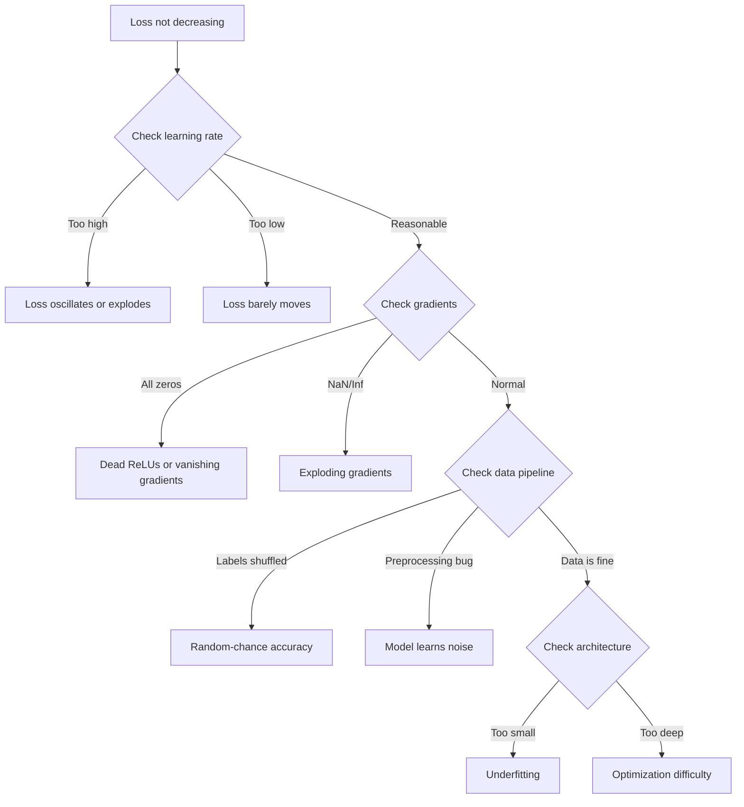
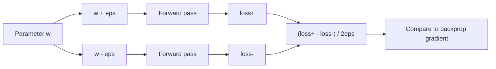
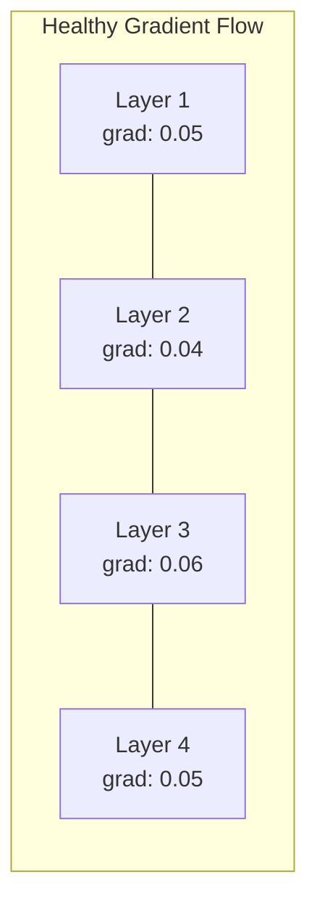
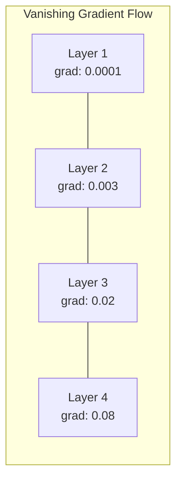
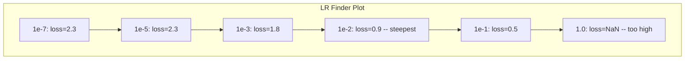

# 调试神经网络

> 网络编译成功，也运行完毕，还输出了一个数值。但这个数值是错的，程序却没有崩溃。欢迎来到最棘手的调试领域——这里根本没有错误消息。

**Type:** 构建
**Languages:** Python、PyTorch
**Prerequisites:** 第 03 阶段第 01–10 课（尤其是反向传播、损失函数和优化器）
**Time:** 约 90 分钟

## 学习目标

- 使用系统化调试策略诊断常见神经网络故障，例如损失为 NaN、损失曲线平坦、过拟合和振荡
- 应用“过拟合单个批次”技术，验证模型架构和训练循环是否正确
- 检查梯度幅度、激活分布和权重范数，定位梯度消失与梯度爆炸问题
- 构建一份覆盖数据流水线、模型架构、损失函数、优化器和学习率问题的调试清单

## 问题

传统软件坏了就会崩溃。空指针会抛出异常，类型不匹配会在编译时失败，差一错误会产生显然不对的结果。

神经网络不会给你这种便利。

一个存在缺陷的神经网络可以完整运行、打印损失值并输出预测。损失甚至可能下降，预测看起来也可能合理，但模型其实在悄悄犯错——学习捷径、记忆噪声，或者收敛到毫无用处的局部极小值。Google 研究人员估计，机器学习调试时间的 60%–70% 都花在这种不会报错、只会降低模型质量的“静默”缺陷上。

正常模型和错误模型之间，往往只差一行放错位置的代码：漏掉一次 `zero_grad()`、错误地转置一个维度，或者学习率偏差 10 倍。经典文章“Recipe for Training Neural Networks”（2019）开篇就指出：“最常见的神经网络错误，正是那些不会导致程序崩溃的缺陷。”

本课会教你如何找出这些缺陷。

## 核心概念

### 调试思维方式

忘掉一边打印一边祈祷的调试方式。神经网络调试需要系统化方法，因为反馈循环很慢，一次训练需要数分钟甚至数小时；而症状又十分含糊，异常的损失表现可能有 20 种不同原因。

黄金法则是：**从简单方案开始，每次只增加一项复杂度，并独立验证每一项。**



### 症状 1：损失不下降

这是最常见的问题。训练循环一直运行，epoch 不断增加，损失却保持平坦或剧烈振荡。

**学习率错误。** 过高时，损失会振荡或跳到 NaN；过低时，损失下降得太慢，看起来像完全不动。使用 Adam 时可从 1e-3 开始，使用 SGD 时可从 1e-1 或 1e-2 开始。在认定其他地方有问题前，应始终尝试三个相邻相差 10 倍的学习率，例如 1e-2、1e-3、1e-4。

**ReLU 死亡。** ReLU 神经元收到很大的负输入时，会输出 0，梯度也是 0，之后可能再也无法激活。如果死亡神经元过多，网络就无法学习。检查方法是：打印每个 ReLU 层中激活值严格等于 0 的比例。如果超过 50%，可切换到 LeakyReLU 或降低学习率。

**梯度消失。** 在使用 Sigmoid 或 Tanh 激活的深层网络中，梯度在反向传播时会呈指数衰减。抵达第一层时，梯度已经约等于 0，前面的层因此停止学习。修复方法是使用 ReLU/GELU、添加残差连接，或使用批归一化。

**梯度爆炸。** 这是相反的问题：梯度呈指数增长，常见于 RNN 和非常深的网络，最终损失跳到 NaN。修复方法包括梯度裁剪（`torch.nn.utils.clip_grad_norm_`）、降低学习率或加入归一化。

### 症状 2：损失下降，但模型表现很差

损失确实下降，训练准确率甚至达到 99%，但测试准确率只有 55%，或者模型在真实数据上输出毫无意义的结果。

**过拟合。** 模型记住了训练数据，而没有学习规律。训练损失与验证损失之间的差距会随时间扩大。修复方法包括增加数据、使用 Dropout、权重衰减、提前停止和数据增强。

**数据泄漏。** 测试数据混入了训练过程，准确率高得可疑。常见原因包括先打乱再划分数据、用完整数据集的统计量执行预处理，以及不同数据划分中出现重复样本。正确做法是先划分，再预处理，并检查重复项。

**标签错误。** 大多数真实数据集中有 5%–10% 的标签是错的（Northcutt 等，2021，“Pervasive Label Errors in Test Sets”）。模型会学习这些噪声。可以使用置信学习发现并修复错误标签，也可以截断损失，忽略高损失样本。

### 症状 3：损失中出现 NaN 或 Inf

损失值变成 `nan` 或 `inf`，训练已经失败。

**学习率过高。** 梯度更新步幅过大，导致权重爆炸。把学习率降低 10 倍。

**log(0) 或 log(负数)。** 交叉熵损失会计算 `log(p)`。如果模型严格输出 0 或负概率，对数就会爆炸。解决方法是把预测裁剪到 `[eps, 1-eps]`，其中 `eps=1e-7`。

**除以零。** 批归一化需要除以标准差。某批次中的值完全相同时，标准差为 0。应在分母中加入 epsilon。PyTorch 默认已经这样做，但自定义实现可能没有。

**数值溢出。** 把很大的激活值传入 `exp()` 会得到 Inf，Softmax 尤其容易发生这种问题。应先减去最大值，再计算指数，也就是使用 log-sum-exp 技巧。

### 技巧 1：梯度检查

比较反向传播得到的解析梯度与有限差分得到的数值梯度。如果两者不一致，反向传播实现中就存在错误。

参数 `w` 的数值梯度为：

```
grad_numerical = (loss(w + eps) - loss(w - eps)) / (2 * eps)
```

一致性指标，也就是相对差异：

```
rel_diff = |grad_analytical - grad_numerical| / max(|grad_analytical|, |grad_numerical|, 1e-8)
```

如果 `rel_diff < 1e-5`，结果正确；如果 `rel_diff > 1e-3`，几乎可以断定存在缺陷。



### 技巧 2：激活统计量

在训练期间监控每一层激活值的均值和标准差。健康网络在归一化后会让激活均值接近 0、标准差接近 1，或者至少保持在有界范围内。

| 健康指标 | 均值 | 标准差 | 诊断 |
|-----------------|------|-----|-----------|
| 健康 | 约 0 | 约 1 | 网络正常学习 |
| 饱和 | >>0 或 <<0 | 约 0 | 激活停留在极端值 |
| 死亡 | 0 | 0 | 神经元已死亡（全部为零） |
| 爆炸 | >>10 | >>10 | 激活无限增长 |

### 技巧 3：梯度流可视化

绘制每一层的平均梯度幅度。健康网络各层的梯度幅度应该大致相近。如果前面几层的梯度比后面几层小 1000 倍，就出现了梯度消失。





### 技巧 4：过拟合单个批次测试

这是深度学习中最重要的一项调试技术。

取一个很小的批次，包含 8–32 个样本，只在这批数据上训练 100 次以上。损失应该下降到接近零，训练准确率应该达到 100%。如果没有做到，模型或训练循环就存在根本缺陷——不要继续完整训练。

这个测试可以发现：
- 错误的损失函数
- 错误的反向传播
- 架构太小，无法表示数据
- 优化器没有连接到模型参数
- 数据与标签未对齐

运行这项测试只需 30 秒，却能节省数小时的完整训练调试时间。

### 技巧 5：学习率查找器

Leslie Smith（2017）提出了一种方法：在一个 epoch 中，让学习率从很小的 1e-7 逐步增加到很大的 10，同时记录损失，再绘制损失随学习率变化的曲线。最佳学习率大致比损失下降速度最快时的学习率小 10 倍。



在这个例子中，最佳 LR 约为 1e-3，也就是比损失下降最陡处的学习率低一个数量级。

### 常见 PyTorch 缺陷

以下是 PyTorch 社区中最耗费调试时间的问题：

| 缺陷 | 症状 | 修复方法 |
|-----|---------|-----|
| 忘记调用 `optimizer.zero_grad()` | 梯度跨批次累积，损失振荡 | 加入 `optimizer.zero_grad()`，并将其放在 `loss.backward()` 之前 |
| 测试时忘记调用 `model.eval()` | Dropout 与批归一化的行为仍与训练时相同，测试准确率在多次运行之间波动 | 加入 `model.eval()` 和 `torch.no_grad()` |
| 张量形状错误 | 静默广播产生错误结果，却不报错 | 调试时在每个操作后打印形状 |
| CPU/GPU 不匹配 | `RuntimeError: expected CUDA tensor` | 对模型和数据都使用 `.to(device)` |
| 未将张量从计算图中分离 | 计算图不断增长，最终 OOM | 使用 `.detach()` 或 `with torch.no_grad()` |
| 原地操作破坏自动微分 | `RuntimeError: modified by in-place operation` | 将 `x += 1` 替换为 `x = x + 1` |
| 数据未归一化 | 损失停留在随机猜测水平 | 把输入归一化到 mean=0、std=1 |
| 标签数据类型错误 | 交叉熵期望 `Long`，实际得到 `Float` | 转换标签：`labels.long()` |

### 调试总表

| 症状 | 可能原因 | 首先尝试 |
|---------|-------------|-------------------|
| 损失停在 -log(1/num_classes) | 模型预测均匀分布 | 检查数据流水线，确认标签与输入对应 |
| 几步后损失变为 NaN | 学习率过高 | 将 LR 降低 10 倍 |
| 损失立即变为 NaN | log(0) 或除以零 | 为对数/除法操作加入 epsilon |
| 损失剧烈振荡 | LR 过高或批大小过小 | 降低 LR、增大批大小 |
| 损失下降后进入平台期 | LR 对微调阶段来说过高 | 加入 LR 调度（余弦或阶梯衰减） |
| 训练准确率高、测试准确率低 | 过拟合 | 加入 Dropout、权重衰减或更多数据 |
| 训练准确率 = 测试准确率 = 随机水平 | 模型完全没有学习 | 运行过拟合单个批次测试 |
| 训练准确率 = 测试准确率，但两者都低 | 欠拟合 | 使用更大模型、更多层或更多特征 |
| 梯度全部为零 | ReLU 死亡或张量已从计算图中分离 | 切换到 LeakyReLU，检查 `.requires_grad` |
| 训练时内存不足 | 批次过大或计算图未释放 | 缩小批次，评估时使用 `torch.no_grad()` |

```figure
learning-curves
```

## 动手构建

下面构建一个监控激活、梯度和损失曲线的诊断工具包。你会故意为网络引入故障，再使用工具包诊断每一种问题。

### 第 1 步：NetworkDebugger 类

它会挂接到 PyTorch 模型中，记录每一层的激活与梯度统计量。

```python
import torch
import torch.nn as nn
import math


class NetworkDebugger:
    def __init__(self, model):
        self.model = model
        self.activation_stats = {}
        self.gradient_stats = {}
        self.loss_history = []
        self.lr_losses = []
        self.hooks = []
        self._register_hooks()

    def _register_hooks(self):
        for name, module in self.model.named_modules():
            if isinstance(module, (nn.Linear, nn.Conv2d, nn.ReLU, nn.LeakyReLU)):
                hook = module.register_forward_hook(self._make_activation_hook(name))
                self.hooks.append(hook)
                hook = module.register_full_backward_hook(self._make_gradient_hook(name))
                self.hooks.append(hook)

    def _make_activation_hook(self, name):
        def hook(module, input, output):
            with torch.no_grad():
                out = output.detach().float()
                self.activation_stats[name] = {
                    "mean": out.mean().item(),
                    "std": out.std().item(),
                    "fraction_zero": (out == 0).float().mean().item(),
                    "min": out.min().item(),
                    "max": out.max().item(),
                }
        return hook

    def _make_gradient_hook(self, name):
        def hook(module, grad_input, grad_output):
            if grad_output[0] is not None:
                with torch.no_grad():
                    grad = grad_output[0].detach().float()
                    self.gradient_stats[name] = {
                        "mean": grad.mean().item(),
                        "std": grad.std().item(),
                        "abs_mean": grad.abs().mean().item(),
                        "max": grad.abs().max().item(),
                    }
        return hook

    def record_loss(self, loss_value):
        self.loss_history.append(loss_value)

    def check_loss_health(self):
        if len(self.loss_history) < 2:
            return "NOT_ENOUGH_DATA"
        recent = self.loss_history[-10:]
        if any(math.isnan(v) or math.isinf(v) for v in recent):
            return "NAN_OR_INF"
        if len(self.loss_history) >= 20:
            first_half = sum(self.loss_history[:10]) / 10
            second_half = sum(self.loss_history[-10:]) / 10
            if second_half >= first_half * 0.99:
                return "NOT_DECREASING"
        if len(recent) >= 5:
            diffs = [recent[i+1] - recent[i] for i in range(len(recent)-1)]
            if max(diffs) - min(diffs) > 2 * abs(sum(diffs) / len(diffs)):
                return "OSCILLATING"
        return "HEALTHY"

    def check_activations(self):
        issues = []
        for name, stats in self.activation_stats.items():
            if stats["fraction_zero"] > 0.5:
                issues.append(f"DEAD_NEURONS: {name} has {stats['fraction_zero']:.0%} zero activations")
            if abs(stats["mean"]) > 10:
                issues.append(f"EXPLODING_ACTIVATIONS: {name} mean={stats['mean']:.2f}")
            if stats["std"] < 1e-6:
                issues.append(f"COLLAPSED_ACTIVATIONS: {name} std={stats['std']:.2e}")
        return issues if issues else ["HEALTHY"]

    def check_gradients(self):
        issues = []
        grad_magnitudes = []
        for name, stats in self.gradient_stats.items():
            grad_magnitudes.append((name, stats["abs_mean"]))
            if stats["abs_mean"] < 1e-7:
                issues.append(f"VANISHING_GRADIENT: {name} abs_mean={stats['abs_mean']:.2e}")
            if stats["abs_mean"] > 100:
                issues.append(f"EXPLODING_GRADIENT: {name} abs_mean={stats['abs_mean']:.2e}")
        if len(grad_magnitudes) >= 2:
            first_mag = grad_magnitudes[0][1]
            last_mag = grad_magnitudes[-1][1]
            if last_mag > 0 and first_mag / last_mag > 100:
                issues.append(f"GRADIENT_RATIO: first/last = {first_mag/last_mag:.0f}x (vanishing)")
        return issues if issues else ["HEALTHY"]

    def print_report(self):
        print("\n=== NETWORK DEBUGGER REPORT ===")
        print(f"\nLoss health: {self.check_loss_health()}")
        if self.loss_history:
            print(f"  Last 5 losses: {[f'{v:.4f}' for v in self.loss_history[-5:]]}")
        print("\nActivation diagnostics:")
        for item in self.check_activations():
            print(f"  {item}")
        print("\nGradient diagnostics:")
        for item in self.check_gradients():
            print(f"  {item}")
        print("\nPer-layer activation stats:")
        for name, stats in self.activation_stats.items():
            print(f"  {name}: mean={stats['mean']:.4f} std={stats['std']:.4f} zero={stats['fraction_zero']:.1%}")
        print("\nPer-layer gradient stats:")
        for name, stats in self.gradient_stats.items():
            print(f"  {name}: abs_mean={stats['abs_mean']:.2e} max={stats['max']:.2e}")

    def remove_hooks(self):
        for hook in self.hooks:
            hook.remove()
        self.hooks.clear()
```

### 第 2 步：过拟合单个批次测试

```python
def overfit_one_batch(model, x_batch, y_batch, criterion, lr=0.01, steps=200):
    optimizer = torch.optim.Adam(model.parameters(), lr=lr)
    model.train()
    print("\n=== OVERFIT ONE BATCH TEST ===")
    print(f"Batch size: {x_batch.shape[0]}, Steps: {steps}")

    for step in range(steps):
        optimizer.zero_grad()
        output = model(x_batch)
        loss = criterion(output, y_batch)
        loss.backward()
        optimizer.step()

        if step % 50 == 0 or step == steps - 1:
            with torch.no_grad():
                preds = (output > 0).float() if output.shape[-1] == 1 else output.argmax(dim=1)
                targets = y_batch if y_batch.dim() == 1 else y_batch.squeeze()
                acc = (preds.squeeze() == targets).float().mean().item()
            print(f"  Step {step:3d} | Loss: {loss.item():.6f} | Accuracy: {acc:.1%}")

    final_loss = loss.item()
    if final_loss > 0.1:
        print(f"\n  FAIL: Loss did not converge ({final_loss:.4f}). Model or training loop is broken.")
        return False
    print(f"\n  PASS: Loss converged to {final_loss:.6f}")
    return True
```

### 第 3 步：学习率查找器

```python
def find_learning_rate(model, x_data, y_data, criterion, start_lr=1e-7, end_lr=10, steps=100):
    import copy
    original_state = copy.deepcopy(model.state_dict())
    optimizer = torch.optim.SGD(model.parameters(), lr=start_lr)
    lr_mult = (end_lr / start_lr) ** (1 / steps)

    model.train()
    results = []
    best_loss = float("inf")
    current_lr = start_lr

    print("\n=== LEARNING RATE FINDER ===")

    for step in range(steps):
        optimizer.zero_grad()
        output = model(x_data)
        loss = criterion(output, y_data)

        if math.isnan(loss.item()) or loss.item() > best_loss * 10:
            break

        best_loss = min(best_loss, loss.item())
        results.append((current_lr, loss.item()))

        loss.backward()
        optimizer.step()

        current_lr *= lr_mult
        for param_group in optimizer.param_groups:
            param_group["lr"] = current_lr

    model.load_state_dict(original_state)

    if len(results) < 10:
        print("  Could not complete LR sweep -- loss diverged too quickly")
        return results

    min_loss_idx = min(range(len(results)), key=lambda i: results[i][1])
    suggested_lr = results[max(0, min_loss_idx - 10)][0]

    print(f"  Swept {len(results)} steps from {start_lr:.0e} to {results[-1][0]:.0e}")
    print(f"  Minimum loss {results[min_loss_idx][1]:.4f} at lr={results[min_loss_idx][0]:.2e}")
    print(f"  Suggested learning rate: {suggested_lr:.2e}")

    return results
```

### 第 4 步：梯度检查器

```python
def _flat_to_multi_index(flat_idx, shape):
    multi_idx = []
    remaining = flat_idx
    for dim in reversed(shape):
        multi_idx.insert(0, remaining % dim)
        remaining //= dim
    return tuple(multi_idx)


def gradient_check(model, x, y, criterion, eps=1e-4):
    model.train()
    x_double = x.double()
    y_double = y.double()
    model_double = model.double()

    print("\n=== GRADIENT CHECK ===")
    overall_max_diff = 0
    checked = 0

    for name, param in model_double.named_parameters():
        if not param.requires_grad:
            continue

        layer_max_diff = 0

        model_double.zero_grad()
        output = model_double(x_double)
        loss = criterion(output, y_double)
        loss.backward()
        analytical_grad = param.grad.clone()

        num_checks = min(5, param.numel())
        for i in range(num_checks):
            idx = _flat_to_multi_index(i, param.shape)
            original = param.data[idx].item()

            param.data[idx] = original + eps
            with torch.no_grad():
                loss_plus = criterion(model_double(x_double), y_double).item()

            param.data[idx] = original - eps
            with torch.no_grad():
                loss_minus = criterion(model_double(x_double), y_double).item()

            param.data[idx] = original

            numerical = (loss_plus - loss_minus) / (2 * eps)
            analytical = analytical_grad[idx].item()

            denom = max(abs(numerical), abs(analytical), 1e-8)
            rel_diff = abs(numerical - analytical) / denom

            layer_max_diff = max(layer_max_diff, rel_diff)
            checked += 1

        overall_max_diff = max(overall_max_diff, layer_max_diff)
        status = "OK" if layer_max_diff < 1e-5 else "MISMATCH"
        print(f"  {name}: max_rel_diff={layer_max_diff:.2e} [{status}]")

    model.float()

    print(f"\n  Checked {checked} parameters")
    if overall_max_diff < 1e-5:
        print("  PASS: Gradients match (rel_diff < 1e-5)")
    elif overall_max_diff < 1e-3:
        print("  WARN: Small differences (1e-5 < rel_diff < 1e-3)")
    else:
        print("  FAIL: Gradient mismatch detected (rel_diff > 1e-3)")
    return overall_max_diff
```

### 第 5 步：故意构造故障网络

现在把工具包用于这些故障网络，并逐一诊断问题。

```python
def demo_broken_networks():
    torch.manual_seed(42)
    x = torch.randn(64, 10)
    y = (x[:, 0] > 0).long()

    print("\n" + "=" * 60)
    print("BUG 1: Learning rate too high (lr=10)")
    print("=" * 60)
    model1 = nn.Sequential(nn.Linear(10, 32), nn.ReLU(), nn.Linear(32, 2))
    debugger1 = NetworkDebugger(model1)
    optimizer1 = torch.optim.SGD(model1.parameters(), lr=10.0)
    criterion = nn.CrossEntropyLoss()
    for step in range(20):
        optimizer1.zero_grad()
        out = model1(x)
        loss = criterion(out, y)
        debugger1.record_loss(loss.item())
        loss.backward()
        optimizer1.step()
    debugger1.print_report()
    debugger1.remove_hooks()

    print("\n" + "=" * 60)
    print("BUG 2: Dead ReLUs from bad initialization")
    print("=" * 60)
    model2 = nn.Sequential(nn.Linear(10, 32), nn.ReLU(), nn.Linear(32, 32), nn.ReLU(), nn.Linear(32, 2))
    with torch.no_grad():
        for m in model2.modules():
            if isinstance(m, nn.Linear):
                m.weight.fill_(-1.0)
                m.bias.fill_(-5.0)
    debugger2 = NetworkDebugger(model2)
    optimizer2 = torch.optim.Adam(model2.parameters(), lr=1e-3)
    for step in range(50):
        optimizer2.zero_grad()
        out = model2(x)
        loss = criterion(out, y)
        debugger2.record_loss(loss.item())
        loss.backward()
        optimizer2.step()
    debugger2.print_report()
    debugger2.remove_hooks()

    print("\n" + "=" * 60)
    print("BUG 3: Missing zero_grad (gradients accumulate)")
    print("=" * 60)
    model3 = nn.Sequential(nn.Linear(10, 32), nn.ReLU(), nn.Linear(32, 2))
    debugger3 = NetworkDebugger(model3)
    optimizer3 = torch.optim.SGD(model3.parameters(), lr=0.01)
    for step in range(50):
        out = model3(x)
        loss = criterion(out, y)
        debugger3.record_loss(loss.item())
        loss.backward()
        optimizer3.step()
    debugger3.print_report()
    debugger3.remove_hooks()

    print("\n" + "=" * 60)
    print("HEALTHY NETWORK: Correct setup for comparison")
    print("=" * 60)
    model_good = nn.Sequential(nn.Linear(10, 32), nn.ReLU(), nn.Linear(32, 2))
    debugger_good = NetworkDebugger(model_good)
    optimizer_good = torch.optim.Adam(model_good.parameters(), lr=1e-3)
    for step in range(50):
        optimizer_good.zero_grad()
        out = model_good(x)
        loss = criterion(out, y)
        debugger_good.record_loss(loss.item())
        loss.backward()
        optimizer_good.step()
    debugger_good.print_report()
    debugger_good.remove_hooks()

    print("\n" + "=" * 60)
    print("OVERFIT-ONE-BATCH TEST (healthy model)")
    print("=" * 60)
    model_test = nn.Sequential(nn.Linear(10, 32), nn.ReLU(), nn.Linear(32, 2))
    overfit_one_batch(model_test, x[:8], y[:8], criterion)

    print("\n" + "=" * 60)
    print("LEARNING RATE FINDER")
    print("=" * 60)
    model_lr = nn.Sequential(nn.Linear(10, 32), nn.ReLU(), nn.Linear(32, 2))
    find_learning_rate(model_lr, x, y, criterion)

    print("\n" + "=" * 60)
    print("GRADIENT CHECK")
    print("=" * 60)
    model_grad = nn.Sequential(nn.Linear(10, 8), nn.ReLU(), nn.Linear(8, 2))
    gradient_check(model_grad, x[:4], y[:4], criterion)
```

## 实际应用

### PyTorch 内置工具

```python
import torch
import torch.nn as nn

model = nn.Sequential(
    nn.Linear(768, 256),
    nn.ReLU(),
    nn.Linear(256, 10),
)

with torch.autograd.detect_anomaly():
    output = model(input_tensor)
    loss = criterion(output, target)
    loss.backward()

for name, param in model.named_parameters():
    if param.grad is not None:
        print(f"{name}: grad_mean={param.grad.abs().mean():.2e}")
```

### 集成 Weights & Biases

```python
import wandb

wandb.init(project="debug-training")

for epoch in range(100):
    loss = train_one_epoch()
    wandb.log({
        "loss": loss,
        "lr": optimizer.param_groups[0]["lr"],
        "grad_norm": torch.nn.utils.clip_grad_norm_(model.parameters(), float("inf")),
    })

    for name, param in model.named_parameters():
        if param.grad is not None:
            wandb.log({f"grad/{name}": wandb.Histogram(param.grad.cpu().numpy())})
```

### TensorBoard

```python
from torch.utils.tensorboard import SummaryWriter

writer = SummaryWriter("runs/debug_experiment")

for epoch in range(100):
    loss = train_one_epoch()
    writer.add_scalar("Loss/train", loss, epoch)

    for name, param in model.named_parameters():
        writer.add_histogram(f"weights/{name}", param, epoch)
        if param.grad is not None:
            writer.add_histogram(f"gradients/{name}", param.grad, epoch)
```

### 完整训练前的调试清单

1. 运行过拟合单个批次测试。如果失败，立即停下。
2. 打印模型摘要，确认参数数量合理。
3. 使用随机数据执行一次前向传播，检查输出形状。
4. 训练 5 个 epoch，确认损失在下降。
5. 检查激活统计量，确保没有失活层，也没有数值爆炸。
6. 检查梯度流，确保没有梯度消失或爆炸。
7. 验证数据流水线，随机打印 5 个样本及其标签。

## 交付成果

本课会产出：
- `outputs/prompt-nn-debugger.md`——用于诊断神经网络训练故障的提示词
- `outputs/skill-debug-checklist.md`——用于调试训练问题的决策树式清单

部署调试功能时的关键模式：
- 在生产训练脚本中加入监控钩子
- 每隔 N 步把激活和梯度统计量记录到 W&B 或 TensorBoard
- 为 NaN 损失、死亡神经元（超过 80% 激活为零）或梯度爆炸实现自动告警
- 每次修改架构或数据流水线时，都运行过拟合单个批次测试

## 练习

1. **添加梯度爆炸检测器。** 修改 `NetworkDebugger`，让它在梯度超过阈值时自动建议梯度裁剪值。在一个没有归一化的 20 层网络上测试。

2. **构建死亡神经元复活器。** 编写函数识别始终输出 0 的 ReLU 死亡神经元，并使用 Kaiming 初始化重新设置连接到这些神经元的权重。证明它能恢复一个超过 70% 神经元已经死亡的网络。

3. **实现带绘图的学习率查找器。** 扩展 `find_learning_rate`，把结果保存为 CSV，再编写独立脚本读取 CSV，并使用 matplotlib 显示 LR—损失曲线。找出 ResNet-18 在 CIFAR-10 上的最佳 LR。

4. **创建数据流水线验证器。** 编写函数检查训练集与测试集之间的重复样本、标签分布不平衡（比例超过 10:1）、输入归一化（均值接近 0、标准差接近 1），以及数据中的 NaN/Inf。在一份故意破坏的数据集上运行。

5. **调试真实故障。** 使用第 10 课的迷你框架，引入一个隐蔽缺陷，例如在 backward 中转置权重矩阵，再通过梯度检查准确定位哪个参数的梯度不正确，并记录调试过程。

## 关键术语

| 术语 | 人们常说 | 实际含义 |
|------|----------------|----------------------|
| 静默缺陷 | “能运行，但结果很差” | 不产生错误却会降低模型质量的缺陷，是机器学习中的主要失败模式 |
| ReLU 死亡 | “神经元死了” | 输入始终为负、因而永久输出 0 并接收 0 梯度的 ReLU 神经元 |
| 梯度消失 | “前面的层停止学习” | 梯度穿过多层时呈指数衰减，使前面层的权重实际上被冻结 |
| 梯度爆炸 | “损失变成 NaN” | 梯度穿过多层时呈指数增长，导致权重更新大到发生溢出 |
| 梯度检查 | “验证反向传播是否正确” | 比较反向传播得到的解析梯度与有限差分得到的数值梯度 |
| 过拟合单个批次 | “最重要的调试测试” | 只在一个小批次上训练，以验证模型确实能够学习；如果不能，说明存在根本问题 |
| LR 查找器 | “扫描并找到合适学习率” | 在一个 epoch 中按指数增大学习率，并选择损失发散前的取值 |
| 数据泄漏 | “测试数据混入训练” | 测试集信息污染训练过程，产生虚高准确率的情况 |
| 激活统计量 | “监控层的健康状况” | 追踪每层输出的均值、标准差和零值比例，以检测死亡、饱和或爆炸的神经元 |
| 梯度裁剪 | “限制梯度幅度” | 当梯度范数超过阈值时按比例缩小梯度，防止梯度爆炸式更新 |

## 延伸阅读

- Smith，《Cyclical Learning Rates for Training Neural Networks》（2017）——提出学习率范围测试，也就是 LR 查找器的论文
- Northcutt 等，《Pervasive Label Errors in Test Sets Destabilize Machine Learning Benchmarks》（2021）——证明 ImageNet、CIFAR-10 等主要基准中有 3%–6% 的标签错误
- Zhang 等，《Understanding Deep Learning Requires Rethinking Generalization》（2017）——证明神经网络可以记住随机标签，也解释了过拟合单个批次测试为何有效
- PyTorch 关于 `torch.autograd.detect_anomaly` 和 `torch.autograd.set_detect_anomaly` 的文档，用于内置 NaN/Inf 检测
