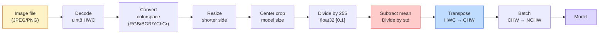
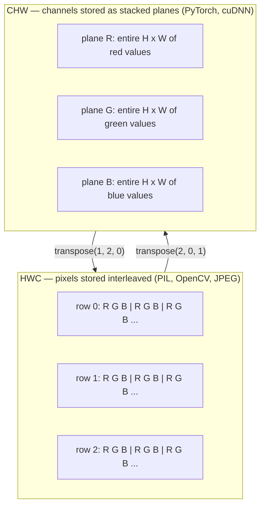

# 图像基础——像素、通道与颜色空间

> 图像是由光线采样值构成的张量。你以后使用的每一个视觉模型，都从这个事实出发。

**Type:** 构建
**Languages:** Python
**Prerequisites:** 第 1 阶段第 12 课（张量运算）、第 3 阶段第 11 课（PyTorch 入门）
**Time:** 约 45 分钟

## 学习目标

- 解释连续场景如何离散化为像素，以及采样与量化决策为何会决定所有下游模型的性能上限
- 把图像作为 NumPy 数组读取、切片和检查，并熟练切换 HWC 与 CHW 布局
- 在 RGB、灰度、HSV 和 YCbCr 之间转换，并说明每种颜色空间存在的理由
- 完全按照预训练 PyTorch 视觉模型的要求，应用像素级预处理，包括归一化、标准化、缩放和通道前置

## 问题所在

你会阅读的每篇论文、下载的每份预训练权重、调用的每个视觉 API，都假设输入采用某种特定编码。如果把 `uint8` 图像传给需要 `float32` 的模型，程序仍会运行——但会悄无声息地产生垃圾结果。把 BGR 输入到使用 RGB 训练的网络，准确率会骤降十个百分点。模型期待通道优先输入时，却传入通道在后的数据，第一层卷积就会把高度当成特征通道。这些问题都不会抛出错误，只会毁掉指标，让你花上一周寻找一个其实藏在文件加载方式中的缺陷。

理解卷积究竟在什么数据上滑动之后，卷积本身并不复杂。真正困难的是，对相机、JPEG 解码器、PIL、OpenCV、torchvision 和 CUDA 内核而言，“图像”分别代表不同的东西。每套技术栈都有自己的轴顺序、字节范围和通道约定。无法理清这些差异的视觉工程师，会交付存在缺陷的流水线。

本课会打牢基础，让本阶段余下内容可以建立在它之上。完成后，你将理解像素是什么、为什么每个像素包含三个数而不是一个、“使用 ImageNet 统计量归一化”究竟做了什么，以及如何在本阶段其他课程默认使用的两三种布局之间切换。

## 核心概念

### 完整预处理流水线概览

每个生产级视觉系统都由同一系列可逆变换组成。只要其中一步出错，模型看到的输入就会与训练时不同。



红色和蓝色两个框是 80% 静默故障的来源：缺少标准化，以及布局错误。

### 像素是采样点，而不是方块

相机传感器会统计落在微型探测器网格上的光子。每个探测器在短暂时间内积累光线，并输出与接收到的光子数量成正比的电压。随后，传感器把这个电压离散化为整数，一个探测器就对应一个像素。

```
Continuous scene                 Sensor grid                     Digital image
(infinite detail)                (H x W detectors)               (H x W integers)

    ~~~~~                        +--+--+--+--+--+                 210 198 180 155 120
   ~   ~   ~                     |  |  |  |  |  |                 205 195 178 152 118
  ~ light ~      ---->           +--+--+--+--+--+     ---->       200 190 175 150 115
   ~~~~~                         |  |  |  |  |  |                 195 185 170 148 112
                                 +--+--+--+--+--+                 188 180 165 145 108
```

这一步会作出两个选择，而它们决定了所有下游处理的性能上限：

- **空间采样**决定场景每一度视角上安排多少个探测器。探测器太少，边缘会呈锯齿状，也就是混叠；太多，则存储与计算量会急剧增加。
- **强度量化**决定把电压划分得多细。8 位可表示 256 个级别，是显示领域的标准；10 位、12 位和 16 位能产生更平滑的渐变，对医学影像、HDR 和原始传感器流水线十分重要。

像素并不是一个带面积的彩色方块，而是一次单独测量。缩放或旋转图像时，你实际上是在对这张测量网格重新采样。

### 为什么有三个通道

一个探测器会统计整个可见光谱中的光子，这样得到的是灰度。为了获得颜色，传感器会在网格上覆盖红、绿、蓝滤色片组成的马赛克。经过去马赛克处理后，每个空间位置都有三个整数，分别来自附近的红色、绿色和蓝色滤光探测器。这三个整数就是该像素的 RGB 三元组。

```
One pixel in memory:

    (R, G, B) = (210, 140, 30)   <- reddish-orange

An H x W RGB image:

    shape (H, W, 3)     stored as   H rows of W pixels of 3 values
                                    each in [0, 255] for uint8
```

三个通道并不神奇。深度相机会增加 Z 通道，卫星会增加红外与紫外波段，医学扫描通常只有一个通道（X 光、CT），也可能拥有很多通道（高光谱）。通道数位于最后一个轴上；卷积层会学习如何跨通道混合信息。

### 两种布局约定：HWC 与 CHW

同一个张量可以有两种排列顺序，每个库都会选择其中一种。

```
HWC (height, width, channels)           CHW (channels, height, width)

   W ->                                    H ->
  +-----+-----+-----+                     +-----+-----+
H |R G B|R G B|R G B|                   C |R R R R R R|
| +-----+-----+-----+                   | +-----+-----+
v |R G B|R G B|R G B|                   v |G G G G G G|
  +-----+-----+-----+                     +-----+-----+
                                          |B B B B B B|
                                          +-----+-----+

   PIL, OpenCV, matplotlib,              PyTorch, most deep learning
   almost every image file on disk       frameworks, cuDNN kernels
```

CHW 之所以存在，是因为卷积核会沿 H 和 W 滑动。把通道轴放在最前面，可以让每个卷积核看到每个通道上一块连续的二维平面，便于向量化。磁盘格式采用 HWC，则是因为它符合传感器逐扫描线输出数据的方式。

下面这行转换代码，你以后会写上千次：

```
img_chw = img_hwc.transpose(2, 0, 1)      # NumPy
img_chw = img_hwc.permute(2, 0, 1)        # PyTorch tensor
```

内存布局可视化如下：



### 字节范围与数据类型

以下三种约定最为常见：

| 约定 | dtype | 范围 | 常见位置 |
|------------|-------|-------|------------------|
| 原始值 | `uint8` | [0, 255] | 磁盘文件、PIL、OpenCV 输出 |
| 归一化 | `float32` | [0.0, 1.0] | 执行 `img.astype('float32') / 255` 之后 |
| 标准化 | `float32` | 大约 [-2, +2] | 减去均值并除以标准差之后 |

卷积网络使用标准化后的输入训练。ImageNet 统计量 `mean=[0.485, 0.456, 0.406]`、`std=[0.229, 0.224, 0.225]`，是在整个 ImageNet 训练集上，对已经归一化到 [0, 1] 的像素计算出的三个通道算术均值和标准差。把原始 `uint8` 输入一个期待标准化浮点数的模型，是应用视觉中最常见的静默故障。

### 颜色空间及其存在的原因

RGB 是采集格式，却不一定始终是对模型最有用的表示。

```
 RGB               HSV                       YCbCr / YUV

 R red             H hue (angle 0-360)       Y luminance (brightness)
 G green           S saturation (0-1)        Cb chroma blue-yellow
 B blue            V value/brightness (0-1)  Cr chroma red-green

 Linear to         Separates color from      Separates brightness from
 sensor output     brightness. Useful for    color. JPEG and most video
                   color thresholding, UI    codecs compress the chroma
                   sliders, simple filters   channels harder because the
                                             human eye is less sensitive
                                             to chroma detail than to Y.
```

大多数现代 CNN 都直接接收 RGB。以下场景会遇到其他颜色空间：

- **HSV**——经典计算机视觉代码、基于颜色的分割、白平衡。
- **YCbCr**——读取 JPEG 内部数据、视频流水线，以及只处理 Y 通道的超分辨率模型。
- **灰度**——OCR、文档模型，以及颜色是干扰变量而非信号的任何场景。

从 RGB 转换灰度时应使用加权和，而非简单平均，因为人眼对绿色比红色或蓝色更敏感：

```
Y = 0.299 R + 0.587 G + 0.114 B       (ITU-R BT.601, the classic weights)
```

### 宽高比、缩放与插值

每个模型都有固定输入尺寸，大多数 ImageNet 分类器使用 224x224，现代检测器则常用 384x384 或 512x512，而你的图像很少恰好符合。以下三种缩放选择最重要：

- **缩放短边，再中心裁剪**——标准 ImageNet 方案。保持宽高比，但会丢弃边缘的一条区域。
- **缩放并填充**——保持宽高比并保留每个像素，但会增加黑边，是检测与 OCR 的标准选择。
- **直接缩放到目标大小**——拉伸图像。成本低，会扭曲几何形状，但对许多分类任务已经足够。

新网格与旧网格无法对齐时，插值方法决定中间像素如何计算：

```
Nearest neighbour     fastest, blocky, only choice for masks/labels
Bilinear              fast, smooth, default for most image resizing
Bicubic               slower, sharper on upscaling
Lanczos               slowest, best quality, used for final display
```

经验法则是：训练使用双线性插值，需要展示的素材使用双三次或 Lanczos，包含整数类别 ID 的任何数据都使用最近邻插值。

```figure
conv-output-size
```

## 动手构建

### 第 1 步：构建图像张量并检查形状

先使用确定性的合成图像，让第一个实验只依赖 NumPy，也能离线运行。文件解码是另一条边界：无论 RGB 字节来自 JPEG、PNG 解码器还是这个合成生成器，只要解码完成，后续张量操作都完全相同。

```python
import numpy as np

def synthetic_rgb(h=128, w=192, seed=0):
    rng = np.random.default_rng(seed)
    yy, xx = np.meshgrid(np.linspace(0, 1, h), np.linspace(0, 1, w), indexing="ij")
    r = (np.sin(xx * 6) * 0.5 + 0.5) * 255
    g = yy * 255
    b = (1 - yy) * xx * 255
    rgb = np.stack([r, g, b], axis=-1) + rng.normal(0, 6, (h, w, 3))
    return np.clip(rgb, 0, 255).astype(np.uint8)

arr = synthetic_rgb()

print(f"type:   {type(arr).__name__}")
print(f"dtype:  {arr.dtype}")
print(f"shape:  {arr.shape}     # (H, W, C)")
print(f"min:    {arr.min()}")
print(f"max:    {arr.max()}")
print(f"pixel at (0, 0): {arr[0, 0]}")
```

预期输出为 `shape: (H, W, 3)`、`dtype: uint8`，取值范围为 `[0, 255]`。无论字节来自相机、图像解码器还是这个合成生成器，这都是解码后表示的标准形式。

### 第 2 步：拆分通道并重新排列布局

分别取出 R、G、B，再把布局从 HWC 转换成 PyTorch 使用的 CHW。

```python
R = arr[:, :, 0]
G = arr[:, :, 1]
B = arr[:, :, 2]
print(f"R shape: {R.shape}, mean: {R.mean():.1f}")
print(f"G shape: {G.shape}, mean: {G.mean():.1f}")
print(f"B shape: {B.shape}, mean: {B.mean():.1f}")

arr_chw = arr.transpose(2, 0, 1)
print(f"\nHWC shape: {arr.shape}")
print(f"CHW shape: {arr_chw.shape}")
```

这样得到三个灰度平面，每个通道一个。CHW 只是重新排列轴；如果内存布局允许，并不一定需要复制数据。

### 第 3 步：灰度与 HSV 转换

先使用加权和得到灰度图，再手工实现 RGB 到 HSV 的转换。

```python
def rgb_to_grayscale(rgb):
    weights = np.array([0.299, 0.587, 0.114], dtype=np.float32)
    return (rgb.astype(np.float32) @ weights).astype(np.uint8)

def rgb_to_hsv(rgb):
    rgb_f = rgb.astype(np.float32) / 255.0
    r, g, b = rgb_f[..., 0], rgb_f[..., 1], rgb_f[..., 2]
    cmax = np.max(rgb_f, axis=-1)
    cmin = np.min(rgb_f, axis=-1)
    delta = cmax - cmin

    h = np.zeros_like(cmax)
    mask = delta > 0
    argmax = np.argmax(rgb_f, axis=-1)
    rmax = mask & (argmax == 0)
    gmax = mask & (argmax == 1)
    bmax = mask & (argmax == 2)
    h[rmax] = ((g[rmax] - b[rmax]) / delta[rmax]) % 6
    h[gmax] = ((b[gmax] - r[gmax]) / delta[gmax]) + 2
    h[bmax] = ((r[bmax] - g[bmax]) / delta[bmax]) + 4
    h = h * 60.0

    s = np.divide(delta, cmax, out=np.zeros_like(delta), where=cmax > 0)
    v = cmax
    return np.stack([h, s, v], axis=-1)

gray = rgb_to_grayscale(arr)
hsv = rgb_to_hsv(arr)
print(f"gray shape: {gray.shape}, range: [{gray.min()}, {gray.max()}]")
print(f"hsv   shape: {hsv.shape}")
print(f"hue range: [{hsv[..., 0].min():.1f}, {hsv[..., 0].max():.1f}] degrees")
print(f"sat range: [{hsv[..., 1].min():.2f}, {hsv[..., 1].max():.2f}]")
print(f"val range: [{hsv[..., 2].min():.2f}, {hsv[..., 2].max():.2f}]")
```

色相以角度表示，饱和度和明度位于 [0, 1]，与 OpenCV 的 `hsv_full` 约定一致。

### 第 4 步：归一化、标准化并还原

把原始字节转换成预训练 ImageNet 模型所期待的精确张量，然后再还原回去。

```python
mean = np.array([0.485, 0.456, 0.406], dtype=np.float32)
std = np.array([0.229, 0.224, 0.225], dtype=np.float32)

def preprocess_imagenet(rgb_uint8):
    x = rgb_uint8.astype(np.float32) / 255.0
    x = (x - mean) / std
    x = x.transpose(2, 0, 1)
    return x

def deprocess_imagenet(chw_float32):
    x = chw_float32.transpose(1, 2, 0)
    x = x * std + mean
    x = np.clip(x * 255.0, 0, 255).astype(np.uint8)
    return x

x = preprocess_imagenet(arr)
print(f"preprocessed shape: {x.shape}     # (C, H, W)")
print(f"preprocessed dtype: {x.dtype}")
print(f"preprocessed mean per channel:  {x.mean(axis=(1, 2)).round(3)}")
print(f"preprocessed std  per channel:  {x.std(axis=(1, 2)).round(3)}")

roundtrip = deprocess_imagenet(x)
max_diff = np.abs(roundtrip.astype(int) - arr.astype(int)).max()
print(f"roundtrip max pixel diff: {max_diff}    # should be 0 or 1")
```

每个通道的均值应该接近零，标准差接近一。preprocess/deprocess 这一对函数，正是每次调用 torchvision `transforms.Normalize` 时底层所做的工作。

### 第 5 步：从零实现缩放

最近邻插值会把每个输出坐标舍入到一个源像素。双线性插值则找到周围四个像素，并按照距离进行混合。下面两种实现都使用端点对齐坐标，因此首尾两个源像素保持固定。

```python
def resize_coordinates(source_length, target_length):
    if target_length == 1:
        return np.zeros(1, dtype=np.float32)
    return np.linspace(0, source_length - 1, target_length, dtype=np.float32)

def nearest_resize(image, target_height, target_width):
    y = np.rint(resize_coordinates(image.shape[0], target_height)).astype(int)
    x = np.rint(resize_coordinates(image.shape[1], target_width)).astype(int)
    return image[y[:, None], x[None, :]]

def bilinear_resize(image, target_height, target_width):
    y = resize_coordinates(image.shape[0], target_height)
    x = resize_coordinates(image.shape[1], target_width)
    y0 = np.floor(y).astype(int)
    x0 = np.floor(x).astype(int)
    y1 = np.minimum(y0 + 1, image.shape[0] - 1)
    x1 = np.minimum(x0 + 1, image.shape[1] - 1)
    wy = (y - y0)[:, None, None]
    wx = (x - x0)[None, :, None]

    source = image.astype(np.float32)
    top = source[y0[:, None], x0[None, :]] * (1 - wx)
    top += source[y0[:, None], x1[None, :]] * wx
    bottom = source[y1[:, None], x0[None, :]] * (1 - wx)
    bottom += source[y1[:, None], x1[None, :]] * wx
    result = top * (1 - wy) + bottom * wy
    return np.clip(np.rint(result), 0, 255).astype(image.dtype)

target_height = arr.shape[0] * 3
target_width = arr.shape[1] * 3
nearest = nearest_resize(arr, target_height, target_width)
bilinear = bilinear_resize(arr, target_height, target_width)

def local_roughness(x):
    gy = np.diff(x.astype(float), axis=0)
    gx = np.diff(x.astype(float), axis=1)
    return float(np.abs(gy).mean() + np.abs(gx).mean())

for name, out in [("nearest", nearest), ("bilinear", bilinear)]:
    print(f"{name:>8}  shape={out.shape}  roughness={local_roughness(out):6.2f}")
```

最近邻插值的粗糙度得分最高，因为它保留了硬边缘；双线性插值更平滑，因为每个新像素都会混合两个轴上的相邻位置。配套可运行代码把同样的可分离思路扩展到每个轴四个邻居的 Catmull-Rom 三次核，并且无需图像库即可打印三种结果。

## 实际应用

PyTorch 会在支持批次和设备的张量上执行相同操作。下面的代码会缩放短边、执行中心裁剪、逐通道标准化，并生成预训练模型期待的 NCHW 张量。

```python
import torch
import torch.nn.functional as F

image_hwc = torch.from_numpy(synthetic_rgb(256, 320))
batch = image_hwc.permute(2, 0, 1).unsqueeze(0).float() / 255.0

height, width = batch.shape[-2:]
scale = 256 / min(height, width)
resized_height = round(height * scale)
resized_width = round(width * scale)
batch = F.interpolate(
    batch,
    size=(resized_height, resized_width),
    mode="bilinear",
    align_corners=False,
    antialias=True,
)

top = (resized_height - 224) // 2
left = (resized_width - 224) // 2
batch = batch[:, :, top:top + 224, left:left + 224]

mean = torch.tensor([0.485, 0.456, 0.406]).view(1, 3, 1, 1)
std = torch.tensor([0.229, 0.224, 0.225]).view(1, 3, 1, 1)
batch = (batch - mean) / std

print(f"tensor dtype: {batch.dtype}")
print(f"batched shape: {tuple(batch.shape)}")
print(f"per-channel mean: {batch.mean(dim=(0, 2, 3)).tolist()}")
print(f"per-channel std:  {batch.std(dim=(0, 2, 3)).tolist()}")
```

必须严格按照以下四步顺序执行：把字节转换为浮点数并把 HWC 改成 NCHW；将短边缩放到 256；执行 224x224 中心裁剪；最后减去 ImageNet 均值并除以标准差。改变顺序会悄无声息地改变模型实际接收的内容。

## 交付成果

本课会产出：

- `outputs/prompt-vision-preprocessing-audit.md`——把任意模型卡或数据集卡转换成检查清单，列出团队必须遵守的精确预处理不变量。
- `outputs/skill-image-tensor-inspector.md`——给定任意图像形状的张量或数组，报告数据类型、布局和范围，并判断它看起来是原始值、归一化值还是标准化值。

## 练习

1. **（简单）** 创建一个包含四种不同颜色的 2x2 RGB `uint8` 数组。从 HWC 转换成 CHW 再转回来，打印两种形状，并证明往返转换保留了每一个值。
2. **（中等）** 编写 `standardize(img, mean, std)` 及其逆函数，确保两者在任意 uint8 图像上通过 `roundtrip_max_diff <= 1` 测试。两个函数必须使用同一种调用方式，既能处理 HWC 的单张图像，也能处理 NCHW 批次。
3. **（困难）** 取一个包含 3 个通道、已经按 ImageNet 统计量标准化的张量，让它通过一个 1x1 卷积，由卷积学习 RGB 到单通道灰度的加权混合。把权重初始化为 `[0.299, 0.587, 0.114]` 并冻结，验证输出与手工实现的 `rgb_to_grayscale` 在浮点误差范围内一致。还有哪些经典颜色空间变换可以表示成 1x1 卷积？

## 关键术语

| 术语 | 人们常说 | 实际含义 |
|------|----------------|----------------------|
| 像素 | “彩色方块” | 网格中某个位置上的一次光强采样；彩色图像有三个数，灰度图像有一个数 |
| 通道 | “颜色” | 堆叠成图像张量的平行空间网格之一；HWC 中位于最后一轴，CHW 中位于第一轴 |
| HWC / CHW | “形状” | 图像张量的轴顺序；磁盘格式和 PIL 使用 HWC，PyTorch 与 cuDNN 使用 CHW |
| 归一化 | “缩放图像” | 除以 255，使像素位于 [0, 1]；这是必要步骤，但仅此还不够 |
| 标准化 | “零中心化” | 逐通道减去均值并除以标准差，使输入分布与模型训练时一致 |
| 灰度转换 | “对通道取平均” | 使用 0.299/0.587/0.114 系数进行加权求和，以符合人类对亮度的感知 |
| 插值 | “缩放时如何选择像素” | 新网格与旧网格不对齐时决定输出值的规则；标签使用最近邻，训练使用双线性，展示使用双三次 |
| 宽高比 | “宽度除以高度” | 区分“缩放并填充”与“缩放并拉伸”的比率 |

## 延伸阅读

- [Charles Poynton——A Guided Tour of Color Space](https://poynton.ca/PDFs/Guided_tour.pdf)——对颜色空间为何如此之多、每种颜色空间何时有用的清晰技术说明
- [PyTorch Vision Transforms 文档](https://pytorch.org/vision/stable/transforms.html)——生产环境中实际组合使用的完整变换流水线
- [How JPEG Works（Colt McAnlis）](https://www.youtube.com/watch?v=F1kYBnY6mwg)——直观介绍色度子采样、DCT，以及 JPEG 为何编码 YCbCr 而非 RGB
- [ImageNet 预处理约定（torchvision models）](https://pytorch.org/vision/stable/models.html)——`mean=[0.485, 0.456, 0.406]` 的权威来源，以及模型库中每个模型为何都期待这种输入
