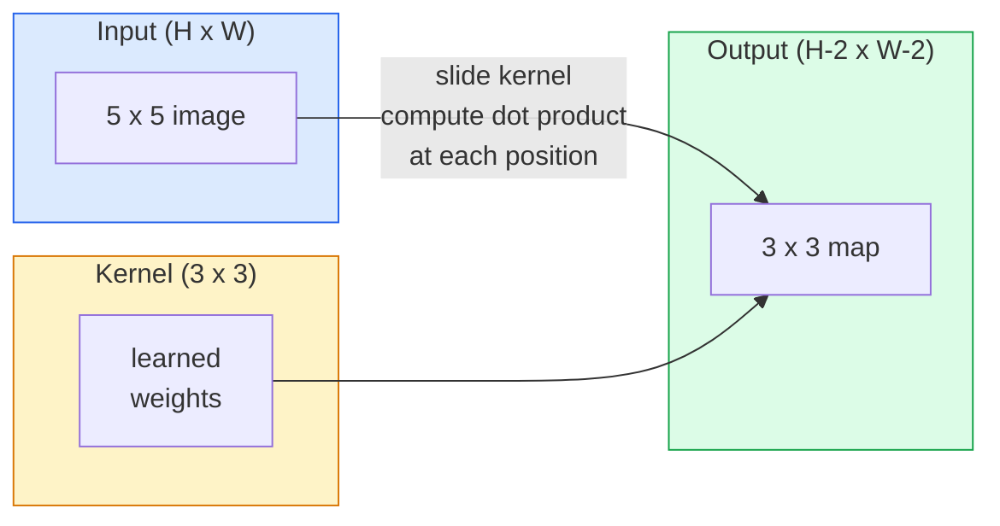
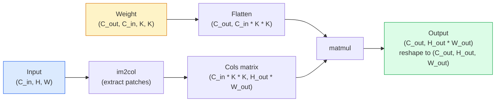

# 从零实现卷积

> 卷积就是一个微型全连接层：让它在图像上滑动，并在每个位置共享同一组权重。

**Type:** 构建
**Languages:** Python
**Prerequisites:** 第 3 阶段（深度学习核心）、第 4 阶段第 01 课（图像基础）
**Time:** 约 75 分钟

## 学习目标

- 只使用 NumPy 从零实现二维卷积，包括嵌套循环版本和向量化的 `im2col` 版本
- 针对输入大小、卷积核大小、Padding 和 Stride 的任意组合计算输出空间尺寸，并说明 `(H - K + 2P) / S + 1` 公式为何成立
- 手工设计边缘检测、模糊、锐化和 Sobel 卷积核，并解释每种卷积核为何会产生相应的激活模式
- 把多个卷积堆叠成特征提取器，并建立堆叠深度与感受野大小之间的联系

## 问题所在

如果对一张 224x224 的 RGB 图像使用全连接层，每个神经元都需要 224 * 224 * 3 = 150,528 个输入权重。仅一个包含 1,000 个单元的隐藏层，就已经需要 1.5 亿个参数——而此时还没有学到任何有用内容。更糟的是，这一层不知道左上角的狗与右下角的狗属于同一种模式。它把每个像素位置都视为彼此独立，而这恰好违背了图像的本质：把一只猫平移三个像素，不应该迫使网络重新学习“猫”这个概念。

图像模型需要两个性质：**平移等变性**，也就是输入平移时输出随之平移；以及**参数共享**，也就是同一个特征检测器在所有位置运行。全连接层两者都不具备，卷积则天然同时具备。

卷积并不是为深度学习发明的。JPEG 压缩、Photoshop 中的高斯模糊、工业视觉中的边缘检测，以及每一种已经发布的音频滤波器，使用的都是同一种运算。CNN 在 2012 到 2020 年间主导 ImageNet，原因在于：对于相邻值彼此相关、同一种模式又可能出现在任意位置的数据，卷积提供了正确的先验。

## 核心概念

### 一个卷积核，不断滑动

二维卷积使用一个称为卷积核（或滤波器）的小型权重矩阵，让它在输入上滑动，并在每个位置计算逐元素乘积之和。这个总和就成为一个输出像素。



下面是在 5x5 输入上应用 3x3 卷积核的具体示例，不使用 Padding，Stride 为 1：

```
Input X (5 x 5):                Kernel W (3 x 3):

  1  2  0  1  2                   1  0 -1
  0  1  3  1  0                   2  0 -2
  2  1  0  2  1                   1  0 -1
  1  0  2  1  3
  2  1  1  0  1

The kernel slides across every valid 3 x 3 window. Output Y is 3 x 3:

 Y[0,0] = sum( W * X[0:3, 0:3] )
 Y[0,1] = sum( W * X[0:3, 1:4] )
 Y[0,2] = sum( W * X[0:3, 2:5] )
 Y[1,0] = sum( W * X[1:4, 0:3] )
 ... and so on
```

这一条公式——**共享权重、局部连接、滑动窗口**——就是卷积的全部核心思想，其余只是簿记工作。

### 输出尺寸公式

已知输入空间尺寸 `H`、卷积核大小 `K`、Padding `P` 和 Stride `S`：

```
H_out = floor( (H - K + 2P) / S ) + 1
```

请记住这个公式。设计架构时，你会反复计算它。

| 场景 | H | K | P | S | H_out |
|----------|---|---|---|---|-------|
| Valid 卷积，不填充 | 32 | 3 | 0 | 1 | 30 |
| Same 卷积（保持尺寸） | 32 | 3 | 1 | 1 | 32 |
| 下采样 2 倍 | 32 | 3 | 1 | 2 | 16 |
| 2x2 池化 | 32 | 2 | 0 | 2 | 16 |
| 大感受野 | 32 | 7 | 3 | 2 | 16 |

“Same padding”是指当 S == 1 时，选择 P 使 H_out == H。对于奇数 K，P = (K - 1) / 2。这就是 3x3 卷积核占据主流的原因：它是仍然拥有中心点的最小奇数尺寸卷积核。

### 填充

如果不使用 Padding，每次卷积都会缩小特征图。连续堆叠 20 层后，224x224 图像会变成 184x184，不仅浪费边缘处的信息，也会让要求形状一致的残差连接变得复杂。

```
Zero padding (P = 1) on a 5 x 5 input:

  0  0  0  0  0  0  0
  0  1  2  0  1  2  0
  0  0  1  3  1  0  0
  0  2  1  0  2  1  0       Now the kernel can centre on pixel
  0  1  0  2  1  3  0       (0, 0) and still have three rows and
  0  2  1  1  0  1  0       three columns of values to multiply.
  0  0  0  0  0  0  0
```

实践中常见的模式包括：`zero`，最常用；`reflect`，镜像边缘，可避免生成模型中的硬边界；`replicate`，复制边缘值；`circular`，从另一侧循环取值，适用于环面问题。

### 步幅

Stride 是卷积核每次滑动的步长。`stride=1` 是默认值，`stride=2` 会把空间尺寸减半，也是 CNN 中无需额外池化层便可下采样的经典方式。每种现代架构，包括 ResNet、ConvNeXt 和 MobileNet，都会在某些位置使用带步幅卷积代替最大池化。

```
Stride 1 on a 5 x 5 input, 3 x 3 kernel:

  starts: (0,0) (0,1) (0,2)        -> output row 0
          (1,0) (1,1) (1,2)        -> output row 1
          (2,0) (2,1) (2,2)        -> output row 2

  Output: 3 x 3

Stride 2 on the same input:

  starts: (0,0) (0,2)              -> output row 0
          (2,0) (2,2)              -> output row 1

  Output: 2 x 2
```

### 多输入通道

真实图像有三个通道。在 RGB 输入上应用 3x3 卷积，实际使用的是 3x3x3 体积：每个输入通道对应一个 3x3 切片。在每个空间位置，需要跨三个切片相乘并求和，再加上偏置。

```
Input:   (C_in,  H,  W)        3 x 5 x 5
Kernel:  (C_in,  K,  K)        3 x 3 x 3 (one kernel)
Output:  (1,     H', W')       2D map

For a layer that produces C_out output channels, you stack C_out kernels:

Weight:  (C_out, C_in, K, K)   e.g. 64 x 3 x 3 x 3
Output:  (C_out, H', W')       64 x 3 x 3

Parameter count: C_out * C_in * K * K + C_out   (the + C_out is biases)
```

设计模型时，你会不断计算最后这一行。对 3 通道输入应用一个具有 64 个输出通道的 3x3 卷积，一共有 `64 * 3 * 3 * 3 + 64 = 1,792` 个参数，成本很低。

### im2col 技巧

嵌套循环容易理解，却很慢；GPU 更擅长大型矩阵乘法。诀窍是把输入中的每个感受野窗口展平为大矩阵的一列，再把卷积核展平为一行，于是整个卷积就变成一次矩阵乘法。



每个生产级卷积实现，都是这种思路再加上缓存分块等技巧的某种变体，例如直接卷积、Winograd，以及用于大卷积核的 FFT 卷积。理解 im2col，也就理解了核心原理。

### 感受野

单个 3x3 卷积会观察 9 个输入像素。堆叠两个 3x3 卷积，第二层中的一个神经元就会观察 5x5 的输入区域；三个 3x3 卷积则得到 7x7。一般而言：

```
RF after L stacked K x K convs (stride 1) = 1 + L * (K - 1)

With strides:   RF grows multiplicatively with stride along each layer.
```

“一路使用 3x3”之所以有效，例如 VGG、ResNet 和 ConvNeXt，正是因为两个 3x3 卷积能看到与一个 5x5 卷积相同的输入区域，却使用更少参数，而且中间还多了一次非线性变换。

```figure
convolution-kernel
```

## 动手构建

### 第 1 步：填充数组

从最小的基础操作开始：编写一个函数，在 H x W 数组周围填充零。

```python
import numpy as np

def pad2d(x, p):
    if p == 0:
        return x
    h, w = x.shape[-2:]
    out = np.zeros(x.shape[:-2] + (h + 2 * p, w + 2 * p), dtype=x.dtype)
    out[..., p:p + h, p:p + w] = x
    return out

x = np.arange(9).reshape(3, 3)
print(x)
print()
print(pad2d(x, 1))
```

末尾轴技巧 `x.shape[:-2]` 使同一个函数无需修改，就能处理 `(H, W)`、`(C, H, W)` 或 `(N, C, H, W)`。

### 第 2 步：使用嵌套循环实现二维卷积

这是参考实现——速度很慢，但含义没有歧义。`torch.nn.functional.conv2d` 在原理上做的就是这些操作。

```python
def conv2d_naive(x, w, b=None, stride=1, padding=0):
    c_in, h, w_in = x.shape
    c_out, c_in_w, kh, kw = w.shape
    assert c_in == c_in_w

    x_pad = pad2d(x, padding)
    h_out = (h + 2 * padding - kh) // stride + 1
    w_out = (w_in + 2 * padding - kw) // stride + 1

    out = np.zeros((c_out, h_out, w_out), dtype=np.float32)
    for oc in range(c_out):
        for i in range(h_out):
            for j in range(w_out):
                hs = i * stride
                ws = j * stride
                patch = x_pad[:, hs:hs + kh, ws:ws + kw]
                out[oc, i, j] = np.sum(patch * w[oc])
        if b is not None:
            out[oc] += b[oc]
    return out
```

这里共有四重循环：输出通道、行、列，以及隐含的 C_in、kh、kw 求和。这是之后检验所有快速实现时采用的基准真值。

### 第 3 步：使用手工卷积核验证

构造一个竖直 Sobel 卷积核，把它应用到合成的阶跃图像上，观察竖直边缘如何亮起。

```python
def synthetic_step_image():
    img = np.zeros((1, 16, 16), dtype=np.float32)
    img[:, :, 8:] = 1.0
    return img

sobel_x = np.array([
    [[-1, 0, 1],
     [-2, 0, 2],
     [-1, 0, 1]]
], dtype=np.float32)[None]

x = synthetic_step_image()
y = conv2d_naive(x, sobel_x, padding=1)
print(y[0].round(1))
```

预期第 7 列会出现较大的正值，对应亮度从左向右增加；其他位置都为零。仅凭这一次打印，就能快速检查数学实现是否正确。

### 第 4 步：im2col

把输入中每个与卷积核等大的窗口转换为矩阵中的一列。当 `C_in=3, K=3` 时，每一列包含 27 个数。

```python
def im2col(x, kh, kw, stride=1, padding=0):
    c_in, h, w = x.shape
    x_pad = pad2d(x, padding)
    h_out = (h + 2 * padding - kh) // stride + 1
    w_out = (w + 2 * padding - kw) // stride + 1

    cols = np.zeros((c_in * kh * kw, h_out * w_out), dtype=x.dtype)
    col = 0
    for i in range(h_out):
        for j in range(w_out):
            hs = i * stride
            ws = j * stride
            patch = x_pad[:, hs:hs + kh, ws:ws + kw]
            cols[:, col] = patch.reshape(-1)
            col += 1
    return cols, h_out, w_out
```

这里仍然存在 Python 循环，但最繁重的工作接下来会由一次向量化矩阵乘法完成。

### 第 5 步：使用 im2col + 矩阵乘法加速卷积

用一次矩阵乘法替代四重循环。

```python
def conv2d_im2col(x, w, b=None, stride=1, padding=0):
    c_out, c_in, kh, kw = w.shape
    cols, h_out, w_out = im2col(x, kh, kw, stride, padding)
    w_flat = w.reshape(c_out, -1)
    out = w_flat @ cols
    if b is not None:
        out += b[:, None]
    return out.reshape(c_out, h_out, w_out)
```

正确性检查：运行两种实现并比较结果。

```python
rng = np.random.default_rng(0)
x = rng.normal(0, 1, (3, 16, 16)).astype(np.float32)
w = rng.normal(0, 1, (8, 3, 3, 3)).astype(np.float32)
b = rng.normal(0, 1, (8,)).astype(np.float32)

y_naive = conv2d_naive(x, w, b, padding=1)
y_im2col = conv2d_im2col(x, w, b, padding=1)

print(f"max abs diff: {np.max(np.abs(y_naive - y_im2col)):.2e}")
```

`max abs diff` 应该约为 `1e-5`。差异来自浮点数累加顺序，而不是程序错误。

### 第 6 步：一组手工设计的卷积核

下面五种滤波器展示了单层卷积在未经任何训练时就能表达哪些操作。

```python
KERNELS = {
    "identity": np.array([[0, 0, 0], [0, 1, 0], [0, 0, 0]], dtype=np.float32),
    "blur_3x3": np.ones((3, 3), dtype=np.float32) / 9.0,
    "sharpen": np.array([[0, -1, 0], [-1, 5, -1], [0, -1, 0]], dtype=np.float32),
    "sobel_x": np.array([[-1, 0, 1], [-2, 0, 2], [-1, 0, 1]], dtype=np.float32),
    "sobel_y": np.array([[-1, -2, -1], [0, 0, 0], [1, 2, 1]], dtype=np.float32),
}

def apply_kernel(img2d, kernel):
    x = img2d[None].astype(np.float32)
    w = kernel[None, None]
    return conv2d_im2col(x, w, padding=1)[0]
```

把这些卷积核应用到任意灰度图像上，blur 会柔化画面，sharpen 会让边缘更清晰，Sobel-x 会突出竖直边缘，Sobel-y 会突出水平边缘。AlexNet 和 VGG 中训练得到的*第一层*卷积，最终学习到的正是这类模式——因为无论后续任务是什么，良好的图像模型都需要边缘和斑块检测器。

## 实际应用

PyTorch 的 `nn.Conv2d` 使用自动微分、CUDA 内核和 cuDNN 优化封装了同一项操作，形状语义完全相同。

```python
import torch
import torch.nn as nn

conv = nn.Conv2d(in_channels=3, out_channels=64, kernel_size=3, stride=1, padding=1)
print(conv)
print(f"weight shape: {tuple(conv.weight.shape)}   # (C_out, C_in, K, K)")
print(f"bias shape:   {tuple(conv.bias.shape)}")
print(f"param count:  {sum(p.numel() for p in conv.parameters())}")

x = torch.randn(8, 3, 224, 224)
y = conv(x)
print(f"\ninput  shape: {tuple(x.shape)}")
print(f"output shape: {tuple(y.shape)}")
```

把 `padding=1` 改为 `padding=0`，输出会缩小到 222x222；把 `stride=1` 改为 `stride=2`，输出会缩小到 112x112。使用的正是前面记住的同一个公式。

## 交付成果

本课会产出：

- `outputs/prompt-cnn-architect.md`——给定输入大小、参数预算和目标感受野后，设计一组在每一步都采用正确 K/S/P 的 `Conv2d` 层。
- `outputs/skill-conv-shape-calculator.md`——逐层分析网络规格，返回每个模块的输出形状、感受野和参数数量。

## 练习

1. **（简单）** 给定 128x128 灰度输入和一组 `[Conv3x3(s=1,p=1), Conv3x3(s=2,p=1), Conv3x3(s=1,p=1), Conv3x3(s=2,p=1)]`，手工计算每层的输出空间尺寸和感受野，再用由虚拟卷积组成的 PyTorch `nn.Sequential` 验证。
2. **（中等）** 扩展 `conv2d_naive` 和 `conv2d_im2col`，使其接收 `groups` 参数。证明 `groups=C_in=C_out` 会得到深度卷积，而且参数数量是 `C * K * K`，而不是 `C * C * K * K`。
3. **（困难）** 手工实现 `conv2d_im2col` 的反向传播：给定输出梯度，计算 `x` 和 `w` 的梯度，再在相同输入与权重上同 `torch.autograd.grad` 验证。诀窍是：im2col 的梯度为 `col2im`，而且必须累加重叠窗口。

## 关键术语

| 术语 | 人们常说 | 实际含义 |
|------|----------------|----------------------|
| 卷积 | “滑动滤波器” | 在每个空间位置使用共享权重执行的可学习点积；数学上其实是互相关，但所有人都称它为卷积 |
| 卷积核/滤波器 | “特征检测器” | 形状为 (C_in, K, K) 的小型权重张量，与输入窗口点积后生成一个输出像素 |
| Stride | “每次跳多远” | 相邻卷积核位置之间的步长；步幅为 2 会把每个空间维度减半 |
| Padding | “边缘补零” | 在输入周围添加额外数值，使卷积核能够以边缘像素为中心；`same` Padding 会保持输出与输入尺寸相同 |
| 感受野 | “神经元能看到多少” | 某个输出激活所依赖的原始输入区域，会随深度与 Stride 增大 |
| im2col | “GEMM 技巧” | 把每个感受野窗口重排成矩阵的列，使卷积变成一次大型矩阵乘法；这是所有快速卷积内核的核心 |
| 深度卷积 | “每个通道一个卷积核” | `groups == C_in` 的卷积，每个输出通道只由对应输入通道计算，是 MobileNet 与 ConvNeXt 的骨干组件 |
| 平移等变性 | “输入平移，输出也平移” | 输入平移 k 个像素时，输出也平移 k 个像素的性质，由共享权重自然获得 |

## 延伸阅读

- [《A guide to convolution arithmetic for deep learning》（Dumoulin 与 Visin，2016）](https://arxiv.org/abs/1603.07285)——关于 Padding、Stride 和 Dilation 的权威图解，几乎所有课程都借鉴了它
- [CS231n：Convolutional Neural Networks for Visual Recognition](https://cs231n.github.io/convolutional-networks/)——经典课程讲义，包括最早的 im2col 讲解
- [The Annotated ConvNet（fast.ai）](https://nbviewer.org/github/fastai/fastbook/blob/master/13_convolutions.ipynb)——从手工卷积一直讲到训练数字分类器的 Notebook
- [Receptive Field Arithmetic for CNNs（Dang Ha The Hien）](https://distill.pub/2019/computing-receptive-fields/)——以论文质量制作的感受野计算交互式讲解
