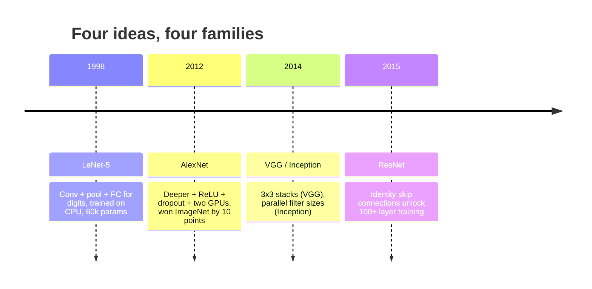
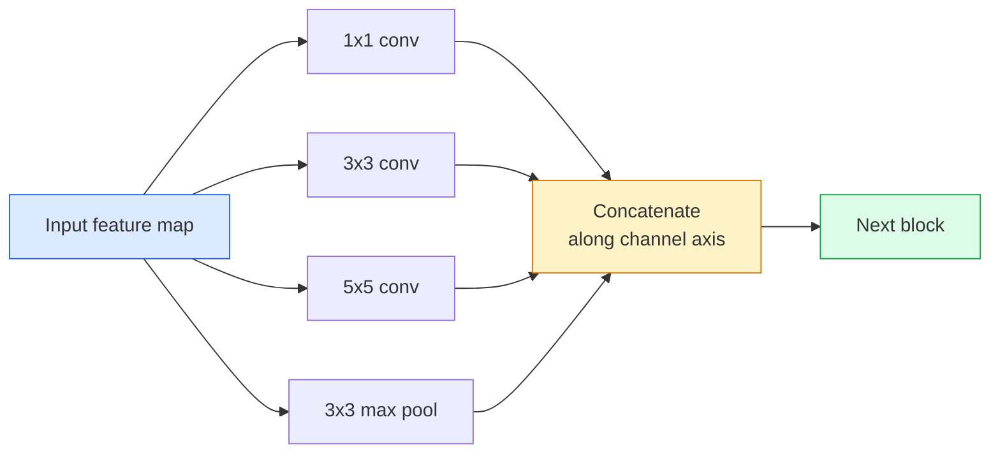
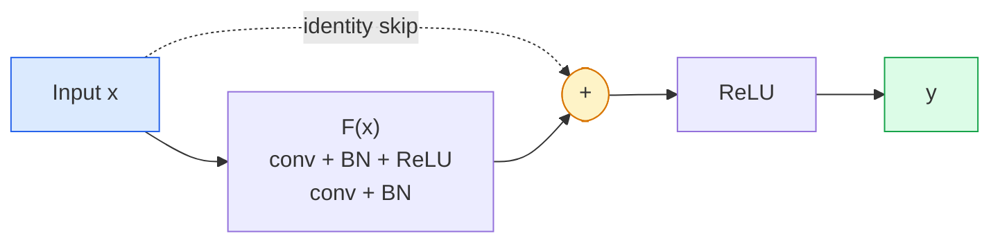

# CNN——从 LeNet 到 ResNet

> 过去三十年的每一种重要 CNN，本质上都沿用“卷积—非线性—下采样”这一套方法，只是每一代又加上了一个新想法。请按时间顺序理解这些想法。

**Type:** 学习 + 构建
**Languages:** Python
**Prerequisites:** 第 3 阶段第 11 课（PyTorch）、第 4 阶段第 01 课（图像基础）、第 4 阶段第 02 课（从零实现卷积）
**Time:** 约 75 分钟

## 学习目标

- 追踪 LeNet-5 -> AlexNet -> VGG -> Inception -> ResNet 的架构谱系，并说出每个家族贡献的唯一新思想
- 使用 PyTorch 实现 LeNet-5、VGG 风格模块和 ResNet BasicBlock，每个实现不超过 40 行
- 解释残差连接为何能让无法训练的 1,000 层网络达到业界顶尖水平
- 阅读现代骨干网络（ResNet-18、ResNet-50），并在查看源码前预测输出形状、感受野和参数数量

## 问题所在

2011 年，最优秀的 ImageNet 分类器 top-5 准确率约为 74%；2012 年，AlexNet 达到 85%；2015 年，ResNet 达到 96%。数据没有更新，GPU 也没有换代，进步来自架构思想。一名合格的视觉工程师必须知道每个想法来自哪篇论文，因为你在 2026 年交付的每一个生产级骨干网络，依然只是这些组件的重新组合；而且这些思想不断迁移到其他领域：分组卷积从 CNN 进入 Transformer，残差连接从 ResNet 进入现存的每一个 LLM，批归一化也存在于扩散模型中。

按顺序学习这些网络，还能避免一个常见错误：明明 LeNet 规模的网络就能解决问题，却直接选择可用的最大模型。MNIST 不需要 ResNet。理解每个家族的扩展曲线，可以帮助你选择恰当的位置。

## 核心概念

### 改变计算机视觉的四个思想



经典计算机视觉中，没有其他进展能与这四次跃迁相提并论。

### LeNet-5（1998）

这是 Yann LeCun 设计的数字识别器，拥有 60,000 个参数，由两个卷积—池化模块、两个全连接层和 Tanh 激活组成。它定义了后来每个 CNN 都继承的模板：

```
input (1, 32, 32)
  conv 5x5 -> (6, 28, 28)
  avg pool 2x2 -> (6, 14, 14)
  conv 5x5 -> (16, 10, 10)
  avg pool 2x2 -> (16, 5, 5)
  flatten -> 400
  dense -> 120
  dense -> 84
  dense -> 10
```

现代世界所谓的 CNN，也就是交替使用卷积与下采样，再接一个小型分类头，本质上都是增加了层数、通道数并改进了激活函数的 LeNet。

### AlexNet（2012）

以下三项变化共同攻克了 ImageNet：

1. 使用 **ReLU** 取代 Tanh。梯度不再消失，训练速度提高六倍。
2. 在全连接分类头中使用 **Dropout**。正则化由一个技巧变成了一个层。
3. 增加**深度与宽度**。五个卷积层、三个全连接层、6000 万参数，并把模型拆分到两张 GPU 上训练。

论文的图 2 至今仍以两条并行路径展示 GPU 划分。那种并行方式只是硬件限制下的权宜之计，而不是架构洞见；但上面的三个想法至今仍存在于你使用的每个模型中。

### VGG（2014）

VGG 提出一个问题：如果只使用 3x3 卷积，并不断加深，会发生什么？

```
stack:   conv 3x3 -> conv 3x3 -> pool 2x2
repeat:  16 or 19 conv layers
```

两个 3x3 卷积能看到与一个 5x5 卷积相同的输入区域，参数却更少：2*9*C^2 = 18C^2，而不是 25*C^2，并且中间还多了一次 ReLU。VGG 把这一观察发展成完整架构。它只用一种模块不断重复，形式非常简洁，也成为后续所有架构的参照点。

代价是 1.38 亿个参数、训练缓慢、推理成本高昂。

### Inception（2014，同一年）

Google 对“应该使用多大的卷积核？”给出的答案是：全部使用，并行执行。



每条分支各有专长：1x1 用于通道混合，3x3 用于局部纹理，5x5 用于更大范围的模式，池化用于提取平移不变特征；拼接后，下一层可以自行选择有用的分支。Inception v1 在每条分支内部使用 1x1 卷积作为瓶颈，使参数数量保持合理。

### 退化问题

到 2015 年，VGG-19 可以正常工作，VGG-32 却不行。按理说，增加深度应该有所帮助，但超过约 20 层后，训练损失和测试损失都会变差。这不是过拟合，而是优化器无法找到有用权重，因为梯度穿过每一层时都会相乘并不断缩小。

```
Plain deep network:
  y = f_L( f_{L-1}( ... f_1(x) ... ) )

Gradient wrt early layer:
  dL/dW_1 = dL/dy * df_L/df_{L-1} * ... * df_2/df_1 * df_1/dW_1

Each multiplicative term has magnitude roughly (weight magnitude) * (activation gain).
Stack 100 of them with gains < 1 and the gradient is effectively zero.
```

VGG 能训练到 19 层，是因为同期发表的批归一化让激活值保持在合适尺度。但即使采用批归一化，也无法挽救深度超过约 30 层的普通网络。

### ResNet（2015）

He、Zhang、Ren 与 Sun 提出了一项改变，从根本上解决了问题：

```
standard block:   y = F(x)
residual block:   y = F(x) + x
```

`+ x` 意味着，这一层随时可以通过让 `F(x)` 归零来选择什么都不做。因此，一千层 ResNet 最坏也不会比一层网络更差，因为每个额外模块都有一条平凡的逃生通道。有了这一保证，优化器可以放心让每个模块变得*稍微*有用；而稍微有用的模块堆叠 100 次，就能达到业界顶尖水平。



两种模块变体随处可见：

- **BasicBlock**（ResNet-18、ResNet-34）：两个 3x3 卷积，跳跃连接跨过两者。
- **Bottleneck**（ResNet-50、-101、-152）：先用 1x1 降维，中间使用 3x3，再用 1x1 升维，跳跃连接跨过三个卷积。通道数较高时，这种结构更便宜。

当跳跃连接需要跨越一次下采样，也就是 stride=2 时，恒等路径会换成 stride=2 的 1x1 卷积，以匹配形状。

### 残差为何不只对视觉重要

这个思想真正解决的并不只是图像分类，而是把深层网络从“只能祈祷梯度幸存”变成可靠、可扩展的工程工具。下一阶段会介绍的每个 Transformer，也在每个模块中使用完全相同的跳跃连接。没有 ResNet，就没有 GPT。

```figure
pooling
```

## 动手构建

### 第 1 步：LeNet-5

下面是一个精简且忠于原设计的 LeNet：Tanh 激活、平均池化。唯一顺应现代实践的地方，是后续使用 `nn.CrossEntropyLoss`，而不是原始设计中的高斯连接。

```python
import torch
import torch.nn as nn
import torch.nn.functional as F

class LeNet5(nn.Module):
    def __init__(self, num_classes=10):
        super().__init__()
        self.conv1 = nn.Conv2d(1, 6, kernel_size=5)
        self.conv2 = nn.Conv2d(6, 16, kernel_size=5)
        self.pool = nn.AvgPool2d(2)
        self.fc1 = nn.Linear(16 * 5 * 5, 120)
        self.fc2 = nn.Linear(120, 84)
        self.fc3 = nn.Linear(84, num_classes)

    def forward(self, x):
        x = self.pool(torch.tanh(self.conv1(x)))
        x = self.pool(torch.tanh(self.conv2(x)))
        x = torch.flatten(x, 1)
        x = torch.tanh(self.fc1(x))
        x = torch.tanh(self.fc2(x))
        return self.fc3(x)

net = LeNet5()
x = torch.randn(1, 1, 32, 32)
print(f"output: {net(x).shape}")
print(f"params: {sum(p.numel() for p in net.parameters()):,}")
```

预期输出为 `output: torch.Size([1, 10])`、`params: 61,706`。这就是开启现代计算机视觉时代的完整数字分类器。

### 第 2 步：VGG 模块

一个可复用模块：两个 3x3 卷积、ReLU、批归一化和最大池化。

```python
class VGGBlock(nn.Module):
    def __init__(self, in_c, out_c):
        super().__init__()
        self.conv1 = nn.Conv2d(in_c, out_c, kernel_size=3, padding=1)
        self.bn1 = nn.BatchNorm2d(out_c)
        self.conv2 = nn.Conv2d(out_c, out_c, kernel_size=3, padding=1)
        self.bn2 = nn.BatchNorm2d(out_c)
        self.pool = nn.MaxPool2d(2)

    def forward(self, x):
        x = F.relu(self.bn1(self.conv1(x)))
        x = F.relu(self.bn2(self.conv2(x)))
        return self.pool(x)

class MiniVGG(nn.Module):
    def __init__(self, num_classes=10):
        super().__init__()
        self.stack = nn.Sequential(
            VGGBlock(3, 32),
            VGGBlock(32, 64),
            VGGBlock(64, 128),
        )
        self.head = nn.Sequential(
            nn.AdaptiveAvgPool2d(1),
            nn.Flatten(),
            nn.Linear(128, num_classes),
        )

    def forward(self, x):
        return self.head(self.stack(x))

net = MiniVGG()
x = torch.randn(1, 3, 32, 32)
print(f"output: {net(x).shape}")
print(f"params: {sum(p.numel() for p in net.parameters()):,}")
```

在 CIFAR 大小的输入上使用三个 VGG 模块、一个自适应池化和一个线性层，一共约 29 万个参数，足以应对 CIFAR-10。

### 第 3 步：ResNet BasicBlock

这是 ResNet-18 和 ResNet-34 的核心构建模块。

```python
class BasicBlock(nn.Module):
    def __init__(self, in_c, out_c, stride=1):
        super().__init__()
        self.conv1 = nn.Conv2d(in_c, out_c, kernel_size=3, stride=stride, padding=1, bias=False)
        self.bn1 = nn.BatchNorm2d(out_c)
        self.conv2 = nn.Conv2d(out_c, out_c, kernel_size=3, stride=1, padding=1, bias=False)
        self.bn2 = nn.BatchNorm2d(out_c)
        if stride != 1 or in_c != out_c:
            self.shortcut = nn.Sequential(
                nn.Conv2d(in_c, out_c, kernel_size=1, stride=stride, bias=False),
                nn.BatchNorm2d(out_c),
            )
        else:
            self.shortcut = nn.Identity()

    def forward(self, x):
        out = F.relu(self.bn1(self.conv1(x)))
        out = self.bn2(self.conv2(out))
        out = out + self.shortcut(x)
        return F.relu(out)
```

卷积层设置 `bias=False` 是批归一化约定，因为 BN 的 beta 参数已经承担偏置作用，继续保留卷积偏置只是浪费。只有 Stride 或通道数变化时，`shortcut` 才需要真正的卷积；否则它就是一个不执行操作的恒等映射。

### 第 4 步：微型 ResNet

堆叠四组 BasicBlock，得到一套适用于 CIFAR 尺寸输入的 ResNet。

```python
class TinyResNet(nn.Module):
    def __init__(self, num_classes=10):
        super().__init__()
        self.stem = nn.Sequential(
            nn.Conv2d(3, 32, kernel_size=3, stride=1, padding=1, bias=False),
            nn.BatchNorm2d(32),
            nn.ReLU(inplace=True),
        )
        self.layer1 = self._make_group(32, 32, num_blocks=2, stride=1)
        self.layer2 = self._make_group(32, 64, num_blocks=2, stride=2)
        self.layer3 = self._make_group(64, 128, num_blocks=2, stride=2)
        self.layer4 = self._make_group(128, 256, num_blocks=2, stride=2)
        self.head = nn.Sequential(
            nn.AdaptiveAvgPool2d(1),
            nn.Flatten(),
            nn.Linear(256, num_classes),
        )

    def _make_group(self, in_c, out_c, num_blocks, stride):
        blocks = [BasicBlock(in_c, out_c, stride=stride)]
        for _ in range(num_blocks - 1):
            blocks.append(BasicBlock(out_c, out_c, stride=1))
        return nn.Sequential(*blocks)

    def forward(self, x):
        x = self.stem(x)
        x = self.layer1(x)
        x = self.layer2(x)
        x = self.layer3(x)
        x = self.layer4(x)
        return self.head(x)

net = TinyResNet()
x = torch.randn(1, 3, 32, 32)
print(f"output: {net(x).shape}")
print(f"params: {sum(p.numel() for p in net.parameters()):,}")
```

一共有四组模块，每组两个 BasicBlock；第 2、3、4 组开头使用 Stride 2，每次下采样时通道数翻倍。总计约 280 万参数，这就是能够平滑扩展到 ResNet-152 的标准方案。

### 第 5 步：比较参数—特征效率

让相同输入穿过三个网络，并比较参数数量。

```python
def summary(name, net, x):
    y = net(x)
    params = sum(p.numel() for p in net.parameters())
    print(f"{name:12s}  input {tuple(x.shape)} -> output {tuple(y.shape)}  params {params:>10,}")

x = torch.randn(1, 3, 32, 32)
summary("LeNet5",     LeNet5(),       torch.randn(1, 1, 32, 32))
summary("MiniVGG",    MiniVGG(),      x)
summary("TinyResNet", TinyResNet(),   x)
```

三个模型、三个时代，参数量跨越三个数量级。在 CIFAR-10 上训练几个 epoch 后，大致可以期待：LeNet 达到 60%，MiniVGG 达到 89%，TinyResNet 达到 93%。

## 实际应用

`torchvision.models` 提供以上所有网络家族的预训练版本。不同家族使用完全相同的调用形式，这正是骨干网络抽象的意义。

```python
from torchvision.models import resnet18, ResNet18_Weights, vgg16, VGG16_Weights

r18 = resnet18(weights=ResNet18_Weights.IMAGENET1K_V1)
r18.eval()

print(f"ResNet-18 params: {sum(p.numel() for p in r18.parameters()):,}")
print(r18.layer1[0])
print()

v16 = vgg16(weights=VGG16_Weights.IMAGENET1K_V1)
v16.eval()
print(f"VGG-16   params: {sum(p.numel() for p in v16.parameters()):,}")
```

ResNet-18 有 1170 万参数，VGG-16 有 1.38 亿参数，两者的 ImageNet top-1 准确率相近，分别为 69.8% 和 71.6%。残差连接把参数效率提高了 12 倍。这就是 ResNet 变体从 2016 年一直主导到 ViT 于 2021 年出现的原因；即使今天，在计算资源受限的真实部署中，ResNet 仍占主导。

迁移学习的步骤始终相同：加载预训练模型，冻结骨干网络，再替换分类头。

```python
for p in r18.parameters():
    p.requires_grad = False
r18.fc = nn.Linear(r18.fc.in_features, 10)
```

只需三行，现在就拥有一个继承 ImageNet 已付出成本所学表示的 10 类 CIFAR 分类器。

## 交付成果

本课会产出：

- `outputs/prompt-backbone-selector.md`——根据任务、数据集大小和计算预算选择合适 CNN 家族（LeNet/VGG/ResNet/MobileNet/ConvNeXt）的提示词。
- `outputs/skill-residual-block-reviewer.md`——读取 PyTorch 模块并标记跳跃连接错误的技能，包括 Stride 变化时缺少 Shortcut、Shortcut 激活顺序错误，以及 BN 与加法的相对位置错误。

## 练习

1. **（简单）** 逐层手工计算 `TinyResNet` 的参数数量，并与 `sum(p.numel() for p in net.parameters())` 比较。参数预算主要消耗在卷积、BN 还是分类头上？
2. **（中等）** 实现 Bottleneck 模块，也就是 1x1 -> 3x3 -> 1x1 加跳跃连接，再用它构建适用于 CIFAR 的 ResNet-50 风格网络。与 `TinyResNet` 比较参数数量。
3. **（困难）** 移除 `BasicBlock` 中的跳跃连接，分别在 CIFAR-10 上训练一个包含 34 个模块的“普通”网络和一个包含 34 个模块的 ResNet，各训练 10 个 epoch。绘制两者的训练损失—epoch 曲线，复现 He 等人论文图 1 中普通深层网络收敛到比浅层版本更高损失的结果。

## 关键术语

| 术语 | 人们常说 | 实际含义 |
|------|----------------|----------------------|
| 骨干网络 | “模型” | 生成特征图并交给任务头的卷积模块堆栈 |
| 残差连接 | “跳跃连接” | `y = F(x) + x`；允许优化器把 F 设为零来学习恒等映射，从而使任意深度都可训练 |
| BasicBlock | “两个 3x3 卷积加一个跳跃连接” | ResNet-18/34 的构建模块：conv-BN-ReLU-conv-BN-add-ReLU |
| Bottleneck | “1x1 降维、3x3、1x1 升维” | ResNet-50/101/152 使用的模块；3x3 在较窄通道宽度上运行，因此通道数很高时仍然便宜 |
| 退化问题 | “越深反而越差” | 普通卷积网络超过约 20 层后，训练误差与测试误差都会增加；解决方法是残差连接，而不是更多数据 |
| Stem | “第一层” | 把三通道输入转换成基础特征宽度的初始卷积；ImageNet 通常使用 7x7、Stride 2，CIFAR 使用 3x3、Stride 1 |
| Head | “分类器” | 最终骨干模块之后的层：自适应池化、展平、线性层 |
| 迁移学习 | “预训练权重” | 加载在 ImageNet 上训练的骨干网络，只在自己的任务上微调分类头 |

## 延伸阅读

- [《Deep Residual Learning for Image Recognition》（He 等，2015）](https://arxiv.org/abs/1512.03385)——ResNet 论文，每一幅图都值得认真研究
- [《Very Deep Convolutional Networks》（Simonyan 与 Zisserman，2014）](https://arxiv.org/abs/1409.1556)——VGG 论文，至今仍是理解“为什么使用 3x3”的最佳参考
- [《ImageNet Classification with Deep CNNs》（Krizhevsky 等，2012）](https://papers.nips.cc/paper_files/paper/2012/hash/c399862d3b9d6b76c8436e924a68c45b-Abstract.html)——AlexNet 论文，终结手工特征时代的工作
- [《Going Deeper with Convolutions》（Szegedy 等，2014）](https://arxiv.org/abs/1409.4842)——Inception v1 论文，其并行滤波思想至今仍出现在视觉 Transformer 中
