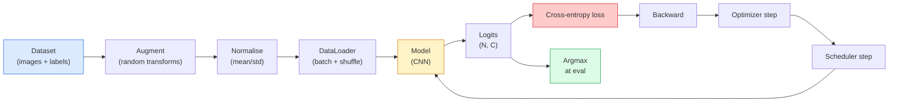

# 图像分类

> 分类器就是一个从像素映射到类别概率分布的函数，其他一切都是配套管线。

**Type:** 构建
**Languages:** Python
**Prerequisites:** 第 2 阶段第 09 课（模型评估）、第 3 阶段第 10 课（迷你框架）、第 4 阶段第 03 课（CNN）
**Time:** 约 75 分钟

## 学习目标

- 在 CIFAR-10 上构建端到端图像分类流水线：数据集、数据增强、模型、训练循环与评估
- 解释每个组件（DataLoader、损失、优化器、调度器、数据增强）的作用，并预测任一组件出错时会如何反映在损失曲线上
- 从零实现 Mixup、Cutout 和标签平滑，并说明何时值得加入每种技术
- 阅读混淆矩阵和逐类别精确率/召回率表，在总体准确率之外诊断数据集与模型故障

## 问题所在

每种真正交付的视觉任务，都能在某个层面归结为图像分类。目标检测是在分类区域，分割是在分类像素，检索则根据样本与类别中心的相似度进行排序。正确掌握分类任务——数据集循环、数据增强策略、损失和评估——这项能力可以迁移到本阶段的每一种其他任务。

大多数分类缺陷并不在模型中，而是藏在流水线里：错误的归一化、没有打乱的训练集、破坏标签语义的数据增强、被训练数据污染的验证集，以及在第 30 个 epoch 后悄悄发散的学习率。正确配置时能在 CIFAR-10 上达到 93% 的 CNN，流水线出错时往往只能得到 70%–75%，而整个过程中损失曲线看起来仍然似乎合理。

本课会手工连接整条流水线，让每个部分都可以检查。我们不会使用 `torchvision.datasets` 中任何可能掩盖错误的功能。

## 核心概念

### 分类流水线



这个循环中的每一行都可能存在缺陷。交叉熵接收原始 logits，而不是 Softmax 输出，因此在计算损失前调用 `model(x).softmax()` 会悄悄算出错误梯度。数据增强只应用于输入，不应用于标签；Mixup 是例外，因为它同时混合输入与标签。每一步必须调用一次 `optimizer.zero_grad()`；跳过它会累积梯度，表现得像极不稳定的学习率。这些缺陷都不会抛出错误，只会让学习曲线变平。

### 交叉熵、Logits 与 Softmax

分类器会为每张图像生成 `C` 个数，称为 logits。应用 Softmax 后，它们会变成概率分布：

```
softmax(z)_i = exp(z_i) / sum_j exp(z_j)
```

交叉熵衡量正确类别的负对数概率：

```
CE(z, y) = -log( softmax(z)_y )
        = -z_y + log( sum_j exp(z_j) )
```

右侧形式具有数值稳定性，也就是 log-sum-exp。PyTorch 的 `nn.CrossEntropyLoss` 会把 Softmax + NLL 融合成一个操作，直接接收原始 logits。自己先应用 Softmax 几乎总是错误，因为那会计算 log(softmax(softmax(z)))，一个没有意义的量。

### 数据增强为何有效

CNN 通过权重共享获得了平移方面的归纳偏置，却没有内置针对裁剪、翻转、颜色抖动或遮挡的不变性。教会它这些不变性的唯一方法，就是向它展示体现这些变化的像素。训练中的每个随机变换都在告诉模型：“这两张图像的标签相同，请学习忽略其中差异的特征。”

```
Original crop:  "dog facing left"
Flip:           "dog facing right"       <- same label, different pixels
Rotate(+15):    "dog, slight tilt"
Colour jitter:  "dog in warmer light"
RandomErasing:  "dog with patch missing"
```

规则是：数据增强必须保持标签不变。对数字应用 Cutout 或旋转，可能把“6”变成“9”；对于这类数据集，应该缩小旋转范围，并选择符合数字特定不变性的增强方式。

### Mixup 与 Cutmix

普通数据增强只改变像素，标签仍然是独热形式；**Mixup** 和 **Cutmix** 则同时对两者插值。

```
Mixup:
  lambda ~ Beta(a, a)
  x = lambda * x_i + (1 - lambda) * x_j
  y = lambda * y_i + (1 - lambda) * y_j

Cutmix:
  paste a random rectangle of x_j into x_i
  y = area-weighted mix of y_i and y_j
```

它们之所以有效，是因为模型不再记忆尖锐的独热目标，而会学习类别之间的平滑插值。训练损失会上升，测试准确率也会上升。对于任何分类器，这是成本最低的单项稳健性升级。

### 标签平滑

它与 Mixup 类似。训练时不再使用 `[0, 0, 1, 0, 0]`，而是使用 `[eps/C, eps/C, 1-eps, eps/C, eps/C]`，其中 `eps` 是 0.1 之类的小值。这样能阻止模型生成任意尖锐的 logits，并且几乎不增加成本就能改善校准。PyTorch 从 1.10 开始就在 `nn.CrossEntropyLoss(label_smoothing=0.1)` 中内置支持。

### 超越准确率的评估

总体准确率会掩盖类别不平衡。一个 90:10 的二分类器始终预测多数类，也能获得 90% 准确率。以下工具才能真正告诉你发生了什么：

- **逐类别准确率**——每个类别一个数值，可以立即暴露表现较差的类别。
- **混淆矩阵**——一个 C x C 网格，第 i 行第 j 列表示真实类别 i 被预测成类别 j 的次数；对角线是正确结果，非对角线才是模型问题所在。
- **Top-1 / Top-5**——正确类别是否位于概率最高的 1 个或 5 个预测中。Top-5 对 ImageNet 很重要，因为“诺里奇㹴”和“诺福克㹴”这类类别本来就很难区分。
- **校准（ECE）**——置信度为 0.8 的预测是否确实有 80% 正确？现代网络通常系统性地过度自信，可以使用温度缩放或标签平滑修复。

```figure
receptive-field
```

## 动手构建

### 第 1 步：确定性的合成数据集

CIFAR-10 存储在磁盘上。为了让本课可复现且运行迅速，我们构建一个外观类似 CIFAR 的合成数据集：32x32 RGB 图像，每个类别都带有模型必须学习的特定结构。同一套流水线无需修改，就能用于真实 CIFAR-10。

```python
import numpy as np
import torch
from torch.utils.data import Dataset


def synthetic_cifar(num_per_class=1000, num_classes=10, seed=0):
    rng = np.random.default_rng(seed)
    X = []
    Y = []
    for c in range(num_classes):
        centre = rng.uniform(0, 1, (3,))
        freq = 2 + c
        for _ in range(num_per_class):
            yy, xx = np.meshgrid(np.linspace(0, 1, 32), np.linspace(0, 1, 32), indexing="ij")
            r = np.sin(xx * freq) * 0.5 + centre[0]
            g = np.cos(yy * freq) * 0.5 + centre[1]
            b = (xx + yy) * 0.5 * centre[2]
            img = np.stack([r, g, b], axis=-1)
            img += rng.normal(0, 0.08, img.shape)
            img = np.clip(img, 0, 1)
            X.append(img.astype(np.float32))
            Y.append(c)
    X = np.stack(X)
    Y = np.array(Y)
    idx = rng.permutation(len(X))
    return X[idx], Y[idx]


class ArrayDataset(Dataset):
    def __init__(self, X, Y, transform=None):
        self.X = X
        self.Y = Y
        self.transform = transform

    def __len__(self):
        return len(self.X)

    def __getitem__(self, i):
        img = self.X[i]
        if self.transform is not None:
            img = self.transform(img)
        img = torch.from_numpy(img).permute(2, 0, 1)
        return img, int(self.Y[i])
```

每个类别都有自己的色彩组合和频率模式，并加入高斯噪声，迫使模型学习信号，而不是记忆像素。一共十个类别，每类一千张图像，最后随机打乱。

### 第 2 步：归一化与数据增强

这是每条视觉流水线都需要的两类变换。

```python
def standardize(mean, std):
    mean = np.array(mean, dtype=np.float32)
    std = np.array(std, dtype=np.float32)
    def _fn(img):
        return (img - mean) / std
    return _fn


def random_hflip(p=0.5):
    def _fn(img):
        if np.random.random() < p:
            return img[:, ::-1, :].copy()
        return img
    return _fn


def random_crop(pad=4):
    def _fn(img):
        h, w = img.shape[:2]
        padded = np.pad(img, ((pad, pad), (pad, pad), (0, 0)), mode="reflect")
        y = np.random.randint(0, 2 * pad)
        x = np.random.randint(0, 2 * pad)
        return padded[y:y + h, x:x + w, :]
    return _fn


def compose(*fns):
    def _fn(img):
        for fn in fns:
            img = fn(img)
        return img
    return _fn
```

裁剪前应使用反射填充，而不是零填充，因为黑色边框会形成一种信号，使模型学到一种并无实际价值的不变性。

### 第 3 步：Mixup

Mixup 在训练步骤内部混合两张图像和两个标签。它以批次变换实现，因此与前向传播相邻，而不是放在数据集内部。

```python
def mixup_batch(x, y, num_classes, alpha=0.2):
    if alpha <= 0:
        return x, torch.nn.functional.one_hot(y, num_classes).float()
    lam = float(np.random.beta(alpha, alpha))
    idx = torch.randperm(x.size(0), device=x.device)
    x_mixed = lam * x + (1 - lam) * x[idx]
    y_onehot = torch.nn.functional.one_hot(y, num_classes).float()
    y_mixed = lam * y_onehot + (1 - lam) * y_onehot[idx]
    return x_mixed, y_mixed


def soft_cross_entropy(logits, soft_targets):
    log_probs = torch.log_softmax(logits, dim=-1)
    return -(soft_targets * log_probs).sum(dim=-1).mean()
```

`soft_cross_entropy` 是针对软标签分布计算的交叉熵。当目标恰好为独热向量时，它就退化为普通交叉熵。

### 第 4 步：训练循环

完整方案是：遍历一次数据，每个批次计算一次梯度，每个 epoch 调度一次学习率。

```python
import torch
import torch.nn as nn
from torch.utils.data import DataLoader
from torch.optim import SGD
from torch.optim.lr_scheduler import CosineAnnealingLR

def train_one_epoch(model, loader, optimizer, device, num_classes, use_mixup=True):
    model.train()
    total, correct, loss_sum = 0, 0, 0.0
    for x, y in loader:
        x, y = x.to(device), y.to(device)
        if use_mixup:
            x_m, y_soft = mixup_batch(x, y, num_classes)
            logits = model(x_m)
            loss = soft_cross_entropy(logits, y_soft)
        else:
            logits = model(x)
            loss = nn.functional.cross_entropy(logits, y, label_smoothing=0.1)
        optimizer.zero_grad()
        loss.backward()
        optimizer.step()
        loss_sum += loss.item() * x.size(0)
        total += x.size(0)
        # Training accuracy vs the un-mixed labels `y` is only an approximation
        # when mixup is on (the model saw soft targets, not y). Treat it as a
        # rough progress signal; rely on val accuracy for real performance.
        with torch.no_grad():
            pred = logits.argmax(dim=-1)
            correct += (pred == y).sum().item()
    return loss_sum / total, correct / total


@torch.no_grad()
def evaluate(model, loader, device, num_classes):
    model.eval()
    total, correct = 0, 0
    loss_sum = 0.0
    cm = torch.zeros(num_classes, num_classes, dtype=torch.long)
    for x, y in loader:
        x, y = x.to(device), y.to(device)
        logits = model(x)
        loss = nn.functional.cross_entropy(logits, y)
        pred = logits.argmax(dim=-1)
        for t, p in zip(y.cpu(), pred.cpu()):
            cm[t, p] += 1
        loss_sum += loss.item() * x.size(0)
        total += x.size(0)
        correct += (pred == y).sum().item()
    return loss_sum / total, correct / total, cm
```

每次编写训练循环时，都要检查以下五条不变量：

1. 训练前调用 `model.train()`，评估前调用 `model.eval()`，以切换 Dropout 和 BatchNorm 的行为。
2. 先调用 `.zero_grad()`，然后再调用 `.backward()`。
3. 累积指标时使用 `.item()`，避免对象继续持有计算图。
4. 评估时使用 `@torch.no_grad()`，以节省内存与时间并防止隐蔽意外。
5. 直接对原始 logits 执行 Argmax，而不是先用 Softmax。结果相同，却少一次操作。

### 第 5 步：组装完整流水线

使用上一课的 `TinyResNet`，训练几个 epoch 并进行评估。

```python
from main import synthetic_cifar, ArrayDataset
from main import standardize, random_hflip, random_crop, compose
from main import mixup_batch, soft_cross_entropy
from main import train_one_epoch, evaluate
# TinyResNet comes from the previous lesson (03-cnns-lenet-to-resnet).
# Adjust the import path to wherever you stored the previous lesson's code.
from cnns_lenet_to_resnet import TinyResNet  # example placeholder

X, Y = synthetic_cifar(num_per_class=500)
split = int(0.9 * len(X))
X_train, Y_train = X[:split], Y[:split]
X_val, Y_val = X[split:], Y[split:]

mean = [0.5, 0.5, 0.5]
std = [0.25, 0.25, 0.25]
train_tf = compose(random_hflip(), random_crop(pad=4), standardize(mean, std))
eval_tf = standardize(mean, std)

train_ds = ArrayDataset(X_train, Y_train, transform=train_tf)
val_ds = ArrayDataset(X_val, Y_val, transform=eval_tf)

train_loader = DataLoader(train_ds, batch_size=128, shuffle=True, num_workers=0)
val_loader = DataLoader(val_ds, batch_size=256, shuffle=False, num_workers=0)

device = "cuda" if torch.cuda.is_available() else "cpu"
model = TinyResNet(num_classes=10).to(device)
optimizer = SGD(model.parameters(), lr=0.1, momentum=0.9, weight_decay=5e-4, nesterov=True)
scheduler = CosineAnnealingLR(optimizer, T_max=10)

for epoch in range(10):
    tr_loss, tr_acc = train_one_epoch(model, train_loader, optimizer, device, 10, use_mixup=True)
    va_loss, va_acc, _ = evaluate(model, val_loader, device, 10)
    scheduler.step()
    print(f"epoch {epoch:2d}  lr {scheduler.get_last_lr()[0]:.4f}  "
          f"train {tr_loss:.3f}/{tr_acc:.3f}  val {va_loss:.3f}/{va_acc:.3f}")
```

在合成数据集上，验证准确率会在五个 epoch 内接近完美，这正是本实验的目的：流水线正确，模型能够学会数据中确实可学习的规律。把数据集换成真实 CIFAR-10，同一循环无需修改即可训练到约 90%。

### 第 6 步：阅读混淆矩阵

准确率从来无法告诉你模型具体在哪里失败，混淆矩阵可以。

```python
def print_confusion(cm, labels=None):
    c = cm.shape[0]
    labels = labels or [str(i) for i in range(c)]
    print(f"{'':>6}" + "".join(f"{l:>5}" for l in labels))
    for i in range(c):
        row = cm[i].tolist()
        print(f"{labels[i]:>6}" + "".join(f"{v:>5}" for v in row))
    print()
    tp = cm.diag().float()
    fp = cm.sum(dim=0).float() - tp
    fn = cm.sum(dim=1).float() - tp
    prec = tp / (tp + fp).clamp_min(1)
    rec = tp / (tp + fn).clamp_min(1)
    f1 = 2 * prec * rec / (prec + rec).clamp_min(1e-9)
    for i in range(c):
        print(f"{labels[i]:>6}  prec {prec[i]:.3f}  rec {rec[i]:.3f}  f1 {f1[i]:.3f}")

_, _, cm = evaluate(model, val_loader, device, 10)
print_confusion(cm)
```

行表示真实类别，列表示预测类别。如果类别 3 与类别 5 之间存在一簇非对角线计数，说明模型经常混淆这两个类别，也为有针对性地收集数据或设计类别特定增强提供了起点。

## 实际应用

`torchvision` 把上面的全部步骤封装成符合惯用写法的组件。处理真实 CIFAR-10 时，完整流水线只需四行配置加一个训练循环。

```python
from torchvision.datasets import CIFAR10
from torchvision.transforms import Compose, RandomCrop, RandomHorizontalFlip, ToTensor, Normalize

mean = (0.4914, 0.4822, 0.4465)
std = (0.2470, 0.2435, 0.2616)
train_tf = Compose([
    RandomCrop(32, padding=4, padding_mode="reflect"),
    RandomHorizontalFlip(),
    ToTensor(),
    Normalize(mean, std),
])
eval_tf = Compose([ToTensor(), Normalize(mean, std)])

train_ds = CIFAR10(root="./data", train=True,  download=True, transform=train_tf)
val_ds   = CIFAR10(root="./data", train=False, download=True, transform=eval_tf)
```

需要注意两点：均值与标准差是**数据集特定的**，来自 CIFAR-10 训练集，而不是 ImageNet；反射填充则是社区默认的裁剪策略。如果直接在这里复制 ImageNet 统计量，准确率会悄悄损失约 1%，通常要等到有人分析模型时才会发现。

## 交付成果

本课会产出：

- `outputs/prompt-classifier-pipeline-auditor.md`——审查训练脚本是否满足上述五条不变量，并指出第一处违规的提示词。
- `outputs/skill-classification-diagnostics.md`——给定混淆矩阵和类别名称列表后，总结逐类别故障并提出影响最大的单项修复建议。

## 练习

1. **（简单）** 在合成数据集上分别采用和不采用 Mixup，把同一模型训练五个 epoch。绘制两者的训练损失与验证损失，并解释为什么采用 Mixup 时训练损失更高，验证准确率却相当或更好。
2. **（中等）** 实现 Cutout：在每张训练图像中把一个随机 8x8 方块置零。对“不使用增强”“水平翻转+裁剪”“水平翻转+裁剪+Cutout”“水平翻转+裁剪+Mixup”进行消融实验，报告每种方案的验证准确率。
3. **（困难）** 构建 CIFAR-100 流水线，它有 100 个类别，输入尺寸相同，并复现一次 ResNet-34 训练，使准确率与已发布结果相差不超过 1%。扩展要求：扫描三个学习率和两个权重衰减值，记录到本地 CSV，并生成最终的混淆矩阵高频混淆表。

## 关键术语

| 术语 | 人们常说 | 实际含义 |
|------|----------------|----------------------|
| Logits | “原始输出” | 每张图像在 Softmax 前生成的 C 维向量；交叉熵需要接收它，而不是已经 Softmax 的值 |
| 交叉熵 | “损失” | 正确类别概率的负对数；以一个稳定操作组合 Log-softmax 与 NLL |
| DataLoader | “分批器” | 为数据集提供打乱、分批和可选多工作进程加载；一半训练缺陷都容易归咎于它 |
| 数据增强 | “随机变换” | 训练时保持标签不变的任何像素级变换；用于教会 CNN 它并不天然具备的不变性 |
| Mixup / Cutmix | “混合两张图像” | 同时混合输入和标签，使分类器学习平滑插值，而不是硬边界 |
| 标签平滑 | “更软的目标” | 用 (1-eps, eps/(C-1), ...) 替换独热向量，改善校准并略微提高准确率 |
| Top-k 准确率 | “Top-5” | 正确类别位于概率最高的 k 个预测中；适用于存在真正模糊类别的数据集 |
| 混淆矩阵 | “错误发生在哪里” | C x C 表格，元素 (i, j) 表示真实类别 i 被预测成 j 的图像数量；对角线正确，非对角线揭示应修复的问题 |

## 延伸阅读

- [CS231n：训练神经网络](https://cs231n.github.io/neural-networks-3/)——至今仍是单页讲清完整训练流水线的最佳资料
- [《Bag of Tricks for Image Classification》（He 等，2019）](https://arxiv.org/abs/1812.01187)——一系列小技巧组合起来，可让 ResNet 在 ImageNet 上提高 3%–4% 准确率
- [《mixup: Beyond Empirical Risk Minimization》（Zhang 等，2017）](https://arxiv.org/abs/1710.09412)——Mixup 原始论文，三页理论配合极具说服力的实验
- [《Why temperature scaling matters》（Guo 等，2017）](https://arxiv.org/abs/1706.04599)——证明现代网络存在校准偏差，并使用单个标量参数修复的论文
