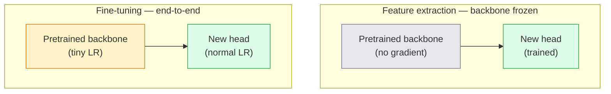

# 迁移学习与微调

> 已经有人花费一百万 GPU 小时，教会网络识别边缘、纹理和物体部件。在训练自己的模型前，你应该先借用这些特征。

**Type:** 构建
**Languages:** Python
**Prerequisites:** 第 4 阶段第 03 课（CNN）、第 4 阶段第 04 课（图像分类）
**Time:** 约 75 分钟

## 学习目标

- 区分特征提取与微调，并根据数据集大小、领域距离和计算预算选择合适方式
- 加载预训练骨干网络、替换分类头，并用不超过 20 行代码只训练分类头，得到可用基线
- 使用判别式学习率逐步解冻各层，让前面的通用特征更新得比后面的任务特定特征更小
- 诊断三种常见故障：解冻模块的学习率过高造成特征漂移、小数据集造成 BN 统计量坍缩，以及灾难性遗忘

## 问题所在

在 ImageNet 上训练 ResNet-50 大约需要 2,000 GPU 小时。几乎没有团队能为每个交付任务承担这笔预算。绝大多数团队真正投入生产的，是一个预训练骨干网络，再使用几百或几千张任务特定图像训练新的分类头。

这不是捷径。任何在 ImageNet 上训练的 CNN，其第一个卷积模块都会学习边缘和类似 Gabor 的滤波器；接下来几组模块学习纹理和简单图案；中间模块学习物体部件；最后几个模块学习逐渐接近 ImageNet 1,000 个类别的组合。由于自然界用于构成图像的边缘和纹理种类有限，这套层次结构的前 90% 几乎可以原样迁移到医学影像、工业检测、卫星数据和其他所有视觉任务。你真正需要训练的只是最后 10%。

要正确完成迁移学习，有三个缺陷在等着你：用过高学习率破坏预训练特征、冻结过多层导致模型无法吸收足够信息，以及让 BatchNorm 的移动统计量漂移到一个其余网络从未学习过的小型数据集。本课会有意逐一走过这些问题。

## 核心概念

### 特征提取与微调

有两种训练模式，应根据你对预训练特征的信任程度以及拥有的数据量进行选择。



经验法则如下：

| 数据集大小 | 与预训练领域的距离 | 方案 |
|--------------|-----------------|--------|
| 少于 1k 张图像 | 接近 ImageNet | 冻结骨干网络，只训练分类头 |
| 1k–10k | 接近 | 冻结前 2–3 个阶段，微调其余部分 |
| 10k–100k | 任意 | 使用判别式 LR 进行端到端微调 |
| 100k 以上 | 很远 | 微调全部参数；如果领域差异足够大，可考虑从零训练 |

“接近 ImageNet”大致表示具有物体内容的自然 RGB 照片。医学 CT 扫描、俯视卫星图像和显微图像都属于远领域——预训练特征仍有帮助，但需要允许更多层作出调整。

### 冻结为何有效

CNN 从 ImageNet 学到的特征并不专属于其中 1,000 个类别，而是专门适应自然图像的统计规律：特定方向的边缘、纹理、对比模式和基本形状。这些统计规律在人类能够命名的几乎每个视觉领域中都相当稳定。因此，一个在 ImageNet 上训练的模型，只需换一个新的线性分类头，在不微调骨干网络的情况下零样本评估 CIFAR-10，也能达到 80% 以上准确率。分类头学习的是：对于当前任务，应该如何加权那些已经学到的特征。

### 判别式学习率

解冻网络后，前面的层应该比后面的层训练得更慢。前层编码需要保留的通用特征，后层编码需要大幅调整的任务特定结构。

```
Typical recipe:

  stage 0 (stem + first group): lr = base_lr / 100    (mostly fixed)
  stage 1:                       lr = base_lr / 10
  stage 2:                       lr = base_lr / 3
  stage 3 (last backbone group): lr = base_lr
  head:                          lr = base_lr  (or slightly higher)
```

在 PyTorch 中，只需把一个参数组列表传给优化器即可实现。一个模型、五种学习率，不需要额外机制。

### BatchNorm 问题

BN 层保存 `running_mean` 和 `running_var` 缓冲区，它们是在 ImageNet 上计算得到的。如果当前任务的像素分布不同，例如光照、传感器或颜色空间不同，这些缓冲区就不再正确。按优先顺序有三种选择：

1. **让 BN 保持训练模式并参与微调。** 让 BN 随网络其他部分一同更新移动统计量。任务数据集具有中等规模（至少 5k 个样本）时，这是默认选择。
2. **把 BN 冻结在评估模式。** 保留 ImageNet 统计量，只训练权重。如果数据集很小，BN 的移动平均会包含太大噪声，应采用这种方式。
3. **用 GroupNorm 替换 BN。** 从根本上消除移动平均问题。目标检测和分割的骨干网络常用这种方法，因为每张 GPU 上的批大小很小。

处理错误会悄无声息地让准确率下降 5%–15%。

### 分类头设计

分类头通常由 1–3 个线性层和可选的 Dropout 组成。每个 torchvision 骨干网络都带有一个可替换的默认分类头：

```
backbone.fc = nn.Linear(backbone.fc.in_features, num_classes)          # ResNet
backbone.classifier[1] = nn.Linear(..., num_classes)                    # EfficientNet, MobileNet
backbone.heads.head = nn.Linear(..., num_classes)                       # torchvision ViT
```

对于小型数据集，单个线性层通常已经足够。当任务分布与骨干网络的训练分布距离较远时，加入一个隐藏层，也就是 Linear -> ReLU -> Dropout -> Linear，会有所帮助。

### 逐层学习率衰减

这是现代微调（BEiT、DINOv2、ViT-B 微调）中使用的、更平滑的判别式学习率。它不把层分成阶段，而是让每一层的 LR 都略低于上一层：

```
lr_layer_k = base_lr * decay^(L - k)
```

当 decay = 0.75 且 L = 12 个 Transformer 模块时，第一个模块以分类头 LR 的 `0.75^11 ≈ 0.04x` 训练。这对 Transformer 微调的意义大于 CNN，因为 CNN 通常按阶段分组学习率就已足够。

### 应该评估什么

迁移学习实验需要追踪两个从零训练时不会使用的数值：

- **仅预训练特征的准确率**——冻结骨干网络时，分类头达到的准确率。这是下限。
- **微调后的准确率**——端到端训练同一模型后达到的准确率。这是上限。

如果微调后的准确率低于仅使用预训练特征的准确率，就存在学习率或 BN 缺陷。始终打印两者。

```figure
transfer-learning
```

## 动手构建

### 第 1 步：加载并检查预训练骨干网络

```python
import torch
import torch.nn as nn
from torchvision.models import resnet18, ResNet18_Weights

backbone = resnet18(weights=ResNet18_Weights.IMAGENET1K_V1)
print(backbone)
print()
print("classifier head:", backbone.fc)
print("feature dim:", backbone.fc.in_features)
```

`ResNet18` 包含四个阶段（`layer1..layer4`），以及一个 Stem 和一个 `fc` 分类头。每个 torchvision 分类骨干网络都有类似结构。

### 第 2 步：特征提取——冻结全部网络并替换分类头

```python
def make_feature_extractor(num_classes=10):
    model = resnet18(weights=ResNet18_Weights.IMAGENET1K_V1)
    for p in model.parameters():
        p.requires_grad = False
    model.fc = nn.Linear(model.fc.in_features, num_classes)
    return model

model = make_feature_extractor(num_classes=10)
trainable = sum(p.numel() for p in model.parameters() if p.requires_grad)
frozen = sum(p.numel() for p in model.parameters() if not p.requires_grad)
print(f"trainable: {trainable:>10,}")
print(f"frozen:    {frozen:>10,}")
```

只有 `model.fc` 可以训练，骨干网络是冻结的特征提取器。

### 第 3 步：判别式微调

下面的工具函数会使用阶段特定学习率构建参数组。

```python
def discriminative_param_groups(model, base_lr=1e-3, decay=0.3):
    stages = [
        ["conv1", "bn1"],
        ["layer1"],
        ["layer2"],
        ["layer3"],
        ["layer4"],
        ["fc"],
    ]
    groups = []
    for i, names in enumerate(stages):
        lr = base_lr * (decay ** (len(stages) - 1 - i))
        params = [p for n, p in model.named_parameters()
                  if any(n.startswith(k) for k in names)]
        if params:
            groups.append({"params": params, "lr": lr, "name": "_".join(names)})
    return groups

model = resnet18(weights=ResNet18_Weights.IMAGENET1K_V1)
model.fc = nn.Linear(model.fc.in_features, 10)
for p in model.parameters():
    p.requires_grad = True

groups = discriminative_param_groups(model)
for g in groups:
    print(f"{g['name']:>10s}  lr={g['lr']:.2e}  params={sum(p.numel() for p in g['params']):>8,}")
```

`decay=0.3` 表示每个阶段都以后一阶段 30% 的学习率训练。`fc` 使用 `base_lr`，`layer4` 使用 `0.3 * base_lr`，`conv1` 使用 `0.3^5 * base_lr ≈ 0.00243 * base_lr`。听起来很极端，但实践证明有效。

### 第 4 步：处理 BatchNorm

下面的辅助函数会冻结 BN 的移动统计量，但不冻结其权重。

```python
def freeze_bn_stats(model):
    for m in model.modules():
        if isinstance(m, (nn.BatchNorm1d, nn.BatchNorm2d, nn.BatchNorm3d)):
            m.eval()
            for p in m.parameters():
                p.requires_grad = False
    return model
```

每个 epoch 开头设置 `model.train()` 后都要调用它。`model.train()` 会把所有组件切换到训练模式，而这个函数只把 BN 层切换回评估模式。

### 第 5 步：最小端到端微调循环

```python
from torch.optim import SGD
from torch.utils.data import DataLoader
from torch.optim.lr_scheduler import CosineAnnealingLR
import torch.nn.functional as F

def fine_tune(model, train_loader, val_loader, device, epochs=5, base_lr=1e-3, freeze_bn=False):
    model = model.to(device)
    groups = discriminative_param_groups(model, base_lr=base_lr)
    optimizer = SGD(groups, momentum=0.9, weight_decay=1e-4, nesterov=True)
    scheduler = CosineAnnealingLR(optimizer, T_max=epochs)

    for epoch in range(epochs):
        model.train()
        if freeze_bn:
            freeze_bn_stats(model)
        tr_loss, tr_correct, tr_total = 0.0, 0, 0
        for x, y in train_loader:
            x, y = x.to(device), y.to(device)
            logits = model(x)
            loss = F.cross_entropy(logits, y, label_smoothing=0.1)
            optimizer.zero_grad()
            loss.backward()
            optimizer.step()
            tr_loss += loss.item() * x.size(0)
            tr_total += x.size(0)
            tr_correct += (logits.argmax(-1) == y).sum().item()
        scheduler.step()

        model.eval()
        va_total, va_correct = 0, 0
        with torch.no_grad():
            for x, y in val_loader:
                x, y = x.to(device), y.to(device)
                pred = model(x).argmax(-1)
                va_total += x.size(0)
                va_correct += (pred == y).sum().item()
        print(f"epoch {epoch}  train {tr_loss/tr_total:.3f}/{tr_correct/tr_total:.3f}  "
              f"val {va_correct/va_total:.3f}")
    return model
```

在 CIFAR-10 上采用以上方案训练五个 epoch，可以让 `ResNet18-IMAGENET1K_V1` 从约 70% 的零样本线性探测准确率提升到约 93% 的微调准确率。如果始终不触碰骨干网络，只训练分类头，则会在约 86% 处进入平台期。

### 第 6 步：渐进解冻

下面的调度会从末端向前，每个 epoch 解冻一个阶段。它能缓解特征漂移，代价是多训练几个 epoch。

```python
def progressive_unfreeze_schedule(model):
    stages = ["layer4", "layer3", "layer2", "layer1"]
    yielded = set()

    def start():
        for p in model.parameters():
            p.requires_grad = False
        for p in model.fc.parameters():
            p.requires_grad = True

    def unfreeze(epoch):
        if epoch < len(stages):
            name = stages[epoch]
            yielded.add(name)
            for n, p in model.named_parameters():
                if n.startswith(name):
                    p.requires_grad = True
            return name
        return None

    return start, unfreeze
```

第一个 epoch 开始前调用一次 `start()`，每个 epoch 开头调用 `unfreeze(epoch)`。每当可训练参数集合发生变化时，都要重新构建优化器，否则被冻结参数仍保留旧的矩缓存，会干扰优化器。

## 实际应用

对于大多数真实任务，`torchvision.models` 加三行代码已经足够。只有遇到库默认设置无法解决的问题时，才需要使用前面更复杂的机制。

```python
from torchvision.models import resnet50, ResNet50_Weights

model = resnet50(weights=ResNet50_Weights.IMAGENET1K_V2)
model.fc = nn.Linear(model.fc.in_features, num_classes)
optimizer = torch.optim.AdamW(model.parameters(), lr=1e-4, weight_decay=1e-4)
```

另外还有两个生产级默认选择：

- `timm` 以统一 API 提供约 800 个预训练视觉骨干网络，例如 `timm.create_model("resnet50", pretrained=True, num_classes=10)`。只要微调范围超出 torchvision 模型库，它就是标准选择。
- 对于 Transformer，`transformers.AutoModelForImageClassification.from_pretrained(name, num_labels=N)` 会以与文本模型相同的加载语义提供 ViT、BEiT 和 DeiT。

## 交付成果

本课会产出：

- `outputs/prompt-fine-tune-planner.md`——根据数据集大小、领域距离和计算预算，选择特征提取、渐进式微调或端到端微调的提示词。
- `outputs/skill-freeze-inspector.md`——给定 PyTorch 模型后，报告哪些参数可训练、哪些 BatchNorm 层处于评估模式，以及优化器是否真正接收了可训练参数。

## 练习

1. **（简单）** 在同一个合成 CIFAR 数据集上，分别把 `ResNet18` 训练成线性探测模型，也就是冻结骨干网络，以及完整微调模型。并排报告两种准确率。哪种差距说明特征迁移良好，哪种差距说明迁移效果不佳？
2. **（中等）** 故意引入缺陷：把骨干阶段的 `base_lr = 1e-1`，而不是只把它用于分类头。观察训练损失爆炸，再使用 `discriminative_param_groups` 辅助函数恢复。记录每个阶段从多大学习率开始发散。
3. **（困难）** 选择一个医学影像数据集，例如 CheXpert-small、PatchCamelyon 或 HAM10000，比较三种模式：(a) 使用 ImageNet 预训练并冻结骨干网络，只训练线性分类头；(b) 使用 ImageNet 预训练并端到端微调；(c) 从零训练。报告每种方案的准确率和计算成本。数据集达到多大规模时，从零训练开始具备竞争力？

## 关键术语

| 术语 | 人们常说 | 实际含义 |
|------|----------------|----------------------|
| 特征提取 | “冻结后训练分类头” | 冻结骨干网络参数，只有新分类头接收梯度 |
| 微调 | “端到端重新训练” | 所有参数都可训练，通常使用远低于从零训练的学习率 |
| 判别式 LR | “前层使用更小 LR” | 为优化器设置参数组，使前面阶段的 LR 只是后面阶段 LR 的一部分 |
| 逐层 LR 衰减 | “平滑的 LR 梯度” | 每层 LR 乘以 decay^(L - k)，常用于 Transformer 微调 |
| 灾难性遗忘 | “模型忘记了 ImageNet” | 过高 LR 在新任务信号稳定前就覆盖了预训练特征 |
| BN 统计量漂移 | “移动均值错了” | BatchNorm 的 running_mean/var 来自与当前任务不同的分布，悄无声息地损害准确率 |
| 线性探测 | “冻结骨干 + 线性分类头” | 对预训练特征的评估，也就是冻结表示之上最佳线性分类器的准确率 |
| 灾难性坍缩 | “所有样本都预测成一个类别” | 微调 LR 高到在分类头梯度稳定前就摧毁特征时发生的现象 |

## 延伸阅读

- [《How transferable are features in deep neural networks?》（Yosinski 等，2014）](https://arxiv.org/abs/1411.1792)——量化不同层中特征可迁移性的论文
- [《Universal Language Model Fine-tuning》（ULMFiT，Howard 与 Ruder，2018）](https://arxiv.org/abs/1801.06146)——判别式 LR 与渐进解冻方案的原始论文，这些思想可以直接迁移到视觉领域
- [timm 文档](https://huggingface.co/docs/timm)——现代视觉骨干网络及其准确微调默认值的参考资料
- [《A Simple Framework for Linear-Probe Evaluation》（Kornblith 等，2019）](https://arxiv.org/abs/1805.08974)——解释线性探测准确率为何重要，以及如何正确报告这一指标
