# 目标检测——从零实现 YOLO

> 目标检测就是在特征图的每个位置同时执行分类与回归，再使用非极大值抑制清理结果。

**Type:** 构建
**Languages:** Python
**Prerequisites:** 第 4 阶段第 03 课（CNN）、第 4 阶段第 04 课（图像分类）、第 4 阶段第 05 课（迁移学习）
**Time:** 约 75 分钟

## 学习目标

- 解释如何通过网格与 Anchor 设计把目标检测转化为稠密预测问题，并说清输出张量中每个数值的含义
- 计算边界框之间的交并比，并从零实现非极大值抑制
- 在预训练骨干网络上构建一个最小 YOLO 风格检测头，包括分类、目标存在性和边界框回归损失
- 阅读一行检测指标（precision@0.5、recall、mAP@0.5、mAP@0.5:0.95），并选择下一步应调节的参数

## 问题所在

图像分类会说“这张图是一只狗”。目标检测则会说：“像素坐标 (112, 40, 280, 210) 处有一只狗，(400, 180, 560, 310) 处有一只猫，画面中没有其他目标。”从每张图像预测一个标签，变成预测数量不定且带标签的边界框，仅这一项结构变化，就是每个自动驾驶系统、监控产品、文档布局解析器和工厂视觉产线所依赖的基础。

目标检测也是视觉领域所有工程权衡同时出现的地方。你既希望边界框准确，也就是回归头表现好；又希望每个框的类别正确，也就是分类头表现好；还希望模型知道何时没有目标，也就是目标存在性分数准确；并希望每个真实物体只对应一项预测，也就是正确执行非极大值抑制。任何一环缺失，流水线都会漏检物体、报告凭空出现的边界框，或者在略有不同的位置重复预测同一个物体十五次。

YOLO（You Only Look Once，Redmon 等，2016）通过卷积网络的一次前向传播实时完成所有这些工作。现代检测器（YOLOv8、YOLOv9、YOLO-NAS、RT-DETR）至今仍以相同结构决策为基础。掌握核心之后，每种变体都只是同一组部件的重新排列。

## 核心概念

### 把检测视为稠密预测

分类器为每张图像输出 C 个数。YOLO 风格检测器则为每张图像输出 `(S x S x (5 + C))` 个数，其中 S 是空间网格大小。

```mermaid
flowchart LR
    IMG["Input 416x416 RGB"] --> BB["Backbone<br/>(ResNet, DarkNet, ...)"]
    BB --> FM["Feature map<br/>(C_feat, 13, 13)"]
    FM --> HEAD["Detection head<br/>(1x1 convs)"]
    HEAD --> OUT["Output tensor<br/>(13, 13, B * (5 + C))"]
    OUT --> DEC["Decode<br/>(grid + sigmoid + exp)"]
    DEC --> NMS["Non-max suppression"]
    NMS --> RESULT["Final boxes"]

    style IMG fill:#dbeafe,stroke:#2563eb
    style HEAD fill:#fef3c7,stroke:#d97706
    style NMS fill:#fecaca,stroke:#dc2626
    style RESULT fill:#dcfce7,stroke:#16a34a
```



`S * S` 个网格单元中的每一个，都会预测 `B` 个边界框。对于每个框：

- 4 个数描述几何信息：`tx, ty, tw, th`。
- 1 个数表示目标存在性分数：“这个单元中是否有一个目标的中心？”
- C 个数表示类别概率。

每个单元总共输出 `B * (5 + C)` 个数。对于 `S=13, B=2, C=20` 的 VOC，每个单元会输出 50 个数。

### 为什么需要网格与 Anchor

直接回归会为每个目标预测绝对坐标 `(x, y, w, h)`。这对卷积网络很困难，因为图像发生平移时，并不应该让所有预测都平移同样的距离——每个目标都与空间位置绑定。网格通过把每个真实框分配给其中心所在的网格单元来解决这个问题，只有该单元负责这个目标。

Anchor 用来解决第二个问题。一个 3x3 卷积很难从一个感受野只有 16 像素的特征单元中，直接回归出宽 500 像素的边界框。因此，我们为每个单元预先定义 `B` 种先验框形状，也就是 Anchor，再让模型预测相对于每个 Anchor 的小幅偏移。模型不必从零回归，而只需选择正确的 Anchor 并进行微调。

```
Anchor box priors (example for 416x416 input):

  small:   (30,  60)
  medium:  (75,  170)
  large:   (200, 380)

At each grid cell, every anchor emits (tx, ty, tw, th, obj, c_1, ..., c_C).
```

现代检测器通常采用 FPN，并在不同分辨率上使用不同 Anchor 集合：浅层高分辨率特征图使用小 Anchor，深层低分辨率特征图使用大 Anchor。思想相同，只是尺度更多。

### 解码预测

原始 `tx, ty, tw, th` 并不是边界框坐标，绘制前需要先执行变换：

```
centre x  = (sigmoid(tx) + cell_x) * stride
centre y  = (sigmoid(ty) + cell_y) * stride
width     = anchor_w * exp(tw)
height    = anchor_h * exp(th)
```

`sigmoid` 把中心偏移限制在单元内部，`exp` 允许宽高相对于 Anchor 自由缩放且不会改变符号，`stride` 则把网格坐标还原成像素坐标。从 YOLOv2 开始，每个 YOLO 版本都采用相同的解码步骤。

### IoU

这是目标检测中衡量两个边界框相似度的通用指标：

```
IoU(A, B) = area(A intersect B) / area(A union B)
```

IoU = 1 表示两个框完全相同，IoU = 0 表示完全不相交。预测框与真实框之间的 IoU 决定该预测能否算作真正例，通常要求 IoU >= 0.5；两个预测框之间的 IoU 则用于 NMS 去重。

### 非极大值抑制

在相邻 Anchor 上训练的卷积网络，往往会为同一个物体预测多个重叠框。NMS 会保留置信度最高的预测，并删除所有与它的 IoU 超过阈值的其他预测。

```
NMS(boxes, scores, iou_threshold):
    sort boxes by score descending
    keep = []
    while boxes not empty:
        pick the top-scoring box, add to keep
        remove every box with IoU > iou_threshold to the picked box
    return keep
```

目标检测的典型阈值为 0.45。近期检测器会用 `soft-NMS`、`DIoU-NMS` 替代标准 NMS，或像 RT-DETR 那样直接学习抑制过程，但结构上的目的完全相同。

### 损失函数

YOLO 损失由三类损失按权重相加：

```
L = lambda_coord * L_box(pred, target, where obj=1)
  + lambda_obj   * L_obj(pred, 1,     where obj=1)
  + lambda_noobj * L_obj(pred, 0,     where obj=0)
  + lambda_cls   * L_cls(pred, target, where obj=1)
```

只有包含目标的单元才会贡献边界框回归损失和分类损失。没有目标的单元只贡献目标存在性损失，用来教模型保持沉默。`lambda_noobj` 通常较小，约为 0.5，因为绝大多数单元都是空的，否则它们会主导总损失。

现代变体会用直接优化 IoU 的 CIoU / DIoU 取代 MSE 边界框损失，使用 Focal Loss 处理类别不平衡，并用 Quality Focal Loss 平衡目标存在性，但由三个部分组成的结构并未改变。

### 检测指标

准确率无法直接用于目标检测，需要关注以下四个数：

- **Precision@IoU=0.5**——所有被计为正例的预测中，有多少真正正确。
- **Recall@IoU=0.5**——所有真实目标中，我们找到了多少。
- **AP@0.5**——IoU 阈值为 0.5 时，精确率—召回率曲线下面积；每个类别各有一个数值。
- **mAP@0.5:0.95**——在 0.5、0.55、……、0.95 这些 IoU 阈值上计算 AP 后取平均。这是 COCO 指标，也是最严格、信息最丰富的指标。

应同时报告四者。如果检测器的 mAP@0.5 很高，mAP@0.5:0.95 却很低，说明大致定位正确，但边界框不够紧，应改进边界框回归损失。如果精确率高而召回率低，说明检测器过于保守，应降低置信度阈值或提高目标存在性损失权重。

```figure
object-detection-nms
```

## 动手构建

### 第 1 步：IoU

这是本课最常用的基础函数，接收两个采用 `(x1, y1, x2, y2)` 格式的边界框数组。

```python
import numpy as np

def box_iou(boxes_a, boxes_b):
    ax1, ay1, ax2, ay2 = boxes_a[:, 0], boxes_a[:, 1], boxes_a[:, 2], boxes_a[:, 3]
    bx1, by1, bx2, by2 = boxes_b[:, 0], boxes_b[:, 1], boxes_b[:, 2], boxes_b[:, 3]

    inter_x1 = np.maximum(ax1[:, None], bx1[None, :])
    inter_y1 = np.maximum(ay1[:, None], by1[None, :])
    inter_x2 = np.minimum(ax2[:, None], bx2[None, :])
    inter_y2 = np.minimum(ay2[:, None], by2[None, :])

    inter_w = np.clip(inter_x2 - inter_x1, 0, None)
    inter_h = np.clip(inter_y2 - inter_y1, 0, None)
    inter = inter_w * inter_h

    area_a = (ax2 - ax1) * (ay2 - ay1)
    area_b = (bx2 - bx1) * (by2 - by1)
    union = area_a[:, None] + area_b[None, :] - inter
    return inter / np.clip(union, 1e-8, None)
```

返回形状为 `(N_a, N_b)` 的两两 IoU 矩阵。如果要与单个真实框比较，只需让其中一个数组的形状为 `(1, 4)`。

### 第 2 步：非极大值抑制

```python
def nms(boxes, scores, iou_threshold=0.45):
    order = np.argsort(-scores)
    keep = []
    while len(order) > 0:
        i = order[0]
        keep.append(i)
        if len(order) == 1:
            break
        rest = order[1:]
        ious = box_iou(boxes[[i]], boxes[rest])[0]
        order = rest[ious <= iou_threshold]
    return np.array(keep, dtype=np.int64)
```

该实现是确定性的，排序使其复杂度为 `O(N log N)`，在相同输入上与 `torchvision.ops.nms` 的行为一致。

### 第 3 步：边界框编码与解码

在像素坐标与网络实际回归的 `(tx, ty, tw, th)` 目标之间转换。

```python
def encode(box_xyxy, cell_x, cell_y, stride, anchor_wh):
    x1, y1, x2, y2 = box_xyxy
    cx = 0.5 * (x1 + x2)
    cy = 0.5 * (y1 + y2)
    w = x2 - x1
    h = y2 - y1
    tx = cx / stride - cell_x
    ty = cy / stride - cell_y
    tw = np.log(w / anchor_wh[0] + 1e-8)
    th = np.log(h / anchor_wh[1] + 1e-8)
    return np.array([tx, ty, tw, th])


def decode(tx_ty_tw_th, cell_x, cell_y, stride, anchor_wh):
    tx, ty, tw, th = tx_ty_tw_th
    cx = (sigmoid(tx) + cell_x) * stride
    cy = (sigmoid(ty) + cell_y) * stride
    w = anchor_wh[0] * np.exp(tw)
    h = anchor_wh[1] * np.exp(th)
    return np.array([cx - w / 2, cy - h / 2, cx + w / 2, cy + h / 2])


def sigmoid(x):
    return 1.0 / (1.0 + np.exp(-x))
```

测试方法是先编码一个边界框，再进行解码；得到的结果应该非常接近原框。由于 `tx` 不在 Sigmoid 变换后的范围内时，Sigmoid 的逆变换并非完全可逆，所以会存在微小差异。

### 第 4 步：最小 YOLO 检测头

在特征图上应用一个 1x1 卷积，再重塑为 `(B, S, S, num_anchors, 5 + C)`。

```python
import torch
import torch.nn as nn

class YOLOHead(nn.Module):
    def __init__(self, in_c, num_anchors, num_classes):
        super().__init__()
        self.num_anchors = num_anchors
        self.num_classes = num_classes
        self.conv = nn.Conv2d(in_c, num_anchors * (5 + num_classes), kernel_size=1)

    def forward(self, x):
        n, _, h, w = x.shape
        y = self.conv(x)
        y = y.view(n, self.num_anchors, 5 + self.num_classes, h, w)
        y = y.permute(0, 3, 4, 1, 2).contiguous()
        return y
```

输出形状为 `(N, H, W, num_anchors, 5 + C)`，最后一个维度依次保存 `[tx, ty, tw, th, obj, cls_0, ..., cls_{C-1}]`。

### 第 5 步：分配真实目标

对每个真实边界框，决定由哪个 `(cell, anchor)` 负责。

```python
def assign_targets(boxes_xyxy, classes, anchors, stride, grid_size, num_classes):
    num_anchors = len(anchors)
    target = np.zeros((grid_size, grid_size, num_anchors, 5 + num_classes), dtype=np.float32)
    has_obj = np.zeros((grid_size, grid_size, num_anchors), dtype=bool)

    for box, cls in zip(boxes_xyxy, classes):
        x1, y1, x2, y2 = box
        cx, cy = 0.5 * (x1 + x2), 0.5 * (y1 + y2)
        gx, gy = int(cx / stride), int(cy / stride)
        bw, bh = x2 - x1, y2 - y1

        ious = np.array([
            (min(bw, aw) * min(bh, ah)) / (bw * bh + aw * ah - min(bw, aw) * min(bh, ah))
            for aw, ah in anchors
        ])
        best = int(np.argmax(ious))
        aw, ah = anchors[best]

        target[gy, gx, best, 0] = cx / stride - gx
        target[gy, gx, best, 1] = cy / stride - gy
        target[gy, gx, best, 2] = np.log(bw / aw + 1e-8)
        target[gy, gx, best, 3] = np.log(bh / ah + 1e-8)
        target[gy, gx, best, 4] = 1.0
        target[gy, gx, best, 5 + cls] = 1.0
        has_obj[gy, gx, best] = True
    return target, has_obj
```

Anchor 选择采用“与真实框形状 IoU 最大”的规则。这是一种成本很低的近似，与 YOLOv2/v3 的分配方式一致。v5 及后续版本会使用更复杂的策略，例如任务对齐匹配和动态 k，但仍然是在细化同一个思想。

### 第 6 步：三类损失

```python
def yolo_loss(pred, target, has_obj, lambda_coord=5.0, lambda_obj=1.0, lambda_noobj=0.5, lambda_cls=1.0):
    has_obj_t = torch.from_numpy(has_obj).bool()
    target_t = torch.from_numpy(target).float()

    # box-regression loss: only on cells with objects
    box_pred = pred[..., :4][has_obj_t]
    box_true = target_t[..., :4][has_obj_t]
    loss_box = torch.nn.functional.mse_loss(box_pred, box_true, reduction="sum")

    # objectness loss
    obj_pred = pred[..., 4]
    obj_true = target_t[..., 4]
    loss_obj_pos = torch.nn.functional.binary_cross_entropy_with_logits(
        obj_pred[has_obj_t], obj_true[has_obj_t], reduction="sum")
    loss_obj_neg = torch.nn.functional.binary_cross_entropy_with_logits(
        obj_pred[~has_obj_t], obj_true[~has_obj_t], reduction="sum")

    # classification loss on cells with objects
    cls_pred = pred[..., 5:][has_obj_t]
    cls_true = target_t[..., 5:][has_obj_t]
    loss_cls = torch.nn.functional.binary_cross_entropy_with_logits(
        cls_pred, cls_true, reduction="sum")

    total = (lambda_coord * loss_box
             + lambda_obj * loss_obj_pos
             + lambda_noobj * loss_obj_neg
             + lambda_cls * loss_cls)
    return total, {"box": loss_box.item(), "obj_pos": loss_obj_pos.item(),
                   "obj_neg": loss_obj_neg.item(), "cls": loss_cls.item()}
```

每篇 YOLO 教程都会硬编码或扫描五个超参数，其中各项比例十分重要。`lambda_coord=5, lambda_noobj=0.5` 沿用了 YOLOv1 原始论文的设置，至今仍是合理的默认值。

### 第 7 步：推理流水线

解码检测头的原始输出，应用 Sigmoid/Exp，根据目标存在性设置阈值，最后执行 NMS。

```python
def postprocess(pred_tensor, anchors, stride, img_size, conf_threshold=0.25, iou_threshold=0.45):
    pred = pred_tensor.detach().cpu().numpy()
    grid_h, grid_w = pred.shape[1], pred.shape[2]
    num_anchors = len(anchors)

    boxes, scores, classes = [], [], []
    for gy in range(grid_h):
        for gx in range(grid_w):
            for a in range(num_anchors):
                tx, ty, tw, th, obj, *cls = pred[0, gy, gx, a]
                score = sigmoid(obj) * sigmoid(np.array(cls)).max()
                if score < conf_threshold:
                    continue
                cls_idx = int(np.argmax(cls))
                cx = (sigmoid(tx) + gx) * stride
                cy = (sigmoid(ty) + gy) * stride
                w = anchors[a][0] * np.exp(tw)
                h = anchors[a][1] * np.exp(th)
                boxes.append([cx - w / 2, cy - h / 2, cx + w / 2, cy + h / 2])
                scores.append(float(score))
                classes.append(cls_idx)

    if not boxes:
        return np.zeros((0, 4)), np.zeros((0,)), np.zeros((0,), dtype=int)
    boxes = np.array(boxes)
    scores = np.array(scores)
    classes = np.array(classes)
    keep = nms(boxes, scores, iou_threshold)
    return boxes[keep], scores[keep], classes[keep]
```

这就是完整的评估路径：检测头 -> 解码 -> 阈值过滤 -> NMS。

## 实际应用

`torchvision.models.detection` 提供了具有相同概念结构的生产级检测器，加载一个预训练模型只需三行。

```python
import torch
from torchvision.models.detection import fasterrcnn_resnet50_fpn_v2

model = fasterrcnn_resnet50_fpn_v2(weights="DEFAULT")
model.eval()
with torch.no_grad():
    predictions = model([torch.randn(3, 400, 600)])
print(predictions[0].keys())
print(f"boxes:  {predictions[0]['boxes'].shape}")
print(f"scores: {predictions[0]['scores'].shape}")
print(f"labels: {predictions[0]['labels'].shape}")
```

在实时推理流水线中，`ultralytics`（YOLOv8/v9）是标准选择：`from ultralytics import YOLO; model = YOLO('yolov8n.pt'); model(img)`。模型会在内部处理解码与 NMS，并返回你刚才构建的同一种 `boxes / scores / labels` 三元组。

## 交付成果

本课会产出：

- `outputs/prompt-detection-metric-reader.md`——把一行 `precision, recall, AP, mAP@0.5:0.95` 指标转化为一句诊断，并指出最值得进行的下一项实验。
- `outputs/skill-anchor-designer.md`——给定一组真实边界框后，在 `(w, h)` 上执行 k-means，为每个 FPN 层级返回 Anchor 集合以及决定 Anchor 数量所需的覆盖统计量。

## 练习

1. **（简单）** 实现 `box_iou`，并在 1,000 对随机边界框上与 `torchvision.ops.box_iou` 比较，验证最大绝对差小于 `1e-6`。
2. **（中等）** 移植 `yolo_loss`，使用 `CIoU` 边界框损失替代 MSE。在包含 100 张合成图像的数据集上，证明在 epoch 数相同时，CIoU 最终得到的 mAP@0.5:0.95 优于 MSE。
3. **（困难）** 实现多尺度推理：以三种分辨率把同一图像送入模型，合并边界框预测，最后只运行一次 NMS。在保留集上测量相对于单尺度推理的 mAP 提升。

## 关键术语

| 术语 | 人们常说 | 实际含义 |
|------|----------------|----------------------|
| Anchor | “边界框先验” | 每个网格单元上预定义的框形状，网络以它为基础预测偏移，而不是直接预测绝对坐标 |
| IoU | “重叠程度” | 两个边界框的交集面积除以并集面积，是目标检测中的通用相似度指标 |
| NMS | “去重” | 保留分数最高的预测，并移除与其重叠超过阈值的其他预测的贪心算法 |
| 目标存在性 | “这里是否有东西” | 每个 Anchor、每个单元上的标量，预测是否有目标中心位于该单元中 |
| 网格步幅 | “下采样倍数” | 每个网格单元对应的像素数；416 像素输入配合 13 格检测头时，Stride 为 32 |
| mAP | “平均精度均值” | 对各类别的精确率—召回率曲线下面积取平均；COCO 还会跨 IoU 阈值平均 |
| AP@0.5 | “PASCAL VOC AP” | IoU 阈值为 0.5 时的平均精度，是较宽松的指标版本 |
| mAP@0.5:0.95 | “COCO AP” | 在 0.5 到 0.95、步长 0.05 的 IoU 阈值上取平均，是严格版本和当前社区标准 |

## 延伸阅读

- [《YOLOv1: You Only Look Once》（Redmon 等，2016）](https://arxiv.org/abs/1506.02640)——奠基论文，此后每一代 YOLO 都在细化这一结构
- [《YOLOv3》（Redmon 与 Farhadi，2018）](https://arxiv.org/abs/1804.02767)——引入多尺度 FPN 风格检测头的论文，图示至今仍然最清晰
- [Ultralytics YOLOv8 文档](https://docs.ultralytics.com)——当前生产级参考，涵盖数据集格式、增强和训练方案
- [《The Illustrated Guide to Object Detection》（Jonathan Hui）](https://jonathan-hui.medium.com/object-detection-series-24d03a12f904)——以通俗语言介绍完整检测器家族的优秀资料，对理解 DETR、RetinaNet、FCOS 与 YOLO 的关系非常有价值
