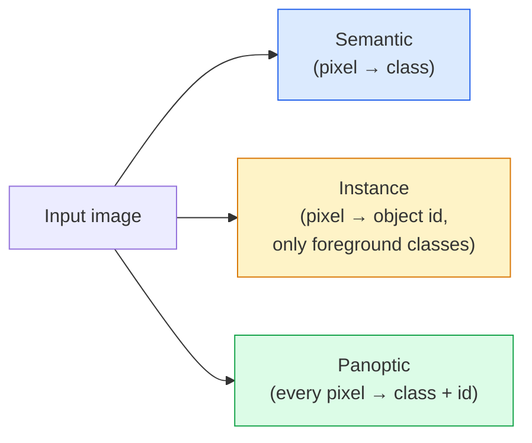
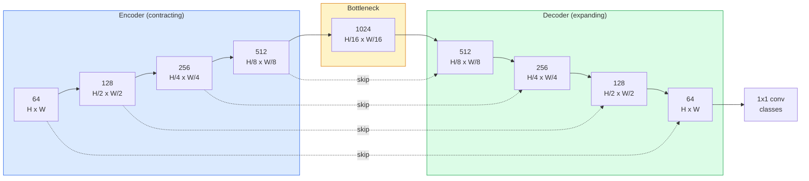

# 语义分割——U-Net

> 分割就是对每个像素进行分类。U-Net 将下采样编码器与上采样解码器配对，并在二者之间建立跳跃连接，从而让像素级分类真正可行。

**Type:** 构建
**Languages:** Python
**Prerequisites:** 第 4 阶段第 03 课（CNN）、第 4 阶段第 04 课（图像分类）
**Time:** 约 75 分钟

## 学习目标

- 区分语义分割、实例分割和全景分割，并针对给定问题选择正确任务
- 使用 PyTorch 从零构建 U-Net，包括编码器模块、瓶颈层、使用转置卷积的解码器和跳跃连接
- 实现逐像素交叉熵、Dice Loss，以及当前医学与工业分割中默认使用的组合损失
- 阅读每个类别的 IoU 和 Dice 指标，判断低分源自小目标召回率、边界准确度还是类别不平衡

## 问题所在

分类为每张图像输出一个标签，检测为每张图像输出少量边界框，分割则为每个像素输出一个标签。对于大小为 `H x W` 的输入，输出是形状为 `H x W` 的张量（语义分割），或形状为 `H x W x N_instances` 的张量（实例分割）。每张图像需要进行数百万次预测，而不是一次。

正因为采用这种结构，分割支撑着几乎所有稠密预测视觉产品：医学影像中的肿瘤掩码、自动驾驶中的道路/车道/障碍物、卫星图像中的建筑轮廓和作物边界、文档解析中的布局区域，以及机器人系统中的可抓取区域。这些任务都不能只在物体周围画一个框，而需要得到精确轮廓。

架构问题说起来简单，解决起来却不容易：网络必须同时看到图像的全局上下文，也就是“这是什么场景”，以及局部像素细节，也就是“究竟哪个像素是道路、哪个是人行道”。标准 CNN 通过压缩空间维度获得上下文，却也丢失了细节。U-Net 的设计同时保留了两者。

## 核心概念

### 语义分割、实例分割与全景分割



- **语义分割**会说“这个像素是道路，那个像素是汽车”。相邻的两辆汽车会合并成一个区域。
- **实例分割**会说“这个像素属于 3 号汽车，那个像素属于 5 号汽车”。它会忽略背景“材质”类别，例如天空、道路和草地。
- **全景分割**统一两者：每个像素都有类别标签，每个物体实例还有唯一 ID，同时分割“材质”和“物体”。

本课介绍语义分割，下一课 Mask R-CNN 会介绍实例分割。

### U-Net 的形状



编码器连续四次把空间分辨率减半，并将通道数翻倍。解码器执行相反操作：连续四次把空间分辨率翻倍，并将通道数减半。跳跃连接会在每种分辨率上，把对应编码器特征与解码器特征拼接起来。最后的 1x1 卷积在完整分辨率上把 `64 -> num_classes`。

跳跃连接之所以必不可少，是因为解码器尝试输出像素级预测时，只见过很小的特征图。如果没有跳跃连接，它无法准确定位边缘，因为这些信息已经在编码器中被压缩丢失。跳跃连接会把编码器下采样过程中计算出的高分辨率特征图直接交给解码器。

### 转置卷积与双线性上采样

解码器需要扩大空间尺寸，有两种选择：

- **转置卷积**（`nn.ConvTranspose2d`）——可学习的上采样，是历史上 U-Net 的默认方案。如果 Stride 与卷积核大小无法整除，可能产生棋盘格伪影。
- **双线性上采样 + 3x3 卷积**——先平滑上采样，再执行卷积。伪影更少，参数也更少，是如今的默认选择。

两种方式在实际项目中都很常见。第一次构建 U-Net 时，双线性上采样更稳妥。

### 像素网格上的交叉熵

对于包含 C 个类别的语义分割任务，模型输出形状为 `(N, C, H, W)`，目标形状为 `(N, H, W)`，其中包含整数类别 ID。交叉熵与分类任务完全相同，只是应用于每个空间位置：

```text
Loss = mean over (n, h, w) of -log( softmax(logits[n, :, h, w])[target[n, h, w]] )
```

PyTorch 中的 `F.cross_entropy` 原生支持这种形状，无需重塑。

### Dice Loss 以及为何需要它

交叉熵平等对待每个像素。当某个类别占据画面绝大部分时，这是错误的，例如医学影像中 99% 都是背景，肿瘤只占 1%。网络即使始终预测背景，也能得到 99% 准确率，却完全没有用。

Dice Loss 通过直接优化预测掩码与真实掩码的重叠程度解决这个问题：

```text
Dice(p, y) = 2 * sum(p * y) / (sum(p) + sum(y) + epsilon)
Dice_loss = 1 - Dice
```

其中，`p` 是某个类别的 Sigmoid/Softmax 概率图，`y` 是二元真实掩码。只有重叠完全一致时，损失才为零。它基于比率，因此不受类别不平衡影响。

实践中应使用**组合损失**：

```text
L = L_cross_entropy + lambda * L_dice       (lambda ~ 1)
```

交叉熵在训练早期提供稳定梯度，Dice 则让训练后期集中精力真正匹配掩码形状。这个组合是医学影像领域的默认选择，在任何类别不平衡的数据集上都很难被击败。

### 评估指标

- **像素准确率**——预测正确的像素百分比。计算便宜，但在不平衡数据上与分类准确率一样会失效。
- **逐类别 IoU**——每个类别掩码的交并比；再跨类别取平均得到 mIoU。
- **Dice（像素级 F1）**——与 IoU 类似，`Dice = 2 * IoU / (1 + IoU)`。医学影像领域偏爱 Dice，自动驾驶领域偏爱 IoU；两者保持单调关系。
- **边界 F1**——衡量预测边界与真实边界有多接近，即使发生很小偏移也会受到惩罚。它对半导体检测等高精度任务很重要。

应报告每个类别的 IoU，而不只是 mIoU。九个类别达到 85% 时，均值会掩盖另一个只有 15% 的类别。

### 输入分辨率的权衡

U-Net 编码器会连续四次将分辨率减半，因此输入尺寸必须能被 16 整除。医学图像通常为 512x512 或 1024x1024，自动驾驶裁剪图则可能为 2048x1024。U-Net 的内存成本随 `H * W * C_max` 增长；当输入为 1024x1024、瓶颈通道数为 1024 时，仅前向传播就会占用数 GB 显存。

有两种标准解决方案：
1. 切分输入——使用相互重叠的 256x256 图块分别处理，再拼接结果。
2. 用空洞卷积替换瓶颈层，在保持更高空间分辨率的同时扩大感受野，这就是 DeepLab 家族采用的方法。

对于第一个模型，使用 256x256 输入和基础通道数为 64 的 U-Net，可以在 8 GB 显存上轻松训练。

```figure
segmentation-flood
```

## 动手构建

### 第 1 步：编码器模块

使用两个 3x3 卷积，并搭配批归一化与 ReLU。第一个卷积改变通道数，第二个保持不变。

```python
import torch
import torch.nn as nn
import torch.nn.functional as F

class DoubleConv(nn.Module):
    def __init__(self, in_c, out_c):
        super().__init__()
        self.net = nn.Sequential(
            nn.Conv2d(in_c, out_c, kernel_size=3, padding=1, bias=False),
            nn.BatchNorm2d(out_c),
            nn.ReLU(inplace=True),
            nn.Conv2d(out_c, out_c, kernel_size=3, padding=1, bias=False),
            nn.BatchNorm2d(out_c),
            nn.ReLU(inplace=True),
        )

    def forward(self, x):
        return self.net(x)
```

整个网络会反复使用这个模块。由于 BN 的 beta 已经承担偏置作用，因此设置 `bias=False`。

### 第 2 步：下采样与上采样模块

```python
class Down(nn.Module):
    def __init__(self, in_c, out_c):
        super().__init__()
        self.net = nn.Sequential(
            nn.MaxPool2d(2),
            DoubleConv(in_c, out_c),
        )

    def forward(self, x):
        return self.net(x)


class Up(nn.Module):
    def __init__(self, in_c, out_c):
        super().__init__()
        self.up = nn.Upsample(scale_factor=2, mode="bilinear", align_corners=False)
        self.conv = DoubleConv(in_c, out_c)

    def forward(self, x, skip):
        x = self.up(x)
        if x.shape[-2:] != skip.shape[-2:]:
            x = F.interpolate(x, size=skip.shape[-2:], mode="bilinear", align_corners=False)
        x = torch.cat([skip, x], dim=1)
        return self.conv(x)
```

只比较空间形状，也就是 `shape[-2:]`，可以处理尺寸不能被 16 整除的输入；在拼接前，安全地使用 `F.interpolate` 对齐张量。若比较完整形状，通道数差异也会触发插值，但通道数不匹配应该明确报错，而不是悄悄插值。

### 第 3 步：U-Net

```python
class UNet(nn.Module):
    def __init__(self, in_channels=3, num_classes=2, base=64):
        super().__init__()
        self.inc = DoubleConv(in_channels, base)
        self.d1 = Down(base, base * 2)
        self.d2 = Down(base * 2, base * 4)
        self.d3 = Down(base * 4, base * 8)
        self.d4 = Down(base * 8, base * 16)
        self.u1 = Up(base * 16 + base * 8, base * 8)
        self.u2 = Up(base * 8 + base * 4, base * 4)
        self.u3 = Up(base * 4 + base * 2, base * 2)
        self.u4 = Up(base * 2 + base, base)
        self.outc = nn.Conv2d(base, num_classes, kernel_size=1)

    def forward(self, x):
        x1 = self.inc(x)
        x2 = self.d1(x1)
        x3 = self.d2(x2)
        x4 = self.d3(x3)
        x5 = self.d4(x4)
        x = self.u1(x5, x4)
        x = self.u2(x, x3)
        x = self.u3(x, x2)
        x = self.u4(x, x1)
        return self.outc(x)

net = UNet(in_channels=3, num_classes=2, base=32)
x = torch.randn(1, 3, 256, 256)
print(f"output: {net(x).shape}")
print(f"params: {sum(p.numel() for p in net.parameters()):,}")
```

输出形状为 `(1, 2, 256, 256)`，空间尺寸与输入相同，共有 `num_classes` 个通道。当 `base=32` 时，参数总数约为 770 万。

### 第 4 步：损失函数

```python
def dice_loss(logits, targets, num_classes, eps=1e-6):
    probs = F.softmax(logits, dim=1)
    targets_one_hot = F.one_hot(targets, num_classes).permute(0, 3, 1, 2).float()
    dims = (0, 2, 3)
    intersection = (probs * targets_one_hot).sum(dim=dims)
    denom = probs.sum(dim=dims) + targets_one_hot.sum(dim=dims)
    dice = (2 * intersection + eps) / (denom + eps)
    return 1 - dice.mean()


def combined_loss(logits, targets, num_classes, lam=1.0):
    ce = F.cross_entropy(logits, targets)
    dc = dice_loss(logits, targets, num_classes)
    return ce + lam * dc, {"ce": ce.item(), "dice": dc.item()}
```

Dice 会先按类别分别计算，再取平均，也就是宏平均 Dice。`eps` 用来防止某个批次中缺失类别时发生除零。

### 第 5 步：IoU 指标

```python
@torch.no_grad()
def intersection_union_per_class(logits, targets, num_classes):
    preds = logits.argmax(dim=1)
    intersections = torch.zeros(num_classes, device=logits.device)
    unions = torch.zeros(num_classes, device=logits.device)
    for c in range(num_classes):
        pred_c = (preds == c)
        true_c = (targets == c)
        intersections[c] = (pred_c & true_c).sum()
        unions[c] = (pred_c | true_c).sum()
    return intersections, unions


def iou_from_counts(intersections, unions):
    ious = torch.full_like(intersections, float("nan"), dtype=torch.float32)
    present = unions > 0
    ious[present] = intersections[present].float() / unions[present].float()
    return ious
```

先在所有验证批次上累计交集与并集向量，再调用一次 `iou_from_counts`。这样会让每个像素获得相同权重，避免样本较少的最后一个批次与完整批次产生同等影响。`nan` 表示整个已评估数据集中都没有该类别。

### 第 6 步：用于端到端验证的合成数据集

在独立随机生成的彩色背景上创建一到三个形状。形状颜色与圆形/方形类别彼此独立采样，因此模型无法通过记住固定配色来解决任务；同一场景中也可以同时包含两种类别。

```python
import numpy as np
from torch.utils.data import Dataset, DataLoader

def synthetic_segmentation(num_samples=200, size=64, seed=0):
    if size < 16:
        raise ValueError("size must be at least 16 pixels")

    rng = np.random.default_rng(seed)
    images = np.zeros((num_samples, size, size, 3), dtype=np.float32)
    masks = np.zeros((num_samples, size, size), dtype=np.int64)
    yy, xx = np.meshgrid(np.arange(size), np.arange(size), indexing="ij")
    min_radius = max(3, size // 16)
    max_radius = max(min_radius + 1, size // 5)
    for i in range(num_samples):
        images[i] = rng.uniform(0.1, 0.9, size=3)
        num_shapes = int(rng.integers(1, 4))
        for _ in range(num_shapes):
            cls = int(rng.integers(1, 3))
            color = rng.uniform(0.05, 0.95, size=3)
            radius = int(rng.integers(min_radius, max_radius + 1))
            cx = int(rng.integers(radius, size - radius))
            cy = int(rng.integers(radius, size - radius))
            if cls == 1:
                mask = (xx - cx) ** 2 + (yy - cy) ** 2 < radius ** 2
            else:
                mask = (np.abs(xx - cx) < radius) & (np.abs(yy - cy) < radius)
            images[i][mask] = color
            masks[i][mask] = cls
        images[i] += rng.normal(0, 0.02, images[i].shape)
        images[i] = np.clip(images[i], 0, 1)
    return images, masks


class SegDataset(Dataset):
    def __init__(self, images, masks):
        self.images = images
        self.masks = masks

    def __len__(self):
        return len(self.images)

    def __getitem__(self, i):
        img = torch.from_numpy(self.images[i]).permute(2, 0, 1).float()
        mask = torch.from_numpy(self.masks[i]).long()
        return img, mask
```

共有三个类别：背景（0）、圆形（1）和方形（2）。网络必须学会区分形状。

### 第 7 步：训练循环

```python
def train_one_epoch(model, loader, optimizer, device, num_classes):
    model.train()
    loss_sum, total = 0.0, 0
    for x, y in loader:
        x, y = x.to(device), y.to(device)
        logits = model(x)
        loss, _ = combined_loss(logits, y, num_classes)
        optimizer.zero_grad()
        loss.backward()
        optimizer.step()
        loss_sum += loss.item() * x.size(0)
        total += x.size(0)
    return loss_sum / total


@torch.no_grad()
def evaluate_iou(model, loader, device, num_classes):
    model.eval()
    intersections = torch.zeros(num_classes, device=device)
    unions = torch.zeros(num_classes, device=device)
    for x, y in loader:
        x, y = x.to(device), y.to(device)
        batch_intersections, batch_unions = intersection_union_per_class(
            model(x), y, num_classes
        )
        intersections += batch_intersections
        unions += batch_unions
    return iou_from_counts(intersections, unions)
```

在合成数据集上运行 10–30 个 epoch，可以看到形状类别的 mIoU 逐步改善。基于整个数据集累计计数，可确保批次大小以及某个批次中类别缺失的情况不会扭曲所报告的 IoU。

## 实际应用

生产环境中，`segmentation_models_pytorch`（简称“smp”）可以把任何标准分割架构与任意 torchvision 或 timm 骨干网络组合起来。只需三行：

```python
import segmentation_models_pytorch as smp

model = smp.Unet(
    encoder_name="resnet34",
    encoder_weights="imagenet",
    in_channels=3,
    classes=3,
)
```

真实项目中还应了解以下模型：
- **DeepLabV3+** 使用空洞卷积取代基于最大池化的下采样，使瓶颈层保持较高分辨率；在卫星和驾驶数据上能更快得到准确边界。
- **SegFormer** 用分层 Transformer 替换卷积编码器，在许多基准上处于当前领先水平。
- **Mask2Former** / **OneFormer** 在同一架构中统一语义分割、实例分割与全景分割。

三者都可以通过 `smp` 或 `transformers` 直接替换，而且使用相同的数据加载器。

## 交付成果

本课会产出：

- `outputs/prompt-segmentation-task-picker.md`——在语义分割、实例分割和全景分割之间作出选择，并为给定任务推荐架构的提示词。
- `outputs/skill-segmentation-mask-inspector.md`——报告类别分布、预测掩码统计量，以及哪些类别被低估或边界模糊的技能。

## 练习

1. **（简单）** 为前景/背景二元分割任务实现 `bce_dice_loss`。在前景只占 5% 像素的合成二分类数据集上，验证组合损失比单独 BCE 收敛更快。
2. **（中等）** 替换现有的 `nn.Upsample + conv` 上采样模块，改用 `nn.ConvTranspose2d`。在合成数据集上训练两者并比较 mIoU，观察转置卷积版本在哪里出现棋盘格伪影。
3. **（困难）** 选择一个真实分割数据集，例如 Oxford-IIIT Pets、Cityscapes mini split 或医学子集，训练 U-Net，使结果与 `smp.Unet` 参考实现相差不超过 2 个 IoU 点。报告逐类别 IoU，并找出加入 Dice Loss 后受益最大的类别。

## 关键术语

| 术语 | 人们常说 | 实际含义 |
|------|----------------|----------------------|
| 语义分割 | “标记每个像素” | 把每个像素分类到 C 个类别之一；同一类别的不同实例会合并 |
| 实例分割 | “标记每个物体” | 区分同一类别的不同实例；只处理前景物体 |
| 全景分割 | “语义 + 实例” | 每个像素都有类别，每个物体实例还有唯一 ID |
| 跳跃连接 | “U-Net 桥梁” | 把编码器特征拼接到相同分辨率的解码器特征中，以保留高频细节 |
| 转置卷积 | “反卷积” | 可学习的上采样，可能产生棋盘格伪影 |
| Dice Loss | “重叠损失” | 1 - 2|A ∩ B| / (|A| + |B|)，直接优化掩码重叠，并且对类别不平衡稳健 |
| mIoU | “平均交并比” | 跨类别平均的 IoU，是分割领域的社区标准指标 |
| 边界 F1 | “边界准确率” | 只在边界像素上计算的 F1 分数，对精度要求很高的任务尤其重要 |

## 延伸阅读

- [《U-Net: Convolutional Networks for Biomedical Image Segmentation》（Ronneberger 等，2015）](https://arxiv.org/abs/1505.04597)——原始论文；所有人引用的架构图位于第 2 页
- [《Fully Convolutional Networks》（Long 等，2015）](https://arxiv.org/abs/1411.4038)——首次把分割变成端到端卷积问题的论文
- [segmentation_models_pytorch](https://github.com/qubvel/segmentation_models.pytorch)——生产级分割的参考实现，包含各种标准架构与标准损失
- [训练 SOTA 分割模型的经验（kaggle.com 竞赛）](https://www.kaggle.com/code/iafoss/carvana-unet-pytorch)——讲解为何测试时增强、伪标签和类别权重对真实数据至关重要
