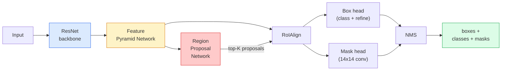

# 实例分割——Mask R-CNN

> 在 Faster R-CNN 检测器上增加一个小型掩码分支，就得到了实例分割。真正困难的部分是 RoIAlign，而且它比看起来更难。

**Type:** 构建 + 学习
**Languages:** Python
**Prerequisites:** 第 4 阶段第 06 课（YOLO）、第 4 阶段第 07 课（U-Net）
**Time:** 约 75 分钟

## 学习目标

- 端到端追踪 Mask R-CNN 架构：骨干网络、FPN、RPN、RoIAlign、边界框头和掩码头
- 从零实现 RoIAlign，并解释 RoIPool 为何已不再使用
- 使用 torchvision 的 `maskrcnn_resnet50_fpn_v2` 预训练模型生成生产级实例掩码，并正确读取其输出格式
- 替换边界框头和掩码头、保持骨干网络冻结，在小型自定义数据集上微调 Mask R-CNN

## 问题所在

语义分割为每个类别生成一个掩码，实例分割则为每个物体生成一个掩码，即使两个物体属于同一类别也会分开。无论是统计个体数量、跨帧追踪，还是测量具体对象，例如墙上的每块砖、显微图像中的每个细胞，都需要实例分割。

Mask R-CNN（He 等，2017）把实例分割重新表述为“目标检测 + 掩码”，从而解决这个问题。设计非常简洁，以至于随后五年几乎每篇实例分割论文都是 Mask R-CNN 的变体；对于中小型数据集，torchvision 实现至今仍是生产环境中的默认选择。

真正困难的工程问题在于采样：怎样从边角无法与像素边界对齐的候选框中，裁剪出固定大小的特征区域？这个步骤稍有偏差，就会在所有地方损失零点几个 mAP。RoIAlign 就是答案。

## 核心概念

### 架构



需要理解五个组成部分：

1. **骨干网络**——在 ImageNet 上训练的 ResNet-50 或 ResNet-101，生成 Stride 分别为 4、8、16、32 的多级特征图。
2. **FPN（特征金字塔网络）**——通过自顶向下路径与横向连接，让每个层级都拥有 C 个富含语义的特征通道。检测时会查询与目标尺寸匹配的 FPN 层级。
3. **RPN（区域候选网络）**——一个小型卷积头，在每个 Anchor 位置预测“这里是否有物体？”以及“应该如何调整边界框？”，每张图像生成约 1000 个候选框。
4. **RoIAlign**——从任意 FPN 层级上的任意边界框中，采样固定大小的特征块，例如 7x7。它使用双线性采样，不进行量化。
5. **Head**——一个双层边界框头，用于细化边界框和选择类别；另有一个小型卷积头，为每个候选框输出一个 `28x28` 二元掩码。

### 为什么使用 RoIAlign，而不是 RoIPool

原始 Fast R-CNN 使用 RoIPool：把候选框拆分成网格，在每个单元中取最大特征，并把所有坐标取整。这种取整会让特征图相对于输入像素坐标偏移最多一个完整的特征图像素；对 224x224 图像看似很小，但在 Stride 为 32 的特征图上会造成灾难。

```
RoIPool:
  box (34.7, 51.3, 98.2, 142.9)
  round -> (34, 51, 98, 142)
  split grid -> round each cell boundary
  misalignment accumulates at every step

RoIAlign:
  box (34.7, 51.3, 98.2, 142.9)
  sample at exact float coordinates using bilinear interpolation
  no rounding anywhere
```

RoIAlign 几乎不增加成本，就能让 COCO 掩码 AP 提高 3–4 个点。如今，所有重视定位精度的检测器都会使用它，包括 YOLOv7 seg、RT-DETR 和 Mask2Former。

### 一段话理解 RPN

在特征图的每个位置放置 K 个大小和形状不同的 Anchor。为每个 Anchor 预测目标存在性分数，以及把它调整成更合适边界框的回归偏移。按分数保留排名最前的约 1,000 个框，以 IoU 0.7 执行 NMS，再把剩余候选框交给后续 Head。RPN 使用自己的小型损失训练——结构与第 6 课的 YOLO 损失相同，只是这里只有物体/无物体两个类别。

### 掩码头

对每个经过 RoIAlign 的候选框，掩码头都是一个微型 FCN：四个 3x3 卷积、一个 2 倍反卷积，再接一个最终 1x1 卷积，输出 `num_classes` 个通道，分辨率为 `28x28`。只保留预测类别对应的通道，其他通道全部忽略。这样可以把掩码预测与分类解耦。

最后把 28x28 掩码上采样到候选框在原图中的像素大小，得到最终二元掩码。

### 损失函数

Mask R-CNN 把四类损失相加：

```
L = L_rpn_cls + L_rpn_box + L_box_cls + L_box_reg + L_mask
```

- `L_rpn_cls`、`L_rpn_box`——RPN 候选框的目标存在性与边界框回归损失。
- `L_box_cls`——分类头在 C+1 个类别（包括背景）上的交叉熵。
- `L_box_reg`——边界框细化使用的平滑 L1。
- `L_mask`——28x28 掩码输出上的逐像素二元交叉熵。

每项损失都有自己的默认权重，torchvision 实现会把它们作为构造参数公开。

### 输出格式

`torchvision.models.detection.maskrcnn_resnet50_fpn_v2` 返回一个字典列表，每张图像对应一个字典：

```
{
    "boxes":  (N, 4) in (x1, y1, x2, y2) pixel coordinates,
    "labels": (N,) class IDs, 0 = background so indices are 1-based,
    "scores": (N,) confidence scores,
    "masks":  (N, 1, H, W) float masks in [0, 1] — threshold at 0.5 for binary,
}
```

返回的掩码已经是完整图像分辨率，28x28 的检测头输出已在内部完成上采样。

```figure
cv3-roialign-sampling
```

## 动手构建

### 第 1 步：从零实现 RoIAlign

Mask R-CNN 的各个组件中，RoIAlign 用代码解释反而比用文字解释更容易理解。

```python
import torch
import torch.nn.functional as F

def roi_align_single(feature, box, output_size=7, spatial_scale=1 / 16.0):
    """
    feature: (C, H, W) single-image feature map
    box: (x1, y1, x2, y2) in original image pixel coordinates
    output_size: side of the output grid (7 for box head, 14 for mask head)
    spatial_scale: reciprocal of the feature map stride
    """
    C, H, W = feature.shape
    x1, y1, x2, y2 = [c * spatial_scale - 0.5 for c in box]
    bin_w = (x2 - x1) / output_size
    bin_h = (y2 - y1) / output_size

    grid_y = torch.linspace(y1 + bin_h / 2, y2 - bin_h / 2, output_size)
    grid_x = torch.linspace(x1 + bin_w / 2, x2 - bin_w / 2, output_size)
    yy, xx = torch.meshgrid(grid_y, grid_x, indexing="ij")

    gx = 2 * (xx + 0.5) / W - 1
    gy = 2 * (yy + 0.5) / H - 1
    grid = torch.stack([gx, gy], dim=-1).unsqueeze(0)
    sampled = F.grid_sample(feature.unsqueeze(0), grid, mode="bilinear",
                            align_corners=False)
    return sampled.squeeze(0)
```

每个数值都来自一个通过双线性插值得到的精确位置，没有取整，没有量化，也没有丢失梯度。

### 第 2 步：与 torchvision 的 RoIAlign 比较

```python
from torchvision.ops import roi_align

feature = torch.randn(1, 16, 50, 50)
boxes = torch.tensor([[0, 10, 20, 100, 90]], dtype=torch.float32)  # (batch_idx, x1, y1, x2, y2)

ours = roi_align_single(feature[0], boxes[0, 1:].tolist(), output_size=7, spatial_scale=1/4)
theirs = roi_align(feature, boxes, output_size=(7, 7), spatial_scale=1/4, sampling_ratio=1, aligned=True)[0]

print(f"shape ours:   {tuple(ours.shape)}")
print(f"shape theirs: {tuple(theirs.shape)}")
print(f"max|diff|:    {(ours - theirs).abs().max().item():.3e}")
```

采用 `sampling_ratio=1` 和 `aligned=True` 时，两者差异应小于 `1e-5`。

### 第 3 步：加载预训练 Mask R-CNN

```python
import torch
from torchvision.models.detection import maskrcnn_resnet50_fpn_v2, MaskRCNN_ResNet50_FPN_V2_Weights

model = maskrcnn_resnet50_fpn_v2(weights=MaskRCNN_ResNet50_FPN_V2_Weights.DEFAULT)
model.eval()
print(f"params: {sum(p.numel() for p in model.parameters()):,}")
print(f"classes (including background): {len(model.roi_heads.box_predictor.cls_score.out_features * [0])}")
```

模型包含 4600 万参数、91 个类别（COCO）。第一个类别 ID 0 是背景，模型真正检测的所有类别都从 ID 1 开始。

### 第 4 步：运行推理

```python
with torch.no_grad():
    x = torch.randn(3, 400, 600)
    predictions = model([x])
p = predictions[0]
print(f"boxes:  {tuple(p['boxes'].shape)}")
print(f"labels: {tuple(p['labels'].shape)}")
print(f"scores: {tuple(p['scores'].shape)}")
print(f"masks:  {tuple(p['masks'].shape)}")
```

掩码张量的形状为 `(N, 1, H, W)`。以 0.5 为阈值，即可为每个物体得到一个二元掩码：

```python
binary_masks = (p['masks'] > 0.5).squeeze(1)  # (N, H, W) boolean
```

### 第 5 步：为自定义类别数量替换 Head

这是常见的微调方案：复用骨干网络、FPN 和 RPN，只替换两个分类 Head。

```python
from torchvision.models.detection.faster_rcnn import FastRCNNPredictor
from torchvision.models.detection.mask_rcnn import MaskRCNNPredictor

def build_custom_maskrcnn(num_classes):
    model = maskrcnn_resnet50_fpn_v2(weights=MaskRCNN_ResNet50_FPN_V2_Weights.DEFAULT)
    in_features = model.roi_heads.box_predictor.cls_score.in_features
    model.roi_heads.box_predictor = FastRCNNPredictor(in_features, num_classes)
    in_features_mask = model.roi_heads.mask_predictor.conv5_mask.in_channels
    hidden_layer = 256
    model.roi_heads.mask_predictor = MaskRCNNPredictor(in_features_mask, hidden_layer, num_classes)
    return model

custom = build_custom_maskrcnn(num_classes=5)
print(f"custom cls_score.out_features: {custom.roi_heads.box_predictor.cls_score.out_features}")
```

`num_classes` 必须包含背景类，因此包含 4 个物体类别的数据集要使用 `num_classes=5`。

### 第 6 步：冻结无需训练的部分

对于小型数据集，应冻结骨干网络和 FPN，只有 RPN 的目标存在性与回归部分以及两个 Head 参与学习。

```python
def freeze_backbone_and_fpn(model):
    # torchvision Mask R-CNN packs the FPN inside `model.backbone` (as
    # `model.backbone.fpn`), so iterating `model.backbone.parameters()` covers
    # both the ResNet feature layers and the FPN lateral/output convs.
    for p in model.backbone.parameters():
        p.requires_grad = False
    return model

custom = freeze_backbone_and_fpn(custom)
trainable = sum(p.numel() for p in custom.parameters() if p.requires_grad)
print(f"trainable after freeze: {trainable:,}")
```

在只有 500 张图像的数据集上，这正是模型能够收敛与过拟合之间的区别。

## 实际应用

torchvision 中完整的 Mask R-CNN 训练循环只有 40 行，而且不同任务之间几乎不需要改变，只需替换数据集即可。

```python
def train_step(model, images, targets, optimizer):
    model.train()
    loss_dict = model(images, targets)
    losses = sum(loss for loss in loss_dict.values())
    optimizer.zero_grad()
    losses.backward()
    optimizer.step()
    return {k: v.item() for k, v in loss_dict.items()}
```

`targets` 列表必须为每张图像提供一个字典，其中包含 `boxes`、`labels` 和 `masks`（形状为 `(num_instances, H, W)` 的二元张量）。训练模式下，模型返回一个包含四项损失的字典；评估模式下，则返回预测列表，具体行为由 `model.training` 决定。

`pycocotools` 评估器会分别为边界框与掩码生成 mAP@IoU=0.5:0.95。只有同时查看两个数，才能判断瓶颈位于边界框头还是掩码头。

## 交付成果

本课会产出：

- `outputs/prompt-instance-vs-semantic-router.md`——通过三个问题在实例分割、语义分割和全景分割之间作出选择，并给出具体起始模型。
- `outputs/skill-mask-rcnn-head-swapper.md`——给定新的 `num_classes` 后，生成适用于任意 torchvision 检测模型的 10 行 Head 替换代码。

## 练习

1. **（简单）** 在 100 个随机边界框上，将你的 RoIAlign 与 `torchvision.ops.roi_align` 比较，并报告最大绝对差。还要运行 RoIPool，也就是 2017 年以前的行为，证明它在靠近边缘的框上会偏离约 1–2 个特征图像素。
2. **（中等）** 在包含 50 张图像的自定义数据集上微调 `maskrcnn_resnet50_fpn_v2`，任选两个类别，例如气球、鱼、坑洞或徽标。冻结骨干网络，训练 20 个 epoch，并报告 mask AP@0.5。
3. **（困难）** 替换 Mask R-CNN 的掩码头，使其输出 56x56 而不是 28x28。比较修改前后的 mAP@IoU=0.75，并解释提升或没有提升为何符合预期的边界精度—内存权衡。

## 关键术语

| 术语 | 人们常说 | 实际含义 |
|------|----------------|----------------------|
| Mask R-CNN | “检测加掩码” | Faster R-CNN 加上一个小型 FCN Head，为每个候选框、每个类别预测一个 28x28 掩码 |
| FPN | “特征金字塔” | 通过自顶向下与横向连接，为每个 Stride 层级提供 C 个富含语义的特征通道 |
| RPN | “区域候选器” | 一个小型卷积头，每张图像生成约 1000 个物体/无物体候选框 |
| RoIAlign | “不取整的裁剪” | 使用双线性插值，从任意浮点坐标边界框中采样固定大小的特征网格 |
| RoIPool | “2017 年以前的裁剪” | 与 RoIAlign 目的相同，但会对边界框坐标取整，现已淘汰 |
| Mask AP | “实例 mAP” | 使用掩码 IoU 而不是边界框 IoU 计算的平均精度，是 COCO 实例分割指标 |
| 二元掩码头 | “逐类别掩码” | 为每个候选框的每个类别预测一个二元掩码，只保留预测类别对应的通道 |
| 背景类别 | “类别 0” | 表示“没有物体”的兜底类别，真实类别索引从 1 开始 |

## 延伸阅读

- [《Mask R-CNN》（He 等，2017）](https://arxiv.org/abs/1703.06870)——原始论文，其中关于 RoIAlign 的第 3 节是必读内容
- [《FPN: Feature Pyramid Networks》（Lin 等，2017）](https://arxiv.org/abs/1612.03144)——FPN 原始论文，每个现代检测器都会使用它
- [torchvision Mask R-CNN 教程](https://pytorch.org/tutorials/intermediate/torchvision_tutorial.html)——微调循环的参考实现
- [Detectron2 模型库](https://github.com/facebookresearch/detectron2/blob/main/MODEL_ZOO.md)——几乎所有检测与分割变体的生产级实现和训练权重
