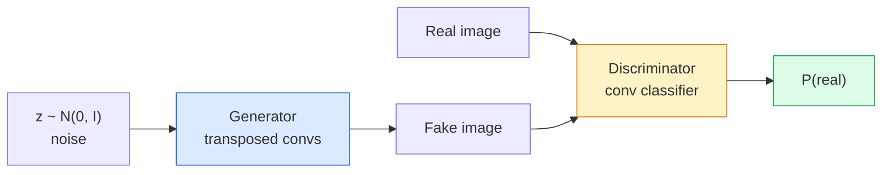
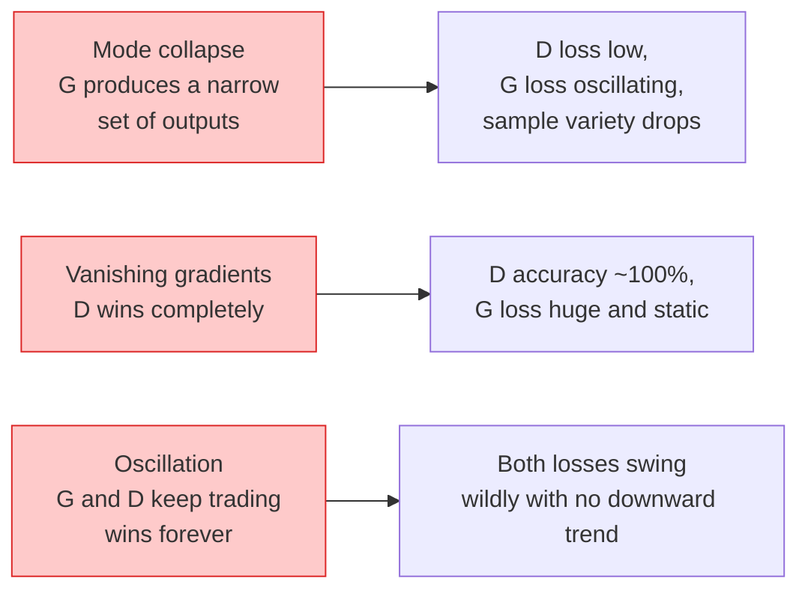

# 图像生成——GAN

> GAN 是两个神经网络之间的一场固定博弈。一个负责作画，一个负责批评。它们在对抗中共同进步，直到生成的图像足以骗过批评者。

**Type:** 构建
**Languages:** Python
**Prerequisites:** 第 4 阶段第 03 课（CNN）、第 3 阶段第 06 课（优化器）、第 3 阶段第 07 课（正则化）
**Time:** 约 75 分钟

## 学习目标

- 解释生成器与判别器之间的极小极大博弈，以及均衡状态为何对应 p_model = p_data
- 使用 PyTorch 实现 DCGAN，用不超过 60 行代码生成连贯的 32x32 合成图像
- 使用三种标准技巧稳定 GAN 训练：非饱和损失、谱归一化、TTUR（双时间尺度更新规则）
- 阅读训练曲线，区分健康收敛、模式坍缩、振荡和判别器完全获胜等状态

## 问题所在

分类教网络把图像映射到标签，生成则把这个问题反过来：采样出看起来像来自同一分布的新图像。你没有一个可以逐项求差的“正确”输出，只有一个希望模仿的分布。

标准损失函数（MSE、交叉熵）无法衡量“这个样本是否来自真实分布”。最小化逐像素误差只会产生模糊的平均图像，而不是真实样本。突破来自让模型自己学习损失：训练第二个网络，让它负责区分真实与伪造，再用它的判断推动生成器改进。

GAN（Goodfellow 等，2014）定义了这套框架。到 2018 年，StyleGAN 已经能生成与照片难以区分的 1024x1024 人脸。后来扩散模型在质量和可控性上取而代之，但让扩散模型真正可用的每一种技巧——归一化选择、潜在空间和特征损失——都最先在 GAN 上得到理解。

## 核心概念

### 两个网络



**生成器** G 接收噪声向量 `z` 并输出图像。**判别器** D 接收图像并输出一个标量，表示该图像为真实图像的概率。

### 这场博弈

G 希望 D 判断错误，D 则希望判断正确。形式化表示如下：

```
min_G max_D  E_x[log D(x)] + E_z[log(1 - D(G(z)))]
```

从右向左理解：D 希望在真实图像（`log D(real)`）和伪造图像（`log (1 - D(fake))`）上最大化准确性。G 则希望最小化 D 在伪造图像上的准确性，也就是希望 `D(G(z))` 尽可能高。

Goodfellow 证明，这个极小极大问题存在一个全局均衡点：`p_G = p_data`，D 在所有位置都输出 0.5，生成分布与真实分布之间的 Jensen-Shannon 散度为零。真正困难的是如何抵达这个均衡点。

### 非饱和损失

上面的形式在数值上不稳定。训练初期，每个伪造样本的 `D(G(z))` 都接近零，因此 `log(1 - D(G(z)))` 对 G 的梯度会消失。解决方法是反转 G 的损失：

```
L_D = -E_x[log D(x)] - E_z[log(1 - D(G(z)))]
L_G = -E_z[log D(G(z))]                          # non-saturating
```

这样一来，当 `D(G(z))` 接近零时，G 的损失很大，梯度也包含有效信息。所有现代 GAN 都使用这一变体训练。

### DCGAN 架构规则

Radford、Metz 与 Chintala（2015）把多年的失败实验提炼成五条让 GAN 稳定训练的规则：

1. 在两个网络中都用带步幅卷积替代池化。
2. 生成器和判别器都使用批归一化，但生成器输出层和判别器输入层除外。
3. 在更深架构中移除全连接层。
4. G 的所有层都使用 ReLU，只有输出层使用 Tanh，把结果限制在 [-1, 1]。
5. D 的所有层都使用 LeakyReLU（negative_slope=0.2）。

每一种现代卷积 GAN（StyleGAN、BigGAN、GigaGAN）至今仍从这些规则出发，再逐项替换其中的组件。

### 失败模式及其特征



- **模式坍缩：** G 找到一张能够骗过 D 的图像，于是只生成这一种结果。修复方法包括小批次判别、谱归一化或标签条件化。
- **判别器获胜：** D 过早变得太强，G 的梯度消失。可以缩小 D、降低 D 的学习率，或对真实标签使用标签平滑。
- **振荡：** 两个网络不断轮流获胜，却始终无法靠近均衡点。可以使用 TTUR，让 D 的学习速度比 G 快 2–4 倍，或改用 Wasserstein 损失。

### 评估

GAN 没有真实目标输出，那么如何判断它是否有效？

- **检查样本**——每个 epoch 结束时直接查看 64 个样本，这是不可省略的步骤。
- **FID（Fréchet Inception Distance）**——衡量真实集合与生成集合在 Inception-v3 特征分布上的距离。越低越好，是社区标准。
- **Inception Score**——较老也更脆弱，优先使用 FID。
- **生成模型的精确率/召回率**——分别衡量质量（精确率）和覆盖度（召回率），比单独使用 FID 更有信息量。

对于小规模合成数据实验，直接检查样本已经足够。

```figure
cv-gan-image
```

## 动手构建

### 第 1 步：生成器

下面是一个小型 DCGAN 生成器，接收 64 维噪声并生成 32x32 图像。

```python
import torch
import torch.nn as nn

class Generator(nn.Module):
    def __init__(self, z_dim=64, img_channels=3, feat=64):
        super().__init__()
        self.net = nn.Sequential(
            nn.ConvTranspose2d(z_dim, feat * 4, kernel_size=4, stride=1, padding=0, bias=False),
            nn.BatchNorm2d(feat * 4),
            nn.ReLU(inplace=True),
            nn.ConvTranspose2d(feat * 4, feat * 2, kernel_size=4, stride=2, padding=1, bias=False),
            nn.BatchNorm2d(feat * 2),
            nn.ReLU(inplace=True),
            nn.ConvTranspose2d(feat * 2, feat, kernel_size=4, stride=2, padding=1, bias=False),
            nn.BatchNorm2d(feat),
            nn.ReLU(inplace=True),
            nn.ConvTranspose2d(feat, img_channels, kernel_size=4, stride=2, padding=1, bias=False),
            nn.Tanh(),
        )

    def forward(self, z):
        return self.net(z.view(z.size(0), -1, 1, 1))
```

四个转置卷积都使用 `kernel_size=4, stride=2, padding=1`，从而恰好把空间尺寸翻倍。输出通过 Tanh 限制在 [-1, 1]。

### 第 2 步：判别器

它与生成器镜像对应，使用 LeakyReLU 和带步幅卷积，最终输出一个标量 Logit。

```python
class Discriminator(nn.Module):
    def __init__(self, img_channels=3, feat=64):
        super().__init__()
        self.net = nn.Sequential(
            nn.Conv2d(img_channels, feat, kernel_size=4, stride=2, padding=1),
            nn.LeakyReLU(0.2, inplace=True),
            nn.Conv2d(feat, feat * 2, kernel_size=4, stride=2, padding=1, bias=False),
            nn.BatchNorm2d(feat * 2),
            nn.LeakyReLU(0.2, inplace=True),
            nn.Conv2d(feat * 2, feat * 4, kernel_size=4, stride=2, padding=1, bias=False),
            nn.BatchNorm2d(feat * 4),
            nn.LeakyReLU(0.2, inplace=True),
            nn.Conv2d(feat * 4, 1, kernel_size=4, stride=1, padding=0),
        )

    def forward(self, x):
        return self.net(x).view(-1)
```

最后一个卷积把 `4x4` 特征图缩小成 `1x1`。每张图像输出一个标量，只在计算损失时应用 Sigmoid。

### 第 3 步：训练步骤

每个批次交替执行：先更新一次 D，再更新一次 G。

```python
import torch.nn.functional as F

def train_step(G, D, real, z, opt_g, opt_d, device):
    real = real.to(device)
    bs = real.size(0)

    # D step
    opt_d.zero_grad()
    d_real = D(real)
    d_fake = D(G(z).detach())
    loss_d = (F.binary_cross_entropy_with_logits(d_real, torch.ones_like(d_real))
              + F.binary_cross_entropy_with_logits(d_fake, torch.zeros_like(d_fake)))
    loss_d.backward()
    opt_d.step()

    # G step
    opt_g.zero_grad()
    d_fake = D(G(z))
    loss_g = F.binary_cross_entropy_with_logits(d_fake, torch.ones_like(d_fake))
    loss_g.backward()
    opt_g.step()

    return loss_d.item(), loss_g.item()
```

D 更新中的 `G(z).detach()` 至关重要：更新 D 时不希望梯度流入 G。忘记这一点是初学者最典型的错误。

### 第 4 步：在合成形状数据上执行完整训练循环

```python
from torch.utils.data import DataLoader, TensorDataset
import numpy as np

def synthetic_images(num=2000, size=32, seed=0):
    rng = np.random.default_rng(seed)
    imgs = np.zeros((num, 3, size, size), dtype=np.float32) - 1.0
    for i in range(num):
        r = rng.uniform(6, 12)
        cx, cy = rng.uniform(r, size - r, size=2)
        yy, xx = np.meshgrid(np.arange(size), np.arange(size), indexing="ij")
        mask = (xx - cx) ** 2 + (yy - cy) ** 2 < r ** 2
        color = rng.uniform(-0.5, 1.0, size=3)
        for c in range(3):
            imgs[i, c][mask] = color[c]
    return torch.from_numpy(imgs)

device = "cuda" if torch.cuda.is_available() else "cpu"
data = synthetic_images()
loader = DataLoader(TensorDataset(data), batch_size=64, shuffle=True)

G = Generator(z_dim=64, img_channels=3, feat=32).to(device)
D = Discriminator(img_channels=3, feat=32).to(device)
opt_g = torch.optim.Adam(G.parameters(), lr=2e-4, betas=(0.5, 0.999))
opt_d = torch.optim.Adam(D.parameters(), lr=2e-4, betas=(0.5, 0.999))

for epoch in range(10):
    for (batch,) in loader:
        z = torch.randn(batch.size(0), 64, device=device)
        ld, lg = train_step(G, D, batch, z, opt_g, opt_d, device)
    print(f"epoch {epoch}  D {ld:.3f}  G {lg:.3f}")
```

`Adam(lr=2e-4, betas=(0.5, 0.999))` 是 DCGAN 的默认配置。较低的 beta1 可以避免动量项让对抗博弈变得过于稳定。

### 第 5 步：采样

```python
@torch.no_grad()
def sample(G, n=16, z_dim=64, device="cpu"):
    G.eval()
    z = torch.randn(n, z_dim, device=device)
    imgs = G(z)
    imgs = (imgs + 1) / 2
    return imgs.clamp(0, 1)
```

采样前必须切换到评估模式。对 DCGAN 而言，这一点很重要，因为模型应使用 BatchNorm 的移动统计量，而不是当前批次的统计量。

### 第 6 步：谱归一化

这是判别器中 BN 的即插即用替代方案，能够保证网络满足 1-Lipschitz 条件，并修复大多数“D 过强”的失败情况。

```python
from torch.nn.utils import spectral_norm

def build_sn_discriminator(img_channels=3, feat=64):
    return nn.Sequential(
        spectral_norm(nn.Conv2d(img_channels, feat, 4, 2, 1)),
        nn.LeakyReLU(0.2, inplace=True),
        spectral_norm(nn.Conv2d(feat, feat * 2, 4, 2, 1)),
        nn.LeakyReLU(0.2, inplace=True),
        spectral_norm(nn.Conv2d(feat * 2, feat * 4, 4, 2, 1)),
        nn.LeakyReLU(0.2, inplace=True),
        spectral_norm(nn.Conv2d(feat * 4, 1, 4, 1, 0)),
    )
```

把 `Discriminator` 换成 `build_sn_discriminator()` 后，通常不再需要 TTUR 技巧。谱归一化是最容易应用的单项稳健性升级。

## 实际应用

严肃的生成任务应使用预训练权重，或者切换到扩散模型。两个常用库如下：

- `torch_fidelity` 可以直接为生成器计算 FID / IS，无需编写自定义评估代码。
- `pytorch-gan-zoo`（旧项目）和 `StudioGAN` 提供经过测试的 DCGAN、WGAN-GP、SN-GAN、StyleGAN 与 BigGAN 实现。

到了 2026 年，GAN 仍然最适合以下任务：实时图像生成（延迟小于 10 ms）、风格迁移，以及需要精确控制的图像到图像转换（Pix2Pix、CycleGAN）。扩散模型则在照片真实感和文本条件控制方面占优。

## 交付成果

本课会产出：

- `outputs/prompt-gan-training-triage.md`——读取训练曲线描述，判断失败模式（模式坍缩、D 获胜、振荡），并给出最值得采用的一项修复。
- `outputs/skill-dcgan-scaffold.md`——根据 `z_dim`、目标 `image_size` 和 `num_channels` 生成 DCGAN 脚手架，包括训练循环和样本保存器。

## 练习

1. **（简单）** 在合成圆形数据集上训练上面的 DCGAN，每个 epoch 结束时保存由 16 个样本组成的网格。到第几个 epoch 时，生成的圆开始明显呈圆形？
2. **（中等）** 用谱归一化替换判别器中的 BatchNorm，并排训练两个版本。哪一个收敛更快？在三个随机种子上的方差哪一个更低？
3. **（困难）** 实现条件 DCGAN：把类别标签同时送入 G 和 D，在 G 中把独热向量拼接到噪声，在 D 中拼接一个类别嵌入通道。在第 7 课的合成“圆形与方形”数据集上训练，并通过指定标签采样证明类别条件有效。

## 关键术语

| 术语 | 人们常说 | 实际含义 |
|------|----------------|----------------------|
| 生成器（G） | “负责画画的网络” | 把噪声映射为图像，并通过训练来欺骗判别器 |
| 判别器（D） | “批评者” | 用于区分真实图像与生成图像的二分类器 |
| 极小极大 | “这场博弈” | G 最小化、D 最大化的对抗损失；均衡状态为 p_G = p_data |
| 非饱和损失 | “数值合理的版本” | G 使用 -log(D(G(z)))，而不是 log(1 - D(G(z)))，以避免训练初期梯度消失 |
| 模式坍缩 | “生成器只生成一种东西” | G 只产生数据分布中的一小部分；可使用谱归一化、小批次判别或更大批次修复 |
| TTUR | “两个学习率” | D 通常以 G 的 2–4 倍速度学习，用来稳定训练 |
| 谱归一化 | “1-Lipschitz 层” | 约束每层 Lipschitz 常数的权重归一化，防止 D 的变化变得任意陡峭 |
| FID | “Fréchet Inception Distance” | 真实样本与生成样本在 Inception-v3 特征分布上的距离，是标准评估指标 |

## 延伸阅读

- [《Generative Adversarial Networks》（Goodfellow 等，2014）](https://arxiv.org/abs/1406.2661)——开启 GAN 领域的论文
- [《DCGAN》（Radford、Metz、Chintala，2015）](https://arxiv.org/abs/1511.06434)——让 GAN 能够稳定训练的架构规则
- [《Spectral Normalization for GANs》（Miyato 等，2018）](https://arxiv.org/abs/1802.05957)——最实用的单项稳定化技巧
- [《StyleGAN3》（Karras 等，2021）](https://arxiv.org/abs/2106.12423)——顶尖 GAN 工作，读起来像过去十年各种技巧的精选合集
