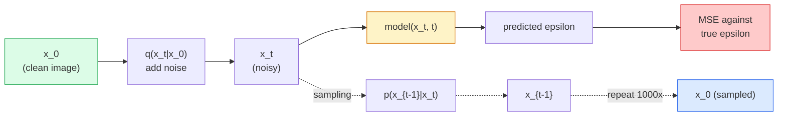

# 图像生成——扩散模型

> 扩散模型学习的是去噪。训练它从含噪图像中移除一小部分噪声，再把这个过程反向重复一千次，就得到了一台图像生成器。

**Type:** 构建
**Languages:** Python
**Prerequisites:** 第 4 阶段第 07 课（U-Net）、第 1 阶段第 06 课（概率）、第 3 阶段第 06 课（优化器）
**Time:** 约 75 分钟

## 学习目标

- 推导前向加噪过程 `x_0 -> x_1 -> ... -> x_T`，并解释闭式表达 `q(x_t | x_0)` 为何对任意 t 都成立
- 实现 DDPM 风格训练目标，对每一步加入的噪声进行回归，并实现从纯噪声逐步还原图像的采样器
- 构建一个足够小、可以在 CPU 上训练的时间条件 U-Net，为任意时间步预测噪声
- 解释 DDPM 与 DDIM 采样的区别及其适用场景（第 23 课会深入介绍流匹配与整流流）

## 问题所在

GAN 一次性完成生成：输入噪声，一次前向传播后输出图像。它速度快，却很难训练。扩散模型则迭代生成：从纯噪声开始，通过许多小步骤逐渐去噪，图像由此显现。它速度慢，却容易训练。过去五年，后一个优点占据了主导地位：任何小团队都可以训练扩散模型并得到合理样本，而稳定训练 GAN 往往要经历多年失败才能掌握。

除了训练稳定性，扩散模型的迭代结构还解锁了现代图像生成中的一切能力：文本条件、图像修补、图像编辑、超分辨率和可控风格。采样循环的每一步都是注入新约束的机会。正因为存在这个挂载点，Stable Diffusion、Imagen、DALL-E 3、Midjourney 以及你会使用的每个可控图像模型都建立在扩散之上。

本课会构建最小 DDPM：前向加噪、反向去噪和训练循环。下一课 Stable Diffusion 会把它与 VAE、文本编码器和无分类器引导连接成生产系统。

## 核心概念

### 前向过程

取一张图像 `x_0`，加入少量高斯噪声得到 `x_1`，再加入少量噪声得到 `x_2`。持续 T 步，直到 `x_T` 与纯高斯噪声几乎无法区分。

```
q(x_t | x_{t-1}) = N(x_t; sqrt(1 - beta_t) * x_{t-1},  beta_t * I)
```

`beta_t` 是一个很小的方差调度，典型设置是在 T=1000 步内从 0.0001 线性增长到 0.02。每一步都会轻微缩小信号，并注入新的噪声。

### 闭式跳转

逐步加噪是一个马尔可夫链，但数学关系可以折叠：可以一步直接采样 `x_t`，而它只依赖 `x_0`，无需逐步模拟。

```
Define alpha_t = 1 - beta_t
Define alpha_bar_t = prod_{s=1..t} alpha_s

Then:
  q(x_t | x_0) = N(x_t; sqrt(alpha_bar_t) * x_0,  (1 - alpha_bar_t) * I)

Equivalently:
  x_t = sqrt(alpha_bar_t) * x_0 + sqrt(1 - alpha_bar_t) * epsilon
  where epsilon ~ N(0, I)
```

这一条方程正是扩散模型能够实际训练的全部原因。训练时随机选择一个 `t`，直接采样 `x_t`，它来自 `x_0`，然后用一步完成训练，无需模拟完整马尔可夫链。

### 反向过程

前向过程是固定的，需要由神经网络学习的是反向过程 `p(x_{t-1} | x_t)`。扩散模型不会直接预测 `x_{t-1}`，而是预测第 t 步加入的噪声 `epsilon`，再由数学公式从中推导 `x_{t-1}`。



### 训练损失

每个训练步骤执行：

1. 采样一张真实图像 `x_0`。
2. 从 [1, T] 中均匀采样一个时间步 `t`。
3. 采样噪声 `epsilon ~ N(0, I)`。
4. 计算 `x_t = sqrt(alpha_bar_t) * x_0 + sqrt(1 - alpha_bar_t) * epsilon`。
5. 使用网络预测 `epsilon_theta(x_t, t)`。
6. 最小化 `|| epsilon - epsilon_theta(x_t, t) ||^2`。

仅此而已。神经网络学习预测任意时间步上的噪声，损失就是 MSE。没有对抗博弈，不会模式坍缩，也没有双方振荡。

### 采样器（DDPM）

生成时，从 `x_T ~ N(0, I)` 开始，每次向后走一步。

```
for t = T, T-1, ..., 1:
    eps = model(x_t, t)
    x_{t-1} = (1 / sqrt(alpha_t)) * (x_t - (beta_t / sqrt(1 - alpha_bar_t)) * eps) + sqrt(beta_t) * z
    where z ~ N(0, I) if t > 1, else 0
return x_0
```

关键在于，尽管一般情况下反向条件分布没有闭式解，但对这个特定的高斯前向过程却存在闭式解。看起来复杂的系数，就是贝叶斯法则推导出的结果。

### 为什么需要 1000 步

前向噪声调度会让每一步只添加很少的噪声，使对应的反向步骤近似高斯。步骤太少时，反向条件分布与高斯相差太大，网络很难建模；步骤太多则会增加采样成本，却只能带来递减收益。采用线性调度的 T=1000 是 DDPM 默认值。

### DDIM：采样速度提高 20 倍

训练过程不变，只改变采样。DDIM（Song 等，2020）定义了一种确定性反向过程，可以跳过时间步，而无需重新训练。DDIM 只用 50 步采样，就能得到接近 DDPM 1000 步的质量。每个生产系统都会使用 DDIM 或速度更快的变体，例如 DPM-Solver 和 Euler ancestral。

### 时间条件

网络 `epsilon_theta(x_t, t)` 必须知道自己正在处理哪个时间步。现代扩散模型会通过正弦时间嵌入注入 `t`，思路与 Transformer 的位置编码相同，并把结果加入 U-Net 每个层级的特征图。

```
t_embedding = sinusoidal(t)
feature_map += MLP(t_embedding)
```

如果没有时间条件，网络就必须根据图像本身猜测噪声水平；这虽然也能工作，但样本效率会低得多。

```figure
cv-diffusion-image
```

## 动手构建

### 第 1 步：噪声调度

```python
import torch

def linear_beta_schedule(T=1000, beta_start=1e-4, beta_end=2e-2):
    return torch.linspace(beta_start, beta_end, T)


def precompute_schedule(betas):
    alphas = 1.0 - betas
    alphas_cumprod = torch.cumprod(alphas, dim=0)
    return {
        "betas": betas,
        "alphas": alphas,
        "alphas_cumprod": alphas_cumprod,
        "sqrt_alphas_cumprod": torch.sqrt(alphas_cumprod),
        "sqrt_one_minus_alphas_cumprod": torch.sqrt(1.0 - alphas_cumprod),
        "sqrt_recip_alphas": torch.sqrt(1.0 / alphas),
    }

schedule = precompute_schedule(linear_beta_schedule(T=1000))
```

只需预计算一次，训练和采样时按索引读取。

### 第 2 步：前向扩散（q_sample）

```python
def q_sample(x0, t, noise, schedule):
    sqrt_a = schedule["sqrt_alphas_cumprod"][t].view(-1, 1, 1, 1)
    sqrt_one_minus_a = schedule["sqrt_one_minus_alphas_cumprod"][t].view(-1, 1, 1, 1)
    return sqrt_a * x0 + sqrt_one_minus_a * noise
```

这就是单行闭式解。`t` 是一批时间步，批次中的每张图像对应一个。

### 第 3 步：微型时间条件 U-Net

```python
import torch.nn as nn
import torch.nn.functional as F
import math

def timestep_embedding(t, dim=64):
    half = dim // 2
    freqs = torch.exp(-math.log(10000) * torch.arange(half, device=t.device) / half)
    args = t[:, None].float() * freqs[None]
    emb = torch.cat([args.sin(), args.cos()], dim=-1)
    return emb


class TinyUNet(nn.Module):
    def __init__(self, img_channels=3, base=32, t_dim=64):
        super().__init__()
        self.t_mlp = nn.Sequential(
            nn.Linear(t_dim, base * 4),
            nn.SiLU(),
            nn.Linear(base * 4, base * 4),
        )
        self.t_dim = t_dim
        self.enc1 = nn.Conv2d(img_channels, base, 3, padding=1)
        self.enc2 = nn.Conv2d(base, base * 2, 4, stride=2, padding=1)
        self.mid = nn.Conv2d(base * 2, base * 2, 3, padding=1)
        self.dec1 = nn.ConvTranspose2d(base * 2, base, 4, stride=2, padding=1)
        self.dec2 = nn.Conv2d(base * 2, img_channels, 3, padding=1)
        self.time_proj = nn.Linear(base * 4, base * 2)

    def forward(self, x, t):
        t_emb = timestep_embedding(t, self.t_dim)
        t_emb = self.t_mlp(t_emb)
        t_proj = self.time_proj(t_emb)[:, :, None, None]

        h1 = F.silu(self.enc1(x))
        h2 = F.silu(self.enc2(h1)) + t_proj
        h3 = F.silu(self.mid(h2))
        d1 = F.silu(self.dec1(h3))
        d2 = torch.cat([d1, h1], dim=1)
        return self.dec2(d2)
```

这是一个两层 U-Net，并在瓶颈位置注入时间条件。处理真实图像时，应增大深度与宽度。

### 第 4 步：训练循环

```python
def train_step(model, x0, schedule, optimizer, device, T=1000):
    model.train()
    x0 = x0.to(device)
    bs = x0.size(0)
    t = torch.randint(0, T, (bs,), device=device)
    noise = torch.randn_like(x0)
    x_t = q_sample(x0, t, noise, schedule)
    pred = model(x_t, t)
    loss = F.mse_loss(pred, noise)
    optimizer.zero_grad()
    loss.backward()
    optimizer.step()
    return loss.item()
```

这就是完整训练循环：没有 GAN 博弈，没有特殊损失，只有一次 MSE 调用。

### 第 5 步：采样器（DDPM）

```python
@torch.no_grad()
def sample(model, schedule, shape, T=1000, device="cpu"):
    model.eval()
    x = torch.randn(shape, device=device)
    betas = schedule["betas"].to(device)
    sqrt_one_minus_a = schedule["sqrt_one_minus_alphas_cumprod"].to(device)
    sqrt_recip_alphas = schedule["sqrt_recip_alphas"].to(device)

    for t in reversed(range(T)):
        t_batch = torch.full((shape[0],), t, dtype=torch.long, device=device)
        eps = model(x, t_batch)
        coef = betas[t] / sqrt_one_minus_a[t]
        mean = sqrt_recip_alphas[t] * (x - coef * eps)
        if t > 0:
            x = mean + torch.sqrt(betas[t]) * torch.randn_like(x)
        else:
            x = mean
    return x
```

生成一批样本需要执行 1000 次前向传播。真实代码中应换用只需 50 步的 DDIM 采样器。

### 第 6 步：DDIM 采样器（确定性，约快 20 倍）

```python
@torch.no_grad()
def sample_ddim(model, schedule, shape, steps=50, T=1000, device="cpu", eta=0.0):
    model.eval()
    x = torch.randn(shape, device=device)
    alphas_cumprod = schedule["alphas_cumprod"].to(device)

    ts = torch.linspace(T - 1, 0, steps + 1).long()
    for i in range(steps):
        t = ts[i]
        t_prev = ts[i + 1]
        t_batch = torch.full((shape[0],), t, dtype=torch.long, device=device)
        eps = model(x, t_batch)
        a_t = alphas_cumprod[t]
        a_prev = alphas_cumprod[t_prev] if t_prev >= 0 else torch.tensor(1.0, device=device)
        x0_pred = (x - torch.sqrt(1 - a_t) * eps) / torch.sqrt(a_t)
        sigma = eta * torch.sqrt((1 - a_prev) / (1 - a_t) * (1 - a_t / a_prev))
        dir_xt = torch.sqrt(1 - a_prev - sigma ** 2) * eps
        noise = sigma * torch.randn_like(x) if eta > 0 else 0
        x = torch.sqrt(a_prev) * x0_pred + dir_xt + noise
    return x
```

`eta=0` 表示完全确定：相同噪声输入始终生成相同输出；`eta=1` 则会恢复 DDPM。

## 实际应用

生产工作应使用 `diffusers`：

```python
from diffusers import DDPMScheduler, UNet2DModel

unet = UNet2DModel(sample_size=32, in_channels=3, out_channels=3, layers_per_block=2)
scheduler = DDPMScheduler(num_train_timesteps=1000)
```

这个库提供现成的调度器（DDPM、DDIM、DPM-Solver、Euler、Heun）、可配置 U-Net、文生图与图生图流水线，以及 LoRA 微调辅助工具。

研究工作可使用 Katherine Crowson 的 `k-diffusion`，其中包含最忠于论文的参考实现和最优秀的采样变体。

## 交付成果

本课会产出：

- `outputs/prompt-diffusion-sampler-picker.md`——根据质量目标、延迟预算和条件类型，在 DDPM / DDIM / DPM-Solver / Euler 中选择采样器的提示词。
- `outputs/skill-noise-schedule-designer.md`——给定 T 和目标损坏程度后，生成线性、余弦或 Sigmoid beta 调度，并附带信噪比随时间变化的诊断图。

## 练习

1. **（简单）** 可视化前向过程：取一张图像，绘制 `x_t`，其中 `t in [0, 100, 250, 500, 750, 1000]`，验证 `x_1000` 看起来像纯高斯噪声。
2. **（中等）** 在合成圆形数据集上训练 TinyUNet 20 个 epoch，并采样 16 个圆形。比较 DDPM（1000 步）与 DDIM（50 步）采样——从相同噪声种子出发，它们是否生成相似图像？
3. **（困难）** 实现余弦噪声调度（Nichol 与 Dhariwal，2021）：`alpha_bar_t = cos^2((t/T + s) / (1 + s) * pi / 2)`。使用线性调度和余弦调度分别训练相同模型，并证明在较少采样步数下，余弦调度能生成更好的样本。

## 关键术语

| 术语 | 人们常说 | 实际含义 |
|------|----------------|----------------------|
| 前向过程 | “随时间加入噪声” | 在 T 步中把图像损坏为高斯噪声的固定马尔可夫链 |
| 反向过程 | “逐步去噪” | 从噪声逐步返回图像的已学习分布 |
| Epsilon 预测 | “预测噪声” | 训练目标：`epsilon_theta(x_t, t)` 预测第 t 步加入的噪声 |
| Beta 调度 | “噪声量” | 由 T 个小方差组成的序列，定义每一步加入多少噪声 |
| alpha_bar_t | “累计保留因子” | 截至时间 t 的 (1 - beta_s) 乘积；t 越大，剩余信号越少 |
| DDPM 采样器 | “祖先式、随机” | 从条件高斯分布中采样每个 x_{t-1}，共需 1000 步 |
| DDIM 采样器 | “确定性、快速” | 把采样改写成确定性 ODE，以 20–100 步达到相近质量 |
| 时间条件 | “告诉模型当前 t” | 注入 U-Net 的 t 正弦嵌入，让模型知道噪声水平 |

## 延伸阅读

- [《Denoising Diffusion Probabilistic Models》（Ho 等，2020）](https://arxiv.org/abs/2006.11239)——让扩散模型真正可用并在 FID 上击败 GAN 的论文
- [《Improved DDPM》（Nichol 与 Dhariwal，2021）](https://arxiv.org/abs/2102.09672)——余弦调度与 v 参数化
- [《DDIM》（Song、Meng、Ermon，2020）](https://arxiv.org/abs/2010.02502)——让实时推理成为可能的确定性采样器
- [《Elucidating the Design Space of Diffusion》（Karras 等，2022）](https://arxiv.org/abs/2206.00364)——统一理解各种扩散设计选择，是当前最佳参考资料
