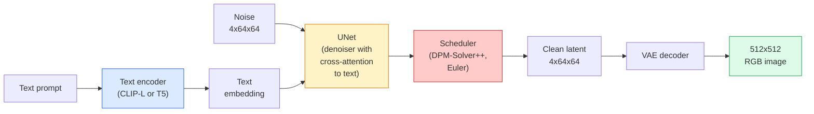

# Stable Diffusion：架构与微调

> Stable Diffusion 是一种在预训练 VAE 的潜在空间中运行的 DDPM，通过交叉注意力接受文本条件，使用快速确定性 ODE 求解器采样，并由无分类器引导控制方向。

**Type:** 学习 + 使用
**Languages:** Python
**Prerequisites:** 第 4 阶段第 10 课（扩散）、第 7 阶段第 02 课（自注意力）
**Time:** 约 75 分钟

## 学习目标

- 追踪 Stable Diffusion 流水线的五个组成部分：VAE、文本编码器、U-Net、调度器、安全检查器，并说明每一部分的实际作用
- 解释潜在扩散，以及为什么在 4x64x64 潜在空间，而不是 3x512x512 图像空间中训练，可以在不损失质量的情况下把计算量降低 48 倍
- 使用 `diffusers` 生成图像，并执行图生图、图像修补和 ControlNet 引导生成
- 使用 LoRA 在小型自定义数据集上微调 Stable Diffusion，并在推理时加载 LoRA 适配器

## 问题所在

直接在 512x512 RGB 图像上训练 DDPM 成本高昂。每个训练步骤都要通过一个接收 3x512x512 = 786,432 个输入值的 U-Net 反向传播；采样则要让同一个 U-Net 前向运行 50 次以上。若要达到 Stable Diffusion 1.5（2022 年发布）的质量，像素空间扩散大约需要 256 个 GPU 月的训练，而且在消费级 GPU 上每张图像需要 10–30 秒。

让开放权重文生图成为现实的诀窍是**潜在扩散**（Rombach 等，CVPR 2022）。先训练一个 VAE，把 3x512x512 图像映射到 4x64x64 潜在张量并能反向恢复，再在潜在空间中执行扩散。计算量会下降 `(3*512*512)/(4*64*64) = 48x`，在同一张 GPU 上，采样也会从数十秒缩短到两秒以内。

几乎每一种现代图像生成模型——SDXL、SD3、FLUX、HunyuanDiT、Wan-Video——都是潜在扩散模型，只是在自编码器、去噪器（U-Net 或 DiT）和文本条件方式上有所不同。学会 Stable Diffusion，也就掌握了这一类模型的模板。

## 核心概念

### 流水线



- **VAE**——冻结的自编码器。编码器把图像转换为潜变量，用于图生图和训练；解码器把潜变量还原为图像。
- **文本编码器**——SD 1.x/2.x 使用 CLIP 文本编码器，SDXL 使用 CLIP-L + CLIP-G，SD3/FLUX 使用 T5-XXL。它会生成一串 token 嵌入。
- **U-Net**——去噪器。在每个分辨率层级都包含交叉注意力层，让潜变量关注文本嵌入。
- **调度器**——采样算法，例如 DDIM、Euler、DPM-Solver++。它选择 sigma，并把预测噪声逐步混合回潜变量。
- **安全检查器**——可选的 NSFW / 非法内容输出图像过滤器。

### 无分类器引导（CFG）

普通文本条件模型学习 `epsilon_theta(x_t, t, c)`，其中每个提示词记为 `c`。CFG 在训练时有 10% 的概率丢弃 `c`，以空嵌入替代，从而让同一个模型既能预测有条件噪声，也能预测无条件噪声。推理时：

```
eps = eps_uncond + w * (eps_cond - eps_uncond)
```

`w` 是引导尺度。`w=0` 表示无条件生成，`w=1` 表示普通条件生成，`w>1` 会推动输出“更服从提示词”，代价是多样性下降。SD 默认采用 `w=7.5`。

CFG 是文生图达到生产级质量的关键。没有它，提示词对输出的影响很弱；使用后，提示词会主导生成结果。

### 潜在空间几何

VAE 的四通道潜变量不只是一张压缩图像，而是一个算术运算大致对应语义编辑的流形；提示词工程与插值都在这里发生，扩散 U-Net 也把全部建模能力投入这片空间。解码随机 4x64x64 潜变量不会得到看似随机但合理的图像，只会得到垃圾，因为只有潜在空间中的特定子流形能够解码成有效图像。

这带来两个结果：

1. **图生图** = 把图像编码为潜变量，加入部分噪声，运行去噪器，再解码。由于编码近似可逆，图像结构能够保留，而内容则根据提示词变化。
2. **图像修补** = 与图生图相同，但去噪器只更新掩码区域，未遮罩区域保持编码后的潜变量不变。

### U-Net 架构

SD U-Net 是第 10 课 TinyUNet 的大型版本，并增加了三个部分：

- 在每个空间分辨率上加入 **Transformer 模块**，其中包含自注意力以及面向文本嵌入的交叉注意力。
- 通过正弦编码上的 MLP 生成**时间嵌入**。
- 在匹配分辨率的编码器与解码器之间加入**跳跃连接**。

SD 1.5 约有 8.6 亿参数，SDXL 约 26 亿，FLUX 约 120 亿。参数量的大幅增长主要发生在注意力层中。

### LoRA 微调

完整微调 Stable Diffusion 需要 20 GB 以上显存，并更新 8.6 亿个参数。LoRA（Low-Rank Adaptation，低秩适配）会冻结基础模型，并向注意力层注入小型低秩分解矩阵。SD 的 LoRA 适配器通常只有 10–50 MB，在单张消费级 GPU 上训练 10–60 分钟即可完成，并能在推理时作为即插即用修改加载。

```
Original: W_q : (d_in, d_out)   frozen
LoRA:     W_q + alpha * (A @ B)   where A : (d_in, r), B : (r, d_out)

r is typically 4-32.
```

几乎所有社区微调模型都通过 LoRA 分发。CivitAI 和 Hugging Face 上托管了数百万个 LoRA。

### 常见调度器

- **DDIM**——确定性，约 50 步，结构简单。
- **Euler ancestral**——随机性，30–50 步，生成结果略有更强创意。
- **DPM-Solver++ 2M Karras**——确定性，20–30 步，是生产环境默认选择。
- **LCM / TCD / Turbo**——一致性模型与蒸馏变体；只需 1–4 步，但会牺牲一部分质量。

在 `diffusers` 中，只需改一行代码即可切换调度器，而且有时无需重新训练便能修复样本问题。

```figure
cv3-latent-compression
```

## 动手构建

本课会端到端使用 `diffusers`，而不是从零重建 Stable Diffusion。重建所需的各个部分，例如 VAE、文本编码器、U-Net 和调度器，本身都值得单独讲一课；这里的目标是熟练掌握生产级 API。

### 第 1 步：文生图

```python
import torch
from diffusers import StableDiffusionPipeline

pipe = StableDiffusionPipeline.from_pretrained(
    "runwayml/stable-diffusion-v1-5",
    torch_dtype=torch.float16,
).to("cuda")

image = pipe(
    prompt="a dog riding a skateboard in tokyo, studio ghibli style",
    guidance_scale=7.5,
    num_inference_steps=25,
    generator=torch.Generator("cuda").manual_seed(42),
).images[0]
image.save("dog.png")
```

`float16` 可以把显存占用减半，而不会带来肉眼可见的质量损失。默认使用 DPM-Solver++ 时，`num_inference_steps=25` 可以达到 DDIM 设置 `num_inference_steps=50` 时的相近质量。

### 第 2 步：切换调度器

```python
from diffusers import DPMSolverMultistepScheduler, EulerAncestralDiscreteScheduler

pipe.scheduler = DPMSolverMultistepScheduler.from_config(pipe.scheduler.config)
pipe.scheduler = EulerAncestralDiscreteScheduler.from_config(pipe.scheduler.config)
```

调度器状态与 U-Net 权重解耦。可以使用 DDPM 训练，再用任意调度器采样。

### 第 3 步：图生图

```python
from diffusers import StableDiffusionImg2ImgPipeline
from PIL import Image

img2img = StableDiffusionImg2ImgPipeline.from_pretrained(
    "runwayml/stable-diffusion-v1-5",
    torch_dtype=torch.float16,
).to("cuda")

init_image = Image.open("dog.png").convert("RGB").resize((512, 512))
out = img2img(
    prompt="a dog riding a skateboard, oil painting",
    image=init_image,
    strength=0.6,
    guidance_scale=7.5,
).images[0]
```

`strength` 表示去噪前加入多少噪声：0.0 表示保持不变，1.0 表示完全重新生成。风格迁移通常使用 0.5–0.7。

### 第 4 步：图像修补

```python
from diffusers import StableDiffusionInpaintPipeline

inpaint = StableDiffusionInpaintPipeline.from_pretrained(
    "runwayml/stable-diffusion-inpainting",
    torch_dtype=torch.float16,
).to("cuda")

image = Image.open("dog.png").convert("RGB").resize((512, 512))
mask = Image.open("dog_mask.png").convert("L").resize((512, 512))

out = inpaint(
    prompt="a cat",
    image=image,
    mask_image=mask,
    guidance_scale=7.5,
).images[0]
```

掩码中的白色像素表示要重新生成的区域，黑色像素表示需要保留的区域。

### 第 5 步：加载 LoRA

```python
pipe.load_lora_weights("sayakpaul/sd-lora-ghibli")
pipe.fuse_lora(lora_scale=0.8)

image = pipe(prompt="a village square in ghibli style").images[0]
```

`lora_scale` 控制强度：0.0 表示没有效果，1.0 表示完整效果。`fuse_lora` 会把适配器就地融合到权重中以提高速度，但也会阻止直接切换适配器。在加载另一个适配器前，应调用 `pipe.unfuse_lora()`。

### 第 6 步：LoRA 训练（概要）

真正的 LoRA 训练由 `peft` 或 `diffusers.training` 完成，流程如下：

```python
# Pseudocode
for step, batch in enumerate(dataloader):
    images, prompts = batch
    latents = vae.encode(images).latent_dist.sample() * 0.18215

    t = torch.randint(0, num_train_timesteps, (batch_size,))
    noise = torch.randn_like(latents)
    noisy_latents = scheduler.add_noise(latents, noise, t)

    text_emb = text_encoder(tokenizer(prompts))

    pred_noise = unet(noisy_latents, t, text_emb)  # LoRA weights injected here

    loss = F.mse_loss(pred_noise, noise)
    loss.backward()
    optimizer.step()
```

只有 LoRA 矩阵接收梯度；基础 U-Net、VAE 和文本编码器全部冻结。采用批大小 1 和梯度检查点时，8 GB 显存即可容纳训练。

## 实际应用

生产环境中真正需要作出的决策包括：

- **模型家族：** 社区开放微调选择 SD 1.5，更高保真度选择 SDXL，追求当前最佳效果并能接受严格许可证要求时选择 SD3 / FLUX。
- **调度器：** 20–30 步使用 DPM-Solver++ 2M Karras；延迟要求低于 1 秒时使用 LCM-LoRA。
- **精度：** 4080/4090 使用 `float16`，A100 及更新硬件使用 `bfloat16`，显存紧张时使用 `int8`，可通过 `bitsandbytes` 或 `compel` 实现。
- **条件控制：** 普通文本已经有效；若要更强控制，可在基础流水线上增加 ControlNet（Canny、深度、姿态）。

批量生成时，`AUTO1111` / `ComfyUI` 是社区常用工具；生产 API 则使用 `diffusers` + `accelerate`，或通过 `optimum-nvidia` 进行 TensorRT 编译。

## 交付成果

本课会产出：

- `outputs/prompt-sd-pipeline-planner.md`——根据延迟预算、保真度目标和许可证约束，选择 SD 1.5 / SDXL / SD3 / FLUX、调度器与精度的提示词。
- `outputs/skill-lora-training-setup.md`——为自定义数据集生成完整 LoRA 训练配置，包括说明文本、秩、批大小和学习率。

## 练习

1. **（简单）** 使用不同 `guidance_scale` 生成同一个提示词，取值依次为 `[1, 3, 5, 7.5, 10, 15]`。描述图像如何变化。引导值达到多少时开始出现伪影？
2. **（中等）** 取任意真实照片，通过 `StableDiffusionImg2ImgPipeline` 运行，并改变 `strength`，取值依次为 `[0.2, 0.4, 0.6, 0.8, 1.0]`。哪个强度既能保留构图，又能改变风格？为什么 1.0 会完全忽略输入？
3. **（困难）** 使用同一主体，例如宠物、徽标或角色的 10–20 张图像训练 LoRA，并生成包含该主体的新场景。报告在不过拟合输入图像的前提下，最能保持身份特征的 LoRA 秩和训练步数。

## 关键术语

| 术语 | 人们常说 | 实际含义 |
|------|----------------|----------------------|
| 潜在扩散 | “在潜变量中扩散” | 在 VAE 潜在空间（4x64x64），而不是像素空间（3x512x512）中运行完整 DDPM，节省 48 倍计算 |
| VAE 缩放因子 | “0.18215” | 把 VAE 原始潜变量重新缩放到约单位方差的常数；硬编码在每条 SD 流水线中 |
| 无分类器引导 | “CFG” | 混合有条件和无条件噪声预测，是影响最大的单个推理参数 |
| 调度器 | “采样器” | 把噪声与模型预测转换成去噪潜变量轨迹的算法 |
| LoRA | “低秩适配器” | 在不修改基础权重的情况下微调注意力层的小型秩分解矩阵 |
| 交叉注意力 | “文本—图像注意力” | 从潜在 token 到文本 token 的注意力，在 U-Net 的每个层级注入提示词信息 |
| ControlNet | “结构条件” | 使用 Canny、深度、姿态或分割等额外输入引导 SD 的独立训练适配器 |
| DPM-Solver++ | “默认调度器” | 二阶确定性 ODE 求解器；在 2026 年以较少步数（20–30）取得最佳质量 |

## 延伸阅读

- [《High-Resolution Image Synthesis with Latent Diffusion》（Rombach 等，2022）](https://arxiv.org/abs/2112.10752)——Stable Diffusion 论文，包含证明各项设计合理性的完整消融实验
- [《Classifier-Free Diffusion Guidance》（Ho 与 Salimans，2022）](https://arxiv.org/abs/2207.12598)——CFG 论文
- [《LoRA: Low-Rank Adaptation of Large Language Models》（Hu 等，2021）](https://arxiv.org/abs/2106.09685)——LoRA 最初用于 NLP，几乎无需修改就迁移到了 Stable Diffusion
- [diffusers 文档](https://huggingface.co/docs/diffusers)——所有 SD / SDXL / SD3 / FLUX 流水线的参考资料
