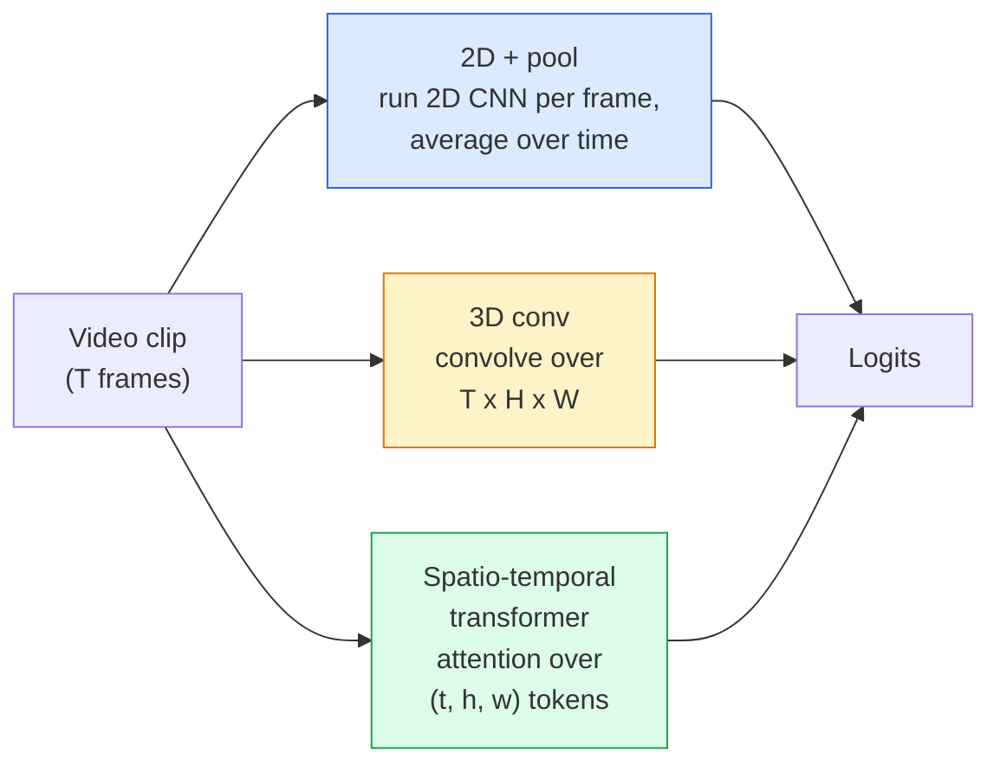

# 视频理解——时间建模

> 视频是一连串图像，再加上连接这些图像的物理规律。每种视频模型要么把时间视为额外维度（3D 卷积），要么视为可供注意力处理的序列（Transformer），要么只提取一次特征后进行汇聚（2D + Pool）。

**Type:** 学习 + 构建
**Languages:** Python
**Prerequisites:** 第 4 阶段第 03 课（CNN）、第 4 阶段第 04 课（图像分类）
**Time:** 约 45 分钟

## 学习目标

- 区分三种主要视频建模方法（2D + Pool、3D 卷积、时空 Transformer），并预测它们的成本与准确率权衡
- 使用 PyTorch 实现帧采样、时间汇聚和 2D + Pool 基线分类器
- 解释 I3D 的“膨胀”三维卷积核为何能很好地迁移 ImageNet 权重，以及分解式 (2+1)D 卷积有何不同
- 阅读标准动作识别数据集与指标：Kinetics-400/600、UCF101、Something-Something V2，以及片段级与视频级 top-1 准确率

## 问题所在

一段 30 秒、30 fps 的视频包含 900 张图像。最朴素的视频分类，就是把图像分类运行 900 次，再以某种方式汇总结果。当动作几乎在每一帧中都清晰可见时，例如体育、烹饪或健身视频，这种方法有效；当动作由运动本身定义时，它就会严重失效。例如，“把某物从左向右推动”在每一张静止画面中看起来都只是两个静止物体。

每种视频架构都要回答一个核心问题：何时、以何种方式对时间结构建模？答案会决定其他一切，包括计算成本、预训练策略、能否复用 ImageNet 权重，以及应在哪些数据集上训练。

本课特意比静态图像课程更短，因为图像处理的核心机制已经具备，视频理解主要需要补充时间维度的故事：采样、建模和汇聚。

## 核心概念

### 三类架构



### 2D + Pool

使用二维 CNN，例如 ResNet、EfficientNet 或 ViT，独立处理每个采样帧。再对逐帧嵌入取平均、最大池化或注意力汇聚，最后把汇聚后的向量交给分类器。

优点：
- 可以直接迁移 ImageNet 预训练权重。
- 实现最简单。
- 成本低：T 帧 * 单张图像推理成本。

缺点：
- 无法对运动建模，动作只是多帧外观的汇总。
- 时间汇聚与顺序无关，“打开门”和“关上门”看起来完全相同。

适用场景：以外观为主的任务、小型视频数据集上的迁移学习、初始基线。

### 三维卷积

用三维 (T, H, W) 卷积核替代二维 (H, W) 卷积核，让网络同时跨空间与时间进行卷积。早期代表家族包括 C3D、I3D、SlowFast。

I3D 的技巧是：取一个经过 ImageNet 预训练的二维模型，通过沿新增时间轴复制每个二维卷积核，将其“膨胀”为三维。一个 3x3 二维卷积会变成 3x3x3 三维卷积。这样，三维模型无需从零训练，就能获得强大的预训练权重。

优点：
- 直接对运动建模。
- I3D 膨胀可以免费获得迁移学习能力。

缺点：
- FLOPs 比对应二维模型高 T/8 倍，这里假设时间卷积核为 3，并堆叠三次。
- 时间卷积核较小，要处理长距离运动，需要金字塔或双流方法。

适用场景：运动本身就是信号的动作识别，例如 Something-Something V2，以及 Kinetics 中依赖运动的类别。

### 时空 Transformer

把视频切分成时空 Patch 网格，并在所有 token 之间计算注意力。代表模型包括 TimeSformer、ViViT、Video Swin 和 VideoMAE。

需要关注的注意力模式：
- **联合式**——一次在 (t, h, w) 上计算大型注意力，复杂度相对于 `T*H*W` 呈平方增长，成本高昂。
- **分离式**——每个模块包含两次注意力：一次沿时间，一次沿空间，扩展复杂度近似线性。
- **分解式**——不同模块交替执行时间注意力与空间注意力。

优点：
- 在每个主要基准上都达到当前最佳准确率。
- 可以通过 Patch 膨胀迁移图像 Transformer（ViT）的权重。
- 可以借助稀疏注意力支持长上下文视频。

缺点：
- 需要大量计算资源。
- 必须谨慎选择注意力模式，否则运行成本会急剧膨胀。

适用场景：大型数据集、高保真视频理解、多模态视频 + 文本任务。

### 帧采样

一段 10 秒、30 fps 的片段包含 300 帧，把 300 帧全部输入任何模型都很浪费。标准策略包括：

- **均匀采样**——在整段视频中均匀选取 T 帧，是 2D + Pool 的默认方式。
- **密集采样**——随机选择连续 T 帧窗口。3D 卷积常用这种方式，因为运动需要相邻帧。
- **多片段采样**——从同一个视频中抽取多个 T 帧窗口，分别分类，再在测试时平均预测。

T 通常取 8、16、32 或 64。T 越大，时间信号越多，计算量也越高。

### 评估

评估分为两个层级：
- **片段级准确率**——模型只看到一个 T 帧片段，并报告 top-k。
- **视频级准确率**——对同一个视频中的多个片段预测取平均，结果更高也更稳定。

两者都应报告。如果一个模型达到 78% 片段准确率 / 82% 视频准确率，说明它高度依赖测试时平均；另一个模型达到 80% / 81%，则逐片段表现更稳健。

### 常见数据集

- **Kinetics-400 / 600 / 700**——通用动作数据集，包含 40 万个片段；使用 YouTube URL，其中许多现在已经失效。
- **Something-Something V2**——动作由运动定义，例如“把 X 从左向右移动”，无法只靠 2D + Pool 解决。
- **UCF-101**、**HMDB-51**——更早、更小，但仍经常用于报告结果。
- **AVA**——在空间和时间上进行动作*定位*，比分类更难。

```figure
v4-video-temporal
```

## 动手构建

### 第 1 步：帧采样器

下面是适用于帧列表或视频张量的均匀采样器和密集采样器。

```python
import numpy as np

def sample_uniform(num_frames_total, T):
    if num_frames_total <= T:
        return list(range(num_frames_total)) + [num_frames_total - 1] * (T - num_frames_total)
    step = num_frames_total / T
    return [int(i * step) for i in range(T)]


def sample_dense(num_frames_total, T, rng=None):
    rng = rng or np.random.default_rng()
    if num_frames_total <= T:
        return list(range(num_frames_total)) + [num_frames_total - 1] * (T - num_frames_total)
    start = int(rng.integers(0, num_frames_total - T + 1))
    return list(range(start, start + T))
```

两个函数都返回 `T` 个索引，可用来切片视频张量。

### 第 2 步：2D + Pool 基线

用二维 ResNet-18 处理每一帧，对特征进行平均汇聚，再执行分类。

```python
import torch
import torch.nn as nn
from torchvision.models import resnet18, ResNet18_Weights

class FramePool(nn.Module):
    def __init__(self, num_classes=400, pretrained=True):
        super().__init__()
        weights = ResNet18_Weights.IMAGENET1K_V1 if pretrained else None
        backbone = resnet18(weights=weights)
        self.features = nn.Sequential(*(list(backbone.children())[:-1]))  # global avg pool kept
        self.head = nn.Linear(512, num_classes)

    def forward(self, x):
        # x: (N, T, 3, H, W)
        N, T = x.shape[:2]
        x = x.view(N * T, *x.shape[2:])
        feats = self.features(x).view(N, T, -1)
        pooled = feats.mean(dim=1)
        return self.head(pooled)

model = FramePool(num_classes=10)
x = torch.randn(2, 8, 3, 224, 224)
print(f"output: {model(x).shape}")
print(f"params: {sum(p.numel() for p in model.parameters()):,}")
```

模型有 1100 万参数，使用 ImageNet 预训练，逐帧运行、平均再分类。在以外观为主的任务上，这个基线与真正三维模型往往只差 5–10 个百分点，有时甚至更好，因为它复用了更强的 ImageNet 骨干网络。

### 第 3 步：I3D 风格的膨胀三维卷积

沿新的时间轴重复权重，把单个二维卷积转换成三维卷积。

```python
def inflate_2d_to_3d(conv2d, time_kernel=3):
    out_c, in_c, kh, kw = conv2d.weight.shape
    weight_3d = conv2d.weight.data.unsqueeze(2)  # (out, in, 1, kh, kw)
    weight_3d = weight_3d.repeat(1, 1, time_kernel, 1, 1) / time_kernel
    conv3d = nn.Conv3d(in_c, out_c, kernel_size=(time_kernel, kh, kw),
                        padding=(time_kernel // 2, conv2d.padding[0], conv2d.padding[1]),
                        stride=(1, conv2d.stride[0], conv2d.stride[1]),
                        bias=False)
    conv3d.weight.data = weight_3d
    return conv3d

conv2d = nn.Conv2d(3, 64, kernel_size=3, padding=1, bias=False)
conv3d = inflate_2d_to_3d(conv2d, time_kernel=3)
print(f"2D weight shape:  {tuple(conv2d.weight.shape)}")
print(f"3D weight shape:  {tuple(conv3d.weight.shape)}")
x = torch.randn(1, 3, 8, 56, 56)
print(f"3D output shape:  {tuple(conv3d(x).shape)}")
```

除以 `time_kernel` 可以让激活幅度大致保持不变，这对避免第一次前向传播就破坏批归一化统计量非常重要。

### 第 4 步：分解式 (2+1)D 卷积

把一个三维卷积分解成二维空间卷积和一维时间卷积。感受野相同，参数更少，在一些基准上准确率更好。

```python
class Conv2Plus1D(nn.Module):
    def __init__(self, in_c, out_c, kernel_size=3):
        super().__init__()
        mid_c = (in_c * out_c * kernel_size * kernel_size * kernel_size) \
                // (in_c * kernel_size * kernel_size + out_c * kernel_size)
        self.spatial = nn.Conv3d(in_c, mid_c, kernel_size=(1, kernel_size, kernel_size),
                                 padding=(0, kernel_size // 2, kernel_size // 2), bias=False)
        self.bn = nn.BatchNorm3d(mid_c)
        self.act = nn.ReLU(inplace=True)
        self.temporal = nn.Conv3d(mid_c, out_c, kernel_size=(kernel_size, 1, 1),
                                  padding=(kernel_size // 2, 0, 0), bias=False)

    def forward(self, x):
        return self.temporal(self.act(self.bn(self.spatial(x))))

c = Conv2Plus1D(3, 64)
x = torch.randn(1, 3, 8, 56, 56)
print(f"(2+1)D output: {tuple(c(x).shape)}")
```

完整 R(2+1)D 网络，就是把 ResNet-18 中的每个 Conv2d 都替换成 `Conv2Plus1D`。

## 实际应用

两个库覆盖了生产级视频工作：

- `torchvision.models.video`——提供带 Kinetics 预训练权重的 R(2+1)D、MViT 和 Swin3D，API 与图像模型相同。
- `pytorchvideo`（Meta）——提供模型库、Kinetics / SSv2 / AVA 数据加载器和标准变换。

对于视觉—语言视频模型，例如视频字幕与视频问答，应使用 `transformers`（`VideoMAE`、`VideoLLaMA`、`InternVideo`）。

## 交付成果

本课会产出：

- `outputs/prompt-video-architecture-picker.md`——根据任务偏重外观还是运动、数据集大小和计算预算，在 2D + Pool / I3D / (2+1)D / Transformer 中作出选择。
- `outputs/skill-frame-sampler-auditor.md`——检查视频流水线中的采样器，并标记常见缺陷，例如索引差一、`num_frames < T` 时采样不均匀，以及缺少保持宽高比的裁剪。

## 练习

1. **（简单）** 近似计算 T=8 的 FramePool 与 T=8 的 I3D 风格三维 ResNet 的 FLOPs，说明为什么 2D + Pool 的计算量低 3–5 倍。
2. **（中等）** 生成一个合成视频数据集：随机小球向随机方向移动，并按运动方向标记，例如“从左到右”“从右到左”“斜向上”。在其上训练 FramePool，证明准确率接近随机水平，从而说明只看外观不足以解决运动任务。
3. **（困难）** 把 ResNet-18 中的每个 Conv2d 替换成 `Conv2Plus1D`，构建 R(2+1)D-18。使用 ImageNet 预训练 ResNet-18 的权重膨胀初始化第一个卷积。在练习 2 的运动数据集上训练，并击败 FramePool。

## 关键术语

| 术语 | 人们常说 | 实际含义 |
|------|----------------|----------------------|
| 2D + Pool | “逐帧分类器” | 在每个采样帧上运行二维 CNN，再跨时间平均汇聚特征并分类 |
| 三维卷积 | “时空卷积核” | 在 (T, H, W) 上执行卷积、能够原生建模运动的卷积核 |
| 膨胀 | “把二维权重提升为三维” | 沿新时间轴重复二维卷积权重，再除以 kernel_T 以保持激活尺度，从而初始化三维卷积 |
| (2+1)D | “分解式卷积” | 把三维卷积分成二维空间卷积 + 一维时间卷积；参数更少，中间多一次非线性 |
| 分离式注意力 | “先时间，后空间” | 每层包含两次注意力的 Transformer 模块：一次处理同一帧中的 token，一次处理同一位置上的 token |
| 片段 | “T 帧窗口” | 由 T 帧组成的采样子序列，是视频模型处理的基本单位 |
| 片段准确率与视频准确率 | “两种评估设置” | 片段准确率每个视频只取一个样本，视频准确率则平均多个采样片段 |
| Kinetics | “视频领域的 ImageNet” | 包含 400–700 个动作类别和 30 万条以上 YouTube 片段的标准视频预训练语料库 |

## 延伸阅读

- [《I3D: Quo Vadis, Action Recognition》（Carreira 与 Zisserman，2017）](https://arxiv.org/abs/1705.07750)——提出权重膨胀并发布 Kinetics 数据集
- [《R(2+1)D: A Closer Look at Spatiotemporal Convolutions》（Tran 等，2018）](https://arxiv.org/abs/1711.11248)——分解式卷积，至今仍是强基线
- [《TimeSformer: Is Space-Time Attention All You Need?》（Bertasius 等，2021）](https://arxiv.org/abs/2102.05095)——第一个性能强劲的视频 Transformer
- [《VideoMAE》（Tong 等，2022）](https://arxiv.org/abs/2203.12602)——面向视频的掩码自编码器预训练，是目前占主导地位的预训练方案
