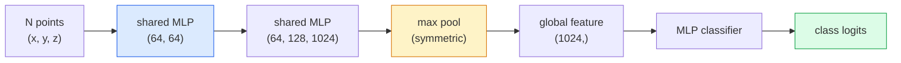

# 3D 视觉——点云与 NeRF

> 3D 视觉有两种主要形态。点云是传感器的原始输出，NeRF 是学习得到的体积场。两者都在回答“空间中的什么位置存在什么”。

**Type:** 学习 + 构建
**Languages:** Python
**Prerequisites:** 第 4 阶段第 03 课（CNN）、第 1 阶段第 12 课（张量运算）
**Time:** 约 45 分钟

## 学习目标

- 区分显式三维表示（点云、网格、体素）与隐式三维表示（有符号距离场、NeRF），并说明各自适用的场景
- 理解 PointNet 的对称函数技巧，它如何让神经网络在无序点集上保持置换不变性
- 追踪 NeRF 的前向传播：射线投射、体渲染、位置编码、输出密度与颜色的 MLP Head
- 使用 `nerfstudio` 或 `instant-ngp`，从少量具有相机位姿的图像中完成预训练三维重建

## 问题所在

相机会生成二维图像，LIDAR 会生成一组没有顺序的三维点，运动恢复结构流水线会生成稀疏三维关键点云，NeRF 则从少量带相机位姿的图像中重建完整三维场景。这些都属于“视觉”，却没有任何一种数据看起来像 CNN 所需要的稠密张量。

3D 视觉之所以重要，是因为几乎所有高价值机器人任务都发生在三维空间中：抓取、避障、导航、AR 遮挡和三维内容采集。如果一名视觉工程师只理解二维图像，就无法进入这个增长最快的领域，包括 AR/VR 内容、机器人、自动驾驶技术栈，以及面向房地产或建筑业的 NeRF 三维重建。

两种表示因不同原因占据主导地位。点云是传感器免费提供的原始数据；NeRF 及其后继者（3D Gaussian Splatting、神经 SDF）则是让神经网络学习场景后得到的结果。

## 核心概念

### 点云

点云是 R^3 中 N 个点组成的无序集合，每个点还可以带有颜色、强度、法向量等特征。

```
cloud = [
  (x1, y1, z1, r1, g1, b1),
  (x2, y2, z2, r2, g2, b2),
  ...
  (xN, yN, zN, rN, gN, bN),
]
```

它没有网格，也没有连接关系，因此有两个性质会给神经网络带来困难：

- **置换不变性**——输出不能依赖点的排列顺序。
- **N 可变**——同一个模型必须处理包含不同点数的点云。

PointNet（Qi 等，2017）用一个思想同时解决了两个问题：让共享 MLP 独立作用于每个点，再使用对称函数（最大池化）聚合结果。最终得到一个不依赖顺序的固定大小向量。

```
f(P) = max_{p in P} MLP(p)
```

这就是 PointNet 的全部核心。更深的变体（PointNet++、Point Transformer）会增加分层采样和局部聚合，但对称函数这一技巧保持不变。

### PointNet 架构



“共享 MLP”表示同一个 MLP 会分别作用于每个点。为了提高效率，实现时通常使用沿点维度运行的 1x1 卷积。

### 神经辐射场（NeRF）

NeRF（Mildenhall 等，2020）提出了一个问题：“能否从 N 张照片中重建三维场景？”它给出的答案是让神经网络本身成为场景。网络把 `(x, y, z, viewing_direction)` 映射为 `(density, colour)`。渲染新视角时，只需让射线投射循环反复查询这个网络。

```
NeRF MLP:  (x, y, z, theta, phi) -> (sigma, r, g, b)

To render a pixel (u, v) of a new view:
  1. Cast a ray from the camera through pixel (u, v)
  2. Sample points along the ray at distances t_1, t_2, ..., t_N
  3. Query the MLP at each point
  4. Composite the colours weighted by (1 - exp(-sigma * dt))
  5. The sum is the rendered pixel colour
```

损失会比较渲染像素与训练照片中的真实像素。通过渲染步骤反向传播，即可更新 MLP。无需三维真值，也没有显式几何结构——场景就存储在 MLP 权重中。

### NeRF 中的位置编码

直接处理 `(x, y, z)` 的普通 MLP 无法表示高频细节，因为 MLP 在频谱上偏向低频。NeRF 会在送入 MLP 前，把每个坐标编码成傅里叶特征向量：

```
gamma(p) = (sin(2^0 pi p), cos(2^0 pi p), sin(2^1 pi p), cos(2^1 pi p), ...)
```

频率层级最高取 L=10。这与 Transformer 对位置进行编码的技巧相同，也会再次出现在扩散模型的时间条件中（第 10 课）。没有位置编码，NeRF 生成的图像会很模糊。

### 体渲染

```
C(r) = sum_i T_i * (1 - exp(-sigma_i * delta_i)) * c_i

T_i  = exp(- sum_{j<i} sigma_j * delta_j)
delta_i = t_{i+1} - t_i
```

`T_i` 是透射率，表示光线到达第 i 个点时还剩多少；`(1 - exp(-sigma_i * delta_i))` 是第 i 个点的不透明度，`c_i` 是颜色。最终像素就是沿射线各项的加权和。

### 什么取代了 NeRF

纯 NeRF 训练缓慢，需要数小时；渲染也慢，每张图像需要数秒。后续技术谱系如下：

- **Instant-NGP**（2022）——用哈希网格编码替代 MLP 的位置输入，训练时间缩短到数秒。
- **Mip-NeRF 360**——处理无边界场景与抗混叠问题。
- **3D Gaussian Splatting**（2023）——用数百万个三维高斯替代体积场；数分钟内完成训练，并实时渲染，是当前生产环境默认选择。

到 2026 年，几乎每个真实 NeRF 产品实际上都在使用 3D Gaussian Splatting，但理解它们的思维模型仍始于 NeRF。

### 数据集与基准

- **ShapeNet**——把三维 CAD 模型表示为点云，用于分类与分割。
- **ScanNet**——用于分割的真实室内扫描数据。
- **KITTI**——自动驾驶使用的户外 LIDAR 点云。
- **NeRF Synthetic** / **Blended MVS**——用于新视角合成、带相机位姿的图像数据集。
- **Mip-NeRF 360** 数据集——无边界真实场景。

```figure
nerf-rays
```

## 动手构建

### 第 1 步：PointNet 分类器

```python
import torch
import torch.nn as nn

class PointNet(nn.Module):
    def __init__(self, num_classes=10):
        super().__init__()
        self.mlp1 = nn.Sequential(
            nn.Conv1d(3, 64, 1),    nn.BatchNorm1d(64),   nn.ReLU(inplace=True),
            nn.Conv1d(64, 64, 1),   nn.BatchNorm1d(64),   nn.ReLU(inplace=True),
        )
        self.mlp2 = nn.Sequential(
            nn.Conv1d(64, 128, 1),  nn.BatchNorm1d(128),  nn.ReLU(inplace=True),
            nn.Conv1d(128, 1024, 1), nn.BatchNorm1d(1024), nn.ReLU(inplace=True),
        )
        self.head = nn.Sequential(
            nn.Linear(1024, 512),   nn.BatchNorm1d(512),  nn.ReLU(inplace=True),
            nn.Dropout(0.3),
            nn.Linear(512, 256),    nn.BatchNorm1d(256),  nn.ReLU(inplace=True),
            nn.Dropout(0.3),
            nn.Linear(256, num_classes),
        )

    def forward(self, x):
        # x: (N, 3, num_points) — transposed for Conv1d
        x = self.mlp1(x)
        x = self.mlp2(x)
        x = torch.max(x, dim=-1)[0]       # (N, 1024)
        return self.head(x)

pts = torch.randn(4, 3, 1024)
net = PointNet(num_classes=10)
print(f"output: {net(pts).shape}")
print(f"params: {sum(p.numel() for p in net.parameters()):,}")
```

模型约有 160 万参数，每个点云处理 1,024 个点。

### 第 2 步：位置编码

```python
def positional_encoding(x, L=10):
    """
    x: (..., D) -> (..., D * 2 * L)
    """
    freqs = 2.0 ** torch.arange(L, dtype=x.dtype, device=x.device)
    args = x.unsqueeze(-1) * freqs * 3.141592653589793
    sinc = torch.cat([args.sin(), args.cos()], dim=-1)
    return sinc.reshape(*x.shape[:-1], -1)

x = torch.randn(5, 3)
y = positional_encoding(x, L=10)
print(f"input:  {x.shape}")
print(f"encoded: {y.shape}     # (5, 60)")
```

乘以 `2^l * pi` 会产生逐渐升高的频率。

### 第 3 步：微型 NeRF MLP

```python
class TinyNeRF(nn.Module):
    def __init__(self, L_pos=10, L_dir=4, hidden=128):
        super().__init__()
        self.L_pos = L_pos
        self.L_dir = L_dir
        pos_dim = 3 * 2 * L_pos
        dir_dim = 3 * 2 * L_dir
        self.trunk = nn.Sequential(
            nn.Linear(pos_dim, hidden), nn.ReLU(inplace=True),
            nn.Linear(hidden, hidden),  nn.ReLU(inplace=True),
            nn.Linear(hidden, hidden),  nn.ReLU(inplace=True),
            nn.Linear(hidden, hidden),  nn.ReLU(inplace=True),
        )
        self.sigma = nn.Linear(hidden, 1)
        self.color = nn.Sequential(
            nn.Linear(hidden + dir_dim, hidden // 2), nn.ReLU(inplace=True),
            nn.Linear(hidden // 2, 3), nn.Sigmoid(),
        )

    def forward(self, x, d):
        x_enc = positional_encoding(x, self.L_pos)
        d_enc = positional_encoding(d, self.L_dir)
        h = self.trunk(x_enc)
        sigma = torch.relu(self.sigma(h)).squeeze(-1)
        rgb = self.color(torch.cat([h, d_enc], dim=-1))
        return sigma, rgb

nerf = TinyNeRF()
x = torch.randn(128, 3)
d = torch.randn(128, 3)
s, c = nerf(x, d)
print(f"sigma: {s.shape}   rgb: {c.shape}")
```

它比原始 NeRF 小得多；原始模型包含两个深度为 8 的 MLP 主干。但这个版本已经足以展示架构。

### 第 4 步：沿射线进行体渲染

```python
def volumetric_render(sigma, rgb, t_vals):
    """
    sigma: (..., N_samples)
    rgb:   (..., N_samples, 3)
    t_vals: (N_samples,) distances along the ray
    """
    delta = torch.cat([t_vals[1:] - t_vals[:-1], torch.full_like(t_vals[:1], 1e10)])
    alpha = 1.0 - torch.exp(-sigma * delta)
    trans = torch.cumprod(torch.cat([torch.ones_like(alpha[..., :1]), 1.0 - alpha + 1e-10], dim=-1), dim=-1)[..., :-1]
    weights = alpha * trans
    rendered = (weights.unsqueeze(-1) * rgb).sum(dim=-2)
    depth = (weights * t_vals).sum(dim=-1)
    return rendered, depth, weights


N = 64
t_vals = torch.linspace(2.0, 6.0, N)
sigma = torch.rand(N) * 0.5
rgb = torch.rand(N, 3)
rendered, depth, weights = volumetric_render(sigma, rgb, t_vals)
print(f"rendered colour: {rendered.tolist()}")
print(f"depth:           {depth.item():.2f}")
```

一条射线采样 64 个点，最终合成为一个 RGB 像素和一个深度值。

## 实际应用

真实项目可以使用：

- `nerfstudio`（Tancik 等）——当前 NeRF / Instant-NGP / Gaussian Splatting 的参考库，提供命令行工具和 Web 查看器。
- `pytorch3d`（Meta）——可微渲染、点云工具和网格操作。
- `open3d`——点云处理、配准与可视化。

在生产部署中，3D Gaussian Splatting 已经在很大程度上取代纯 NeRF，因为它的渲染速度快 100 倍，而重建质量相当。

## 交付成果

本课会产出：

- `outputs/prompt-3d-task-router.md`——根据任务和输入数据，在点云、网格、体素、NeRF 与 Gaussian Splat 中选择合适三维表示的提示词。
- `outputs/skill-point-cloud-loader.md`——为 .ply / .pcd / .xyz 文件生成 PyTorch `Dataset` 的技能，包含正确的归一化、居中和点采样。

## 练习

1. **（简单）** 证明 PointNet 具有置换不变性：让同一份点云运行两次，第二次先打乱点的顺序。验证两次输出除浮点噪声外完全一致。
2. **（中等）** 实现一个最小射线生成函数：给定相机内参和位姿，为 H x W 图像中的每个像素生成射线原点与方向。
3. **（困难）** 在彩色立方体的合成渲染视图数据集上训练 TinyNeRF；数据可以通过可微渲染或简单光线追踪器生成。报告第 1、10、100 个 epoch 的渲染损失。模型到第几个 epoch 开始生成可辨认的视角？

## 关键术语

| 术语 | 人们常说 | 实际含义 |
|------|----------------|----------------------|
| 点云 | “LIDAR 生成的三维点” | 由 (x, y, z) 以及每个点可选特征组成的无序集合 |
| PointNet | “第一个点云神经网络” | 对每个点应用共享 MLP，再进行对称的最大池化；结构上天然具有置换不变性 |
| NeRF | “作为场景的 MLP” | 把 (x, y, z, dir) 映射为 (密度, 颜色)，再通过射线投射进行渲染的网络 |
| 位置编码 | “傅里叶特征” | 把每个坐标编码成多个频率的 Sin/Cos，以克服 MLP 的低频偏置 |
| 体渲染 | “沿射线积分” | 使用透射率与 Alpha，把沿射线的多个样本合成为一个像素 |
| Instant-NGP | “哈希网格 NeRF” | 用多分辨率哈希网格替换 NeRF 的坐标 MLP，速度提高 100–1000 倍 |
| 3D Gaussian Splatting | “数百万个高斯” | 用一组三维高斯表示场景，数分钟即可训练并实时渲染 |
| SDF | “有符号距离场” | 返回到最近表面有符号距离的函数，是另一种隐式表示 |

## 延伸阅读

- [《PointNet》（Qi 等，2017）](https://arxiv.org/abs/1612.00593)——具有置换不变性的分类器
- [《NeRF》（Mildenhall 等，2020）](https://arxiv.org/abs/2003.08934)——把照片三维重建变成神经网络问题的论文
- [《Instant-NGP》（Müller 等，2022）](https://arxiv.org/abs/2201.05989)——使用哈希网格实现 1000 倍加速
- [《3D Gaussian Splatting》（Kerbl 等，2023）](https://arxiv.org/abs/2308.04079)——在生产环境中取代 NeRF 的架构
