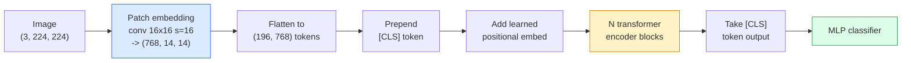

# 视觉 Transformer（ViT）

> 把图像切成 Patch，把每个 Patch 当作一个单词，再运行标准 Transformer。无需回头。

**Type:** 构建
**Languages:** Python
**Prerequisites:** 第 7 阶段第 02 课（自注意力）、第 4 阶段第 04 课（图像分类）
**Time:** 约 45 分钟

## 学习目标

- 从零实现 Patch Embedding、可学习位置嵌入、Class Token 和 Transformer 编码器模块，构建最小 ViT
- 解释人们为何一度认为 ViT 需要海量预训练数据，以及 DeiT 和 MAE 如何证明事实并非如此
- 从架构先验角度比较 ViT、Swin 和 ConvNeXt：无先验、局部窗口注意力、卷积骨干网络
- 使用 `timm` 在小型数据集上微调预训练 ViT，并采用标准的线性探测/微调方案

## 问题所在

十年间，卷积几乎就是计算机视觉的同义词。CNN 具有强大的归纳偏置，例如局部性和平移等变性，人们认为没有其他机制可以替代。随后，Dosovitskiy 等人（2020）证明：不使用任何卷积机制，只把普通 Transformer 应用于展平后的图像 Patch，在规模足够大时，也能追平甚至超过最佳 CNN。

但关键条件是“规模足够大”。ViT 只在 ImageNet-1k 上训练时不如 ResNet；先在 ImageNet-21k 或 JFT-300M 上预训练，再在 ImageNet-1k 上微调时则能超越它。人们由此认为 Transformer 缺少有用先验，却可以从足够多的数据中学到这些先验。后续工作（DeiT、MAE、DINO）又证明，只要训练方案正确——强数据增强、自监督预训练、知识蒸馏——ViT 在小数据上同样可以训练良好。

到 2026 年，纯 CNN 在边缘设备上仍具有竞争力，其中 ConvNeXt 最强；但 Transformer 已主导其他领域：分割（Mask2Former、SegFormer）、检测（DETR、RT-DETR）、多模态（CLIP、SigLIP）和视频（VideoMAE、VJEPA）。ViT 模块结构是必须掌握的基础。

## 核心概念

### 流水线



一共七步：Patch -> Token -> 注意力 -> 分类器。每种变体（DeiT、Swin、ConvNeXt、MAE 预训练）都只改变这七步中的一两步，其余部分保持不变。

### Patch 嵌入

第一个卷积就是秘密所在。卷积核大小为 16、Stride 为 16，因此一张 224x224 图像会变成一个 14x14 网格，其中每个 16x16 Patch 都投影为 768 维嵌入。这一个卷积同时完成 Patch 划分与线性投影。

```
Input:  (3, 224, 224)
Conv (3 -> 768, k=16, s=16, no padding):
Output: (768, 14, 14)
Flatten spatial: (196, 768)
```

196 个 Patch 就是 196 个 Token。每个 Token 的特征维度为 768（ViT-B）、1024（ViT-L）或 1280（ViT-H）。

### 类别词元（Class Token）

在序列最前面添加一个可学习向量：

```
tokens = [CLS; patch_1; patch_2; ...; patch_196]   shape (197, 768)
```

经过 N 个 Transformer 模块后，`[CLS]` 的输出就是全局图像表示，分类头只读取这一个向量。

### 位置嵌入

Transformer 并不天然理解空间位置，因此需要为每个 Token 加上一个可学习向量：

```
tokens = tokens + learned_pos_embedding   (also shape (197, 768))
```

位置嵌入是模型参数，基于梯度的训练会让它适应二维图像结构。也存在二维正弦替代方案，但实践中很少使用。

### Transformer 编码器模块

采用标准结构：多头自注意力、MLP、残差连接、Pre-LayerNorm。

```
x = x + MSA(LN(x))
x = x + MLP(LN(x))

MLP is two-layer with GELU: Linear(d -> 4d) -> GELU -> Linear(4d -> d)
```

ViT-B/16 会堆叠 12 个这样的模块，每个模块包含 12 个注意力头，总计 8600 万参数。

### 为什么使用 Pre-LN

早期 Transformer 使用 Post-LN（`x = LN(x + sublayer(x))`），如果没有预热，很难训练到 6–8 层以上。Pre-LN（`x = x + sublayer(LN(x))`）无需预热也能稳定训练更深网络。每个 ViT 和现代 LLM 都使用 Pre-LN。

### Patch 大小的权衡

- 16x16 Patch -> 196 个 Token，是标准设置。
- 32x32 Patch -> 49 个 Token，速度更快，但分辨率更低。
- 8x8 Patch -> 784 个 Token，细节更多，但注意力的 O(n^2) 成本增长很快。

Patch 越大，Token 越少，速度越快，但空间细节也越少。SwinV2 会在分层窗口中使用 4x4 Patch。

### DeiT 在 ImageNet-1k 上训练 ViT 的方案

原始 ViT 需要 JFT-300M 才能击败 CNN。DeiT（Touvron 等，2020）只使用 ImageNet-1k，就让 ViT-B 达到 81.8% top-1 准确率，依靠四项改变：

1. 强数据增强：RandAugment、Mixup、CutMix、Random Erasing。
2. 随机深度，即训练时随机丢弃整个模块。
3. 重复增强，即同一张图像在每个批次中采样三次。
4. 从 CNN 教师模型进行知识蒸馏；这是可选项，但能进一步提高准确率。

每一种现代 ViT 训练方案都源自 DeiT。

### Swin 与 ConvNeXt

- **Swin**（Liu 等，2021）——使用基于窗口的注意力。每个模块只在局部窗口内计算注意力，相邻模块交替平移窗口，以便跨窗口混合信息。它在保留注意力算子的同时，重新引入类似 CNN 的局部性先验。
- **ConvNeXt**（Liu 等，2022）——重新设计 CNN，使其采用与 Swin 类似的架构选择，包括深度卷积、LayerNorm、GELU 和倒置瓶颈。它证明真正的差距不在“注意力与卷积”之间，而在“现代训练方案 + 现代架构”上。

到 2026 年，ConvNeXt-V2 和 Swin-V2 都已达到生产级水平。应该选择哪一个，取决于推理技术栈与预训练语料；ConvNeXt 更容易在边缘设备上编译。

### MAE 预训练

掩码自编码器（He 等，2022）会随机遮盖 75% 的 Patch，只让编码器处理可见的 25%，再训练一个小型解码器，根据编码器输出重建被遮盖的 Patch。预训练完成后，丢弃解码器，只微调编码器。

MAE 让 ViT 只使用 ImageNet-1k 也能有效训练并达到顶尖水平，是当前默认的自监督方案。

```figure
batchnorm-inference
```

## 动手构建

### 第 1 步：Patch 嵌入

```python
import torch
import torch.nn as nn

class PatchEmbedding(nn.Module):
    def __init__(self, in_channels=3, patch_size=16, dim=192, image_size=64):
        super().__init__()
        assert image_size % patch_size == 0
        self.proj = nn.Conv2d(in_channels, dim, kernel_size=patch_size, stride=patch_size)
        num_patches = (image_size // patch_size) ** 2
        self.num_patches = num_patches

    def forward(self, x):
        x = self.proj(x)
        return x.flatten(2).transpose(1, 2)
```

一个卷积、一次展平、一次转置，这就是从图像到 Token 的完整过程。

### 第 2 步：Transformer 模块

使用 Pre-LN、多头自注意力、带 GELU 的 MLP 和残差连接。

```python
class Block(nn.Module):
    def __init__(self, dim, num_heads, mlp_ratio=4, dropout=0.0):
        super().__init__()
        self.ln1 = nn.LayerNorm(dim)
        self.attn = nn.MultiheadAttention(dim, num_heads, dropout=dropout, batch_first=True)
        self.ln2 = nn.LayerNorm(dim)
        self.mlp = nn.Sequential(
            nn.Linear(dim, dim * mlp_ratio),
            nn.GELU(),
            nn.Dropout(dropout),
            nn.Linear(dim * mlp_ratio, dim),
            nn.Dropout(dropout),
        )

    def forward(self, x):
        a, _ = self.attn(self.ln1(x), self.ln1(x), self.ln1(x), need_weights=False)
        x = x + a
        x = x + self.mlp(self.ln2(x))
        return x
```

`nn.MultiheadAttention` 会负责切分注意力头、计算缩放点积和输出投影。使用 `batch_first=True` 后，形状为 `(N, seq, dim)`。

### 第 3 步：ViT

```python
class ViT(nn.Module):
    def __init__(self, image_size=64, patch_size=16, in_channels=3,
                 num_classes=10, dim=192, depth=6, num_heads=3, mlp_ratio=4):
        super().__init__()
        self.patch = PatchEmbedding(in_channels, patch_size, dim, image_size)
        num_patches = self.patch.num_patches
        self.cls_token = nn.Parameter(torch.zeros(1, 1, dim))
        self.pos_embed = nn.Parameter(torch.zeros(1, num_patches + 1, dim))
        self.blocks = nn.ModuleList([
            Block(dim, num_heads, mlp_ratio) for _ in range(depth)
        ])
        self.ln = nn.LayerNorm(dim)
        self.head = nn.Linear(dim, num_classes)
        nn.init.trunc_normal_(self.pos_embed, std=0.02)
        nn.init.trunc_normal_(self.cls_token, std=0.02)

    def forward(self, x):
        x = self.patch(x)
        cls = self.cls_token.expand(x.size(0), -1, -1)
        x = torch.cat([cls, x], dim=1)
        x = x + self.pos_embed
        for blk in self.blocks:
            x = blk(x)
        x = self.ln(x[:, 0])
        return self.head(x)

vit = ViT(image_size=64, patch_size=16, num_classes=10, dim=192, depth=6, num_heads=3)
x = torch.randn(2, 3, 64, 64)
print(f"output: {vit(x).shape}")
print(f"params: {sum(p.numel() for p in vit.parameters()):,}")
```

模型约有 280 万参数，是一个可以在 CPU 上处理的微型 ViT。真正的 ViT-B 有 8600 万参数，只需让同一个类使用 `dim=768, depth=12, num_heads=12` 即可。

### 第 4 步：基本检查——单张图像推理

```python
logits = vit(torch.randn(1, 3, 64, 64))
print(f"logits: {logits}")
print(f"probs:  {logits.softmax(-1)}")
```

代码应该能够正常运行，而且概率之和应为 1。

## 实际应用

`timm` 提供带 ImageNet 预训练权重的所有 ViT 变体，只需一行：

```python
import timm

model = timm.create_model("vit_base_patch16_224", pretrained=True, num_classes=10)
```

到 2026 年，`timm` 是生产环境使用视觉 Transformer 的默认库。它以同一套 API 支持 ViT、DeiT、Swin、Swin-V2、ConvNeXt、ConvNeXt-V2、MaxViT、MViT、EfficientFormer 等数十种模型。

多模态任务，也就是图像 + 文本，可以使用 `transformers` 中的 CLIP、SigLIP、BLIP-2、LLaVA。它们的图像编码器全都是 ViT 变体。

## 交付成果

本课会产出：

- `outputs/prompt-vit-vs-cnn-picker.md`——根据数据集大小、计算资源和推理技术栈，在 ViT、ConvNeXt 与 Swin 之间作出选择的提示词。
- `outputs/skill-vit-patch-and-pos-embed-inspector.md`——验证 ViT 的 Patch Embedding 和位置嵌入形状是否匹配模型期望序列长度，从而捕捉最常见移植缺陷的技能。

## 练习

1. **（简单）** 打印上面微型 ViT 前向传播中每个中间张量的形状，确认：输入 `(N, 3, 64, 64)` -> Patch `(N, 16, 192)` -> 加入 CLS 后 `(N, 17, 192)` -> 分类器输入 `(N, 192)` -> 输出 `(N, num_classes)`。
2. **（中等）** 在第 4 课的合成 CIFAR 数据集上微调一个预训练 `timm` ViT-S/16，并与在相同数据上微调 ResNet-18 比较，报告训练时间和最终准确率。
3. **（困难）** 为微型 ViT 实现 MAE 预训练：遮盖 75% 的 Patch，训练编码器与一个小型解码器重建被遮盖 Patch。比较预训练前后的合成数据线性探测准确率。

## 关键术语

| 术语 | 人们常说 | 实际含义 |
|------|----------------|----------------------|
| Patch Embedding | “第一个卷积” | 卷积核大小 = Stride = Patch 大小的卷积，把图像转换成 Token 嵌入网格 |
| Class Token | “[CLS]” | 添加在 Token 序列最前面的可学习向量；它的最终输出就是全局图像表示 |
| 位置嵌入 | “学习得到的位置” | 加到每个 Token 上的可学习向量，让 Transformer 知道每个 Patch 来自哪里 |
| Pre-LN | “子层之前使用 LayerNorm” | 稳定的 Transformer 变体：使用 `x + sublayer(LN(x))`，而不是 `LN(x + sublayer(x))` |
| 多头注意力 | “并行注意力” | 标准 Transformer 注意力拆分到 num_heads 个独立子空间，最后再拼接 |
| ViT-B/16 | “Base，Patch 16” | 经典规模：dim=768、depth=12、heads=12、patch_size=16、image=224，约 8600 万参数 |
| DeiT | “数据高效 ViT” | 只使用 ImageNet-1k 和强数据增强训练的 ViT，证明并非必须拥有大型预训练数据集 |
| MAE | “掩码自编码器” | 自监督预训练：遮盖 75% 的 Patch，再执行重建；当前占主导地位的 ViT 预训练方案 |

## 延伸阅读

- [《An Image is Worth 16x16 Words》（Dosovitskiy 等，2020）](https://arxiv.org/abs/2010.11929)——ViT 论文
- [《DeiT: Data-efficient Image Transformers》（Touvron 等，2020）](https://arxiv.org/abs/2012.12877)——如何只使用 ImageNet-1k 训练 ViT
- [《Masked Autoencoders are Scalable Vision Learners》（He 等，2022）](https://arxiv.org/abs/2111.06377)——MAE 预训练
- [timm 文档](https://huggingface.co/docs/timm)——生产环境使用各种视觉 Transformer 时的参考资料
