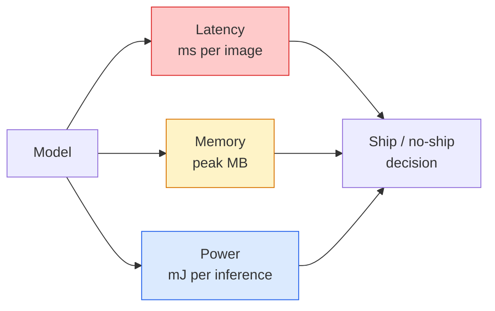

# 实时视觉——边缘部署

> 边缘推理的任务，是让一个准确率 90% 的模型在只有 2 GB 内存的设备上以 30 fps 运行。准确率每提高一个百分点，都要与数毫秒延迟进行权衡。

**Type:** 学习 + 构建
**Languages:** Python
**Prerequisites:** 第 4 阶段第 04 课（图像分类）、第 10 阶段第 11 课（量化）
**Time:** 约 75 分钟

## 学习目标

- 测量任意 PyTorch 模型的推理延迟、峰值内存和吞吐量，并理解 FLOPs / 参数量 / 延迟之间的权衡
- 使用 PyTorch 的训练后量化把视觉模型量化为 INT8，并验证准确率损失小于 1%
- 导出到 ONNX，再使用 ONNX Runtime 或 TensorRT 编译；说出三种最常见导出故障及其修复方法
- 解释在边缘设备限制下，应何时选择 MobileNetV3、EfficientNet-Lite、ConvNeXt-Tiny 或 MobileViT

## 问题所在

训练阶段的视觉模型是一个浮点怪兽：1 亿参数，每次前向传播 10 GFLOPs，占用 2 GB 显存。手机、汽车信息娱乐单元、工业相机或无人机都无法容纳这些开销。交付一套视觉系统，意味着要在缩小 100 倍的预算中实现同样的预测。

三个旋钮可以完成大部分优化工作：模型选择，也就是使用遵循相同方案的更小架构；量化，也就是用 INT8 取代 FP32；以及推理运行时，例如 ONNX Runtime、TensorRT、Core ML 和 TFLite。能否正确调节它们，决定了你交付的是只能在工作站上运行的演示，还是可以部署到 30 美元相机模块上的产品。

本课会先建立测量纪律，因为无法测量就无法优化，再逐一介绍三个旋钮。目标不是掌握每一种边缘运行时，而是了解有哪些杠杆，并知道如何验证每个杠杆确实产生了预期效果。

## 核心概念

### 三项预算



- **延迟：** p50、p95、p99。只取 p50 平均会掩盖实时系统真正关心的尾部行为。
- **峰值内存：** 设备运行期间出现的最大值，而不是稳定状态下的平均值。嵌入式目标上一旦 OOM，就是致命故障。
- **功率/能耗：** 电池供电设备每次推理消耗的毫焦耳，通常可用 CPU/GPU 利用率 * 时间近似。

边缘部署决策依赖一张（模型、延迟、内存、准确率）对照表。每个数据都必须在目标设备上实测，而不是在工作站上测量。

### 测量纪律

每次边缘性能分析都应遵循三条规则：

1. **预热**：测量前先让模型执行 5–10 次虚拟前向传播。冷缓存和 JIT 编译会让第一次结果不具代表性。
2. **同步**：计时区段前后都使用 `torch.cuda.synchronize()` 同步 GPU 工作负载，否则测到的只是内核分派时间，而不是内核执行时间。
3. **固定输入大小**：使用生产环境的真实分辨率。224x224 上的延迟，并不等于 512x512 上的延迟。

### 用 FLOPs 作为近似指标

FLOPs，也就是每次推理的浮点运算次数，是一种成本低且与设备无关的延迟近似指标。它适合比较架构，却会误导绝对墙钟时间。某个模型即使 FLOPs 多 10%，实际也可能快 2 倍，因为它使用了硬件友好操作。例如深度卷积容易高效编译，大型 7x7 卷积则不一定。

规则是：架构搜索使用 FLOPs，部署决策使用目标设备上的真实延迟。

### 一段话理解量化

用 INT8 替代 FP32 权重与激活。模型大小缩小 4 倍，内存带宽需求降低 4 倍；在拥有 INT8 内核的硬件上，计算速度提高 2–4 倍，而每种现代移动 SoC 和带 Tensor Core 的 NVIDIA GPU 都支持这类内核。对视觉任务进行训练后静态量化时，准确率通常只损失 0.1–1 个百分点。

量化类型包括：

- **动态量化**——把权重量化为 INT8，激活仍用浮点数计算。实现简单，加速有限。
- **静态量化（训练后）**——量化权重，并在一小份校准集上校准激活范围，速度远高于动态量化。
- **量化感知训练（QAT）**——训练期间模拟量化，让模型主动适应。准确率最高，但需要带标签数据。

对于视觉任务，训练后静态量化通常用 5% 的工作量即可获得 95% 的收益。只有 PTQ 导致的准确率损失不可接受时，才使用 QAT。

### 剪枝与蒸馏

- **剪枝**——移除不重要的权重，也就是基于幅度的剪枝，或移除完整通道，也就是结构化剪枝。它适合过参数化模型，对本来就很紧凑的架构帮助较小。
- **蒸馏**——训练小型学生模型模仿大型教师模型的 logits。它通常能恢复缩小模型造成的大部分准确率损失，是生产级边缘模型的标准方法。

### 推理运行时

- **PyTorch eager**——速度较慢，不适合部署，只用于开发。
- **TorchScript**——旧方案，已经被 `torch.compile` 和 ONNX 导出取代。
- **ONNX Runtime**——中立运行时。CPU、CUDA、CoreML、TensorRT、OpenVINO 都有 ONNX Provider，应从这里开始。
- **TensorRT**——NVIDIA 编译器，在 NVIDIA GPU（工作站和 Jetson）上延迟最低，可以通过 ONNX Runtime 集成，也可独立使用。
- **Core ML**——Apple 面向 iOS/macOS 的运行时，需要 `.mlmodel` 或 `.mlpackage`。
- **TFLite**——Google 面向 Android/ARM 的运行时，需要 `.tflite`。
- **OpenVINO**——Intel 面向 CPU/VPU 的运行时，需要 `.xml` + `.bin`。

实践中，路径就是 PyTorch -> ONNX -> 根据目标选择运行时。ONNX 是通用语言。

### 边缘架构选择

| 预算 | 模型 | 原因 |
|--------|-------|-----|
| 少于 3M 参数 | MobileNetV3-Small | 可以在各平台编译，是良好基线 |
| 3–10M | EfficientNet-Lite-B0 | TFLite 上每个参数带来的准确率最高 |
| 10–20M | ConvNeXt-Tiny | 每个参数的准确率最佳，对 CPU 友好 |
| 20–30M | MobileViT-S 或 EfficientViT | 具备 ImageNet 准确率的 Transformer |
| 30–80M | Swin-V2-Tiny | 适合支持窗口注意力的技术栈 |

除非有明确理由，否则应把这些模型全部量化为 INT8。

```figure
cnn-param-count
```

## 动手构建

### 第 1 步：正确测量延迟

```python
import time
import torch

def measure_latency(model, input_shape, device="cpu", warmup=10, iters=50):
    model = model.to(device).eval()
    x = torch.randn(input_shape, device=device)
    with torch.no_grad():
        for _ in range(warmup):
            model(x)
        if device == "cuda":
            torch.cuda.synchronize()
        times = []
        for _ in range(iters):
            if device == "cuda":
                torch.cuda.synchronize()
            t0 = time.perf_counter()
            model(x)
            if device == "cuda":
                torch.cuda.synchronize()
            times.append((time.perf_counter() - t0) * 1000)
    times.sort()
    return {
        "p50_ms": times[len(times) // 2],
        "p95_ms": times[int(len(times) * 0.95)],
        "p99_ms": times[int(len(times) * 0.99)],
        "mean_ms": sum(times) / len(times),
    }
```

先预热，再同步，使用 `time.perf_counter()`。报告百分位数，而不只是平均值。

### 第 2 步：参数量与 FLOP 计数

```python
def parameter_count(model):
    return sum(p.numel() for p in model.parameters())

def flops_estimate(model, input_shape):
    """
    Rough FLOP count for a conv/linear-only model. For production use `fvcore` or `ptflops`.
    """
    total = 0
    def conv_hook(m, inp, out):
        nonlocal total
        c_out, c_in, kh, kw = m.weight.shape
        h, w = out.shape[-2:]
        total += 2 * c_in * c_out * kh * kw * h * w
    def linear_hook(m, inp, out):
        nonlocal total
        total += 2 * m.in_features * m.out_features
    hooks = []
    for m in model.modules():
        if isinstance(m, torch.nn.Conv2d):
            hooks.append(m.register_forward_hook(conv_hook))
        elif isinstance(m, torch.nn.Linear):
            hooks.append(m.register_forward_hook(linear_hook))
    model.eval()
    with torch.no_grad():
        model(torch.randn(input_shape))
    for h in hooks:
        h.remove()
    return total
```

真实项目应使用 `fvcore.nn.FlopCountAnalysis` 或 `ptflops`；它们能正确处理所有模块类型。

### 第 3 步：训练后静态量化

```python
def quantise_ptq(model, calibration_loader, backend="x86"):
    import torch.ao.quantization as tq
    model = model.eval().cpu()
    model.qconfig = tq.get_default_qconfig(backend)
    tq.prepare(model, inplace=True)
    with torch.no_grad():
        for x, _ in calibration_loader:
            model(x)
    tq.convert(model, inplace=True)
    return model
```

共有三步：配置，准备（插入观察器），使用真实数据校准，转换（融合 + 量化）。需要先融合模型，例如 `Conv -> BN -> ReLU` 转换为 `ConvBnReLU`，可使用 `torch.ao.quantization.fuse_modules` 完成。

### 第 4 步：导出到 ONNX

```python
def export_onnx(model, sample_input, path="model.onnx"):
    model = model.eval()
    torch.onnx.export(
        model,
        sample_input,
        path,
        input_names=["input"],
        output_names=["output"],
        dynamic_axes={"input": {0: "batch"}, "output": {0: "batch"}},
        opset_version=17,
    )
    return path
```

到 2026 年，`opset_version=17` 是稳妥的默认值。`dynamic_axes` 允许 ONNX 模型使用任意批大小运行。

### 第 5 步：基准测试并比较不同方案

```python
import torch.nn as nn
from torchvision.models import mobilenet_v3_small

def compare_regimes():
    model = mobilenet_v3_small(weights=None, num_classes=10)
    params = parameter_count(model)
    flops = flops_estimate(model, (1, 3, 224, 224))
    lat_fp32 = measure_latency(model, (1, 3, 224, 224), device="cpu")
    print(f"FP32 MobileNetV3-Small: {params:,} params  {flops/1e9:.2f} GFLOPs  "
          f"p50={lat_fp32['p50_ms']:.2f}ms  p95={lat_fp32['p95_ms']:.2f}ms")
```

对 `resnet50`、`efficientnet_v2_s` 和 `convnext_tiny` 运行同一个函数，就能得到部署决策所需的比较表。

## 实际应用

生产技术栈通常收敛到以下三条路径之一：

- **Web / Serverless：** PyTorch -> ONNX -> ONNX Runtime（CPU 或 CUDA Provider）。最简单，对大多数场景已经足够。
- **NVIDIA 边缘设备（Jetson、GPU 服务器）：** PyTorch -> ONNX -> TensorRT。延迟最低，工程成本最高。
- **移动端：** PyTorch -> ONNX -> Core ML（iOS）或 TFLite（Android）。导出前先量化。

性能测量方面，`torch-tb-profiler`、`nvprof` / `nsys` 和 macOS 上的 Instruments 可以提供逐层分析；`benchmark_app`（OpenVINO）和 `trtexec`（TensorRT）则可以给出独立命令行测试数据。

## 交付成果

本课会产出：

- `outputs/prompt-edge-deployment-planner.md`——根据目标设备和延迟 SLA，选择骨干网络、量化策略与运行时的提示词。
- `outputs/skill-latency-profiler.md`——生成完整延迟基准测试脚本的技能，包含预热、同步、百分位数和内存追踪。

## 练习

1. **（简单）** 在 CPU 上测量 `resnet18`、`mobilenet_v3_small`、`efficientnet_v2_s` 和 `convnext_tiny` 处理 224x224 输入时的 p50 延迟。报告对照表，并找出每毫秒准确率最高的架构。
2. **（中等）** 对 `mobilenet_v3_small` 应用训练后静态量化。在 CIFAR-10 或类似数据集的保留子集上，报告 FP32 与 INT8 的延迟，以及准确率损失。
3. **（困难）** 把 `convnext_tiny` 导出为 ONNX，通过 `onnxruntime` 运行并采用 `CPUExecutionProvider`，再与 PyTorch eager 基线比较延迟。找出 ONNX Runtime 首先在哪一层变得更快，并解释原因。

## 关键术语

| 术语 | 人们常说 | 实际含义 |
|------|----------------|----------------------|
| 延迟 | “有多快” | 从输入到输出所需时间；应报告 p50/p95/p99 百分位，而不是平均值 |
| FLOPs | “模型大小” | 每次前向传播的浮点运算次数，是计算成本的粗略近似指标 |
| INT8 量化 | “8 位” | 用 8 位整数替代 FP32 权重/激活；模型约缩小 4 倍，速度提高 2–4 倍 |
| PTQ | “训练后量化” | 无需重新训练即可量化已训练模型；简单且通常已经足够 |
| QAT | “量化感知训练” | 训练期间模拟量化；准确率最高，但需要带标签数据 |
| ONNX | “中立格式” | 所有主流推理运行时都支持的模型交换格式 |
| TensorRT | “NVIDIA 编译器” | 把 ONNX 编译成适用于 NVIDIA GPU 的优化执行引擎 |
| 蒸馏 | “教师 -> 学生” | 训练小模型模仿大模型的 logits，以恢复大部分缩减模型造成的准确率损失 |

## 延伸阅读

- [《EfficientNet》（Tan 与 Le，2019）](https://arxiv.org/abs/1905.11946)——面向高效架构的复合缩放方法
- [《MobileNetV3》（Howard 等，2019）](https://arxiv.org/abs/1905.02244)——采用 H-Swish 与 Squeeze-and-Excite 的移动端优先架构
- [NVIDIA《A Practical Guide to TensorRT Optimization》](https://developer.nvidia.com/blog/accelerating-model-inference-with-tensorrt-tips-and-best-practices-for-pytorch-users/)——如何真正获得论文中所报告的吞吐量
- [ONNX Runtime 文档](https://onnxruntime.ai/docs/)——量化、图优化与 Provider 选择
