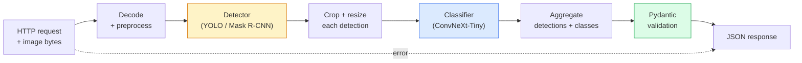

# 构建完整视觉流水线——综合项目

> 生产级视觉系统是由多个模型和规则组成的链条，并通过数据契约连接起来。本阶段已经准备好了所有部件，这个综合项目会把它们端到端串联起来。

**Type:** 构建
**Languages:** Python
**Prerequisites:** 第 4 阶段第 01–15 课
**Time:** 约 120 分钟

## 学习目标

- 设计一条生产级视觉流水线：检测物体、对物体分类并输出结构化 JSON，同时处理每一种失败路径
- 把检测器（Mask R-CNN 或 YOLO）、分类器（ConvNeXt-Tiny）和数据契约（Pydantic）接入同一个服务
- 对端到端流水线进行基准测试，找出第一个瓶颈；通常先是预处理，其次是检测器
- 交付一个最小 FastAPI 服务，接收上传图像，运行流水线，并返回包含分类结果的检测项

## 问题所在

单个视觉模型很有用，但视觉产品都是由多个模型组成的链条。零售货架审计由检测器、商品分类器和价格 OCR 流水线组成；自动驾驶由二维检测器、三维检测器、分割器、追踪器和规划器组成；医学预筛查则由分割器、区域分类器和临床医生界面组成。

把这些链条连接起来，正是机器学习原型与产品之间的分界线。模型之间的每一个接口都会成为新的缺陷来源。每一次坐标变换、每一次归一化、每一次掩码缩放，都可能悄无声息地失败。一条流水线的强度取决于其中最薄弱的接口。

这个综合项目会建立一条最小可行流水线：检测 + 分类 + 结构化输出 + 服务层。第 4 阶段的其他所有内容都可以插入这副骨架：把 Mask R-CNN 换成 YOLOv8，增加 OCR Head，增加分割分支，增加追踪器。架构保持稳定，各个部件可以替换。

## 核心概念

### 流水线



一共七个阶段。两个模型阶段成本高昂，另外五个阶段则是缺陷最容易藏身的地方。

### 使用 Pydantic 定义数据契约

每个模型边界都转换成有类型的对象，从而让静默故障变成明确错误。

```
Detection(
    box: tuple[float, float, float, float],   # (x1, y1, x2, y2), absolute pixels
    score: float,                              # [0, 1]
    class_id: int,                             # from detector's label map
    mask: Optional[list[list[int]]],           # RLE-encoded if present
)

PipelineResult(
    image_id: str,
    detections: list[Detection],
    classifications: list[Classification],
    inference_ms: float,
)
```

如果检测器返回的是 `(cx, cy, w, h)`，而不是 `(x1, y1, x2, y2)`，Pydantic 会在边界处验证失败。你会立即发现问题，而不必去调试下游那个悄悄返回空区域的裁剪操作。

### 延迟消耗在哪里

几乎每条视觉流水线都符合三条规律：

1. **预处理往往是最大的单个耗时模块。** JPEG 解码、颜色空间转换、缩放都受 CPU 限制，而且很容易被忽视。
2. **检测器主导 GPU 时间。** 70%–90% 的 GPU 时间都用于检测器前向传播。
3. **后处理（NMS、RLE 编解码）在 GPU 上很便宜，在 CPU 上却很昂贵。** 必须在真实目标设备上分析性能。

了解各阶段耗时分布，才能把优化工作变成一份有优先级的清单。

### 失败模式

- **没有检测结果**——返回空列表，不要崩溃，并记录日志。
- **边界框越界**——裁剪前先把坐标限制在图像范围内。
- **裁剪区域太小**——边界框小于分类器最低输入尺寸时，跳过分类。
- **上传内容损坏**——返回带具体错误码的 400 响应，而不是 500。
- **模型加载失败**——服务启动时失败，而不是等到第一个请求才失败。

生产级流水线需要逐一处理这些情况，而不是编写一个会隐藏失败原因的通用 `try/except`。每类失败都应该有具名错误码和明确响应。

### 分批

生产服务会同时服务多个客户端。把不同请求中的检测和分类任务合并成批次，可以成倍提高吞吐量。代价是等待批次凑齐会增加额外延迟。典型配置是最多等待 20 ms，收集多个请求后合并处理，再分别返回结果。`torchserve` 和 `triton` 原生支持这种方式；负载可预测的小型服务也可以自行实现微批处理器。

```figure
v4-vision-pipeline
```

## 动手构建

### 第 1 步：数据契约

```python
from pydantic import BaseModel, Field
from typing import List, Optional, Tuple

class Detection(BaseModel):
    box: Tuple[float, float, float, float]
    score: float = Field(ge=0, le=1)
    class_id: int = Field(ge=0)
    mask_rle: Optional[str] = None


class Classification(BaseModel):
    detection_index: int
    class_id: int
    class_name: str
    score: float = Field(ge=0, le=1)


class PipelineResult(BaseModel):
    image_id: str
    detections: List[Detection]
    classifications: List[Classification]
    inference_ms: float
```

五秒钟写下的代码，可以在任何严肃流水线中节省一小时调试时间。

### 第 2 步：最小 Pipeline 类

```python
import time
import numpy as np
import torch
from PIL import Image

class VisionPipeline:
    def __init__(self, detector, classifier, class_names,
                 device="cpu", min_crop=32):
        self.detector = detector.to(device).eval()
        self.classifier = classifier.to(device).eval()
        self.class_names = class_names
        self.device = device
        self.min_crop = min_crop

    def preprocess(self, image):
        """
        image: PIL.Image or np.ndarray (H, W, 3) uint8
        returns: CHW float tensor on device
        """
        if isinstance(image, Image.Image):
            image = np.asarray(image.convert("RGB"))
        tensor = torch.from_numpy(image).permute(2, 0, 1).float() / 255.0
        return tensor.to(self.device)

    @torch.no_grad()
    def detect(self, image_tensor):
        return self.detector([image_tensor])[0]

    @torch.no_grad()
    def classify(self, crops):
        if len(crops) == 0:
            return []
        batch = torch.stack(crops).to(self.device)
        logits = self.classifier(batch)
        probs = logits.softmax(-1)
        scores, cls = probs.max(-1)
        return list(zip(cls.tolist(), scores.tolist()))

    def run(self, image, image_id="anonymous"):
        t0 = time.perf_counter()
        tensor = self.preprocess(image)
        det = self.detect(tensor)

        crops = []
        detections = []
        valid_indices = []
        for i, (box, score, cls) in enumerate(zip(det["boxes"], det["scores"], det["labels"])):
            x1, y1, x2, y2 = [max(0, int(b)) for b in box.tolist()]
            x2 = min(x2, tensor.shape[-1])
            y2 = min(y2, tensor.shape[-2])
            detections.append(Detection(
                box=(x1, y1, x2, y2),
                score=float(score),
                class_id=int(cls),
            ))
            if (x2 - x1) < self.min_crop or (y2 - y1) < self.min_crop:
                continue
            crop = tensor[:, y1:y2, x1:x2]
            crop = torch.nn.functional.interpolate(
                crop.unsqueeze(0),
                size=(224, 224),
                mode="bilinear",
                align_corners=False,
            )[0]
            crops.append(crop)
            valid_indices.append(i)

        class_preds = self.classify(crops)

        classifications = []
        for valid_idx, (cls_id, cls_score) in zip(valid_indices, class_preds):
            classifications.append(Classification(
                detection_index=valid_idx,
                class_id=int(cls_id),
                class_name=self.class_names[cls_id],
                score=float(cls_score),
            ))

        return PipelineResult(
            image_id=image_id,
            detections=detections,
            classifications=classifications,
            inference_ms=(time.perf_counter() - t0) * 1000,
        )
```

每个接口都有类型，每条失败路径都有明确处理决策。

### 第 3 步：连接检测器与分类器

```python
from torchvision.models.detection import maskrcnn_resnet50_fpn_v2
from torchvision.models import convnext_tiny

# Use ImageNet-pretrained weights for a realistic pipeline without training
detector = maskrcnn_resnet50_fpn_v2(weights="DEFAULT")
classifier = convnext_tiny(weights="DEFAULT")
class_names = [f"imagenet_class_{i}" for i in range(1000)]

pipe = VisionPipeline(detector, classifier, class_names)

# Smoke test with a synthetic image
test_image = (np.random.rand(400, 600, 3) * 255).astype(np.uint8)
result = pipe.run(test_image, image_id="demo")
print(result.model_dump_json(indent=2)[:500])
```

### 第 4 步：FastAPI 服务

```python
from fastapi import FastAPI, UploadFile, HTTPException
from io import BytesIO

app = FastAPI()
pipe = None  # initialised on startup

@app.on_event("startup")
def load():
    global pipe
    detector = maskrcnn_resnet50_fpn_v2(weights="DEFAULT").eval()
    classifier = convnext_tiny(weights="DEFAULT").eval()
    pipe = VisionPipeline(detector, classifier, class_names=[f"c{i}" for i in range(1000)])

@app.post("/detect")
async def detect_endpoint(file: UploadFile):
    if file.content_type not in {"image/jpeg", "image/png", "image/webp"}:
        raise HTTPException(status_code=400, detail="unsupported image type")
    data = await file.read()
    try:
        img = Image.open(BytesIO(data)).convert("RGB")
    except Exception:
        raise HTTPException(status_code=400, detail="cannot decode image")
    result = pipe.run(img, image_id=file.filename or "upload")
    return result.model_dump()
```

使用 `uvicorn main:app --host 0.0.0.0 --port 8000` 启动，再用 `curl -F 'file=@dog.jpg' http://localhost:8000/detect` 测试。

### 第 5 步：对流水线进行基准测试

```python
import time

def benchmark(pipe, num_runs=20, image_size=(400, 600)):
    img = (np.random.rand(*image_size, 3) * 255).astype(np.uint8)
    pipe.run(img)  # warm up

    stages = {"preprocess": [], "detect": [], "classify": [], "total": []}
    for _ in range(num_runs):
        t0 = time.perf_counter()
        tensor = pipe.preprocess(img)
        t1 = time.perf_counter()
        det = pipe.detect(tensor)
        t2 = time.perf_counter()
        crops = []
        for box in det["boxes"]:
            x1, y1, x2, y2 = [max(0, int(b)) for b in box.tolist()]
            x2 = min(x2, tensor.shape[-1])
            y2 = min(y2, tensor.shape[-2])
            if (x2 - x1) >= pipe.min_crop and (y2 - y1) >= pipe.min_crop:
                crop = tensor[:, y1:y2, x1:x2]
                crop = torch.nn.functional.interpolate(
                    crop.unsqueeze(0), size=(224, 224), mode="bilinear", align_corners=False
                )[0]
                crops.append(crop)
        pipe.classify(crops)
        t3 = time.perf_counter()
        stages["preprocess"].append((t1 - t0) * 1000)
        stages["detect"].append((t2 - t1) * 1000)
        stages["classify"].append((t3 - t2) * 1000)
        stages["total"].append((t3 - t0) * 1000)

    for stage, times in stages.items():
        times.sort()
        print(f"{stage:12s}  p50={times[len(times)//2]:7.1f} ms  p95={times[int(len(times)*0.95)]:7.1f} ms")
```

CPU 上的典型输出为：预处理约 3 ms，检测约 300–500 ms，分类约 20–40 ms，总计约 350–550 ms。在 GPU 上，检测只需 20–40 ms，此时预处理与分类的相对占比就会变大。

## 实际应用

生产级模板会收敛到相同结构，并额外加入：

- **模型版本管理**——始终在响应中记录模型名称和权重哈希。
- **逐请求 Trace ID**——记录每个请求的每个阶段耗时，以便把慢响应定位到具体阶段。
- **降级路径**——如果分类器超时，仍返回检测结果，而不是让整个请求失败。
- **安全过滤器**——NSFW / PII 过滤器在分类后、响应离开服务前运行。
- **批量端点**——提供接受图像 URL 列表的 `/detect_batch`，用于批量处理。

生产服务通常使用 `torchserve`、`Triton Inference Server` 或 `BentoML`，它们原生处理分批、版本管理、指标和健康检查。原生运行 `FastAPI` 适合原型和小规模产品。

## 交付成果

本课会产出：

- `outputs/prompt-vision-service-shape-reviewer.md`——审查视觉服务代码中的契约/响应形状违规，并指出第一处破坏性缺陷的提示词。
- `outputs/skill-pipeline-budget-planner.md`——给定目标延迟和吞吐量后，为每个流水线阶段分配时间预算，并标记最先超出预算阶段的技能。

## 练习

1. **（简单）** 在任意开放数据集的 10 张图像上运行流水线，报告各阶段平均耗时和每张图像检测数量的分布。
2. **（中等）** 为 `Detection` 增加掩码输出字段，并编码为 RLE。验证即使一张图像中有 10 个物体，JSON 仍小于 1 MB。
3. **（困难）** 在分类器前增加微批处理器：最多收集 10 ms 内的裁剪区域，在一次 GPU 调用中完成全部分类，再按请求返回结果。测量每秒 5 个并发请求时的吞吐量提升和增加的延迟。

## 关键术语

| 术语 | 人们常说 | 实际含义 |
|------|----------------|----------------------|
| 流水线 | “系统” | 由预处理、推理和后处理步骤组成的有序链条，每对相邻阶段之间都有类型化接口 |
| 数据契约 | “Schema” | 每个阶段输入与输出都必须遵守的 Pydantic / Dataclass 定义，在边界处捕捉集成缺陷 |
| 预处理 | “模型之前” | 解码、颜色转换、缩放、归一化；通常是最大的 CPU 耗时来源 |
| 后处理 | “模型之后” | NMS、掩码缩放、阈值过滤、RLE 编码；在 GPU 上便宜，在 CPU 上昂贵 |
| 微批处理器 | “收集后统一前向传播” | 在固定时间窗口等待多个请求，再执行一次批量前向传播的聚合器 |
| Trace ID | “请求 ID” | 在每个阶段记录的逐请求标识符，使慢请求可以端到端追踪 |
| 失败代码 | “具名错误” | 为每种失败类型设置具体错误码，而不是笼统返回 500，使客户端能够实施重试逻辑 |
| 健康检查 | “就绪探针” | 报告服务是否能够响应的低成本端点，负载均衡器会依赖它 |

## 延伸阅读

- [Full Stack Deep Learning——Deploying Models](https://fullstackdeeplearning.com/course/2022/lecture-5-deployment/)——生产级机器学习部署的经典概览
- [BentoML 文档](https://docs.bentoml.com)——支持分批、版本管理和指标的服务框架
- [torchserve 文档](https://pytorch.org/serve/)——PyTorch 官方服务库
- [NVIDIA Triton Inference Server](https://developer.nvidia.com/triton-inference-server)——支持分批与多模型的高吞吐推理服务
