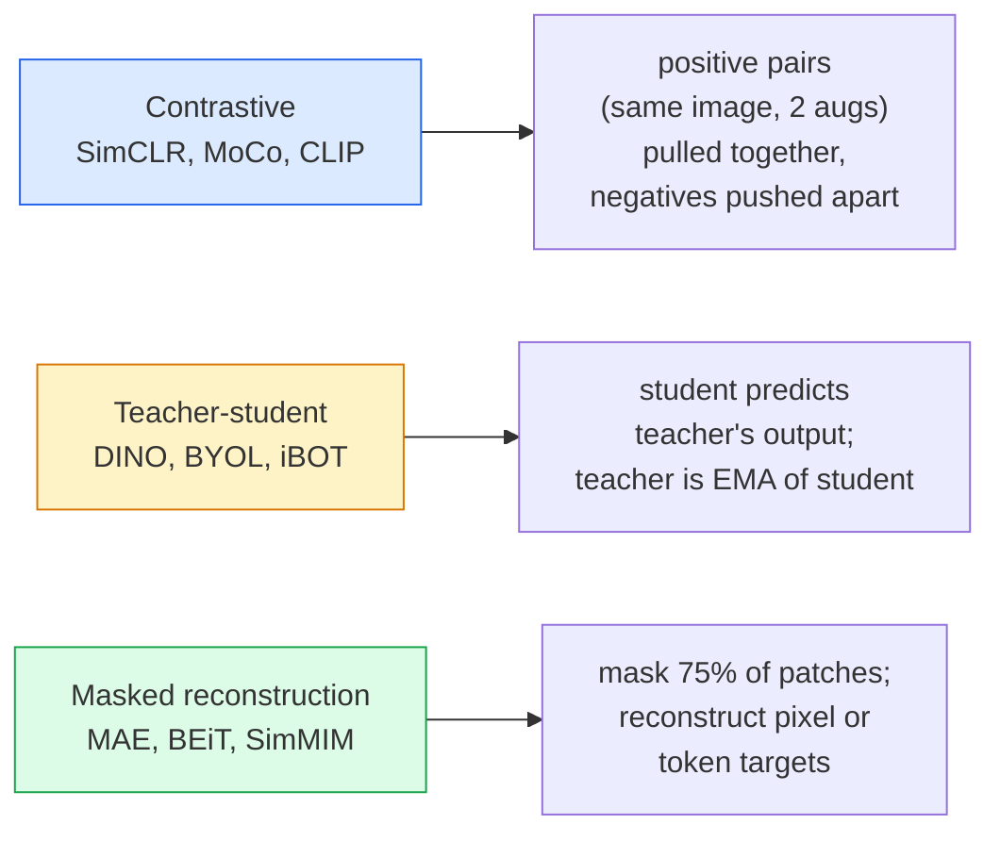

# 自监督视觉——SimCLR、DINO 与 MAE

> 标签是监督视觉的瓶颈。自监督预训练消除了这个瓶颈：先从一亿张无标签图像中学习视觉特征，再用一万张带标签图像微调。

**Type:** 学习 + 构建
**Languages:** Python
**Prerequisites:** 第 4 阶段第 04 课（图像分类）、第 4 阶段第 14 课（ViT）
**Time:** 约 75 分钟

## 学习目标

- 追踪三大自监督家族——对比式（SimCLR）、教师—学生式（DINO）、掩码重建式（MAE）——并说明每一种方法优化的目标
- 从零实现 InfoNCE 损失，并解释为什么批大小为 512 时有效，而批大小为 32 时会失败
- 解释 MAE 的 75% 掩码率并非随意选择，以及它与 BERT 对文本使用的 15% 有何不同
- 使用 DINOv2 或 MAE 的 ImageNet 检查点执行线性探测和零样本检索

## 问题所在

有监督 ImageNet 包含 130 万张带标签图像，据估计标注成本达到 1000 万美元。医学与工业数据集不仅规模更小，标注成本还更高。每个视觉团队都会问：能否先在廉价的无标签数据上预训练，例如 YouTube 视频帧、网络抓取图像、摄像头画面和卫星扫描图，再在一个小型带标签数据集上微调？

自监督学习就是答案。在 LAION 或 JFT 上训练的现代自监督 ViT，微调后可以达到或超过有监督 ImageNet 训练的准确率。它迁移到检测、分割、深度估计等下游任务时，也比有监督预训练效果更好。DINOv2（Meta，2023）和 MAE（Meta，2022）是当前获取可迁移视觉特征的生产级默认选择。

观念上的转变在于：代理任务，也就是模型在预训练期间执行的任务，不必与下游任务相同。重要的是，它必须迫使模型学习有用特征。预测灰度图像的颜色、旋转图像后让模型分类旋转角度、遮盖 Patch 后进行重建，这些方法都曾奏效。真正能够扩展的三类方法是对比学习、教师—学生蒸馏和掩码重建。

## 核心概念

### 三大家族



### 对比学习（SimCLR）

取一张图像，对它进行两次随机增强，得到两个视图。让两个视图通过同一个编码器和投影头，再最小化一种损失：要求“这两个嵌入应该靠近”，同时要求“这个嵌入应该远离批次中其他所有图像的嵌入”。

```
Loss for positive pair (z_i, z_j) among 2N views per batch:

   L_ij = -log( exp(sim(z_i, z_j) / tau) / sum_k in batch \ {i} exp(sim(z_i, z_k) / tau) )

sim = cosine similarity
tau = temperature (0.1 standard)
```

这就是 InfoNCE 损失。每个正样本都需要许多负样本，因此批大小很重要——SimCLR 需要 512–8192。MoCo 引入了由过去批次构成的动量队列，把负样本数量与批大小解耦。

### 教师—学生方法（DINO）

使用两个架构相同的网络：学生和教师。教师权重是学生权重的指数移动平均（EMA）。两者分别看到同一图像的增强视图，训练学生输出去匹配教师输出，不需要显式负样本。

```
loss = CE( student_output(view_1),  teacher_output(view_2) )
     + CE( student_output(view_2),  teacher_output(view_1) )

teacher_weights = m * teacher_weights + (1 - m) * student_weights   (m ≈ 0.996)
```

为什么它不会坍缩成“始终预测常量”？因为教师输出会先居中，也就是减去各维均值，再锐化，也就是除以一个较小温度。居中可防止某个维度占据主导，锐化可防止输出坍缩为均匀分布。

DINOv2 把 DINO 扩展到 1.42 亿张经过筛选的图像。最终得到的特征，是当前零样本视觉检索和稠密预测领域的顶尖选择。

### 掩码重建（MAE）

随机遮盖 ViT 输入中 75% 的 Patch，只把可见的 25% 传给编码器。小型解码器接收编码器输出，以及放在被遮盖位置上的 Mask Token，并通过训练重建被遮盖 Patch 的像素。

```
Encoder:  visible 25% of patches -> features
Decoder:  features + mask tokens at masked positions -> reconstructed pixels
Loss:     MSE between reconstructed and original pixels on masked patches only
```

让 MAE 有效的关键设计包括：

- **75% 掩码率**——比例很高，迫使编码器学习语义特征。如果只重建 25%，任务几乎不费力，因为相邻像素高度相关，CNN 很容易完成。
- **非对称编码器/解码器**——大型 ViT 编码器只处理可见 Patch，小型解码器（8 层、512 维）负责重建。预训练速度比朴素 BEiT 快 3 倍。
- **像素空间重建目标**——比 BEiT 的 Token 化目标更简单，而且在 ViT 上效果更好。

预训练完成后，丢弃解码器，编码器就是特征提取器。

### 为什么是 75%，而不是 15%

BERT 会遮盖 15% 的 Token，MAE 则会遮盖 75% 的 Patch。差异来自信息密度。

- 自然语言中，每个 Token 的熵很高。即使只预测 15% 的 Token，任务仍然困难，因为每个遮盖位置都有许多合理补全。
- 图像 Patch 的熵较低——周围未遮盖区域通常几乎可以完全确定被遮盖 Patch 的像素。要让预测真正需要语义理解，就必须进行大比例遮盖。

75% 足以让简单空间外推无法完成任务，编码器必须表示图像内容。

### 线性探测评估

自监督预训练完成后，标准评估方法是**线性探测**：冻结编码器，在其上使用 ImageNet 标签训练单个线性分类器，并报告 top-1 准确率。

- SimCLR ResNet-50：约 71%（2020）
- DINO ViT-S/16：约 77%（2021）
- MAE ViT-L/16：约 76%（2022）
- DINOv2 ViT-g/14：约 86%（2023）

线性探测是对特征质量的纯粹度量；微调通常还能提高 2–5 个百分点，但也会混入分类头重新训练带来的影响。

```figure
data-augmentation
```

## 动手构建

### 第 1 步：双视图增强流水线

```python
import torch
import torchvision.transforms as T

two_view_train = lambda: T.Compose([
    T.RandomResizedCrop(96, scale=(0.2, 1.0)),
    T.RandomHorizontalFlip(),
    T.ColorJitter(0.4, 0.4, 0.4, 0.1),
    T.RandomGrayscale(p=0.2),
    T.ToTensor(),
])


class TwoViewDataset(torch.utils.data.Dataset):
    def __init__(self, base):
        self.base = base
        self.aug = two_view_train()

    def __len__(self):
        return len(self.base)

    def __getitem__(self, i):
        img, _ = self.base[i]
        v1 = self.aug(img)
        v2 = self.aug(img)
        return v1, v2
```

每次 __getitem__ 都返回同一图像的两个增强视图，不需要标签。

### 第 2 步：InfoNCE 损失

```python
import torch.nn.functional as F

def info_nce(z1, z2, tau=0.1):
    """
    z1, z2: (N, D) L2-normalised embeddings of paired views
    """
    N, D = z1.shape
    z = torch.cat([z1, z2], dim=0)  # (2N, D)
    sim = z @ z.T / tau              # (2N, 2N)

    mask = torch.eye(2 * N, dtype=torch.bool, device=z.device)
    sim = sim.masked_fill(mask, float("-inf"))

    targets = torch.cat([torch.arange(N, 2 * N), torch.arange(0, N)]).to(z.device)
    return F.cross_entropy(sim, targets)
```

调用前先对嵌入执行 L2 归一化。`tau=0.1` 是 SimCLR 默认值；温度越低，损失越尖锐，需要的负样本也越多。

### 第 3 步：InfoNCE 基本检查

```python
z1 = F.normalize(torch.randn(16, 32), dim=-1)
z2 = z1.clone()
loss_same = info_nce(z1, z2, tau=0.1).item()
z2_random = F.normalize(torch.randn(16, 32), dim=-1)
loss_random = info_nce(z1, z2_random, tau=0.1).item()
print(f"InfoNCE with identical pairs:  {loss_same:.3f}")
print(f"InfoNCE with random pairs:     {loss_random:.3f}")
```

相同样本对应的损失应该很低；批次足够大且温度较低时会接近 0。随机样本对的损失应该是 log(2N-1)，对于含 16 对样本的批次，约等于 log(31)，也就是 3.4。

### 第 4 步：MAE 风格遮盖

```python
def random_mask_indices(num_patches, mask_ratio=0.75, seed=0):
    g = torch.Generator().manual_seed(seed)
    n_keep = int(num_patches * (1 - mask_ratio))
    perm = torch.randperm(num_patches, generator=g)
    visible = perm[:n_keep]
    masked = perm[n_keep:]
    return visible.sort().values, masked.sort().values


num_patches = 196
visible, masked = random_mask_indices(num_patches, mask_ratio=0.75)
print(f"visible: {len(visible)} / {num_patches}")
print(f"masked:  {len(masked)} / {num_patches}")
```

这个实现简单、快速，而且对给定随机种子完全确定。真正的 MAE 实现会把这个过程批量化，并为每个样本保存独立掩码。

## 实际应用

到 2026 年，DINOv2 是生产环境中的标准选择：

```python
import torch
from transformers import AutoImageProcessor, AutoModel

processor = AutoImageProcessor.from_pretrained("facebook/dinov2-base")
model = AutoModel.from_pretrained("facebook/dinov2-base")
model.eval()

# Per-image embeddings for zero-shot retrieval
with torch.no_grad():
    inputs = processor(images=[pil_image], return_tensors="pt")
    outputs = model(**inputs)
    embedding = outputs.last_hidden_state[:, 0]  # CLS token
```

得到的 768 维嵌入是现代图像检索、稠密对应和零样本迁移流水线的骨干。在下游任务上微调时，往往只需要一个线性分类头。

对于图像—文本嵌入，对应选择是 SigLIP 或 OpenCLIP；对于 MAE 风格微调，`timm` 仓库提供了所有 MAE 检查点。

## 交付成果

本课会产出：

- `outputs/prompt-ssl-pretraining-picker.md`——根据数据集大小、计算资源和下游任务，在 SimCLR / MAE / DINOv2 中作出选择的提示词。
- `outputs/skill-linear-probe-runner.md`——为任意冻结编码器 + 带标签数据集生成线性探测评估的技能。

## 练习

1. **（简单）** 验证对齐良好的嵌入在降低温度时 InfoNCE 损失会下降，而随机嵌入在降低温度时损失会上升。绘制 `tau in [0.05, 0.1, 0.2, 0.5]` 与损失的关系图。
2. **（中等）** 实现 DINO 风格的中心缓冲区，证明如果不进行居中，学生网络会在几个 epoch 内坍缩到一个常量向量。
3. **（困难）** 使用第 10 课的 TinyUNet 作为骨干，在 CIFAR-100 上训练 MAE。报告第 10、50、200 个 epoch 的线性探测准确率，证明在相同的 1,000 张图像子集上，MAE 预训练的线性探测优于从零开始的有监督线性探测。

## 关键术语

| 术语 | 人们常说 | 实际含义 |
|------|----------------|----------------------|
| 自监督 | “无需标签” | 使用无标签数据，通过代理任务学习有用表示 |
| 代理任务（Pretext task） | “虚构任务” | 自监督学习期间使用的目标，例如重建 Patch 或匹配视图；预训练后不再使用 |
| 线性探测 | “冻结编码器 + 线性分类头” | 标准自监督评估：只在冻结特征之上训练一个线性分类器 |
| InfoNCE | “对比损失” | 对余弦相似度执行 Softmax；正样本对是目标类别，其余全部是负样本 |
| EMA 教师 | “移动平均教师” | 权重为学生网络指数移动平均的教师网络，BYOL、MoCo、DINO 都会使用 |
| 掩码率 | “隐藏多少比例的 Patch” | MAE 预训练期间遮盖的 Patch 比例；图像通常为 75%，文本通常为 15% |
| 表示坍缩 | “输出常量” | 编码器为所有输入输出同一个常量向量的自监督学习故障，可通过居中、锐化或负样本防止 |
| DINOv2 | “生产级自监督骨干” | Meta 于 2023 年发布的自监督 ViT；到 2026 年仍提供最强的通用图像特征 |

## 延伸阅读

- [《SimCLR》（Chen 等，2020）](https://arxiv.org/abs/2002.05709)——对比学习参考论文
- [《DINO》（Caron 等，2021）](https://arxiv.org/abs/2104.14294)——使用动量、居中和锐化的教师—学生方法
- [《MAE》（He 等，2022）](https://arxiv.org/abs/2111.06377)——用于 ViT 的掩码自编码器预训练
- [《DINOv2》（Oquab 等，2023）](https://arxiv.org/abs/2304.07193)——把自监督 ViT 扩展成生产级特征
