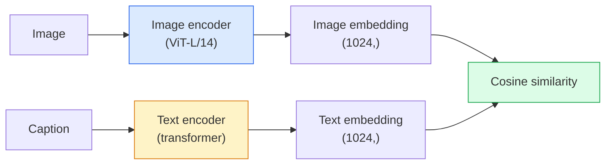

# 开放词汇视觉——CLIP

> 同时训练图像编码器与文本编码器，让匹配的（图像，说明文字）对落在共享空间中的同一点。这就是全部诀窍。

**Type:** 构建 + 使用
**Languages:** Python
**Prerequisites:** 第 4 阶段第 14 课（ViT）、第 4 阶段第 17 课（自监督学习）
**Time:** 约 45 分钟

## 学习目标

- 解释 CLIP 的双塔架构与对比学习目标
- 使用预训练 CLIP（或 SigLIP）执行零样本分类，无需任何任务特定训练
- 从零实现零样本分类：编码类别提示词、计算余弦相似度、取 Argmax
- 区分 CLIP、SigLIP、OpenCLIP 和 LLaVA/LLaMA 视觉模型，并说明 2026 年每种模型的用途

## 问题所在

传统分类器使用封闭词汇表：一个包含 1000 个类别的 ImageNet 模型只能预测这 1000 个标签。每增加一个新类别，都需要带标签数据和重新训练的分类头。

CLIP（Radford 等，OpenAI，2021）证明，使用从网络抓取的 4 亿对（图像，说明文字）进行训练，可以得到一个在推理时对任意类别集合进行分类的模型，而这些类别只需使用自然语言描述。只要写出一句话，就能给它增加一个新类别。

这种零样本迁移能力使每个现代视觉系统都从 CLIP 家族检查点开始。检测（Grounding DINO、OWL-ViT）、分割（CLIPSeg、SAM）、检索、内容审核、VLM 和文生图，全都建立在 CLIP 风格的联合嵌入之上。

## 核心概念

### 双塔架构



两个编码器最终都会通过线性投影进入同一个嵌入维度：CLIP-B/32 为 512，CLIP-L/14 为 1024。随后进行 L2 归一化并计算余弦相似度。

### 训练目标

给定包含 N 对（图像，说明文字）的批次，构造一个 NxN 相似度矩阵。训练两个编码器，使对角线上的匹配样本对具有较高相似度，非对角线上的不匹配样本对具有较低相似度。

```
sim_matrix = image_embeddings @ text_embeddings.T / tau

loss_i2t = cross_entropy(sim_matrix,       targets=arange(N))
loss_t2i = cross_entropy(sim_matrix.T,     targets=arange(N))
loss = (loss_i2t + loss_t2i) / 2
```

损失是对称的，因为图像到文本和文本到图像两种检索都应该有效。`tau`（温度）通常是一个可学习标量参数，初始化为 0.07。

### SigLIP：更好的损失函数

SigLIP（Zhai 等，2023）用逐样本对 Sigmoid 取代 Softmax：

```
loss = mean over pairs of log(1 + exp(-y_ij * sim_ij))
y_ij = +1 if matching, -1 otherwise
```

逐对计算损失，消除了 CLIP 所需的批次级归一化。小批次训练时，SigLIP 表现更好；使用相同数据量时，它能追平或超过 CLIP。

### 零样本分类

给定一个训练好的 CLIP：

1. 为每个类别构造提示词：“a photo of a {class}”。
2. 使用文本编码器编码全部类别提示词，得到形状为 (C, d) 的 `T`。
3. 编码测试图像，得到形状为 (1, d) 的 `I`。
4. 计算相似度：`I @ T.T`，形状为 (1, C)。
5. 取 Argmax，得到预测类别。

提示词工程会影响结果。OpenAI 为 ImageNet 发布了 80 个提示模板，例如“a photo of a {}”“a blurry photo of a {}”“a sketch of a {}”等。对每个类别的所有模板嵌入取平均，可以额外提高 1%–3% 的 top-1 准确率。

### 2026 年 CLIP 风格模型的用途

- **零样本分类**——直接使用。
- **图像检索**——预先编码所有图像，推理时只需嵌入查询。
- **文本条件检测**——Grounding DINO、OWL-ViT 会把 CLIP 文本塔接到检测器上。
- **文本条件分割**——CLIPSeg；SAM 通过 CLIP 接收文本提示输入。
- **VLM**——LLaVA、Qwen-VL、InternVL 把 CLIP 家族视觉编码器连接到 LLM。
- **文生图**——Stable Diffusion、DALL-E 3 使用 CLIP 文本嵌入作为条件。

一旦拥有共享嵌入空间，每一种视觉 + 语言任务都会变成距离计算。

```figure
clip-contrastive
```

## 动手构建

### 第 1 步：微型双塔模型

真正的 CLIP 由 ViT + Transformer 组成。为了让训练信号能够在 CPU 上清楚呈现，本课使用小型 MLP 处理预提取特征作为两个塔。

```python
import torch
import torch.nn as nn
import torch.nn.functional as F


class TwoTower(nn.Module):
    def __init__(self, img_in=128, txt_in=64, emb=64):
        super().__init__()
        self.image_proj = nn.Sequential(nn.Linear(img_in, 128), nn.ReLU(), nn.Linear(128, emb))
        self.text_proj = nn.Sequential(nn.Linear(txt_in, 128), nn.ReLU(), nn.Linear(128, emb))
        self.logit_scale = nn.Parameter(torch.ones([]) * 2.6592)  # ln(1/0.07)

    def forward(self, img_feats, txt_feats):
        i = F.normalize(self.image_proj(img_feats), dim=-1)
        t = F.normalize(self.text_proj(txt_feats), dim=-1)
        return i, t, self.logit_scale.exp()
```

两个投影、相同维度的输出、可学习温度，与真实 CLIP API 的形状相同。

### 第 2 步：对比损失

```python
def clip_loss(image_emb, text_emb, logit_scale):
    N = image_emb.size(0)
    sim = logit_scale * image_emb @ text_emb.T
    targets = torch.arange(N, device=sim.device)
    l_i = F.cross_entropy(sim, targets)
    l_t = F.cross_entropy(sim.T, targets)
    return (l_i + l_t) / 2
```

这是一个对称损失。logit_scale 越高，Softmax 越尖锐，置信度越高，但不稳定风险也越大。

### 第 3 步：零样本分类器

```python
@torch.no_grad()
def zero_shot_classify(model, image_feats, class_text_feats, class_names):
    """
    image_feats:      (N, img_in)
    class_text_feats: (C, txt_in)   one averaged embedding per class
    """
    i = F.normalize(model.image_proj(image_feats), dim=-1)
    t = F.normalize(model.text_proj(class_text_feats), dim=-1)
    sim = i @ t.T
    pred = sim.argmax(dim=-1)
    return [class_names[p] for p in pred.tolist()]
```

每一步只有一行。这与生产级 CLIP 检查点采用的零样本过程完全相同。

### 第 4 步：基本检查

```python
torch.manual_seed(0)
model = TwoTower()

img = torch.randn(8, 128)
txt = torch.randn(8, 64)
i, t, scale = model(img, txt)
loss = clip_loss(i, t, scale)
print(f"batch size: {i.size(0)}   loss: {loss.item():.3f}")
```

随机初始化模型的损失应该接近 `log(N) = log(8) = 2.08`，也就是尚未学习任何结构时，对称交叉熵目标的取值。

## 实际应用

到 2026 年，OpenCLIP 是社区默认选择：

```python
import open_clip
import torch
from PIL import Image

model, _, preprocess = open_clip.create_model_and_transforms("ViT-B-32", pretrained="laion2b_s34b_b79k")
tokenizer = open_clip.get_tokenizer("ViT-B-32")

image = preprocess(Image.open("dog.jpg")).unsqueeze(0)
text = tokenizer(["a photo of a dog", "a photo of a cat", "a photo of a car"])

with torch.no_grad():
    image_features = model.encode_image(image)
    text_features = model.encode_text(text)
    image_features = image_features / image_features.norm(dim=-1, keepdim=True)
    text_features = text_features / text_features.norm(dim=-1, keepdim=True)
    probs = (100.0 * image_features @ text_features.T).softmax(dim=-1)

print(probs)
```

SigLIP 更新，在小规模训练中表现更好，是新项目的优先选择：`google/siglip-base-patch16-224`。Hugging Face 同时提供两者。

## 交付成果

本课会产出：

- `outputs/prompt-zero-shot-class-picker.md`——给定类别列表与领域后，为零样本 CLIP 设计类别模板的提示词。
- `outputs/skill-image-text-retriever.md`——使用任意 CLIP 检查点构建图像嵌入索引，并支持以文本和图像查询的技能。

## 练习

1. **（简单）** 使用预训练 OpenCLIP ViT-B/32 和包含 80 个模板的提示词集合，在 CIFAR-10 上执行零样本分类。报告 top-1 准确率，预期约为 85%–90%。
2. **（中等）** 在同一个 CIFAR-10 任务上，比较单模板（“a photo of a {}”）与 80 个模板的平均嵌入。量化二者差距，并解释模板为何有效。
3. **（困难）** 构建零样本图像检索索引：使用 CLIP 嵌入 1,000 张图像，构建 FAISS 索引，并使用自然语言描述查询。针对 20 条手工编写的保留查询，报告检索 recall@5。

## 关键术语

| 术语 | 人们常说 | 实际含义 |
|------|----------------|----------------------|
| 双塔模型 | “双编码器” | 相互独立的图像与文本编码器，最后都接入相同维度的投影头 |
| 零样本 | “不进行任务特定训练” | 推理时对仅由文本描述的类别进行分类，不接触任何标签 |
| 温度 / logit_scale | “tau” | 在 Softmax 前缩放相似度矩阵的可学习标量 |
| 提示模板 | “A photo of a {}” | 包裹类别名称的自然语言模板；平均多个模板可以提高零样本准确率 |
| CLIP | “图像 + 文本模型” | OpenAI 于 2021 年发布的模型，也是 2026 年该领域的通用语言 |
| SigLIP | “Sigmoid CLIP” | 用逐对 Sigmoid 取代 Softmax，在小批次上训练得更好 |
| OpenCLIP | “开放复现” | 在 LAION 上训练的社区 CLIP 变体，是开源流水线的生产级默认选择 |
| VLM | “视觉语言模型” | CLIP 家族编码器连接 LLM，并经过训练以回答图像相关问题的模型 |

## 延伸阅读

- [《CLIP: Learning Transferable Visual Models from Natural Language Supervision》（Radford 等，2021）](https://arxiv.org/abs/2103.00020)
- [《SigLIP: Sigmoid Loss for Language-Image Pre-Training》（Zhai 等，2023）](https://arxiv.org/abs/2303.15343)
- [OpenCLIP](https://github.com/mlfoundations/open_clip)——社区代码库
- [DINOv2、CLIP 与 MAE 特征对比](https://huggingface.co/blog/dinov2)——Hugging Face 提供的并列使用场景指南
