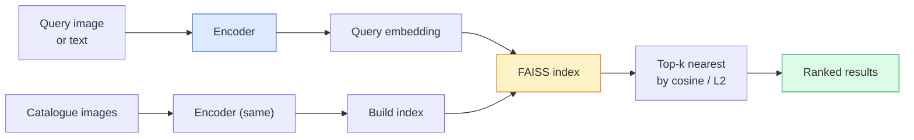

# 图像检索与度量学习

> 检索系统根据嵌入空间中的距离对候选项排序。度量学习的任务，就是塑造这个空间，让其中的距离表达你真正需要的含义。

**Type:** 构建
**Languages:** Python
**Prerequisites:** 第 4 阶段第 14 课（ViT）、第 4 阶段第 18 课（CLIP）
**Time:** 约 45 分钟

## 学习目标

- 解释三元组、对比式和基于代理的度量学习损失，并针对给定数据集选择合适方法
- 正确实现 L2 归一化与余弦相似度，并审查“同一物品”检索与“同一类别”检索之间的差别
- 构建 FAISS 索引，通过文本和图像查询，并在保留查询集上报告 recall@K
- 把 DINOv2、CLIP 和 SigLIP 用作现成嵌入骨干网络，并知道各自适合什么场景

## 问题所在

检索在生产视觉中无处不在：重复图像检测、反向图片搜索、视觉搜索（“查找相似商品”）、人脸再识别、监控中的行人再识别，以及电商场景的实例级匹配。产品问题始终相同：“给定这张查询图像，如何为目录中的候选项排序？”

两个设计决策决定了整个系统：嵌入，也就是由哪个模型生成向量；索引，也就是如何大规模寻找最近邻。到 2026 年，两者都已经成为标准化组件，DINOv2 可用于嵌入，FAISS 可用于索引。这也提高了真正的门槛：困难之处在于定义自己的应用中*什么才算相似*，再塑造嵌入空间，让距离符合这个定义。

塑造这种空间，就是度量学习。它规模不大，却能产生很高的杠杆效应。

## 核心概念

### 检索流程概览



### 四类损失函数

| 损失 | 所需数据 | 优点 | 缺点 |
|------|----------|------|------|
| **对比损失** | （锚点，正样本）+ 负样本 | 简单，适用于任意成对标签 | 负样本不够多时收敛缓慢 |
| **三元组损失** | （锚点，正样本，负样本） | 直观；可以直接控制 Margin | 困难三元组挖掘成本高 |
| **NT-Xent / InfoNCE** | 样本对 + 批内负样本挖掘 | 可以扩展到大批次 | 需要大批次或动量队列 |
| **基于代理（ProxyNCA）** | 只需类别标签 | 快速、稳定、不需要挖掘 | 小型数据集上可能对代理过拟合 |

对于大多数生产场景，应先使用预训练骨干网络；只有现成嵌入在测试集上表现不佳时，才增加度量学习微调。

### 三元组损失的正式定义

```
L = max(0, ||f(a) - f(p)||^2 - ||f(a) - f(n)||^2 + margin)
```

它把锚点 `a` 拉向正样本 `p`，推离负样本 `n`，并通过 `margin` 保证两者之间至少有一定距离。三张图像组成的结构可以推广到任意相似度排序。

样本挖掘很重要：简单三元组中的 `n` 已经离 `a` 很远，损失为零，无法教给网络任何东西。半困难挖掘仍以 `n` 为候选，要求它比 `p` 更远、但位于 Margin 内；这是 FaceNet 在 2016 年使用的方案，至今仍占主导地位。

### 余弦相似度与 L2

两种指标对应两套约定：

- **余弦相似度：** 向量之间的夹角，要求先对嵌入进行 L2 归一化。
- **L2：** 欧氏距离，可以用于原始或归一化嵌入，但通常搭配 L2 归一化和平方 L2。

对于大多数现代网络，两者等价：`||a - b||^2 = 2 - 2 cos(a, b)`，条件是 `||a|| = ||b|| = 1`。应选择与嵌入训练方式一致的约定；混用两者会悄无声息地改变“最近”的含义。

### Recall@K

标准检索指标为：

```
recall@K = fraction of queries where at least one correct match is in the top K results
```

应并列报告 recall@1、@5 和 @10。如果 recall@10 高于 0.95，而 recall@1 低于 0.5，说明嵌入空间结构正确，但排序噪声较大，可以尝试更长时间的微调或增加重排步骤。

对于重复检测，Precision@K 更重要，因为每个假阳性都会成为用户可见的错误；对于视觉搜索，Recall@K 才是产品指标。

### 一段话理解 FAISS

FAISS 全称 Facebook AI Similarity Search，是最近邻搜索的事实标准库。常见索引有三种：

- `IndexFlatIP` / `IndexFlatL2`——暴力搜索、精确、无需训练，适用于约一百万个以内的向量。
- `IndexIVFFlat`——把向量划分到 K 个单元，只搜索最接近的少数单元。近似但快速，需要训练数据。
- `IndexHNSW`——基于图，处理大量查询时速度最快，但索引占用较大。

10 万个向量通常使用基于余弦相似度的 `IndexFlatIP`；1000 万个向量使用 `IndexIVFFlat`；一亿以上则结合产品量化（`IndexIVFPQ`）。

### 实例级检索与类别级检索

同一个名称背后，其实是两个截然不同的问题：

- **类别级检索**——“在目录中寻找猫”。它关注类别条件相似性，现成的 CLIP / DINOv2 嵌入通常表现良好。
- **实例级检索**——“在目录中找到*这个确切商品*”。它需要区分同一类别中视觉上非常相似的物体；现成嵌入通常表现不足，度量学习微调会很重要。

选择模型前，应始终先确认自己解决的是哪一种问题。

```figure
metric-embedding
```

## 动手构建

### 第 1 步：三元组损失

```python
import torch
import torch.nn.functional as F

def triplet_loss(anchor, positive, negative, margin=0.2):
    d_ap = F.pairwise_distance(anchor, positive, p=2)
    d_an = F.pairwise_distance(anchor, negative, p=2)
    return F.relu(d_ap - d_an + margin).mean()
```

只有一行，既可以处理经过 L2 归一化的嵌入，也可以处理原始嵌入。

### 第 2 步：半困难样本挖掘

给定一批嵌入及其标签，为每个锚点找出最困难的半困难负样本。

```python
def semi_hard_negatives(emb, labels, margin=0.2):
    dist = torch.cdist(emb, emb)
    same_class = labels[:, None] == labels[None, :]
    diff_class = ~same_class
    N = emb.size(0)

    positives = dist.clone()
    positives[~same_class] = float("-inf")
    positives.fill_diagonal_(float("-inf"))
    pos_idx = positives.argmax(dim=1)

    semi_hard = dist.clone()
    semi_hard[same_class] = float("inf")
    d_ap = dist[torch.arange(N), pos_idx].unsqueeze(1)
    semi_hard[dist <= d_ap] = float("inf")
    neg_idx = semi_hard.argmin(dim=1)

    fallback_mask = semi_hard[torch.arange(N), neg_idx] == float("inf")
    if fallback_mask.any():
        hardest = dist.clone()
        hardest[same_class] = float("inf")
        neg_idx = torch.where(fallback_mask, hardest.argmin(dim=1), neg_idx)
    return pos_idx, neg_idx
```

每个锚点都会得到同类别中距离最远的正样本，以及一个比正样本更远、但仍位于 Margin 内的半困难负样本。

### 第 3 步：Recall@K

```python
def recall_at_k(query_emb, gallery_emb, query_labels, gallery_labels, k=1):
    sim = query_emb @ gallery_emb.T
    _, top_k = sim.topk(k, dim=-1)
    matches = (gallery_labels[top_k] == query_labels[:, None]).any(dim=-1)
    return matches.float().mean().item()
```

对经过 L2 归一化的嵌入按内积选 Top-k，等价于按余弦相似度选 Top-k。函数返回至少包含一个正确邻居的查询所占平均比例。

### 第 4 步：组装完整流程

```python
import torch
import torch.nn as nn
from torch.optim import Adam

class Encoder(nn.Module):
    def __init__(self, in_dim=128, emb_dim=64):
        super().__init__()
        self.net = nn.Sequential(
            nn.Linear(in_dim, 128), nn.ReLU(),
            nn.Linear(128, emb_dim),
        )

    def forward(self, x):
        return F.normalize(self.net(x), dim=-1)

torch.manual_seed(0)
num_classes = 6
protos = F.normalize(torch.randn(num_classes, 128), dim=-1)

def sample_batch(bs=32):
    labels = torch.randint(0, num_classes, (bs,))
    x = protos[labels] + 0.15 * torch.randn(bs, 128)
    return x, labels

enc = Encoder()
opt = Adam(enc.parameters(), lr=3e-3)

for step in range(200):
    x, y = sample_batch(32)
    emb = enc(x)
    pos_idx, neg_idx = semi_hard_negatives(emb, y)
    loss = triplet_loss(emb, emb[pos_idx], emb[neg_idx])
    opt.zero_grad(); loss.backward(); opt.step()
```

经过几百步后，嵌入会形成每个类别一个簇的结构。

## 实际应用

2026 年的生产技术栈如下：

- **DINOv2 + FAISS**——通用视觉检索，开箱即用。
- **CLIP + FAISS**——查询来自文本时使用。
- **微调后的 DINOv2 + FAISS**——实例级检索、人脸再识别、时尚与电商场景。
- **Milvus / Weaviate / Qdrant**——对 FAISS 或 HNSW 进行封装的托管向量数据库。

当前最佳实例检索方案是：使用 DINOv2 骨干网络，增加嵌入 Head，以实例标签对上的三元组损失或 InfoNCE 进行微调，再把结果索引到 FAISS 中。

## 交付成果

本课会产出：

- `outputs/prompt-retrieval-loss-picker.md`——针对给定检索问题，在三元组损失 / InfoNCE / ProxyNCA 中作出选择的提示词。
- `outputs/skill-recall-at-k-runner.md`——使用正确的数据契约和训练/验证/Gallery 划分，为 recall@K 生成干净评估工具的技能。

## 练习

1. **（简单）** 运行上面的玩具示例，使用 PCA 绘制训练前后的嵌入，观察六个簇如何形成。
2. **（中等）** 实现 ProxyNCA 损失：每个类别对应一个可学习“代理”，对代理余弦相似度计算标准交叉熵。在玩具数据上与三元组损失比较收敛速度。
3. **（困难）** 使用 HuggingFace 的 DINOv2 嵌入 1,000 张 ImageNet 验证图像，构建 FAISS Flat 索引，并在同一批图像上分别以 K ∈ {1, 5, 10} 执行自身查询，结果应为 1.0；再用 ImageNet 标签作为真值，在保留划分上查询。

## 关键术语

| 术语 | 人们常说 | 实际含义 |
|------|----------------|----------------------|
| 度量学习 | “塑造空间” | 训练编码器，使其输出空间中的距离符合目标相似性 |
| 三元组损失 | “拉近与推远” | L = max(0, d(a, p) - d(a, n) + margin)，经典度量学习损失 |
| 半困难挖掘 | “有用的负样本” | 比正样本距锚点更远、但仍位于 Margin 内的负样本；实践中信息量最大 |
| 基于代理的损失 | “类别原型” | 每个类别对应一个可学习代理，再对与代理的相似度计算交叉熵；无需样本对挖掘 |
| Recall@K | “Top-K 命中率” | Top K 结果中至少出现一个正确结果的查询所占比例 |
| 实例检索 | “找到这个确切物体” | 细粒度匹配；现成特征通常表现不足 |
| FAISS | “最近邻库” | Facebook 的最近邻库，支持精确与近似索引 |
| HNSW | “图索引” | 分层可导航小世界图；近似最近邻查询速度快，内存开销较小 |

## 延伸阅读

- [《FaceNet: A Unified Embedding for Face Recognition》（Schroff 等，2015）](https://arxiv.org/abs/1503.03832)——提出三元组损失与半困难挖掘的论文
- [《In Defense of the Triplet Loss for Person Re-Identification》（Hermans 等，2017）](https://arxiv.org/abs/1703.07737)——三元组微调的实用指南
- [FAISS 文档](https://github.com/facebookresearch/faiss/wiki)——涵盖每种索引与权衡
- [《SMoT: Metric Learning Taxonomy》（Kim 等，2021）](https://arxiv.org/abs/2010.06927)——现代损失及其联系的综述
