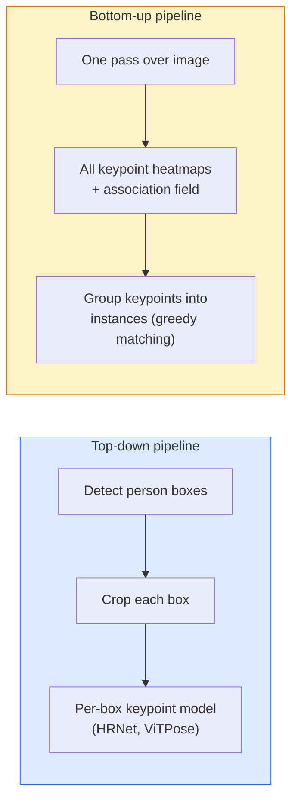

# 关键点检测与姿态估计

> 姿态是一组有顺序的关键点，关键点检测器则是一个热力图回归器，其余只是簿记工作。

**Type:** 构建
**Languages:** Python
**Prerequisites:** 第 4 阶段第 06 课（目标检测）、第 4 阶段第 07 课（U-Net）
**Time:** 约 45 分钟

## 学习目标

- 区分自顶向下与自底向上的姿态估计，并说明各自适用的场景
- 使用每个关键点对应一个高斯目标的方式，回归 K 张关键点热力图，并在推理时提取关键点坐标
- 解释肢体亲和场（PAF），以及自底向上流水线如何把关键点关联成不同实例
- 使用 MediaPipe Pose 或 MMPose 进行生产级关键点估计，并理解其输出格式

## 问题所在

关键点任务隐藏在许多名称背后：人体姿态（17 个身体关节）、面部关键点（68 或 478 个点）、手部姿态（21 个点）、动物姿态、机器人物体姿态，以及医学解剖标志点。它们都具有相同结构：检测物体上的 K 个离散点，并输出各点的 (x, y) 坐标。

姿态估计是动作捕捉、健身应用、体育分析、手势控制、动画、AR 试穿和机器人抓取的基础。二维姿态已经达到成熟生产水平；从单个相机估计世界坐标中的关节位置，也就是三维姿态，仍处于当前研究前沿。

工程上的核心问题是规模。单张图像中的单人姿态只需 20 ms；拥挤场景中以 30 fps 处理多人姿态，则是另一个需要不同架构的问题。

## 核心概念

### 自顶向下与自底向上



- **自顶向下**——先检测人物，再对每个人物裁剪区域运行关键点模型。准确率最高，但成本随人数线性增长。
- **自底向上**——一次前向传播预测所有关键点和一个关联场，再把关键点分组。无论场景中有多少人，耗时基本恒定。

自顶向下模型（HRNet、ViTPose）是准确率领先者；自底向上模型（OpenPose、HigherHRNet）则是拥挤场景中的吞吐量领先者。

### 热力图回归

模型不直接回归 `(x, y)`，而是为每个关键点预测一张 `H x W` 热力图，真实位置周围以高斯斑点表示。

```
target[k, y, x] = exp(-((x - cx_k)^2 + (y - cy_k)^2) / (2 sigma^2))
```

推理时，每张热力图的 Argmax 就是预测关键点位置。

热力图优于直接回归，是因为网络的空间结构，也就是卷积特征图，可以自然对齐空间输出。高斯目标也具有正则化效果：很小的定位误差只会产生很小的损失，而不是直接归零。

### 亚像素定位

Argmax 只能给出整数坐标。若要获得亚像素精度，可以用 Argmax 及其邻居拟合抛物线，或者使用经典偏移方向 `(dx, dy) = 0.25 * (heatmap[y, x+1] - heatmap[y, x-1], ...)` 进行细化。

### 肢体亲和场（PAF）

这是 OpenPose 用于自底向上关联的技巧。对于每对相连的关键点，例如左肩与左肘，预测一个双通道场，编码从一个点指向另一个点的单位向量。要把肩部与肘部联系起来，可以沿候选点对之间的直线积分 PAF，积分值最高的一对就会匹配。

```
For each connection (limb):
  PAF channels: 2 (unit vector x, y)
  Line integral: sum over sample points of (PAF . line_direction)
  Higher integral = stronger match
```

这个方法很优雅，而且无需针对每个人分别裁剪，就能扩展到任意拥挤程度。

### COCO 关键点

这是标准人体姿态数据集，每个人包含 17 个关键点，使用 PCK（正确关键点百分比）和 OKS（目标关键点相似度）作为指标。OKS 相当于关键点版本的 IoU，也是 COCO mAP@OKS 报告的指标。

### 二维与三维

- **二维姿态**——图像坐标，已经达到生产级质量（MediaPipe、HRNet、ViTPose）。
- **三维姿态**——世界/相机坐标，仍是活跃研究方向。常见方法包括：
  - 使用小型 MLP 把二维预测提升到三维（VideoPose3D）。
  - 直接从图像回归三维坐标（PyMAF、MHFormer）。
  - 使用多视角系统（CMU Panoptic）生成真值。

```figure
cv3-pose-heatmap
```

## 动手构建

### 第 1 步：高斯热力图目标

```python
import numpy as np
import torch

def gaussian_heatmap(size, cx, cy, sigma=2.0):
    yy, xx = np.meshgrid(np.arange(size), np.arange(size), indexing="ij")
    return np.exp(-((xx - cx) ** 2 + (yy - cy) ** 2) / (2 * sigma ** 2)).astype(np.float32)

hm = gaussian_heatmap(64, 32, 32, sigma=2.0)
print(f"peak: {hm.max():.3f} at ({hm.argmax() % 64}, {hm.argmax() // 64})")
```

把每个关键点的热力图沿通道轴堆叠，就得到完整目标张量。

### 第 2 步：微型关键点 Head

下面是一个 U-Net 风格模型，输出 K 个热力图通道。

```python
import torch.nn as nn
import torch.nn.functional as F

class TinyKeypointNet(nn.Module):
    def __init__(self, num_keypoints=4, base=16):
        super().__init__()
        self.down1 = nn.Sequential(nn.Conv2d(3, base, 3, 2, 1), nn.ReLU(inplace=True))
        self.down2 = nn.Sequential(nn.Conv2d(base, base * 2, 3, 2, 1), nn.ReLU(inplace=True))
        self.mid = nn.Sequential(nn.Conv2d(base * 2, base * 2, 3, 1, 1), nn.ReLU(inplace=True))
        self.up1 = nn.ConvTranspose2d(base * 2, base, 2, 2)
        self.up2 = nn.ConvTranspose2d(base, num_keypoints, 2, 2)

    def forward(self, x):
        h1 = self.down1(x)
        h2 = self.down2(h1)
        h3 = self.mid(h2)
        u1 = self.up1(h3)
        return self.up2(u1)
```

输入形状为 `(N, 3, H, W)`，输出形状为 `(N, K, H, W)`。损失是在高斯目标上计算的逐像素 MSE。

### 第 3 步：推理——提取关键点坐标

```python
def heatmap_to_coords(heatmaps):
    """
    heatmaps: (N, K, H, W)
    returns:  (N, K, 2) float coordinates in image pixels
    """
    N, K, H, W = heatmaps.shape
    hm = heatmaps.reshape(N, K, -1)
    idx = hm.argmax(dim=-1)
    ys = (idx // W).float()
    xs = (idx % W).float()
    return torch.stack([xs, ys], dim=-1)

coords = heatmap_to_coords(torch.randn(2, 4, 32, 32))
print(f"coords: {coords.shape}")  # (2, 4, 2)
```

推理时只需一行。若要进行亚像素细化，可以在 Argmax 周围插值。

### 第 4 步：合成关键点数据集

任务很简单：在白色画布上绘制四个点，并让模型学会预测它们。

```python
def make_synthetic_sample(size=64):
    img = np.ones((3, size, size), dtype=np.float32)
    rng = np.random.default_rng()
    kps = rng.integers(8, size - 8, size=(4, 2))
    for cx, cy in kps:
        img[:, cy - 2:cy + 2, cx - 2:cx + 2] = 0.0
    hms = np.stack([gaussian_heatmap(size, cx, cy) for cx, cy in kps])
    return img, hms, kps
```

这个任务足够简单，微型模型一分钟内就能学会。

### 第 5 步：训练

```python
model = TinyKeypointNet(num_keypoints=4)
opt = torch.optim.Adam(model.parameters(), lr=3e-3)

for step in range(200):
    batch = [make_synthetic_sample() for _ in range(16)]
    imgs = torch.from_numpy(np.stack([b[0] for b in batch]))
    hms = torch.from_numpy(np.stack([b[1] for b in batch]))
    pred = model(imgs)
    # Upsample pred to full resolution
    pred = F.interpolate(pred, size=hms.shape[-2:], mode="bilinear", align_corners=False)
    loss = F.mse_loss(pred, hms)
    opt.zero_grad(); loss.backward(); opt.step()
```

## 实际应用

- **MediaPipe Pose**——Google 的生产级姿态估计器，提供 WebGL 与移动端运行时，延迟低于 10 ms。
- **MMPose**（OpenMMLab）——完整的研究代码库，包含各种当前最佳架构及预训练权重。
- **YOLOv8-pose**——最快的实时多人姿态估计方案，只需一次前向传播。
- **transformers HumanDPT / PoseAnything**——面向开放词汇姿态的新型视觉语言方法，可以处理任意物体和任意关键点集合。

## 交付成果

本课会产出：

- `outputs/prompt-pose-stack-picker.md`——根据延迟、拥挤程度和二维/三维需求，在 MediaPipe / YOLOv8-pose / HRNet / ViTPose 中作出选择的提示词。
- `outputs/skill-heatmap-to-coords.md`——编写每个生产级姿态模型都使用的亚像素热力图到坐标转换程序的技能。

## 练习

1. **（简单）** 在合成四点数据集上训练微型关键点模型，报告 200 步后预测关键点与真实关键点之间的平均 L2 误差。
2. **（中等）** 加入亚像素细化：给定 Argmax 位置，使用相邻像素分别沿 x 和 y 拟合一维抛物线。报告相对于整数 Argmax 的精度提升。
3. **（困难）** 构建双人合成数据集，每张图像包含两个四关键点实例。训练一个使用 PAF 的自底向上流水线，预测每个关键点属于哪个实例，并使用 OKS 评估。

## 关键术语

| 术语 | 人们常说 | 实际含义 |
|------|----------------|----------------------|
| 关键点 | “标志点” | 物体上一个具有特定顺序的点，例如关节、角点或特征点 |
| 姿态 | “骨架” | 属于同一个实例的一组有序关键点 |
| 自顶向下 | “先检测，再估计姿态” | 两阶段流水线：人物检测器 + 逐裁剪关键点模型，准确率最高 |
| 自底向上 | “先估计姿态，再分组” | 单次前向传播预测所有关键点，再进行分组；耗时不随人群规模增长 |
| 热力图 | “高斯目标” | 每个关键点对应一张 H x W 张量，峰值位于真实位置，是首选回归目标 |
| PAF | “肢体亲和场” | 编码肢体方向的双通道单位向量场，用于把关键点组合成实例 |
| OKS | “关键点 IoU” | 目标关键点相似度，是 COCO 使用的姿态指标 |
| HRNet | “高分辨率网络” | 主流自顶向下关键点架构，在整个网络中始终保留高分辨率特征 |

## 延伸阅读

- [《OpenPose》（Cao 等，2017）](https://arxiv.org/abs/1812.08008)——使用 PAF 的自底向上方法，至今仍是该方案最好的讲解
- [《HRNet》（Sun 等，2019）](https://arxiv.org/abs/1902.09212)——自顶向下参考架构
- [《ViTPose》（Xu 等，2022）](https://arxiv.org/abs/2204.12484)——使用普通 ViT 作为姿态骨干网络，在许多基准上处于当前最佳水平
- [MediaPipe Pose](https://developers.google.com/mediapipe/solutions/vision/pose_landmarker)——生产级实时姿态估计，是 2026 年部署速度最快的技术栈
