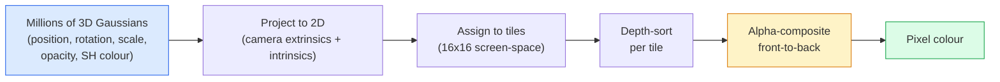

# 从零实现 3D Gaussian Splatting

> 场景由数百万个三维高斯组成。每个高斯都有位置、方向、尺度、不透明度，以及随观察方向变化的颜色。将它们光栅化，再让梯度穿过光栅化过程反向传播，就完成了。

**Type:** 构建
**Languages:** Python
**Prerequisites:** 第 4 阶段第 13 课（3D 视觉与 NeRF）、第 1 阶段第 12 课（张量运算）、第 4 阶段第 10 课（扩散基础，可选）
**Time:** 约 90 分钟

## 学习目标

- 解释到 2026 年，3D Gaussian Splatting 为何取代 NeRF，成为照片级真实感三维重建的生产默认方案
- 说出每个高斯的六类参数（位置、旋转四元数、尺度、不透明度、球谐颜色、可选特征），以及每类参数贡献多少个浮点数
- 使用 `alpha` 合成从零实现二维 Gaussian Splatting 光栅化器，再说明三维情况如何投影到同一个循环
- 使用 `nerfstudio`、`gsplat` 或 `SuperSplat` 从 20–50 张照片重建场景，并导出到 glTF 的 `KHR_gaussian_splatting` 扩展，或 OpenUSD 26.03 的 `UsdVolParticleField3DGaussianSplat` Schema

## 问题所在

NeRF 把场景存储在 MLP 的权重中。渲染每个像素，都需要沿一条射线查询 MLP 数百次。训练需要数小时，每张图像渲染需要数秒，而且权重无法直接编辑——如果想移动场景中的椅子，就必须重新训练。

3D Gaussian Splatting（Kerbl、Kopanas、Leimkühler、Drettakis，SIGGRAPH 2023）取代了这一切。场景由一组显式三维高斯表示；渲染是能以 100 fps 以上运行的 GPU 光栅化；训练只需数分钟；编辑则十分直接，平移一组高斯就相当于移动了椅子。到 2026 年，Khronos Group 已批准 Gaussian Splat 的 glTF 扩展，OpenUSD 26.03 提供 Gaussian Splat Schema，Zillow 与 Apartments.com 用它渲染房地产，大多数三维重建新论文也都是核心 3DGS 思想的变体。

思维模型很简单，但数学细节足够繁多，以至于多数介绍都从光栅化开始，直接略过投影与球谐函数。本课会完整构建全部过程——先实现二维版本，再扩展到三维。

## 核心概念

### 一个高斯携带哪些信息

一个三维高斯是空间中的参数化斑点，具有以下属性：

```
position         mu         (3,)    centre in world coordinates
rotation         q          (4,)    unit quaternion encoding orientation
scale            s          (3,)    log-scales per axis (exponentiated at render time)
opacity          alpha      (1,)    post-sigmoid opacity [0, 1]
SH coefficients  c_lm       (3 * (L+1)^2,)   view-dependent colour
```

旋转与尺度会构造一个 3x3 协方差矩阵：`Sigma = R S S^T R^T`，它定义了高斯在三维空间中的形状。球谐函数允许颜色随观察方向变化，从而无需存储逐视角纹理，也能表示镜面高光、细微光泽和视角相关辉光。球谐阶数为 3 时，每个颜色通道有 16 个系数，单是颜色就需要每个高斯保存 48 个浮点数。

一个场景通常包含 100 万到 500 万个高斯。每个高斯大约保存 60 个浮点数，也就是 3 + 4 + 3 + 1 + 48 + 其他信息。一个包含 500 万个高斯的场景约占 240 MB，远小于具有逐点纹理的等价点云，也比需要重新高分辨率渲染的 NeRF MLP 权重小一个数量级。

### 光栅化，而非射线步进



共五个步骤，而且全部适合 GPU。无需为每个像素查询 MLP；单张 RTX 3080 Ti 就能以 147 fps 渲染 600 万个 Splat。

### 投影步骤

世界坐标中位置为 `mu`、三维协方差为 `Sigma` 的三维高斯，会投影成屏幕位置为 `mu'`、二维协方差为 `Sigma'` 的二维高斯：

```
mu' = project(mu)
Sigma' = J W Sigma W^T J^T          (2 x 2)

W = viewing transform (rotation + translation of camera)
J = Jacobian of the perspective projection at mu'
```

二维高斯的覆盖范围是一个椭圆，其轴方向由 `Sigma'` 的特征向量决定。椭圆内的每个像素都会接收该高斯的贡献，权重为 `exp(-0.5 * (p - mu')^T Sigma'^-1 (p - mu'))`。

### Alpha 合成规则

对于一个像素，先把覆盖它的高斯从后向前排序；也可以使用逆公式从前向后。颜色通过自 1980 年代以来所有半透明光栅化器都使用的同一方程合成：

```
C_pixel = sum_i alpha_i * T_i * c_i

T_i = prod_{j < i} (1 - alpha_j)       transmittance up to i
alpha_i = opacity_i * exp(-0.5 * d^T Sigma'^-1 d)   local contribution
c_i = eval_SH(SH_i, view_direction)    view-dependent colour
```

这与 NeRF 的体渲染使用的是**同一个方程**，区别只在于：这里沿射线处理的是显式稀疏高斯集合，而不是稠密采样点。正因为二者积分的是同一条辐射场方程，渲染质量才能与 NeRF 相当。

### 为什么它可微

每一个步骤——投影、图块分配、Alpha 合成、球谐函数求值——都可以相对于高斯参数求导。给定真实图像后，计算渲染像素损失，让梯度穿过光栅化器反向传播，再使用梯度下降更新全部 `(mu, q, s, alpha, c_lm)`。经过约 30,000 次迭代，高斯会找到合适的位置、尺度和颜色。

### 增密与剪枝

固定数量的高斯无法覆盖复杂场景，因此训练过程包含两种自适应机制：

- 当某个高斯的梯度幅度较高但尺度较小时，在当前位置**克隆**它——这里的重建需要更多细节。
- 当一个大尺度高斯的梯度较高时，把它**拆分**成两个更小的高斯——单个大高斯过于平滑，无法拟合该区域。
- **剪除**不透明度降到阈值以下的高斯——它们没有贡献。

增密每隔 N 次迭代执行一次。一个场景通常从运动恢复结构点初始化的约 10 万个高斯开始，在训练结束时增长到 100 万至 500 万个。

### 一段话理解球谐函数

视角相关颜色是单位球面上的函数 `c(direction)`。球谐函数是球面上的傅里叶基。截断到阶数 `L` 后，每个通道会有 `(L+1)^2` 个基函数。渲染新视角时，只需把已学习的球谐系数，与在当前观察方向上求值得到的基函数进行点积，即可得到颜色。阶数 0 表示一个系数，也就是恒定颜色；阶数 3 表示 16 个系数，足以捕捉朗伯着色、镜面反射和轻微反射。3D Gaussian Splatting 论文默认使用阶数 3。

### 2026 年的生产技术栈

```
1. Capture         smartphone / DJI drone / handheld scanner
2. SfM / MVS       COLMAP or GLOMAP derives camera poses + sparse points
3. Train 3DGS      nerfstudio / gsplat / inria official / PostShot (~10-30 min on RTX 4090)
4. Edit            SuperSplat / SplatForge (clean floaters, segment)
5. Export          .ply -> glTF KHR_gaussian_splatting or .usd (OpenUSD 26.03)
6. View            Cesium / Unreal / Babylon.js / Three.js / Vision Pro
```

### 四维与生成式变体

- **4D Gaussian Splatting**——高斯会随时间变化，用于体积视频（Superman 2026、A$AP Rocky 的“Helicopter”）。
- **生成式 Splat**——文生 Splat 模型，例如 World Labs 的 Marble，可以凭空生成完整场景。
- **3D Gaussian Unscented Transform**——NVIDIA NuRec 面向自动驾驶仿真的变体。

```figure
cv3-gaussian-splat
```

## 动手构建

### 第 1 步：二维高斯

先构建二维光栅化器。三维情况在投影之后会归结为同一个问题。

```python
import torch
import torch.nn as nn
import torch.nn.functional as F


def eval_2d_gaussian(means, covs, points):
    """
    means:  (G, 2)      centres
    covs:   (G, 2, 2)   covariance matrices
    points: (H, W, 2)   pixel coordinates
    returns: (G, H, W)  density at every pixel for every Gaussian
    """
    G = means.size(0)
    H, W, _ = points.shape
    flat = points.view(-1, 2)
    inv = torch.linalg.inv(covs)
    diff = flat[None, :, :] - means[:, None, :]
    d = torch.einsum("gpi,gij,gpj->gp", diff, inv, diff)
    density = torch.exp(-0.5 * d)
    return density.view(G, H, W)
```

`einsum` 会为每个（高斯，像素）对计算二次型 `diff^T Sigma^-1 diff`。

### 第 2 步：二维 Splatting 光栅化器

从前向后进行 Alpha 合成。二维空间中的深度没有实际含义，因此使用每个高斯一个可学习标量来确定顺序。

```python
def rasterise_2d(means, covs, colours, opacities, depths, image_size):
    """
    means:     (G, 2)
    covs:      (G, 2, 2)
    colours:   (G, 3)
    opacities: (G,)     in [0, 1]
    depths:    (G,)     per-Gaussian scalar used for ordering
    image_size: (H, W)
    returns:   (H, W, 3) rendered image
    """
    H, W = image_size
    yy, xx = torch.meshgrid(
        torch.arange(H, dtype=torch.float32, device=means.device),
        torch.arange(W, dtype=torch.float32, device=means.device),
        indexing="ij",
    )
    points = torch.stack([xx, yy], dim=-1)

    densities = eval_2d_gaussian(means, covs, points)
    alphas = opacities[:, None, None] * densities
    alphas = alphas.clamp(0.0, 0.99)

    order = torch.argsort(depths)
    alphas = alphas[order]
    colours_sorted = colours[order]

    T = torch.ones(H, W, device=means.device)
    out = torch.zeros(H, W, 3, device=means.device)
    for i in range(means.size(0)):
        a = alphas[i]
        out += (T * a)[..., None] * colours_sorted[i][None, None, :]
        T = T * (1.0 - a)
    return out
```

它并不快——真正实现会使用基于图块的 CUDA 内核——但数学完全正确，而且整体可微。

### 第 3 步：可训练二维 Splat 场景

```python
class Splats2D(nn.Module):
    def __init__(self, num_splats=128, image_size=64, seed=0):
        super().__init__()
        g = torch.Generator().manual_seed(seed)
        H, W = image_size, image_size
        self.means = nn.Parameter(torch.rand(num_splats, 2, generator=g) * torch.tensor([W, H]))
        self.log_scale = nn.Parameter(torch.ones(num_splats, 2) * math.log(2.0))
        self.rot = nn.Parameter(torch.zeros(num_splats))  # single angle in 2D
        self.colour_logits = nn.Parameter(torch.randn(num_splats, 3, generator=g) * 0.5)
        self.opacity_logit = nn.Parameter(torch.zeros(num_splats))
        self.depth = nn.Parameter(torch.rand(num_splats, generator=g))

    def covs(self):
        s = torch.exp(self.log_scale)
        c, si = torch.cos(self.rot), torch.sin(self.rot)
        R = torch.stack([
            torch.stack([c, -si], dim=-1),
            torch.stack([si, c], dim=-1),
        ], dim=-2)
        S = torch.diag_embed(s ** 2)
        return R @ S @ R.transpose(-1, -2)

    def forward(self, image_size):
        covs = self.covs()
        colours = torch.sigmoid(self.colour_logits)
        opacities = torch.sigmoid(self.opacity_logit)
        return rasterise_2d(self.means, covs, colours, opacities, self.depth, image_size)
```

`log_scale`、`opacity_logit` 和 `colour_logits` 都是不受约束的参数，只在渲染时通过正确激活函数映射。这是每种 3DGS 实现都会采用的标准模式。

### 第 4 步：让二维高斯拟合目标图像

```python
import math
import numpy as np

def make_target(size=64):
    yy, xx = np.meshgrid(np.arange(size), np.arange(size), indexing="ij")
    img = np.zeros((size, size, 3), dtype=np.float32)
    # Red circle
    mask = (xx - 20) ** 2 + (yy - 20) ** 2 < 10 ** 2
    img[mask] = [1.0, 0.2, 0.2]
    # Blue square
    mask = (np.abs(xx - 45) < 8) & (np.abs(yy - 40) < 8)
    img[mask] = [0.2, 0.3, 1.0]
    return torch.from_numpy(img)


target = make_target(64)
model = Splats2D(num_splats=64, image_size=64)
opt = torch.optim.Adam(model.parameters(), lr=0.05)

for step in range(200):
    pred = model((64, 64))
    loss = F.mse_loss(pred, target)
    opt.zero_grad(); loss.backward(); opt.step()
    if step % 40 == 0:
        print(f"step {step:3d}  mse {loss.item():.4f}")
```

经过 200 步，64 个高斯会逐渐落到两个形状之中。这就是全部核心思想：对显式几何原语执行梯度下降。

### 第 5 步：从二维扩展到三维

三维扩展沿用同一个循环，只增加以下内容：

1. 每个高斯的旋转不再是一个角度，而是四元数。
2. 协方差为 `R S S^T R^T`，其中 `R` 由四元数构造，`S = diag(exp(log_scale))`。
3. 投影 `(mu, Sigma) -> (mu', Sigma')` 使用相机外参与在 `mu` 处计算的透视投影 Jacobian。
4. 颜色变为球谐展开；在观察方向上求值。
5. 深度排序使用相机空间中的真实 z，而不是可学习标量。

每种生产实现（`gsplat`、`inria/gaussian-splatting`、`nerfstudio`）都会使用基于图块的 CUDA 内核，在 GPU 上完成完全相同的过程。

### 第 6 步：球谐函数求值

最高阶数为 3 的球谐基，每个通道包含 16 项。求值过程如下：

```python
def eval_sh_degree_3(sh_coeffs, dirs):
    """
    sh_coeffs: (..., 16, 3)   last dim is RGB channels
    dirs:      (..., 3)       unit vectors
    returns:   (..., 3)
    """
    C0 = 0.282094791773878
    C1 = 0.488602511902920
    C2 = [1.092548430592079, 1.092548430592079,
          0.315391565252520, 1.092548430592079,
          0.546274215296039]
    x, y, z = dirs[..., 0], dirs[..., 1], dirs[..., 2]
    x2, y2, z2 = x * x, y * y, z * z
    xy, yz, xz = x * y, y * z, x * z

    result = C0 * sh_coeffs[..., 0, :]
    result = result - C1 * y[..., None] * sh_coeffs[..., 1, :]
    result = result + C1 * z[..., None] * sh_coeffs[..., 2, :]
    result = result - C1 * x[..., None] * sh_coeffs[..., 3, :]

    result = result + C2[0] * xy[..., None] * sh_coeffs[..., 4, :]
    result = result + C2[1] * yz[..., None] * sh_coeffs[..., 5, :]
    result = result + C2[2] * (2.0 * z2 - x2 - y2)[..., None] * sh_coeffs[..., 6, :]
    result = result + C2[3] * xz[..., None] * sh_coeffs[..., 7, :]
    result = result + C2[4] * (x2 - y2)[..., None] * sh_coeffs[..., 8, :]

    # degree 3 terms omitted here for brevity; full 16-coefficient version in the code file
    return result
```

学习得到的 `sh_coeffs` 保存该高斯“在每个方向上的颜色”。渲染时，根据当前观察方向对它求值，得到一个三维 RGB 向量。

## 实际应用

真实 3DGS 项目可以使用 `gsplat`（Meta）或 `nerfstudio`：

```bash
pip install nerfstudio gsplat
ns-download-data example
ns-train splatfacto --data path/to/data
```

`splatfacto` 是 nerfstudio 的 3DGS 训练器。一个典型场景在 RTX 4090 上需要 10–30 分钟训练。

到 2026 年，重要的导出选项包括：

- `.ply`——原始高斯点云，兼容性好，文件最大。
- `.splat`——PlayCanvas / SuperSplat 的量化格式。
- glTF `KHR_gaussian_splatting`——Khronos 标准，可在不同查看器间移植（2026 年 2 月 RC）。
- OpenUSD `UsdVolParticleField3DGaussianSplat`——USD 原生格式，适用于 NVIDIA Omniverse 与 Vision Pro 流水线。

对于四维/动态场景，`4DGS` 和 `Deformable-3DGS` 会用随时间变化的均值与不透明度扩展同一套机制。

## 交付成果

本课会产出：

- `outputs/prompt-3dgs-capture-planner.md`——针对给定场景类型规划拍摄过程，包括照片数量、相机路径和光照的提示词。
- `outputs/skill-3dgs-export-router.md`——根据下游查看器或引擎，在 `.ply` / `.splat` / glTF / USD 中选择正确导出格式的技能。

## 练习

1. **（简单）** 在另一张合成图像上运行上述二维 Splat 训练器。让 `num_splats` 分别取 `[16, 64, 256]`，绘制每种设置下 MSE 随步骤变化的曲线，并找出收益开始递减的位置。
2. **（中等）** 扩展二维光栅化器，使每个高斯的 RGB 颜色可以通过二阶谐波随标量“观察角度”变化。在一对目标图像上训练，并验证模型能够重建两者。
3. **（困难）** 克隆 `nerfstudio`，使用你拍摄的任意场景（桌面、植物、人脸、房间）的 20 张照片训练 `splatfacto`。导出为 glTF `KHR_gaussian_splatting`，并在查看器（Three.js `GaussianSplats3D`、SuperSplat、Babylon.js V9）中打开。报告训练时间、高斯数量和渲染 fps。

## 关键术语

| 术语 | 人们常说 | 实际含义 |
|------|----------------|----------------------|
| 3DGS | “Gaussian Splats” | 由数百万个三维高斯组成的显式场景表示，每个高斯包含位置、旋转、尺度、不透明度和球谐颜色 |
| 协方差 | “高斯的形状” | `Sigma = R S S^T R^T`；表示一个高斯的方向与各向异性尺度 |
| Alpha 合成 | “从后向前混合” | 与 NeRF 体渲染相同的方程，只是作用于显式稀疏集合 |
| 增密 | “克隆与拆分” | 在重建拟合不足的位置自适应增加新高斯 |
| 剪枝 | “删除低不透明度高斯” | 移除训练期间不透明度坍缩到接近零的高斯 |
| 球谐函数 | “视角相关颜色” | 球面上的傅里叶基，把颜色存储为观察方向的函数 |
| Splatfacto | “nerfstudio 的 3DGS” | 2026 年训练 3DGS 最简单的路径 |
| `KHR_gaussian_splatting` | “glTF 标准” | Khronos 于 2026 年推出的扩展，使 3DGS 能够跨查看器与引擎移植 |

## 延伸阅读

- [《3D Gaussian Splatting for Real-Time Radiance Field Rendering》（Kerbl 等，SIGGRAPH 2023）](https://repo-sam.inria.fr/fungraph/3d-gaussian-splatting/)——原始论文
- [gsplat（Meta/nerfstudio）](https://github.com/nerfstudio-project/gsplat)——生产级 CUDA 光栅化器
- [nerfstudio Splatfacto](https://docs.nerf.studio/nerfology/methods/splat.html)——参考训练方案
- [Khronos KHR_gaussian_splatting 扩展](https://github.com/KhronosGroup/glTF/blob/main/extensions/2.0/Khronos/KHR_gaussian_splatting/README.md)——2026 年可移植格式
- [OpenUSD 26.03 发布说明](https://openusd.org/release/)——`UsdVolParticleField3DGaussianSplat` Schema
- [THE FUTURE 3D：State of Gaussian Splatting 2026](https://www.thefuture3d.com/blog-0/2026/4/4/state-of-gaussian-splatting-2026)——行业概览
