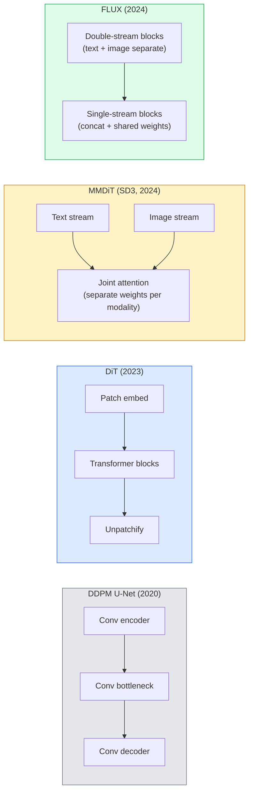

# 扩散 Transformer 与整流流

> U-Net 并不是扩散模型的秘密。把它换成 Transformer，再用直线路径的流替换噪声调度，就得到了 SD3、FLUX，以及 2026 年的每一种文生图模型。

**Type:** 学习 + 构建
**Languages:** Python
**Prerequisites:** 第 4 阶段第 10 课（扩散 DDPM）、第 4 阶段第 14 课（ViT）、第 7 阶段第 02 课（自注意力）
**Time:** 约 75 分钟

## 学习目标

- 追踪从 U-Net DDPM（第 10 课）到 Diffusion Transformer（DiT）、MMDiT（SD3），再到单双流结合 DiT（FLUX）的演进
- 解释整流流：噪声与数据之间的直线路径为何能让模型用 20 步而不是 1000 步完成采样
- 实现一个微型 DiT 模块和一个整流流训练循环，两者都不超过 100 行
- 从架构、参数量和许可证角度区分不同模型变体（SD3、FLUX.1-dev、FLUX.1-schnell、Z-Image、Qwen-Image）

## 问题所在

第 10 课构建了一个使用 U-Net 去噪器的 DDPM。这个方案在 2020–2023 年占据主导地位：U-Net + beta 调度 + 噪声预测损失，并催生了 Stable Diffusion 1.5、2.1 和 DALL-E 2。

到了 2026 年，每个顶尖文生图模型都已越过这套方案。Stable Diffusion 3、FLUX、SD4、Z-Image、Qwen-Image、Hunyuan-Image 没有一个使用 U-Net，而是采用 Diffusion Transformer（DiT）。SD3 与 FLUX 还用整流流替换 DDPM 噪声调度，把噪声到数据的路径拉直，并通过一致性或蒸馏变体实现 1–4 步推理。

这次转变意义重大，因为正是它让扩散式图像生成变得可控、准确遵循提示词（SD3/SD4 解决了文字渲染问题），并达到生产级速度。理解 DiT + 整流流，也就理解了 2026 年的生成图像技术栈。

## 核心概念

### 从 U-Net 到 Transformer



- **DiT**（Peebles 与 Xie，2023）——用类似 ViT、处理潜在 Patch 的 Transformer 替换 U-Net，并通过自适应层归一化（AdaLN）注入条件。
- **MMDiT**（SD3，Esser 等，2024）——文本 Token 与图像 Token 分别使用独立权重流，但共享一次联合注意力。
- **FLUX**（Black Forest Labs，2024）——前 N 个模块像 SD3 一样使用双流，后续模块则拼接两种模态并共享权重，也就是单流，以提高更深网络的效率。
- **Z-Image**（2025）——一个高效的 60 亿参数单流 DiT，对“无条件堆规模”这一思路提出挑战。

### 一段话理解整流流

DDPM 把前向过程定义为一个含噪 SDE，其中 `x_t` 会逐渐受损；学习得到的反向过程则是另一个 SDE，需要通过 1000 个小步骤求解。

整流流在干净数据与纯噪声之间定义一条**直线**插值路径：

```
x_t = (1 - t) * x_0 + t * epsilon,     t in [0, 1]
```

训练网络预测速度 `v_theta(x_t, t) = epsilon - x_0`，也就是从干净数据沿直线路径指向噪声的前向方向（`dx_t/dt`）。采样时，对这个速度反向积分，从噪声逐步走向数据。得到的 ODE 更接近直线，因此采样所需积分步数大幅减少。

SD3 把它称为**整流流匹配**。FLUX、Z-Image 和大多数 2026 年模型使用相同目标。典型推理只需 20–30 个确定性 Euler 步，而旧 DDPM 体系下的 DDIM 需要 50 步以上；经过蒸馏的 Turbo、Schnell、LCM 变体甚至只需 1–4 步。

### AdaLN 条件注入

DiT 通过**自适应层归一化**注入时间步和类别/文本条件：根据条件向量预测 `scale` 和 `shift`，再将它们应用于 LayerNorm 输出。相比 U-Net 中的 FiLM 风格调制，它更加简洁，是每个现代 DiT 的默认方案。

```
cond -> MLP -> (scale, shift, gate)
norm(x) * (1 + scale) + shift, then residual add * gate
```

### SD3 与 FLUX 的文本编码器

- **SD3** 使用三个文本编码器：两个 CLIP 模型 + T5-XXL。嵌入经过拼接，再作为文本条件送入图像流。
- **FLUX** 使用一个 CLIP-L + T5-XXL。
- **Qwen-Image / Z-Image** 变体使用与各自基础 LLM 对齐的自研文本编码器。

相比 SD1.5，SD3/FLUX 能够更准确理解提示词，文本编码器是重要原因之一；仅 T5-XXL 就有 47 亿参数。

### 无分类器引导仍然适用

整流流改变的是采样器，不是条件注入方式。无分类器引导仍以完全相同的方式工作：训练时以 10% 概率丢弃文本，推理时混合有条件与无条件预测。大多数 2026 年模型使用 3.5–5 的引导尺度，低于 SD1.5 的 7.5，因为整流流模型默认就能更严格遵循提示词。

### Consistency、Turbo、Schnell 与 LCM

这四个名称表达的是同一个思路：把缓慢的多步模型蒸馏成快速的少步模型。

- **LCM（Latent Consistency Model）**——训练学生模型，一步预测最终 `x_0`，输入可以是任意中间 `x_t`。
- **SDXL Turbo / FLUX schnell**——使用对抗式扩散蒸馏训练的 1–4 步模型。
- **SD Turbo**——把 OpenAI 风格 Consistency Models 应用到潜在扩散。

任何新模型用于生产服务时，通常会同时发布“完整质量”检查点与“Turbo / Schnell”变体。Schnell 在德语中意为“快速”，是 Black Forest Labs 的命名约定；它只需 1–4 步即可运行，适合实时流水线。

### 2026 年模型版图

| 模型 | 规模 | 架构 | 许可证 |
|-------|------|--------------|---------|
| Stable Diffusion 3 Medium | 2B | MMDiT | SAI Community |
| Stable Diffusion 3.5 Large | 8B | MMDiT | SAI Community |
| FLUX.1-dev | 12B | 双流 + 单流 DiT | 非商业用途 |
| FLUX.1-schnell | 12B | 相同架构，经过蒸馏 | Apache 2.0 |
| FLUX.2 | — | FLUX.1 迭代版 | 混合 |
| Z-Image | 6B | S3-DiT（可扩展单流） | 宽松许可证 |
| Qwen-Image | 约 20B | DiT + Qwen 文本塔 | Apache 2.0 |
| Hunyuan-Image-3.0 | 约 80B | DiT | 研究用途 |
| SD4 Turbo | 3B | DiT + 蒸馏 | SAI Commercial |

FLUX.1-schnell 是 2026 年的开源默认选择，Z-Image 是效率领先者，FLUX.2 和 SD4 则代表当前质量上限。

### 这次范式转变为何重要

DDPM + U-Net 可以工作，而 DiT + 整流流能够做得**更好、更快，并且更容易扩展**。这与 NLP 从 RNN 转向 Transformer 的过程相似：两种架构都能解决同一个问题，但 Transformer 更容易扩展，因而最终占据主导地位。2026 年每篇图像、视频或三维生成论文，都采用 DiT 形态的去噪器，并通常搭配整流流目标；U-Net DDPM 如今主要用于教学，也就是第 10 课的定位。

```figure
cv3-rectified-flow
```

## 动手构建

### 第 1 步：带 AdaLN 的 DiT 模块

```python
import torch
import torch.nn as nn


class AdaLNZero(nn.Module):
    """
    Adaptive LayerNorm with a gate. Predicts (scale, shift, gate) from the conditioning.
    Init such that the whole block starts as identity ("zero init").
    """

    def __init__(self, dim, cond_dim):
        super().__init__()
        self.norm = nn.LayerNorm(dim, elementwise_affine=False)
        self.mlp = nn.Linear(cond_dim, dim * 3)
        nn.init.zeros_(self.mlp.weight)
        nn.init.zeros_(self.mlp.bias)

    def forward(self, x, cond):
        scale, shift, gate = self.mlp(cond).chunk(3, dim=-1)
        h = self.norm(x) * (1 + scale.unsqueeze(1)) + shift.unsqueeze(1)
        return h, gate.unsqueeze(1)


class DiTBlock(nn.Module):
    def __init__(self, dim=192, heads=3, mlp_ratio=4, cond_dim=192):
        super().__init__()
        self.adaln1 = AdaLNZero(dim, cond_dim)
        self.attn = nn.MultiheadAttention(dim, heads, batch_first=True)
        self.adaln2 = AdaLNZero(dim, cond_dim)
        self.mlp = nn.Sequential(
            nn.Linear(dim, dim * mlp_ratio),
            nn.GELU(),
            nn.Linear(dim * mlp_ratio, dim),
        )

    def forward(self, x, cond):
        h, gate1 = self.adaln1(x, cond)
        a, _ = self.attn(h, h, h, need_weights=False)
        x = x + gate1 * a
        h, gate2 = self.adaln2(x, cond)
        x = x + gate2 * self.mlp(h)
        return x
```

`AdaLNZero` 从恒等映射开始，因为它的 MLP 权重被初始化为零。训练会让模块逐渐偏离恒等映射，这能显著稳定深层 Transformer 扩散模型。

### 第 2 步：微型 DiT

```python
def timestep_embedding(t, dim):
    import math
    half = dim // 2
    freqs = torch.exp(-math.log(10000) * torch.arange(half, device=t.device) / half)
    args = t[:, None].float() * freqs[None]
    return torch.cat([args.sin(), args.cos()], dim=-1)


class TinyDiT(nn.Module):
    def __init__(self, image_size=16, patch_size=2, in_channels=3, dim=96, depth=4, heads=3):
        super().__init__()
        self.patch_size = patch_size
        self.num_patches = (image_size // patch_size) ** 2
        self.patch = nn.Conv2d(in_channels, dim, kernel_size=patch_size, stride=patch_size)
        self.pos = nn.Parameter(torch.zeros(1, self.num_patches, dim))
        self.time_mlp = nn.Sequential(
            nn.Linear(dim, dim * 2),
            nn.SiLU(),
            nn.Linear(dim * 2, dim),
        )
        self.blocks = nn.ModuleList([DiTBlock(dim, heads, cond_dim=dim) for _ in range(depth)])
        self.norm_out = nn.LayerNorm(dim, elementwise_affine=False)
        self.head = nn.Linear(dim, patch_size * patch_size * in_channels)

    def forward(self, x, t):
        n = x.size(0)
        x = self.patch(x)
        x = x.flatten(2).transpose(1, 2) + self.pos
        t_emb = self.time_mlp(timestep_embedding(t, self.pos.size(-1)))
        for blk in self.blocks:
            x = blk(x, t_emb)
        x = self.norm_out(x)
        x = self.head(x)
        return self._unpatchify(x, n)

    def _unpatchify(self, x, n):
        p = self.patch_size
        h = w = int(self.num_patches ** 0.5)
        x = x.view(n, h, w, p, p, -1).permute(0, 5, 1, 3, 2, 4).reshape(n, -1, h * p, w * p)
        return x
```

### 第 3 步：整流流训练

```python
import torch.nn.functional as F

def rectified_flow_train_step(model, x0, optimizer, device):
    model.train()
    x0 = x0.to(device)
    n = x0.size(0)
    t = torch.rand(n, device=device)
    epsilon = torch.randn_like(x0)
    x_t = (1 - t[:, None, None, None]) * x0 + t[:, None, None, None] * epsilon

    target_velocity = epsilon - x0
    pred_velocity = model(x_t, t)

    loss = F.mse_loss(pred_velocity, target_velocity)
    optimizer.zero_grad()
    loss.backward()
    optimizer.step()
    return loss.item()
```

与 DDPM 的噪声预测损失（第 10 课）相比，结构相同，但目标不同。这里不是预测噪声 `epsilon`，而是预测**速度** `epsilon - x_0`，它沿直线插值路径从数据指向噪声。

### 第 4 步：Euler 采样器

整流流是一条 ODE。Euler 方法最为简单；对于训练良好的整流流模型，只要达到 20 步以上，它几乎与高阶求解器一样准确。

```python
@torch.no_grad()
def rectified_flow_sample(model, shape, steps=20, device="cpu"):
    model.eval()
    x = torch.randn(shape, device=device)
    dt = 1.0 / steps
    t = torch.ones(shape[0], device=device)
    for _ in range(steps):
        v = model(x, t)
        x = x - dt * v
        t = t - dt
    return x
```

只需 20 步。模型训练完成后，生成结果可以与 1000 步 DDPM 相当。

### 第 5 步：端到端冒烟测试

```python
import numpy as np

def synthetic_blobs(num=200, size=16, seed=0):
    rng = np.random.default_rng(seed)
    out = np.zeros((num, 3, size, size), dtype=np.float32)
    yy, xx = np.meshgrid(np.arange(size), np.arange(size), indexing="ij")
    for i in range(num):
        cx, cy = rng.uniform(4, size - 4, size=2)
        r = rng.uniform(2, 4)
        mask = (xx - cx) ** 2 + (yy - cy) ** 2 < r ** 2
        colour = rng.uniform(-1, 1, size=3)
        for c in range(3):
            out[i, c][mask] = colour[c]
    return torch.from_numpy(out)
```

使用整流流在这份数据上训练 `TinyDiT`。经过 500 步后，采样输出应该呈现出淡淡的彩色斑块。

## 实际应用

使用 `diffusers` 运行 FLUX / SD3 / Z-Image 等真实图像生成模型，它以统一 API 提供全部模型：

```python
from diffusers import FluxPipeline, StableDiffusion3Pipeline
import torch

pipe = FluxPipeline.from_pretrained(
    "black-forest-labs/FLUX.1-schnell",
    torch_dtype=torch.bfloat16,
).to("cuda")

out = pipe(
    prompt="a golden retriever surfing a tsunami, hyperrealistic, studio lighting",
    guidance_scale=0.0,           # schnell was trained without CFG
    num_inference_steps=4,
    max_sequence_length=256,
).images[0]
out.save("surf.png")
```

三行代码即可使用四步版 `FLUX.1-schnell`。把模型 ID 换成 `black-forest-labs/FLUX.1-dev`，即可配合 CFG 以 20–30 步获得更高质量。

对于 SD3：

```python
pipe = StableDiffusion3Pipeline.from_pretrained(
    "stabilityai/stable-diffusion-3.5-large",
    torch_dtype=torch.bfloat16,
).to("cuda")
out = pipe(prompt, guidance_scale=3.5, num_inference_steps=28).images[0]
```

## 交付成果

本课会产出：

- `outputs/prompt-dit-model-picker.md`——根据质量、延迟和许可证约束，在 SD3、FLUX.1-dev、FLUX.1-schnell、Z-Image、SD4 Turbo 之间作出选择。
- `outputs/skill-rectified-flow-trainer.md`——使用 AdaLN DiT 与 Euler 采样编写完整整流流训练循环。

## 练习

1. **（简单）** 在合成斑块数据集上训练上述 TinyDiT 500 步，比较使用 10、20 和 50 个 Euler 步生成的样本。
2. **（中等）** 通过把可学习类别嵌入拼接到时间嵌入中来增加文本条件，使用颜色区分 10 个斑块“类别”。分别采样类别 0、5、9，验证颜色匹配。
3. **（困难）** 在相同数据上用相同步数训练相同规模网络的整流流与 DDPM 版本，计算两者生成样本之间的 Fréchet 距离（FID 近似），报告哪一种收敛更快。

## 关键术语

| 术语 | 人们常说 | 实际含义 |
|------|----------------|----------------------|
| DiT | “扩散 Transformer” | 取代 U-Net 充当扩散去噪器、处理已划分为 Patch 的潜变量的 Transformer |
| AdaLN | “自适应层归一化” | 通过 LayerNorm 后的可学习 Scale、Shift 和 Gate 注入时间步/文本条件，是每个现代 DiT 的标准组件 |
| MMDiT | “多模态 DiT（SD3）” | 文本与图像 Token 使用独立权重流，但共享联合自注意力 |
| 单流/双流 | “FLUX 技巧” | 前 N 个模块使用双流，每种模态各自拥有权重；后续模块使用单流，拼接后共享权重，以提高效率 |
| 整流流 | “噪声到数据的直线” | 在数据与噪声之间线性插值，由网络预测速度，推理只需更少 ODE 步骤 |
| 速度目标 | “epsilon - x_0” | 整流流中的回归目标，方向从干净数据指向噪声 |
| CFG 引导 | “无分类器引导” | 混合有条件与无条件预测，整流流模型仍然使用它 |
| Schnell / Turbo / LCM | “1–4 步蒸馏” | 从完整质量模型蒸馏得到的少步变体，用于生产级实时生成 |

## 延伸阅读

- [《Scalable Diffusion Models with Transformers》（Peebles 与 Xie，2023）](https://arxiv.org/abs/2212.09748)——DiT 论文
- [《Scaling Rectified Flow Transformers》（Esser 等，SD3 论文）](https://arxiv.org/abs/2403.03206)——大规模 MMDiT 与整流流
- [FLUX.1 模型卡与技术报告（Black Forest Labs）](https://huggingface.co/black-forest-labs/FLUX.1-dev)——单双流架构细节
- [《Z-Image: Efficient Image Generation Foundation Model》（2025）](https://arxiv.org/html/2511.22699v1)——60 亿参数单流 DiT
- [《Elucidating the Design Space of Diffusion》（Karras 等，2022）](https://arxiv.org/abs/2206.00364)——各种扩散设计权衡的参考资料
- [《Latent Consistency Models》（Luo 等，2023）](https://arxiv.org/abs/2310.04378)——LCM-LoRA 如何实现四步推理
