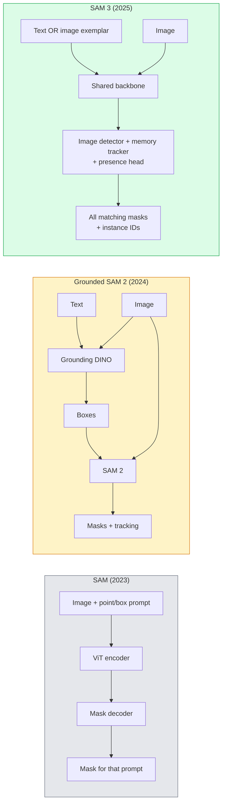

# SAM 3 与开放词汇分割

> 向模型提供文本提示和图像，即可得到所有匹配物体的掩码。SAM 3 让这一切只需一次前向传播。

**Type:** 使用 + 构建
**Languages:** Python
**Prerequisites:** 第 4 阶段第 07 课（U-Net）、第 4 阶段第 08 课（Mask R-CNN）、第 4 阶段第 18 课（CLIP）
**Time:** 约 60 分钟

## 学习目标

- 区分 SAM（只接受视觉提示）、Grounded SAM / SAM 2（检测器 + SAM）和 SAM 3（通过 Promptable Concept Segmentation 原生接受文本提示）
- 解释 SAM 3 架构：共享骨干网络 + 图像检测器 + 基于记忆的视频追踪器 + 存在性 Head + 解耦的检测器—追踪器设计
- 使用 Hugging Face `transformers` 中的 SAM 3 集成，实现文本提示驱动的检测、分割和视频追踪
- 根据延迟、概念复杂度和部署目标，在 SAM 3、Grounded SAM 2、YOLO-World 和 SAM-MI 之间作出选择

## 问题所在

2023 年的 SAM 只能接受视觉提示：点击一个点或画一个框，它就返回对应掩码。如果想说“找出这张照片中的所有橙子”，就需要先由检测器（Grounding DINO）生成边界框，再让 SAM 分割每一个框。Grounded SAM 把两者组合成一条流水线，但它仍是两个冻结模型组成的级联，不可避免地会累积误差。

SAM 3（Meta，2025 年 11 月，ICLR 2026）把这条级联合并起来。它接受短名词短语或图像示例作为提示，并在一次前向传播中返回所有匹配掩码与实例 ID。这就是**可提示概念分割（Promptable Concept Segmentation，PCS）**。再结合 2026 年 3 月的 Object Multiplex 更新（SAM 3.1），它可以高效追踪视频中同一概念的多个实例。

本课关注这一变化所代表的结构转型：二维分割、检测与图文 Grounding 已经融合到一个模型中。生产问题不再是“应该串联哪条流水线”，而是“哪个可提示模型可以端到端处理我的场景”。

## 核心概念

### 三代模型



### 可提示概念分割

“概念提示”可以是一个短名词短语，例如 `"yellow school bus"`、`"striped red umbrella"`、`"hand holding a mug"`，也可以是一张示例图像。模型会返回图像中符合该概念的每个实例对应的分割掩码，并为每项匹配赋予唯一实例 ID。

与经典的视觉提示 SAM 相比，它有三点不同：

1. 不需要逐实例提示——一个文本提示会返回全部匹配项。
2. 开放词汇——概念可以是任何能够用自然语言描述的对象。
3. 一次返回多个实例，而不是每个提示只返回一个掩码。

### 关键架构组件

- **共享骨干网络**——一个 ViT 处理图像，检测 Head 与基于记忆的追踪器都读取它的输出。
- **存在性 Head**——先预测图像中是否存在该概念，把“这里有吗？”与“它在哪里？”解耦，从而减少概念不存在时的假阳性。
- **解耦的检测器—追踪器**——图像级检测和视频级追踪使用不同 Head，避免相互干扰。
- **记忆库**——跨帧保存每个实例的特征，用于视频追踪，与 SAM 2 使用的机制相同。

### 大规模训练

SAM 3 在**四百万个独特概念**上训练，这些概念由数据引擎通过 AI + 人工复核进行迭代标注和纠正。新的 **SA-CO 基准**包含 27 万个独特概念，规模是此前开放词汇基准的 50 倍。在 SA-CO 上，SAM 3 达到人类表现的 75%–80%，并在图像 + 视频 PCS 上把现有系统的性能提高一倍。

### SAM 3.1 对象多路复用（Object Multiplex）

2026 年 3 月更新：**Object Multiplex** 引入共享记忆机制，可以一次联合追踪同一概念的许多实例。此前追踪 N 个实例需要 N 个独立记忆库；Multiplex 把它们合并成一个共享记忆，并使用逐实例查询。结果是在不牺牲准确率的情况下，显著提高多目标追踪速度。

### 2026 年 Grounded SAM 仍适用的场景

- 需要替换成某个特定开放词汇检测器，例如 DINO-X 或 Florence-2。
- SAM 3 在 Hugging Face 上受限访问的许可证构成障碍。
- 需要比 SAM 3 所暴露接口更细致地控制检测器阈值。
- 需要对检测组件本身开展研究或消融实验。

模块化流水线仍有价值；对大多数生产任务而言，SAM 3 是更简单的答案。

### YOLO-World 与 SAM 3

- **YOLO-World**——只做开放词汇检测，不生成掩码。速度快，适合实时任务。
- **SAM 3**——提供完整分割与追踪。速度较慢，但输出信息更丰富。

生产场景可以这样划分：只需高速边界框的流水线，例如机器人导航和实时仪表盘，使用 YOLO-World；需要掩码或追踪的任务使用 SAM 3。

### SAM-MI 的效率

SAM-MI（2025–2026）针对 SAM 的解码器瓶颈进行优化，核心思想包括：

- **稀疏点提示**——使用少量精心选择的点，而不是稠密提示，使解码器调用次数减少 96%。
- **浅层掩码聚合**——把粗略掩码预测合并成一张更清晰的掩码。
- **解耦掩码注入**——解码器接收预计算的掩码特征，无需重复运行。

结果是在开放词汇基准上，相比 Grounded-SAM 提速约 1.6 倍。

### 三种模型的输出格式

三者都返回大致相同的结构：边界框 + 标签 + 分数 + 掩码 + ID。这一点很有帮助，因为下游流水线无需根据实际运行的模型进行分支。

```figure
cv3-open-vocab
```

## 动手构建

### 第 1 步：构造提示

编写一个辅助函数，把用户句子转换成 SAM 3 概念提示列表。这是“用户输入的内容”与“模型接收的内容”之间的边界。

```python
def split_concepts(sentence):
    """
    Heuristic splitter for multi-concept prompts.
    Returns list of short noun phrases.
    """
    for sep in [",", ";", "and", "or", "&"]:
        if sep in sentence:
            parts = [p.strip() for p in sentence.replace("and ", ",").split(",")]
            return [p for p in parts if p]
    return [sentence.strip()]

print(split_concepts("cats, dogs and balloons"))
```

SAM 3 每次前向传播接收一个概念。对于多概念查询，可以循环处理或将它们组成批次。

### 第 2 步：后处理辅助函数

把 SAM 3 的原始输出转换成干净的检测结果列表，并遵循第 4 阶段第 16 课定义的流水线契约。

```python
from dataclasses import dataclass
from typing import List

@dataclass
class ConceptDetection:
    concept: str
    instance_id: int
    box: tuple          # (x1, y1, x2, y2)
    score: float
    mask_rle: str       # run-length encoded


def rle_encode(binary_mask):
    flat = binary_mask.flatten().astype("uint8")
    runs = []
    prev, count = flat[0], 0
    for v in flat:
        if v == prev:
            count += 1
        else:
            runs.append((int(prev), count))
            prev, count = v, 1
    runs.append((int(prev), count))
    return ";".join(f"{v}x{c}" for v, c in runs)
```

RLE 即使面对大量高分辨率掩码，也能让响应载荷保持较小。同一种格式适用于 SAM 2、SAM 3 和 Grounded SAM 2。

### 第 3 步：统一开放词汇分割接口

无论使用哪种后端（SAM 3、Grounded SAM 2、YOLO-World + SAM 2），都封装在同一个方法之后。切换后端时，下游代码无需改变。

```python
from abc import ABC, abstractmethod
import numpy as np

class OpenVocabSeg(ABC):
    @abstractmethod
    def detect(self, image: np.ndarray, concept: str) -> List[ConceptDetection]:
        ...


class StubOpenVocabSeg(OpenVocabSeg):
    """
    Deterministic stub used for pipeline testing when real models are not loaded.
    """
    def detect(self, image, concept):
        h, w = image.shape[:2]
        return [
            ConceptDetection(
                concept=concept,
                instance_id=0,
                box=(w * 0.2, h * 0.3, w * 0.5, h * 0.8),
                score=0.89,
                mask_rle="0x100;1x50;0x200",
            ),
            ConceptDetection(
                concept=concept,
                instance_id=1,
                box=(w * 0.55, h * 0.25, w * 0.85, h * 0.75),
                score=0.74,
                mask_rle="0x80;1x40;0x220",
            ),
        ]
```

真正的 `SAM3OpenVocabSeg` 子类会包装 `transformers.Sam3Model` 和 `Sam3Processor`。

### 第 4 步：使用 Hugging Face SAM 3（参考）

真实模型可以通过 `transformers` 集成调用：

```python
from transformers import Sam3Processor, Sam3Model
import torch

processor = Sam3Processor.from_pretrained("facebook/sam3")
model = Sam3Model.from_pretrained("facebook/sam3").eval()

inputs = processor(images=pil_image, return_tensors="pt")
inputs = processor.set_text_prompt(inputs, "yellow school bus")

with torch.no_grad():
    outputs = model(**inputs)

masks = processor.post_process_masks(
    outputs.masks, inputs.original_sizes, inputs.reshaped_input_sizes
)
boxes = outputs.boxes
scores = outputs.scores
```

一个提示，一次调用即可返回全部匹配项。

### 第 5 步：衡量 Grounded SAM 2 原本提供的价值

进行一次诚实的基准比较：在真实流水线中，用 SAM 3 替换 Grounded SAM 2 后会发生什么？

- 延迟：SAM 3 省去一次独立检测器的前向传播，但自身模型更重；总体通常持平或略有加速。
- 准确率：SAM 3 在罕见或组合式概念上明显更好，例如“带条纹的红色雨伞”；在常见单词概念上表现相近。
- 灵活性：Grounded SAM 2 允许更换检测器，例如 DINO-X、Florence-2、Grounding DINO 1.5；SAM 3 则是单体模型。

结论是：SAM 3 是 2026 年开放词汇分割的默认选择；当需要灵活替换检测器或使用不同许可证条款时，Grounded SAM 2 仍然是正确答案。

## 实际应用

生产部署模式包括：

- **实时标注**——SAM 3 + CVAT 的“标签作为文本提示”功能。标注人员选择标签名称，SAM 3 自动预标注全部匹配实例，再由人工审核和修正。
- **视频分析**——使用 SAM 3.1 Object Multiplex 进行多目标追踪，把视频帧送入基于记忆的追踪器。
- **机器人**——把 SAM 3 用作开放词汇操作的规划原语，例如“拿起红色杯子”。
- **医学影像**——在医学概念上微调 SAM 3；需要在 Hugging Face 申请访问权限。

Ultralytics 在其 Python 包中封装了 SAM 3：

```python
from ultralytics import SAM

model = SAM("sam3.pt")
results = model(image_path, prompts="yellow school bus")
```

接口与 YOLO 和 SAM 2 相同。

## 交付成果

本课会产出：

- `outputs/prompt-open-vocab-stack-picker.md`——根据延迟、概念复杂度和许可证，在 SAM 3 / Grounded SAM 2 / YOLO-World / SAM-MI 中作出选择的提示词。
- `outputs/skill-concept-prompt-designer.md`——把用户表达转换成规范 SAM 3 概念提示的技能，包括拆分、消歧和回退策略。

## 练习

1. **（简单）** 使用自选概念提示，在 10 张图像上运行 SAM 3，并与同一批图像上的 SAM 2 + Grounding DINO 1.5 比较，报告每个模型漏掉了哪些概念。
2. **（中等）** 在 SAM 3 上构建一个“点击以包含/点击以排除”界面：文本提示返回候选实例，用户点击保留哪些实例应算作正样本，最终把概念集合输出为 JSON。
3. **（困难）** 使用自定义概念集微调 SAM 3，例如 5 类电子元件，每类 20 张带标签图像。在同一测试集上与零样本 SAM 3 比较，并测量掩码 IoU 的提升。

## 关键术语

| 术语 | 人们常说 | 实际含义 |
|------|----------------|----------------------|
| 开放词汇分割 | “通过文本分割” | 为自然语言描述的物体生成掩码，而不是局限于固定标签集 |
| PCS | “Promptable Concept Segmentation” | SAM 3 的核心任务——给定名词短语或图像示例，分割所有匹配实例 |
| 概念提示 | “文本输入” | 短名词短语或图像示例，而不是完整句子 |
| 存在性 Head | “它在这里吗？” | SAM 3 中先判断概念是否存在，再进行定位的模块 |
| SA-CO | “SAM 3 基准” | 包含 27 万个概念的开放词汇分割基准，规模是此前基准的 50 倍 |
| Object Multiplex | “SAM 3.1 更新” | 基于共享记忆的多目标追踪，可快速联合追踪多个实例 |
| Grounded SAM 2 | “模块化流水线” | 检测器 + SAM 2 级联；需要替换检测器时仍有价值 |
| SAM-MI | “高效 SAM 变体” | 通过 Mask Injection，相比 Grounded-SAM 提速 1.6 倍 |

## 延伸阅读

- [《SAM 3: Segment Anything with Concepts》（arXiv 2511.16719）](https://arxiv.org/abs/2511.16719)
- [SAM 3.1 Object Multiplex（Meta AI，2026 年 3 月）](https://ai.meta.com/blog/segment-anything-model-3/)
- [Hugging Face 上的 SAM 3 模型页面](https://huggingface.co/facebook/sam3)
- [Grounded SAM 2 教程（PyImageSearch）](https://pyimagesearch.com/2026/01/19/grounded-sam-2-from-open-set-detection-to-segmentation-and-tracking/)
- [Ultralytics SAM 3 文档](https://docs.ultralytics.com/models/sam-3/)
- [《SAM3-I: Instruction-aware SAM》（arXiv 2512.04585）](https://arxiv.org/abs/2512.04585)
